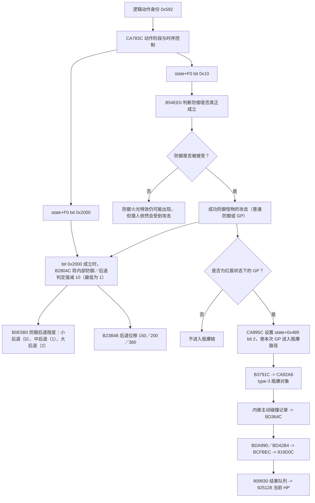

# MH4G 盾斧快速变形斩 GP 修改研究：当前状态


## 2026-08-14：v4 第五层补充——`FUN_00AEE770` 实际调用点未请求 `0592`

在定向 `AEE784` 中段 logger 造成卡死/SIGSEGV、Azahar GDB remote 会话损坏后，用户关闭旧实验金手指并完全重启 GDB/Azahar；重新进入任务地图后的只读 A/B status 确认当前为干净正式 v3 A：五个正式 hook 与 overlay 签名全部正确，`00CA82EC=EA0496BC`，五状态字精确为 `0,0,0,0,0`。崩溃进程没有继续，也没有在新进程安装任何诊断 logger。

随后仅使用既有离线反汇编复核 `FUN_00AEE770` 的实际调用者。盾斧主动作层已经定位的四个调用分别请求 `057C`（`C93110`）、`057A`（`C931B4`）、`059F`（`C94350`；`r10` 在 `C94218` 由固定 literal `059F` 初始化）和 `056B`（`CAB1E4`）。另一个已观测通用调用簇 `343D6C/343D84/343D9C` 的三个 literal 从 runtime binary 解码为 `0503/0509/0596`。所有已定位调用均未请求 `0592`。

因此 `FUN_00AEE770` 虽然从能力上可以比较当前 `0583/0592`，但当前没有证据表明快速变形相关调用实际询问 `0592`，更没有证据把该布尔结果连接到瓶爆；该路线降级为“理论可区分但无实际差分证据”的旁支。此前 `AEE784` 中段 equality logger 明确禁止再次安装。详细调用点表与安全结论见 `reports/mh4g_v4_motion_id_equality_callsite_assessment.md`。下一步回到已证实的接触身份差异，从 `player+0x244` 的 `0592/0583` 被盾斧专用副作用或事件提交逻辑消费的位置继续收缩，不再继续枚举通用 getter/equality 噪音。

第五层下一项改为观察 `CA9154` 的两个原生盾斧调用边 `00CA9DE0/00CAB178`。早期在通用防御结果后单独注入 `CA9154` 的阴性结果，只排除脱离原生时序的独立调用充分性，并未回答正式 A 与旧 B 是否自然经过这些调用。新的 `scripts/build_mh4g_v4_ca9154_native_call_logger.py` 已离线生成一个 JIT-safe 极小计数器：保留两个原始 `BLNE` 的 NE 条件，保存并恢复 `r0-r3/r12/lr` 与 CPSR flags，只在调用真实发生时分别递增 `DCDF40/DCDF44`，随后进入原始 `CA9154` 并保留返回 LR；不读取任何动态指针，也不 hook 函数中段。264-byte tail SHA-256 为 `886921A89D695E2624CD8A4608FC4266746BFCDB95E283DE62A1BDDF6ECA4328`，条件码、分支目标、返回地址、寄存器/flags 和零日志均离线 PASS，详见 `reports/mh4g_v4_ca9154_native_call_logger.md` 与 build validation。当前运行时仍是干净正式 A、五状态字全零、无 logger；下一步只运行 `scripts/preflight_mh4g_v4_ca9154_native_call_logger.gdb`，在导出的 264-byte tail 被离线确认全零前禁止安装。

`CA9154` 原生调用边记录器的正式 A 预检现已通过：`CA82EC=EA0496BC`，两个调用点保持原始 `CA9DE0=1BFFFCDB`、`CAB178=1BFFF7F5`，tail 两端读回全零。GDB 导出的 `reports/mh4g_v4_ca9154_native_call_logger_tail_preflight.bin` 已离线核对为精确 264 bytes、非零 byte 数 0、SHA-256 `44B8AA4D28701168922ACF61435EA4BB442F97B0B14AD7A2510ED68874EE2A72`。当前仍未安装 logger，也未恢复游戏；允许在人物完全静止、GDB 暂停的现场运行 `scripts/install_mh4g_v4_ca9154_native_call_logger.gdb`。安装读回确认前禁止输入 `c`。

正式 A 现场已安装 `CA9154` 原生调用边记录器并完整读回：`CA9DE0=1B049044`、`CAB178=1B048B61`；两个入口分别为 `E92D500F/E3A0C001/EA000002` 与 `E92D500F/E3A0C002/EAFFFFFF`；`DCDF40` 的两个计数器为 `0/0`，签名为 `34313543`。安装状态与离线镜像精确匹配。当前 CPU JIT 可保持开启，旧实验金手指关闭，人物静止、GDB 暂停；下一步只做一次安全区域、不推动左摇杆、无怪物接触的快速变形透明性 smoke，确认动画正常且只播放一次。结束完全静止后暂停并读取 `scripts/read_mh4g_v4_ca9154_native_call_log.gdb`；首轮禁止做 GP。

正式 A 的 `CA9154` 记录器无接触透明性 smoke 已通过：不推动左摇杆的快速变形动画正常、只播放一次并正常结束；读回 `count_CA9DE0=0`、`count_CAB178=0`，两个 hook 仍为 `1B049044/1B048B61`，签名十进制 `875640131` 即 `34313543`。因此单纯完成快速变形动作不会自然经过这两个 `CA9154` 调用边。旧实验金手指必须继续关闭，不能与正式 A 混用；下一步清空计数后采集一个正式 A 的红盾快速 GP 成功样本，优先小后退、有瓶爆，结束静止后立即暂停并读取。被击飞、未正面接触或受到第二只怪物干扰的样本作废并重新清空。

正式 A 的首个成功接触样本 A1 已完成：不推动左摇杆的快速 GP 成功、明确出现红盾瓶爆并为小后退；清空后立即测试的两个计数仍精确为 `count_CA9DE0=0`、`count_CAB178=0`，hook 与签名保持正确。由此形成强阴性证据：至少在该次真实产生瓶爆的 GP 中，瓶爆并不需要经过 `CA9DE0` 或 `CAB178` 的原生 `CA9154` 调用边；它们不能是本次瓶爆的必要生成路径。为排除单次动态样本偶然性，下一步在正式 A、旧金手指关闭条件下再清空并取得一个独立 A2 成功 GP/瓶爆样本；若仍为 `0/0`，则恢复 logger 并正式关闭 `CA9154` 路线，无需为此切换 B。

正式 A 的独立复测 A2 同样为成功快速 GP、明确红盾瓶爆和小后退，两个计数再次为 `0/0`，hook 与签名继续正确。结合无接触 smoke、A1 与 A2，`00CA9DE0` 和 `00CAB178` 的原生 `CA9154` 调用边正式排除为该类红盾 GP 瓶爆的必要生成路径；无需切换 B。该结论也使早期“防御结果后单独注入 CA9154 无瓶爆”的阴性结果获得了原生调用层面的补强。下一步先在人物完全静止、GDB 暂停时运行 `scripts/restore_mh4g_v4_ca9154_native_call_logger.gdb`，核对两个原始 `BLNE` 与完整 tail 清零；恢复前禁止继续游戏。
`CA9154` 原生调用边 logger 已在 A2 后安全恢复：`00CA9DE0=1BFFFCDB`、`00CAB178=1BFFF7F5`，`00DCDEF8` 与 `00DCDFF8` 边界读回全零，输出 `MH4G_V4_CA9154_NATIVE_CALL_LOGGER_RESTORE_DONE`。因此当前运行时重新处于干净正式 v3 A，旧实验金手指关闭、无诊断 logger；正式结论为：无接触 smoke 与两次独立“快速 GP 成功／红盾瓶爆／小后退”样本中，这两个 `CA9154` 原生调用边始终均为零，故它们不是该类瓶爆的必要生成路径，本路线关闭，不做 B 侧重复。

下一层不再顺序枚举高频 getter caller，也不重开已排除的 mode gate、资源对象、事件、攻击记录或 `AEE784` 中段 equality hook。现有证据显示：成功接触时 A/B 已记录状态除主层逻辑 ID `0592/0583` 外一致；`00941334` setter 自身只保存 ID、解析资源并初始化通用轨道；已观察 getter caller 又大多属于通用比较/分派。为一次性判断“是否存在任一主 motion getter 消费者必须看到 0592”，已离线构建入口级诊断 `motion_getter_return_alias_test`：仅当 Action=`000B0400` 且真实主层 ID=`0592` 时，对 `AF1A10` 调用者返回 `0583`，不写实际 `player+0x244`，并保存 `r1-r3/r12/lr` 与 flags。264-byte tail SHA-256 为 `696105A7EE5215D4AF7ED47BAF3E858830E0382D3C9AC1EC302A9D0BB5E9BB8E`，零 tail SHA-256 为 `44B8AA4D28701168922ACF61435EA4BB442F97B0B14AD7A2510ED68874EE2A72`，分支、literal、过滤和现场保护离线 PASS。当前尚未写入运行时；下一步只运行只读 `scripts/preflight_mh4g_v4_motion_getter_return_alias_test.gdb`，并在导出的 264-byte tail 离线确认全零后才允许安装。首轮只做无接触动画 smoke；任何动画、姿态或结束异常都立即恢复，不进入 GP。

该 getter 返回值别名诊断的现场只读 preflight 已通过：`CA82EC=EA0496BC`，`AF1A10..AF1A18=E2800D09/E1D000B4/E12FFF1E`，tail 首尾读回全零。导出的 `reports/mh4g_v4_motion_getter_return_alias_tail_preflight.bin` 已离线核对为精确 264 bytes、非零 byte 数 0、SHA-256 `44B8AA4D28701168922ACF61435EA4BB442F97B0B14AD7A2510ED68874EE2A72`。当前仍未安装诊断；允许在人物完全静止、GDB 暂停、旧实验金手指关闭的同一现场运行 `scripts/install_mh4g_v4_motion_getter_return_alias_test.gdb`。安装读回确认前禁止输入 `c`。

getter 返回值别名诊断现已安装并由补充的完整只读 status 逐字核对通过：`AF1A10=EA0B7138 -> DCDEF8`，`DEF8..DF50` 的保存现场、真实 getter 重放、Action 地址计算、`000B0400` 与 `0592` 双过滤、`0583` 返回别名、计数递增、flags/寄存器恢复和 `bx lr` 全部匹配离线镜像；`DF60..DF6C` literals 为 `000B0400/00000592/00000583/00DCDF70`，计数为 0，签名 `4152474D`。当前旧实验金手指关闭、正式 A、人物静止、GDB 暂停。下一步只允许安全区域、不推动左摇杆、无怪物接触的一次快速变形 smoke；动画必须正确、只播放一次并正常结束。结束静止后暂停并读取 `scripts/read_mh4g_v4_motion_getter_return_alias_test.gdb`。任何卡顿、姿态、派生或结束异常都立即停止并恢复，不进入 GP。

第一候选在用户输入首次 `c` 后立即 `SIGSEGV PC=00000000`；再次输入 `c` 仍停在同一位置。离线复核确认构建错误：两个过滤失败 BNE 错误跳到 `DF4C`，跳过 `DF44` 对单独保存 CPSR 的弹出，导致随后通用 `pop` 栈错位并把 `lr` 从原 `r12` 槽恢复为 0。该结果完全解释 PC=0，不属于游戏机制证据。当前崩溃进程永久作废，禁止继续、禁止运行 restore、禁止读取即时存档；必须完全关闭 GDB/Azahar。修正版已把两个 BNE 目标改为 `DF44`，但尚未在新进程 preflight，旧镜像与旧安装状态永久停用。

用户随后完全关闭并重启 GDB/Azahar，正常进入任务地图后只读 A/B status 已确认新进程为干净正式 A：五 hook 为 `EA12326B/EB0B0340/EA0496BC/E3A02001+EA0496B4/EB048661`，overlay 签名及 `0592/0583` literals 全部正确，五状态字精确全零。第一候选崩溃进程没有继续或热恢复，旧实验金手指关闭。修正版 tail SHA-256 为 `E022E34663513E2627C937C26422DA2B91195D516FC7EF492ECB8A2D45FBD489`；下一步只重新运行 `scripts/preflight_mh4g_v4_motion_getter_return_alias_test.gdb`，在完整 264-byte tail 再次离线确认全零前不得安装。

修正版在该干净新进程的第二次 preflight 已通过：`CA82EC=EA0496BC`，原 getter 三字 `E2800D09/E1D000B4/E12FFF1E`，tail 首尾全零；重新导出的 264-byte 文件非零 byte 数 0，SHA-256 `44B8AA4D28701168922ACF61435EA4BB442F97B0B14AD7A2510ED68874EE2A72`。因此允许在当前人物完全静止、GDB 暂停、旧实验金手指关闭的现场安装修正版。安装完成后仍禁止直接 `c`，必须先核对完整读回，尤其两个修正后的失败分支应为 `DF20=1A000007`、`DF2C=1A000004`，均指向 `DF44` 的 CPSR 弹栈。

修正版现已安装并完整读回：`AF1A10=EA0B7138`，wrapper、Action/ID 双过滤、计数写入、CPSR/寄存器恢复、literals 和签名全部匹配新镜像；关键分支精确为 `DF20=1A000007` 与 `DF2C=1A000004`，均回到 `DF44`，计数初值 0、签名 `4152474D`。当前允许一次安全区域、不推动左摇杆、无怪物接触的快速变形 smoke。若出现 SIGSEGV、卡顿或任何异常，禁止再次 `c`；若动画正常单次结束，人物静止后暂停并读取 alias hit count。

修正版无接触 smoke 已通过：快速变形动画正常、只播放一次并正常结束；读回 `alias_hit_count=514`、hook `EA0B7138`、签名 `4152474D`，玩家根为 `0896AAD0`。因此 wrapper 确实在 Action `000B0400`、真实 ID `0592` 期间大量向调用者返回 `0583`，且没有破坏可见动画或动作结束。下一步在当前同一实例、旧实验金手指关闭、人物静止暂停时清零计数，随后采集一次不推动左摇杆、红盾、成功快速 GP 的样本，记录瓶爆与后退；若被击飞、非正面接触或红盾消失则样本作废并重新清零。另一个使用不同 GDB 端口的独立 Azahar 进程不会共享客体内存，但不得误向其 source 本任务写入脚本，也不得用它覆盖同一即时存档或运行时模组文件。

## 2026-08-13：v4 机制研究启动——第一版无瓶爆快速 GP 与正式 v3 严格 A/B

用户决定在现有三个 v3 正式包发布整理后启动 v4 机制研究。第一阶段不修改正式 v3 发布包，只比较第一版 `patches/fast_morph_guard_experimental.txt` 与当前 v3：第一版保持原生中性快速 `mode=1/Action 000B0400`，仅在 `state+F0=3` 时写入 `0x2013`，已证实具防御窗口与 GP 防御性能但没有红盾瓶爆；v3 则让同一快速输入走 `mode=0/logical 0x592` 的原生完整 GP 逻辑，再用资源 overlay 显示快速动画，具有瓶爆。

对照采用同一 v3 运行时切换：A 保持 `00CA82EC=EA0496BC` 且关闭旧金手指；B 在人物完全静止、五状态字全零时临时恢复 `00CA82EC=E3A01001` 并启用旧实验金手指。其余 v3 hook 在状态全零时只透传，因此 B 可复现第一版而无需更换整个 ExeFS。A/B 分短批次交替，每边优先取得 6–8 个有效成功防御样本，验证 A 稳定有瓶爆、B 稳定无瓶爆，并记录 Action、motion 前缀、F0、接触帧、结果 Action、后退等级和派生；被击飞或没有正面接触的样本作废。后续只做准备窗口与成功接触到结果提交前的有界调用指纹，不做整段 trace、大型日志或命中后字段盲猜。完整方案见 `reports/v4_v1_vs_v3_comparison_plan.md`。

用户明确补充实际测试边界：v3 不建议读取跨补丁状态的旧即时存档，怪物战斗为动态过程，无法保证 A/B 使用同一招式；测试将保持 CPU JIT 开启，并尽量筛选成功 GP 后小后退的样本。方案据此修正为重复动态 A/B，而非同招式严格配对：A/B 分短批次交替、每边优先取得 6–8 个成功防御样本；小后退为主比较层，中／大后退单独记录；被击飞、未正面接触和单次独有调用不得形成机制结论。JIT 开启时不依赖 breakpoint/watchpoint，正式数据使用固定容量 guest logger，GDB 只负责批次前后暂停、清空与读取。

现有排除边界继续有效：不得回到 `key 145B`、结果脚本／opcode、三条伴随事件槽、动作描述符、已排除状态字段、结果 `4→3` 充分性或通用虚表包装器。`00030500/00040500/00050500` 只按小／中／大后退等级记录，不视为瓶爆开关。长枪／铳枪对照推迟到盾斧内部 A/B 形成候选之后，只用于过滤通用格挡层。当前下一步是离线构建 A/B 身份预检、切换和有限状态日志；尚未安装新的运行时补丁，也没有产生新的 GP／瓶爆机制结论。

A/B 第一阶段控制脚本已离线建立，但尚未写入运行时。由于当前 Azahar GDB 已多次证明 breakpoint/watchpoint 与 convenience variable 均不可靠，实际入口改为纯固定读回 `scripts/status_mh4g_v4_v1_v3_ab.gdb`：它不设断点、不使用便利变量且不写客体内存。人工核对通过后，A→B 与 B→A 分别使用 `patches/mh4g_v4_switch_v3_to_v1_control.gdb`、`patches/mh4g_v4_switch_v1_control_to_v3.gdb` 加载极小 Intel HEX；前者只把 dormant marker 清零并恢复 `00CA82EC=E3A01001`，后者只恢复 `00CA82EC=EA0496BC`。切换脚本本身是固定写入，因此必须先提交只读 status，由人工确认五 hook、overlay 和安全五字；不得跳过预检直接运行。当前首步仅运行只读 status，尚未安装 guest logger，也未切换 A/B。

首次只读 A/B status 发现进程处于完全原版基线：五 hook 为 `E92D5FF0/EBFFA103/E3A01001/E3A02001+E1A01002/EBF96833`，overlay 与五字全零。这不是 B 对照，因为旧实验金手指并未开启，而是正式 v3 ExeFS 没有加载；因此没有执行任何切换写入。用户随后重新安装正式 JPN/汉化 v1.2 v3 并干净重启，在 CPU JIT 开启、未运行 GDB enable 的任务地图内再次 status：五 hook 精确为 `EA12326B/EB0B0340/EA0496BC/E3A02001+EA0496B4/EB048661`，overlay 签名与 `592/583` literal 全部匹配，五字精确全零。由此 A 组正式 v3 身份与自动加载已确认，允许先采集同会话 A 组短批次；尚未切到 B，也没有新的机制结论。

A 组正式 v3 第一短批次取得 3/3 个有效样本，均为不推动左摇杆的快速 GP、红盾瓶爆和小后退；测试中其他普通防御没有计入。批次结束完全静止后的五 hook/overlay 均完整，五字为安全 dormant `1,0,0,0,0`，说明资源、保存根和 prefix stage 已回收，不存在活动覆盖。该批次建立了同一会话 A 组的强阳性基线，但尚未形成 A/B 差分；下一步只在当前暂停现场运行固定 A→B 入口切换，先核对 `00CA82EC=E3A01001` 与五字全零，再允许开启旧实验金手指。

固定 A→B 入口切换已成功执行。读回 `00CA82EC=E3A01001`，五字精确为 `0,0,0,0,0`，并输出 `MH4G_V4_SWITCH_V3_TO_V1_CONTROL_FIXED_DONE`；当前尚未恢复游戏时，旧实验金手指仍关闭。由此 B 组控制入口准备完成：下一步开启 `[MH4G CB Fast Morph Guard Experimental]` 后恢复游戏，采集 3 个不推动左摇杆的有效快速 GP 样本；每个样本分别记录可见快速动画、瓶爆和后退等级。批次结束必须完全静止、暂停并先关闭旧实验金手指，再读取 A/B status；核对前不得切回 A。

B 组第一短批次取得 5/5 个有效的不推动左摇杆快速 GP，快速动画均正常且全部无瓶爆；B1–B3 为小后退，B4–B5 为中后退。用户明确说明 B4/B5 对应必须叠加技能防御性能+2、红盾防御性能+1 与 GP 附带防御性能+1 才能承受的高防性需求招式：成功 GP 后固定中后退，若 GP 失败则会大后退。因此 B4/B5 仍是成功 GP 样本，但只进入中后退分层，不与小后退主集合混算。批次结束完全静止、旧实验金手指关闭后的 status 显示 B 身份 `00CA82EC=E3A01001`、其余 v3 hook/overlay 完整、五字全零。当前已形成首轮强差分：A 小后退 3/3 有瓶爆，B 小后退 3/3 无瓶爆；另有 B 中后退 2/2 无瓶爆。下一步先固定切回 A 并核对，随后采集第二个 A 短批次以满足跨批次稳定性。

固定 B→A 切换已成功执行：旧实验金手指关闭后，`00CA82EC` 精确恢复为 `EA0496BC`，五字保持 `0,0,0,0,0`，并输出 `MH4G_V4_SWITCH_V1_CONTROL_TO_V3_FIXED_DONE`。当前同一进程已重新处于正式 v3 A 身份，不存在 B 状态残留。下一步采集第二个 A 短批次 3 个有效不推动左摇杆的快速 GP；以小后退为主，自然遇到中后退则独立登记，不刻意追逐怪物固定招式。

A 组第二短批次 A4–A6 随后被用户确认测试时忘记关闭第一版实验金手指，因此三项全部作废。它们实际属于“正式 v3 快速入口＋旧版 F0 `0x2013` 写入”的混合条件，不能计入纯 A 样本，也不能用于推断瓶爆来源。批次后 A 身份 hook/overlay 仍完整，五字为安全 dormant `1,0,0,0,0`；用户尚未执行下一次 A→B 切换。因此当前有效集合仍为 A 小后退 `3/3` 有瓶爆，B 小后退 `3/3` 无瓶爆，另有 B 中后退 `2/2` 无瓶爆。下一步保持 A 身份、暂停状态下先关闭旧实验金手指，再重做纯 A 第二短批次；不得先切到 B。

用户明确关闭旧实验金手指后重做纯 A 第二短批次 A4–A6。三次均保持正常快速动画、成功 GP、红盾瓶爆和小后退；批次后 `00CA82EC=EA0496BC`、正式 v3 其余 hook/overlay 完整，五字为安全 dormant `1,0,0,0,0`。因此纯 A 小后退集合现在跨两个短批次达到 `6/6` 有瓶爆。下一步在旧金手指仍关闭、人物完全静止且 GDB 暂停的当前现场切到 B，追加最后至少 3 个有效样本；切换输出核对前不得开启旧金手指或恢复游戏。

第二次固定 A→B 切换已成功：`00CA82EC=E3A01001`、五字全零，用户随后明确开启旧实验金手指。当前 B 身份准备完成但尚未提交第二批战斗结果。下一步恢复游戏并取得最后 3 个有效不推动左摇杆快速 GP；结束后安全静止、暂停并先关闭旧金手指，再读取 B status。核对完成前不得切回 A。

B 组第二短批次实际取得 6/6 个有效样本，快速动画均正常、成功 GP 且全部无瓶爆；其中 3 个小后退、3 个中后退。批次后 status 显示 B 身份 `00CA82EC=E3A01001`、共享 v3 hook/overlay 完整、五字全零。用户同时澄清上一轮 B status 读取时忘记关闭旧实验金手指：这不使 B 战斗样本失效，因为 B 条件本来要求金手指开启；它只解释了随后第一次 A4–A6 为什么成为混合条件，而那三项已作废并在明确关闭金手指后重测。累计纯 B 为 11/11 无瓶爆：小后退 6/6、中后退 5/5；纯 A 为小后退 6/6 有瓶爆。第一阶段动态表型差分现已跨批次、跨入口切换闭合。下一步必须明确关闭旧金手指并固定恢复正式 A，核对 `00CA82EC=EA0496BC` 与五字全零后，才允许设计第二阶段 guest logger。

用户明确关闭旧实验金手指后执行固定 B→A 恢复，读回 `00CA82EC=EA0496BC`、五字全零并输出 `MH4G_V4_SWITCH_V1_CONTROL_TO_V3_FIXED_DONE`。当前运行时已回到正式 v3 A 身份，第一阶段正式结束。

第二阶段首个有界 guest logger 已离线构建并静态 PASS，设计说明为 `reports/mh4g_v4_phase0_call_logger.md`。它仅 hook 六个调用：`00CAC374/3F8/410/428/440` 的 phase-0/mode-0 候选，以及 `00B0ABE8` 的小后退结果提交；只在 `Action=000B0400` 时记录。缓冲区位于正式 v3 未使用尾洞 `00DCDEF8..00DCDFFF`：最多保存 32 个 token 顺序和 6 个 32-bit 总计数，顺序满后停止追加但计数继续。264-byte 镜像 SHA-256 为 `0FC875CBC7FDE4A08B534C31A5F0B572333FDC6BDBC296C0C310227549DC1B53`；六个外部 hook→veneer、veneer→共同 wrapper、共同 wrapper→原目标、三个 literal 和零日志全部 PASS，详见 `reports/build_mh4g_v4_phase0_call_logger/validation.txt`。该 logger 不依赖 breakpoint/watchpoint/convenience variable，CPU JIT 可开启；尚未写入运行时。下一步只运行 `scripts/preflight_mh4g_v4_phase0_call_logger_fixed.gdb`，核对正式 v3、六个原 BL，并离线验证导出的 264-byte tail 全零；PASS 前禁止安装。

phase-0 logger 的纯 A/B 结果已闭合。纯 A 三次不推动左摇杆的成功快速 GP 均有瓶爆、小后退，调用序列分别为 `1,(2,4)×10`、容量饱和但总计数 `1,19,1,19,0,0`、以及 `1,(2,4)×8`；纯 B 三次同类成功快速 GP 均无瓶爆、小后退，且每次只有 token `1`。因此正式 A 会稳定进入两组反复的 mode-0 查询，而旧 B 在首次 motion 提交后完全跳过该块；token3 只偶发出现、token5 始终没有出现，不能把 helper 本身当作瓶爆必要调用。该 logger 随后已安全恢复，六个原调用字与 tail 全零均通过读回。这个结果定位了 A/B 的首个稳定结构差异，但仍没有定位瓶爆生成函数。

第二阶段随后转向全局事件派发器 `FUN_002F7F48`。只读 probe 确认入口前两条为 `E92D41F0/E1A04003`，264-byte tail 全零；由于入口到 tail 超出单字 ARM 分支范围，运行时采用 `E51FF004/00DCDEF8` 两字远跳，并在 wrapper 内重放原序言后返回 `002F7F50`。第一版事件日志器安装和执行 smoke 均稳定：快速动画正常、无异常，并成功派生一次回旋斩。但该轮在测试前被怪物击飞，之后又执行了两次快速变形和回旋斩，6 条容量全部被同一调用者 `LR=00CA8CC0`、`group=5/event=4E` 的普通玩家事件填满；Action 依次包含 `00000500`、多次 `00050604` 和 `00720604`。这些记录只证明 wrapper 安全，受击飞和混合动作污染，不能进入 A/B 机制比较。

为排除上述基线噪音，事件日志器 v2 已离线构建并静态 PASS：仍要求原始 `r3` 等于当前 Player，且只在当前 Action 为快速变形 `000B0400` 或小后退 `00030500` 时记录 `caller_lr/group/event/action`；容量为 5 条，日志范围 `00DCDFA0..00DCDFFF`。264-byte v2 镜像 SHA-256 为 `014E693E4DD0289A7E16A0D820D902DEBAF1A0FF4F2B36F5826BA2B630C7EEB0`，远跳、原序言重放、五个 literal、所有过滤/恢复分支和零日志均通过离线回算。当前客体仍安装第一版事件日志器，尚未写入 v2；下一步必须先在人物完全静止、GDB 暂停时运行恢复脚本，确认入口恢复 `E92D41F0/E1A04003` 且 tail 首尾全零，再安装 v2。不得直接用 v2 覆盖正在运行的 v1。

第一版事件日志器现已安全恢复：`002F7F48` 精确读回原始序言 `E92D41F0/E1A04003`，`00DCDEF8` 与 `00DCDFF8` 两端均为全零，脚本输出 `MH4G_V4_EVENT_DISPATCH_LOGGER_FIXED_RESTORE_DONE`。当前人物静止、GDB 暂停，正式 v3 其余运行时未改动；允许安装 v2 过滤版。安装完成读回确认前不得恢复游戏。

事件日志器 v2 已成功安装并逐字读回：入口为 `E51FF004/00DCDEF8`，wrapper 起始 `E92D41F0/E1A04003/E92D500F/E59F007C`，恢复段与 literals 为 `E8BD500F/E59FF00C/0106C3F4/000B0400/00030500/00DCDFA0/002F7F50`，签名 `32444534`，stored count 为 0。当前可进入单次执行 smoke。过滤器不会记录击飞后已经切换到其他 Action 的普通事件，但若怪物接触发生时 Action 尚为 `000B0400`，失败接触对应的事件仍可能被保存；因此任何被击飞样本都必须整批作废并清空，不能计入成功 GP 的 A/B 集合。

v2 首次执行 smoke 中，用户完成一次成功快速 GP，但接触前红盾刚好消失，因此明确没有瓶爆；该轮不能计入正式 A“红盾有瓶爆”样本。日志器保存两条完全相同的记录：`caller_lr=00CA8CC0`（调用点 `00CA8CBC`）、`group=5/event=4E`、`Action=00030500`，其余容量为零。由此确认 v2 的 Player/Action 过滤、记录布局和执行返回均正常；同时证明 `CA8CBC -> group 5/event 4E` 在无红盾瓶爆的成功快速 GP 小后退中也会出现，因此该事件本身不是红盾瓶爆的充分条件。下一步清空日志、重新建立红盾，再采集一轮正式 A 小后退有瓶爆样本。

v2 正式 A1 样本取得：不推动左摇杆、红盾、成功快速 GP、有瓶爆、小后退。三条记录依次为：`CA8CC0/group5/event4E/Action00030500`、`CA89F0/group5/event56/Action000B0400`、`CA8CC0/group5/event4E/Action00030500`；对应调用点分别为 `00CA8CBC`、`00CA89EC`、`00CA8CBC`。与前一轮无红盾、无瓶爆的小后退样本相比，共同的 event 4E 仍存在，而 event 56 只在当前有瓶爆样本出现。当前只能把 `00CA89EC -> group5/event56` 记为瓶爆相关候选，不能视为瓶爆生成函数或充分条件；下一步在纯 A 再重复两次，然后切到红盾纯 B 无瓶爆作路线严格对照。

纯 A2、A3 随后均为不推动左摇杆、红盾、成功快速 GP、有瓶爆、小后退，但两轮各自只记录一条 `CA8CC0/group5/event4E/Action00030500`，没有 `event56`。因此 A1 的 `00CA89EC -> group5/event56` 已被重复阳性样本否定为瓶爆必要事件，应按动态战斗附带事件处理，不继续追踪；早期保留事件槽中消费后出现的 `0x56` 也不能据此与当前派发 event 56 强行等同。`event4E` 在 A1–A3 有瓶爆样本与无红盾、无瓶爆 smoke 中均出现，故也不是瓶爆充分条件。当前事件派发 v2 在纯 A 三次阳性中没有找到稳定的瓶爆专属记录。下一步仍以相同 logger 采集红盾纯 B 成功快速 GP、无瓶爆、小后退，判断这一层是否存在稳定的路线 A/B 差分；若 B 同样只见 event4E，则正式停止该派发层路线。

切换纯 B 前的只读核对已通过：事件日志 count/首记录全零；五 hook 为正式 A `EA12326B/EB0B0340/EA0496BC/E3A02001+EA0496B4/EB048661`，overlay 与 `592/583` literals 完整，五状态字为允许的 dormant `1,0,0,0,0`。当前允许运行固定 A→B 切换；在切换读回确认前旧实验金手指必须保持关闭，且不得恢复游戏。

固定 A→B 切换已成功：`00CA82EC=E3A01001`，五状态字精确全零，输出 `MH4G_V4_SWITCH_V3_TO_V1_CONTROL_FIXED_DONE`。此前一次误用不存在的 `_fixed.gdb` 路径只产生 `No such file`，没有执行任何写入；随后使用实际文件 `patches/mh4g_v4_switch_v3_to_v1_control.gdb` 完成切换。当前为纯 B 控制入口，事件日志 v2 仍安装且已清空；下一步允许开启旧实验金手指并采集红盾、成功快速 GP、无瓶爆、小后退的 B1。击飞、中后退、红盾消失或出现瓶爆的样本不得计入主对照。

纯 B1 已取得：不推动左摇杆、红盾、成功快速 GP、明确无瓶爆、小后退。记录依次为 `CA89F0/group5/event56/Action000B0400`、`CA8B2C/group5/event4C/Action000B0400`、`CA8CC0/group5/event4E/Action00030500`，对应调用点 `00CA89EC/00CA8B28/00CA8CBC`。event56 由此在红盾无瓶爆 B 中也出现，结合 A2/A3 有瓶爆时缺失，已同时否定其必要性与充分性，不再作为瓶爆候选。event4E 继续作为多条件共有的小后退伴随事件。event4C 目前只在单个 B1 出现，暂列 B 路线候选，必须由 B2/B3 重复后才能形成 A/B 差分；下一步清空日志并以同样条件采集 B2。

纯 B2、B3 均为不推动左摇杆、红盾、成功快速 GP、明确无瓶爆、小后退。B2 序列为 `4E@00030500 -> 56@000B0400 -> 4E@00030500`，B3 只有 `4E@00030500`；B1 独有的 event4C 没有重复，故降级为动态附带事件。结合纯 A：A1 为 `4E->56->4E`，A2/A3 各只有 `4E`。因此 event56 在 A/B 两边都可出现或缺失，event4C 仅单次出现，event4E 则在有瓶爆、无瓶爆、无红盾条件中共同存在。事件派发 v2 没有找到任何稳定的瓶爆或路线 A/B 专属事件；`4C/4E/56` 均停止追踪，不扩大容量、不增加盲目事件过滤。当前纯 B 已完成，旧实验金手指仍开启、事件日志器 v2 仍安装，GDB 暂停；下一步先关闭旧金手指，再安全恢复事件 logger，随后核对并切回正式 A。

用户关闭旧实验金手指后，事件日志器 v2 已安全恢复：`002F7F48` 为原始 `E92D41F0/E1A04003`，tail 两端 `00DCDEF8/00DCDFF8` 全零，输出 `MH4G_V4_EVENT_DISPATCH_LOGGER_FIXED_RESTORE_DONE`。当前仍为 B 控制入口但已无 logger/金手指运行时残留，人物完全静止、GDB 暂停；下一步执行实际文件 `patches/mh4g_v4_switch_v1_control_to_v3.gdb` 固定切回 A，读回确认前不得恢复游戏。

固定 B→A 已完成：`00CA82EC=EA0496BC`，五状态字精确全零，输出 `MH4G_V4_SWITCH_V1_CONTROL_TO_V3_FIXED_DONE`。当前正式 A 已恢复，旧实验金手指关闭，phase-0 logger 与事件派发 logger 均已恢复，两个 tail 均无运行时残留；本轮动态 A/B 会话安全闭环。

事件派发路线结束后的下一阶段暂不安装新 logger。既有证据已经排除通用防御链 `B5523C/B0A28C`、结果处理器、结果脚本、动作描述符和稳定动作字段、四个常规对象窗口、三条保留事件槽、事件 `0x51/0x54` 注入、全局事件派发 `4C/4E/56`，且 phase-0 `AF31FC` 查询只能证明 mode-0 结构差异，不能等同瓶爆。下一步只做离线静态筛选：以 logical `0x592` 建立身份之后、成功接触之前为边界，枚举盾斧代码中返回新指针、注册临时对象或向已知管理器之外提交对象的直接调用；剔除所有已排除通用包装器与动画/事件调用，只在候选收敛到少数可验证调用点后才设计第三个固定容量 guest logger。不得扩大为全调用 trace、分配器全局日志或重新比较四个常规对象窗口。

## 2026-08-12：三个正式 v3 发布包补齐双语说明

MH4G JPN／汉化 v1.2、MH4U USA v1.1、MH4U EUR v1.1 三个正式 ExeFS v3 压缩包均已补入英文 `README_en.md`，并把同一份中文说明另存为 UTF-8 `README_zh-CN.txt`；原有 `README_zh-CN.md` 保留。三个正式构建器已同步修改，后续确定性重建仍会包含这三份说明文件；`SHA256SUMS.txt` 已加入三份 README 的校验值。随后按用户要求把 README 中面向玩家的“方向／中性分支”术语改写为“推动左摇杆时的分支／不推动左摇杆时的分支”，英文同步改为 Circle Pad 直观表述。三个 `code.ips` 的内容、大小和 SHA-256 均未变化。当前 ZIP SHA-256 分别为：JPN `60616F01515BF84BE8FCCB8206AA6123467B8C48F251BE9CA4625002FC0ACCBC`，USA `C0058F7072850B2E5007324554B0AEA8C404B0CB3E40CD17A6B20B6B3CBCF303`，EUR `D6350D54B3CF27804575DB46CFF770580FC1438240887DF2786CB0F3A63E1793`。三个 ZIP 均验证为 6 个条目：三份 README、manifest、SHA256SUMS 和标准 `load/.../code.ips`。

## 2026-08-09：项目进度快照——MH4G v1.2 方向完整版 ExeFS v3 正式完成

对用户旧版“有时快速 GP 失败”的最终解释现已收敛。摇杆回中会选择中性快速 `000B`／入口参数 `(r2,r1)=(0,1)`，旧 v2/v6 的 `00CA82EC` hook 能覆盖；前推摇杆会选择独立方向快速 `001C`／`(1,1)`，它此前完全绕过中性 fast-entry hook，低噪音 motion 记录也证明该分支看不到既有 v6 native wrapper。新增 `00CA830C` 第五 hook 后，可见方向快速动画保持不变，却在 JIT 开启长测中稳定获得 GP 与瓶爆。因此旧版摇杆相关失败应主要定性为“推动左摇杆选中了未覆盖的方向快速分支”，而不是“快速动画起手帧天然不存在 GP window”。仍需区分正常实战失误：输入时机不准或攻击没有正面接触时被击飞，不属于补丁分支缺口。

正式 v3 自动加载验收完成后，用户在 CPU JIT 开启环境又进行了约 10 分钟方向实战：方向普通变形斩约 6 次成功 GP，方向快速变形斩约 8–9 次成功 GP，所有成功样本均有瓶爆；两种方向动画始终正常、没有观察到异常，方向快速与方向普通均能正常派生斧下砸和大解。次数为用户回忆的近似值，不登记为精确计数。该轮证明 v3 在 CPU JIT 开启后的实际游玩同样稳定，方向普通／快速 GP、红盾瓶爆、动画与主要派生长测通过；此前保留的 JIT 环境观察项正式关闭。

当前正式成果为 MH4G Japanese／汉化 v1.2 的 Azahar ExeFS v3。它覆盖中性 `000B/0006` 与方向 `001C/001B` 两组变形入口；方向扩展只新增 `00CA830C=EA0496B4 -> 00DCDDE4`，复用已验收的 640-byte v6 overlay。中性与方向快速／普通动画隔离、单次播放、GP、红盾瓶爆、后退、斧下砸、回旋斩、连续 GP 和状态回收均完成动态验收；中性分支已验证大解／超解，方向分支已验证大解，方向严格连续三次快速 GP 未退化。v3 已完成离线构建、本机安装、完整重启自动加载、五 hook 读回和最终执行 smoke，不依赖 GDB。

正式包为 `release/MH4G_JPN_v1.2_CB_Fast_Morph_GP_v3_Azahar.zip`，当前 ZIP SHA-256 `60616F01515BF84BE8FCCB8206AA6123467B8C48F251BE9CA4625002FC0ACCBC`；其中 `code.ips` 为 698 bytes / 6 records，SHA-256 `3EB88248D44A9EFE4A83A372A5EA682779BAB2BE8F3E6E8F9101763B88ACA8F4`。本机 v2 已备份为 `code.v2-BF81261B.ips`。切换模组状态必须完整重启，禁止读取跨状态即时存档。最终 v3 正式验收使用 CPU JIT 关闭环境；开启 JIT 后的长时间实际游玩可作为非阻塞观察，但不是当前完成结论的缺口。

MH4U USA v1.1 的 ExeFS v2 已完成中性分支移植、动态测试、自动加载与独立离线验证，正式包为 `release/MH4U_USA_v1.1_CB_Fast_Morph_GP_v2_Azahar.zip`；但它仍是四 hook 的中性版。USA 的方向动作对 `001C/001B` 来自 YouTube 用户 [Hazerou](https://www.youtube.com/@hazerou8601) 发布的金手指 PART 2，并非官方金手指；本项目随后在 MH4G 汉化／日版运行时独立记录到相同动作对。尚未定位 USA 专用方向第五入口，因此不得称为方向完整版。若继续开发，下一优先级是只读读取 USA 四个相邻 morph entry stubs，并按 USA 地址移植第五 hook；不能直接套用 MH4G 的 `00CA830C`。

完整进度总结见 `reports/project_progress_summary_2026-08-09.md`。当前 MH4G v3 主目标已完成，不再重复已闭环测试或已排除路线；后续仅响应实际游玩新问题、进行 USA 方向扩展，或整理 GitHub 发布材料。

## 2026-08-09：方向快速入口已定位，准备最小第五 hook 动态候选

正式 ExeFS v3 的最终执行 smoke 已通过。用户在干净自动加载的 v3 进程中分别执行方向快速和方向普通变形斩，两次都显示各自正确的较远前冲动画、只播放一次并正常结束。最终 `status_mh4g_layeredfs_v3.gdb` 再次读回五 hook `EA12326B/EB0B0340/EA0496BC/EA0496B4/EB048661`、共享 overlay 与 `592/583` literal 完整，五字全零并输出 `MH4G_LAYEREDFS_V3_STATUS_OK`。

截图中间两次 status 调用出现 `Cannot access memory at address 0x342a2`，属于 GDB 当时无法读取客体内存的瞬态远程连接错误；随后同一脚本在同一运行过程中完整成功，没有客体 SIGSEGV、hook 变化或状态残留，故不作为补丁异常。至此 v3 的离线构建、Azahar 落盘安装、完整重启自动加载、方向快速/普通执行与最终状态回收全部正式验收完成。不再需要 GDB；用户可完整关闭后开启 CPU JIT 正常游玩，但仍不得跨越模组启用/关闭状态读取即时存档。

正式 ExeFS v3 的干净重启自动加载读回通过。用户完全关闭并重启 Azahar/GDB、未运行任何 enable 后，`scripts/status_mh4g_layeredfs_v3.gdb` 读回五 hook 为 `EA12326B/EB0B0340/EA0496BC/EA0496B4/EB048661`；共享 v6 overlay 关键签名 `DCDCE8=E92D500F, DCDDBC=EB000035, DCDDE4=E52DE004, DCDE00=EAFB7933, DCDE98=E5932004, DCDEEC=E12FFF1E`，literal `592/583` 正确，初始五字全零，脚本明确输出 `MH4G_LAYEREDFS_V3_STATUS_OK`。这证明 v3 由 Azahar ExeFS 自动加载，方向第五 hook 不依赖 GDB 注入。

下一步保持 CPU JIT 关闭，只做两次无怪物 smoke：一次前推摇杆的方向快速变形，确认较远前冲快速动画单次正常结束；回剑后一次“剑 X→前推摇杆接 R+X”的方向普通变形，确认普通动画单次且不受污染。两项结束静止后再次运行 v3 status。通过后 ExeFS v3 可记为正式动态验收完成；不重复怪物 GP 长测。

用户明确确认最后一次成功方向普通 GP 处于红盾并产生瓶爆。至此方向第五 hook 的动态候选验收全部完成：方向快速/普通动画隔离、较远前冲、单次播放、方向快速与普通 GP、红盾瓶爆、斧下砸、回旋斩、大解、连续三次方向快速 GP、后退一致性和状态回收均通过。动态测试正式停止。

已构建方向完整版正式 ExeFS v3。它保留 v2 已验收的 640-byte overlay（SHA-256 仍为 `E82E27E04C7163BFBEACBD5ED5B02115B7DFC814803A4EB326102A7B5DC25D03`），只新增 IPS 记录 `00CA830C E1A01002 -> EA0496B4`。最终 `code.ips` 为 698 bytes / 6 records，SHA-256 `3EB88248D44A9EFE4A83A372A5EA682779BAB2BE8F3E6E8F9101763B88ACA8F4`；方向分支解码目标 `00DCDDE4`、IPS round-trip、little-endian payload 与 overlay 等价性全部 PASS。发布 ZIP `release/MH4G_JPN_v1.2_CB_Fast_Morph_GP_v3_Azahar.zip` 当前 SHA-256 为 `60616F01515BF84BE8FCCB8206AA6123467B8C48F251BE9CA4625002FC0ACCBC`；变化只来自发布 README 的补充与措辞优化。

本机 Azahar 原安装文件已确认是哈希完全匹配的 v2，并备份为 `code.v2-BF81261B.ips`；v3 已安装到 `load/mods/000400000011D700/exefs/code.ips`，落盘哈希与发布包一致。当前尚未验证 v3 的 ExeFS 自动加载，因为现有进程仍是“v2 自动加载 + 临时 GDB 第五 hook”。下一步完全关闭 Azahar/GDB，不读取即时存档，正常进入任务地图并只运行 `scripts/status_mh4g_layeredfs_v3.gdb`；不得运行任何 enable。必须输出 `MH4G_LAYEREDFS_V3_STATUS_OK` 才证明 v3 已由 Azahar 自动加载。之后只做一次方向快速和一次方向普通无怪物 smoke，不重复已完成的怪物长测。

方向普通 GP 取得明确成功接触。用户在多次因时机不准被击飞的无效样本之后，最后一次成功发动方向普通变形斩并完成 GP 防御；此前同一路径已确认可见动画为方向普通而非快速。被击飞样本不计为补丁失败。最终静止 status 显示五 hook/共享 wrapper 签名完整，五字全零。当前用户尚未明确说明这次成功方向普通 GP 是否处于红盾并出现瓶爆，因此普通方向 GP 已通过，但普通方向红盾瓶爆仍等待一句明确确认；确认后动态测试即可结束并正式封装第五 hook。

连续三次方向快速 GP 后的方向普通动画回归通过。用户紧接着发动剑攻击、前推摇杆并按 R+X，成功进入前冲较远的方向普通变形斩，动画正常且没有被污染成快速；随后进入斧下砸并静止。怪物当时没有从正前方攻击，因此未发生防御接触，本轮不能评价方向普通 GP 是否成功，也不能记为 GP 失败。静止 status 显示五 hook/共享 wrapper 签名完整，五字全零。

正式封装前仍只补同一项：再找一次正面怪物攻击，执行“剑 X → 前推摇杆接 R+X”的方向普通变形斩；只有明确出现 GP 防御与红盾瓶爆才完成普通方向功能回归。若怪物没有正面命中或人物被击飞，样本作废重试。该项通过后不再扩大测试。

方向分支严格连续 GP 验收取得强阳性。用户持续长按 R 并保持前推摇杆，在连续三次怪物攻击到达前分别按 X，三次均成功方向快速 GP；第一次明确报告瓶爆，随后两次明确为再次成功 GP，三次可见动画均为方向快速变形斩，没有退化为普通动画，三次后退程度一致。用户没有在三次之间插入其他招式或刻意等待完全静止。最终安全静止 status 显示五 hook/共享 wrapper 签名完整，五字为安全 dormant `1,0,0,0,0`。这直接证明第五 hook 能在方向分支连续重入并回收，不复现旧版第二次退化问题；红盾瓶爆已由此前多次独立方向快速 GP 明确证明，但当前措辞只把本组三次中的第一次登记为明确瓶爆，不自动补写后两次。

正式封装前只剩最后一个高价值回归：保持当前天然 dormant `marker=1` 现场，不先用其他动作清 marker；回到剑模式后执行“剑 X → 持续前推摇杆接 R+X”并让方向普通变形斩迎接攻击。需要确认可见动画仍为方向普通、GP 防御和红盾瓶爆正常，随后静止 status。该项用于证明连续方向快速 GP 后普通方向入口既不受动画污染，也不丢失 GP；通过后即可把第五 hook 合入正式 ExeFS，无需继续扩大动态测试。

方向快速 GP 的大解派生动态通过：用户确认方向快速变形斩成功 GP、产生瓶爆，并能正常派生大解。动作完成静止后的 status 显示五 hook/共享 wrapper 签名完整，五字全零。至此方向分支已通过快速动画、普通隔离、GP、红盾瓶爆、X 斧下砸、回旋斩回剑及大解派生。

用户明确观察方向快速 GP 的后退程度一致，并要求不再为此单独重复测试，故该项记录为当前动态观察并从后续清单移除。下一步只做严格连续双 GP：两次都必须是持续前推摇杆的方向快速 GP，两次成功接触之间不插入其他招式，也不刻意等待完全静止；允许怪物攻击节奏带来的自然间隔。只需分别确认两次都是方向快速动画、两次都有 GP 瓶爆。若任一次被击飞或没有明确防御，则该组作废重试。完成后安全静止并 status。

方向快速 GP 的基础派生链动态通过。用户从静止开始持续前推摇杆，长按 R 后按 X，方向快速变形斩成功 GP 并产生红盾瓶爆；随后立即按 X 正常派生斧下砸，再用回旋斩正常回到剑形态。回旋斩过程中还成功 GP 了怪物的另一击，这证明回旋斩自身的原生 GP 没有被本候选破坏，但该附带接触不用于替代方向快速入口证据。整链结束静止后的 status 显示五 hook/共享 wrapper 签名完整，五字全零。

下一步单独验证一次方向快速 GP 后的大解／超解派生，不混入斧下砸链或连续 GP；成功防御并瓶爆后使用用户熟悉的派生输入，确认能正常进入大解或红盾超解。完成并安全静止后 status。之后剩余核心项是不回静止的连续两次方向快速 GP，以及方向快速 GP 后退程度与方向普通 GP 的对照。

用户明确补充：本轮方向快速 GP 处于红盾状态，成功防御时观察到瓶爆。至此最小第五 hook 已动态证明方向快速入口同时保留前冲较远的快速动画、单次播放和正常结束，并获得普通方向逻辑的 GP 防御与红盾瓶爆；静止后仅留下安全 dormant marker，hook/overlay 签名完整。原先“左摇杆前推时方向快速变形斩完全没有防御／GP”的具体缺口已经取得直接修复证据。

下一步只验证一次成功方向快速 GP 后按 X 派生斧下砸，再接回旋斩回剑；不在同一轮混入大解或连续 GP。动作链完成并安全静止后读取第五 hook status。该链通过后，再单独验证方向快速 GP 派生大解／超解以及不回静止的连续方向快速 GP。

方向快速怪物接触取得首个明确阳性：用户确认持续前推摇杆发动的方向快速变形斩具有 GP，并成功完成至少一次 GP 防御；用户描述此前也完成过一次、回归静止后又发动一次，但当前措辞不足以把两次都严格登记为成功 GP。最终安全静止 status 显示五 hook/共享 wrapper 签名完整，五字为天然 dormant `1,0,0,0,0`；该状态已在 v6 中验收为可由后续入口安全回收，不属于 active overlay 或状态泄漏。由此可以确认第五 hook 已修复方向快速入口完全绕过普通 GP 逻辑的问题，但本轮没有明确报告红盾瓶爆，不能从“GP 成功”自动推断瓶爆已经通过。

下一步先澄清本轮成功 GP 是否处于红盾且是否观察到瓶爆；若未观察或不确定，只补做一次红盾方向快速 GP 并专门观察瓶爆，不混入派生。瓶爆确认后再测试成功方向快速 GP 后的 X 斧下砸／回旋斩和大解派生，最后才做不回静止的连续方向快速 GP。

方向普通隔离测试通过。用户在第五 hook 保持安装时执行“剑 X → 持续前推摇杆 → R+X”，明确观察到前冲较远的方向普通变形斩，没有变成快速动画，只播放一次并正常结束。静止 status 再次显示五 hook 与共享 wrapper 签名完整，五字全零。由此证明新增 `00CA830C` hook 只覆盖方向快速 `(1,1)`，没有污染方向普通 `(1,0)`；方向快速与方向普通的动画身份、前冲特征和单次播放均已完成无怪物隔离验收。

下一步进入首次怪物受击验证，严格复现原缺口：红盾、剑模式、面向怪物持续前推左摇杆，先按住 R 再按 X，以方向快速变形斩迎接一次明确攻击。首轮只判断攻击接触瞬间是否发生 GP 防御、红盾瓶爆以及是否仍为方向快速动画；不混入派生或连续 GP。怪物可能因输入时机不准确而把人物击飞，被击飞本身不是补丁异常或“动作未正常结束”证据，这种尝试只能记为无效样本；只有明确出现防御反应／瓶爆才记录为成功 GP。无论成功防御还是被击飞，都应先恢复到安全静止状态再暂停 status。成功前不得把方向 GP 修复写为已证实。

用户补充确认首次无怪物执行的可见身份：保持前冲较远的方向快速变形斩动画，只播放一次并正常结束。结合静止后五字全零、五 hook/共享 wrapper 签名完整及无崩溃，方向第五 hook 的首轮安全 smoke test 完整通过。下一步只验证方向普通隔离：回到静止剑模式后执行“剑 X → 持续前推摇杆接 R+X”，必须显示前冲较远的方向普通变形斩，不能被污染成快速动画；自然结束后再次 status。该项通过前仍不做怪物 GP 测试。

第五 hook 的首次无怪物执行已经自然结束，用户确认动画只播放一次。静止后的 status 显示正式四 hook 与方向第五 hook 均保持完整：`EA12326B/EB0B0340/EA0496BC/EB048661`，`00CA8308=E3A02001, 00CA830C=EA0496B4`；共享 fast-entry 首尾签名不变，五字精确归零。没有 SIGSEGV 或状态泄漏证据。当前尚缺用户对可见动画身份的明确确认：必须确认它仍是前冲较远的方向快速动画，而非方向普通动画，才能把首轮 smoke test 记为完整通过；在此之前不进入怪物 GP 结论。

最小第五 hook 已动态安装成功。安装读回保持中性快速入口 `00CA82EC=EA0496BC`，方向入口精确变为 `00CA8308=E3A02001, 00CA830C=EA0496B4`，即在保留 `r2=1` 后无链接跳转到共享 fast-entry `00DCDDE4`；五字安装后仍全零，脚本输出 `MH4G_DIRECTIONAL_FAST_ENTRY_EXTENSION_INSTALL_DONE`。当前候选已激活但尚未恢复游戏执行。下一步仅在无怪物安全位置执行一次“持续前推左摇杆、先长按 R、再按 X”的方向快速变形：必须保持较远前冲的快速动画、只播放一次、自然结束且无崩溃。回归静止后暂停并运行 `scripts/status_mh4g_directional_fast_entry_extension.gdb`。若出现 SIGSEGV，不得继续崩溃进程；若动画重复、退化普通、卡住或姿态异常，立即停止测试并报告，不进入 GP 实战。

方向快速入口最小扩展的只读预检已动态通过。读回正式四 hook 为 `EA12326B/EB0B0340/EA0496BC/EB048661`；方向第四入口保持原始 `00CA8308=E3A02001, 00CA830C=E1A01002`；共享 fast-entry 首字与回跳为 `00DCDDE4=E52DE004, 00DCDE00=EAFB7933`；五字状态全零。脚本明确输出流说明 `r2=1,r1=1 -> shared fast-entry -> r2=1,r1=0` 和 `MH4G_DIRECTIONAL_FAST_ENTRY_EXTENSION_PREFLIGHT_OK`。当前尚未写入第五 hook，GDB 仍暂停。下一步只运行 `scripts/install_mh4g_directional_fast_entry_extension.gdb` 并提交安装读回；在明确 `INSTALL_DONE` 前不得 `c`。

只读读取 `00CA82D4..00CA8313` 得到四个同构入口：`(r2,r1)` 依次为 `(0,0)`、`(0,1)`、`(1,0)`、`(1,1)`，随后均进入共同主体 `00CAC2D4`。正式 v6 已把第二个入口的 `00CA82EC` 从 `E3A01001` hook 到 fast-entry wrapper；结合已确认的 Action 对中性 `000B/0006` 与方向 `001C/001B`，可以严格定位第四个 `(1,1)` 为方向快速入口，候选改写点是 `00CA830C=E1A01002`。

现有 fast-entry wrapper 可以原样复用：第四入口在 `00CA8308` 已设置 `r2=1`，wrapper 不修改 `r2`，只恢复旧状态、设置 marker，并把 `r1` 设为 0 后进入共同主体。因此候选流为“方向快速 `(1,1)` → 既有 wrapper → 保留方向参数的普通逻辑 `(1,0)`”，与中性 v6 的“快速显示资源、普通 GP 逻辑”架构一致。目标 hook 编码为 `00CA830C=EA0496B4 -> 00DCDDE4`。

已创建最小可恢复候选脚本与说明 `reports/mh4g_directional_fast_entry_extension.md`。它只增加第五个方向入口 hook，不改变已验收的 640-byte v6 overlay 或原有四 hook；目前尚未动态安装/验证。预检、安装和恢复接受已验收的静止全零状态或仅 `marker=1` 的天然 dormant 状态，其余四字必须为零。当前运行时只有正式 ExeFS，人物静止、GDB 暂停，临时 motion logger 已恢复。下一步只运行只读 `scripts/preflight_mh4g_directional_fast_entry_extension.gdb`；必须明确输出 `PREFLIGHT_OK` 才允许安装。首轮安装后只做无怪物方向快速动画 smoke test，不先做 GP 大测。

## 2026-08-09：新观察——左摇杆前推时变形 GP 可能进入无防御分流（待受控验证）

用户在汉化／日版 ExeFS 环境中观察到：面向怪物并持续向怪物方向推左摇杆时，在怪物攻击到来之际按 `R+X`，会出现发动变形斩但没有防御、没有 GP 的情况；普通变形斩是否同样受影响尚未确认。该观察目前是待复现现象，不记录为已证明的补丁缺陷，也不把受击后进入斧模式单独作为 GP 缺失证据。

既有 15 分钟长测包含走位、翻滚、换区及大量普通／快速 GP，但没有记录按下 `R+X` 的精确帧上左摇杆是否保持前推，因此不能排除方向分支缺口。用户随后补充由 YouTube 用户 [Hazerou](https://www.youtube.com/@hazerou8601) 发布的 MH4U USA v1.1 金手指 PART 2 完整代码（非官方金手指）：摇杆回中的快速／普通动作对为 `000B0400 -> 00060400`，摇杆倾斜且前冲更远的独立动作对为 `001C0400 -> 001B0400`。项目早期状态也曾记录这一映射，但最终 v6 的实测身份、资源序列、连续 GP 与普通隔离验收全部围绕中性 `000B/0006` 完成，方向 `001C/001B` 从未进入正式动态验收。因此当前首要解释已经收敛为：最终 ExeFS 很可能只完成了中性分支，没有覆盖方向变形分支；这不是对汉化／日版动作编号的最终确认，仍需运行时只读读回。

下一步保持当前 ExeFS 机器码不变，不先重复大型怪物测试。在无怪物安全区分别发动“前推摇杆的快速变形”和“剑 X 后前推摇杆接 R+X 的普通变形”，动作期暂停并运行只读脚本 `scripts/read_mh4g_directional_morph_state.gdb`。预期方向身份为快速 `001C0400, ctx=(4,28)`、普通 `001B0400, ctx=(4,27)`；中性基线仍为快速 `000B0400, ctx=(4,11)`、普通 `00060400, ctx=(4,6)`。若方向编号吻合，下一工程目标是在方向分支上复用现有“保留普通 GP 逻辑、显示快速资源”的架构，并独立验证方向快速动画、前冲距离、GP、瓶爆、后退与派生；不把 Action 永久替换成普通动画，也不回到已排除的动作字段猜测路线。

首轮按“方向快速→方向普通→方向快速”进行的手动暂停采集没有取得有效动作期样本：两次快速均已回到 `Action=0, ctx=(0,0)`，普通样本因人物指针根处于无效值而中止。更关键的是，同批截图显示 `00B05498` 从原值 `E1A0A002` 被写为 `E3A0A006`；这会强制动作建立器使用 substate 6，故该运行时的 Action/ctx 结果全部受污染，不能用于方向分支结论。

完整重启后 `00B05498` 已确认恢复为 `E1A0A002`。随后的一次性条件断点 `00B05538 if r9==4` 在用户仅按 Y 拔刀时便反复停止，Azahar remote GDB 每次报告 `Remote failure reply: E01`，条件与 commands 没有可靠执行。这与项目早期“远程断点／watchpoint 噪音大且 E01，不再使用断点路线”的已知结论完全一致；`scripts/arm_mh4g_next_group4_action_capture.gdb` 已停用，禁止继续 `c` 重试。

已改为低噪音运行时记录器，详见 `reports/mh4g_directional_action_logger.md`。它挂接已经动态确认的输入交付出口 `00AF956C`，完整保存寄存器，只在 group=4 时把最多五个 packed Action 写入正式 v6 镜像尾部原本全零的 `00DCDF50..64`，随后尾调原始 `FUN_00B05488`；不修改 group/substate、不暂停游戏。离线验证确认正式 640-byte overlay 的 `00DCDEF8..DF67` 112 bytes 全零，hook／回跳／条件分支／literal 目标全部正确。该记录器尚未动态安装；下一步完整重启、关闭 CPU JIT、不读取即时存档，只运行 `scripts/preflight_mh4g_directional_action_logger.gdb`。取得明确 `PREFLIGHT_OK` 后才允许安装；任何失败都停止，不写入。

用户保持汉化／日版正式 ExeFS、关闭 CPU JIT并完整重启，不读取即时存档后运行方向 Action 记录器只读预检。读回 `00AF956C=EB002FC5`、`00B05498=E1A0A002`；四个正式 hook 为 `EA12326B/EB0B0340/EA0496BC/EB048661`；尾区 `00DCDEF8` 与 `00DCDF60` 摘要均为零，完整内部循环通过并输出 `MH4G_DIRECTIONAL_ACTION_LOGGER_PREFLIGHT_OK`。当前仍未安装记录器、运行时仅有正式 ExeFS。下一步只运行 `scripts/install_mh4g_directional_action_logger.gdb` 并提交安装读回；在明确 `INSTALL_DONE` 前不得 `c` 或发动动作。

方向 Action 记录器已安装并完整读回：`00AF956C=EB0B5261`；`00DCDEF8..DF38` 的 17 个代码／literal 字与离线镜像逐字一致，包括保存寄存器、group=4 门、容量 5、packed Action 写入、原函数回跳 `EAF4DD53` 和日志地址 `00DCDF50`；count 与五个槽初始全零。脚本输出 `MH4G_DIRECTIONAL_ACTION_LOGGER_INSTALL_DONE`。当前记录器已安装但尚未恢复执行。下一步只执行一次无怪物“持续前推左摇杆、先按住 R、再按 X”的方向快速变形；不得夹杂拔刀或其他 group-4 动作。动画必须正常并自然结束；静止后暂停并只运行 `scripts/read_mh4g_directional_action_log.gdb`。若动画、结束或控制异常，立即完整重启，不读取/采信日志。

首次低噪音采集取得严格阳性：用户先在拔刀静止后清空日志，确认 count+5 slots 全零；随后只执行一次“持续前推左摇杆→先按住 R→按 X”的前冲较远快速变形。读取结果精确为 `count=1, entries=[001C0400]`，其余四槽全零。由此正式确认 MH4G v1.2 汉化／日版方向快速动作身份为 `Action=001C0400`，与 MH4U USA v1.1 PART 2 完全相同；当前 ExeFS 的既有中性 `000B` 验收不能覆盖该独立分支。记录器未产生共享动作噪音。下一步先回到剑模式并静止，再清日志；只执行“剑 X 攻击→持续前推摇杆接 R+X”的方向普通变形，静止后读取。预期序列中应出现 `001B0400`；允许剑 X 自身产生其他前置 group-4 项，但不得超过五项或混入其他操作。

方向普通派生采集同样严格命中：清日志后只执行“剑 X→前推摇杆接 R+X”，日志为 `count=2, entries=[00040400,001B0400]`，其余三槽全零。`00040400` 是剑 X 前置动作，后续方向普通变形精确为 `001B0400`。至此 MH4G v1.2 汉化／日版方向动作对正式确认为快速 `001C0400`、剑攻击后普通 `001B0400`，与 MH4U USA v1.1 PART 2 逐项一致。结合用户前推时方向快速没有防御／GP 的实战观察，可以将问题定性为现有正式 ExeFS 只完成中性 `000B/0006` 路径、没有覆盖独立方向 `001C/001B` 路径；不再称为同一快速动作的随机失效。当前人物已静止且 GDB 暂停，临时记录器仍安装；下一步只运行 `scripts/restore_mh4g_directional_action_logger.gdb`，确认 `00AF956C` 原值与完整尾区清零后，再开始方向扩展的静态设计。

方向 Action 记录器已安全恢复：`00AF956C=EB002FC5`，尾区 `00DCDEF8` 与 `00DCDF60` 摘要全零，输出 `MH4G_DIRECTIONAL_ACTION_LOGGER_RESTORE_DONE`。正式 ExeFS 仍保持加载，临时公共 hook 与日志均已移除。

正式扩展前还需要方向快速／普通各自的 native motion 顺序，不能假设它们沿用中性 `592→583`。已完成低噪音方向 motion 记录器的离线设计：只把现有 v6 native wrapper 内部 `00DCDDBC` 的 helper BL 改为 `BL 00DCDEF8`，从外层保存栈读取原始 motion ID，记录最多八项后以保留原 SP/LR 的尾分支进入原 helper `00DCDE98`；不新增公共代码 hook，不修改动作参数或 v6 状态机。正式 overlay 尾部 112 bytes 离线确认为全零；`00DCDDBC EB00004D -> 00DCDEF8`、容量分支、日志 literal 与 `00DCDF20 EAFFFFDC -> 00DCDE98` 均验证正确。脚本与设计见 `scripts/preflight/install/clear/read/restore_mh4g_directional_motion_logger.gdb` 和 `reports/mh4g_directional_motion_logger.md`。该记录器尚未动态安装；下一步在当前 CPU JIT 关闭、人物静止、GDB 暂停状态只运行只读 preflight，明确 OK 前不安装。

方向 motion 记录器只读预检已通过：`00DCDDBC=EB000035`、helper 首尾 `00DCDE98=E5932004/00DCDEEC=E12FFF1E`，尾区 `00DCDEF8` 与 `00DCDF60` 摘要全零，内部完整检查输出 `MH4G_DIRECTIONAL_MOTION_LOGGER_PREFLIGHT_OK`。当前仍只有正式 ExeFS，motion 记录器尚未安装。下一步只运行安装器并提交读回；在明确 `INSTALL_DONE` 前不得 `c` 或发动动作。

方向 motion 记录器已安装并完整读回：`00DCDDBC=EB00004D`；`00DCDEF8..DF24` 的 12 个代码／literal 字逐字匹配，包括无栈变化的 motion 读取、容量 8、顺序写入、尾分支 `EAFFFFDC` 回到原 helper 以及日志地址 `00DCDF40`；count+8 slots 初始全零。输出 `MH4G_DIRECTIONAL_MOTION_LOGGER_INSTALL_DONE`。当前尚未恢复执行。下一步先按游戏正常操作回到静止剑模式，再暂停并清 motion 日志；随后只执行一次持续前推摇杆的快速变形，动画正常结束后读取八项日志。任何动画、结束或控制异常立即完整重启，不采信日志。

首轮方向快速 motion 采集：清日志后确认 count+8 slots 全零，随后用户明确执行了一次方向快速变形并等待结束；读取仍为 `count=0`、八槽全零。用户未报告动画或结束异常。该零结果目前不能直接解释为“方向动作无 motion”：它既可能说明 `001C` 完全绕过现有 `00941334 -> v6 native wrapper` 提交路径，也可能说明诊断包装器未实际执行。下一步必须做同一安装下的中性快速阳性对照：回剑静止、清日志、摇杆回中并长按 R 后按 X。若记录出已知 `592→583`，记录器有效且方向分支绕路成立；若仍为零，则记录器本身失败，立即恢复，不采信首轮方向阴性。

同一安装下的中性快速阳性对照通过：清日志后只执行摇杆回中的长按 R→X 快速变形，读取精确为 `count=2, entries=[592,583]`，其余六槽全零。这与既有 v6 基线完全一致，证明 motion 记录器确实执行且不改变原序列；因此前一轮方向快速 `001C` 的 count 0 是有效结构证据：方向快速完全绕过当前 `00B0D0A0 -> v6 native wrapper` 提交点。现有 ExeFS 不仅缺少方向 Action 门控，而是其关键 logical-motion/资源覆盖 hook 根本看不到方向分支。下一步先安全恢复 motion 记录器；随后只读取得 `00CA82D4..00CA8310` 四个同构入口 stub 的运行时字，结合已知 `00CA82EC` 中性快速入口定位方向快速对应的第二入口，不直接猜地址或写补丁。

方向 motion 记录器已安全恢复：`00DCDDBC=EB000035`，尾区 `00DCDEF8` 与 `00DCDF60` 摘要全零，输出 `MH4G_DIRECTIONAL_MOTION_LOGGER_RESTORE_DONE`。正式 ExeFS 的 v6 helper 与空闲尾区均恢复。下一步运行只读脚本 `scripts/read_mh4g_morph_entry_stubs.gdb`，读取 `00CA82D4..8313` 共 16 words；不恢复游戏、不发动动作、不写入。

## 2026-08-09：开始移植 MH4U USA v1.1 ExeFS 版（当前仅只读定位）

第一阶段初次执行从 `0x00100000` 开始；Azahar GDB stub 在起始页立即报告无法读取并终止每一次 `find`，五项 `COUNT=0` 均是搜索未实际展开造成的无效结果，不是美版不存在对应函数。没有发生内存写入。已新增只读重试脚本 `scripts/locate_mh4u_usa_v11_port_signatures_phase1_v2.gdb`，把搜索范围收窄到预期连续的高位可执行区 `00800000..00DFFFFF`；下一步运行 v2 并以其输出决定是否需要进一步分段探测映射。

v2 在 `0x00800000` 的第一块读取也立即失败，故第二组五个零计数同样无效；停止继续猜测起点。已新增 `scripts/probe_mh4u_usa_v11_gdb_mapping.gdb`，只读输出当前客体 `pc/lr/sp`、GDB 报告的内存区域、PC 处八字以及美版人物指针根 `0x081C7CD0` 处四字。下一步用该有限输出判断当前连接与实际美版映射，再制作分段搜索器。

映射探针确认当前连接有效：客体 `pc=0x0056D9F4`，PC 周围 ARM 指令可读；`0x081C7CD0` 读得人物指针 `0x0892B590`。GDB 没有提供显式 memory regions。两轮 `find` 都尝试一次读取约 16 KiB，而小范围 `x` 正常，因此当前优先判断为 Azahar stub 的大块搜索读取限制。已新增 phase1 v3：通过 GDB Python 在 `00100000..007FFFFF` 以 1 KiB 只读分块扫描、自动跳过不可读块，仅输出计数、最多八个匹配及每项十字上下文；不导出二进制、不写内存。

用户的 GDB 明确报告不支持 Python scripting，故 phase1 v3 未执行扫描、没有新地址证据。改用 `scripts/dump_mh4u_usa_v11_runtime_code_window.gdb`：不写客体内存，把 `00100000..00DFFFFF` 共 13 MiB 保存为 `reports/mh4u_usa_v11_runtime_code_00100000_00e00000.bin`，随后在工作区离线搜索签名；该运行时镜像只用于本地分析，不进入发布包。若单次导出跨越映射边界失败，再改为有限分段导出，不再使用 GDB `find`。

单次导出在起点明确报错 `Cannot access memory at address 0x100000`，未出现完成标记，确认首个页面确实未映射；此前 `0x0056D9F4` 可读仍证明游戏代码存在于其他范围。本轮没有目标内存写入。下一步不再 source 会因首个错误终止的探针，而是在 GDB 提示符逐行执行有限的单字边界读取：`00101000` 以及 `00200000..00E00000` 的各 MiB 边界。根据可读/不可读结果划分安全导出子区间。

十五个交互式单字探针全部成功：`00101000`、`00110000` 以及 `00200000..00E00000` 的每个 MiB 边界均可读。由此确认已知问题只在首个 `00100000..00100FFF` 页面；`00800000` 本身实际可读，旧 `find` 报错来自其约 16 KiB 搜索读取方式。已新增导出 v2，从 `00101000` 到已验证字 `00E00000` 之后四字节，预期 13,627,396 bytes；离线文件偏移 `n` 对应运行时地址 `00101000+n`。

导出 v2 仍在 `00101000` 报错，而同地址单字读取已明确成功，故根因现确定为 remote stub 的单次导出传输大小上限，不是映射问题。已新增递增导出探针 `scripts/probe_mh4u_usa_v11_gdb_dump_limit.gdb`，依次尝试 `0x100/0x400/0x800/0x1000/0x2000` bytes；最后出现的 `DUMP_SIZE_*_OK` 将作为机械生成分块追加导出脚本的安全块大小。本探针只读客体内存，小文件均保存在 reports。

传输探针结果：`0x100/0x400/0x800/0x1000` 全部成功，`0x2000` 失败，因此安全上限确定为 4 KiB。已新增构建器 `scripts/build_mh4u_usa_v11_chunked_dump_script.py`，机械生成 4 KiB 分块追加脚本；首块覆盖本地输出文件，后续块追加，最后四字节收尾到 `00E00004`，每 1 MiB 仅输出一次进度。整个过程只读客体内存。

4 KiB 分块导出已完整成功：3328 chunks、13,627,396 bytes，SHA-256 `33EB51AD3BDE9C3772C17DAC7476844647902378B3349DFC44EBF4DD78F97A5E`。离线签名与分支验证闭合出美版 USA v1.1 映射：资源 hook `00957C4C`；原生提交 hook `00B242B8 -> 00B0C6B0`；快速入口 `00CC3394`，其后分支精确进入动作开始函数 `00CC737C`；结束 hook `00CC7520 -> 00B1D764`。所有完整签名、原指令、分支目标及日版结构距离检查均 PASS，详见 `reports/mh4u_usa_v11_port_mapping_validation.txt`。

高位区唯一满足 640-byte 容量的零区为 `00DEC890..00DECFFF`，长度 `0x770`；完整全零，离线镜像中没有任何对该范围的地址常量引用或 ARM B/BL 目标。已新增只读 preflight `scripts/preflight_mh4u_usa_v11_fast_morph_gp_overlay.gdb`，检查四个美版原始 hook 以及完整 476 个 cave 字。preflight 通过以前不构建运行时 enable、不写内存。

美版运行时 preflight 已通过：四个原 hook 精确为 `E92D5FF0/EBFFA0FC/E3A01001/EBF9588F`，完整 `00DEC890..00DECFFF` 共 476 字全部为零。随后以已验证日版 v6 为唯一行为基线完成统一重定位，仅改四条外部分支和唯一绝对状态指针；全部内部相对分支、592/583 literal、五字状态布局和 640-byte 边界验证 PASS。美版镜像 SHA-256 为 `E529D92B9ECFD8BE21D084A87250EC426DF0C1091C0F488AFF72B145783E1F0A`；安装 hook 为 `00957C4C=EA12530F`、`00B242B8=EB0B21A4`、`00CC3394=EA04A57C`、`00CC7520=EB049521`。

已生成首轮 GDB 测试包 `patches/mh4u_usa_v11_fast_morph_gp_test_enable/status/disable.gdb`。enable 会再次检查完整原始基线与 cave，写入 640-byte 镜像后先验证关键内部/外部分支、状态指针、592/583 literal 和五字全零，最后才写四 hook 并复核；任何失败均恢复原 hook 并清除 overlay。下一步只运行 enable 并提交读回，读回确认前禁止 `c` 或发动动作。

首轮美版 enable 已成功：镜像恢复范围 `00DEC890..00DECB0F`；四 hook 精确读回 `EA12530F/EB0B21A4/EA04A57C/EB049521`；native wrapper 决策序列 `0A000007 EB000035 E3520000 0A000004`、helper 首段与 592/583 比较序列均匹配离线镜像；状态 `00DECA20..30` 五字全零。脚本输出 `MH4U_USA_V11_FAST_MORPH_GP_TEST_ENABLE_DONE`。当前补丁已安装但尚未恢复执行；下一步只做一次无怪物长按 R 后按 X 的快速变形斩，观察是否为快速动画、只播放一次及有无 SIGSEGV，动作结束静止后立即 GDB 暂停并运行美版 status，不混入普通动作或派生。

首次输入 `c` 时 GDB 立即报告 `warning: Exception condition detected on fd 356`，属于远程连接异常；没有客体 SIGSEGV、PC/LR 或动作现象证据，故本轮不能评价补丁执行。断线发生时测试补丁仍在该 Azahar 进程内存中，用户决定完整重启。下一步必须完全关闭 Azahar 与 GDB，不读取即时存档，以正常游戏存档重新进入 USA v1.1 任务地图；连接并暂停后先运行美版 preflight，只有重新取得 `...PREFLIGHT_OK` 才再次 enable。完整进程重启会清除本轮纯内存 GDB 补丁。

完整关闭并重启 Azahar/GDB、使用正常存档进入 USA v1.1 任务地图后，第二次 preflight 再次确认四原 hook 与完整 cave 全零并输出 `...PREFLIGHT_OK`。随后 enable 再次成功，四安装 hook、wrapper/helper 关键签名与五字全零均和首轮逐字一致，输出 `...TEST_ENABLE_DONE`。这排除了即时存档、旧运行时残留和首次安装偶发偏差。当前第二轮补丁已安装且 GDB 仍暂停；下一步再次只做一次无怪物快速变形斩 smoke，若远程 fd 再次异常则仍不评价补丁，若客体执行正常则静止后 status。

美版首次执行 smoke 已通过：剑模式长按 R 后按 X 发动的快速变形斩保持正常快速动画、只播放一次、无卡顿。动作结束静止后的 status 显示四安装 hook 与 wrapper/helper 签名不变，`00DECA20..30` 五字精确全零，证明首次快速入口执行、592→583 前缀门、资源恢复及退出清理均闭环；没有 SIGSEGV 或远程 fd 异常。本结果只证明无怪物单次快速动作，不外推 GP/瓶爆。下一步保持同一安装，先用回旋斩回剑并静止，再执行剑 X 攻击后接 R+X，确认普通变形斩不被污染；静止后再次 status。

普通变形斩隔离 smoke 已通过：同一安装中回旋斩回剑后，剑 X 攻击接 R+X 明确保持普通变形斩动画；结束静止 status 再次显示四 hook/helper 完整、五字全零。当前无怪物阶段已确认快速动画单次执行与普通动作不污染。下一步进入怪物实战并正常开启红盾，只在确实成功防御怪物攻击时记录快速 GP：是否防御、是否出现红盾瓶爆、后退程度；首个成功 GP 后只接 X 斧下砸与回旋斩回剑，去安全位置静止后 status。本轮不同时测试大解/超解。

美版首个怪物实战阳性通过：用户确认快速 GP 出现红盾瓶爆，并完成 `快速 GP -> X 斧下砸 -> 回旋斩 -> 剑模式`；随后静止 status 显示四 hook/helper 完整且五字全零。由“快速 GP 有瓶爆”可确认本次确实进入成功 GP 防御结果；本轮没有单独记录后退等级，不补写。下一步优先验证原问题核心：在不以其他动作/静止重置为条件的连续 GP 场景中取得两次成功快速 GP，分别记录两次动画是否都为快速、两次是否都有瓶爆、后退是否一致；第二次不得退化为普通动画。完成后安全静止并 status。

美版连续快速 GP 核心门槛通过：用户连续成功执行两次快速 GP，两次均保持快速变形斩动画且两次都有 GP 瓶爆，没有第二次退化为普通变形斩。静止后的 status 为 `marker/switched/resource/saved_root/prefix_stage = 1/0/0/0/0`；这是日版 v6 已验证的休眠 marker 状态，资源与保存指针均已清空，不是资源覆盖泄漏。用户本轮未单独报告两次后退程度，暂不补写后退一致结论。下一步保持安装，执行一次成功快速 GP 后派生大解或红盾超解，记录派生、瓶爆、动画与后退；完成后安全静止 status，确认休眠 marker 被后续合法动作回收或保持安全态。

美版快速 GP 后大解派生通过：用户确认快速 GP 成功、防御时有 GP 瓶爆，并成功派生大解；动作结束后的 status 显示四 hook/helper 完整、五字全零。当前已验证快速 GP 的斧下砸/回旋斩与大解两条主要派生。本轮仍未单独记录后退程度，不补写。下一步补普通 GP 实战隔离：剑模式先 X 攻击再以 R+X 发动普通变形 GP，必须成功防御怪物攻击，确认动画仍为普通、红盾瓶爆正常且无快速污染；静止后 status。

用户确认美版普通变形斩 GP 也正常，普通/快速实战隔离通过；本轮未提交单独 status、瓶爆与后退细项，故只记录“普通 GP 正常”，不补写未明确观察项。当前单项门槛已覆盖：无怪物快速动画单次、普通动画隔离、快速 GP 红盾瓶爆、快速 GP 斧下砸/回旋斩、连续两次快速 GP 均快速且均瓶爆、快速 GP 后大解，以及普通 GP 正常。下一步保持同一安装做 10–15 分钟动态回归，包含收刀/翻滚/切区、长按 R 后 X、不同同时按时机、普通与快速连续 GP、两条派生；结束时安全静止并 status。动态回归通过后安全 disable，再构建 USA v1.1 ExeFS `code.ips`。

用户已运行约 10 分钟，并以 `快速 GP -> 斧下砸 -> 回旋斩 -> 普通变形斩 -> 回旋斩回剑 -> 静止` 收尾。最终 status 显示四 hook/helper 完整、五字全零，证明长运行与混合收尾后没有残留资源覆盖状态。用户尚未明确汇报这 10 分钟内普通/快速动画是否始终按输入时机隔离、连续 GP 是否保持类型、每次红盾成功 GP 是否瓶爆、派生/切区/收刀/翻滚是否正常以及有无卡顿或异常；在取得明确观察前，只记录“10 分钟运行后状态清洁”，不宣称综合动态回归全部通过。当前补丁仍安装且 GDB 暂停，不先 disable。

用户随后明确确认上述 10 分钟动态回归项目全部正常：连续快速/普通 GP 均保持各自动画，普通/快速只由按键时机决定，红盾成功 GP 瓶爆正常，斧下砸/回旋斩/大解或超解派生正常，已覆盖收刀、翻滚和切区，未发现卡顿、重复/缺失动画、普通动作污染或崩溃。结合最终五字全零，美版 GDB 候选综合动态回归正式 PASS。

用户另补充：此前 MH4G v1.2 版本实际以汉化版为制作/测试基础，但把同一补丁应用到未汉化的 MH4G v1.2 日版后，实测也全部正常。该兼容性记录为用户动态实测，仅限本补丁涉及的路径，不推断两个版本所有代码完全相同。

已构建 MH4U USA v1.1 Azahar ExeFS 包：Title ID `0004000000126300`，`code.ips` 689 bytes、5 records，SHA-256 `779ED708C3A5DA29C67C510AF5ADBE94330DFC940CCE863E206AB84D9F7E3AF2`；ZIP `release/MH4U_USA_v1.1_CB_Fast_Morph_GP_v2_Azahar.zip`，初次构建 SHA-256 `074156396EFFED1C26890968D669921880400EFAE9CA5948F9AA987F1AE37770`。IPS round-trip、偏移、little-endian hook 与运行时 overlay 字节等价均 PASS；ExeFS 动态加载尚未测试。当前 GDB 版仍安装且人物静止/GDB 暂停，下一步先安全 disable，确认原 hook/cave 恢复后才安装 ExeFS 文件。

美版 GDB 测试版已安全 disable：四 hook 恢复为 `E92D5FF0/EBFFA0FC/E3A01001/EBF9588F`，overlay 首尾读回全零，脚本输出 `MH4U_USA_V11_FAST_MORPH_GP_TEST_DISABLE_DONE`。独立 LayeredFS 验证随后 PASS：原运行时 hook/cave、IPS 应用后的四 hook/overlay、5-record 数量及 ZIP 内 IPS 字节均通过。

本机美版模组目标 `C:/Users/jackl/AppData/Roaming/Azahar/load/mods/0004000000126300` 此前不存在，没有覆盖冲突；现已安装到 `exefs/code.ips`。落盘大小 689 bytes，SHA-256 `779ED708C3A5DA29C67C510AF5ADBE94330DFC940CCE863E206AB84D9F7E3AF2`，与发布包一致。当前只完成文件安装，ExeFS 自动加载尚未动态验证。下一步完整关闭并重启 Azahar/GDB，不读取即时存档，以正常游戏存档进入 USA v1.1 任务地图；连接暂停后只运行美版 status，禁止运行 GDB enable。若四 hook/helper/五字与已测 GDB 镜像一致，才做一次快速/普通最小 smoke。

美版 ExeFS 自动加载读回通过：完整关闭并重启 Azahar/GDB、不读取即时存档、正常进入 USA v1.1 任务地图后，用户没有运行 GDB enable，只运行 status；四 hook 自动为 `EA12530F/EB0B21A4/EA04A57C/EB049521`，wrapper/helper 关键签名完整，五字初始全零。由此确认 Title ID 目录、`exefs/code.ips` 路径、IPS 偏移、代码基址和自动应用均正确。当前 ExeFS 已加载且 GDB 暂停；下一步只做一次无怪物快速变形斩，再回剑执行剑 X->R+X 普通变形斩，静止 status。由于运行时镜像与完成 10 分钟长测的 GDB 候选逐字相同，不重做整套长测。

美版 ExeFS 最小执行 smoke 通过：自动加载状态下快速变形斩正常、只播放一次；回剑后剑 X->R+X 明确保持普通变形斩；最终 status 四 hook/helper 完整且五字全零。至此 MH4U USA v1.1 `code.ips` 的路径、自动加载、IPS 记录、JIT 执行、快速动画与普通隔离均动态闭环；其 640-byte overlay 与完成约 10 分钟综合实战长测的 GDB 候选逐字相同，因此不重做大型回归。正式发布状态升级为 ExeFS PASS。

发布元数据已更新为 ExeFS PASS 并重建确定性 ZIP。最终 `code.ips` 仍为 689 bytes，SHA-256 `779ED708C3A5DA29C67C510AF5ADBE94330DFC940CCE863E206AB84D9F7E3AF2`；最终 ZIP `release/MH4U_USA_v1.1_CB_Fast_Morph_GP_v2_Azahar.zip` SHA-256 `531C578CF108EE53C66E8EF12828705FA98ADEFC1767252B949DF4F15784ECAE`。独立验证再次 PASS：运行时原始基线、IPS 应用结果、5 records、ZIP 内 IPS 字节和安装目录落盘哈希全部一致。本机 Azahar 自动加载文件保持上述 IPS 哈希。MH4U USA v1.1 ExeFS 模组版现已完成。

用户要求把已在 MH4G Japanese v1.2 完成长测与 ExeFS 动态验收的快速变形 GP 模组移植到 MH4U USA v1.1。用户提供的 USA 金手指确认了人物指针根 `0x081C7CD0`，以及 `000B0400/00060400` 动作替换关系；它不能证明日版四个代码 hook 在美版仍使用相同地址。

本项目正式采用逐函数签名移植：在美版运行时独立定位资源解析入口、快速入口、动作结束调用、动作开始函数与原生 motion 提交函数；随后再定位第四个提交 hook、解码所有原生分支目标，并只读验证至少 640 bytes 的可执行零代码洞。上述映射闭合以前不写入美版运行时，也不生成声称可用的美版 IPS。

已新增只读第一阶段脚本 `scripts/locate_mh4u_usa_v11_port_signatures_phase1.gdb`，搜索范围 `00100000..00E00000`，只使用 `find` 和有限 `x` 回读，不写内存；详细计划见 `reports/mh4u_usa_v11_port_plan.md`。本机已观察到美版基础 Title ID `0004000000126300` 与更新 Title ID `0004000E00126300`。下一步在完整重启并实际加载 MH4U USA v1.1 后连接 GDB，执行该脚本并保存完整但有限的输出。

## 2026-08-09：Azahar ExeFS 模组动态验收通过——正式 LayeredFS/`code.ips` 版完成

用户在不读取即时存档的干净启动中确认 ExeFS `code.ips` 已加载，随后严格按顺序执行一次无怪物快速变形斩、回旋斩回剑、剑 X→R+X 普通变形斩并回归静止。视觉结果明确：快速变形斩动画正常且只播放一次；剑 X→R+X 明确保持普通变形斩动画。没有 SIGSEGV 或动画异常。

动作结束后的正式 status 显示四 hook、native wrapper 与 `00DCDE98..DEEC` helper 安装签名完整，五字 `marker/switched/resource/saved_root/prefix_stage` 精确为 `0,0,0,0,0`；底层与正式外层 status 均正常结束。因此，`code.ips` 的路径、IPS 偏移映射、运行权限/JIT 执行、快速动画单次行为和普通动作隔离均已动态验证。

LayeredFS/ExeFS 版现可作为正式版本发布。其运行时代码与完成 15 分钟综合实战长测的 GDB v6 逐字节相同，因此不重复整套长测；ExeFS 特有的加载与执行路径已由本轮 smoke 闭环。关键限制：不得跨模组启用状态读取 Azahar 即时存档；实测原版即时存档会覆盖已加载的模组代码内存。启用或关闭 `code.ips` 后必须完整重启并使用正常游戏存档。

## 2026-08-09：ExeFS `code.ips` 干净启动读回完全匹配——首次未应用确认为即时存档覆盖

用户完整重启 GDB/Azahar，启动 MH4G 后不读取任何即时存档，使用正常流程进入任务地图并运行正式 status。四个 hook 精确为 `EA12326B/EB0B0340/EA0496BC/EB048661`；native wrapper、`00DCDE98..DEEC` helper 与五字初始全零均与完成长测的 GDB v6 安装状态逐字一致。由此确认 `exefs/code.ips` 路径、Title ID、`0x00100000` 代码基址、五个 IPS 偏移、little-endian hook 与 640-byte overlay 全部正确，Azahar 已实际加载模组。

前一轮重启后的四原 hook/全零洞不是路径或 IPS 失败，而是读取即时存档后代码内存被存档内容覆盖。发布说明必须明确：启用/关闭 ExeFS 模组后要完整重启，并使用游戏内正常存档；不得加载由不同模组状态生成的 Azahar 即时存档。当前 ExeFS 模组已安装并加载，五字全零；不得运行 GDB enable 或 Gateshark INSTALL。

下一步只做最小执行 smoke：一次无怪物快速变形斩必须快速、单次、无 SIGSEGV；随后做一次受控普通变形斩确认普通动画，再静止 status。机器码已逐字匹配，不重做 GDB 版的 15 分钟大型回归。

## 2026-08-09：ExeFS 模组首次重启读回未应用——原 hook/全零洞，先排除即时存档覆盖

本机 `exefs/code.ips` 安装后首次重启读回显示四个 hook 仍为原值 `E92D5FF0/EBFFA103/E3A01001/EBF96833`，`00DCDDB8..DEEC` 与五字均为零；底层和正式 status 正常结束。该结果证明当前内存完全原版、没有部分 IPS 写入或损坏，但不能证明 IPS 记录本身错误。

当前优先隔离两种加载层问题：若启动后读取了 Azahar 即时存档，存档可能把已在启动阶段应用的代码内存恢复为原 hook/全零洞；另一可能是本机 Azahar 版本只扫描官方同样支持的 Title ID 模组根目录 `load/mods/000400000011D700/code.ips`，未读取 `exefs/code.ips`。下一步保持文件不动，完整重启游戏后停在标题画面，绝对不读取即时存档，只连接 GDB 运行正式 status。若仍为原版，再把同一哈希文件改到 Title ID 根目录并重试；在此之前不改 IPS 偏移、不运行 GDB enable、不做游戏动作。

## 2026-08-09：Azahar ExeFS `code.ips` 模组已构建并安装，等待首次重启动态读回

已将完成 15 分钟综合长测的同一 v6 overlay 构建为 Azahar 原生 ExeFS IPS。目标为 MH4G Japanese v1.2、Title ID `000400000011D700`，代码装载基址 `0x00100000`。`code.ips` 共 689 bytes、5 个非重叠记录：四个 4-byte little-endian hook 偏移 `841334/A0D0A0/BA82EC/BAC478`，以及偏移 `CCDCE8` 的连续 640-byte overlay。IPS SHA-256 为 `BF81261B458B5DD34B48AE10AAEC005E9F98C41D503F5A3C70B50736DFCC9461`；反向解析、记录映射、overlay SHA 与 ZIP 完整性均 PASS。

GitHub 发布目录为 `release/MH4G_CB_Fast_Morph_GP_v2`，ZIP 为 `release/MH4G_CB_Fast_Morph_GP_v2_Azahar.zip`；动态验收后重建的最终 ZIP SHA-256 为 `C3C599FA6015876FB6E51EC9CF4D984835BF854F99AC78DBCCB3249955844502`。构建器为 `scripts/build_fast_morph_gp_burst_layeredfs_v2.py`，验证为 `reports/fast_morph_gp_burst_layeredfs_v2_validation.txt`，`status=PASS`。

本机 Azahar 目标此前不存在 `code.ips`，现已安装到 `C:/Users/jackl/AppData/Roaming/Azahar/load/mods/000400000011D700/exefs/code.ips`；落盘 SHA-256 与发布包一致。当前仅完成文件安装，尚未重启应用，不能称 ExeFS 动态通过。下一步必须完整关闭并重启 Azahar/GDB，使用正常游戏存档进入任务地图后连接 GDB，只运行正式 status 读回；不得运行 GDB enable 或 Gateshark INSTALL。若四 hook/helper/五字与已验证 v6 安装状态匹配，才允许一次最小 smoke test。

## 2026-08-09：Gateshark 动态验收前 GDB 正式版已卸载，当前运行时干净

为准备独立测试正式 Azahar/Gateshark 代码，用户在人物静止、GDB 暂停时卸载当前 GDB 正式版。读回四个 hook 精确恢复原值 `E92D5FF0/EBFFA103/E3A01001/EBF96833`，洞首 `00DCDCE8/EC` 与洞尾 `00DCDF60/64` 为零；底层输出 `FAST_MORPH_GP_BURST_DYNAMIC_TEST_V6_DISABLE_DONE`。该底层脚本只有在安装签名正确、状态可安全恢复且清完全部 160 words 后才输出 DONE，因此当前运行时干净。

本次提交片段未包含正式外层 `FAST_MORPH_GP_BURST_RECOVERABLE_V2_DISABLE_VERIFIED`，不把该文本记录为已观察；此前正式外层恢复路径已经独立动态验收通过。下一步完整重启 Azahar/GDB、读取存档并进入任务地图，只运行正式 preflight 确认四原 hook 与 160 words 全零；在 preflight VERIFIED 前不得勾选 Gateshark INSTALL，且整个 Gateshark 测试期间不得同时运行 GDB enable。

## 2026-08-09：正式 Azahar/Gateshark 自锁式金手指已生成，等待独立动态验收

基于已完成 15 分钟综合长测的同一 640-byte v6 镜像，已生成正式 Azahar/Gateshark 文件 `patches/fast_morph_gp_burst_recoverable_v2_cheats.txt`。文件共 525 行，SHA-256 为 `D6C0E0728C6B60D9BB04D7E12FC833F7E85C11D0B03A702EEF56EA6DC88E0683`；运行时 overlay SHA-256 仍为 `E82E27E04C7163BFBEACBD5ED5B02115B7DFC814803A4EB326102A7B5DC25D03`，与正式 GDB 版逐字节相同。

正式金手指包含两个独立条目。INSTALL ONCE THEN UNCHECK 有 164 个串联 guard：四个原始 hook 与 `00DCDCE8..00DCDF67` 全部 160 words 必须为零；通过后先写 160-word 洞、最后发布四 hook。首次安装后 hook guard 自动失配，后续帧跳过，避免反复重写状态字。RESTORE ONCE THEN UNCHECK 有 18 个 guard：四个安装 hook、十个代码签名及 `switched/resource/saved_root/prefix_stage` 四个非活动状态字必须匹配；marker 允许安全的 0 或 dormant 1。通过后先恢复四个原 hook，再清 160-word 洞。

离线验证再次为 `status=PASS`：安装 guard 164、安装写入 164、恢复 guard 18、恢复写入 164，顺序与签名正确。当前 Azahar 运行时仍安装正式 GDB 版，绝对不能同时启用 Gateshark INSTALL。要动态验收金手指，必须先用正式 GDB disable 安全恢复并确认 `...DISABLE_VERIFIED`，再完整重启 Azahar/GDB，从干净原始 hook/全零洞开始单独测试 Gateshark 路径。当前只可称“正式代码已生成并离线验证”，尚不能称 Gateshark 动态通过。

## 2026-08-09：可恢复 v2 正式 GDB 版 15 分钟综合动态长测通过

用户在正式可恢复 v2 保持安装的运行时中进行了约 15 分钟综合实战长测。长按 R 后按 X 时，只连续触发快速变形斩，不会退化为普通变形斩；R+X 接近同时输入时，可因实际按键先后产生普通或快速变形斩，但不会再出现“快速→普通”或“普通→快速”的自行反复切换，动作类型只随本次输入时机决定。连续普通 GP 始终保持普通动画，连续快速 GP 始终保持快速动画。

快速 GP 可正常派生 X 斧下砸→回旋斩，也可派生大解，并在红盾下派生超解。测试包含多次换区、收刀和翻滚；红盾下每次成功 GP 均观察到瓶爆，普通 GP 与快速 GP 都正常。全程未观察到普通变形斩被污染成快速动画，也未观察到动画卡顿、缺失、重复、SIGSEGV 或派生异常。

测试最后动作精确为“快速 GP→X 斧下砸→回旋斩→普通变形斩→回旋斩回到静止剑模式”。正式 status 读回安装签名完整，五字 `marker/switched/resource/saved_root/prefix_stage` 为 `0,0,0,0,0`，底层和正式外层 status 均正常结束。

因此，可恢复 v2 的 GDB 路径现已完成离线等价验证、干净重启 preflight、安装、短 smoke、完整战斗功能回归、15 分钟综合长测和安全恢复验收，可作为已动态验证的正式 GDB 版使用。当前运行时仍安装正式版且状态全零；无需再次 enable。一次性 Gateshark 应用路径仍只有离线生成/签名/顺序验证，尚未动态测试，必须与 GDB 正式版结论区分。

## 2026-08-09：可恢复 v2 正式 GDB 候选验收完成——包装 smoke test 通过，当前已安装且五字全零

正式候选安装读回匹配后，用户执行一次无怪物快速变形斩 smoke test。快速变形动画正常、只播放一次，没有 SIGSEGV、重复或动画退化；动作结束并静止后正式 status 显示四个 hook、native wrapper 与 `00DCDE98..DEEC` helper 保持安装签名，五字 `marker/switched/resource/saved_root/prefix_stage` 精确为 `0,0,0,0,0`。底层输出 `FAST_MORPH_GP_BURST_DYNAMIC_TEST_V6_STATUS_DONE`，正式外层输出 `FAST_MORPH_GP_BURST_RECOVERABLE_V2_STATUS_DONE`。

至此正式 GDB 包装入口的完整重启 preflight、安装读回、最小行为 smoke、status 与安全 disable 均已动态验收；运行时代码与完成全部战斗回归的 v6 镜像逐字节相同。连续双 GP 两次快速、两次瓶爆、后退一致，混合六次 GP 无普通退化，天然 dormant 普通隔离、GP 后斧下砸/回旋斩及大解均已有证据。可恢复 v2 的 GDB 候选目标完成。

当前运行时仍安装正式候选，人物静止时五字全零。若继续使用，无需再次 enable；若要恢复原版，只在人物完全静止、GDB 暂停时运行 `patches/fast_morph_gp_burst_recoverable_v2_disable.gdb`，并要求末尾 `...DISABLE_VERIFIED`。一次性 Gateshark 文件只完成离线生成与签名/顺序验证，尚未单独进行模拟器动态应用测试，不得写成 Gateshark 已动态验收。

## 2026-08-09：可恢复 v2 正式 enable 安装读回匹配，进入最小 smoke test

正式 preflight 通过后，用户运行可恢复 v2 enable。读回四个 hook 为 `EA12326B/EB0B0340/EA0496BC/EB048661`；native wrapper 关键段为 `0A000007 EB000035 E3520000 0A000004`；`00DCDE98..DEEC` helper 的 22 words 与已验证 v6 完全一致，包括 `592/583` 比较、stage 读写、LR-safe restore 和返回；初始五字全零。该机器状态与动态验收 v6 的安装状态逐字一致。

用户提交的有限片段未包含外层 `FAST_MORPH_GP_BURST_RECOVERABLE_V2_ENABLE_VERIFIED` 文本，因此不单独声称该文本已被观察到；但读回足以确认完整安装，且不得重复运行 enable。下一步仅做一次无怪物快速变形斩 smoke test：动画必须快速、只播放一次、无 SIGSEGV；静止后用正式 status 读取签名与五字。由于机器码逐字相同，不重做已闭环的连续 GP、大解等大型测试。

## 2026-08-09：可恢复 v2 完整重启后正式 preflight 通过，允许安装

用户在完成恢复验收后完整重启 Azahar/GDB、读取存档并进入干净运行时，运行正式候选 preflight。四个 hook 精确为原值 `E92D5FF0/EBFFA103/E3A01001/EBF96833`；底层 v6 preflight 对 `00DCDCE8..00DCDF67` 全部 160 words 的零值检查通过并输出 `FAST_ENTRY_RESOURCE_MOTION_EXIT_OVERLAY_V6_PREFLIGHT_OK`，正式外层再次复核原 hook 与 160 words 全零并输出 `FAST_MORPH_GP_BURST_RECOVERABLE_V2_PREFLIGHT_VERIFIED`。

正式候选的干净重启预检入口已动态验收通过，当前允许运行 `patches/fast_morph_gp_burst_recoverable_v2_enable.gdb`。安装后必须先取得底层 `...V6_INSTALL_DONE` 与外层 `...V2_ENABLE_VERIFIED`，并在读回核对前不得恢复游戏。

## 2026-08-09：可恢复 v2 正式候选卸载验收通过——原 hook 恢复、160-word 私有洞清零

在 v6 核心动态验收完成、人物完全静止且 GDB 暂停后，用户运行正式候选 `fast_morph_gp_burst_recoverable_v2_disable.gdb`。底层 v6 安全恢复输出 `FAST_MORPH_GP_BURST_DYNAMIC_TEST_V6_DISABLE_DONE`，外层最终签名复核输出 `FAST_MORPH_GP_BURST_RECOVERABLE_V2_DISABLE_VERIFIED`。

读回四个 hook 精确恢复原值 `E92D5FF0/EBFFA103/E3A01001/EBF96833`；160-word 私有洞首部 `00DCDCE8/EC` 与尾部 `00DCDF60/64` 均为零，外层脚本内部已检查 `00DCDCE8..00DCDF67` 全部 160 words 为零才输出 VERIFIED。正式候选的安全恢复路径因此已动态验收通过；当前运行时干净，无 v6/正式候选残留。

下一步只验证正式候选包装入口，不重做已经闭环的大型动态测试：完整重启 Azahar/GDB 并读取存档后，人物静止、GDB 暂停时运行正式 preflight；只有输出 `...PREFLIGHT_VERIFIED` 才运行正式 enable，并核对 `...ENABLE_VERIFIED`。由于正式候选安装的是 SHA-256 已锁定、与实测 v6 逐字节相同的镜像，包装验收只需安装读回与一次最小快速动画 smoke test。

## 2026-08-09：已验证 v6 封装为可恢复 v2 正式候选——运行时代码逐字节相同，离线验证 PASS

核心动态验收全部通过后，已将 v6 整理为正式候选 `fast_morph_gp_burst_recoverable_v2`，没有修改任何已实测机器码。GDB 的 enable/status/disable 仅薄封装现有 v6 安装、状态和安全恢复脚本；一次性 Gateshark 包由同一个 `reports/build_fast_entry_motion_exit_overlay_v6/overlay_v6.bin` 生成。

构建器 `scripts/build_fast_morph_gp_burst_recoverable_v2_package.py` 已实际运行并通过：镜像 640 bytes / 160 words，范围 `00DCDCE8..00DCDF67`，SHA-256 `E82E27E04C7163BFBEACBD5ED5B02115B7DFC814803A4EB326102A7B5DC25D03`；十个关键机器码签名、四个安装 hook `EA12326B/EB0B0340/EA0496BC/EB048661`、四个原始恢复 hook `E92D5FF0/EBFFA103/E3A01001/EBF96833` 全部匹配。一次性包安装严格 cave→hooks，恢复严格 hooks→cave。正式 GDB preflight/enable/disable 外层还会各自复核最终基线、安装或恢复签名，只有成功时输出 `...VERIFIED`；构建器已检查 preflight/enable/status/disable 四个 wrapper token，`gdb_wrappers=...:PASS`。验证记录为 `reports/fast_morph_gp_burst_recoverable_v2_validation.txt`，`status=PASS`；说明见 `reports/fast_morph_gp_burst_recoverable_v2.md`。

当前游戏运行时仍安装已经完成动态验收的 v6，不得在同一进程再次运行正式候选 enable。下一安全步骤是在人物完全静止且 GDB 暂停时使用现有 v6 disable 安全恢复；正式候选的首次安装只应在完整重启/读档后的四 hook 原值、160 words 全零预检通过后进行。一次性 Gateshark 块不得常驻逐帧执行，GDB 仍为推荐安装与恢复路径。

## 2026-08-09：v6 核心动态验收全部通过——连续快速 GP、瓶爆、后退、普通隔离与大解闭环

用户在 v6 保持安装的同一运行时中完成最后一项回归：成功触发一次快速 GP，GP 防御产生瓶爆，并顺利派生一次大解。动作完成、回归静止后 v6 status 显示四个 hook、native wrapper 与 helper 安装签名完整，五字 `marker/switched/resource/saved_root/prefix_stage` 精确为 `0,0,0,0,0`。

结合此前受控与动态证据，v6 当前已完成全部核心验收：快速变形斩保持原快速动画且只播放一次、无 SIGSEGV；严格连续双 GP 两次均为快速且均有瓶爆、后退程度一致；混合长测六次成功 GP 均未观察到普通退化；天然 dormant `1,0,0,0,0` 下直接“剑 X→R+X”仍保持普通动画并归零；GP 后 X 斧下砸与回旋斩正常；成功快速 GP 后瓶爆与大解派生正常。旧版“第二次固定普通”和后续普通变形动画污染均未复现。

下一步不再改动已验证的 v6 机器码或重新探索已排除路线。只把相同镜像、相同检查条件与相同恢复布局整理为正式可恢复候选包，并进行离线逐字节/脚本签名等价验证；动态运行时在正式卸载前仍视为 v6 已安装。

## 2026-08-09：v6 严格连续双 GP 通过——两次均为快速，旧版第二次普通退化消失

用户取得一组符合旧问题最小严格对照条件的连续双 GP：两次成功 GP 连续发生，中间没有插入其他招式或刻意恢复静止；两次动画均明确为快速变形斩 GP，两次成功防御均产生瓶爆，且两次后退程度一致。由此直接否定 v6 下仍存在旧版本“第一次快速、第二次固定普通”的确定性退化，并确认连续快速 GP 的红盾瓶爆与后退行为没有在第二次退化。该结论与此前混合长测中六次成功 GP 均未观察到普通动画相互支持，但本组才是受控的最小连续证据。

回归静止后的 v6 status 显示所有安装签名保持完整，五字为天然 dormant `1,0,0,0,0`。该状态已在上一组直接证明不会污染“剑 X→R+X”普通变形：普通动画保持普通并归零。因此 dormant marker 是可由前缀门安全处置的暂存状态，不影响连续双 GP 结论。

连续快速 GP 核心目标、红盾瓶爆与连续两次 GP 后退一致性现已通过。尚需在 v6 下显式记录成功快速 GP 后能否正常派生大解；不能从旧版本测试推断。

## 2026-08-09：v6 天然 dormant 直接污染测试通过——`1,0,0,0,0` 下普通变形仍为普通并归零

动态六次快速 GP 长测结束后，status 明确保留天然 dormant `marker=1, switched=0, resource=0, saved_root=0, prefix_stage=0`。用户确认当时人物已经处于剑模式，因此没有先执行回旋斩、回剑动作或其他可能提前清 marker 的动作；在该精确现场直接执行“剑模式 X 攻击→R+X”。结果明确为正常普通变形斩动画，没有被快速动画污染。动作结束并静止后，v6 status 的安装签名保持完整，五字精确归零。

该结果直接验证 v6 的核心前缀门：天然 dormant marker 可以在混合长测后存在，但普通剑攻击 `0x567` 会在随后的普通 `0x592` 之前触发清理，从而封闭 v4 的污染路径。正确性不再依赖“每次静止 marker 必须为零”。已知普通污染问题至此得到正向、天然残留现场下的闭环证据。

连续 GP 方面已有六次成功 GP 均为快速、未观察到普通退化的动态证据，但该轮混有斧模式转换和一次派生链。下一步只需复现旧问题的最小严格对照：在不插入其他招式、不刻意恢复静止的条件下完成至少两次连续成功 GP，确认第二次仍为快速；随后分别回归瓶爆、后退和大解，不能从旧版本结果外推。

## 2026-08-09：v6 动态长测六次 GP 均为快速；混合动作后仍可自然留下 dormant marker

用户在怪物实战中共成功完成六次快速 GP，六次观察到的均为快速变形斩动画，没有出现旧版本确定性的“第一次快速、第二次普通”退化。该轮并非严格无插入动作的纯连续序列：部分 GP 防御后人物进入斧模式；途中还误接一次“快速 GP→X 斧下砸→回旋斩”，随后继续测试快速 GP。因此这组可作为“六次成功 GP 均未观察到普通退化”的动态证据，但不能冒充严格控制的六连 GP 样本，也尚未逐次记录瓶爆。

测试结束后的 v6 status 显示安装签名完整，五字为 `marker=1, switched=0, resource=0, saved_root=0, prefix_stage=0`。这证明 v6 下经过较长混合实战后仍可能自然留下 dormant marker，修正了此前“原污染链结束前必定回收为全零”的过强表述。v6 的设计目标实际是以前缀状态机阻止 dormant marker 污染普通动作，而不是保证 marker 在所有动作链末尾都立即为零。

当前正保留一个天然 `1,0,0,0,0` 现场。下一步不得读档、重装或人工清状态；应在同一运行时用最少正常动作回到剑模式，执行“剑 X→R+X”普通变形斩并观察动画。若仍为普通且静止后五字归零，则直接证明 v6 能在真实长测残留 marker 下阻断污染；若变为快速，则 v6 仍失败。

## 2026-08-09：v6 普通污染闭环通过——GP 派生后普通动画保持普通，静止五字全零

在 v6 原污染链“实战快速 GP→X 斧下砸→回旋斩”结束且五字全零之后，首次普通闭环尝试因恢复游戏即被怪物击飞而明确作废。用户移动到安全位置、静止约 5 秒并确认五字仍为 `0,0,0,0,0`，随后在不重装、不读档的同一运行时执行“剑模式 X 攻击→R+X”。该动作明确播放普通变形斩动画；再次静止约 5 秒后，v6 status 的安装签名保持完整，五字仍精确为 `0,0,0,0,0`。

至此，v4/记录器下“GP 派生链留下 dormant marker→后续普通变形被快速动画污染”的已知闭环，在 v6 下没有复现；v6 同时保持单次快速动画和普通路径。下一步进入长序列连续 GP 核心回归，重点验证无需恢复静止或插入其他动作时，第二次及后续成功 GP 不再退化成普通变形斩。瓶爆、后退与大解需按 v6 实测分别记录，不从旧版本结果外推。

## 2026-08-09：污染链后首次普通闭环受击作废；同运行时恢复基线五字全零

原污染链 status 之后，用户恢复游戏即被怪物击飞，未能按计划执行受控的“剑 X→R+X”普通变形斩；该次尝试明确作废，不作为 v6 闭环证据。用户随后移动到安全位置并静止约 5 秒，status 显示 v6 所有安装签名保持不变，五字仍精确为 `0,0,0,0,0`。因此无需重启、读档或重装，可在这一干净的同运行时基线上重新执行普通变形闭环。

## 2026-08-09：v6 原污染链回收通过——实战快速 GP 派生正常，静止五字全零

在 v6 保持安装的同一运行时中，用户找到怪物并成功执行一次“快速 GP→立刻 X 斧下砸→回旋斩→完全静止”。用户报告整条动作链一切正常；status 读回显示四个 hook、native wrapper 与 helper 签名保持不变，五字 `marker/switched/resource/saved_root/prefix_stage` 精确为 `0,0,0,0,0`。

这与 v4/记录器下相同链条最终留下 dormant `1,0,0,0,0` 的结果不同，动态证明 v6 已在原污染链结束前回收 marker/prefix stage，且没有破坏快速 GP、X 斧下砸和回旋斩派生。下一步必须在不重装、不读档的同一运行时立即执行“剑 X→R+X”普通变形斩；若动画保持普通且静止五字仍全零，才可判定原污染链闭环通过。

## 2026-08-09：v6 普通变形旁路通过——多次普通动画无污染，静止五字全零

在 v6 保持安装且此前单次快速变形斩已正常回收的同一运行时中，用户多次执行“回旋斩回到剑模式→剑模式 X 攻击→R+X 普通变形斩”。每次均确认播放普通变形斩动画，没有被快速动画污染；每次普通变形斩后都以回旋斩返回剑模式继续下一轮。

人物静止后运行 v6 status：四个 hook、native wrapper 与 `00DCDE98..DEEC` helper 均保持安装签名；五字 `marker/switched/resource/saved_root/prefix_stage` 为 `0,0,0,0,0`。这动态确认 marker=0 的普通动作路径不被 v6 helper 改写，也确认普通变形与回旋斩循环不会自行留下 prefix stage。

下一步测试原污染链本身：实战中执行“快速 GP→立刻 X→斧下砸→回旋斩→完全静止”，先读取 v6 status；随后不重装、不读档，在同一运行时执行“剑 X→R+X”普通变形斩，确认 v6 是否在 `0x567` 边界清除 dormant marker 并阻止普通动画污染。

## 2026-08-09：v6 单次快速前缀安全门通过——动画正常单次，静止五字全零

用户安装 v6 后只发动一次不被怪物命中的快速变形斩。动画保持正常快速变形斩且只播放一次，没有 SIGSEGV、重复、卡顿或缺帧。动作结束并静止后 v6 status 显示四 hook、helper 全部保持安装值，五字 `marker/switched/resource/saved_root/prefix_stage` 全零。

该结果动态确认 v6 能正确允许样本 A 的 `592→583` 有效前缀并建立/回收快速资源，没有复现 v5 的普通动画退化。下一步只测试普通变形基线；marker=0 时 native wrapper 应在 helper 前透传，普通动画不得变快。

## 2026-08-09：v6 安装读回完全匹配，进入单次快速前缀安全门

用户运行 v6 enable。四 hook 为 `EA12326B/EB0B0340/EA0496BC/EB048661`；native wrapper 为原 `0A000007`、helper BL `EB000035`、原 `E3520000/0A000004`。`00DCDE98..DEEC` helper 全部 22 words 与构建值一致，包括 `592` 比较、`583` 比较、stage 读写、restore 的 push/BL/pop 与返回；五字初始全零。安装脚本内部还已核对 `00DCDEF0/F4=592/583`，并输出 `FAST_ENTRY_RESOURCE_MOTION_EXIT_OVERLAY_V6_INSTALL_DONE` 与 `...V6_ENABLE_DONE`。

当前只执行一次不被怪物命中的快速变形斩安全门。目标是 A 的 `592→583` 前缀仍能建立快速资源，动画保持快速且只播放一次、无 SIGSEGV；动作完全静止后 v6 status 五字应全零。该组通过前不进入 GP 或污染链。

## 2026-08-09：完整重启读档后 v6 首次只读预检通过，允许安装

用户完整重启 GDB 并重新读档后运行 v6 preflight。四 hook 精确为原值 `E92D5FF0/EBFFA103/E3A01001/EBF96833`；`00DCDE90/98/DF60` 抽样均为零，脚本内部对 `00DCDCE8..00DCDF67` 全部 160 words 的检查通过并输出 `FAST_ENTRY_RESOURCE_MOTION_EXIT_OVERLAY_V6_PREFLIGHT_OK`。

当前允许运行 v6 enable。安装后必须先核对 native wrapper helper BL、`00DCDE98..DEEC` 前缀状态机、`00DCDEF0/F4=592/583`、v4 LR-safe stub 和五字初始全零；读回匹配前不得恢复游戏。

## 2026-08-09：A/B/C 前缀状态机 v6 完成离线构建，等待只读预检

有限记录器已在五字全零时安全卸载，四 hook 恢复原值，`00DCDCE8` 与 `00DCDF60` 洞首尾全零；当前运行时干净。基于 A=`592→583`、B=`592→592→583→579→56B`、C=`567→592` 三组序列，已构建证据驱动的 v6，不再按单个非 583 motion 猜测。

v6 基于 v4，native wrapper 改为 helper，原 `cmp switched / beq forward` 保持。当 switched=0 时临时复用第五字 saved_length 为 prefix stage：fast entry 的既有 restore 令 stage=0；一个或多个 `592` 令 stage=1；只有 stage=1 后的 `583` 被允许继续；在有效前缀前出现 `567` 等其他 motion，或未见 `592` 就出现 `583`，均调用既有 restore 清五字后透传。overlay 真正建立时，原 wrapper 会以真实 saved length 覆盖第五字并设置 switched=1，之后完全回到 v4 恢复逻辑。

v6 镜像为 `reports/build_fast_entry_motion_exit_overlay_v6/overlay_v6.bin`，640 bytes / 160 words，SHA-256 为 `E82E27E04C7163BFBEACBD5ED5B02115B7DFC814803A4EB326102A7B5DC25D03`。helper 位于 `00DCDE98..DEEC`，literal `592/583` 位于 `00DCDEF0/F4`。构建器已验证十四个分支目标、两个 literal 地址和值、原 wrapper cmp/beq 与 v4 fast-entry literal，全部 PASS。完整说明见 `reports/fast_entry_resource_motion_exit_overlay_v6.md`。

当前尚未安装 v6。下一步只运行 `scripts/preflight_fast_entry_resource_motion_exit_overlay_v6.gdb`；必须确认四 hook 原值和 160 words 全零。通过后才安装，并先做一次无怪物快速动作安全门，再做普通基线和 GP→X 污染链；在前三项通过前不进入长时间连续 GP。

## 2026-08-09：marker-stage 样本 C 为 `567→592`，普通动画被污染；A/B/C 差分闭合

在日志 count=0、自然 dormant `1,0,0,0,0` 的干净现场，用户执行剑模式 X 攻击→立即 R+X。普通变形斩再次被污染成快速动画。动作结束并静止后读取：日志 `count=2`，序列精确为 `00000567, 00000592`，其余 14 项全零；最终五字全部归零。

三组有限序列现已闭合：A 正常快速为 `592→583`；B 快速 GP→X→斧下砸→回旋斩为 `592→592→583→579→56B` 并最终留下 dormant；C 从真实 dormant 发动普通变形为 `567→592`，动画被污染后状态归零。C 证明普通剑攻击 `0x567` 发生在被误覆盖的普通 `0x592` 之前，提供了可在污染发生前清 marker 的实际边界。

v5 的“marker-only 遇到首个非 583 即清”已被 A 的首项 `592` 排除。当前证据支持前缀状态机：快速预备态允许一个或多个 `0x592`，随后需出现 `0x583`；若在有效 `592→583` 前缀建立前出现 `0x567` 等其他 motion，则先清 marker，阻止后续普通 `0x592` 被 overlay。实现可在 switched=0 时临时复用尚未保存真实长度的状态字段记录“已见 592”阶段，但必须先完成离线寄存器、恢复 ABI 与动态安全验证。

当前有限记录器仍安装，最终状态全零。下一步先在人物完全静止、GDB 暂停时运行 `scripts/disable_marker_stage_motion_logger.gdb`，确认四 hook 原值及 160-word 洞首尾全零；清理完成前不构建或安装 v6。

## 2026-08-09：移动到安全位置后自然形成 `1,0,0,0,0`，样本 C 日志已清零待执行

用户移动到无怪物干扰位置后清空日志，count 与 16 项均为零。两次运行 synthetic dormant arm 均因状态基线不为全零而安全拒绝，没有写入。随后 read 显示当前五字已经自然为 `marker=1, switched=0, resource=0, saved_root=0, saved_length=0`，日志仍为 count=0。

因此无需人工合成：当前就是自然形成的精确 dormant 状态，且日志干净。该现象还说明 marker-only 不只在截取瞬间存在，移动到安全位置的动作过程中也可再次形成或保持。下一步不再清日志、不再 arm，直接执行剑模式 X→立即 R+X 的普通变形并读取样本 C。

## 2026-08-09：`329.png`——样本 C 首次尝试受怪物击飞污染，作废；改用合成精确 dormant 状态

用户在真实 `1,0,0,0,0` 现场清日志后恢复游戏，但立即被怪物攻击击飞并执行其他动作，未能完成计划的剑 X→R+X 普通变形。读取日志只有 `0x592`、count=1，最终五字全零。由于该 motion 可能来自受击或后续混杂动作，本组明确作废，不用于 v6 条件推导；只保留“现场已自行清回零”的运行事实。

为避免再次受动态怪物干扰，已新增受控 `scripts/arm_synthetic_dormant_marker_for_motion_log.gdb`。脚本仅在记录器签名正确且五字全部为零时写入 `marker=1`，形成与三次实测 dormant 完全相同的 `1,0,0,0,0`；它不修改 switched、资源指针、保存 root/length、hooks 或动作参数，基线不符则不写入。当前记录器仍安装，五字已归零。

下一步先在游戏中移动到无怪物干扰的安全位置，暂停后清日志并运行 synthetic arm；确认五字精确为 `1,0,0,0,0` 后，只执行剑 X→立即 R+X 普通变形，静止后读取受控样本 C。该组作为合成状态诊断，与真实样本 B 的自然 dormant 状态等价性明确区分，不冒充新的自然实战样本。

## 2026-08-09：`328.png`——marker-stage 样本 B 为 `592→592→583→579→56B`，最终 dormant marker

用户清日志后，在动态战斗中先发动一次突进斩、回归静止，再执行“快速 GP→立刻 X→斧下砸→回旋斩”，人物一静止即读取。日志 `count=5`，五项精确为 `00000592, 00000592, 00000583, 00000579, 0000056B`，其余 11 项全零；最终五字为 `marker=1, switched=0, resource=0, saved_root=0, saved_length=0`。

突进斩发生在快速入口 marker 尚未置位前，记录器不会在条件不成立时写入，因此不直接混入五项序列；但该动态前置操作保留在实验记录中。与样本 A 的正常快速 `592→583` 相比，GP→X 派生样本多一个前置 `592`，后段出现 `579→56B`，并最终形成 dormant marker。单个 B 样本尚不足以把某一项定为充分清理点。

当前正处于精确 `1,0,0,0,0` 现场，记录器仍安装。下一步只运行 clear 日志（不得清状态、读档或重装），随后执行剑模式 X 攻击→立刻 R+X 的已知污染普通变形；静止后读取样本 C。C 将显示 dormant marker 在污染普通入口期间实际观察到的 motion 序列，取得后再决定 v6 条件。

## 2026-08-09：marker-stage 样本 A 锁定正常快速预备序列为 `592→583`

用户清空有限日志后，只发动一次不被怪物命中的快速变形斩，动作结束并静止约 5 秒后读取。日志 `count=2`，前两项精确为 `00000592, 00000583`，其余 14 项全零；五字状态全部归零。

该样本首次动态锁定正常快速 overlay 建立前的必要 marker-only native motion 序列为 `0x592→0x583`。因此 v5 的失败得到序列级闭合：它在 marker-only 遇到首个非 583 的 `0x592` 时立即清 marker，必然早于随后的 `0x583`，导致快速资源 overlay 无法建立并退化为普通动画。

当前记录器仍安装且行为保持 v4，状态全零。下一步清日志并采样 B：执行快速 GP→立刻 X→斧下砸→回旋斩→完全静止，读取最多 16 项与五字；重点比较是否仍以 `592→583` 开头，以及 dormant marker 形成前后是否出现额外可区分序列。

## 2026-08-09：marker-stage 有限 motion 记录器安装读回完全匹配，开始样本 A

用户运行记录器安装脚本。四 hook 为 v4 行为值 `EA12326B/EB0B0340/EA0496BC/EB048661`。native wrapper 关键段为 `0A000007 EB000035 E3520000 0A000004 E59D2004`，确认只把原 switched load 替换为 helper BL，原 cmp/beq 保持。`00DCDE98..C4` 十二字 helper 精确为 `E5932004 E3520000 112FFF1E E59D0004 E59F105C E591C040 E35C0010 3781010C 328CC001 3581C040 E5932004 E12FFF1E`。五字状态与 `00DCDF08` count 均为零，脚本输出 `MARKER_STAGE_MOTION_LOGGER_INSTALL_DONE`。

当前允许采样 A：先运行 clear 脚本，再只做一次不被怪物命中的快速变形斩，动作完全结束并静止后运行 read。该组只用于记录正常快速 overlay 建立前的 `marker=1, switched=0` native motion 序列；不得加入 GP、X 派生或其他动作。

## 2026-08-09：marker-stage 有限 motion 记录器完成离线构建，等待安装

用户在 v5 完整卸载后的干净运行时执行扩展空间预检。四 hook 为原值，`00DCDCE8..00DCDF67` 共 160 words 全零；旧洞尾及新增区 `00DCDE90/98/DF60` 均明确读回为零，脚本输出 `MARKER_STAGE_MOTION_LOGGER_SPACE_PREFLIGHT_OK`。因此可安全使用现有 108-word 洞后的 52 个额外零字。

已构建保持 v4 行为的有限记录器。仅把 native wrapper 原 `00DCDDBC: ldr r2,[r3,#4]` 替换为透明 helper 调用；helper 读取同一 switched 值，仅在 `marker=1, switched=0` 时记录保存的原生 motion ID，最多 16 项，随后重新把原 switched 放回 `r2`。原 `cmp r2,#0 / beq native_forward` 保持不变，因此记录器不采用 v5 清理、不修改 marker、资源、motion 参数或原分支结果。

镜像为 `reports/build_marker_stage_motion_logger/overlay_logger.bin`，640 bytes / 160 words，SHA-256 为 `EF00282098D2111862B52F549B311BCFC2455D8BD8DC7D440DBC0151BF7E131B`。helper 位于 `00DCDE98`，16 项日志位于 `00DCDEC8..DF04`，count 位于 `00DCDF08`。构建器已验证原 cmp/beq、八个分支目标、helper literal 地址和值及日志初始全零，全部 PASS。完整说明见 `reports/marker_stage_motion_logger.md`。

下一步运行 `scripts/install_marker_stage_motion_logger.gdb` 并先核对安装读回。随后按 A/B/C 三组有限采样：A 为单次无怪物快速变形斩；B 为快速 GP→X→斧下砸→回旋斩；若 B 得到 dormant marker，则只清日志不清状态，再用剑 X→R+X 取得污染普通变形样本 C。每组只读取 16 项、count 与五字，不输出大型日志；取得三组前不制作 v6。

## 2026-08-09：v5 已安全卸载；转入 marker-only 两阶段有限 motion 诊断

用户在 v5 动态阴性后让人物完全静止并运行 v5 disable。四 hook 恢复原值 `E92D5FF0/EBFFA103/E3A01001/EBF96833`；洞首 `00DCDCE8/EC` 与尾 `00DCDE90/94` 全零；脚本依次输出共享 `V3_DISABLE_DONE`、`V4_DISABLE_DONE`、`V5_DISABLE_DONE`。当前运行时干净，没有 v5 残留。

下一阶段停止行为修订，先构建保持 v4 逻辑不变的有限诊断记录器。目标仅记录 `marker=1, switched=0` 时经过 native-motion wrapper 的 motion ID 序列，用于区分快速 overlay 建立前的必要预备态与 GP→X 派生后的 dormant 态；记录器不得修改 marker、switched、资源对象、motion 参数或原分支结果。

已新增纯只读 `scripts/preflight_marker_stage_motion_logger_space.gdb`，检查四 hook 原值以及 `00DCDCE8..00DCDF67` 共 160 words 全零，重点确认现有 108-word v4 洞后的额外空间。取得 `MARKER_STAGE_MOTION_LOGGER_SPACE_PREFLIGHT_OK` 前不生成、不安装记录器，也不制作 v6。

## 2026-08-09：v5 动态阴性——非 583 清理过早，快速 GP 动画退化为普通；已退役

v5 预检、安装与三字 NOP 读回均正确。用户首次进行快速变形斩 GP 时，实际动画退化为普通变形斩；该普通变形 GP 成功后按 X，又发动一次普通变形斩。该结果不是输入次数交替，而是 v5 唯一逻辑改动直接破坏快速资源 overlay 建立，停止继续测试。

原因已经收敛：fast-entry stub 设置 marker 后、overlay wrapper 消费逻辑 `0x592` 并设置 switched 之前，真实快速路径会先经过至少一个非 `0x583` native motion。v5 移除 `switched==0` 门后在这个预备阶段提前调用 restore，清掉必要 marker，因而逻辑 `0x592` 只能使用普通资源。由此证明同一个 `marker=1, switched=0` 同时覆盖两种不同语义：快速 overlay 建立前的必要预备态，以及 GP→X 派生结束后的有害 dormant 态；现有五字和单个 motion ID 不足以区分。

`scripts/install_fast_entry_resource_motion_exit_overlay_v5.gdb` 已永久标记 `RETIRED_UNSAFE` 并强制 `$ok=0`，不得再次安装。当前 v5 会话先让人物完全静止，运行 v5 status 后使用 v5 disable（共享 v4 恢复 ABI）安全卸载；确认四 hook 原值与洞首尾全零前不得读档。

下一步停止猜测清理条件。必须制作有限诊断记录器，分别采集：A. 正常快速入口从 marker 置位到 switched 建立前的 native motion 序列；B. GP→X→斧下砸→回旋斩后产生 dormant marker 时的后续序列。只有取得两组差分或新增可证实阶段信息后才设计 v6；不重测已确认的 GP、瓶爆、大解或连续交替主功能。

## 2026-08-09：v5 安装读回完全匹配，进入 dormant marker 污染复现测试

用户在 v5 预检通过后运行 enable。四 hook 精确为 `EA12326B/EB0B0340/EA0496BC/EB048661`。native-motion wrapper `00DCDDA8..C4` 读回为 `E92D500F E59F30D8 E5932000 E3520000 0A000007 E1A00000 E1A00000 E1A00000`，确认 `00DCDDBC/DDC0/DDC4` 三字 switched gate 已全部替换为 NOP。fast-entry stub 保持 `E52DE004 E59F309C EB000010 E49DE004 E3A01001 E5831000 E3A01000 EAFB7933`，五字初始全零。脚本输出 `FAST_ENTRY_RESOURCE_MOTION_EXIT_OVERLAY_V5_INSTALL_DONE` 与 `...V5_ENABLE_DONE`。

当前只允许复现 v4 的直接污染链：快速 GP→立刻 X→斧下砸→回旋斩→完全静止并读 status；随后不读档、不重装，执行剑模式 X 攻击→立刻 R+X 的明确普通变形。目标为后者保持普通动画，且非 `0x583` motion 后五字归零。该链通过前不进行长时间连续 GP 或最终封装。

## 2026-08-09：v5 首次只读预检通过，允许安装三字 marker-only 清理修订

用户在读取同一存档并重新连接 GDB 后运行 v5 预检。四个 hook 精确为原值 `E92D5FF0/EBFFA103/E3A01001/EBF96833`；洞尾 `00DCDE88..94` 全零。脚本内部对扩展代码洞全部 108 words 的检查通过并输出 `FAST_ENTRY_RESOURCE_MOTION_EXIT_OVERLAY_V5_PREFLIGHT_OK`。

当前允许运行 v5 enable。安装后必须先核对 native wrapper 中 `00DCDDBC/DDC0/DDC4` 三字均为 `E1A00000`、v4 LR-safe stub 和 literal 修正保持不变、五字初始全零；读回完全匹配前不得恢复游戏。

## 2026-08-09：发生普通动作污染的 v4 会话已安全卸载，允许进入 v5 预检

用户在确认 dormant marker 污染普通变形斩后，让人物完全静止并运行 v4 disable。四个 hook 已恢复原值 `00941334=E92D5FF0`、`00B0D0A0=EBFFA103`、`00CA82EC=E3A01001`、`00CAC478=EBF96833`；扩展洞首部 `00DCDCE8/EC` 与尾部 `00DCDE90/94` 均为零。脚本输出共享 `...V3_DISABLE_DONE` 与 `...V4_DISABLE_DONE`。

因此被污染会话已经完整清理，当前没有 hook、代码洞或资源覆盖残留。下一步读取同一存档并运行 `scripts/preflight_fast_entry_resource_motion_exit_overlay_v5.gdb`；只有四 hook 原值、108 words 全零且明确输出 `V5_PREFLIGHT_OK` 后才允许安装 v5。

## 2026-08-09：v4 dormant marker 已证明污染普通变形斩；v5 三字窄修订完成离线构建

在 `327.png` 已确认的静止 `marker=1, switched=0, resource=0, saved_root=0, saved_length=0` 现场，用户不读档、不重装，回到游戏后在剑模式按 X 做一次剑攻击，随后立刻按 R+X 执行本应为普通的变形斩；实际播放了快速变形斩动画。此前同一轮干净安装后已多次确认普通变形斩保持普通。因此 dormant marker 会误命中后续普通 `0x592`，形成直接污染；v4 虽已修复连续 GP 固定交替，但不能作为最终补丁。

污染原因收敛到 native-motion wrapper 的 `switched==0 -> forward` 三字门。该门使 `1,0,0,0,0` 在后续非快速 motion 到来时仍不清理，普通 `0x592` 随后被 overlay wrapper 误认为快速入口。已构建 v5，仅把 `00DCDDBC/DDC0/DDC4` 三字替换为 `E1A00000` NOP，移除 switched 前置门：marker 为零时透传；marker 为一且原生 motion 为 `0x583` 时保留；marker 为一且 motion 非 `0x583` 时在该动作解析前调用既有 restore，清除全部五字。这样精确快速入口仍能建立 overlay，而剑攻击、普通变形或其他派生会先清 dormant marker。

v5 二进制为 `reports/build_fast_entry_motion_exit_overlay_v5/overlay_v5.bin`，432 bytes / 108 words，SHA-256 为 `4FA22B85714FF5C6E60C51752A195CF63B996CF2E2B3E93855F08E28BE3A6F85`；相对 v4 仅三字变化。构建器已验证完整 native wrapper 字序、八个分支目标和三条关键 literal 链，全部 PASS。完整说明见 `reports/fast_entry_resource_motion_exit_overlay_v5.md`。

当前 v4 仍在运行会话中，且刚执行过被污染的普通变形斩。下一步先让人物完全静止，运行 v4 status 并用 v4 disable 安全卸载；确认四 hook 原值和洞首尾全零后再读档、运行 v5 preflight。v5 首测只复现同一污染链，确认后续普通变形不再变快且五字在普通 motion 后归零；通过前不重复长时间连续 GP 主测试。

## 2026-08-09：`327.png`——最终回归前三项通过，GP→X 路径再次稳定留下 marker-only

新一轮干净会话中，v4 预检与安装通过。用户测试数次普通变形斩，均确认保持普通变形斩；随后进入怪物战斗，快速变形斩 GP 成功并产生红盾瓶爆，GP 后派生大解正常。因此普通动作隔离、快速 GP、防御瓶爆与大解派生均已完成 v4 回归，没有观察到动画、后退动作链或派生异常。

随后再次执行“快速 GP → 立刻按 X → 斧下砸 → 回旋斩”，人物回归静止后读取为 `marker=1, switched=0, resource=0, saved_root=0, saved_length=0`。四 hook、八字 stub 与 v4 literal 链均正确。这是第三次确认该特定派生路径会留下稳定 dormant marker；当前资源安全，但 marker 生命周期未闭合。

当前现场不得读档、重装或先行卸载。唯一下一步是在保持 `1,0,0,0,0` 的同一会话中，恢复游戏并执行一次输入明确的普通变形斩。若它仍为普通，说明 dormant marker 至少不会污染该普通入口；若变成快速动画，则直接证明 marker 会误命中后续普通 `0x592`，必须制作窄清理修订。动作结束、静止后再次读取五字，然后无论结果如何使用已支持 marker-only 的 v4 disable 安全卸载。

## 2026-08-09：`325.png`——v4 长时间动态测试消除“快速/普通固定交替”，最终安全卸载

用户在怪物动态战斗中进行了较长时间的连续 GP 观察。长按 R 后按 X 现在只触发快速变形斩 GP，不再出现第一次快速、第二次固定普通的退化。近似同时按 R+X 时，也不再按次数形成“快速—普通—快速—普通”的固定交替；实际动作身份随真实按键先后变化：X 比 R 略早可进入普通变形斩，R 比 X 略早进入快速变形斩。

由于这是持续动态战斗，无法保证每次都在同一怪物招式、位置、朝向和输入帧下测试，本轮只作为长时间行为观察，不计算严格成功率、不比较精确 GP 窗口，也不把普通/快速比例解释为补丁概率。但该观察足以排除 v1 的确定性次数交替仍存在：连续动作身份已回到输入先后决定，而不是由上一轮 583→592 资源生命周期固定污染。

`325.png` 中测试期间一次 v4 status 显示四 hook、八字 stub 和 literal 链正确，五字全部为零。最终在 `SIGTRAP` 暂停后运行 v4 disable 成功：四 hook 恢复 `E92D5FF0/EBFFA103/E3A01001/EBF96833`，代码洞首部和尾部均清零；当前运行时干净。截图中的多次重复 enable 均被 `baseline/cave mismatch` 安全拒绝，没有重复写入。

结合 `323–324.png` 两次“快速 GP 后立刻 X → 正常斧下砸”、本轮长按 R 后 X 的持续快速 GP，以及 R+X 不再固定交替，v4 已实现连续快速 GP 的核心功能目标。剩余工程问题是特定 GP→X→派生路径可能留下可安全卸载的 `1,0,0,0,0` dormant marker；它没有资源覆盖，但尚未达到所有路径静止五字必为零的最终整洁标准。

下一步不再重复连续 GP 主功能测试。优先做最终回归矩阵：普通变形斩仍为普通、红盾快速 GP 仍有瓶爆、后退保持正常、GP 后大解仍可派生；同时在出现 marker-only 时确认后续普通/快速输入不受污染。回归通过后再决定是把 marker-only 作为安全 dormant 状态写入最终恢复规范，还是制作只清 marker 的窄工程修订。

## 2026-08-09：v4 marker-only 会话已安全卸载，运行时恢复干净

用户在人物完全静止、GDB 暂停且状态已确认为 `1,0,0,0,0` 后运行 v4 disable。读回四个 hook 已恢复为原值 `00941334=E92D5FF0`、`00B0D0A0=EBFFA103`、`00CA82EC=E3A01001`、`00CAC478=EBF96833`；扩展代码洞首部 `00DCDCE8/EC` 与尾部 `00DCDE90/94` 均为零。脚本输出 `FAST_MORPH_GP_BURST_DYNAMIC_TEST_V3_DISABLE_DONE` 和 `...V4_DISABLE_DONE`。

因此 marker-only 安全清理分支有效，当前运行时已无 v4 hook、代码洞或资源覆盖残留，可以读取同一存档并重装。下一步在干净读档后重新运行 v4 preflight/enable，测试“长按 R 后按 X”的连续两次成功 GP；不得等待第一次后完全静止或插入其他动作，否则无法复现原连续退化条件。

## 2026-08-09：完全静止后确认 v4 稳定残留 marker-only；资源安全，卸载器已支持精确清理

用户从 `SIGTRAP` 继续，确认人物完全静止后再次运行 v4 status。读数仍为 `marker=1, switched=0, resource=0, saved_root=0, saved_length=0`，四 hook、八字 stub 与 literal 链均正确。因此该状态不是暂停过早，而是稳定的 marker-only 残留。

由于 `switched=0` 且资源指针、保存根和长度全部为零，当前没有 583→592 资源覆盖，也没有需要回写的资源对象；本结果不否定两次“快速 GP 后立刻 X → 正常斧下砸”的功能阳性，但否定五字生命周期完全归零。marker 残留仍需后续工程化清理，不能直接宣布最终补丁完成。

v4 disable 复用的共享恢复脚本已增加精确安全分支：仅当状态严格为 `1,0,0,0,0` 时输出 `SAFE_MARKER_ONLY_STATE`，允许直接撤四 hook 并清空 108-word 洞；资源活动态仍先恢复并核验 root/length，任何其他部分状态仍拒绝写入。因此当前会话可在完全静止、GDB 暂停时安全卸载，然后读取同一存档、重新预检/安装，继续下一组连续 GP。

下一组优先测试“长按 R 后按 X”的连续两次 GP，仍使用相同存档和怪物招式。先完成安全卸载和干净重装；测试后记录第一次/第二次动画身份、GP、瓶爆和后退，并区分功能结果与 marker-only 生命周期结果。

## 2026-08-09：`323–324.png`——v4 两次修复“快速 GP 后立刻 X”，正常派生斧下砸；marker 待静止复查

用户重启 GDB 并读取同一存档两次，分别完成两轮相同实战测试。两轮均在第一次快速变形斩 GP 成功后立刻按 X，实际都正常派生斧下砸，不再触发 v1 中固定出现的普通变形斩 GP；第二轮斧下砸后还可正常派生回旋斩。两轮均无 SIGSEGV、重复动画、姿态异常或派生卡顿。因此 v4 对“快速 GP 后立刻 X”主故障已取得两次独立阳性修复，原下砸与后续回旋斩派生保持正常。

`323.png/324.png` 中的停止信号均为 `SIGTRAP`，不是 `SIGSEGV`。两张截图最终读数相同：四 hook 和八字 v4 stub 正确，五字为 `marker=1, switched=0, resource=0, saved_root=0, saved_length=0`。这说明 592 资源已经恢复、当前没有资源对象泄漏；但入口 marker 尚未清除。由于读数是在 `0x0010FCE0` 的陷阱暂停点取得，不能直接判为静止残留，也不能宣布生命周期完全通过。

当前唯一下一步：从 SIGTRAP 继续运行，不做新攻击，让人物完全静止至少 5 秒后再暂停并运行 v4 status。若五字全部归零，则第一组完整通过，随后进入“长按 R 后按 X”的连续两次 GP；若仍为 `1,0,0,0,0`，保留现场并定位 marker 清理路径。在五字归零前不重复 enable、不读档、不卸载、不进入下一组。

## 2026-08-09：v4 单动作安全门通过——无 SIGSEGV、动画单次、五字自动归零

用户安装 v4 后发动一次无怪物快速变形斩。动作不再触发 SIGSEGV，快速动画正常且只播放一次。动作完成并完全静止后运行 v4 status：四 hook 保持 `EA12326B/EB0B0340/EA0496BC/EB048661`；八字 stub 保持 `E52DE004 E59F309C EB000010 E49DE004 E3A01001 E5831000 E3A01000 EAFB7933`；`00DCDE78..88` 五字全部自动归零。状态脚本明确显示 literal 链 `DCDDE8=E59F309C -> DCDE8C=00DCDE78`。

该结果动态确认 v3 的 `r3=0` 崩溃已由 v4 单字 literal 修正解决，并验证单次快速动作的 overlay 能正常建立、动画仅播放一次并自动回收。无怪物组只作为崩溃与生命周期安全门，不作为 GP 证据。

当前允许进入怪物连续 GP 主测试。第一组严格复现旧故障：“第一次快速变形斩 GP 成功后立刻按 X”，记录第二次动作是快速还是普通、是否再次 GP、两次瓶爆、后退和姿态。只执行一组后完全静止至少 5 秒并读取 v4 status；第一组结果明确前不扩展到长按 R 后 X 或 R+X 同时按的连续三次测试。

## 2026-08-09：v4 安装读回完全匹配，fast-entry literal 单字修正已生效

用户在 v4 预检通过后运行 enable。四个 hook 精确为 `00941334=EA12326B`、`00B0D0A0=EB0B0340`、`00CA82EC=EA0496BC`、`00CAC478=EB048661`；八字 fast-entry stub 为 `E52DE004 E59F309C EB000010 E49DE004 E3A01001 E5831000 E3A01000 EAFB7933`。关键修正 `00DCDDE8=E59F309C` 已读回，取代 v3 的错误 `E59F3088`；`00DCDE78..88` 新五字状态全部为零。脚本输出 `FAST_ENTRY_RESOURCE_MOTION_EXIT_OVERLAY_V4_INSTALL_DONE` 与 `FAST_MORPH_GP_BURST_DYNAMIC_TEST_V4_ENABLE_DONE`。

当前 v4 布局和单字修正均已正确发布，尚未执行动作。下一步只发动一次无怪物快速变形斩，验证 v2/v3 的动作触发 SIGSEGV 是否消失并观察动画是否只播放一次；动作结束、完全静止至少 5 秒后运行 v4 status，五字必须归零。该安全门通过前不进入怪物连续 GP，也不把无怪物结果解释为 GP 结论。

## 2026-08-09：v4 首次只读预检通过，允许安装并核对单字修正

用户在关闭 v3 崩溃会话、完整重启 Azahar/GDB 并读取干净存档后运行 `scripts/preflight_fast_entry_resource_motion_exit_overlay_v4.gdb`。四个入口精确为原值 `00941334=E92D5FF0`、`00B0D0A0=EBFFA103`、`00CA82EC=E3A01001`、`00CAC478=EBF96833`；代码洞尾部 `00DCDE88..94` 均明确为零。脚本内部对 `00DCDCE8..00DCDE97` 全部 108 words 的检查通过并输出 `FAST_ENTRY_RESOURCE_MOTION_EXIT_OVERLAY_V4_PREFLIGHT_OK`。

当前允许运行 v4 enable。安装后必须先核对四 hook、八字 stub、新五字状态，并特别确认 `00DCDDE8=E59F309C`；在该单字修正读回成立前不得恢复游戏。首次动态安全门仍只做一次无怪物快速变形斩，验证动作触发 SIGSEGV 是否消失，不把该轮解释为 GP 结果。

## 2026-08-09：v3 崩溃现场闭合为 fast-entry literal 单字错误，v4 已离线构建

用户在 v3 崩溃现场运行有限只读采集脚本。关键寄存器为 `lr=00DCDDF0`、`pc=00DCDE3C`、`cpsr=60000010`、`r3=0`；栈顶首字为 `00AFD850`。洞内代码、四 hook 与安装值一致，`00DCDE78..88` 五字仍全零。该现场证明 push 已保存原入口 LR，BL 返回地址也正确，崩溃发生在 restore routine 内且问题是状态基址 `r3` 被装成零，不是 pop LR 或 ARM/Thumb 返回失败。

精确错误位于 v3 的 `00DCDDE8=E59F3088`。A32 literal LDR 的有效地址为 `DCDDE8+8+0x88=DCDE78`，它直接读取了空闲状态首字零；真正保存 `overlay_data=DCDE78` 的 literal 位于 `DCDE8C`，正确位移为 `0x9C`，机器码必须是 `E59F309C`。这与现场的 `r3=0`、`lr=DCDDF0`、`pc=DCDE3C` 以及五字全零严格闭合。

已构建 v4，仅把该一字从 `E59F3088` 改为 `E59F309C`，其余 107/108 words、四 hook、状态布局和恢复 ABI 均不变。二进制为 `reports/build_fast_entry_motion_exit_overlay_v4/overlay_v4.bin`，432 bytes，SHA-256 为 `C2E30FD686B401023292D0366ACDAC4D5EE426A93C4969128CC79658CF386B90`。新构建器对六条 PC-relative literal LDR 逐条解码，验证实际 literal 地址与加载值，并再次验证七个分支目标；`literal_targets/literal_values/branch_targets` 全部 PASS。完整证据见 `reports/fast_entry_resource_motion_exit_overlay_v4.md`。

v3 安装器保持永久禁用。当前 v3 崩溃会话必须关闭，不得继续或卸载。完整重启 Azahar/GDB 后，下一步只运行 `scripts/preflight_fast_entry_resource_motion_exit_overlay_v4.gdb`；预检通过后才允许安装 v4，并先核对 `00DCDDE8=E59F309C`。首次无怪物动作仍只用于验证动作触发 SIGSEGV 已修正，不替代怪物连续 GP 结论。

## 2026-08-09：`322.png`——LR 安全 v3 动作触发仍 SIGSEGV，停点约 `00DCDDE3`，已退役

v3 安装读回已完整匹配：四个 hook 为 `EA12326B/EB0B0340/EA0496BC/EB048661`，八字 stub 为 `E52DE004 E59F3088 EB000010 E49DE004 E3A01001 E5831000 E3A01000 EAFB7933`，新五字状态初始全零。用户恢复运行并发动一次快速变形斩后仍立即收到 `SIGSEGV`。`322.png` 显示本次停点约为 `0x00DCDDE3 in ??`，位于 native wrapper 尾部 `00DCDDE0` 与 fast-entry stub `00DCDDE4` 的边界附近；它不同于 v2 的 `PC=0`，但同样是确定性动作触发崩溃。

该结果推翻“v2 仅因 fast-entry BL 覆盖 LR，加入 push/pop 即可修复”的充分性判断。v3 确实保存并恢复了该入口 LR，但仍崩溃，说明还可能存在调用状态位、ARM/Thumb 返回、其他 wrapper 现场或栈路径问题；在取得寄存器与栈证据前不得继续猜测。v3 安装器已加入永久 `RETIRED_UNSAFE` 并强制 `$ok=0`，不得再次安装。

当前崩溃会话不得 `continue`，也不在异常控制流下尝试卸载。已新增纯只读 `scripts/read_fast_entry_resource_motion_exit_overlay_v3_sigsegv_context.gdb`，用于一次性采集 `r0-r12/sp/lr/pc/cpsr`、栈顶 12 words、`00DCDDD8` 与 `00DCDDE4` 两段机器码、五字状态、四 hook 和最多 6 层回溯。取得这份有限现场后直接关闭并重启 Azahar/GDB；在分析现场前不制作 v4、不进入怪物测试、不回到已排除路线。

## 2026-08-09：LR 安全 v3 安装读回完全匹配，等待单动作崩溃回归

在 v3 扩展空间预检通过的同一干净会话中，用户运行 `patches/fast_morph_gp_burst_dynamic_test_v3_enable.gdb`。四个 hook 精确读回为 `00941334=EA12326B`、`00B0D0A0=EB0B0340`、`00CA82EC=EA0496BC`、`00CAC478=EB048661`。`00DCDDE4..00DCDE00` 的八字 LR 安全 stub 精确为 `E52DE004 E59F3088 EB000010 E49DE004 E3A01001 E5831000 E3A01000 EAFB7933`；新状态区 `00DCDE78..00DCDE88` 五字全零。脚本输出 `FAST_ENTRY_RESOURCE_MOTION_EXIT_OVERLAY_V3_INSTALL_DONE` 与 `FAST_MORPH_GP_BURST_DYNAMIC_TEST_V3_ENABLE_DONE`。

因此 v3 二进制、push/BL/pop、移动后的 finish hook 与状态地址均已正确发布，当前无活动 overlay。下一步只发动一次无怪物快速变形斩，以验证 `321.png` 中 v2 的“动作触发即 SIGSEGV”回归已经消失；该轮不用于判断 GP。动作正常结束并完全静止至少 5 秒后运行 v3 status，必须同时满足无崩溃、动画只播放一次且五字归零，之后才进入怪物连续 GP 主测试。

## 2026-08-09：v3 扩展空间预检通过，LR 安全修正版已完成离线构建

用户在完整重启后的干净会话运行 `scripts/preflight_fast_entry_resource_motion_exit_overlay_v3_space.gdb`。四个 hook 精确为原值 `E92D5FF0/EBFFA103/E3A01001/EBF96833`；脚本对 `00DCDCE8..00DCDE97` 共 108 words 的全量检查通过，旧洞尾 `00DCDE88/8C` 与新增 `00DCDE90/94` 均明确读回为零，并输出 `FAST_ENTRY_RESOURCE_MOTION_EXIT_OVERLAY_V3_SPACE_PREFLIGHT_OK`。因此代码洞可以从 424 bytes 安全扩展到 432 bytes。

已构建 LR 安全可重入 v3。fast-entry stub 现在为八字 `E52DE004 E59F3088 EB000010 E49DE004 E3A01001 E5831000 E3A01000 EAFB7933`，即先保存入口 LR、调用上一轮资源回收、恢复入口 LR，再为本轮置标并以 `r1=0/r2=0` 进入原动作体。该结构直接修复 `321.png` v2 的 LR 覆盖原因，同时保留“每次快速入口先回收上一轮 overlay”的连续 GP 设计。

为容纳新增两字，finish wrapper、restore routine、五字状态和三个 literal 整体后移 8 字节；新状态为 `00DCDE78..00DCDE88`，finish wrapper 为 `00DCDE04`，因此第四个安装 hook 更新为 `00CAC478=EB048661`。其余三个 hook 仍为 `EA12326B/EB0B0340/EA0496BC`。

v3 二进制为 `reports/build_fast_entry_motion_exit_overlay_v3/overlay_v3.bin`，大小 `432 bytes / 108 words`，SHA-256 为 `1B28EAB2041BBE330CB883F2488896FD452012EA4D8A9455B3C019CA0DCD4EDD`。可重复构建脚本已逐项解码验证七个分支目标、四个 hook 编码、状态位置、literal 与关键入口，结果全部 PASS。安装器仅在四 hook 原值且 108 words 全零时加载，加载后再次核对 push/BL/pop 和移动后的布局，最后才发布 hook；恢复器可处理五字全零或完整活动 overlay，部分状态一律拒绝写入。完整说明见 `reports/fast_entry_resource_motion_exit_overlay_v3.md`。

当前尚未安装 v3 或执行动作。下一步运行 `patches/fast_morph_gp_burst_dynamic_test_v3_enable.gdb` 并先核对安装读回；首次动态安全门只做一次无怪物快速变形斩，验证 v2 的动作触发 SIGSEGV 已消失。静止后五字归零且无崩溃，才进入怪物条件下的连续 GP 主测试。

## 2026-08-09：`321.png`——可重入 v2 两次独立复现动作触发 SIGSEGV，已退役并禁用安装

用户完整重启 GDB 与 Azahar 两次；两轮都在四个原始 hook 和全零旧代码洞条件下通过 v2 预检并完成安装。每轮首次在游戏发动快速变形斩都会收到 `SIGSEGV`；`321.png` 显示安装读回正确，最终停在 `0x00000000 in ??`。截图中第二次 source enable 被 `baseline/cave mismatch` 正确拒绝，该重复 source 没有写入，不是崩溃原因；有效的首次安装才是共同条件。两次干净重启后的相同结果已构成确定性补丁阴性，停止所有 v2 动态测试。

静态复核锁定直接错误：v2 在原本不调用子函数、必须把入口 `LR` 原样带入共享动作体的 `fast_entry_stub` 中加入 `BL restore_overlay_state`。该 `BL` 把 `LR` 覆盖为洞内续执行地址，而 v2 未保存/恢复原 `LR`；stub 随后只用普通 `B` 进入 `ACTION_START_BODY`，原动作函数最终从错误返回地址继续，控制流破坏并落到 `PC=0`。这与“安装正常、发动动作才立即崩溃”以及两次 `SIGSEGV` 完全一致。此前 v1 不在该 stub 内使用 `BL`，所以没有此错误。

`scripts/install_fast_entry_resource_motion_exit_overlay_v2.gdb` 已加入永久 `RETIRED_UNSAFE` 提示并强制 `$ok=0`，即使误 source 也不会再加载二进制或发布 hook；v2 源码与报告也已标记退役。不得再次安装 v2。当前崩溃会话不得继续运行，直接关闭并重启 Azahar/GDB。

修正版必须在快速入口显式保存原 `LR`、完成上一轮回收、恢复原 `LR` 后再进入原动作体。现有六字 stub 不足以容纳完整安全序列。已新增纯只读 `scripts/preflight_fast_entry_resource_motion_exit_overlay_v3_space.gdb`，用于在干净重启后检查四个原始 hook 以及 `00DCDCE8..00DCDE97` 共 108 words，重点确认旧洞尾后的 `00DCDE90/94` 两字是否为零。取得该只读结果前不构建、不安装任何修正版，也不回到已排除的 GP／瓶爆路线。

## 2026-08-09：可重入 v2 安装读回完全匹配，首测改为怪物实战连续 GP

用户在首次只读预检通过后运行 `patches/fast_morph_gp_burst_dynamic_test_v2_enable.gdb`。安装读回四个 hook 精确为 `00941334=EA12326B`、`00B0D0A0=EB0B0340`、`00CA82EC=EA0496BC`、`00CAC478=EB04865F`；`00DCDDE4` 起六字 v2 stub 精确为 `E59F3098 EB00000F E3A01001 E5831000 E3A01000 EAFB7935`；`00DCDE70..00DCDE80` 五个状态字全部为零。脚本明确输出 `FAST_ENTRY_RESOURCE_MOTION_EXIT_OVERLAY_V2_INSTALL_DONE` 与 `FAST_MORPH_GP_BURST_DYNAMIC_TEST_V2_ENABLE_DONE`。

这确认 v2 二进制、入口分支、状态区和四个 hook 均已正确安装，当前没有活动 overlay。此前写入的“先做无怪物连续动作、通过后才进入怪物 GP”测试顺序不正确，现已由用户纠正并撤销：已知故障必须以第一次快速变形斩实际 GP 成功为前提；没有怪物命中无法产生 GP 防御，也无法复现 GP 后立刻按 X 或连续 GP 的退化状态。

下一步直接在可控怪物攻击下复现两条已知故障路径。第一组为“快速变形斩 GP 成功后立刻按 X”，观察第二次是否仍退化为普通变形斩 GP。第二组分别使用“长按 R 后按 X”和“R+X 同时按”连续 GP，检查 v1 固定的“第一次快速、第二次普通并持续交替”是否消失。每组同时记录防御、瓶爆、后退和动画身份；组后完全静止至少 5 秒再运行 v2 status，五字全零只作为安全回收验证，不能代替实战 GP 结果。

## 2026-08-09：可重入 v2 首次只读预检通过，允许安装

用户在 Azahar 已进入任务地图、GDB 已连接并暂停的条件下运行 `scripts/preflight_fast_entry_resource_motion_exit_overlay_v2.gdb`。读回四个入口均为干净原值：`00941334=E92D5FF0`、`00B0D0A0=EBFFA103`、`00CA82EC=E3A01001`、`00CAC478=EBF96833`；代码洞摘要 `00DCDCE8` 与 `00DCDE88` 均为零。脚本内部对 `00DCDCE8..00DCDE8F` 全部 106 words 的检查通过，并明确输出 `FAST_ENTRY_RESOURCE_MOTION_EXIT_OVERLAY_V2_PREFLIGHT_OK`。

因此当前运行时满足 v2 安装前提，可以执行 `patches/fast_morph_gp_burst_dynamic_test_v2_enable.gdb`。安装后必须先核对四个 hook、六字 v2 stub 与五个零状态字；在安装读回完全匹配前不得恢复游戏或发动动作。关于首次测试顺序，以最新安装章节中的用户纠正为准：必须直接在可控怪物攻击下测试连续 GP，无怪物动画组不能验证本故障。

## 2026-08-09：连续快速 GP 故障定位完成，可重入 v2 已完成离线构建

已完整核对 `fast_entry_resource_motion_exit_overlay` 与 `fast_morph_gp_burst_dynamic_test` 的最新脚本、汇编和报告。当前动态事实保持不变：快速变形斩动画正确且只播放一次；红盾快速 GP 可防御并产生瓶爆；后退程度与普通 GP 一致；GP 后可派生大解。新增且稳定的问题是连续输入时第一轮为快速变形 GP、第二轮固定退化为普通变形 GP；人物恢复静止并执行其他动作后才会重新得到快速 GP。

故障已收敛到 v1 的入口/回收竞态。五字状态为 `marker, switched, resource592, saved_root, saved_length`。v1 的 `fast_entry_stub` 在新的精确快速入口到来时只重写 `marker=1`，不会先处理仍为 `switched=1` 的上一轮 583→592 覆盖；上一轮只能等待首个非 `0x583` motion 或 finish wrapper 回收。缓冲输入能使下一轮动作选择早于这两个旧出口，导致旧资源视图在第二轮选择期间被迟到恢复。这一时序解释与“完全静止并执行其他动作后恢复”严格吻合，无需回到已排除的 GP／瓶爆字段路线。

已制作可重入 v2。唯一逻辑改动位于代码洞 `0x00DCDDE4` 的六字 fast-entry stub：每次精确快速入口先调用既有 `restore_overlay_state`，立即回写上一轮保存的 592 root/length 并清空状态，再为本轮设置 `marker=1`，最后按原 ABI 以 `r1=0,r2=0` 进入 `ACTION_START_BODY`。非 583 motion 出口与 finish 出口继续保留为双兜底。代码洞、状态地址、四个 hook 和恢复 ABI 均未改变。

v2 二进制为 `reports/build_fast_entry_motion_exit_overlay_v2/overlay_v2.bin`，大小 `424 bytes / 106 words`，SHA-256 为 `F3EF46DBC0F82AA47BB32D49C6A3DFED8FBC8B423CCE1BD0FC92B07595B365F6`。改动只位于 fast-entry 六字 stub，其中四个 words 改变、末两字保持不变；整幅镜像共有 102/106 words 与 v1 相同。固定布局、状态地址、入口分支和安装失败清理已离线验证。新增只读预检、安装、状态和可恢复卸载脚本；完整设计及首次测试顺序见 `reports/fast_entry_resource_motion_exit_overlay_v2.md`。

该段记录形成时尚未进行新的 Azahar 动态写入；其后 v2 已通过预检并安装。原拟定的无怪物首测顺序已由最新章节撤销。当前唯一优先项改为在可控怪物攻击下先测“快速 GP 后立刻按 X”，再分别测试“长按 R 后按 X”和“R+X 同时按”的连续 2/3 次 GP，最后才做普通变形与大解回归。任一普通动画、重复动画、过渡缺失、状态不归零或派生卡顿都立即停止并在完全静止时卸载；不重新测试下方已排除路线。

## 2026-08-08：`280.png`——原生 motion ID 日志已运行，旧读取脚本在计数值 `2` 处发生 GDB 表达式解析错误

用户在日志清零后执行一次“快速变形斩 → 斧上捞斩”。`native_motion_id_literal_logger` 安装与清零均成功；读取时旧脚本第 4 行报 `Cannot access memory at address 0x2`。错误地址与预期日志计数相符，现阶段不能据此判定数据丢失。已将读取脚本改为直接显示 `0x00DCDD18` 起始的 17 个 word：首 word 为计数，后续 16 个 word 为 motion ID，避免 Azahar/GDB 对便利变量和解引用循环的偶发解析问题。记录器尚未恢复，下一步应直接重新 source 新读取脚本取回现存数据，期间不得继续游戏或清空日志。

## 2026-08-08：`279.png`——`00CAC374` 不覆盖快速变形斩后的斧上捞斩，排除作为自动回收点

在生命周期覆盖已由 `278.png` 完整回收、运行时干净的条件下，用户安装只读 `native_motion_selector_logger`，清空日志后只执行一次“剑模式快速变形斩 → 斧上捞斩”。最终日志 `count=1`，唯一记录为 `action_record=0x0102B860、entry_index_r5=1、selector_r6=0、player=0x0896AAD0`，即原生快速入口；斧上捞斩没有产生第二条 `00CAC374` 记录。

因此 `00CAC374` 不能作为资源覆盖的“下一动作入口回收点”，否则派生动作开始时没有机会恢复。下一步改为只读记录同一操作经过 `00B0D0A0` 的原生 motion ID 序列：若快速动作仅提交一次 `0x583`，而斧上捞斩随后稳定提交不同 motion ID，则可在覆盖激活后遇到首个非 `0x583` 原生 motion 提交时、进入新资源解析之前恢复 `res592`。在取得序列前不安装新的资源覆盖，也不重新猜测瓶爆字段。

## 2026-08-08：`278.png`——生命周期覆盖已安全回收，运行时恢复干净

用户在猎人完全静止且 GDB 暂停时运行 `scripts/recover_fast_entry_resource_lifetime_overlay_idle.gdb`，回收脚本确认洞内保存值为 `res592=0x31C51F60`、原根 `0x31CC32E0`、原长度 `0x29`，并成功把资源对象恢复为 `root=0x31CC32E0`、`length=0x29`。随后三个入口均回到原值：`00941334=E92D5FF0`、`00CA82EC=E3A01001`、`00CAC478=EBF96833`；生命周期状态区和整段代码洞也全部清零。此次回收正式验证成功，当前运行时环境干净，不需要为清理目的重新读档或重启 GDB。

`276.png` 的动画阳性仍然有效，但 `277.png` 已证明 `00CAC478` 不是本动作可靠的收尾点。下一步先用只读 selector logger 记录一次“快速变形斩后派生斧上捞斩”，验证下一动作开始时是否稳定经过 `00CAC374`。若日志包含快速入口记录及随后不同的派生动作记录，则把资源回收移到下一动作入口，在新动作解析前恢复 `res592`，不再猜测动作结束函数。

## 2026-08-08：`276–277.png`——资源生命周期覆盖取得快速动画，但动作收尾未回收，停止继续测试

第二版快速入口资源生命周期覆盖完成首次无怪物运行验证。`276.png` 中一次快速变形斩保持了正确快速动画、只播放一次、剑转斧流畅，之后派生斧上捞斩也正常；这说明把 `0x583` 资源视图保持到解析调用返回之后，确实解决了第一版“过早恢复导致落回普通动画”的问题。动作结束后读取仍为 `marker=1`、`switched=1`，并保留 `res592=0x31C51F60`、原根 `0x31CC32E0`、原长度 `0x29`。

用户在持斧完全静止五秒后再次读取，`277.png` 仍为 `marker=1`、`switched=1`，保存的资源信息也完全未变。这排除了普通派生延迟，证明当前挂在 `00CAC478` 的收尾包装器没有覆盖本次快速动作的真实结束路线。该原型因此暂时判为“不安全、不得继续怪物或 GP 测试”：虽然动画阳性，但资源覆盖会残留，不能作为最终补丁。

已新增 `scripts/recover_fast_entry_resource_lifetime_overlay_idle.gdb`，仅供人物完全静止且 GDB 已暂停时使用。它先用洞内保存值恢复 `res592.root` 与 `res592.length`，确认读回成功后才恢复三个原入口并清空全部 89 个代码洞字；若签名或保存状态不匹配则不写入。该紧急回收尚待运行确认。完成回收后，下一步不是扩大瓶爆猜测，而是重新定位实际动作生命周期结束点，或设计由下一次动作入口兜底回收的状态机。

## 2026-08-08：旧结论修正——`272–273.png` 只排除“调用内临时覆盖”，不排除资源生命周期覆盖

复核 `272.png`、此前 `182–186.png` 的阳性原型以及 `187.png` 的中途恢复现象后，修正下方“精确快速入口资源覆盖原型阴性”的解释。`272.png` 使用的第一版包装器只在资源解析调用期间把逻辑 `0x592` 临时映射到 `0x583` 资源，调用一返回就恢复，因此快速输入最终仍播放普通变形斩动画。它证明的是“覆盖结束得太早”，不能据此排除资源覆盖本身。

相反，`182–186.png` 的阳性原型在整个快速动作期间保持 `res592.root=res583.root`、`res592.length=0x1C` 与 `00CA82EC=E1A01002`，已实测保留快速动画、`Action 000B0400`、GP 与红盾瓶爆，并连续成功十余次；`187.png` 在快速动作尚未结束时恢复资源会出现两次变斧动画，也进一步说明资源视图必须存续到真实动作收尾。`273.png` 已确认旧原型完整恢复，当前运行时干净。

据此已构建第二版“快速入口资源生命周期覆盖”原型：只由原生快速入口 `0x0102B860 / r5=1 / r6=0 / 00CA82E4` 建立标记；逻辑 `0x592` 首次解析时切换资源；不在解析函数返回时恢复；改由原动作结束函数 `00CAC478` 在执行原收尾逻辑之后恢复资源并清除状态。普通入口不修改。离线产物为 `reports/build_fast_entry_lifetime_overlay/overlay.bin`，大小 `356 bytes / 89 words`，SHA-256 为 `E951F5C7ECA0475850C7FA24805E1E4ECCE8767AE83D560905168BE7B108246A`；无未解析重定位，三个入口分支及收尾后恢复顺序已完成静态复核。

新增脚本为 `preflight/install/read/restore_fast_entry_resource_lifetime_overlay.gdb`，测试规程为 `reports/fast_entry_resource_lifetime_overlay_test.md`。该原型尚未进行 Azahar 运行时测试。下一步仅执行只读预检；预检通过后再安装，并严格按“无怪物快速动画 → 静止状态读回 → 红盾实战”的顺序验证。下方原阴性章节保留作为当时记录，但其“整体排除资源覆盖”的结论已由本节修正。

## 2026-08-08：`272–273.png`——精确快速入口资源覆盖原型阴性，已完整恢复

`272.png` 完成了第一版“只在原生快速入口生效”的资源覆盖实测。入口隔离本身有效：只标记 `0x0102B860 / r5=1 / r6=0 / 00CA82E4`，并仅在标记存续期间把逻辑动作 `0x592` 的资源根与长度临时替换为 `0x583` 的资源视图。用户虽误发动两次快速变形斩，但两次结果一致：均落入普通变形斩动画。静止后读取为 `marker=0`、`guard=0`，说明包装器正常收尾，没有残留锁。

该结果排除“保持快速入口，仅以 `0x583` 资源解析逻辑 `0x592`”作为最终方案。原因已经收窄：问题不只是资源根或动画数据；只要向共享处理流程提交完整逻辑动作 `0x592`，就会选择普通变形斩／双阶段语义，因而污染动画。由于无怪物动画已经失败，本轮不再进行怪物 GP／瓶爆测试，也不把这一阴性结果解释成瓶爆字段结论。

`273.png` 已确认安全恢复完成：`00941334=E92D5FF0`、`00CA82EC=E3A01001`、`00CAC478=EBF96833`，代码洞 `00DCDCE8–00DCDE28` 全零。当前运行时干净。后续必须保留原生快速描述符 `FFFF -> 0583` 及 `cursor=0`，不再整体提交 `0x592`、不再整体换资源根，也不重复已经排除的四组时间轨。下一步转为静态定位普通 GP 成功后最小的事件／语义消费者，再设计只附加该消费者的窄测试。

## 2026-08-08：仅快速入口资源覆盖原型完成离线验证，等待首次只读预检

在 `268–269.png` 已完成的精确入口配对基础上，已构建第一版“仅快速入口生效”的实验原型。普通变形斩为 `0x0102B840 / r5=0 / r6=0 / 00CA82D4`；快速变形斩为 `0x0102B860 / r5=1 / r6=0 / 00CA82E4`。本原型不再用共享 Action、宽事件窗口或动画结果猜测来源，而是在快速尾入口 `00CA82EC` 建立生命周期标记并采用阳性原型所需的 mode 0；普通尾入口完全不修改。

资源解析层只在快速标记存在且请求逻辑动作 `0x592` 时，临时令 `res592` 使用 `res583.root` 与长度 `0x1C`，调用返回后立即恢复；`00CAC478` 正常收尾负责清除快速标记。离线汇编产物为 `reports/build_fast_entry_overlay/overlay.bin`，大小 332 bytes（83 words），SHA-256 为 `3DC3D15B938E83A38DA21D7961A760457A328B97F628C777C38FFF9B2007CE08`。三个安装分支、代码洞全零条件、资源字段恢复以及 `00CAC478` 原第五栈参数均已静态复核。

已创建 `preflight/install/read/restore_fast_entry_resource_overlay.gdb` 四个脚本。安装先装载并校验代码洞，最后才写入口；装载失败会清洞且不写入口。恢复时若包装器 `guard` 非零会拒绝覆盖，必须恢复运行至静止后重试。当前仅完成离线验证，尚未修改 Azahar 运行内存，也尚未证明能保留快速动画并取得瓶爆。下一步严格只执行只读预检；只有输出 `FAST_ENTRY_RESOURCE_OVERLAY_PREFLIGHT_OK` 后才进入安装和无怪物快速动画测试。完整规程见 `reports/fast_entry_resource_overlay_test.md`。

## 2026-08-08：`268–269.png`——普通／快速变形斩尾入口动态配对完成

用户把普通变形斩对照完整执行了两次：第一次由回旋斩派生，恢复记录器后重新安装；第二次从剑模式直接发动。两次画面均确认为普通变形斩，没有误触快速变形斩。第二次严格对照只产生一条记录：`action_record=0x0102B840`、`entry_index_r5=0`、`selector_r6=0`、`player=0x0896AAD0`。

结合 `266–267.png` 的原生快速变形斩唯一记录 `0x0102B860 / r5=1 / r6=0`，四个尾入口现已完成动态配对：普通变形斩进入 `00CA82D4`（设置 `{r1=0,r2=0}`），快速变形斩进入 `00CA82E4`（设置 `{r1=1,r2=0}`）。两条原生路线的选择器 `r2/r6` 都是 0，唯一入口差异是动作记录索引 `r1/r5: 0 -> 1`。

`269.png` 末尾仍显示的 `Interpretation for action_record 0x0102B860` 是读取脚本原有的固定提示文字，不是本轮采样数据；`scripts/read_native_motion_selector_log.gdb` 已改成不绑定具体动作的四入口映射提示，避免后续误读。

恢复脚本确认运行时干净：`00CAC374=EBF98315`、`00B0D0A0=EBFFA103`、`00CA82EC=E3A01001`，代码洞与日志区全零。本阶段入口采样至此结束，不再要求重复普通／快速入口测试。下一阶段只做快速入口隔离：保留普通 `0x0102B840` 路线不变，仅让快速 `0x0102B860` 在受控条件下取得已验证阳性原型所需的普通 mode 语义与快速资源视图，并在安全生命周期点恢复；不据此开始新的 GP／瓶爆字段猜测。

## 2026-08-08：`266–267.png`——原生快速变形斩尾入口动态锁定为 `00CA82E4`

只读 `native_motion_selector_logger` 在一次无怪物原生快速变形斩中取得唯一记录：`action_record=0x0102B860`、`entry_index_r5=1`、`selector_r6=0`、`player=0x0896AAD0`。这组参数与四个尾入口的机器码一一对应，正式把原生快速变形斩精确锁定到 `00CA82E4`：该入口设置 `{r1=1,r2=0}` 后进入共享处理器 `00CAC2D4`；候选 `00CA8304` 的 `{r1=1,r2=1}` 已从原生快速路线排除。

本结果动态确认了此前静态推断：`00CA82EC: mov r1,#1` 是动作记录索引／处理模式参数的一部分，不是独立 GP 标志。直接改动该指令会把快速输入送入普通动作记录及其 phase 流程，所以过去会同时改变动画、GP 和瓶爆，不能作为最终隔离补丁。

测试后 `restore_native_motion_selector_logger.gdb` 已成功恢复：`00CAC374=EBF98315`、`00B0D0A0=EBFFA103`、`00CA82EC=E3A01001`，代码洞与日志区全零；当前运行时干净。下一步只用同一只读记录器采集一次无怪物普通变形斩作为严格对照，预期为 `action_record=0x0102B840`、`entry_index_r5=0`、`selector_r6=0`，即 `00CA82D4`。该对照完成后停止重复采集入口，转入 `00CA82D4` 与 `00CA82E4` 之后共享处理器的最小参数差异分析。

## 2026-08-08：`265.png`——原生快速动作记录与共享提交点已确认，入口缩小为二选一

只读 `native_motion_source_logger` 在一次无怪物原生快速变形斩中取得唯一记录：`motion=0x00000583 (1411)`、`action_record=0x0102B860`、`caller_lr=0x00CAC378`，对应 `FUN_00CA9AEC` 内 `00CAC374: BL FUN_00B0CFD0`。测试后恢复成功，读回 `00B0D0A0=EBFFA103`、`00CA82EC=E3A01001`，代码洞和日志区全零；当前运行时没有本记录器残留。

静态复核修正了上一节对 `caller_lr` 的预期：它定位的是共享调用指令 `00CAC374`，不能直接区分进入共享处理器 `00CAC2D4` 的四个尾入口。动作记录基址为 `0x0102B840`，步长为 `0x20`；本次指针 `0x0102B860` 明确证明处理器入口参数 `r1=1`。因此四个入口已缩小到两条：`00CA82E4` 设置 `{r1=1,r2=0}`，或 `00CA8304` 设置 `{r1=1,r2=1}`。

静态交叉检查进一步发现：共享处理器在 `00CAC2D8/00CAC2DC` 把入口参数保存到 `r5/r6`，但在 `00CAC364/00CAC368` 调用 `FUN_00B0CFD0` 前会把 `r3/r2` 清零。因此不能在 `00B0D0A0` 读取 `r2` 来区分尾入口。已把只读 `native_motion_selector_logger` 改为钩住已由 `265.png` 实测确认的 `00CAC374`，最多记录三组 `{action_record=r1, entry_index=r5, selector=r6, player=r4}`，随后恢复寄存器并尾跳原 `FUN_00B0CFD0`；不修改参数、动作记录、玩家状态或返回流程。下一步只执行一次无怪物原生快速变形斩：预期 `action_record=0x0102B860`、`entry_index_r5=1`；若 `selector_r6=0`，具体入口即 `00CA82E4`，若为 `1`，具体入口即 `00CA8304`。取得结果后立即恢复，不做普通变形斩、怪物实战、GP 或瓶爆写入测试。

## 2026-08-08：确认原生快速路线由动作记录驱动，准备定位具体调用点

静态反汇编确认 `FUN_00B0CFD0` 的入口 `r1` 不是 motion ID，而是动作记录指针；函数把它保存在 `r4`，在 `00B0D090` 才从所选记录中执行 `ldrh r1,[r0]` 取得真正的 motion ID，并于 `00B0D0A0` 调用 `FUN_00AF54B4`。因此此前修改 `00CAC2CC`、`00CAD0FC` 两处直接 `0x583` 字面量没有影响原生快速变形斩，并不矛盾：原生快速入口很可能经过 `FUN_00B0CFD0` 的记录驱动路径，而不是这两条直接调用路径。

下一步不再猜测新的 GP 或瓶爆字段。已创建只读来源记录器 `native_motion_source_logger`，在已验证可安全执行和写入的 `00B0D0A0 -> 00DCDCE8` 包装点，最多保存五组 `{motion_id, action_record_pointer, outer_caller_lr}`，不修改参数、动作记录、玩家状态、资源表或返回值。该记录器现已完成测试；其结果和后续修正以上方 `265.png` 章节为准。

## 2026-08-08：`262–264.png`——第二处原生 `0x583` 字面量测试阴性，已完整恢复

在干净基线下执行 `preflight_cad0fc_motion_literal.gdb`，确认 `00B0D0A0=EBFFA103`、`00CA82EC=E3A01001`、`00CAC2CC=00000583`、`00CAD0FC=00000583`，且代码洞满足全零条件。随后仅把第二处字面量 `00CAD0FC` 临时改为 `0x592`，第一处 `00CAC2CC` 保持 `0x583`；一次无怪物快速变形斩仍为正常快速动画、只播放一次、正常结束且派生正常，未发现异常。

首次恢复时 GDB 停在不稳定线程位置，脚本因访问 `0xFFFE` 失败；这不是补丁无法恢复，也没有形成新的实验结果。恢复游戏并重新暂停到稳定位置后，再次执行恢复脚本成功：`00CAC2CC=00000583`、`00CAD0FC=00000583`，并输出恢复完成标志。因此当前运行时已回到本轮实验前的干净状态。

结论：`00CAD0FC` 与此前的 `00CAC2CC` 一样，在本次原生快速变形斩中未表现出可观察作用。`FUN_00CA9AEC` 内两处直接加载 `0x583` 后调用 `FUN_00AF54B4` 的字面量路线均暂时排除；不得继续修改这两个字面量，也不得把它们解释为原生快速入口。下一步改为只读追踪 `FUN_00AF54B4` 的其他调用来源及其 `r1=0x583` 的上游提供者，在定位到具体调用者以前不进行新的动态写入。

## 2026-08-08：`260–261.png`——第一处原生 `0x583` 字面量不影响快速变形斩

干净基线下执行 `preflight_cac2cc_motion_literal.gdb`，确认 `00B0D0A0=EBFFA103`、`00CA82EC=E3A01001`、`00CAC2CC=00000583`、`00CAD0FC=00000583`，且 `00DCDCE8–00DCDD50` 全零，预检输出 `CAC2CC_MOTION_LITERAL_PREFLIGHT_OK`。随后仅把第一处字面量 `00CAC2CC` 临时改为 `0x592`，第二处 `00CAD0FC` 保持 `0x583`；一次无怪物快速变形斩仍为正常快速动画、只播放一次、后续派生正常，未发现异常。测试后已把 `00CAC2CC` 恢复为 `0x583`，两处字面量读回一致，脚本输出 `CAC2CC_MOTION_LITERAL_RESTORE_DONE`。

结论：第一处 `00CAC2CC` 在本次原生快速变形斩中未表现出可观察作用，不能据此视为快速入口；该单点路线暂时排除。下一步只检查第二处 `00CAD0FC`，仍仅做一次无怪物快速变形斩动画辨识；禁止同时修改两处，禁止安装旧快速 GP 补丁或进入怪物实战。

## 2026-08-08：`259.png`——cursor0 条件化包装器已完整恢复

执行 `restore_fast_morph_cursor0_wrapper.gdb` 后，读回 `00B0D0A0=EBFFA103`、`00CA82EC=E3A01001`，并确认 `00DCDCE8–00DCDD50` 全零；脚本明确输出 `FAST_MORPH_CURSOR0_WRAPPER_RESTORE_DONE`。因此 `258.png` 的失败原型没有留下 hook、代码洞或保护字残留，当前运行时已回到干净基线。该结果同时确认：不得再次尝试在 `FUN_00AF54B4` 提交层把 `{motion=0x583,cursor=0}` 直接改成逻辑 `0x592` 并临时套用 `0x583` 资源。

静态索引随后把原生 `0x583` 的直接提交收敛到 `FUN_00CA9AEC` 内两个上游调用点：`00CAC260` 从字面量 `00CAC2CC` 读取 `0x583` 后调用 `FUN_00AF54B4`，`00CAD084` 从字面量 `00CAD0FC` 读取 `0x583` 后调用同一函数。下一步先仅把第一个字面量 `00CAC2CC` 临时改为 `0x592`，只做一次无怪物快速变形斩来辨识该入口是否属于快速路径；不安装旧快速 GP 补丁、不使用代码洞、不进行怪物实战。若动画无变化，再恢复并单独检查第二个入口，禁止同时修改两处。

## 2026-08-08：cursor0 条件化包装器动态测试失败——普通动画且转换段缺失

在 `258.png` 确认 cursor0 包装器完整安装、旧快速 GP 补丁关闭后，仅执行一次无怪物快速变形斩。实际结果不是快速动画，而是普通变形斩动画；并且剑插入盾的前段结束后，猎人直接进入持斧站立状态，整个剑转斧转换过程缺失。该结果足以终止本原型，不进入普通变形斩或怪物实战。结论：`{motion_id=0x583, cursor=0}` 可准确识别原生快速入口，但把逻辑 motion 改成 `0x592` 会选择普通动作流程；同时沿用 `0x583` motion resource 会形成流程／资源不匹配并破坏转换段。此路线不能作为最终补丁，必须完整恢复。后续不得把“逻辑 ID 592 + 资源 583”重新列为候选。

## 2026-08-08：`258.png`——cursor0 条件化包装器安装成功

在 `257.png` 只读预检通过后执行 `install_fast_morph_cursor0_wrapper.gdb`。安装读回为 `00B0D0A0=EB0B0310`、`00CA82EC=E3A01001`，代码洞首字 `00DCDCE8=E92D41F0`、末字 `00DCDD4C=EAF49DD8`，保护字 `00DCDD50=00000000`；脚本明确输出 `FAST_MORPH_CURSOR0_WRAPPER_INSTALL_DONE`。这证明 26 条包装器指令和 hook 已完整写入，旧快速 GP 补丁仍保持关闭。下一步仅执行一次无怪物快速变形斩，检查是否保持快速动画、只播放一次、正常结束且派生正常；在该项通过前不测试普通变形斩或怪物攻击。

## 2026-08-08：`257.png`——cursor0 条件化原型只读预检通过

在 cursor logger 已完整恢复的同一运行会话中执行 `preflight_fast_morph_cursor0_wrapper.gdb`。读回 `00B0D0A0=EBFFA103`、`00CA82EC=E3A01001`，`00DCDCE8–00DCDD50` 全零，脚本明确输出 `FAST_MORPH_CURSOR0_WRAPPER_PREFLIGHT_OK`。当前运行时满足安装条件，不需要重启 GDB 或重新读取存档。下一步只安装 cursor0 条件化包装器，并先执行一次无怪物快速变形斩；在确认快速动画只播放一次、正常结束和派生正常以前，不执行普通变形斩或怪物实战。

## 2026-08-08：`256普通变形斩.png`——motion ID／游标配对闭合，获得原生快速入口的最小判定

保持 cursor logger 已安装，用户先清空记录，只执行一次普通变形斩并等待动作结束。读取结果为 `count=2`：第一项 `{motion_id=0x592, cursor_raw=0x00000000, cursor=0}`，第二项 `{motion_id=0x583, cursor_raw=0x41E00000, cursor=28}`。随后使用正确的 `restore_native_motion_id_cursor_logger.gdb` 完成恢复，读回 `00B0D0A0=EBFFA103`、`00CA82EC=E3A01001`，代码洞全零，未留下记录器残留。

这与 `253快速变形斩测试.png` 的快速组 `{motion_id=0x583, cursor_raw=0, cursor=0}` 构成严格配对：原生快速提交是 `{0x583,0}`；普通提交是 `{0x592,0} -> {0x583,28}`。因此不能仅用 `motion_id=0x583` 区分两者，但 `{r1=0x583 && raw_s1=0}` 可以命中原生快速入口，同时避开普通变形斩后半段的 `0x583`。这是迄今第一个不依赖共享 Action、不依赖 `00CA82EC` marker、也不会天然命中普通路径的最小运行时条件。

已据此创建 `fast_morph_cursor0_resource_wrapper` 原型及预检、安装、恢复脚本。原型仅在 `{0x583,0}` 时把本次逻辑 ID 改为 `0x592`，同时只在原函数调用期间临时令 `res592.root=res583.root`、`res592.length=0x1C`，返回后立即恢复；`00CA82EC` 保持 `E3A01001`，旧快速 GP 补丁保持关闭。二进制为 `104` 字节（`26` words），静态反汇编已确认：匹配、临时替换、原函数调用、恢复和非匹配尾跳转均正确。下一步严格按照 `reports/next_test_fast_morph_cursor0_wrapper.md`，先只读预检，再依次验证无怪物快速、无怪物普通，只有两项动画均正确时才进行红盾实战。

## 2026-08-08：`253/254.png`——快速动作确认 `{motion=0x583, cursor=0}`，普通组尚未执行

用户先正确恢复旧 ID-only 记录器并安装新的 motion ID／cursor 配对记录器；安装读回为 `00B0D0A0=EB0B0310`、`00CA82EC=E3A01001`，代码与数据区符合预期。清空后只执行一次无怪物快速变形斩，读取结果为 `count=1`、`id=0x583 (1411)`、`cursor_raw=0x00000000`、`cursor=0`。这直接确认快速动作在本记录点提交的是 `{0x583, 0}`。

随后准备普通组时误调用旧版 `restore_native_motion_id_literal_logger.gdb`，因当前内存签名属于 cursor logger 而输出 `RESTORE_ABORTED`；接着重复安装 cursor logger，又因当前 hook／代码洞已被同一记录器占用而输出 `INSTALL_ABORTED`。两次脚本都明确报告 `no writes made`，因此不是内存损坏，新 cursor logger 仍保持安装。下一步只需回剑并等待静止，执行 `clear_native_motion_id_cursor_log.gdb`，再做一次普通变形斩并读取；不得再次恢复旧记录器或重复安装。

## 2026-08-08：`252.png` 完成普通／快速变形斩原生 motion ID 配对，唯一新增项为 `0x592`

保持 ARM11-compatible 原生 motion ID 记录器安装，用户先用回旋斩回到剑模式，等待动作结束后清空日志；随后只成功发动一次普通变形斩，没有误触快速变形斩。普通变形斩记录为 `count=4`：`0x579 (1401) -> 0x56B (1387) -> 0x592 (1426) -> 0x583 (1411)`。此前 `251.png` 的一次原版快速变形斩记录为 `count=3`：`0x579 -> 0x56B -> 0x583`。

这是一组有效的同记录器配对结果。两种动作共有前缀 `0x579/0x56B` 和末项 `0x583`，普通变形斩唯一额外提交 `0x592`；因此 `0x592` 已从静态描述符推断提升为运行时直接证据。它是普通两阶段变形逻辑及其原生 GP／红盾瓶爆链的高置信逻辑载体，但现阶段仍不能把 `0x592` 简化成“瓶爆函数本身”。

下一步不再扩大 motion ID 搜索，也不再做全局 `res592/res583` 替换。利用 `FUN_00B0CFD0` 已确认的调用约定，在同一安全记录点配对记录 `r1 motion_id` 与 `s1 起始游标`：重点验证快速动作末项 `0x583` 是否为游标 `0`，普通动作 phase 1 的 `0x583` 是否为游标 `0x1C`。若成立，就得到一个不依赖共享 Action、且能把快速直接提交与普通后半段区分开的最小运行时条件，可据此设计只影响快速入口的局部 `0x592` 逻辑包装器。

已据此创建 ARM11-compatible 配对记录器及安装、清空、读取、恢复脚本，操作规程见 `reports/next_test_native_motion_id_cursor_pair.md`。记录器最多保存六组 `{motion_id, raw s1}`，不修改原参数、VFP 寄存器、返回值或控制流；二进制共 `112` 字节，占用 `00DCDCE8–00DCDD57`。静态反汇编确认其保存／恢复 `r0-r3/r12/lr`，尾跳转仍回到 `00AF54B4`，并且没有使用不兼容的 `MOVW/MOVT`。动态测试前必须先恢复当前 ID-only 记录器；若任何安装预检输出 `ABORTED`，不得继续发动动作。

## 2026-08-08：`242.png` 透明跳转隔离测试通过，崩溃不来自调用点或代码洞控制流

在完全干净的运行时中安装 `install_b0d0a0_transparent_passthrough.gdb` 后，读回值为 `00B0D0A0=EB0B0310`、`00CA82EC=E3A01001`、`00DCDCE8=EAF49DF1`，与设计完全一致。用户执行一次无怪物原版快速变形斩，动画、结束和运行均正常，没有再次出现 `Exception condition detected on fd 356` 或模拟器崩溃。随后执行严格恢复脚本，读回 `00B0D0A0=EBFFA103`、`00CA82EC=E3A01001`、`00DCDCE8=0`，确认已经完整恢复。

该结果证明 `00B0D0A0 -> 00DCDCE8 -> 00AF54B4` 的 BL/尾跳转路线本身可安全执行，代码洞也可作为执行区使用。原 `native_motion_id_logger` 的首次动作崩溃只能来自透明跳转之外的新增逻辑：寄存器入栈/出栈，或由游戏 CPU 对 `00DCDD18` 日志区执行的数据写入。尤其需要警惕该代码洞可能是可执行但对游戏 CPU 不可写的代码页；GDB 能写入该页不能证明游戏自身的 `str` 也能写入。

下一步使用三指令保存现场包装器：`push {r0-r3,r12,lr}`、`pop {r0-r3,r12,lr}`、`b 00AF54B4`，完全不读取或写入日志。若原版快速变形斩仍稳定，即确认崩溃来自运行时日志写入，之后必须把计数缓冲区迁移至已经验证可写的数据内存；若再次崩溃，才继续检查栈与现场保存方式。

## 2026-08-08：原生 ID 记录器首次动作调用时导致连接崩溃，已干净重启并转入透明跳转隔离测试

`238.png` 确认 `native_motion_id_logger` 安装值全部正确；`239.png` 的完全静止 3 秒采样为 `count=0`，控制值保持正确。随后首次发动原版快速变形斩时 Azahar/GDB 以 `Exception condition detected on fd 356` 断开，未取得有效动作序列。该崩溃不能记作游戏动作结论，也不能继续复用原记录器。

用户完全重启 Azahar/GDB 并读取干净存档后，`241.png` 确认 `00B0D0A0=EBFFA103`、`00CA82EC=E3A01001`、`00DCDCE8-DCDD58` 全零，运行时无任何残留。下一步改用最小透明通过诊断：`00B0D0A0` 仍以 `EB0B0310` 跳到代码洞，但代码洞只执行一条 `B 00AF54B4`（`EAF49DF1`），完全不保存寄存器、不读取 ID、不写日志。若原版快速变形斩稳定，则崩溃来自原记录逻辑；若仍崩溃，则说明该调用点／代码洞跳转本身不适合作为动态包装入口。

## 2026-08-08：原生 motion ID 非侵入式记录器已完成静态验证，等待三组动态采样

已创建 `patches/native_motion_id_logger.s` 及安装、清空、读取、恢复四个 GDB 脚本。记录器只在 `00B0D0A0` 保存传入 `FUN_00AF54B4` 的原生 `r1` motion ID，最多记录 16 项；它不写 `00CA82EC`，不修改动作资源、长度、Action 或任何调用参数。包装器保存并恢复 `r0-r3/r12/lr`，随后尾跳转原函数，使原函数仍直接返回 `00B0D0A4`。

编译后二进制共 116 字节（29 words），占用已确认的全零区 `00DCDCE8-DCDD58`。安装脚本与二进制已逐字核对一致；`00B0D0A0 -> 00DCDCE8` 的 A32 `BL` 为 `EB0B0310`，包装器末尾 `00DCDD14 -> 00AF54B4` 的尾跳转为 `EAF49DE6`。安装脚本还会自动检查 `00B0D0A0=EBFFA103`、`00CA82EC=E3A01001` 和代码洞全零；条件不符时输出 `INSTALL_ABORTED` 且不写入。完整操作见 `reports/native_motion_id_logger_protocol.md`。下一步依次采集完全静止、原版快速变形斩、普通变形斩三组原生 ID 序列，并先确认记录器自身不改变动画、Action、派生或防御行为。

## 2026-08-08 研究收尾：`237.png` 恢复完成，`00CA82EC` marker 路线关闭

用户执行 `scripts/restore_fast_morph_marker_wrapper.gdb` 后，运行时读回为：`00B0D0A0=EBFFA103`、`00CA82EC=E3A01001`，`00DCDCE8–00DCDD6C` 的包装器、跳板、marker、计数器和保护区全部为零。恢复脚本报告 `FAST_MORPH_MARKER_WRAPPER_RESTORE_DONE`，与预期完全一致。当前 Azahar 内存中没有本轮诊断补丁残留；不要求重新读档或重启模拟器。

### 今天确认的核心结论

1. `00CA82EC` 不是快速变形斩专属入口。人物静止且没有任何输入时，入口计数仍由 `0xC0` 增至 `0x180`，说明它属于持续执行的通用调度路径。
2. `fast_morph_match_positions` 探针把原指令 `mov r1,#1` 临时替换为 `mov r1,r2`，会改变被调逻辑的 mode。静止期间新增的第二次 `0x592` 匹配不能解释为游戏原生事件，只能作为探针干扰证据。
3. 因此，不能再用“经过 `00CA82EC`”识别快速输入，也不能在这里无条件设置 marker；marker 会在被消费后于后续空闲帧重新设定。
4. `235.png` 中“快速变形斩原生只提交一次 `0x592`”的表述不再作为有效结论，因为该数据同样是在侵入式探针下取得；`236.png` 的修正结论优先。
5. 此前已经成立的阳性成果不变：保留原生 `0x592` 逻辑身份、让其使用 `0x583` 动作资源，能够得到快速变形动画、GP 和红盾瓶爆；目前仍需解决的是只影响快速入口、避免普通变形斩受影响及避免动画重复。

### 明天的唯一下一步

停止所有基于 `00CA82EC` 的 marker/计数诊断。改为制作不改变参数、返回值或控制流的只读记录探针，在 `00B0D0A0` 附近记录传入的原生 motion id，并分别采集三组基线：完全静止、原版快速变形斩、普通变形斩。先验证记录器自身不改变动画、Action、派生与防御行为，再比较三组事件序列，定位真正只在快速输入成立时出现的上游条件分支。在新脚本完成并经过静态复核前，不进行新的 GDB 动态写入。

## 2026-08-08：`235.png`——一次快速变形斩仅实际提交一次 `0x592`，且位于首次入口计数

在 `fast_morph_match_positions` 诊断探针下，用户只执行一次无怪物快速变形斩，等待动作结束并回到静止状态后暂停。最终读数为：`00DCDD50=0xC0`（`00CA82EC` 入口累计 192 次）、`00DCDD54=1`（`00B0D0A0` 实际观察到的 `r1==0x592` 仅 1 次）、首个匹配位置 `00DCDD58=1`，其余五个位置均为 0，暂停时 `Action=00000000`。

该结果修正此前把入口执行次数或旧诊断计数解释成“同一动作多次实际提交 `0x592`”的结论：目前可靠证据只支持一次 `0x592` 提交，并且发生在本轮首次经过入口时。`0xC0` 很接近等待数秒产生的逐帧调用数量，因此暂时不能把 192 解释为一个动作内部的 192 次快速入口；下一步保持探针不变，在完全不输入动作的条件下继续 3 秒后再次读取计数。若 `00DCDD50` 继续增加而匹配数仍为 1，即可确认 `00CA82EC` 是持续经过的调度路径，而不是一次性的快速动作提交点。这也会解释旧 marker 包装器为何在一次真正匹配已经消费后仍被后续入口反复重设。

## 2026-08-08：`236.png`——`00CA82EC` 是空闲时持续执行的路径，不能作为快速输入专属 marker

保持 `fast_morph_match_positions` 探针安装、不做任何游戏输入，只从暂停状态继续约 3 秒后再次暂停：入口计数由 `0xC0` 精确增加到 `0x180`；匹配数由 1 增加到 2；第二个 `0x592` 的位置为 `0xC1`（十进制 193），即本次 `continue` 后第一次入口；最终 `Action` 仍为 0。该结果确认 `00CA82EC` 在人物静止期间仍持续运行，不是一次快速动作才经过一次的输入入口。

同时复核探针实现发现，它为了复现阳性结构，在入口 trampoline 中执行的是 `mov r1,r2`，而原指令为 `mov r1,#1`；因此本轮静止期间出现的第二次 `0x592` 可能由诊断补丁改变 mode 所产生，不能解释成原版游戏在静止时原生提交 `0x592`。当前能可靠保留的结论只有两项：一、`00CA82EC` 持续逐帧执行；二、任何在该地址无条件设置 marker 的包装器都会在匹配被消费后立即反复重设。此前基于该地址设计的 marker 隔离方案正式停止，下一步必须寻找其上游真正只在快速输入成立时经过的条件分支，或在包装器中使用可验证的状态转移，而不能仅以“执行过 `00CA82EC`”作为快速动作身份。

## 2026-08-07：`FUN_00CBC69C` 完整确认，并修正资源生命周期结论

`FUN_00CBC69C.bin` 已确认完整大小为 `44` 字节。反汇编证明它仅执行资源表边界检查并直接返回 `*(table+8+index*4)` 的对象指针；`00941334` 随后在同一次调用中同步读取该对象的 `root`、`length`、轨道指针等字段。由此修正此前根据 `187.png` 得出的“共享资源必须维持到 phase 2”结论：中途恢复后出现双变斧，是因为 phase 1 再次经过 `FUN_00B0CFD0 -> FUN_00AF54B4 -> ... -> 00CBC69C` 重新查表，不是 phase 0 提交对象仍持续读取共享 `res592`。

当前工程方案改为在 `00B0D0A0` 的 `BL FUN_00AF54B4` 外包一层局部包装器。包装器只在 `motion_id=0x592` 且 `Action=000B0400` 时，临时把 `res592.root/length` 设为 `res583.root/0x1C`，调用原函数后立即恢复。phase 0 和 phase 1 的两次提交都会分别经过包装器，因此每次都能同步读到混合资源，而普通变形斩不会观察到共享对象被长期覆盖。

初次逐字节静态扫描把 `00DCDCD4` 以后识别为全零，但 `190.png` 的运行时只读预检发现 `00DCDCD8–00DCDCE4` 实际包含 5 条指令，并在 `00DCDCE4` 以 `E12FFF1E (BX LR)` 结束；因此原拟定起点不得使用。包装器已重新链接到真正位于该返回指令之后的 `00DCDCE8`，长度仍为 `104` 字节，拟占用 `00DCDCE8–00DCDD50`；新的 `00B0D0A0 -> 00DCDCE8` A32 `BL` 编码为 `EB0B0310`。当前仍未进行任何新动态写入。下一步重新运行只读预检，补查 `00DCDD40–00DCDD50` 以及末端保护字；全部为零后再生成完整写入、回读、测试与恢复脚本。

## 2026-08-07：`FUN_00AEE2B8` 完整反汇编——资源解析收敛至 `00941334 -> 00CBC69C`

`FUN_00AEE2B8.bin` 已确认大小 `616` 字节并完成反汇编。该函数不直接读取 `res583/res592`，而是在 `00AEE3F0–00AEE464` 调用玩家对象虚表 `+0x70`；此前运行时虚表回读已确认目标为 `00941334`。该目标的静态代码完整可读，并在 `009413CC–009413E8` 使用公式 `bank=*(player+0xC04+((motion_id>>6)&0x3C))`、`resource=FUN_00CBC69C(bank,motion_id&0xFF)` 解析动作资源。

对 `0x583` 与 `0x592`，bank offset 都是 `0x14`，二者共享 `player+0xC18` 资源库，只以低字节索引 `0x83/0x92` 区分。这与已确认的 `resource_table+0x214/+0x250` 完全一致。下一步只读导出被折叠的 `FUN_00CBC69C`（`00CBC69C–00CBC6C8`，共 `44` 字节），确认其返回的是直接对象指针还是复制描述符；在此之前不进行新的动态写入。

## 2026-08-07：`FUN_00AF08EC` 运行时代码确认其仍为包装层

`FUN_00AF08EC.bin` 已按 `00AF08EC–00AF0944` 完整导出，文件大小 `88` 字节。反汇编确认首次调用仅将参数整理为 `r0=player`、`r1=0`、`r2=motion_id`、`r3=模式 0/2`，随后调用 `FUN_00AEE2B8`；之后仅在特定 player 状态下再次以 `motion_id=FFFF` 调用同一函数进行附加处理。因此 `00AF08EC` 本身不读取 `res583/res592`，真正按 motion id 选择资源并建立动作引用的候选已收敛至 `00AEE2B8`。

静态索引确认 `FUN_00AEE2B8` 从 `00AEE2B8` 开始、下一函数从 `00AEE520` 开始，范围 `616` 字节；但 Listing 同样折叠了函数体。下一步只读导出该完整范围，在反汇编前不进行新动态写入。

## 2026-08-07：`189.png`——资源别名扫描完成，仅存在 `res583/res592` 两项

修正地址过滤后的只读扫描成功运行至 `ALIAS_SCAN_DONE matches=2`。匹配项仅为 `resource_table+0x214 -> res583` 与 `resource_table+0x250 -> res592`；未发现指向相同 root 的第三个资源对象，因此不能借用现成别名构造仅供快速变形斩使用的局部 `res592` 视图。

运行时导出的 `FUN_00AF54B4.bin` 已确认完整（`256` 字节）。真正的 `00AF54B4` 入口只负责规范化浮点参数、设置 `r2=0/2`，随后跳转至 `FUN_00AF08EC`；资源对象的进一步解析应位于 `00AF08EC` 或其下游。由于静态 Listing 将 `00AF08EC–00AF0944` 折叠，下一步只读导出这段 `88` 字节机器码，再决定局部资源提交能否成立；当前不进行新的动态写入。

## 2026-08-07：下一步改为检查 `FUN_00AF54B4` 的局部资源提交路径

`187.png` 已证明快速动作在执行期间持续引用共享 `res592`，因此不能在提交后立刻恢复全局资源；原计划的“入口设置全局资源、phase 2 收尾恢复”虽然可行，但需要安全代码洞、专用标记和完整寄存器保护，风险较高。

对 `FUN_00B0CFD0` 的运行时机器码复核显示，动作描述符最终会在 `00B0D088–00B0D0A0` 读取 motion id 并调用 `FUN_00AF54B4`。当前优先验证能否只让快速路径在这次提交中使用 `{res583.root, length=0x1C}` 的局部资源视图，从而避免改写共享 `res592`，也不再需要等到 phase 2 才恢复。由于静态 Listing 缺少 `FUN_00AF54B4` 开头约 `0x20` 字节，下一步先只读导出 `00AF54B4–00AF55B4`，并扫描资源表中指向 `res583/res592` 根对象的别名；在得到该结果前不做新的动态补丁。

## 2026-08-07：`187.png`——动作期间恢复共享资源会重新制造双变斧，资源必须保持到 phase 2 结束

用户正确重新应用阳性原型，在无怪物快速变形斩刚开始时暂停；动作期读取 `Action=000B0400` 后，立即把 `00CA82EC`、`res592.root` 和 `res592.length` 恢复为原值，并在 Action 仍为 `000B0400` 时继续。结果出现两次变斧动画后才下砸。截图回读确认恢复值为 `00CA82EC=E3A01001`、`res592={root=31CC32E0,+4=15,+8=29}`，实验有效且当前已无残留。

该结果正式排除“`FUN_00B0CFD0` 提交后已完整缓存资源、可立即恢复”的简化实现。当前动作在 phase 0／phase 1 生命周期中仍持续引用共享资源对象；中途把长度从 `0x1C` 恢复成 `0x29` 会重新产生 `0x0D` 重叠，因此再次出现双变斧。最终补丁必须在快速入口设置专用标记并切换 `res592.root/length`，保持整个两阶段动作，直到 state 2 在 `00CAC450` 等待完成、`00CAC478` 执行收尾后，才在 `00CAC47C` 返回路径恢复共享资源。

静态状态机已再次核对：`00CAC374` 提交 phase 0，`00CAC3C4` 提交 phase 1，state 2 在 `00CAC450–00CAC460` 等待当前动作结束，完成后 `00CAC464–00CAC478` 调用收尾，随后由 `00CAC47C–00CAC484` 退栈返回。安全恢复点只能位于 `00CAC478` 之后、返回之前，并且必须由快速入口专用标记保护，避免普通路径每帧误恢复。下一步先定位可验证的安全代码洞／跳板空间并设计保存寄存器完整的 A32 包装器；在代码洞与恢复机器码完成复核前，不进行新的动态写入。

## 2026-08-07：`186.png` 后恢复确认——阳性原型已完整撤销

用户完成十余次阳性快速 GP 后，在同一会话中按顺序恢复并回读：`00CA82EC=E3A01001`；本轮 `res592={root=31CC32E0,+4=15,+8=29}`；普通描述符字段为 `0102B848=0`、`0102B84C=583`、`0102B850=0`、`0102B854=1C`。所有值与本轮原始状态完全一致，确认共享资源修改和入口修改均已撤销，不存在残留，也不需要再次读档。

下一步是无怪物“提交后立即恢复”诊断：重新应用阳性原型，发动快速变形斩，在动作刚开始且 Action 确认为 `000B0400` 时暂停，立即恢复 `res592.root/length` 和快速入口，再继续剩余动画。若动作仍完整、只播放一次且派生正常，说明提交函数已缓存动作资源，最终实现可在快速入口调用前后短暂切换；若恢复瞬间导致动画转回普通、卡顿或提前结束，则资源对象必须保持修改到 phase 1 完成。

## 2026-08-07：`186.png`——阳性原型十余次快速 GP 稳定，瓶爆与大解派生均正常

在 `185.png` 已确认共享 `res592` 会改变普通动画后，用户保持 `res592.root=root583`、`res592.length=1C` 和快速入口 `mode=0` 的阳性原型，继续进行快速动作实战验证。快速变形斩成功 GP 约十余次，其中同一怪物招式下连续取得 4 次成功 GP；所有成功 GP 均产生红盾瓶爆，GP 后能够正常派生大解。截图中多轮动作期均读取到 `Action=000B0400`。

该重复结果排除了偶然误触普通变形斩、一次性事件残留或 Action 身份被替换的解释。当前机制结论已达到稳定阳性：逻辑 `0x592` 的 phase 0 使用快速根并在 `0x1C` 结束，原生 phase 1 从 `0x1C` 继续，可以同时保留快速 Action、连续动画、原生 GP、红盾瓶爆及成功后的战斗派生。“定位 GP／瓶爆”阶段正式完成。

当前剩余问题转为工程化隔离：原型直接修改共享 `res592`，会把普通变形斩也改成快速动画。完成本轮后必须恢复入口、根和长度。下一诊断不再测试新的判定字段，而是在快速动作刚提交、仍处于 `000B0400` 期间立即恢复 `res592` 原始根和长度，随后继续动作及红盾碰撞。若快速动画／GP／瓶爆仍保留，说明提交时已缓存资源，最终补丁只需在快速入口调用前后短暂切换资源头；若恢复后立即失效，则需要把切换维持到 phase 1 完成，并在状态机出口恢复。完整命令将在恢复确认后写入独立测试说明。

## 2026-08-07：`185.png`——阳性原型会把共享的普通变形斩也改成快速动画

用户在重启 GDB 和重新读档后重新定位了本轮资源对象，正确核对 `res583+8=AF`、`res592+8=29`，再应用 `res592.root=root583`、`res592.length=1C` 和 `00CA82EC=E1A01002`。回读精确为 `res592={root=31C9DA78,+4=15,+8=1C}`，说明本轮写入完整有效。随后使用普通变形斩输入，动画变成快速变形斩。

该现象是共享对象方案的预期副作用，不否定 `182–183.png` 的 GP／瓶爆阳性结论：普通与强制后的快速入口都走逻辑 `0x592`，因此都会读取被修改的同一个 `res592`。普通回归组到此停止，不再用此原型测试普通 GP；最终补丁必须让 `root583 + length1C` 只服务快速入口，禁止全局永久覆盖共享 `res592`。当前原型仍保持应用状态，下一步直接完成快速动作连续 10 次和红盾快速 GP 至少 5 次的稳定性验证，完成后再统一恢复。

## 2026-08-07：`182–183.png`——首次实现 `000B0400`、正常快速动画、原生 GP 与红盾瓶爆同时成立

用户重新核对运行时资源对象后，正确执行了 `reports/next_test_phase_boundary_1c.md`。本轮地址为 `resource_table=31C50D10`、`res583=31C51BE0`、`res592=31C51F60`；原始资源头精确为 `res583={root=31C9DA78,+4=15,+8=AF}`、`res592={root=31CC32E0,+4=15,+8=29}`。实验没有修改资源表别名，也没有启用既有 `state+F0 |= 0x2010` 快速 GP 补丁；仅将 `res592.root` 临时改为 `31C9DA78`、`res592.length` 从 `0x29` 改为 `0x1C`，并把快速入口 `00CA82EC` 从 `E3A01001` 改为 `E1A01002`，让快速输入走普通两阶段逻辑。

结果首次完整满足目标组合：快速变形斩动画无异常；动作期间 `Action=000B0400`；正常开启红盾后能够成功 GP 防御并出现瓶爆。该结果直接确认，两阶段阳性原型此前的重复、卡顿和第一次下砸无特效，并不是逻辑 `0x592` 与快速动画根本不兼容，而是 phase 0 仍按普通资源长度 `0x29` 运行、phase 1 却从 `0x1C` 开始所造成的 `0x0D` 时间重叠。把 phase 0 的快速根长度精确截到 phase 1 原生起点后，两次提交组成了同一条连续快速动画，同时逻辑 `0x592` 在碰撞时保留了完整原生 GP／瓶爆事件链。

截图末尾已正确恢复 `00CA82EC=E3A01001`、`res592.root=31CC32E0`、`res592.length=29`，普通描述符仍为原生 `0102B848/850/854 = 0/0/1C`。当前“定位瓶爆”主线已完成；不得再回到独立伪造事件槽、静态 `state+F0` 标志或 phase 1 游标猜测。

该阳性方案目前仍是运行时原型，不可直接视为最终补丁：修改的是共享 `res592` 对象，普通变形斩也会读取它。下一步只做回归矩阵，确认普通变形动画／Action／GP 是否受影响，并重复验证快速动作、派生、GP 起止窗口和多次红盾瓶爆。若普通动作被改变，最终实现必须让 `root583 + length1C` 只服务快速入口，不能全局覆盖共享 `res592`。完整测试顺序与恢复命令见 `reports/next_test_positive_prototype_regression.md`。

## 2026-08-07：`181.png`——phase 1 游标 `0x3F` 只能裁掉前段，无法同时保留下砸事件并消除第二次下砸

用户在既有快速 GP 补丁关闭、资源别名与 `mode=0` 阳性结构保持不变的条件下，正确把普通描述符 phase 1 游标 `0102B854` 从 `0x1C` 临时改为 `0x3F`。结果快速变形斩的剑转斧过程仍有缺失／卡顿；进入斧模式后的第一次下砸没有砸地特效和音效，随后仍会再播放一次斧下砸，只有第二次下砸带有正常特效和音效。截图末尾已正确恢复 `00CA82EC=E3A01001`、`0102B854=1C` 和本轮 `$res592` 表项，其他关键值也回读正常。

该结果确认 phase 1 的可见下砸与砸地事件不是两个可用游标简单分离的区段：把起点提高到事件边界前一帧，只会造成“第一次下砸丢事件、第二次提交仍完整出现”。继续提高或细调 phase 1 游标只会在重复下砸与丢失特效之间移动，phase 1 游标路线正式停止。

重新检查两阶段原生边界后发现，既有 `592 root-only -> 583` 实验只替换了 `res592+0` 根指针，却仍保留 `res592+8=0x29` 的普通资源总时间；而原生 phase 1 从 `0x1C` 开始，因此两阶段可见区间重叠 `0x29-0x1C=0x0D`。下一条测试不再裁 phase 1，而是在不做资源表别名的条件下，仅把本轮 `res592+0` 指向快速根、把 `res592+8` 从 `0x29` 缩到 `0x1C`，并强制快速入口走 `mode=0`。目标是让逻辑 `0x592` 承担快速动画 `0..0x1C` 及 GP 身份，原生 phase 1 继续从 `0x1C` 播放 `0x583` 后半段，从结构上消除重叠。完整命令、预期值和恢复步骤见 `reports/next_test_phase_boundary_1c.md`。

## 2026-08-07：`180.png`——phase 1 调用还承载下砸事件、音效和派生，不能整体删除

用户正确执行了 `reports/next_test_keep_phase0_skip_phase1_submit.md`：保留完整 phase 0 资源别名与原生等待，只将 `00CAC3C4` 的第二次 `FUN_00B0CFD0` 调用 NOP。结果快速变形斩出现动画缺失／卡顿，转换到斧下砸时缺少砸地特效和音效，进入斧模式后的派生不能流畅衔接。按照停止条件未继续实战；截图末尾已正确恢复 `00CAC3C4=EBF98301`、`00CA82EC=E3A01001` 和本次 `$res592` 表项，其余相关地址也保持原值。

该结果修正了“phase 1 只是重复画面”的过度简化：`00CAC3C4` 的 phase 1 提交同时建立下砸事件、音效、最终姿态与派生上下文，整调用不可删除。当前必须保留 phase 1，只缩短其重复可见区间。

既有 `0x583` 时间轴提供了下一条非盲猜边界：group 2 在游标 `64 (0x40)` 出现持续 1 单位的状态 `4` 脉冲，动作脚本也在 `64–70` 后进入显著事件段；原 phase 1 从 `0x1C` 开始，包含了大量重复变形过程。下一条单变量诊断保持状态机和 phase 1 调用全部原样，只把 `0102B854` 从 `0x1C` 改成 `0x3F`，从事件边界前一帧开始，以保留跨过 `0x40` 的触发机会并裁掉前段重复。完整步骤见 `reports/next_test_phase1_cursor_3f.md`。

## 2026-08-07：`179.png`——phase 0 保留一轮仍无 GP，确认判定要求碰撞时 phase 0 仍活动

用户正确执行了 `reports/next_test_phase0_one_tick_then_phase1.md`：资源表 `0x592` 表项别名到本次 `$res583`，快速入口强制 `mode=0`，并把 `00CAC394` 的等待分支临时 NOP，使 phase 0 完整保留一个更新周期后在下一轮立即提交 phase 1。快速变形动画正常，但红盾实战仍然没有防御、没有 GP、没有瓶爆。截图末尾已正确恢复 `00CAC394=0A00000B`、`00CAC380=EA00006E`、`00CA82EC=E3A01001`、描述符原值及本次 `$res592` 表项。

结合 `178.png`，现可确认原生 GP／瓶爆不是 phase 0 提交后由后续系统一次性锁存的标志：无论同轮切到 phase 1，还是让 phase 0 存活一轮后再切换，只要怪物碰撞发生时当前阶段已不是逻辑 `0x592` 的 phase 0，防御、GP 与瓶爆就会一起消失。提前提交 phase 1 的整个方向正式排除。

阳性资源别名原型已经证明，完整保留 phase 0 时，逻辑 `0x592` 可以在读取 `0x583` 快速资源的同时提供 GP 与瓶爆；双播来自 phase 0 完成后 `00CAC3C4` 再次调用 `FUN_00B0CFD0` 提交 phase 1。下一条窄诊断因此恢复全部原生等待和描述符，仅将 `00CAC3C4=EBF98301` 临时改为 `E320F000`，跳过第二次动作提交但保留阶段从 1 推进到 2 及其余收尾逻辑。完整步骤见 `reports/next_test_keep_phase0_skip_phase1_submit.md`。

## 2026-08-07：`178.png`——同轮提交可修正画面，但 `0x592` 存活时间不足以建立 GP

用户正确执行了 `reports/next_test_phase0_phase1_same_tick.md`：资源表 `0x592` 表项别名到本次 `$res583`，phase 1 使用 `{control=4,value=0}`，快速入口强制 `mode=0`，并将 `00CAC380` 从 `EA00006E` 改为 `EA000004`，使 phase 0 与 phase 1 在同一更新周期提交。无怪物快速变形斩的动画完全正常；红盾实战中却没有防御、没有 GP 判定、也没有瓶爆。截图末尾已正确恢复 `00CAC380=EA00006E`、`00CA82EC=E3A01001`、`0102B848=0`、`0102B850=0`、`0102B854=1C` 以及当前会话 `$res592` 表项。

这形成了明确的时间边界：phase 1 在同轮覆盖 phase 0，可以防止 phase 0 进入画面，但也会在防御系统消费逻辑 `0x592` 之前覆盖其状态。原生 GP／瓶爆要求 `0x592` 身份至少跨越一个完整更新周期，不能只在同一调用链中短暂提交。`00CAC380 -> 00CAC398` 的同轮方案因此排除。

下一条单变量诊断恢复 `00CAC380` 原值，只把 `00CAC394=0A00000B (BEQ 00CAC3C8)` 临时改为 `E320F000 (NOP)`：phase 0 提交后正常结束本轮，下一轮进入 state 1 时不再等待整段动作完成，而是立即把阶段推进到 2 并提交 phase 1。目标是在“同轮太短”与“等待动作结束太长”之间只保留一轮逻辑 `0x592`。完整步骤见 `reports/next_test_phase0_one_tick_then_phase1.md`。

## 2026-08-07：`177.png`——phase 0 末姿态仍会显示，下一步改为同一更新周期提交 phase 1

用户在既有快速 GP 补丁关闭的条件下，正确执行了资源别名、`0102B848=AE`、phase 1 原生快速元组 `{control=4,value=0}` 和快速入口 `mode=0`。结果为：快速变形斩只播放一次，后续结束与派生正常，但发动瞬间仍出现短暂异常动画。未进入怪物实战；截图末尾已正确恢复 `00CA82EC=E3A01001`、`0102B848=0`、`0102B850=0`、`0102B854=1C` 以及本次会话的 `$res592` 表项。

该结果确认 `0xAE` 对应的 phase 0 最后姿态仍至少会进入一次可见更新；继续调整游标无法让 phase 0 完成逻辑登记却完全不显示。phase 0 末帧隐藏路线正式排除。

静态展开 `00CAC2D4` 状态机后确认了可见间隔的精确来源：`00CAC374` 提交 phase 0，`00CAC37C` 把阶段 1 写入 `ctx+5`，原 `00CAC380=EA00006E` 随即跳到本轮出口；下一轮动作完成后，原生路径才在 `00CAC398–00CAC3C4` 把阶段推进到 2 并提交 phase 1。下一条窄诊断只把 `00CAC380` 改为 `EA000004 (B 00CAC398)`，复用原生阶段推进和 phase 1 提交代码，使两次提交发生在同一更新周期。phase 0 起点恢复使用原值 0，phase 1 使用原生快速元组；先做无怪物安全测试，完全正常后才允许红盾实战。详细分析及指令见 `reports/phase0_phase1_same_tick_analysis.md` 与 `reports/next_test_phase0_phase1_same_tick.md`。

## 2026-08-07：`176.png`——phase 0 末帧方案消除了首段，也暴露 phase 1 仍从 `0x1C` 中途开始

用户关闭既有快速 GP 补丁，正确执行资源别名 `$resource_table+0x250=$res583`、`0102B848=0xAE`、`00CA82EC=E1A01002`。无怪物测试中，普通与快速两种输入都缺失剑转斧过渡，直接进入斧头下砸；由于过渡完全消失，无法仅凭画面区分快速或普通动作。用户未进入怪物实战，并已正确恢复 `00CA82EC=E3A01001`、`0102B848=0` 和本次会话原 `$res592` 表项。

该结果确认 `0xAE` 确实把 phase 0 推到了别名资源的末帧，但不能据此否定“保留逻辑 `0x592` 登记”的方向。关键遗漏是普通描述符的 phase 1 仍为 `{id=0x583, control=0, value=0x1C}`；`value=0x1C` 会让后续快速资源从游标 28 开始，因此在 phase 0 被压到末端后，剩余可见内容本来就只有中后段斧下砸。

下一条单变量补全实验保留本轮三项结构，同时把 phase 1 改成原生快速元组 `{id=0x583, control=4, value=0}`，即临时写入 `0102B850=4`、`0102B854=0`。预期 phase 0 仍以逻辑 `0x592` 完成登记并从末帧结束，phase 1 则从头完整播放一次原生快速动作。先做无怪物安全测试；只有动画恰好一次且转换、姿态、结束和派生全部正常，才允许红盾实战检查原生 GP／瓶爆。完整步骤见 `reports/next_test_phase0_end_phase1_native_fast_tuple.md`。

## 2026-08-07：四轨状态排除为瓶爆开关，下一诊断改用 phase 0 起始游标

`FUN_00941334` 的四轨输出位置已经静态闭合：每层四个轨道指针位于层对象 `+F8/+FC/+100/+104`，四个计算状态字位于 `+108/+10C/+110/+114`；layer 0 对应玩家对象 `+338–+354`。对候选读取点逐一核对基址后，`00976A9C/00976AAC`、`009AEE6C/009AEF0C`、`00AF8E64–00AF8F24` 以及盾斧武器上下文中的同偏移访问均属于不同对象或虚表槽，不能作为这些轨道的消费者。

资源数据本身给出更强的排除证据：原生 `0x592` 的 group 1/2/3 全程为零仍能产生 GP 与红盾瓶爆；`0x583` 反而有更多非零脉冲却不能产生原生 GP／瓶爆。因此四轨没有一个可直接复制的“缺失瓶爆位”，继续强制这些状态只会影响动画、姿态或派生窗口。详细记录见 `reports/action_track_consumers_analysis.md`。

重新反汇编提交链确认，动作描述符 tuple 的 `+0x08 value` 在 `FUN_00B0CFD0` 中按有符号整数转换成浮点，再作为 `FUN_00941334` 的起始时间／帧游标；它不是浮点位模式。`0x583` 总长度为 `175`，最后有效游标为 `174 (0xAE)`。下一条窄诊断保留 `164.png` 的逻辑 `0x592` 与快速资源别名，但把 tuple 0 的 `0102B848` 从 `0` 临时改为 `0xAE`，使 phase 0 在完成逻辑登记后从别名资源末帧开始，phase 1 再按原路径播放一次 `0x583`。该实验不删除任何阶段、不清空资源、也不跳过 `FUN_00B0CFD0`；先只做无怪物安全测试，完整步骤见 `reports/next_test_phase0_alias_start_at_end.md`。

## 2026-08-07：`FUN_00AEE2B8` 导出完成——动作提交链闭合到 `FUN_00941334`

用户成功生成 `reports/FUN_00AEE2B8.bin`，文件大小严格为 616 字节，SHA-256 为 `2B763356C93C31D6CF57F2FA645EC6DB5CFB162206D0252F53372500F17E9EA0`；完整 ARM32 反汇编已保存为 `reports/FUN_00AEE2B8.disasm.txt`。该文件位于固定程序区，导出时是否处于红盾不影响代码内容。

反汇编确认该函数在 `00AEE414` 与 `00AEE464` 通过玩家虚表 `+0x70` 提交动作，区别仅为传入 `r3=0` 或 `r3=0x10000`；动作层编号、完整动作 ID 和时间／混合参数均原样送入虚调用。调用成功后，函数只更新动作层的混合结果、`player+0xD48` 返回对象和 `player+0xD60` 模式标志，没有独立的 GP、瓶爆或可见动画分支。因此不得通过 NOP 这两处虚调用来“去掉普通画面”：那会连同 `0x592` 的动作登记和四组逻辑轨道一起删除，等价于已证伪的跳过 phase 0。

既有虚表只读结果 `player->vtable=00E4F8F8`、`vtable+0x70=00941334` 与本次调用点完全吻合，动作提交链现已闭合为 `FUN_00B0CFD0 -> FUN_00AF54B4 -> FUN_00AF08EC -> FUN_00AEE2B8 -> FUN_00941334`。`FUN_00941334` 已在 Listing 中完整提取并解析，无需再次导出；它保存完整动作 ID、查找资源对象、读取总时间，并把资源 `+0x34` 的四组逐帧记录计算为动作层四个状态字。

下一步不再向用户安排动作 ID、描述符、整根资源或提交器写入。先在本地静态追踪 `FUN_00941334` 写出的四组轨道指针／状态字的读取者，区分 GP／防御状态与可见根动作／姿态收尾的消费者；只有找到单一、条件化且不影响普通输入的读取点后，才设计下一次动态补丁。详细反汇编结论见 `reports/FUN_00AEE2B8_analysis.md`。

## 2026-08-07：`FUN_00AF54B4/FUN_00AF08EC` 导出完成——真实提交器下移到 `FUN_00AEE2B8`

用户在红盾状态下成功导出两段固定程序区；红盾不会改变代码段内容，因此样本有效。`FUN_00AF54B4.bin` 为 256 字节，SHA-256 `E5784FC6563DF4A84830F8EDE18EE0E5ADA41D07948276154F73B1B0283A9FBB`；`FUN_00AF08EC.bin` 为 88 字节，SHA-256 `2CAE5C06F280E1D5FDC5396ACFD085398F13BDDA331DE7ED482A865D179131B6`。

ARM32 反汇编确认 `FUN_00AF54B4` 只有一层参数规范化：根据 `s0` 正负设置提交模式 `r2=0/2`，随后在 `00AF54D0` 无条件尾跳 `FUN_00AF08EC`，自身不执行 GP 或可见动画逻辑。`FUN_00AF08EC` 把动作 ID 和模式转交 `FUN_00AEE2B8`；若 `owner+0x234>1`，还会用 `ID=FFFF` 再调用一次同一函数处理附加动作层。由此确认真正同时接收逻辑动作 ID、提交模式和混合参数的公共提交器是 `FUN_00AEE2B8`。

原始 Listing 将 `FUN_00AEE2B8` 折叠，只保留了常量区，无法从静态文本取得完整指令。下一步继续只读导出 `00AEE2B8–00AEE520`（616 字节），用于定位动作 ID 登记、资源查找、可见动画启动与状态位更新的实际分界。操作见 `reports/next_dump_AEE2B8.md`；本轮仍不需要红盾、怪物或内存写入。

## 2026-08-07：`175.png`——跳过 phase 0 会同时失去防御与 GP

用户关闭既有快速 GP 补丁后，重新执行了 `174.png` 的四项组合：`00CA82EC=E1A01002`、`0102B840=0000FFFF`、`0102B850=00000004`、`0102B854=00000000`。该组合仍能让快速输入只播放一次完整、流畅的快速变形动画，并会使共用 mode 0 描述符的普通输入也使用快速动画；但实战结果是快速变形斩与普通变形斩都没有防御、没有 GP 判定。截图末尾显示四项均已恢复为 `00CA82EC=E3A01001`、`0102B840=00000592`、`0102B850=00000000`、`0102B854=0000001C`。

该结果严格证明：把 mode 0 描述符首半字改为 `FFFF` 后，初始化调用直接选择 tuple 1 的 `0x583` 并返回阶段 2；虽然视觉上得到原生快速动画，但 phase 0 的逻辑 `ID 0x592` 提交被完全绕过，因此原生防御／GP 也同时消失。普通输入的失败不能只归因于“动画看起来像快速变形斩”，因为快速输入在同一组合下也同样失去防御；真正共同缺失的是 phase 0 的 `0x592` 提交流程。

这与 `164.png` 的阳性原型形成完整必要性证据：保留逻辑 ID `0x592`、仅让其资源查询别名到 `0x583` 时，能够得到 GP 与红盾瓶爆；直接用 `FFFF` 删除该逻辑阶段时，防御与 GP 一起消失。由此禁止继续通过 `FFFF`、空资源或跳过 phase 0 来制作最终补丁。

当前唯一有效方向是保留 phase 0 的逻辑 `0x592` 提交，同时把它内部的“GP／瓶爆状态登记”和“可见普通变形动画启动”拆开；随后仍由 phase 1 的原生 `0x583` 完成一次快速动画及正常收尾。下一步先只读导出默认动作提交器 `FUN_00AF54B4` 及其公共下游 `FUN_00AF08EC` 的完整机器码，定位逻辑登记与可见播放的分界；在形成窄补丁点以前不再做描述符写入。操作见 `reports/next_dump_AF54B4_AF08EC.md`。

## 2026-08-07：`169.png`——完整根动作需要分块导出

用户核对的六个运行时地址全部仍与当前会话一致，但直接导出 `31C9DA78–31CA2A10` 和 `31CC32E0–31CC4B40` 时，Azahar GDB Stub 均在有效起点报告 `Cannot access memory`。由于相同起点此前已成功读取 256 字节，这不表示地址失效，而是单次请求范围过大。现改用 `scripts/dump_motion_roots_chunked.gdb`，按每块 `0x200` 字节只读导出；预期分别生成 40 个与 13 个分块，随后在本地合并和校验。该步骤无内存写入。

## 2026-08-07：`168.png`——仅替换 `0x592+0x0` 根动作仍会产生阶段重复

用户保持既有快速 GP 补丁关闭，严格核对并执行了“只替换根动作指针”诊断：`31C51F60` 从 `31CC32E0` 临时改为 `31C9DA78`，快速入口 `00CA82EC` 从 `E3A01001` 改为 `E1A01002`；`0x592` 自己的总时间 `+0x8=0x29` 与轨道指针 `+0x34=31CC4B40` 保持不变。普通与快速两种变形斩都显示快速变形动画，但变形过程中出现异常：切换到斧模式的片段疑似播放两次，之后才进入斧头下砸。按照停止条件未进入实战。截图末尾已正确恢复并回读：`31C51F60=31CC32E0`、`31C51F68=00000029`、`31C51F94=31CC4B40`、`00CA82EC=E3A01001`。

结论：资源对象 `+0x0` 确实直接控制可见根动作，但完整 `0x583` 根动作不能直接套用 `0x592` 的 41 单位总时间与逻辑轨道；两者阶段边界不兼容，仍会形成局部重复。该“根指针整体替换”路线正式排除。当前需要继续向根动作内部拆分，定位 `0x583` 中切换斧模式与下砸片段的子结构或游标范围，而不是继续交换资源对象级指针。

由于两个根动作与各自 `+0x34` 轨道区位于连续内存，下一步只读导出完整根动作区：`0x583` 为 `31C9DA78–31CA2A10`，`0x592` 为 `31CC32E0–31CC4B40`。本轮不做任何写入；操作见 `reports/next_dump_full_motion_roots_583_592.md`。

## 2026-08-07：`0x583/0x592` 内部时间轴导出完成——下一步改做“根动作指针单字段替换”

用户确认未重启 Azahar、未重新读取即时存档，并成功导出四个只读文件：`motion_583_root_31C9DA78.bin`（256 bytes，SHA-256 `1BE340E732FDE573633739DDA8364CBB14868054B5FEEB149B4EC1D2949200F4`）、`motion_592_root_31CC32E0.bin`（256 bytes，`70C90BA0E3B1C6FC6E48B9BD1DB6119AB6BC5B1C57BB087B5B1CA8DFEBA26E05`）、`motion_583_tracks_31CA2A10.bin`（512 bytes，`239318D1E48F73E069BFFEDF3446293D79AD23D288A5B6325EF6B134A43F604C`）和 `motion_592_tracks_31CC4B40.bin`（512 bytes，`8B34AD78241C29CF10E446037B43536F1AD2074B5A5377A2E373008987B1D76A`）。文件大小与地址关系全部正确。

`FUN_00941334` 对四组轨道的解释现已能够用实际数据验证：每组结构跨度 `0x48`，`+0x40` 为记录数，`+0x44` 为记录数组指针；每条记录由一个状态位和一个持续时间组成，函数把持续时间累加并在当前时间越过边界时合并状态位。`0x583` 四组记录数为 `6/1/7/1`，各组持续时间总和均为 `175 (0xAF)`；`0x592` 为 `3/1/1/1`，各组总和均为 `41 (0x29)`。这证明资源对象 `+0x34` 指向的不是单纯画面，而是与动作时序、状态及派生有关的四组逻辑轨道，不能直接用 `0x583` 全量覆盖。

下一条最小诊断改为只替换 `0x592` 资源对象的 `+0x0` 根动作指针：`31C51F60+0` 从 `31CC32E0` 临时改为 `31C9DA78`，同时保留 `0x592` 自己的 `+0x8=0x29` 和 `+0x34=31CC4B40`。快速入口仍临时使用 mode 0，以保留原生 `0x592` 身份。第一阶段只做无怪物测试；若动画、结束姿态或派生有任何异常，立即恢复，不进入实战。完整指令见 `reports/next_test_592_root_only_583.md`。

## 2026-08-07：`167.png`——phase 1 的 bit31/mode `0x11` 不能消除重复动画

用户在资源运行时地址仍有效的同一会话中完成了 phase 1 mode `0x11` 诊断：将 `0x592` 表项 `31C50F60` 临时别名到 `0x583` 快速资源 `31C51BE0`，把 phase 1 控制字 `0102B850` 从 `00000000` 改为 `80000000`，并把快速入口 `00CA82EC` 从 `E3A01001` 改为 `E1A01002`。结果是普通变形斩与快速变形斩仍全部显示快速变形动画，而且快速动画仍连续播放两次；暂未发现其他异常。截图末尾显示三项均已执行恢复写入：`31C50F60=31C51F60`、`0102B850=00000000`、`00CA82EC=E3A01001`。

结论：bit31 选择的 `FUN_00AF55C4`／mode `0x11` 仍会重新提交 phase 1 动作资源，不能把第二次快速动画变成仅更新状态的无画面衔接。该路线正式排除，不再测试 bit31 或 bit30 提交模式。`164.png` 的原生 `0x592` GP／瓶爆阳性仍成立；当前重复的直接原因仍是 phase 0 与 phase 1 在全局别名后都解析成完整 `0x583` 快速资源。

下一步转入资源内部时间轴分析，不再修改提交模式：只读导出 `0x583/0x592` 资源对象 `+0x0` 与 `+0x34` 指向的子结构，比较四组逐帧数据和持续时间，寻找能够保留 `0x592` 逻辑身份、只替换可见前段且不让 phase 1 从头重播的边界。操作见 `reports/next_dump_motion_timeline_583_592.md`。

## 2026-08-07 研究收尾：瓶爆来源已确认，当前进入重复动画与作用域收敛

今天的核心成果不是继续猜测瓶爆字段，而是把“逻辑身份”和“可见动作资源”正式拆开。`164.png` 已确认：快速入口以 `mode=0` 建立原生 `0x592` 逻辑身份，同时让 `0x592` 的资源查询返回 `0x583` 快速动作对象，可以在外部 Action 仍为 `000B0400`、可见动画为快速变形的条件下产生原生 GP 与红盾瓶爆。瓶爆来源因此已经定位到原生 `0x592` 动作流程，不是普通动画画面本身；项目当前任务已由“寻找瓶爆”转为“把阳性原型收敛成稳定且只影响快速入口的补丁”。

阳性原型仍有两个主要问题：`0x592 -> 0x583` 的资源表别名是全局的，会让普通变形斩也使用快速资源；原生 mode 0 依次提交 phase 0 的 `0x592` 和 phase 1 的 `0x583`，别名后两者都解析为同一快速资源，因此快速动画会播放两次。

今天新增两项严格排除。`165.png` 将 phase 1 的 `0x583` 表项置空后，快速动画结束时猎人姿态／动态异常，证明 phase 1 负责下砸收尾及派生状态，不能删除。`166.png` 将 phase 0 的 `0x592` 表项置空后，普通与快速两种变形输入都会跳过“剑插入盾／完成变形”的前半段，直接进入斧下砸；用户已明确更正输入为 `R+X`，不是 `R+下`。这证明 phase 0 同样不可删除。两条空资源去重路线均已关闭。

随后完整解析 `FUN_00AF55C4` 与 `FUN_00AF1CE0`：两者都继续尾跳 `FUN_00AF08EC` 提交动作，并非跳过器。bit30 路径在当前调用条件下仅使用模式 `2`，暂不测试；bit31 路径使用模式 `0x11`（负时间为 `0x13`），额外的 `0x10` 位可能表示特殊更新／衔接，是明天唯一安排的动态诊断。

明天先执行 `reports/next_test_phase1_mode11_no_replay.md`：保持 `164.png` 的原生 `0x592` 逻辑与快速资源别名，只把 phase 1 控制字 `0102B850` 临时改为 `80000000`。第一阶段只做无怪物快速变形斩；只有动画一次、变形前段存在、结束姿态和派生全部正常，才允许红盾实战。开始前必须重新确认资源表运行时地址；若 Azahar 或即时存档已经重载，不得沿用旧 `31C50F24/31C50F60`。今日总结见 `reports/daily_summary_2026-08-07.md`。

## 2026-08-07：`FUN_00AF55C4/FUN_00AF1CE0` 已解析——替代路径仍提交动作，但模式不同

用户成功导出 `reports/FUN_00AF55C4.bin`（32 bytes，SHA-256 `B0672AA83DF29389E56E7D47F47AECB10C4A377F00587B086CE996E4564A370D`）与 `reports/FUN_00AF1CE0.bin`（28 bytes，SHA-256 `58D13EE45670AB7A407E7D5CAC94CFAD91B20A9F86900E24F887DC08D8CC42EB`）。完整 ARM32 反汇编确认两者最终都尾跳到 `FUN_00AF08EC`，因此它们不是“跳过动作提交”的函数。

`FUN_00AF55C4` 在 `s0>=0` 时强制 `r2=0x11`，`s0<0` 时取反 `s0` 并使用 `r2=0x13`；`FUN_00AF1CE0` 保留调用者传入的 `r2`，仅在 `s0<0` 时 OR `2`。在 `FUN_00B0CFD0` 的 bit30 分支中，传入 `r2` 本来就是 `2`，因此该路径不会形成新的“无重播”语义；暂不动态测试 bit30。bit31 路径的 `0x11/0x13` 含有额外的 `0x10` 模式位，可能表示在当前动作上的特殊更新／衔接，是目前唯一值得进行安全诊断的替代提交方式。

下一步保持 `164.png` 的 `0x592` 逻辑／`0x583` 快速资源组合，但把 phase 1 控制字 `0102B850` 从 `00000000` 临时改为 `80000000`，令第二阶段经 `FUN_00AF55C4` 使用模式 `0x11` 提交。先只做无怪物快速变形，观察是否从两次播放收敛为一次且姿态、结束、派生均正常；任何异常立即恢复，不进入实战。完整步骤见 `reports/next_test_phase1_mode11_no_replay.md`。

## 2026-08-07：`166.png`——phase 0 的 `0x592` 资源同样不可置空

用户保持既有快速 GP 金手指关闭，正确将 `31C50F60`（`0x592` 资源表项）临时设为零，并将快速入口 `00CA82EC` 改为 `E1A01002`。用户随后更正输入说明：这里按下的是 `R+X`，不是 `R+下`。普通变形斩仍被替换成快速变形斩表现；普通与快速两种变形斩在 `R+X` 输入后都会跳过“剑插入盾／完成变形”的前半段，直接进入斧头下砸，因此可见动作只剩快速下砸部分。截图显示随后已执行 `31C50F60=31C51F60` 与 `00CA82EC=E3A01001` 的恢复写入。

结论：phase 0 的 `0x592` 资源承担变形前半段，phase 1 的 `0x583` 资源承担后半段下砸及收尾。`165.png` 与 `166.png` 合并证明两阶段资源都不能清空：清空 phase 1 会导致动作结束姿态异常；清空 phase 0 会缺失变形前半段。两条“空资源去重”路线均正式排除，但 `164.png` 的原生 GP／瓶爆阳性仍然成立。

下一步不再写资源表，先只读导出 `FUN_00AF55C4` 与 `FUN_00AF1CE0`。它们是 `FUN_00B0CFD0` 根据描述符控制字高位选择的两条替代动作提交器；需要先确认其真实机器码是否提供“不重新起播但保留 phase 1 状态提交”的模式，再决定是否测试 `0102B850` 的 bit31／bit30。导出步骤见 `reports/next_dump_AF55C4_AF1CE0.md`。

## 2026-08-06：`165.png`——phase 1 的 `0x583` 资源不可置空

用户在既有快速 GP 金手指关闭的条件下，正确执行了诊断组合：快速入口改用 `mode=0`，`0x592` 表项临时指向快速资源对象，同时把 phase 1 使用的 `0x583` 表项临时设为零。动作仍出现快速变形画面，但快速动画结束后猎人动态／姿态异常。截图同时确认三处修改均已正确恢复：`31C50F24=31C51BE0`、`31C50F60=31C51F60`、`00CA82EC=E3A01001`。

结论：这不是 GDB 写入错误，也不推翻 `164.png` 已确认的原生 GP／瓶爆突破。phase 1 的 `0x583` 资源不仅承担可见动画，还参与动作结束姿态与派生收尾；将其设为空属于无效路线，正式加入排除列表，不得进入怪物实战，也不再重复。

下一步改做互补诊断：保留 phase 1 的原版 `0x583` 快速资源，只把 phase 0 的 `0x592` 表项临时设为空，同时保持快速入口 `mode=0`。目标是让逻辑流程仍以原生 `0x592` 身份建立并执行后置回调，但只由原版快速路线的 phase 1 播放一次完整 `0x583` 动作。先做无怪物测试；只有动画一次、姿态、结束和派生全部正常，才允许红盾实战。完整指令见 `reports/next_test_phase0_null_phase1_fast.md`。

## 2026-08-06：`164.png`——首次实现 `Action 000B0400 + 快速资源 + 原生 GP 瓶爆`

用户关闭既有快速 GP 金手指，在 `162.png` 同一运行时会话中将 `0x592` 资源表项 `31C50F60` 从 `31C51F60` 临时指向快速资源对象 `31C51BE0`，并将快速入口 `00CA82EC` 从 `E3A01001` 改为 `E1A01002`，令快速输入以 `mode=0` 建立原生 `0x592` 内部身份。写入前、写入后及最终恢复值全部正确回读。

结果为关键阳性：普通变形斩与快速变形斩都改为快速变形动画；快速输入动作中读取外部 Action 仍为 `000B0400`；红盾实战中快速变形斩成功产生 GP 与瓶爆。由此正式证明瓶爆不要求播放普通动画本身，而要求 `0x592` 建立的原生逻辑身份；底层动画资源可以独立替换成 `0x583`。项目不再处于“寻找瓶爆触发源”阶段，后续工作改为补丁收敛。

当前阳性原型仍有两个明确问题：资源表项替换为全局映射，导致原版普通变形斩也使用快速资源；普通 mode 0 会先提交 `0x592`、phase 1 再提交 `0x583`，而两者现在都解析成同一快速资源，因此快速动画连续播放两次。截图所示两处写入均已恢复：`31C50F60=31C51F60`、`00CA82EC=E3A01001`。

静态复核确认不能再次用第二描述符 `FFFF` 或 NOP `00CAC3C4` 处理重播，因为既有实验已证明两者会破坏第二阶段姿态过渡或派生。`165.png` 又进一步证明 phase 1 的 `0x583` 资源表项也不能置空：该诊断会在快速动画结束后造成姿态／动态异常，现已排除。当前改做互补诊断：保留 phase 1 原版快速资源，只让 phase 0 的 `0x592` 资源查询返回空；完整步骤见 `reports/next_test_phase0_null_phase1_fast.md`。

## 2026-08-06：`162.png`——资源表与单表项恢复值确认，可进行首次逻辑／动画解耦实验

用户在当前稳定 GDB 会话中取得：`player=0896AAD0`、资源库对象 `31C50C70`、资源表 `31C50D10`，条目数为十进制 `223`，足以覆盖低字节索引 `0x92`。快速资源表项地址 `31C50F24` 保存 `31C51BE0`，普通资源表项地址 `31C50F60` 保存 `31C51F60`；这两个对象地址与已导出的 64 字节对象头一致。

第一次单表项实验现已具备完整恢复条件：保持快速入口通过 `mode=0` 建立普通 `0x592` 内部身份，同时仅把 `31C50F60` 从 `31C51F60` 临时改为 `31C51BE0`。预期动作槽仍由完整 ID `0x592` 初始化，但底层资源查询返回 `0x583` 的快速动作对象。既有快速 GP 补丁必须关闭，以便瓶爆只能作为原生 `0x592` 路径成立的证据。以上 `31xxxxxx` 地址属于本次运行时堆，仅可在当前未重启、未重新载入存档的会话使用；会话变化后必须重新读取资源表，不得照抄。

完整测试、停止条件及恢复指令见 `reports/next_test_592_logic_583_resource_alias.md`。

## 2026-08-06：`0x583/0x592` 动作资源对象对照完成——具备单表项替换条件

用户成功导出 `reports/motion_resource_583.bin` 与 `reports/motion_resource_592.bin`，两者大小均严格为 64 字节。SHA-256 分别为 `C9230A6B67B5E687D7893EE05E20A5944CE30FD38D95EF9DD7057FDCEB1FCE37` 与 `50437B67A1562DD8C848255EA966F1E8112770A33F2E01835A094D6A4379C659`。

两个对象头的共同控制字段一致：`+0x4=0x15`、`+0xC=FFFFFFFF`、`+0x2C=3F800000`、`+0x30=00800000`，说明它们属于同一种有效动作资源结构。关键内容则明确不同：`0x583` 的 `+0x0=31C9DA78`、`+0x8=0xAF`、`+0x18=434DE773`、`+0x34=31CA2A10`；`0x592` 的对应值为 `31CC32E0`、`0x29`、`41DF9A30`、`31CC4B40`。这证明快速与普通变形斩使用两个独立动作资源对象，而不是同一对象的简单参数变化。

现在已具备第一次单表项别名实验的结构条件：保持完整逻辑 ID `0x592` 进入动作槽，只把其资源表项 `table+0x250` 临时指向 `0x583` 表项 `table+0x214` 当前保存的资源对象。实验前仍需单独读回并记录 `$resource_table`、`$res583` 和 `$res592` 的运行时地址，尤其必须取得可脱离 GDB 临时变量使用的 `0x592` 原指针作为静态恢复值；在取得这些数值前不写表项。

## 2026-08-06：`FUN_00CBC69C` 完整解析——确认动作资源采用独立指针表

用户成功生成 `reports/FUN_00CBC69C.bin`，大小严格为 44 字节，SHA-256 为 `DD01267CD8DB357943FC49C34B4242ADA2634E000B2F1FBBFD61B55BE714B829`。完整反汇编确认资源查找算法极为直接：从资源库对象 `+0x64` 取得资源表；读取资源表 `+0x6` 的半字条目数并检查索引范围；有效时返回 `*(table+0x8+index*4)` 的资源对象指针。

在玩家主动作入口中，`0x592/0x583` 使用同一资源库，查询索引分别是低字节 `0x92/0x83`。因此两者的资源指针表项精确位于 `table+0x250` 与 `table+0x214`。这为目标提供了目前最干净的分离方式：保留动作槽中的完整逻辑 ID `0x592`，仅把索引 `0x92` 的单个资源表项临时指向索引 `0x83` 的资源对象。该方法不会全局强制所有动作使用 `0x583`，影响范围只限请求 `0x592` 的动作。

在写入表项以前必须先取得当前资源库对象、资源表、条目数、两个资源指针及各自至少 `0x40` 字节对象头，确认结构有效并保存准确恢复值。下一步按 `reports/next_read_motion_resources_583_592.md` 只读比较；若任一指针为零、条目数不覆盖索引 `0x92` 或读取失败，则停止，不安排替换。

## 2026-08-06：`161.png` 与 `FUN_00941334`——首次找到“逻辑 ID／资源对象”真实拆分点

`161.png` 的三项只读结果完全符合预期：全局玩家指针 `0106C3F4 -> 0896AAD0`，玩家虚表 `0896AAD0 -> 00E4F8F8`，虚表 `+0x70` 槽 `00E4F968 -> 00941334`。本地 SQLite 索引将目标归入 `FUN_00941234` 内的独立入口 `00941334`；该入口的完整代码在 Listing 中可见，无需再次导出。

精确静态分析确认：`009413B4` 先把传入的完整动作 ID `r2` 写入动作槽 `slot+0x4`，保留 `0x592` 的逻辑身份；随后 `009413CC–009413E8` 才把 ID 拆成资源库选择和低 8 位索引，并调用 `FUN_00CBC69C` 取得实际资源对象。返回对象的 `+0x8` 被当作总帧数，`+0xC` 影响播放标志，`+0x34` 指向四组逐帧数据。由此首次确认逻辑 ID 与实际动画／时间轴资源并非不可分：动作槽可以继续保存 `0x592`，同时资源查询理论上可以返回 `0x583` 对应对象。

当前不能直接把 `009413E4` 改成固定 `0x83`，因为该入口是全局动作提交器，会影响补丁生效期间的所有动作。更安全的候选是只修改资源库中索引 `0x92` 的单个映射项，使它临时返回索引 `0x83` 的资源对象，而动作槽仍记录 `0x592`。在确定资源库布局以前不写内存。下一步只读导出精确范围 `00CBC69C–00CBC6C8`（44 字节），同时读取当前玩家对应资源库指针 `0896B6E8`，恢复索引算法和表项地址。操作见 `reports/next_dump_CBC69C_resource_lookup.md`。

## 2026-08-06：`FUN_00AF08EC` 完整解析——`0x592` 作为完整资源 ID 进入玩家虚表 `+0x70`

用户成功生成 `reports/FUN_00AF08EC.bin`，大小严格为 88 字节，SHA-256 为 `2CAE5C06F280E1D5FDC5396ACFD085398F13BDDA331DE7ED482A865D179131B6`。完整反汇编确认：入口把动作 ID 从 `r1` 原样移动到 `r2`，设置动作槽 `r1=0`，随后调用 `FUN_00AEE2B8`；首次提交完成后，仅在 `player+0x234 > 1` 时用 `ID=FFFF`、槽 1 再调用一次同一核心函数清理辅助动作槽。

结合已完整解析的 `FUN_00AEE2B8`，主动作最终以 `r1=动作槽 0、r2=完整 ID 0x592/0x583` 调用玩家虚表 `+0x70`。`FUN_00AF54B4` 与 `FUN_00AF08EC` 均没有独立动画编号或资源指针参数；因此不能在这两层通过简单改参保留 `0x592` 的逻辑身份并换成 `0x583` 画面。下一步只读取得当前玩家虚表与 `+0x70` 槽目标地址，再按真实函数边界展开该实现，判断完整动作 ID 在对象内部是否被解析成可分离的动画资源与逻辑状态。在取得目标地址前不安排写入。操作见 `reports/next_read_player_vtable70_motion_target.md`。

## 2026-08-06：`FUN_00AF54B4` 完整解析——动作 ID 原样转发，继续下钻到 `FUN_00AF08EC`

用户成功生成 `reports/FUN_00AF54B4.bin`，文件大小严格为 40 字节，SHA-256 为 `728B8A66F1E61B08807F774FEA2E922D954FF6F763EB27A90F478638BA5E87D5`。完整 ARM32 反汇编显示：函数只用 `s0` 与零比较；非负时设置 `r2=0`，负数时对 `s0` 取反并设置 `r2=2`，随后尾跳到 `FUN_00AF08EC`。传入 `r1` 的动作 ID（本研究中的 `0x592/0x583`）在整个函数中没有被改写、复制或拆分。

因此 `FUN_00AF54B4` 只是把带符号的混合参数规范化为“绝对值 + 方向模式”，不是逻辑身份与动画资源的分离点，也不能通过修改它来保留 `0x592` 身份并播放 `0x583`。下一步只读导出其真实下游 `FUN_00AF08EC`（精确范围 `00AF08EC–00AF0944`，88 字节）。目标是确认下游是否按 ID 取得单一完整动作资源，还是在此处分别提交逻辑动作和动画对象；取得实现前不安排新写入。操作见 `reports/next_dump_AF08EC_motion_dispatch.md`。

## 2026-08-06：`160.png`——`00B09D58` 不是主动画映射点，次级表现分支排除

用户保持快速 GP 金手指关闭，正确将快速入口 `00CA82EC` 强制为 `mode=0`，并把 `FUN_00B091B4` 的 `0x592` 常量 `00B09D58` 临时改为 `0x583`。实际结果仍是普通变形斩动画，只播放一次，派生正常；红盾实战中原生 GP 与瓶爆正常，未见其他异常。两处修改随后均已恢复并读回原值。

按用户要求，本轮两处写入已另存为可重复使用的测试金手指 `patches/fast_input_native_gp_burst_normal_animation_test.txt`，并附有独立恢复项。该代码的准确用途是“用快速变形输入进入普通变形动画及其原生 GP／瓶爆路径”，不是保留快速动画的最终补丁；不得与快速 GP 金手指或其他修改 `00CA82EC/00B09D58` 的代码同时启用。

这证明 `00B09D58 -> FUN_00AFE934` 只控制次级动作选择／混合，既不是 `FUN_00B0CFD0` 提交的主动画编号，也不决定 GP／瓶爆身份。不能把本轮表述为“把画面换成快速后仍有瓶爆”：画面实际上没有被换掉。普通动画、原生 GP 和瓶爆只是同时由保留的普通 `0x592` 主路径带回，视觉表现本身仍不是瓶爆的因果证据。`00B09D58` 路线正式排除，禁止继续修改其字面常量或 `FUN_00AFE934`。

重新核对 `FUN_00B0CFD0` 后确认，配置描述符的半字 ID 在 `00B0D090` 被载入 `r1`，随后于 `00B0D0A0` 传给 `FUN_00AF54B4`；这才是 `0x592/0x583` 的主动作提交入口。直接在这里把 `0x592` 改成 `0x583` 会退化为已经证伪的动作表替换，不能安排。下一步先只读导出极短包装器 `FUN_00AF54B4` 的完整 `00AF54B4–00AF54DC`，确认动作 ID 在进入底层动作系统前是否仍能拆分为“逻辑身份”和“动画资源”。若只是原样转发同一个 ID，则下一层目标应改为动作资源记录中的纯动画指针，而不是再次改 ID。操作见 `reports/next_dump_AF54B4_main_motion_submit.md`。

## 2026-08-06：`159.png`——联合补齐 phase 1 仍无原生 GP，首段 `0x592` 的内部身份成为唯一差分

用户关闭快速 GP 金手指，在快速入口强制 `mode=0`、固定选择快速表，并把快速表临时改为与普通表相同的两阶段结构，唯一保留的首段差异为普通表 `ID=0x592`、测试表 `ID=0x583`。无怪物测试中快速变形动画播放两次，动作结束后的派生正常；正常开启红盾进入实战后，快速变形斩既没有 GP／防御，也没有瓶爆。全部六处修改均已恢复并读回原值。

本轮与已验证阳性的 `mode=0 + 普通表` 形成严格对照：两组的 mode、两个阶段参数和尾部字段都相同，实际只差第一描述符是 `0x592` 还是 `0x583`。因此可以确认，普通首段 `0x592` 建立的内部动作身份是原生 GP／瓶爆链成立的必要条件；仅有 `mode=0` 和完整 phase 1 仍不够。这修正了此前“动作 ID 路线完全结案”的过强表述：`FUN_00AFE934` 仍已确认只是画面动作提交器，`0x592` 不会在该函数内直接生成瓶爆；但状态机以 `0x592` 建立的内部身份会被后续防御系统识别，不能再用 `0x583` 覆盖动作表中的首段 ID。

下一实验保留普通表的真实 `0x592`，让快速入口以 `mode=0` 建立原生 GP 身份；只把 `FUN_00B091B4` 的 `0x592` 画面提交常量 `00B09D58` 临时改成 `0x583`，使其向纯表现链提交 `0x582/0x583`。该实验不修改动作表、不伪造防御结果，也不启用快速 GP 金手指。先确认动画、结束和派生安全，再用正常红盾验证原生防御与瓶爆。允许出现两次快速动画作为诊断结果；若原生瓶爆成立，后续再单独抑制第二阶段的重复画面提交。完整命令见 `reports/next_test_id592_internal_visual_remap.md`。

## 2026-08-06：`158.png`——`mode 0 + 原始快速表` 动画稳定但仍无瓶爆

用户正确完成两处解耦补丁：`00CA82EC E3A01001 -> E1A01002` 令快速入口使用 `mode=0`；`00CAC300 E0807285 -> E2807020` 在不改变 `r5` 的情况下固定选择快速表。无红盾、快速 GP 金手指关闭时，快速变形斩保持快速动画、只播放一次，正常结束且派生正常，没有错误姿态、卡住或崩溃。随后开启红盾及既有快速 GP 金手指，成功防御后仍没有瓶爆。两处代码最终均已恢复并读回原值。

本轮证明 mode 语义与动画表可以稳定解耦，但快速表以 `FFFF` 跳过 phase 1 后，单独保留 `mode=0` 仍不足以产生瓶爆。开启快速 GP 金手指不构成瓶爆阴性的干扰：此前 `mode=0 + 普通表 + 同一金手指` 已实测能够产生瓶爆。综合既有“mode 1 + phase 1 无瓶爆”与“mode 0 + 普通 phase 1 有瓶爆”，当前最窄的新假设是瓶爆依赖 `mode=0` 与 phase 1 初始化的联合条件，而不是任一单独条件。下一实验保持 `mode=0 + 快速表`，临时启用快速表第一描述符并使用已验证的第二阶段收尾参数，允许双快速动画作为诊断，只判断联合条件能否恢复瓶爆；不把双动画方案当作最终补丁。

## 2026-08-06：下一实验改为解耦 `mode 0` 原生逻辑与快速配置表

普通 phase 0 的 `0x592 -> 0x583/FFFF` 实验已经证明动作 ID 和描述符只控制首段／后半段动画及阶段推进，不能作为独立瓶爆开关继续猜测。静态复核 `LAB_00CAC2D4` 后发现一个此前没有严格测试的结构拆分：`r5` 保存 mode 并控制原生 mode 0 语义，而 `00CAC300` 只是用同一个 mode 计算配置表 `0102B840 + mode*0x20`。既有实验证明快速入口强制 `mode=0` 能独立获得原生 GP、性能提升与红盾瓶爆，只是由于同时选择普通表而丢失快速动画。

下一实验不修改 `0x592/0x583` 或任何动作描述符，而是同时把快速入口 `00CA82EC` 改为 `mode=0`，并把 `00CAC300` 的表选择改为固定 `0102B860`。理论上这会保留 `r5=0` 的原生 GP／瓶爆语义，同时由快速表的 `FFFF -> 0x583` 路径只播放一次快速动画。现有快速 GP 金手指必须关闭。先做无怪物安全测试；只有快速动画单次播放、Action 保持 `000B0400`、结束和派生均正常，才进入红盾实战。完整原值、补丁值、恢复顺序和结论边界见 `reports/next_test_mode0_fast_table_decoupling.md`。

## 2026-08-06：普通 phase 0 设为 `FFFF` 会跳过剑插盾首段，动作 ID／描述符路线结案

用户关闭快速 GP 金手指，将普通配置表 `0102B840` 从 `00000592` 临时改为 `0000FFFF`。写入前、写入后与恢复后的回读均正确。无怪物发动普通变形斩后，动作不再播放“剑插入盾”的首段，而是直接进入 `0x583` 对应的斧下砸阶段。用户补充观察：该下砸速度更接近快速变形斩；但由于剑插盾首段已被删除，仅凭视觉和总时长无法可靠区分它究竟属于快速动画，还是失去前段后的普通后半段，因此本轮不对动画类型作最终命名。按安全规则停止，没有进入怪物 GP／瓶爆测试。测试后 `0102B840` 已成功恢复并回读为 `00000592`。

该结果与 `FUN_00B0CFD0` 的静态语义完全一致：`FFFF` 禁用第一描述符，使状态机直接选择第二描述符 `0x583` 并进入 phase 2。由此确认 `0x592` 对应普通变形斩的首段动作／过渡；跳过后实际执行的是第二描述符 `0x583`，但本次视觉观察不足以给该后半段标注“普通”或“快速”。此前 `592 -> 583` 出现双快速动画，是两个阶段连续提交 `0x583` 的直接结果。本轮不能判断 phase 0 对瓶爆是否“必要”，但结合 `FUN_00AFE934` 已确认只负责动作编号选择／混合，动作 ID 与配置描述符路线正式结案：禁止继续替换 `0x592`、复制普通／快速配置表或通过 `FFFF` 猜测瓶爆。下一步回到成功防御接触后的原生一次性调用差异，只做静态筛选，形成新的窄目标前不安排 GDB 写入。

## 2026-08-06：普通 phase 0 `0x592 -> 0x583` 安全测试出现双快速动画，本替换方案排除

用户按单变量方案关闭快速 GP 金手指，仅将普通配置表 `0102B840` 从 `00000592` 临时改为 `00000583`。写入前普通表完整回读为 `592/4/0/583/0/1C/01029FF8/00070101`，写入后第一项正确变为 `583`。无怪物发动原本应为普通变形斩的输入后，实际动画变成快速变形斩；进入斧模式后又自动重复一次快速变形斩。第二次动画结束后的派生正常。由于安全测试已经出现明确的动作替换和重复播放，本轮没有继续怪物 GP／瓶爆测试，Action 是否随动画变为 `000B0400` 也未读取，不能据此判断 `0x592` 对瓶爆是否必要。

测试后 `0102B840` 已成功恢复并回读为 `00000592`。本结果证明普通 phase 0 的 `0x592` 是普通首段动作／阶段序列的重要组成部分；把它直接替换为 phase 1 的 `0x583` 会让同一动作资源在两个阶段各提交一次，从而产生双快速动画。该行为与此前快速表启用两个 `0x583` 后的重复播放一致。正式排除再次进行 `592 -> 583` 直接替换，也不允许把本轮误记为“瓶爆阴性”。结合既有静态结论——`0x592` 的直接消费者只进行动作编号选择／混合——动作 ID 本身不再作为独立瓶爆开关继续猜测。下一步回到 mode 0 与 mode 1 的阶段状态差异，只做静态收敛；形成新的窄目标以前不安排写入。

重新核对 `FUN_00B0CFD0` 后形成了不重复提交动作的严格阶段实验：该函数将第一描述符半字 `FFFF` 作为禁用哨兵，直接选择第二描述符并返回 phase 2。下一步仅把普通表第一项 `592` 临时改为 `FFFF`，用来干净跳过普通 phase 0，而不是用另一个动作 ID 覆盖它。先做无怪物安全测试并读取 Action；只有动画只播放一次、能够正常结束且派生稳定时，才允许继续普通红盾 GP。完整步骤与恢复值见 `reports/next_test_normal_phase0_skip_ffff.md`。

## 2026-08-06：重新核对 `FUN_00B0CFD0`，收敛到普通 phase 0 `ID 0x592` 的必要性实验

在攻击记录 `0–6`、碰撞槽同步、事件槽、结果脚本与动作时间轴均结案后，重新按机器码逐条核对 `FUN_00B0CFD0`。普通 `mode=0` 在 phase 0 选择第一描述符并只提交 `ID 0x592`，返回 phase 1；下一阶段才选择第二描述符 `ID 0x583`。快速 `mode=1` 的第一描述符为 `FFFF`，会直接选择第二描述符 `ID 0x583` 并返回 phase 2。两表选择第二描述符时都会调用共同的 `FUN_00B53CEC`，并以共同的 `attack_id=7` 调用 `FUN_00B1B54C`，所以这些公共回调仍维持排除结论。

此前快速表阶段实验只把第一描述符改成另一个 `0x583`，从未在普通 `mode=0` 阳性路径中单独删除 `0x592`。两道 mode 门分别及联合放行均无瓶爆后，`0x592` 是当前唯一尚未完成严格必要性验证的 phase 0 差分。下一实验只把普通表 `0102B840` 从 `00000592` 临时改为 `00000583`，关闭快速 GP 金手指，仅测试原版普通红盾 GP，并立即恢复。该实验不复制整表、不修改原始 Listing，也不重开已排除的 opcode、事件或攻击记录路线。完整步骤见 `reports/next_test_normal_phase0_id592_necessity.md`。

## 2026-08-06：攻击记录 `0–6` 比较完成，常规攻击记录层正式结案

用户已成功生成 `reports/cb_attack_records_00_06.bin`，文件大小严格为 280 bytes，SHA-256 为 `CDAF8C414E64BC71C14F86C76C2B7959D527C06BB5D7B9B3CD7F7383061603B5`。新样本中的编号 5/6 与既有 `cb_attack_records_05_21.bin` 的前两条记录逐字节一致，证明运行时基址、步长 `0x28` 与导出范围均正确。

编号 0 是完整的 40 字节全零记录；快速主路径 `00C9B1BC/00C9B220` 以 `(attack_id=0, category=0)` 调用登记器，因此这两次调用没有提供隐藏的瓶爆资源。编号 1 是有效的快速斩常规攻击记录，由 `00C9B4E8` 登记。它与普通编号 5/6 的差异仅位于 `+0x00/+0x02/+0x04/+0x1B/+0x1D/+0x1E/+0x1F/+0x21` 这组已知会被通用碰撞对象构造器复制的伤害、范围、附着和末端属性字段；记录中没有函数指针、事件编号或独立效果对象地址。

关键交叉证据是：快速编号 1 已经具有 `record+0x1D=0xE2`，这与既有斧瓶编号 `0x0F/0x10/0x13/0x20/0x21` 相同；但快速斩主动命中和当前 GP 防御均不会产生红盾瓶爆。因此 `+0x1D=0xE2` 不是瓶爆充分条件，也不能把它解释成缺失的 GP 瓶爆开关。编号 1 与普通 5/6 的其余差异同样属于常规攻击碰撞参数；此前把快速前两次登记改为普通 `(5,9)/(6,9)` 的实战实验仍无瓶爆，也与此结论一致。

由此常规攻击记录层正式结案：禁止把编号 5/6 整条记录复制到 0/1，禁止单改 `+0x1D` 或其他记录字节，也不再沿 `state+0x164/+0x168`、`FUN_00B55DBC/FUN_00B0AC78/FUN_00B58DC8` 查找瓶爆。下一方向仍限定为普通原生 GP 成功接触后、共同防御结果形成前的一次性盾斧回调或瞬时对象；在取得新的静态窄目标前不安排 GDB 写入。详细逐字段比较见 `reports/attack_records_00_06_comparison.md`。

## 当前主线与瓶爆完成后的快速 GP 收尾（用户观察，2026-08-06）

当前主线仍是先定位红盾 GP 瓶爆。以下问题与修正方案先记录，不在瓶爆定位完成前修改现有快速变形 GP 补丁，也不据此重开已排除路线。

1. **GP 持续尾段可能过长。** 当前补丁借用了为普通变形斩服务的 GP／防御窗口；普通变形动画明显长于快速变形动画，因此快速变形动作结束附近可能仍保留过长的 GP 判定。瓶爆完成后，需要单独测量快速动画的实际起止帧，并把窗口裁剪到与快速动画相符的长度，不能直接沿用普通变形的完整持续时间。
2. **快速变形起手阶段可能没有 GP 或防御判定。** 用户在实战中偶尔已经按出快速变形斩，却仍在起手时被怪物击中；猎人起身后会处于斧模式。长按 `R` 防御后再按 `X` 进入快速变形时也观察到类似现象。现阶段不能直接认定“快速起手缺失 GP”：另一种可能是普通变形在同类时机判定失败时不会完成变斧，而快速变形失败后仍会把武器形态推进到斧模式，从而造成普通动作似乎第一帧就有 GP 的体感差异。

瓶爆主线完成后的收尾清单固定为：

1. **修正快速 GP 尾端窗口过长。** 按快速动画自身的时长裁剪，不继续沿用普通变形斩的完整 GP 窗口。
2. **确认并修正快速 GP 起手可能存在的无防御空窗。** 使用同一怪物招式、位置、朝向与输入时机，分别比较普通变形、直接 `R+X` 快速变形、以及长按 `R` 后按 `X` 的起手受击结果；不以“起身后为斧模式”单独作为起手 GP 缺失的证据。
3. **进行逐帧测试，确定快速动作自己的 GP 起止帧。** 既要定位起手第一帧何时开始具有判定，也要定位动作尾段何时仍能触发防御，再据此确定最终窗口。
4. **判断起手空窗是否来自 Gateshark 扫描／写入延迟。** 若重复逐帧测试证明原生动作已经开始、但 `0x2010` 仍晚一拍才写入，则不再依靠每轮扫描补写，而把 `0x2010` 的设置前移到快速变形的原生动作初始化路径，使其与动作建立同帧生效。

上述第 4 项目前只是条件修正方案，不是已确认原因。只有在逐帧证据能够区分原生逻辑与 Gateshark 延迟后才实施；不得为了消除体感空窗提前修改初始化代码。

## 2026-08-06：显式子状态消费者筛查完成，下一步只读补齐攻击记录 `0–6`

SQLite 索引已复查盾斧代码区 `00C90000–00CAFFFF` 内所有显式比较子状态 `6` 或 `0xB` 的指令。命中仅位于既有动作初始化／分派函数 `FUN_00C92224`、`FUN_00C963E8`、`FUN_00C9AAF8`、`FUN_00C9D2A8`、`FUN_00CA920C` 与 `FUN_00CA9AEC`。逐点检查比较后的分支与调用后，没有发现新的“识别普通 GP 子状态 6 后直接创建攻击体或一次性事件”的窄函数；相关路径均回到已经排除的动作初始化、动作许可、动画／声音或共同状态机。此结果不证明瓶爆不存在于更深的间接回调，只说明继续按字面搜索 `6/0xB` 已不能产生新的可靠写入点。

既有 `reports/cb_attack_records_05_21.bin` 从攻击编号 5 开始，尚未包含快速变形登记的编号 0/1。为了判断普通编号 5/6 与快速编号 0/1 的记录差异究竟只是伤害／碰撞参数，还是存在尚未分类的资源字段，下一步只读导出连续编号 `0–6` 共七条 `0x28` 字节记录。导出范围为运行时 `record_base` 到 `record_base+0x118`，预期文件大小严格为 280 bytes。该步骤不修改内存、不需要红盾、不需要怪物接触，也不把攻击记录差异预先解释为瓶爆开关。完整操作见 `reports/next_dump_attack_records_00_06.md`。

## 2026-08-06：`FUN_00672624` 确认为玩家槽轮询器，碰撞槽／type 6 路线完整结案

用户提供的 `188.txt` 已完整展开 `FUN_00672624`（`00672624–0067270C`）。函数从传入槽号的下一项开始，在最多三个候选槽中循环：通过 `FUN_00AE287C` 取得玩家对象，执行通用在线／本地有效性检查，最后只比较 `*(player+0xE30)+9` 的字节编号是否等于参数 `r2`。匹配时返回 `0–3` 的玩家槽号；全部失败时返回 `0xFF`。

函数没有写入碰撞对象，没有调用对象虚表、武器命中回调、攻击体登记器或效果创建器，也不读取红盾与 GP 状态。由此确认它只是为后续同步消息寻找对应玩家槽；结合 `186/187` 对类别 9、子类型 6 消息的分析，`FUN_00670308 -> FUN_00672624 -> FUN_0066E48C(type 6)` 整条路线正式关闭。禁止修改 `00672624`、其三个玩家／联网检查调用或 type 6 消息分发。

下一方向不再围绕碰撞槽号与联网消息猜测。后续只从已有静态索引中重新筛选同时满足三项条件的本地路径：读取红盾计时／盾斧上下文、位于成功格挡结果形成之后、并调用攻击体或一次性效果创建器。在形成新的窄静态目标以前，不安排 GDB 写入。

## 2026-08-06：`FUN_00670308 -> FUN_0066E48C(type 6)` 确认为碰撞槽同步通知，本路线结案

用户提供的 `186.txt` 与 `187.txt` 已完整展开 `FUN_00670308`、类别 9 消息接收端 `LAB_00670430` 以及 `FUN_0066E48C`。静态数据确认：`FUN_0066E48C` 的 `case 6` 只构造一个 0x20 字节消息，消息头为“类别 9、子类型 6”；负载保存 `r7+0x53C` 的碰撞槽号与 `r7+0x53E` 的对象编号，随后经 `FUN_002435A0` 提交给全局消息队列。它没有登记攻击体、创建特效对象、读取红盾状态或调用盾斧专属伤害处理。

继续追踪消息消费者后确认：`FUN_002466FC` 将类别 9 转发到 `LAB_00670430`，但该接收端只处理子类型 `1/2/4/7`；子类型 `6` 直接走公共返回。因此这条 `type 6` 路径只是本地碰撞槽状态的同步通知，不是 GP 瓶爆事件，也不能通过修改 `FUN_0066E48C`、`FUN_002435A0` 或消息分发器产生本地瓶爆。该路线正式结案，禁止安排动态写入。

复核攻击体登记链后又确认：`FUN_00B066DC -> FUN_00B1B54C -> FUN_00B55DBC` 是通用攻击记录登记器。普通变形动作在 `00C92FB4` 以 `(attack_id=6, category=9)` 登记自身攻击体；快速动作 `FUN_00C9AAF8` 则在 `00C9B1BC/00C9B220/00C9B4E8` 登记自身的 `attack_id 0/1` 攻击体。普通变形即使没有发生 GP 也会登记 `attack_id 6`，所以该调用本身不是“成功格挡且红盾时才发生”的瓶爆触发器；不得把 `(6,9)` 直接替换到快速动作，否则只会改变常规攻击判定。

当前唯一仍位于本地碰撞成立流程、且原 Listing 仍折叠未展开的窄边界是 `FUN_00672624`（`00672624–0067270C`）。`FUN_00670308` 在发送同步消息之前先调用它更新本地槽位；下一步只读展开该函数，判断它是纯槽位分配，还是会调用本地拥有者／武器命中回调。操作见 `reports/next_expand_local_collision_slot.md`；在取得真实机器码前不安排 GDB 写入。

## 2026-08-06：攻击记录 `record+0x19` 已确认为碰撞形状槽，斧瓶资源支线结案

`154.png` 已完成 `state+0x168` 资源表槽 0/1 的只读验证。两个指针分别为 `0x0102CE24` 与 `0x0102CE74`，严格相差 `0x50` 字节；两套结构具有相同的 `8/3` 头和 `0xFFFF` 哨兵，差异集中在若干浮点几何参数：槽 0 包含 `50.0/180.0/10.0/65.0`，槽 1 包含 `54.0/180.0/42.0/270.0`。结合 `FUN_00B55DBC -> FUN_00B58DC8` 将该指针保存到碰撞对象 `+0x80` 的既有实现，可以确认 `record+0x19` 选择的是两套碰撞形状／范围数据，而不是瓶爆特效、声音或独立伤害事件资源。

因此 `attack_id 0x0F/0x20` 与 `0x10/0x13/0x21` 在 `record+0x19=0/1` 上的差异只解释攻击判定几何，不是可复制到快速 GP 的瓶爆开关。禁止修改资源指针表、槽 0/1 或 `record+0x19`，也不再沿 `state+0x168` 展开。斧模式 `0x13/category 3` 反向识别到此正式结案：它没有暴露一个可脱离原动作上下文直接调用的瓶爆生成器。

方向修正：不再返回已排除的 `FUN_00B0A28C/FUN_00B5523C` 通用防御链。对碰撞对象 `+0x4D/+0x4E/+0x4F/+0x50/+0x51/+0x65` 的显式读取者完成筛查后，当前唯一保留的窄入口是 `FUN_00670308`：它读取并更新对象 `+0x4D`，设置 `+0x4F=1`，再以事件类型 `6` 调用 `FUN_0066E48C`。`FUN_00671EEC` 与 `FUN_006737A0` 分别归入碰撞匹配和生命周期维护；`FUN_006D4F34/FUN_006E55F4/FUN_006E7D94` 使用其他对象上下文，暂不作为盾斧瓶爆候选。下一步只展开 `00670308–00670604` 与 `0066E48C–0066E6A4` 的完整实现；在确认 type 6 消费者之前不安排 GDB 写入。操作范围见 `reports/next_expand_collision_contact_dispatch.md`。

## 2026-08-06：`opcode 0x66 / case 2` 已整体排除，动作时间轴路线结案

新生成的 `reports/opcode66_normal.log` 与 `reports/opcode66_fast.log` 已把两种变形动作全部 `0x66` 记录的 8 个参数完整解码。普通 `Action 00060400/key 141A` 三条记录分别为：time 10 `(1,12,8,2)`、time 30 `(0,69,8,2)`、time 36 `(1,9,8,2)`；快速 `Action 000B0400/key 140B` 前半段则使用 `(0,69,8,2)`、`(1,1,8,2)`、`(1,9,8,2)`、`(1,11,8,2)` 等记录。由此首次发现普通动作第 10 帧独有的 `a1=12`。

`151.png` 已完成严格因果验证：脚本动态定位到 `31D4A0EA`，确认原值 12，成功临时改为快速动作已使用的 1；补丁生效时普通红盾变形 GP 仍成功防御、后退正常、瓶爆正常，动画和派生无异常；随后同一地址已正确恢复并回读 12。因此这条普通动作独有参数不是瓶爆必要条件，禁止直接把 `12` 复制到快速动作。

`152.png` 已完成整个 `opcode 0x66 -> FUN_00305138(param6=2)` 的联合必要性验证：跳转表项 `003051EC` 的原值为 `00305200`，成功临时改为公共尾声 `003052A4`；补丁生效时普通红盾变形 GP 仍成功防御、瓶爆正常且未发现其他异常；随后同一地址已恢复并回读 `00305200`。因此不只是普通动作独有的 `a1=12`，而是整个 `0x66/case 2` 都不是红盾 GP 瓶爆的必要路径。

动作时间轴路线至此正式结案：禁止再返回 `opcode 0x64/0x66/0x67/0x68/0x69`、结果动作脚本、动作描述符、阶段字段或动画编号选择器继续寻找瓶爆。下一阶段只允许在“防御接触已经成功、共同结果 Action 写入之前”的原生派发范围内，寻找普通原生 GP 与快速强制防御之间的一次性调用或临时对象差异；在形成窄而可验证的静态目标前，不安排新的 GDB 写入。

重新复核索引后，当前最窄的未闭合静态边界是 `FUN_00B2FC60` 的三个调用点 `00BD0518/00BD078C/00BD0A78`。分类器本身已确认只把普通子状态 `6` 等动作归为返回类别 `3`，并且禁止修改它或强制其返回值；但三个调用点均位于折叠的大函数 `FUN_00BCFBEC`，此前尚未取得“返回类别随后参与何种分支／对象派发”的真实机器码。下一步只读导出三个调用点各自前后约 `0x80` 字节，检查类别 `3` 是否进入攻击碰撞反馈、武器专属命中通知或一次性效果创建。若调用后只用于镜头、音效、动作许可或通用数值分类，则该边界也结案；在看清消费者前不安排动态写入。

三个 `BCFBEC_classifier_call_*.bin` 已成功生成，大小均为 256 字节。ARM32 反汇编确认三处调用上下文完全同构：在若干通用对象／标志检查后以 `r0=r6` 调用 `FUN_00B2FC60`，随后都只执行 `cmp r0,#1`；仅当返回类别等于 `1` 时，才条件执行 `vmoveq.f32 s0,s27` 与 `vmoveq.f32 s25,s0`，即把一个通用浮点响应量替换为 `s27`。普通变形子状态 `6` 在分类器中返回类别 `3`，不会触发这三处特殊赋值；三个窗口内也没有由类别 `3` 控制的分支、攻击体创建、武器虚表回调或事件派发。因此 `FUN_00B2FC60` 及其三个消费者整体正式排除为红盾 GP 瓶爆路径，不修改分类器或返回值，也不再展开 `FUN_00BCFBEC` 的其余通用数值处理。

分类器路线关闭后，下一步仅对 `FUN_00AFE934` 已知的两个下游极短转发函数做边界明确的只读解析：`FUN_00AEE2AC` 精确范围为 `00AEE2AC–00AEE2B8`，`FUN_00AF55B4` 精确范围为 `00AF55B4–00AF55C0`，两者均只有 12 字节。本轮目的不是重新修改动作编号或动画选择器，而是取得真实机器码，确认动作资源提交后究竟转发到哪个下游实现，再判断资源对象是否存在附带的瞬时碰撞／效果入口。具体命令记录于 `reports/next_dump_motion_submit_thunks.md`；只读导出前后均不安排任何内存写入。

两个短函数已成功导出并完整反汇编。`FUN_00AEE2AC` 只在对象非空时把浮点寄存器 `s0` 写入原始对象 `+0x3B8`，没有调用或事件派发；`FUN_00AF55B4` 只设置 `r2=0、s2=1.0`，随后尾跳到 `FUN_00AF09B0`。因此两者本身属于动作混合／默认参数助手，正式关闭且禁止修改。真正尚未展开的实现只剩 `FUN_00AF09B0`，Listing 精确范围为 `00AF09B0–00AF0A24`（116 字节）；下一步按 `reports/next_dump_AF09B0.md` 只读导出完整函数，判断它是否取得资源对象或只是继续写动作表现状态。

`FUN_00AF09B0.bin` 已成功生成并反汇编。该入口的真实执行路径只有四条指令：`mov r3,r2; mov r2,r1; mov r1,#1; b 00AEE2B8`，即重排参数后尾跳到 `FUN_00AEE2B8`；`00AF09C0` 之后属于重叠标记的另一函数，不能当作本路径的顺序代码。故 `FUN_00AF09B0` 也只是参数适配器，正式关闭。动作资源提交链唯一尚未展开的核心现为 `FUN_00AEE2B8`，完整范围 `00AEE2B8–00AEE520`（616 字节，包含字面常量池）；下一步按 `reports/next_dump_AEE2B8.md` 只读导出，完成对这条资源表现路线的最终分类。

`FUN_00AEE2B8.bin` 已成功生成并完整反汇编。该函数只通过玩家虚表 `+0x84/+0x70` 读取／提交动作，调用 `FUN_009425DC` 计算位置和方向差，并写入动作姿态槽、`player+0xD48/+0xD60`、混合权重与播放标志；没有红盾、成功格挡、攻击体、效果对象或武器专属命中回调。由此 `FUN_00AFE934 -> FUN_00AF55B4 -> FUN_00AF09B0 -> FUN_00AEE2B8` 整条动作资源表现链正式关闭，不再展开或修改。

下一方向改为从真实斧模式属性攻击反向识别可复用的瓶爆附加流程。已知 `substate 0x38/0x41` 处理器在 `00C94390/00C94474` 两次登记 `attack_id=0x13,category=3`；第一处后紧邻尚未分类的 `FUN_00B53EE4/FUN_00B1ABD8/FUN_00B2A3F4`，而后续 `FUN_00B1B3B4` 已知只是空间声音。下一步按 `reports/next_dump_axe_phial_13_context.md` 只读导出 `00C942C0–00C94520`，恢复前三个函数的参数和调用条件；取得上下文前不直接注入 `0x13` 或安排实战补丁。

`axe_phial_13_context.bin` 已成功生成（608 字节，SHA-256 `BA8F11484AA999D49B7D7A843D97FE7464E56B81299566CA92BB2E0F5438DAF0`）。第一处分支在登记 `(0x13,3,0)` 后调用 `FUN_00B53EE4`、布尔状态判断 `FUN_00B1ABD8`、时间判断 `FUN_00B2A3F4`，满足时再播放已知空间声音；第二处分支登记同一攻击体后却不经过这三个函数。三者又被多个不同武器动作处理器广泛共用，故它们不是两条斧瓶路径共同的瓶爆生成序列，不安排动态修改。既有 `FUN_00B1B54C/FUN_00B55DBC` 完整实现确认攻击编号按 `record_base + attack_id*0x28` 精确选择攻击记录；下一步只读比较编号 `5/6/0x0F/0x10/0x13/0x20/0x21` 的七条 `0x28` 字节记录，寻找效果／属性数据差异，不重新展开已结案的通用碰撞构造链。

`cb_attack_records_05_21.bin` 已成功生成（1160 字节，SHA-256 `830E2C4802565BCFACFDB8E0D38740A2EC920AFAD25F229EB767D19F76A9BC95`）。七条记录确认 `0x0F/0x10/0x13/0x20/0x21` 共享普通 `5/6` 不具备的特殊字段组合；`0x0F/0x20` 使用 `record+0x19=0`，`0x10/0x13/0x21` 使用 `record+0x19=1`。该字节会由 `FUN_00B55DBC` 索引 `*(state+0x168)` 资源指针表，并将目标指针保存到碰撞对象 `+0x80`。下一步先只读读取资源表槽 0/1 及其目标结构，判断它们是否只是附着资源还是携带瓶效果信息；当前不复制攻击记录、不做 GDB 写入。

## 2026-08-06：`FUN_00AFE934` 已确认仅负责动作编号选择／混合，`0x592` 直接消费路径排除

`reports/FUN_00AFE934.bin` 已成功生成，大小 120 字节，SHA-256 为 `E95033A32F67707C7DF6F398537FA7DCBD33DE3B62662EB7FE233A81647A7FAC`。完整 ARM32 反汇编确认：该函数从 `player+0xA29C` 取得动作状态，读取 `state+0xDC` 的浮点方向／速度值；数值为零时直接进入 `FUN_00AEE2AC`，非零时按数值正负在传入的相邻动作编号 `r1/r2` 之间选择一个并调用 `FUN_00AF55B4`，最后以绝对值乘约 `0.01` 作为混合参数进入 `FUN_00AEE2AC`。

函数内没有红盾读取、没有 `state+0xF0` 写入、没有防御成功结果检查，也没有攻击体／瓶爆生成调用。因此 `FUN_00B091B4` 的 `0x592 -> FUN_00AFE934(player,0x591,0x592)` 只属于动作表现层；`0x592` 的这条直接消费路径正式排除为 GP／瓶爆触发点，禁止对 `FUN_00AFE934`、`FUN_00AF55B4` 或该同构编号分支做动态写入猜测。

该结论不否认普通变形首段和快速变形之间存在阶段状态差异，只说明差异不是由 `0x592` 的这个动作选择助手直接派发。复核文档旧结论后还必须补充：`FUN_00AFE934/FUN_00AF54B4` 早已被归类为通用动作资源提交，动作期严格配对得到的稳定离散字段也已全部完成因果排除；因此本次属于取得完整实现后的精确复核，不是重新开启动作字段路线的依据。后续不得再返回动作描述符、动作编号选择器、`state+0x35D/+0x48C`、通用防御处理器、玩家虚表回调、结果脚本或事件槽。下一阶段只允许研究成功接触到共同结果动作切换前、玩家四个常规对象窗口和已知事件管理器之外的一次性原生调用／临时对象；在形成窄而可验证的目标前不安排新的 GDB 写入。

## 2026-08-06：`FUN_00B091B4` 的 `0x592` 分支不是独立 GP／瓶爆派发

`reports/FUN_00B091B4_motion_592.bin` 已成功生成，大小 444 字节，SHA-256 为 `DB76EFF850066A390ABF6C48D56204AC396F5F2C70F6350972BE33DE5226A852`。本地 ARM32 反汇编确认 `00B09BF8–00B09CB8` 是一组完全同构的动作编号分支：`0x51F/0x58C/0x58F/0x592/0x5BE/0x5C1/0x5C4` 分别调用同一函数 `FUN_00AFE934(player, ID-1, ID)`，随后全部跳到共同的 `00B09BC8` 位移／姿态处理。

其中 `0x592` 路径精确为 `00B09C4C–00B09C64`，只构造 `r1=0x591,r2=0x592` 并调用 `FUN_00AFE934`；该分支自身不读取红盾、不写 `state+F0`、不创建攻击体，也没有瓶爆专用调用。因此 `0x592` 不能直接命名为 GP 标签，禁止直接 NOP 或强制跳入 `00B09C4C`。

`FUN_00AFE934` 的静态 Listing 仍折叠，但调用索引显示其调用者集中在盾斧函数 `FUN_00C963E8/FUN_00C9AAF8`，不能仅凭同构外观排除其内部副作用。下一步只读导出完整短函数 `00AFE934–00AFE9AC`（120 字节），确认它究竟只是动作范围／过渡修正，还是会写入盾斧动作状态。取得实现前不安排动态写入。

## 2026-08-06：动作阶段结案后改查普通首段描述符 `0x592` 的专用消费者

重新核对既有结论后修正下一方向：`FUN_00B0A28C`、其唯一调用者 `FUN_00B5523C`、玩家虚表回调和结果事件槽此前均已完成静态分类或必要性实验，禁止再次沿这些通用防御路径重复测试。

本地重新反汇编 `FUN_00B0CFD0` 确认，普通表 `0102B840` 与快速表 `0102B860` 的末尾回调字段完全相同：两者最终都会在选择第二记录时调用 `FUN_00B53CEC`，并以共同的 `attack_id=7` 调用 `FUN_00B1B54C`。所以这些共用回调不能解释瓶爆差异。真正尚未分离的结构差异只剩普通 phase 0 的有效描述符 `ID=0x592`；快速表首项为 `FFFF`，会直接选择第二描述符 `ID=0x583`。强制 `mode=0` 时普通动画、原生 GP 与瓶爆一起恢复，也与该边界一致。

SQLite 常量索引进一步发现盾斧相关大函数 `FUN_00B091B4` 在 `00B09C14/30/4C/68/84/A0` 附近连续引用动作／动画编号 `0x58C/0x58F/0x592/0x5BE/0x5C1/0x5C4`；`0x592` 的引用点为 `00B09C4C`。这是一条尚未进行因果测试、且能直接识别普通首段描述符的原生消费者，优先级高于继续修改 `LAB_00CAC2D4`。

下一步只读导出 `00B09B80–00B09D3C` 为 `reports/FUN_00B091B4_motion_592.bin`，覆盖上述比较簇及分支目标附近代码。本轮不启用任何新补丁、不需要发动动作，也不修改原始 Listing。取得机器码并反汇编前，不把 `0x592` 直接命名为瓶爆标志。

## 2026-08-06：完整 phase 1 初始化并放行 `00CAC3CC` 后仍无瓶爆，动作阶段分支结案

`150.png` 使用 `146.png` 已验证稳定的完整双动画配置，并仅将 `00CAC3CC: 1A00002A -> E320F000`，所有写入均成功读回。结果：快速变形仍播放两次，但没有错误姿态，第二次后的派生正常；普通变形斩动画与派生正常；红盾快速变形成功 GP 后仍无瓶爆。测试后 `00CAC3CC` 与快速表四项均已恢复原值。

该结果排除了“快速模式只是被 `00CAC3CC` 提前返回，因而漏掉后方瓶爆路径”的假设。结合 `148` 的崩溃和 `147` 的姿态异常，禁止继续组合修改 `00CAC3C4/C8/CC` 或快速表 phase 1 描述符来寻找瓶爆。动作阶段路线至此结案：它能改变动画阶段、过渡与派生，但没有补上成功防御时的原生 GP 事件。

下一步回到防御接触瞬间，重新区分两件事：现有 `state+0xF0 |= 0x2010` 只赋予防御窗口／防御性能；普通 GP 还存在一个独立的原生 GP 标记或成功格挡事件分派，用于红盾瓶爆。后续静态分析只追踪普通 GP 与快速强制防御在碰撞成功瞬间的字段和调用差异，不再继续叠加动画表补丁。

## 2026-08-06：条件跳过 phase 1 动画并放行快速公共路径导致崩溃，暂停该组合

`148出现崩溃.png` 中补丁值已成功读回：`00CAC3C4/C8/CC = E3550000/0BF98300/E320F000`，快速表第一描述符也成功启用；继续游戏后目标进入 `PC=00000000` 的连续 SIGSEGV。该结果表明“快速模式跳过第二次 `FUN_00B0CFD0`，随后直接执行普通模式后方路径”至少在当前组合下缺少必要初始化，不能继续实战测试。

`149.png` 不是补丁阳性复测：五条写入全部报告 `Cannot access memory at address 0xffffe`，随后的读回始终保持原值。因此该图中普通／快速动画、派生和姿态均正常只是原版基线，不能用于证明条件调用补丁有效。最终读回确认代码区与快速表均为原值，当前内存安全。

下一步不再同时“跳过调用+放行分支”。改用已验证稳定的 `146.png` 双动画配置，保留完整第二次 `FUN_00B0CFD0` 初始化，只单独 NOP `00CAC3CC` 放行快速模式进入后方 GP／公共收尾。该实验允许快速动画播放两次，目的仅是验证后方路径能否稳定产生瓶爆；若成立，再单独寻找不破坏初始化的重播抑制点。

## 2026-08-06：第二描述符 `FFFF` 消除重播但缺少过渡，正式排除

`147.png` 将快速表第一描述符设为 `(ID 0x583,4,0)` 以进入 phase 1，同时把第二描述符设为 `(ID FFFF,0,0x1C)`。快速变形不再重复播放，但结束后必须等人物完全回到站立才能衔接派生，并在回到站立的一瞬间出现约 1–3 帧的异常姿态。测试后快速表已完整恢复并读回原值。

结论：`FFFF` 能阻止第二次动画，却不能建立 phase 1 所需的动画／姿态过渡；`0/0x1C` 本身也不足以维持派生窗口。该方案与全局 NOP `00CAC3C4` 的异常本质一致，正式排除。

重新检查 `LAB_00CAC2D4` 后确认：phase 1 在 `00CAC3C4` 调用第二描述符，随后 `00CAC3CC` 根据 mode 直接让快速模式返回。下一步采用条件调用：普通模式仍在 `00CAC3C8` 调用 `FUN_00B0CFD0`，快速模式跳过动画重播；同时 NOP `00CAC3CC`，让快速模式继续执行后方 GP 检查与公共收尾。快速表只启用第一描述符 `(0x583,4,0)`，不再修改第二描述符。

## 2026-08-06：快速表混合参数恢复普通动画与派生，但第二个 `ID 0x583` 会重播快速动画

`146.png` 仅修改 mode 1 快速配置表，代码区保持原值：

```text
00CAC3C4 = EBF98301
00CAC3CC = 1A00002A

0102B860  0000FFFF -> 00000583
0102B864  00000000 -> 00000004
0102B870  00000004 -> 00000000
0102B874  00000000 -> 0000001C
```

结果：普通变形斩动画恢复完整；快速变形斩仍连续播放两次，但第二次结束后的派生衔接已经恢复正常。测试后四个表值均已读回原值 `FFFF/0/4/0`。

结论：第二描述符的 `arg/value = 0/0x1C` 负责正常的阶段收尾和派生窗口；重复动画则由第二描述符仍使用 `ID 0x583` 引起。不能再删除共用的 `00CAC3C4` 调用，也不能只靠修改第二描述符的两个参数消除重播。下一步只在快速表中把第二描述符 ID 临时改为禁用哨兵 `FFFF`，同时保留已验证的 `0/0x1C` 收尾参数；先做无怪物安全测试，确认下游是否把该 ID 当作无动画处理。

## 2026-08-06：NOP `00CAC3C4` 消除重复但破坏共用过渡与派生，正式排除

`145.png` 在快速表第一描述符启用 phase 1 的同时，将：

```text
00CAC3C4  EBF98301  bl FUN_00B0CFD0
         -> E320F000  nop
```

快速变形不再重复两次，但出现两个明确异常：普通变形斩在“剑插入盾”之后缺少后续变形动画，直接进入原地持斧站立；快速变形完成后的派生连接变得不流畅，必须等待人物完全回到持斧站立才能继续。测试后 `00CAC3C4` 与快速表均已正确恢复。

结论：phase 1 的 `FUN_00B0CFD0` 调用是普通／快速共用的第二阶段动画、姿态过渡和派生窗口更新，不能 NOP；`00CAC3C4` 正式排除为最终补丁点。此前 `144.png` 的重复来自快速表第二描述符仍为快速首段参数 `(ID 0x583,4,0)`，解决方式应是保留调用并改变快速表 phase 1 描述符，而不是删除调用。

下一步构造仅作用于快速表的混合配置：第一描述符 `(0x583,4,0)` 保留快速首段并启用 phase 1；第二描述符从快速原值 `(0x583,4,0)` 改为普通 phase 1 参数 `(0x583,0,0x1C)`。即临时修改 `0102B860=583`、`0102B864=4`、`0102B870=0`、`0102B874=1C`，所有代码指令保持原值。先验证快速动画只播放一次、普通变形不受影响以及快速派生恢复流畅；本轮仍不 NOP `00CAC3CC`。

## 2026-08-06：快速表启用 phase 1 后动画播放两次，证明阶段切换成功

`144.png` 将快速表第一描述符从禁用哨兵改为快速动画描述符：

```text
0102B860  0000FFFF -> 00000583
0102B864  00000000 -> 00000004
```

在有红盾和无红盾条件下，快速变形斩均先正常播放并完成变斧，随后自动再次发动一次快速变形斩；第二次结束后不再循环。测试后两处均已恢复并读回为 `0000FFFF / 00000000`。

该异常与反汇编完全一致：新第一描述符令 phase 0 返回阶段 1并首次播放 `ID 0x583`；phase 1 在 `00CAC3C4` 又调用 `FUN_00B0CFD0(r2=1)`，强制选择第二描述符 `ID 0x583`，于是同一快速动画再次播放。phase 1 此前已将 `ctx+5` 加一进入 phase 2，所以不会无限循环。这是“快速动画与 phase 1 已成功拆开”的阳性结构证据，不是随机异常。

下一步保持两项表补丁以进入 phase 1，但暂时 NOP phase 1 的第二次动画调用 `00CAC3C4: EBF98301 -> E320F000`；`00CAC3CC` 仍保持原分支，不测试瓶爆。先验证是否只播放一次快速动画且正常结束。若成立，后续才在此基础上放行 `00CAC3CC`，真正测试 phase 1 普通专属处理。

## 2026-08-06：`FUN_00B0CFD0` 反汇编完成，确认快速表用 `FFFF` 跳过阶段 1

`143.png` 成功导出 `reports/FUN_00B0CFD0.bin`，大小 292 字节，SHA-256：

```text
BA14DC4E16A038EB1A284F9B0123AC40B0B400C4030035C78F1A60931F54E8E3
```

本地 ARM32 反汇编确认该函数将配置视为两个连续 12 字节描述符。调用参数 `r2=0` 时先读取 `config+0x00` 的半字：

```asm
00B0CFE8  ldrh r0,[r4]
...
             ; 若 r0 != FFFF：r5=0，返回阶段 r6=1
             ; 若 r0 == FFFF：r5=1，返回阶段 r6=2
00B0D008  add  r0,r4,r5*12
00B0D010  ldr  r1,[r0,#4]
...
00B0D0EC  mov  r0,r6
```

因此：

- 普通表第一描述符 `(ID=0x592, arg=4, value=0)` 有效，初始化后返回阶段 `1`；
- 快速表第一描述符以 `FFFF` 禁用，直接选择第二描述符 `(ID=0x583, arg=4, value=0)`，初始化后返回阶段 `2`；
- `FUN_00B0CFD0` 的返回值随后写入 `ctx+5`，决定 `LAB_00CAC2D4` 下一帧进入 phase 1 还是 phase 2。

这修正了 `139.png` 的解释：当时虽然 NOP 了 `00CAC3CC`，快速表仍使状态机从 phase 0 直接跳到 phase 2，因此第一道门根本未到达；该实验只能证明“单独 NOP 不改变现有快速流程”，不能排除 phase 1 门后代码。`140/141` 对 phase 2 尾门的阴性仍有效。

下一步先不改代码门，只把快速表的第一描述符临时构造成与其第二描述符相同的 `(0x583,4,0)`：`0102B860: FFFF->0583`、`0102B864: 0->4`。目标是让初始化仍使用快速动画 ID 0x583，但返回 phase 1。先验证无怪物动画和动作稳定性；恢复值分别为 `0000FFFF/00000000`。

## 2026-08-06：mode 0／mode 1 配置表完成只读比较，仅四个字段不同

`142.png` 成功读取 `0102B840–0102B87F`。两份 0x20 字节配置如下：

```text
偏移    mode 0 普通     mode 1 快速
+0x00   00000592        0000FFFF
+0x04   00000004        00000000
+0x08   00000000        00000000
+0x0C   00000583        00000583
+0x10   00000000        00000004
+0x14   0000001C        00000000
+0x18   01029FF8        01029FF8
+0x1C   00070101        00070101
```

差异严格集中在 `+0x00/+0x04/+0x10/+0x14`；后四个公共或相同字段中，`+0x18` 指向既有动作记录表 `01029FF8`。当前不能直接复制整个 mode 0 表，因为四个差异中至少一项参与普通动画选择，而瓶爆可能来自另一项或多项组合。

本地原 Listing 将 `FUN_00B0CFD0` 折叠，无法静态看到它对这四个偏移的访问。下一步只导出 `00B0CFD0–00B0D0F4` 共 0x124（292）字节函数机器码，在本地反汇编字段消费者；暂不修改两份配置表。

## 2026-08-06：两道 mode 门联合放行仍无瓶爆，分支路线结案

`141.png` 在 `mode=1` 快速配置和既有快速防御／GP 性能补丁保持不变时，同时执行：

```text
00CAC3CC  1A00002A -> E320F000
00CAC544  1AFFFFCC -> E320F000
```

快速变形动画正常、攻击和派生无异常，成功 GP 后仍无瓶爆，也未发现其他异常。测试后两处均已正确恢复并读回为 `1A00002A / 1AFFFFCC`。

结合 `139.png`、`140.png`，第一道门、第二道门及双门联合现均为阴性。由此排除 `00CAC3CC/00CAC544` 控制的 mode 0 专属代码段作为当前缺失瓶爆的充分来源，不再继续组合 NOP。剩余最直接的 mode 差异是 `00CAC300` 通过 `0102B840 + mode*0x20` 选择的两份 0x20 字节配置。下一步先只读比较 `0102B840`（普通）和 `0102B860`（快速），不安排新写入；再根据具体差异追踪 `FUN_00B0CFD0` 的消费字段。

## 2026-08-06：`00CAC544` 第二处 mode 门单点排除，准备双门联合验证

`140.png` 在 `00CA82EC=E3A01001`、`00CAC3CC=1A00002A` 且既有快速防御／GP 性能补丁启用的条件下，将第二处提前退出分支：

```text
00CAC544  1AFFFFCC  bne 00CAC47C
         -> E320F000  nop
```

快速变形斩动画正常，攻击和后续派生无异常；成功 GP 后仍无瓶爆，其余表现正常。测试后已恢复并读回 `00CAC544=1AFFFFCC`。

因此 `00CAC548 -> FUN_00CA783C` 尾部单独放行不足以产生瓶爆，第二道门单点补丁排除。结合 `139.png`，两道门各自单独放行均为阴性；但普通 `mode=0` 动作会在动作的不同时相经过相应路径，所以单点阴性尚不能排除两段处理具有时序依赖。下一步进行一次限定的联合验证：保持 `mode=1` 快速配置与既有防御补丁，同时 NOP `00CAC3CC` 和 `00CAC544`。先做无怪物安全测试；出现动画改变、循环或异常派生立即恢复，不进入实战。

## 2026-08-06：`00CAC3CC` 第一处 mode 门排除，快速动画保留但仍无瓶爆

`139.png` 在重启 GDB、重新读档、`00CA82EC=E3A01001`（mode 1）且既有快速防御／GP 性能补丁启用的条件下，将第一处提前退出分支：

```text
00CAC3CC  1A00002A  bne 00CAC47C
         -> E320F000  nop
```

无怪物与有怪物情况下均保持快速变形斩动画，攻击怪物无异常派生；红盾快速变形成功防御，但没有瓶爆，其余表现正常。测试后已读回确认恢复为 `1A00002A`。

结论：`00CAC3D0–00CAC44C` 这段只对 mode 0 开放的第一阶段处理，不是快速路径缺少瓶爆的充分条件；单独放行不会破坏 mode 1 动画配置，但也不会产生瓶爆。该单点补丁正式排除，不重复测试。

下一步仅测试第二处 mode 门 `00CAC544: 1AFFFFCC -> E320F000`，第一处 `00CAC3CC` 保持原值。该门控制共享处理器尾部是否进入 `00CAC548 -> FUN_00CA783C`；仍保留 mode 1 配置表和快速动画，并维持单变量。

## 2026-08-06：拆分确认——`mode=0` 单独提供完整 GP 与瓶爆，但同时改成普通动画

`138.png` 在快速 GP 金手指关闭（OFF）的条件下，单独测试：

```text
00CA82EC  E3A01001  mov r1,#1
         -> E1A01002  mov r1,r2（r2=0，即 mode=0）
```

无怪物快速变形输入仍读取到 `Action 000B0400`、`state+0xF0=0x2013`，但画面使用普通变形斩动画。随后在正常开启红盾的实战中，以同一修改执行快速变形输入，成功防御怪物攻击并出现瓶爆；接触后的结果状态为 `Action 00030500`、`state+0xF0=0x11`。因此可以排除“瓶爆必须由快速 GP 金手指与 mode 0 联合产生”：`LAB_00CAC2D4` 的 `mode=0` 原生路径本身已经包含普通变形斩的完整 GP、性能提升和红盾瓶爆流程。

该修改不满足最终目标，因为 `mode=0` 同时选择 `0102B840 + mode*0x20` 的普通动作配置，导致快速动画丢失。下一步不再把整个快速入口改为 `mode=0`，而是保留 `00CA82EC=E3A01001`（mode 1、快速动画配置），并只测试 `LAB_00CAC2D4` 中第一处 mode 1 提前退出分支 `00CAC3CC: 1A00002A -> E320F000`。本测试仍需启用既有快速 GP 补丁提供已验证的防御窗口；只判断快速动画能否保留以及红盾 GP 后是否出现瓶爆。第二处 `00CAC544` 暂不同时修改，以保持单变量。

`00CA82EC` 的完整恢复值为 `E3A01001`；若尚未恢复，必须在下一实验前恢复并读回确认。

## 2026-08-06：快速活动处理器 `mode=0` 出现普通动画、GP 与瓶爆

`137.png` 已完成 `00CA82EC: E3A01001 -> E1A01002` 测试，写入、读回和恢复均正确。保留既有快速 GP 金手指时，无怪物及有怪物接触的快速变形斩均表现为普通变形斩动画；红盾下成功 GP 并出现瓶爆，未报告其他异常。该结果证明共用处理器 `LAB_00CAC2D4` 的 `mode=0` 确实能把普通变形的整套行为带到快速入口，但由于同时启用了 `state+0xF0 |= 0x2010` 金手指，当前不能区分防御/瓶爆由 `mode=0` 独立提供，还是由两项修改联合提供。

下一步采用用户建议的严格拆分：人物静止后在 Azahar 取消勾选 `[MH4G CB Fast Morph Guard Experimental]`，不重新读档；只启用 `00CA82EC=E1A01002`。分别测试无怪物动作、攻击怪物及红盾受击，并在动作中读取 `player+0x11A8`。若 Action 仍为 `000B0400` 且单独获得 GP/瓶爆，则 `mode=0` 是完整普通 GP 行为来源，后续只需从 `LAB_00CAC2D4` 内分离动画与 GP/瓶爆子段；若无 GP，则说明它必须与 `0x2010` 联合。

## 2026-08-06：防御结果处理器整体排除，定位活动期共用处理器的 mode 差异

`136.png` 在重启 GDB、重新读取存档并正常开启红盾后完成反向必要性实验。`00CA816C` 原值正确回读为 `EA000733`，实验值 `EA0007F0` 生效；普通变形斩连续成功 GP 三次，三次均正常出现瓶爆，其余表现正常。测试后地址已恢复并重复回读为 `EA000733`。结合 `135.png` 的反向充分性阴性，`ctx=(5,3)` 的 `LAB_00CA9E40` 与 `ctx=(5,4)` 的 `LAB_00CAA134` 两个防御结果处理器整体差异正式排除，不再互换或拆解这两个结果入口。

分发表继续前移后得到新的精确映射：接触前普通变形 `ctx=(4,6)` 通过 `00CA82D4` 进入 `LAB_00CAC2D4(player,mode=0,r2=0)`；快速变形 `ctx=(4,0xB)` 通过 `00CA82E4` 进入同一个 `LAB_00CAC2D4(player,mode=1,r2=0)`。两者并非不同处理器，而是同一处理器的 mode 参数差异。`LAB_00CAC2D4` 内部在 `00CAC3C8` 明确比较 `mode`，`mode=0` 会进入普通专属段，`mode=1` 则跳过该段返回；这是当前位于成功接触结果切换之前、尚未做过因果验证的最窄原生差分。

下一项充分性实验只把快速入口 `00CA82EC: E3A01001 (mov r1,#1)` 临时改为 `E1A01002 (mov r1,r2)`；其上一条 `00CA82E8` 已把 `r2` 置零，因此等价于让快速 `(4,B)` 保留原 Action/入口但以 `mode=0` 运行共用处理器。测试快速红盾 GP 的瓶爆、接触前动画、攻击命中、后退和后续操作；恢复值为 `E3A01001`。

## 2026-08-06：快速结果整段改走普通处理器仍无瓶爆

`135.png` 已完成 `00CA8190: EA0007E7 -> EA00072A` 的充分性验证。快速变形斩 GP 成功，防御与后退程度正常，未发现循环、派生或后续操作异常，但仍未出现红盾瓶爆。测试期间曾误重复写入一次实验值；该操作没有改变测试条件，随后地址已恢复并连续回读为 `EA0007E7`。

动画记录同时修正：快速变形斩与普通变形斩在 GP 成功接触后的防御结果动画一直相同，之前所有测试亦如此；差异只存在于接触前的变形动作。不得再把“GP 成功后的动画不同”作为两条路径的区分条件。

结论：把 `(5,4)` 的快速结果入口整体导向 `(5,3)` 的普通处理器不足以生成瓶爆。下一步进行反向必要性实验：仅把普通结果入口 `00CA816C` 从 `EA000733`（`B 00CA9E40`）改为 `EA0007F0`（`B 00CAA134`），使用原版普通红盾 GP 阳性对照；若瓶爆仍存在，则两个结果处理器均可排除；若瓶爆消失，则 `00CA9E40` 是必要但不充分的路径，需要继续追踪其缺失的上游前置状态。

## 2026-08-06：定位到普通结果 `(5,3)` 与快速结果 `(5,4)` 的不同原生处理器

盾斧主分发函数 `00CA7FC8` 的入口已重新反汇编确认：它先读取 `player+0xE30` 得到 `ctx`，再通过常量 `0x372` 读取 `ctx+0x372`，并以该半字作为跳转表索引。因此普通红盾 GP 接触后观察到的 `ctx=(5,3)` 会准确进入表项 3：`00CA8164 -> LAB_00CA9E40(r1=0)`；快速补丁 GP 接触后的 `ctx=(5,4)` 则进入表项 4：`00CA8188 -> LAB_00CAA134(r1=0)`。

两条处理器并不等价。`LAB_00CA9E40` 含完整的多阶段原生流程，并在后段构造临时参数后调用 `FUN_00BEE820` 与 `FUN_002F7F48`；`LAB_00CAA134` 只进行动作初始化、阶段推进及 `FUN_00B0654C/FUN_00B0CFD0` 调用，没有前者的对象/判定生成段。这与“快速补丁已获得防御和 GP 防性，但缺少红盾瓶爆”的现象一致。

下一项验证只改快速结果表项的尾跳转：把 `00CA8190` 从 `EA0007E7`（跳到 `00CAA134`）临时改为 `EA00072A`（跳到普通 GP 结果处理器 `00CA9E40`）。该写入不会改变快速变形斩起手入口，只会在 `ctx+0x372=4` 的结果处理阶段生效。必须依次测试无怪物快速变形、红盾实战成功防御、瓶爆、接触后的动画/后退及后续操作，并立即恢复 `EA0007E7`。若出现瓶爆，即证明瓶爆所需流程位于 `00CA9E40` 独有段；若同时改变接触后的动画，则后续继续从该处理器内拆出最小调用，而不把整条跳转作为最终补丁。

## 2026-08-06：`key 145B` 防御结果脚本五条命令全部因果排除

`134.png` 已完成最后两条 `opcode 0x67` 的联合禁用实验。运行时地址 `31D4B308/31D4B320` 均从十进制 `103/0x67` 正确改为 `90/0x5A`，相邻参数字节保持不变；在修改生效期间连续完成 4 次普通红盾 GP，4 次均正常防御并出现瓶爆，未报告动画、后退或后续操作异常。随后两条记录均恢复并回读为十进制 `103/0x67`。本轮全程没有重启 GDB 或 Azahar，修改、测试和恢复均发生在同一 MSS 运行时实例，排除了重载导致地址或脚本实例变化的干扰。

因此两条 `0x67` 不是瓶爆必要路径。结合已经有效排除的完整 `opcode 0x64/case 0`、唯一 `0x69`，`Action=00030500/key=145B` 的五条活动命令现已全部完成因果排除。禁止继续修改、扫描或比较该结果脚本。瓶爆必定在普通 GP 与快速补丁 GP 切换到共同结果动作以前产生；下一阶段只静态回溯 `FUN_00B0A28C` 中成功格挡接触处理到 `FUN_00B05488(player,8,3/4,0xC)` 结果切换之间的同步原生调用和盾斧专用条件，不再从动画描述符、事件槽、`opcode 0x64/0x67/0x68/0x69` 或结果 Action 猜测。

## 2026-08-06：保留事件槽差分路线结案（三路径联合阴性）

玩家虚表 `+0x98` 的运行时表项已经只读确认：`x/1wx 0x00E4F990` 返回 `0x00B2ABC8`。用户随后成功导出 `00B2ABC8–00B2AC20` 共 88 字节，SHA-256 为 `918D6ABCBAFC189188521B215147013A8507749BE08AB391024558BF62892B22`。本地反汇编确认该函数依次调用通用状态检查 `FUN_00CE76A8(player,0)`、`FUN_00AF12EC(player)`，并读取 `*(player+0xA29C)+0x50D`；只有在这组动作许可条件未阻断时才尾调用 `LAB_00AF3870(player,原r1)`。它不读取红盾计时、盾斧上下文、攻击记录或特效参数，也不创建事件／碰撞对象，属于通用动作许可包装器。由此 `player vtable+0x98 / FUN_00B2ABC8` 正式排除为瓶爆派发路径；这与既有 `FUN_00B5523C` 整体结案一致，不安排 NOP 或参数强制测试。

用户完成了最后的联合因果验证：同时把普通红盾 GP 独有事件的三个已知原生创建调用改为 NOP：

```text
003054B4  EB001E4F -> E1A00000  FUN_0030CDF8(kind=7,mode=2)
00305608  EB001DFA -> E1A00000  FUN_0030CDF8(kind=7,mode=2)
0030D378  EBFFFE22 -> E1A00000  FUN_0030CC08(kind=3,mode=1)
```

在红盾计时 `player+0xA300=8192` 的条件下，连续测试 4 次普通红盾 GP 变形斩：4 次均正常防御、均出现瓶爆，后退正常，未发现其他异常。测试后截图确认三处地址分别正确恢复为 `EB001E4F / EB001DFA / EBFFFE22`。

该结果排除了三条保留事件既作为单独必要条件、又作为互为冗余的联合瓶爆触发器的可能。此前严格差分得到的 `kind=3/mode=1` 与两条 `kind=7/mode=2` 现正式判定为成功红盾 GP 的伴随事件，而不是瓶爆必要路径。保留事件槽差分路线至此结案；三个地址加入已排除列表，不再重复 NOP，不再围绕其参数或消费者继续猜测。

下一阶段只追踪事件队列之外、成功格挡接触至共同结果动作 `Action 00030500/key 145B` 之前的直接原生派发。索引初查找到 13 个形成 `base+0xA300` 的指令，但已检查的显式引用主要访问 `+0x5F/+0x60/+0x62/+0x84...` 等相邻武器字段，并非直接读取红盾计时 `+0xA300`；因此不能把“出现常量 0xA300”直接解释成瓶爆条件。上游玩家虚表 `+0x98/+0x9C/+0x12C/+0xDC` 现已全部完成分类并排除；不再返回 `FUN_00B5523C` 或通用动作许可链。重新检查旧 `0x68` 实验边界后确认：此前只修改过四条脚本记录的第二参数，并 NOP 过 `FUN_00305138` 内三条事件槽创建调用，从未关闭 `0x68` 解释器对 `FUN_00305138` 的整个调用；因此还不能排除同一包装函数内事件槽之外的同步副作用。下一决定性实验临时 NOP `003C8F1C: EBFCF085 -> E1A00000`，只做原版普通红盾 GP 阳性对照并立即恢复。完整步骤见 `reports/next_suppress_opcode68_whole_dispatch.md`。

## 2026-08-06：红盾普通 GP／快速补丁 GP 保留事件槽严格差分完成

用户本轮先在红盾普通变形斩 GP 后误将同一状态同时导出为 `gp_event_slots_retained_red_normal.bin` 和 `gp_event_slots_retained_red_fast.bin`，随后又完成了一次真实的红盾快速变形斩 GP，并用它覆盖了 `fast` 文件。最终两文件均为 2304 字节；`normal` 时间为 00:21:57，`fast` 时间为 00:27:13，SHA-256 分别为 `20BC719B5169B4FD6509A8FD69599CA0D728EB671DD6338CC4E92F688EE0A6D8` 与 `AA5F88EA333EF0689CC035667AE028DDFB5C951A3CCAA95E18C147C7306BDECC`，确认最终文件不是误导出的副本。

按 64 个 `0x24` 字节槽进行语义化多重集合比较后，快速组保留 18 条活动事件，普通组保留 19 条。普通组相对快速组稳定少两条、增加三条：

```text
快速组独有（普通组中移除）：
kind=7 mode=1 +10=0x0C +14=player +18=player +1C=0
kind=7 mode=1 +10=0x0F +14=player +18=player +1C=0

普通红盾 GP 独有（相对快速组增加）：
kind=3 mode=1 +10=0x188 +14=0x54
kind=7 mode=2 +10=0x0C +14=player +18=player +1C=8
kind=7 mode=2 +10=0x56 +14=player +18=player +1C=12
```

交叉验证通过：新 `normal` 与此前严格配对的 `gp_event_slots_retained_red_on.bin` 在语义化比较中完全一致；此前 `red_off` 与新 `fast` 的差异则恰好只有上列两条 `kind=7/mode=1` 快速组事件。这说明采集可复现，并首次把“快速补丁 GP 已经生成的普通防御事件”与“普通红盾 GP 额外生成、且与瓶爆稳定相关的三事件链”直接分离。现阶段仍不能把三条中的任意一条单独命名为完整瓶爆；下一步只追踪该三事件链的原生创建条件和调用顺序，优先比较 `mode=1` 与 `mode=2` 写入路径，不再重复当前 dump，也不回到结果 Action 或已排除字段。

下一因果实验已收敛为暂时 NOP `FUN_00305138` 内两处 `FUN_0030CDF8(kind=7,mode=2)` 调用：`003054B4: EB001E4F -> E1A00000`、`00305608: EB001DFA -> E1A00000`。两处调用返回值均未被后续使用；只测试原版普通红盾 GP 的防御与瓶爆，结束后恢复原值。若防御保留但瓶爆消失，再拆分两处；若瓶爆仍存在，则转向第三条 `kind=3/mode=1` 的创建点。完整命令与停止条件见 `reports/next_suppress_normal_gp_mode2_calls.md`。

该因果实验已完成：两处调用同时 NOP 后连续测试 5 次原版普通红盾 GP，5 次均成功防御并正常瓶爆，后退程度无变化，动画和后续操作无异常。测试后 `003054B4/00305608` 已分别正确恢复为 `EB001E4F/EB001DFA`。因此这两处 `FUN_0030CDF8(kind=7,mode=2)` 调用及其对应两条保留事件正式排除为瓶爆必要条件；此前三事件相关组不能再作为不可分整体处理。当前最强单一候选收敛为普通红盾 GP 独有的 `kind=3/mode=1` 事件。下一步停止动态写入，先完整展开 `FUN_002FCE80 (002FCE80–002FCF84)`，重点检查其 `002FCF4C -> FUN_0030CCF8` 调用前传入的 `r1/kind`、触发条件和参数来源；若 `r1=3`，它将成为首选原生创建点。

`184.txt` 已完整展开 `FUN_002FCE80`，并确认其唯一事件写入在 `002FCF4C` 调用 `FUN_0030CCF8` 前固定执行 `mov r1,#8`。因此该函数只创建 `kind=8/mode=1`，与普通红盾 GP 独有的 `kind=3/mode=1` 不符，正式排除。其余逻辑只是验证对象与位置来源，不改变事件种类。下一步优先检查仅有四个 XREF 的另一 mode 1 写入器 `FUN_0030CC08`：完整展开 `FUN_002F6094 (002F6094–002F6124)`、`FUN_002FA810 (002FA810–002FA9A8)`、`FUN_0030D328 (0030D328–0030D383)`、`FUN_0030D3EC (0030D3EC–0030D447)`，分别确认调用点 `002F6110/002FA978/0030D378/0030D43C` 前的 `r1`。若其中存在固定 `r1=3`，再追其调用条件；完成前不安排新 GDB 写入。

`185.txt` 已核对完 `FUN_0030CC08` 的全部四个 XREF：`002F6110/002FA978/0030D43C` 均固定 `r1=4`，只有 `0030D378` 固定 `r1=3`。由此 `FUN_0030D328` 成为当前已知唯一与保留槽 `kind=3/mode=1/+18=0` 格式直接吻合的原生包装器；它在验证 `manager+0xA0` 句柄与调用者提供的对象条件后执行 `FUN_0030CC08(manager,3,handle,param_2,param_3,0)`。下一实验临时把 `0030D378: EBFFFE22` 改为 NOP `E1A00000`，只测试普通红盾 GP；若防御保留而瓶爆消失，再追该包装器在盾斧路径上的上游调用者。完整命令与恢复值见 `reports/next_suppress_kind3_mode1_creator.md`。

该实验已完成：`0030D378` NOP 后连续测试 7 次普通红盾 GP，7 次均成功防御并出现瓶爆，后退无变化、无其他异常；随后正确恢复为 `EBFFFE22`。因此 `FUN_0030D328 -> kind=3/mode=1` 单独不是瓶爆必要条件。由于此前只联合屏蔽了两条 mode 2 调用而保留 kind 3，本次只屏蔽 kind 3 而保留两条 mode 2，仍存在两组事件互为冗余的可能。下一步进行最后一次事件组审计：同时 NOP `003054B4/00305608/0030D378`。若联合屏蔽后瓶爆仍存在，则三条严格相关事件全部判定为伴随事件，保留槽路线结案；若瓶爆消失，再做两两组合拆分。完整命令见 `reports/next_suppress_all_three_correlated_events.md`。

## 2026-08-05：普通／快速成功防御后的结果脚本严格一致

`123.png` 已完成此前误解样本的正确重采集。第一轮为红盾普通变形斩 GP（有瓶爆），第二轮为启用快速 GP 实验补丁后的红盾快速变形斩 GP（无瓶爆）。两轮在暂停时均为 `Action=00030500`、脚本键 `0x145B`、`action_entry=0x31D4B246`、进入列表 `0` 条、4 个时间段共 5 条记录；时间、操作码及参数逐项一致：`time 4: 0x64(arg1=9)`，`time 10: 0x69 + 0x64(arg1=161)`，`time 16: 0x67`，`time 30: 0x67`。

因此正式排除防御结果脚本 `key 145B` 及其中 `0x64/0x69/0x67` 为普通有瓶爆与快速无瓶爆的差异来源，也取消全 MSS `0x64` 参数扫描。瓶爆差异必定在两条路径切换到共同的 `Action 00030500/key 145B` 以前产生；后续只追踪成功格挡接触到结果动作切换之间的一次性原生派发，不再比较结果脚本。

用户确认 2026-08-05 当天截至本次采集的测试一直启用了 `patches/fast_morph_guard_experimental.txt`。影响审计如下：该金手指仅在 `Action=000B0400` 且 `state+0xF0==3` 时写入 `0x2013`；所有普通变形／普通 GP、静态代码读取、MSS 只读枚举、事件槽只读或普通 GP 功能验证均不满足该 Action 条件，结论仍然有效；快速 GP 实战本来就以该补丁为实验前提，同样有效。唯一不能据此宣称的是“未启用补丁的原版快速变形基线”，当天当前阶段没有依赖这种结论。今后每个实验记录必须明确标注 `fast GP patch: ON/OFF`。

### 旧 `0x68` 结论修正与下一步

此前把四条 `0x68` 记录的第二参数从 `8/12` 改为 `2` 后，普通红盾 GP 仍有瓶爆。该结果严格证明的只是“参数值 `8/12` 不是瓶爆必需条件”；由于 opcode `0x68` 和事件创建本身仍然执行，不能据此排除这些事件或同类事件参与瓶爆。旧文中“整条 `0x68` 来源已排除”的表述在此明确修正，不删除原实验记录。

结合普通／快速最终结果脚本完全一致，下一步改为使用已验证的 `FUN_002FCE20` 事件槽保留诊断，在同一红盾、存档、怪物招式、位置和朝向下严格配对采集“普通 GP 有瓶爆”与“快速补丁 GP 无瓶爆”。分别生成 `gp_event_slots_retained_red_normal.bin` 和 `gp_event_slots_retained_red_fast.bin`，再按事件多重集合差分。完整安全步骤见 `reports/next_retained_event_slot_normal_fast_red_capture.md`；不再执行全 MSS `0x64` 扫描。

## 2026-08-05：保留事件槽无红盾普通 GP 组成功

第一组 `gp_event_slots_retained_red_off.bin` 已成功生成且大小为 2304 字节。采集身份为 `DAT_00FAD88C=0x08318C90`、`Action=00030500`、`state+F0=0x11`、`ctx=(5,3)`；临时补丁读回为 `E3A00002 E5C40000 E3A00001 E5C40001 E8BD8070`，导出后恢复读回为 `E5C45000 E5C45001 E3E00001 E5C45002 E5840014`，全过程正确。

文件按 `64 × 0x24` 解析后保留了 16 个槽，全部为 `active=2,status=1`，确认诊断机制有效。其中至少一条为 `kind=7,mode=2` 且关联玩家 `0x0896AAD0`，但无红盾单组不足以判定其是否属于 GP；下一步必须从同一存档和匹配条件完成红盾原版普通 GP，生成 `gp_event_slots_retained_red_on.bin` 后进行逐槽与语义差分。详见 `reports/next_retained_event_slot_capture.md`。

## 2026-08-05：事件槽保留诊断已具备精确补丁

GDB 只读结果确认 `002FCE40–002FCE50` 的五个原机器字依次为 `E5C45000 E5C45001 E3E00001 E5C45002 E5840014`，与 `FUN_002FCE20` 从清除 `slot+0/+1` 开始的反编译完全一致。现已形成受控诊断补丁：保持 `002FCE20–002FCE3C` 的 `slot+0x20` 句柄释放与置零不变，把 `002FCE40–002FCE50` 临时替换为 `E3A00002 E5C40000 E3A00001 E5C40001 E8BD8070`，令处理完成的槽保留为 `active=2,status=1` 后立即返回。`FUN_002F65A0` 下一帧会因 `status!=0` 跳过事件执行，因此不会重放攻击／特效。

该补丁会逐渐占用 64 槽并影响 `FUN_002FCE20` 的其他调用者，只允许做一次短时严格配对采集：分别从同一存档完成无红盾与红盾的原版普通 GP，确认 `Action=00030500`、`state+F0=0x11`、`ctx=(5,3)` 后导出 `gp_event_slots_retained_red_off/on.bin`。每组导出后都必须在暂停状态恢复五个原机器字，禁止继续运行，并重新读取存档、重新连接 GDB。完整命令、风险和恢复顺序见 `reports/next_retained_event_slot_capture.md`。

## 2026-08-05：`172.txt` 确认事件槽清理函数

`172.txt` 已完整展开 `FUN_002FCE20 (002FCE20–002FCE7B)`。该函数先对非零 `slot+0x20` 调用 `FUN_00BC8848` 并把句柄置零，随后清除 `slot+0/+1/+2/+3`、位置向量、`+0x10/+0x18/+0x1C/+0x1E`，并把 `+0x14` 恢复为 `0xFFFFFFFE`。因此此前普通 GP 红盾开／关两组 `0x900` 队列在人工暂停时全空，已由静态代码直接解释为同帧消费后的完整擦除，不能再解释为“没有事件入队”。

下一步拟进行一次受控的槽保留诊断：保留句柄释放及 `slot+0x20=0`，只把 `002FCE40` 起的擦除尾部替换为 `slot+0=2、slot+1=1、return`，以保留事件参数并避免下一帧重放。该方案会暂时占用事件槽且影响清理函数的其他调用者，只能短时使用；执行前必须先用 `x/8i 0x002FCE40` 和 `x/8wx 0x002FCE40` 只读确认真实指令边界与完整恢复值。取得读数前禁止写入。详细记录见 `reports/event_slot_consumer_2f65a0.md`。

## 2026-08-05：`171.txt` 确认事件槽消费者

`171.txt` 已完整展开 `FUN_002F65A0(manager)`，并确认它就是 `FUN_0030CCF8` 所写事件槽数组的初始化与每帧消费者：两处均严格使用 `manager+0xD0 + index*0x24`，上限为 `0x40`。活动循环以 `slot+0!=0` 为入口，`slot+1` 为首次处理状态，`slot+2` 为事件种类（值 `7` 有专门条件），`slot+3` 决定 `0/1/2` 三条分派路径；其中 `slot+3==1` 路径包含多组命中、伤害、特效和反馈类调用。所有活动槽最终都会调用短函数 `FUN_002FCE20(manager,slot)`。

下一静态目标固定为完整展开 `FUN_002FCE20 (002FCE20–002FCE7B)`，确认其是否清除 `slot+0/+1`、是否释放 `slot+0x20` 句柄及准确顺序。在此之前禁止修改消费循环、禁止屏蔽清空或强留活动槽，以免同一事件逐帧重复执行或重复释放句柄。详细分析见 `reports/event_slot_consumer_2f65a0.md`。

## 2026-08-05：`170.txt` 与事件槽消费者定位

`170.txt` 已完整展开 `FUN_0030CA74 (0030CA74–0030CC07)`。该函数没有访问 `manager+0xD0`，没有 `0x24` 步长或 `0x40` 槽循环，也没有清除 `slot+0` 或释放 `slot+0x20`，因此正式排除其为已确认 64 槽事件数组的直接消费者。

它主要负责管理器初始化／模式同步，并维护另一组 `manager+0x169C` 起始、5 个 `0x14` 字节的延迟记录，不能与 `FUN_0030CCF8` 的事件槽混同。新的直接线索是其正常活动分支会调用 `FUN_002F65A0(manager)`；下一步只在该大型函数内部定位 `manager+0xD0`、`0x24`、`0x40`、`slot+0` 与 `slot+0x20` 的小循环，不要求整段导出。

在确认消费、清空与句柄释放语义前，继续禁止修改事件槽或屏蔽清空，也不重复人工暂停后的空队列 dump。详细分析见 `reports/manager_gp_contact_diff_and_next_static.md`。

## 顶部摘要（2026-08-05 最新权威状态）

### 最终目标

保留快速变形斩动画及 Action `000B0400`，加入普通变形斩 GP 的防御窗口、防御性能提升和红盾瓶爆，不把动作替换成普通变形 `00060400`。

### 当前完成度

```text
快速变形斩动画          已保留并长期实测正常
Action 000B0400          已保留
防御窗口                已确认并实现
GP 防御性能提升         已由多种怪物攻击实战确认
连续使用／后续派生      未发现补丁异常
红盾瓶爆                唯一明确缺失项
```

当前实验版已实现主要可玩目标；研究范围不再是“寻找防御或 GP 性能”，而只剩“定位并加入红盾 GP 瓶爆事件”。

当前已排除通用防御结果 `3/4`、结果事件列表、`FUN_00B0A28C`、其上层调用者 `FUN_00B5523C`、普通初始化参数组、动作描述符整份替换，以及事件 `0x51/0x54`、`FUN_00CA920C`、`FUN_00CA9954` 的独立或组合调用。`154.txt` 确认 `FUN_00B1B3B4` 是空间声音／反馈；`0x0F/category 3` 成功防御后单独注入也为阴性并已完整恢复。`155.txt` 证明 `FUN_00B55DBC` 建立通用碰撞对象；`156.txt/157.txt` 又确认其下游 `FUN_00B0AC78` 只加工伤害、属性和碰撞记录，`0x8000` 在入口判断中被清除而没有正向专用分支。`77.png` 读取盾斧虚表 `+0x124` 得到 `00CA7DBC`；完整反汇编显示该函数完全不读取传入的 `flags`，只按盾斧状态给碰撞对象增加 `0x40000` 并调整 `+0x38` 伤害倍率，不创建攻击体或派发效果。`158.txt` 又完整确认 `FUN_00B58DC8` 只是被五个不同子系统共用的通用碰撞记录初始化器：逐字段复制 `0x28` 字节攻击记录、分配短 ID、清零运行时字段，但不写虚表、不安装命中回调、也不派发效果。因此 `FUN_00B55DBC -> FUN_00B0AC78 -> 00CA7DBC/FUN_00B58DC8` 这条通用攻击体构造链正式结案，不再沿对象字段或 `0x8000` 猜测瓶爆。下一步返回普通 GP 命中前的盾斧专属上游分流；当前不安排新的 GDB 写入，也不盲测 `0x20/0x21`。详见 `reports/b0ac78_weapon_vtable_124.md` 与 `reports/next_static_target_b58dc8.md`。

最新静态复核又排除了 `0x13/category 3`：它属于 `ctx+0x372=0x38/0x41` 的其他盾斧动作，并非普通 `6` 或快速 `0xB`。真实普通专属路径的一次性事件 `0x14` 也已由 `159–166.txt` 完整追踪至对象构造末端：`00C9B084 → FUN_00BEDAB4 → FUN_00BF055C → FUN_00BED5A4(type 2) → FUN_001B5FD4 → FUN_0024F4C4` 只创建通用事件对象、复制表现参数并按 owner 类型分类，不建立碰撞、伤害或命中回调；而且该事件在没有防御命中时也会无条件创建。因此整条事件 `0x14` 路径正式排除为红盾 GP 瓶爆触发链，不注入、不再修改 `ctx+6`。随后对普通 `substate 6` 与快速 `substate 0xB` 的直接调用及向下两层调用完成索引复核：两条链均不读取红盾计时，普通剩余独有调用仍只有已排除的事件 `0x14`；`ctx+0x514/+0x515` 在九份相关快照中也始终为零。动作处理器内的直接候选暂时耗尽，下一步只读导出并逐记录比较普通 `0101E80C` 与快速 `010218AA` 描述符，不做整份替换或任何 GDB 写入。详见 `reports/next_readonly_descriptor_event_diff.md`。

进一步补查成功防御前置函数 `FUN_00B04568`（用户早先提供的 `135.txt/136.txt`）后确认：它对 `ctx+0x371/372` 的专门分支只覆盖 `(0,0x69)`、`(0xC,0x17)`、`(0,0x27/0x28)` 与 `(2,9/0x15)` 等其他状态，普通 GP `(4,6)` 和快速变形 `(4,0xB)` 都不会进入；其余主体是受击位置、角度、碰撞和反馈计算，没有瓶爆攻击体／特效派发。因此该函数也正式排除，不能解释普通与快速的瓶爆差异。对 Listing 中所有显式 `player+0xA300` 构造点的追踪同时确认，它们只访问该武器存储块的后续偏移，没有直接读取基址 `+0` 的红盾计时值；瓶爆判定使用的必然是尚未定位的派生状态。下一步不写候选字段，而是在相同站立状态下只切换已验证的 `player+0xA300` 计时值，采集红盾开／关成对快照并离线筛选派生位。完整命令见 `reports/red_shield_derived_state_capture.md`。

首轮红盾开／关快照已于 2026-08-04 完整导出，八个文件大小均正确。关闭样本中 `player+0xA300=0`；开启样本中该值为 `7073.94141`，证明整数原始值 `0x46000000` 的红盾写入和开启样本有效。但开启红盾时人物恰好进入眩晕，随后又通过左摇杆恢复，造成大量非红盾差异：`weapon/player/ctx/state` 分别有 `81/13/103/460` 个变化字节。变化包括位置、姿态、动作记录、碰撞临时对象及计时器，不能据此直接认定派生位。最显眼的 `player+0xA398: 0 -> 0xC1` 已是此前动态写入阴性的候选，不再重复测试。本轮样本保留作为参考，但下一步必须在营地或其他无怪物干扰区域重新采集干净对照：同一站位静止，关闭样本后只写 `player+0xA300=0x46000000`，等待红盾状态更新，再采集开启样本；不得发生受击、眩晕、移动或攻击。

第二轮 `red_clean_off/on_*` 已在无怪物干扰、同一站位、两次 Action 均为 `0` 的条件下成功采集。红盾计时由 `0` 变为约 `7476.11963`。差异显著收敛：`player` 只有 7 个、`ctx` 只有 13 个变化字节，均可解释为通用时间／状态同步；`weapon` 的 59 个变化字节中，除 `A300` 外，`A308/A30C` 与等待时间等量递减，`A2EC/A320/A324` 与等待时间等量递增，均属于运行计时／时戳而非红盾布尔位。没有发现一个只随红盾开启而翻转的稳定常驻标志。静态回查又找到 `00B7A48C` 会直接读取 `state+0x60 == player+0xA300`，但其上下文只是用红盾剩余时间计算界面显示比例；盾斧主代码 `00CAAF30` 读取后增加并回写红盾时间，`00CA7AD4/00CAD51C` 负责清零／重设，也都不是防御瓶爆判定。因此“通过成对快照寻找常驻派生位”的路线结束，不安排字段写入。下一步改为从普通 GP 命中前的盾斧专属路径追踪即时红盾查询／事件派发，尤其寻找接收玩家或 `state` 指针、间接判断 `state+0x60>0` 的 helper／虚表回调。

### `142.txt` 与防御结果 `3/4` 分流（2026-08-04）

`142.txt` 的 `FUN_00B1A3D8` 只负责取得碰撞／接触对象：当缓存位置与当前 `ctx+0x10` 位置一致时直接返回 `ctx+0x468`，否则调用全局碰撞查询 `FUN_002B2988`。该函数不读取盾斧专属状态，也不创建瓶爆攻击体，正式排除为瓶爆派发函数。

其调用者 `FUN_00B0A28C` 的末端发现了与动态结果完全对应的分叉：当前防御状态为组 `8` 时调用 `FUN_00B05488(player,8,3,0xC)`；另一条组 `6` 路径调用 `(player,8,4,0xC)`。普通 GP 命中最终为 `00030500/(5,3)` 并有瓶爆，快速 `0x2010` 命中最终为 `00040500/(5,4)` 且无瓶爆。因此结果编号 `3/4` 是目前证据最强的瓶爆分叉。

下一步只临时修改 `00B0AC30: E3A02004 -> E3A02003`，保留既有 `0x2010` 实验金手指，并在红盾快速变形防御命中后同时检查动画、Action、`ctx+0x371/372` 与瓶爆。恢复值为 `E3A02004`。完整方案见 `reports/burst_candidate_guard_result_4_to_3.md`。

动态测试已经完成：`00B0AC30=E3A02003` 确实使快速防御命中结果变为 `Action 00030500 / ctx=(5,3)`，快速动画、防御和后续操作均正常，但仍无红盾瓶爆。由此正式排除“结果动作 3 本身足以触发瓶爆”；`3/4` 只控制防御后的反应动作或后退结果。瓶爆必定在进入该结果动作以前，由普通 GP 路径额外派发。该地址必须恢复为 `E3A02004`，后续不再测试结果 `4→3`。

继续复核 `FUN_00B0A28C` 发现，结果切换之前存在通过玩家虚表执行的武器专属回调。运行时盾斧虚表为 `0x00E4F8F8`：`+0x9C` 指向仅返回零的 `00B1D9D4`，可以排除；`+0x12C` 指向未被 Ghidra 正确定义的 `00CA910C`。手工反汇编确认 `00CA910C` 只在 `ctx=(4,1)` 或 `(4,0x21)` 时调用 `FUN_00B0CA30` 并返回真，与普通变形 GP 的 `(4,6)` 和快速变形的 `(4,11)` 均不对应，暂不作为瓶爆测试点。

在同一盾斧主函数 `FUN_00CA9AEC` 中，折叠函数 `FUN_00CA9154` 分别由 `00CA9DE0` 和 `00CAB178` 在动作时间／碰撞条件成立后调用。它引用 `player state` 偏移 `0xA29C`、玩家全局 `0x01037C24` 和全局对象 `0x00FAD88C`，比通用防御结果更符合“盾斧专属攻击体／特效派发”的形态。当前下一静态目标改为完整展开 `FUN_00CA9154`（`00CA9154–00CA9208`）；取得实现前不安排动态修改。

`143.txt` 已完整展开该函数并确认：`FUN_00CA9154(player)` 构造事件参数，引用 `ctx+0x5BF8` 附近数据，并调用 `FUN_002F7F48(manager,5,0x51,player,...)`。同一盾斧代码区通过相同派发器使用 `0x48/0x4B/0x4C/0x4F/0x52/0x54/0x56` 等成组事件，故 `0x51` 是目前最强的盾斧瓶爆攻击体／特效候选，但尚未证明为红盾 GP 瓶爆。

下一步利用快速防御结果 4 分支后的两条原始 NOP 做局部注入：`00B0AC40 E320F000 -> E1A00004`（`mov r0,r4`），`00B0AC44 E320F000 -> EB067942`（`bl FUN_00CA9154`）。测试时保持 `00B0AC30=E3A02004` 及现有 `0x2010` 实验金手指；红盾快速防御命中后直接观察事件 `0x51` 是否产生瓶爆画面／伤害。恢复时 `00B0AC40/44` 均写回 `E320F000`。完整方案见 `reports/burst_candidate_event_51_after_guard.md`。

用户根据游戏经验补充：斧模式攻击瓶爆与红盾 GP 瓶爆在表现／机制上接近，主要区别可能位于伤害部分。这提升了“复用盾斧攻击事件生成 GP 瓶爆”的合理性。本轮若事件 `0x51` 能产生瓶爆光效和命中，即使伤害数值不等于普通 GP，也应记为“生成器确认、伤害参数待定位”，不能记为整体失败。

事件 `0x51` 局部注入动态测试已经完成：测试前 `00B0AC30=E3A02004`、`00B0AC40/44=E320F000`，写入 `00B0AC40=E1A00004`、`00B0AC44=EB067942` 后，快速变形斩防御及其余行为一切正常，但没有出现瓶爆。测试后两条 NOP 已确认恢复为 `E320F000`。由此正式排除“通用防御结果 4 后直接调用 `FUN_00CA9154(player)` 即足以生成红盾 GP 瓶爆”；不再重复该注入。由于两个原生调用点均带有动作时间／状态前置条件，暂不把本结果扩大解释为事件 `0x51` 与所有盾斧瓶爆完全无关。下一步只静态比较 `00CA9DE0/00CAB178` 的原生上下文与相邻 `0x52/0x56` 事件，确定事件的真实动作归属和必需环境。

### 核心因果结论

普通变形斩动作有效期间：

```text
state+0xF0 = 00002013
```

原始快速变形斩动作有效期间：

```text
state+0xF0 = 00000003
```

拆分动态验证：

```text
快速 OR 0x10：   获得防御窗口，但属于普通防御表现，无瓶爆
快速 OR 0x2000： 单独无防御、无瓶爆
快速 OR 0x2010： 获得防御窗口，并在红盾下表现出 GP 防御性能提升，无瓶爆
```

因此：`0x10` 是防御窗口关键位；`0x2000` 不能单独工作，但与 `0x10` 共存时贡献 GP 防御性能。`0x2010` 不负责红盾瓶爆，瓶爆来自另一状态或防御成功后的事件路径。

### 当前可用实验金手指

文件：`patches/fast_morph_guard_experimental.txt`

```text
D3000000 00000000
B106C3F4 00000000
500011A8 000B0400
B000A29C 00000000
500000F0 00000003
000000F0 00002013
D2000000 00000000
```

该代码已在 Azahar 中通过长时间实战：仅在 Action `000B0400` 且 `state+0xF0==3` 时写入 `0x2013`，连续使用未发现异常。它是“防御与 GP 防御性能实验版”，尚非含瓶爆的最终版。

### 已确认可忽略现象

偶发 GP 时机失败并转为斧模式属于系列作品正常存在的攻击判定／输入时机现象；具有原生快速变形 GP 的 MHXX 也会偶尔发生。此项不是当前补丁缺陷，后续不再调查。

### 已有关键快照

```text
动作期间普通／快速：
  reports/runtime_normal_player.bin
  reports/runtime_normal_ctx.bin
  reports/runtime_normal_state.bin
  reports/runtime_fast_player.bin
  reports/runtime_fast_ctx.bin
  reports/runtime_fast_state.bin

普通 GP 瓶爆命中后：
  reports/gp_hit_normal_player.bin
  reports/gp_hit_normal_ctx.bin
  reports/gp_hit_normal_state.bin

快速仅加 0x10、防御但大后退且无瓶爆：
  reports/gp_hit_fast_guard_player.bin
  reports/gp_hit_fast_guard_ctx.bin
  reports/gp_hit_fast_guard_state.bin
```

五份 `ctx` 快照逐 32 位字段筛选后，`ctx+0x458` 是唯一满足以下条件的字段：普通动作前、快速动作前、快速仅加 `0x10` 命中、快速加 `0x2010` 命中均为 `0`；只有画面确认发生红盾瓶爆的普通 GP 命中样本为 `0x3F800000`（浮点数 `1.0`）。它是目前相关性最强的瓶爆事件候选，但仍不能直接认定为瓶爆开关。

已生成独立单变量实验代码：

```text
patches/fast_morph_burst_candidate_458_experimental.txt
reports/burst_candidate_458_test.md
```

该实验代码只在 Action `000B0400` 且 `state+0xF0==00002013` 时把 `ctx+0x458` 写为 `3F800000`。动态测试结果：单独启用没有 GP，符合其本身不写入 `state+0xF0=0x2013` 的设计；与稳定防御实验代码同时启用时已有 GP 防御效果，但仍无红盾瓶爆。由此排除“单独强制 `ctx+0x458=1.0` 足以触发瓶爆”。该字段更可能是瓶爆后的结果标记或需要另一事件链消费的中间参数，后续不再重复单字段测试。

动作分派函数 `FUN_00AFB390` 将普通变形编号 `6` 分派到 `LAB_00AFBB68 -> LAB_00B3A960`，将快速变形编号 `11` 分派到 `LAB_00AFBC78 -> FUN_00B0C568`。曾在包含普通变形处理入口的 `FUN_00B38EE8` 中发现：

```text
00B38F14  cmp   r5,#0x6
00B38F1C  bleq  FUN_00B47278
```

根据用户提供的完整 `FUN_00B47278`，该候选已排除。快速函数 `FUN_00B0C568` 在 `00B0C58C` 原本就调用 `FUN_00B47278`，并非快速动作缺失调用。函数内容主要调用 `FUN_00B0D664` 取得类别编号，再写入 `state+0x5B2`、`state+0x5B4` 和 `state+0x176`；未发现红盾值检查或瓶爆／伤害效果生成。不得修改 `00B38F14` 的比较值。

用户提供的完整 `FUN_00B0C568` 表明它主要负责快速变形动画阶段和按键派生；对 `FUN_00B0D3CC` 使用的 `0x1000/0x2000/0x400/0x800` 是输入／派生检查，不是瓶爆标志。函数本身没有红盾值检查或瓶爆伤害生成。

活动期快照候选：普通变形 `state+0x38C=6`，快速变形 `state+0x38C=11`。独立实验代码只在 Action `000B0400` 且 `state+0xF0==0x2013` 时写入 `state+0x38C=6`，不修改 `ctx+0x372`。用户动态测试后明确报告仍无红盾瓶爆，因此排除“单独修改 `state+0x38C` 足以触发瓶爆”；后续禁用该候选代码，不重复测试。本轮未单独报告动画、Action 和后续派生，故只记录明确的无瓶爆结果。

### 当前唯一下一步

命中后快照已完成，并已排除 `ctx+0x458`、`state+0x38C` 和 `state+0x398` 三个单字段候选。对 `state+0x398` 的严格条件化实验在 Action `000B0400`、`state+0xF0=0x2013` 且原值为 `0x00020000` 时将其清零，快速变形斩仍无红盾瓶爆；同一环境下普通变形斩仍可正常产生瓶爆，阳性对照有效。后续禁用全部三个瓶爆候选，不重复测试。进一步核对命中后快照确认，普通 GP 与快速 `0x2010` 均把原动作标志 `0x2013` 保存到 `state+0xF8`，因此排除“快速路径没有把 GP 标志传入受击状态”。`FUN_00B0A28C` 是当前防御／受击处理函数，唯一调用点为 `FUN_00B5523C:00B55458`；原始 Listing 将 `00B5523C–00B55628` 折叠。当前唯一下一步是在 Ghidra 展开并导出该完整范围，分析调用前后的条件和事件派发，不进行新的 GDB 写入。

补充进度：用户提供的 `127.txt`–`129.txt` 已覆盖 `FUN_00B5523C` 至 `00B5562C`。`FUN_00B0A28C` 返回后仍调用 `FUN_00AF1074`、`FUN_00AEE700`、`FUN_00B23EA8` 并检查 `state+0x1F4/0x1F8/0x1FC/0x200` 等事件位；控制流继续跳往尚未提供的 `00B55658`、`00B55660`、`00B556B4`，所以当前不能形成瓶爆补丁结论。下一步继续导出 `00B55630–00B55930`，覆盖分支目标及函数返回。

`130.txt` 已补齐 `FUN_00B5523C` 控制流。该函数后半段属于通用事件位、位置同步、计时和动作更新，未见红盾读取或明确瓶爆生成，故不作为直接瓶爆函数测试。新发现普通 `substate=6` 与快速 `substate=B` 都调用折叠函数 `FUN_00B1B3F4`，但参数分别为普通 `(r1=0,r2=1,r3=1)`、快速 `(r1=2,r2=0,r3=0)`；它可能建立碰撞／盾判定元数据。当前唯一下一步是在 Ghidra 导出 `00B1B3F4–00B1B480`。`FUN_00B0D63C(0x11)` 的大量交叉引用表明它是通用动画事件查询，不把编号 `0x11` 直接当作瓶爆标志。

### 测试环境规则

```text
静态采集／慢速观察：CPU JIT 关闭
怪物攻击／防御／瓶爆：CPU JIT 开启
连接顺序：先进入任务地图并等待稳定，再连接 GDB
可靠 GP 证据：红盾瓶爆；最终防御 Action 不能单独作为 GP 证据
```

---

## `FUN_00AFB390` 动作执行分派器：确认 4/6 与 4/B 进入不同处理函数

静态确认 `FUN_00AFB390` 从 `ctx+0x372` 读取 substate，并通过 `00AFB5B0` 开始的跳转表分派。普通变形 `substate=6` 与快速变形 `substate=B` 的精确路径为：

```text
substate 6 -> 00AFBB68: r1=0 -> LAB_00B3A960
substate B -> 00AFBC78: r2=0, r1=0 -> FUN_00B0C568
```

这证明两种动作在建立 Action 后进入不同的动作执行处理函数，是当前寻找 GP/防御注册差异的有效主路径。`LAB_00B3A960` 的代码可在现有 Listing 中展开，但 `FUN_00B0C568` 的函数体在原 Listing 中处于折叠状态；下一步必须取得 Ghidra 中 `00B0C568–00B0C8A0` 的完整反汇编，再与普通变形处理路径比较。当前尚未形成补丁结论，不进行 GDB 写入。

Ghidra 导出 `120.txt`、`121.txt` 后，已完整确认两条处理路径。对分派器实际传入的参数（普通 `r1=0`；快速 `r1=0,r2=0`），初始化阶段的主要差异为：

```text
普通 4/6：
  00B3A9C0  bl FUN_00B20C10   ; r1=0
  00B3A9D0  bl FUN_00B20A8C   ; r1=0, r2=1
  00B3AA30  bl FUN_00B0B4CC   ; r1=0, r2=0, r3=0

快速 4/B：
  不调用 FUN_00B20C10 / FUN_00B20A8C
  00B0C61C  bl FUN_00B0B4CC   ; r1=2, r2=0, r3=0
```

因此下一轮静态分析优先判断普通路径独有的 `FUN_00B20C10`、`FUN_00B20A8C` 是否注册盾/防御状态，同时判断共享函数 `FUN_00B0B4CC` 的参数0/2差异。三者在原始 Listing 中均折叠，尚不能据此直接下补丁结论。

Ghidra 导出 `122.txt`–`124.txt` 后进一步确认：

- `FUN_00B0B4CC` 把第一个参数低字节写入 `ctx+0x370`，并按其余参数清理通用工作标志；普通路径的0与快速路径的2首先表现为动作内部阶段差异，暂不作为首选 GP 点。
- `FUN_00B20C10` 依次查询条件编号 `56/57/58/7/59`，选择数值并以浮点形式写入 `work+0x1B8`；它更像依据能力/条件计算防御相关参数，而非单独开启状态。
- `FUN_00B20A8C` 设置 `work+0xEC bit 0x40000`、`work+0x17C bit 1`，调用 `FUN_00B56160(0x1000)`，清零 `work+0x50C/0x50D/0x50E` 等字段，并根据模式调用 `FUN_00B19AF8`；它是当前最强的“进入防御/盾动作状态”候选。

下一次诊断实验只在普通变形路径把 `00B3A9D0: bl FUN_00B20A8C` 临时改为 NOP，观察普通 `Action 00060400` 是否保留动画但失去防御/红盾瓶爆。此实验只验证必要性，不是最终补丁。

### `00B3A9D0 -> FUN_00B20A8C` 必要性实验：排除

CPU JIT 开启、红盾、怪物攻击条件下，将普通变形初始化路径中的调用临时禁用：

```text
原值：00B3A9D0 = EBFF982D    ; bl FUN_00B20A8C
补丁：00B3A9D0 = E320F000    ; nop
```

写入读回正确。多次普通变形斩测试结果一致：

```text
Action       = 00060400
动画         = 正常普通变形斩
防御         = 正常
GP           = 正常
红盾瓶爆     = 正常
```

结论：虽然 `FUN_00B20A8C` 会设置多项工作状态，但该调用对普通变形斩的 GP、防御和瓶爆均不是必要条件，不能解释普通 `4/6` 与快速 `4/B` 的 GP 差异。该候选正式排除，不再重复测试。测试后已恢复并读回 `00B3A9D0 = EBFF982D`。

下一项必要性实验：把普通路径 `00B3A9C0: bl FUN_00B20C10` 临时改为 NOP，验证其写入 `work+0x1B8` 的条件化数值是否参与 GP。

### `00B3A9C0 -> FUN_00B20C10` 必要性实验：排除

CPU JIT 开启、红盾、怪物攻击条件下执行：

```text
原值：00B3A9C0 = EBFF9892    ; bl FUN_00B20C10
补丁：00B3A9C0 = E320F000    ; nop
```

补丁写入和读回正确。测试中曾误触发一次快速变形 `Action 000B0400`，但随后正确完成普通变形测试；普通 `Action 00060400` 的动画、防御、GP、红盾瓶爆均正常，多次结果一致。测试后已恢复并读回 `00B3A9C0 = EBFF9892`。

结论：`FUN_00B20C10` 写入的 `work+0x1B8` 条件化数值不是普通变形 GP 的必要条件。至此普通路径独有的 `FUN_00B20C10` 与 `FUN_00B20A8C` 均正式排除。

下一候选是两条路径调用 `FUN_00B0B4CC` 时第一个参数的差异。该函数会把此参数低字节写入 `ctx+0x370`：普通路径写0，快速路径写2。下一次直接把快速路径 `00B0C614: mov r1,#2` 改为 `mov r1,#0`，观察在保持 `Action 000B0400` 和快速动画时能否获得防御/瓶爆。

### 快速路径 `ctx+0x370: 2 -> 0` 实验：排除

CPU JIT 开启、红盾、怪物攻击条件下执行：

```text
原值：00B0C614 = E3A01002    ; mov r1,#2
补丁：00B0C614 = E3A01000    ; mov r1,#0
```

写入读回正确。快速变形测试结果：

```text
Action       = 000B0400
动画         = 正常快速变形斩
防御         = 无
红盾瓶爆     = 无
后续操作     = 未见异常
```

测试后已恢复并读回 `00B0C614 = E3A01002`。结论：`FUN_00B0B4CC` 写入 `ctx+0x370` 的0/2阶段值差异不携带普通变形 GP。普通/快速动作处理器中目前识别出的初始化调用和参数差异均已排除。

后续转为运行时差分：在 CPU JIT 关闭的慢速环境中，分别于普通 `00060400` 与快速 `000B0400` 动作进行阶段暂停，导出 `ctx` 与玩家工作对象的小范围内存快照，寻找只在普通 GP 窗口中出现的状态位；再回溯其写入函数，避免继续盲改整条动作处理器。

## `FUN_00C9FEE4` 的 substate 6/B 共用处理路径（静态确认）

### `FUN_00B23700` 动作分类器：静态排除

完整反汇编确认该函数在 group 4 下只把以下 substate 归入返回值1的特殊类别：

```text
1, 2, 3, 0x15, 0x16, 0x1E, 0x28, 0x29, 0x2A, 0x2B, 0x2D, 0x2E, 0x33
```

列表中既没有普通变形 `6`，也没有快速变形 `0xB`；两者在该函数中均返回0。因此该分类器不会造成普通变形与快速变形的 GP 差异，静态排除，不进行 GDB 测试。

### `FUN_00B23D50` 与 `FUN_00B30E18`：静态排除

完整反汇编确认：

```text
FUN_00B23D50：group 4 下只特殊识别 C、16、18
FUN_00B30E18：group 4 下只特殊识别 1A、25、26、27、28、29、2C
```

两者均未识别普通变形 `6` 或快速变形 `0xB`，不会构成二者的 GP 分类差异。`FUN_00B23D50` 操作的 `work+0xE8 bit 0x10` 也只受上述其他状态及通用条件控制，不提供 `4/6` 专属证据。两条路径均静态排除，不进行 GDB 测试。

### `00CA0158` 配置索引替换实验：排除为 GP 来源

在 CPU JIT 关闭、进入任务地图后再连接 GDB 的条件下验证：

```text
原值：00CA0158 = E3A01001    ; mov r1,#1
补丁：00CA0158 = E3A01000    ; mov r1,#0
```

写入和读回均成功。快速变形斩测试结果：

```text
Action       = 000B0400
动画         = 正常快速变形斩
动作结束     = 正常
防御         = 无
红盾瓶爆     = 无
其他异常     = 未发现
```

该现象在此前 CPU JIT 开启测试中也重复出现；本轮关闭 JIT 后仍完全一致，排除了 JIT 缓存导致补丁未执行的疑问。最终恢复并读回确认：

```text
00CA0158 = E3A01001
```

结论：`FUN_00C9FEE4` 中普通变形 `case 6` 与快速变形 `case B` 选择的第 0/1 配置索引，不负责普通变形的 GP、防御或红盾瓶爆，也不是当前目标补丁点。后续不再重复测试 `00CA0158`，转向动作建立后独立的防御/受击判定注册路径。

Ghidra 导出 `114.txt`–`117.txt` 后确认，`FUN_00C9FEE4` 从 `ctx+0x372` 读取当前 substate，并通过跳转表分派。普通 GP 变形斩 `substate=6` 与快速变形斩 `substate=0xB` 分别进入：

```text
case 6  @ 00CA0140: r2=0, r1=0 -> LAB_00CA12D8
case B  @ 00CA0150: r2=0, r1=1 -> LAB_00CA12D8
```

两者随后共用 `LAB_00CA12D8`。反编译结果表明 `r1` 被用作索引：

```text
entry = DAT_00CA15DC + index * 0x20
```

因此普通变形与快速变形在此处理器中的主要差异，是同一张配置表的第 0 项与第 1 项；此外初始化阶段存在仅对 `index==0` 生效的内部阶段值修正。该路径是动作已经建立后的行为处理器，属于当前“寻找 GP 本身”阶段的精确候选。

同时修正一项静态误判：`FUN_00B01370` 中看似相邻的常量 `6/B` 并非比较 substate 6 与 B；`6` 是 group 判断，`B` 是另一寄存器的范围分派，因此该处排除。

下一步采用单点诊断补丁：仅把快速分支 `00CA0158: mov r1,#1` 改为 `mov r1,#0`，观察 Action 是否仍为 `000B0400`，并分别记录动画与红盾瓶爆。该实验只判断 `FUN_00C9FEE4` 的第 0/1 配置差异是否携带 GP，不作为最终补丁。

### `FUN_00B11084` 输出参数确认（静态分析）

Ghidra 手工展开 `00B11084–00B11134` 后确认，`FUN_00AF7AB0` 在 `00AF7C50`、`00AF7CEC` 和 `00AF8CD8` 三处调用 `FUN_00B11084`。函数入口保存参数如下：

```text
00B11088  cpy  r5,r1    ; group 输出地址
00B11090  cpy  r4,r2    ; substate 输出地址
00B110C4  cpy  r9,r3    ; 第三个输出/附加参数
```

随后先把前两个输出初始化为无效值 `0xFF`：

```text
00B11094  mov  r0,#0xFF
00B110B4  strb r0,[r5]  ; *group = 0xFF
00B110B8  strh r0,[r4]  ; *substate = 0x00FF
```

这与 `FUN_00AF7AB0` 调用前传入 `sp+0x28`（group）及 `sp+0x2C`（substate）的方式完全吻合，确认 `FUN_00B11084` 是能够直接生成最终动作二元组的动态辅助函数。当前仅完成入口和参数语义确认；尚未定位函数后半段中把输出改写为 `(4,0xB)` 的具体分支，因此暂不进行新 GDB 补丁。下一步应在 Ghidra 中查找该函数范围内所有通过 `r5` 的字节写入及通过 `r4` 的半字写入，并提取每个命中点附近的控制流。

#### 旧结论修正：`FUN_00B11084` 不是 `(4,0xB)` 来源

随后取得 `FUN_00B11084` 的完整 Ghidra 反编译结果。虽然该函数确实通过 `param_2/r5` 和 `param_3/r4` 返回一组 group/substate，但完整控制流中对 group 的直接赋值仅有：

```text
-1 (0xFF)
0
7
10 (0x0A)
```

对 substate 的赋值也不包含 `0x0B`。`param_2` 未传给其他被调用函数，不存在明显的间接别名写入。因此，无论 `00AF7C50`、`00AF7CEC` 或 `00AF8CD8` 哪个调用点命中，`FUN_00B11084` 本身都不能返回快速变形需要的 `(4,0x0B)`。

修正结论：先前“该辅助函数可能直接生成 `(4,0xB)`”的判断由完整函数证据推翻；保留入口参数语义结论，但将它从快速变形来源候选中排除。无需对 `FUN_00B11084` 做 GDB 补丁。下一步回到 `FUN_00AF7AB0`，直接追踪 `sp+0x28` 与 `sp+0x2C` 在到达 `00AF9564/00AF9560` 之前的全部赋值和复制路径。

### `FUN_00AF7AB0` 完整反编译：发现普通描述符直接复制路径

完整 Ghidra 反编译显示，在处理当前动作描述符 `unaff_r4` 时，函数首先检查描述符首字节的最高位：

```c
if ((*unaff_r4 & 0x80) == 0) {
    in_stack_0000002c = *(ushort *)(unaff_r4 + 2); // substate
    in_stack_00000038 = *(ushort *)(unaff_r4 + 4); // flags/附加字段
    in_stack_00000028 = *unaff_r4 & 0x7f;          // group
    goto 最终动作提交路径;
}
```

因此，最高位未设置的普通描述符并不经过 `0xF2/0xF3/0xFB/0xFC` 等动态 group=4 分支，也不需要 `FUN_00B11084`；它会直接从一个至少 6 字节的表项复制：

```text
entry+0：group（低 7 位）
entry+2：substate（16 位）
entry+4：flags/附加字段（16 位）
```

这条路径可以自然产生 `(4,0x0B)`，并能统一解释此前四个显式 group=4 动态分支全部探测无效、而最终 `00AF9560/9564` 确实收到 `(4,0x0B)` 的现象。当前判断：快速变形斩很可能由普通动作描述符表项 `{group=4, substate=0x0B, ...}` 直接驱动。

此结论目前是强静态候选，尚缺该复制块的准确汇编地址及运行时路径确认。下一步应先在 Ghidra 中由对应伪代码反查 Listing 地址，再决定是否进行一次局部 substate 复制探针；不要再次测试已排除的四个动态分支。

#### 普通描述符复制块准确地址确认

Ghidra Listing 已确认普通描述符路径从 `00AF7B80` 跳到 `LAB_00AF9048`：

```text
00AF7B78  ldrb r1,[r4]
00AF7B7C  tst  r1,#0x80
00AF7B80  beq  00AF9048

00AF9048  and  r0,r1,#0x7F
00AF904C  strb r0,[sp,#0x28]  ; group
00AF9050  ldrh r0,[r4,#0x2]   ; descriptor substate
00AF9054  strh r0,[sp,#0x2C]  ; substate
00AF9058  ldrh r0,[r4,#0x4]   ; descriptor flags/附加字段
00AF905C  strh r0,[sp,#0x38]
```

`00AF9050` 原机器码为 `E1D400B2`。下一步局部验证候选：临时改为 `E3A00006`（`mov r0,#6`），仅确认快速变形是否经此普通描述符复制路径变为 `(4,6)`；验证后立即恢复 `E1D400B2`。该块为共享普通描述符路径，补丁生效期间可能同时干扰其他动作，因此只执行最短测试，不做怪物实战。

#### `00AF9050` 普通描述符 substate 复制探针：阳性确认

关闭 CPU JIT。首次连接后原值及补丁均成功读回：

```text
00AF9050 原值 = E1D400B2  ; ldrh r0,[r4,#2]
00AF9050 补丁 = E3A00006  ; mov r0,#6
```

用户观察：`R+X` 不再发动快速变形斩，而变成普通变形斩；随后无论按什么按键都趋向发动普通变形斩。这与 `00AF9050` 属于所有普通描述符共享的 substate 复制点完全一致：补丁把经过该块的不同 group 全部配上 substate 6，因此产生广泛动作污染。

本轮运行时状态读取失败：GDB 在计算 player 指针时报告无法访问异常地址，故没有取得可靠的 Action/group/substate 快照。恢复写入也被远程 GDB 拒绝，读回仍为 `E3A00006`；随后通过重启/重新载入恢复。第二次连接读回：

```text
00AF9050 = E1D400B2
```

第二轮所有补丁写入均报错，读回始终为原值，因此第二轮属于“未打补丁”，不计入实验结果。

结论：首次实验已用补丁读回和显著动作变化确认，正常快速变形斩确实经过 `00AF9048–00AF905C` 的普通描述符直接复制路径，其 `(4,0x0B)` 来自当前描述符表项，而非此前四条显式 group=4 动态分支。`00AF9050` 是全局共享复制代码，只用于路径确认，过于宽泛且会污染大量动作，不是最终补丁位置，禁止重复测试。当前恢复状态由重启后 `E1D400B2` 的读回确认。

后续 GDB 写内存优先使用显式形式 `set var *(unsigned int *)ADDRESS = VALUE`，并继续遵守“写后读回不匹配则不得测试”。

### 当前描述符指针来源确认

`FUN_00AF6538` 的真实入口静态代码显示：

```text
00AF6550  ldr r0,[sp,...]       ; player
00AF655C  add r5,r0,#0xA000
00AF6564  ldr r0,[r5,#0x29C]   ; state = *(player+0xA29C)
00AF6568  ldr r1,[r0,#0x100]   ; current descriptor，先做非空检查
...
00AF6594  ldr r1,[r5,#0x29C]
00AF65A0  ldr r4,[r1,#0x100]   ; r4 = current descriptor
```

因此运行时描述符指针链为：

```text
player = *(uint32_t *)0x0106C3F4
state  = *(uint32_t *)(player + 0xA29C)
desc   = *(uint32_t *)(state + 0x100)
```

`desc` 指向随后由 `00AF9048–00AF905C` 读取的表项。下一步采用纯读取探针，分别在快速变形和普通 GP 变形期间读取 `desc` 及其内容，不修改代码。若能够稳定得到非零指针，即可直接比较两种动作的描述符地址和 `{group, substate, flags}`；若读到 0，说明停止时机已经越过该字段的有效窗口，不得对地址 0 解引用，应继续动作后重试。

#### 快速变形期间首次手动暂停快照

关闭 CPU JIT，用户在快速变形期间手动暂停 GDB，取得：

```text
player                 = 0896AC30
*(player+0xA29C)       = 08974ED0   ; state
*(state+0x100)         = 01029FF8   ; 暂停瞬间的 desc
player+0x11A8          = 000B0400
ctx+0x371              = 4
ctx+0x372              = 11
```

`desc` 内容：

```text
01029FF8: 0004 0010 4000 8000 0000 0000 0000 0039
字节：04 00 10 00 00 40 00 80 00 00 00 00 00 00 39 00
```

该快照确认读取链本身正确，但不能直接把 `01029FF8` 认定为生成当前 `000B0400` 的描述符：其字段是 `(4,0x10)`，而完整 `FUN_00AF7AB0` 控制流中不存在把 group 4 的 substate `0x10` 改写为 `0x0B` 的后处理；最终 `FUN_00B05488` 又会直接提交栈中的 group/substate。因此，暂停瞬间的 `state+0x100` 很可能已指向当前处理队列中的另一条/后续描述符，而当前 Action 仍保留刚才已提交的 `(4,0x0B)`。

旧结论修正：`00AF9050` 探针证明强制共享描述符 substate 会广泛污染并阻止正常快速变形，但单凭该结果尚不能严格证明快速变形自身就是从 `00AF9048` 直接复制出来；该路径仍是候选，而非已最终确认。下一步使用分阶段只读快照（R 防御、R+X 起始、动作中段、普通 GP 变形）比较 `state+0x100` 指针与内容，建立描述符生命周期，不再修改共享代码。

#### 分阶段只读快照：R 防御与 R+X 起始

用户在 CPU JIT 关闭状态下尽可能快速地手动暂停：

```text
阶段 A：长按 R 防御
desc            = 0102A2CE
Action          = 00000500
ctx+0x371       = 5
ctx+0x372       = 0

阶段 B：保持 R，刚按下 X
desc            = 01029FF8
Action          = 000B0400
ctx+0x371       = 4
ctx+0x372       = 11
desc 内容       = 0004 0010 4000 8000 0000 0000 0000 0039
```

结论：`state+0x100` 会随 R 防御到 R+X 快速变形发生明确切换，`01029FF8` 与快速变形输入阶段高度相关，并非先前担心的完全无关随机指针。但该表项仍为 `(4,0x10)`，与最终 Action `(4,0x0B)` 不同；因此更准确的解释是它属于快速变形的输入/条件/转换描述符，而不是直接提交给 `FUN_00B05488` 的最终 Action 描述符。当前仍缺从 `(4,0x10)` 到 `(4,0x0B)` 的中间选择来源。

这两个指针均位于相邻的 `0x01029xxx–0x0102Axxx` 动态表区。下一步可在该只读内存区域搜索连续半字模式 `{0x0004,0x000B}`，枚举真正的 group4/substateB 表项候选，再与 `01029FF8` 周围结构进行比较。

#### 动态表区搜索到唯一 `(4,0x0B)` 候选

第一次从未映射的 `01029000` 起始搜索失败，不构成“未找到”证据。改从已确认可读的 `01029FF8` 搜索 `+0x400` 字节后，仅找到一个连续半字模式 `{0004,000B}`：

```text
0102A326: 0004 000B 0000 0019 0009 0000 0000 0000
字节：    04 00 0B 00 00 00 19 00 09 00 00 00 00 00 00 00
```

其前方 `0x10` 字节处内容为：

```text
0102A316: 001D 0009 0000 0000 0000 0000 0000 0000
```

`0102A326` 的 16 字节布局与动作描述符记录相符，并且是当前已知相邻动态表区内唯一的 `(4,0x0B)` 候选。它与 R+X 起始时 `state+0x100 = 01029FF8` 的输入/转换描述符不同：后者为 `(4,0x10,0x4000,0x8000,...)`。当前尚未证明 `0102A326` 被快速变形实际引用，禁止直接修改；下一步先搜索同一区域的 `(4,6)` 普通 GP 表项并比较完整 16 字节字段。

#### 普通 GP 快照与 `(4,6)` 搜索结果

在快速变形暂停状态下，从 `01029FF8` 起始搜索 `+0x400` 字节，没有找到连续半字 `{0004,0006}`。随后恢复运行并发动普通 GP 变形斩，在动作刚开始时尽快手动暂停：

```text
desc            = 00000000
Action          = 00060400
ctx+0x371       = 4
ctx+0x372       = 6
```

因此普通 GP 的 Action 快照有效，但 `state+0x100` 在暂停前已经清零；对地址 0 的后续读取失败，不产生描述符内容证据。结论：普通 GP 的描述符指针有效窗口比手动暂停更短，不能通过该次事后快照直接取得表项；当前相邻快速变形表区也没有 `(4,6)` 记录。

下一步改为验证唯一 `(4,0x0B)` 候选 `0102A326` 本身：先确认其内容仍为 `0004 000B ...`，再仅把 `0102A328` 的 substate 半字临时改为 `0006`，测试一次快速变形，随后立即恢复 `000B`。若最终 Action/动作随之变为普通 `(4,6)`，即可证明该候选确实驱动快速变形；若无变化，则排除该候选。该地址属于本次运行期动态内存，重启后必须重新搜索，禁止把它当作永久地址。

#### `0102A326` 快速变形描述符验证：决定性阳性

CPU JIT 关闭。写入前确认：

```text
0102A326: 0004 000B 0000 0019 0009 0000 0000 0000
0102A328: 000B
```

仅修改 substate 半字：

```text
set var *(unsigned short *)0x0102A328 = 0x0006
读回 0102A328 = 0006
```

随后按原方式发动快速变形，用户明确观察到它变成普通变形斩；运行时读取：

```text
player+0x11A8 = 00060400
ctx+0x371     = 4
ctx+0x372     = 6
0102A328      = 0006
```

本轮 player 便利变量重算曾因远程 GDB 异常失败，但先前已保存的 `$p` 仍有效，Action 与 ctx 读取彼此一致。最后成功恢复并读回：

```text
0102A328 = 000B
```

结论：`0102A326` 不再是候选，而是本次运行中实际驱动快速变形斩的专属动作描述符；其 `+0` 为 group 4，`+2` 为 substate B。将其 substate 改成 6 会可靠地把快速变形变成普通变形 `(4,6)`，因此不能作为最终方案，但已经精确锁定快速 Action 的数据来源。

静态 Listing 中虽然存在 `00DD3EB8 = 000B0004`，但其后续数据与运行时16字节记录不匹配，当前只能视为数值模式命中，尚不能认定为 `0102A326` 的永久静态来源。下一阶段应沿该动态描述符的构造/加载来源映射回静态数据，同时把研究重点转向 substate B 与 substate 6 的行为处理差异；最终仍须保留 `0102A328 = 000B`，只移植 GP 注册逻辑。

#### `00DD3EB8 = 000B0004` 静态模式：排除

取得 `FUN_00A6D79C` 完整反编译后确认，`00DD3EB8` 位于 `DAT_00DD3CFC` 后方的一组16位索引数组中。`FUN_00A6D79C` 将这些索引用于：

```text
按 ushort 索引访问 *DAT_00A6DA0C + 0xB19C 的 8 字节记录；
检查目标对象字段中的 0x400、1、0x80 等标志；
最多收集 10 个二元记录到 param_1+0xB688。
```

该函数没有构造 `{group, substate, flags}` 动作描述符，也没有进入 `FUN_00AF6538/00AF7AB0/FUN_00B05488` 链。并且 `00DD3EB8` 后续静态数据为 `000C 0000 0001 0005...`，与运行时 `0102A326` 后续的 `0000 0019 0009...` 不匹配。

结论：`00DD3EB8 = 000B0004` 只是字节模式巧合，明确排除为快速变形静态来源；不得对 `00DD3EB8` 做补丁。真正的 `0102A326` 仍是运行时动态描述符，其永久来源尚待定位。

#### `0102A326` 绝对指针反向搜索：未发现持久引用

在角色静止状态，以及两次尽可能早暂停的快速变形状态中，分别搜索：

```text
01029FF8 起始 +0x400
08974ED0 起始 +0x1000（本次运行的 state 附近）
```

搜索值均为32位绝对地址 `0102A326`，六次结果全部为 `Pattern not found`。这不能证明全进程不存在引用，但已排除当前描述符表邻域及主要 state 邻域中长期保存该绝对指针的简单模型。

当前更可能的选择方式：保存表块基址后加偏移；通过索引/游标定位；或顺序扫描变长记录。下一步停止抢时机搜索绝对指针，改为导出 `01029FF8–0102A400` 的连续动态表块，在本地离线分析记录边界、头部、索引和相对偏移。

#### 动态动作表导出与记录结构确认

通过 GDB 成功导出：

```text
reports/action_table_01029ff8_0102a400.bin
范围：01029FF8–0102A400
大小：0x408（1032）字节，完整匹配请求范围
```

离线按半字分析确认，这不是16字节定长结构，而是由多个动作转换列表串接而成；每条转换记录大小为 `0x16`（22）字节，每组列表由首字段 `group=0x00FF` 的记录终止。

长按 R 时捕获的指针 `0102A2CE` 正好是一组列表的首记录。按 `0x16` 步长解析：

```text
0102A2CE  (4,24, ...)
0102A2E4  (4,23, ...)
0102A2FA  (4,03, ...)
0102A310  (4,1C, ...)
0102A326  (4,0B, 0000,0019,0009,0000,0000,0000,0000,0000,0000)
0102A33C  (D,00, ...)
0102A352  (E,00, ...)
0102A368  (6,00, ...)
0102A37E  (FF,00, ...)  ; 列表终止
```

因此：

```text
0102A326 = 0102A2CE + 4 * 0x16
```

它是“R 防御状态可派生动作列表”的第5条记录。按下 X 时程序扫描该列表并选择 `(4,B)`，这与将 `0102A328` 改为6后快速变形可靠变成普通 `(4,6)` 的阳性结果完全一致。

R+X 动作已经提交后捕获的 `state+0x100 = 01029FF8` 则是快速变形状态自身的后续派生列表起点，其首记录 `(4,0x10,...)` 并不是生成当前 Action 的记录。此前“01029FF8 是快速变形输入/转换描述符”的说法修正为“01029FF8 是快速变形动作生效后的后续转换列表”。至此，`(4,0x10)` 与当前 Action `(4,0x0B)` 的矛盾已完全解释，不存在 `0x10→0x0B` 的隐式转换。

记录字段初步布局：

```text
+0x00  target group
+0x02  target substate
+0x04  提交给 FUN_00B05488 的 flags/附加字段
+0x06～+0x14  转换条件、输入和其他元数据（具体语义待定）
```

快速变形记录的 `+0x04` 为0；其余字段主要用于从防御状态选择该派生。该列表精确定位解决的是“快速 Action 从哪里来”，但最终仍不能把 substate B 改成6。下一步需要寻找普通 `(4,6)` 转换记录并比较 `+0x04`，同时继续定位 substate B 与6的实际行为/GP处理差异。

#### 第二段动态表 `0102A400–0102A800` 分析

成功导出并验证：

```text
reports/action_table_0102a400_0102a800.bin
大小：0x400（1024）字节
```

继续按 `0x16` 字节记录和 `group=FF` 终止符解析，共覆盖多组转换列表。该范围内没有 `(4,6)` 记录，但发现两条额外 `(4,B)`：

```text
0102A402: 0004 000B 0000 0019 0009 0000 0000 0000 001E 0000 000A
0102A4DE: 0004 000B 0000 0019 0009 0000 0000 0000 002A 0000 0000
```

与已运行时验证的 `0102A326` 相比，三条记录的前8个半字核心字段相同：

```text
group=4, substate=B, +4 flags=0, +6=0019, +8=0009，随后三个0
```

差异只出现在记录尾部 `+0x10/+0x12/+0x14` 的上下文条件字段。这表明快速变形 `(4,B)` 可以作为多个前置状态列表中的目标动作出现，而尾部字段用于限制各入口场景。三条记录的 `+0x04` 均为0，因此当前没有证据表明 GP 可以通过修改快速转换记录的提交 flags 获得；更可能仍由 substate 6 的动作行为处理注册。

由于当前两个连续导出范围均没有 `(4,6)`，下一步不盲目扩大动态内存，而应在发动普通 GP 之前的前置姿态中读取 `state+0x100`，取得普通 GP 所属转换列表的实际起点，再定向导出和比较。

#### 剑攻击后的普通 GP 前置列表捕获

用户说明原版输入差异：剑模式任何攻击后都可以派生普通变形；站立时 `X` 略早于 `R` 会触发普通 GP `(4,6)`，`R` 略早于 `X` 则触发快速变形 `(4,B)`。为避免站立输入时序混淆，选择剑模式单按 X 攻击、尚未输入变形时手动暂停。

成功捕获：

```text
state+0x100     = 102BDCB8   ; 当前剑攻击的转换列表起点
player+0x11A8  = 00040400
ctx+0x371      = 4
ctx+0x372      = 4
```

列表起点前12个半字：

```text
102BDCB8: 0004 000E 4000 8000 0000 0000 0000 0039
102BDCC8: 0004 0000 0000 0004
```

该快照证明时机正确：当前 Action 为剑攻击 `(4,4)`，`102BDCB8` 是其派生列表而非动作完成后的空指针。下一步直接在该列表附近搜索 `(4,6)`，随后按 `0x16` 记录格式导出并比较普通 GP 记录。

#### 普通 GP `(4,6)` 转换记录确认

最初对旧动态地址执行大范围 `find` 后，地址已失效，所有读取失败；这不是范围内无记录的证据。重新发动剑模式 X 攻击并在动作中暂停后，重新捕获：

```text
$list = 102BDBB8
```

随后不使用 `find`，按 `0x16` 步长逐条读取。普通 GP 记录出现在：

```text
102BDBB8 + 0x6E = 102BDC26
```

完整11半字记录：

```text
102BDC26: 0004 0006 0000 0019 0004 0000 0000 0000 0024 0000 000A
```

（截图地址字体容易混淆；以 `$list=102BDBB8` 加 `0x6E` 的算术结果 `102BDC26` 为准。）

与已验证快速变形记录 `0102A326` 比较：

```text
字段          快速变形              普通 GP
+0x00 group   0004                  0004
+0x02 action  000B                  0006
+0x04 flags   0000                  0000
+0x06         0019                  0019
+0x08         0009                  0004
+0x0A         0000                  0000
+0x0C         0000                  0000
+0x0E         0000                  0000
+0x10         0000（该入口）         0024
+0x12         0000                  0000
+0x14         0000                  000A
```

核心结论：两者传给 `FUN_00B05488` 的 `+0x04 flags` 完全相同，均为0。其余不同字段位于转换选择条件区，用于不同前置动作和输入场景，不会在 Action 建立后作为 GP 属性提交。因此，“复制普通转换记录 flags 给快速记录”这条路线被排除；继续修改转换表无法在保留 `(4,B)` 的同时增加 GP。

动作表阶段至此完成：已精确确认快速与普通 GP 的来源记录、结构、列表上下文和相同提交 flags。下一阶段应停止扩大/修改转换表，转向 Action 已建立后的 substate 6 与 B 行为差异，定位普通变形独有的 GP 注册或防御窗口逻辑。
更新时间：2026-08-03

版本规则：

- 本地 `current_state.md` 是唯一编辑源和权威版本。
- 云端 `MH4G CB GP/current_state.md` 仅作为同步副本，不允许与本地版本分别编辑。
- 每次研究收尾时先保存并验证本地版本，再用本地最新版本覆盖同步到云端。
- 如果当前任务无法访问云端目录，必须明确记录“云端待同步”，不得声称同步成功。
- 如本地与云端版本发生冲突，先比较内容和更新时间；不得直接覆盖疑似更新的版本。

## 1. 最终目标

目标不是把快速变形斩替换成普通变形斩，而是：

- 保留快速变形斩自身 Action：`0x000B0400`
- 保留快速变形斩原本动画、速度、位移和派生逻辑
- 仅赋予它普通变形斩 `0x00060400` 所拥有的 GP（Guard Point）窗口
- 普通变形斩自身行为不能被破坏

理想结果：

```text
普通变形 4/6：完全保持原样，仍能正常 GP
快速变形 4/B：动画仍是快速变形，但新增 GP
```

---

## 2. 当前测试版本与方法

研究对象：MH4G v1.2 中文补丁环境。

当前主要方法：

- Ghidra 静态分析
- GDB 运行时读写内存
- 手工 ARM32 指令补丁
- 动作帧冻结
- 三状态内存快照差分
- 游戏内实际命中测试

远程断点不稳定，曾出现硬件断点命中后数据异常以及：

```text
Remote failure reply: E01
```

因此当前原则：

> 不再使用断点路线，主要依靠静态分析、手动补丁和可重复的游戏内实验。

---

## 3. 已确认的运行时结构

### 3.1 玩家对象

```c
Player = *(u32 *)0x0106C3F4;
```

旧 GP 金手指中还使用：

```c
*(u32 *)0x01062ED4
```

运行时已确认两者最终指向同一个玩家对象。

### 3.2 关键指针

```c
ctx  = *(u32 *)(Player + 0xE30);
work = *(u32 *)(Player + 0xA29C);
```

### 3.3 Action

```c
CurrentAction = *(u32 *)(Player + 0x11A8);
```

且：

```text
Player+0x11A8 == ctx+0x370
```

Action 字节结构：

```text
ctx+0x370：低字节
ctx+0x371：group 字节
ctx+0x372：substate ushort
```

已知 Action：

```text
快速变形斩：0x000B0400（group 4, substate B）
普通 GP 变形：0x00060400（group 4, substate 6）
```

成功防御后可能进入 group 5，例如：

```text
0x00010500
0x00030500
0x00040500
可能还有 0x00050500
```

曾观察到受击反应：

```text
0x00040602
```

注意：最终 group 5 Action 不能单独证明发生了 GP。一次攻击可能存在多段判定，前一段触发 GP，后一段再把最终 Action 覆盖为普通防御或其他反应。

---

## 4. 已确认的关键字段

### 4.1 当前动作动画帧

```c
float frame = *(float *)(Player + 0x28C);
```

已确认 `Player+0x28C` 是当前动作动画帧/时间。

### 4.2 动画冻结控制

```c
*(u16 *)(Player + 0x234)
```

运行时确认：

```text
0：冻结 Player+0x28C
2：恢复动画推进
```

### 4.3 红盾字段

```c
float redShield = *(float *)(Player + 0xA300);
```

通过动态因果测试确认：

```text
写 0.0      → 红盾立即消失
写 8192.0   → 红盾立即恢复
```

因此 `Player+0xA300` 直接控制红盾状态/剩余量。

常用临时开启红盾：

```gdb
set {float}($p+0xA300) = 8192.0
```

---

## 5. GP 的可靠判断标准

红盾状态下，成功 GP 会触发瓶爆，因此当前判断优先级：

1. 是否真正防住攻击
2. 红盾下是否出现瓶爆
3. 命中时动作和姿态是否合理
4. 最终 Action 仅作为辅助信息

重要限制：

- 无红盾时没有瓶爆，不代表没有 GP
- 红盾下出现瓶爆，是目前最强的 GP 成功证据
- 最终防御 Action 可能被后续多段攻击覆盖

---

## 6. 已测出的普通变形 GP 窗口

通过冻结普通变形动画帧测试：

```text
31.0：成功
32.0：成功
32.5：红盾下出现瓶爆，说明至少触发过一次 GP
33.0：无 GP，直接被原本可防的攻击命中
40.0：已进入后续斧形动作
```

当前结论：

> 普通变形 GP 结束边界位于 32.5～33.0 帧附近。

暂时不能断言底层一定是简单的 `< 33.0f` 比较，也可能由动画事件在该位置关闭判定。

---

## 7. Action handler 与分发关系

动作初始化入口：

```text
FUN_00B05488(player, group, substate, arg3)
```

相关 wrapper：

```text
FUN_00B0CA30
```

已知动作进入点：

```text
快速变形进入：0x00C92DB8 → (4, 0xB, 0)
普通变形进入：0x00C9B3EC → (4, 6, 1)
```

Group 4 分发：

```text
substate 6 → FUN_00C9AAF8(player, mode)
substate B → LAB_00C9B5F8(player, mode)
```

### 7.1 普通变形 handler

```text
FUN_00C9AAF8
```

### 7.2 快速变形 handler

```text
LAB_00C9B5F8
```

快速变形存在两个调度入口：

```asm
00C9A3D4  mov r1,#0
00C9A3D8  b   LAB_00C9B5F8

00C9A3E4  mov r1,#1
00C9A3E8  b   LAB_00C9B5F8
```

---

## 8. 已排除的简单移植路线

以下测试均未让快速变形获得 GP：

```text
快速入口 arg3：0 → 1
中途直接把 Action B 改为 6
work+F0 / work+F8 位
ctx+7
work+38
work+E8 bit 0x20
通用 flags
Player+0x234 本身
ctx+0x377 / ctx+0x378
FUN_00B0B4CC 参数修改
FUN_00B233A8 / work+0x17C bit0
vtable+C8
FUN_00B1BC5C
动画资源 0x565 → 0x515
动作脚本 0x0102192E → 0x0102174A
FUN_00B20228
FUN_00B0E07C
大动作分类器
FUN_00AFE934
FUN_00AF54B4
FUN_00AF08EC
FUN_00B55D58
vtable+0x13C
```

其他确认：

- `FUN_00CA7A40` 主要设置 `ctx+0x6F9`，可能清 `work+0x594`
- `FUN_00B1BC5C` 仅执行 `work+E0 = work+DC`
- `FUN_00AFE934` 是方向/资源提交相关
- `FUN_00AF08EC` 是通用动画/动作资源提交
- 普通资源 `0x569` 是动画资源，不是 GP 本体
- `FUN_00BEDAB4` 更像通用效果/对象/事件创建器
- `FUN_00BEE820` 有大量调用点，是通用战斗/碰撞子对象创建器，不能直接视为盾斧 GP 专用函数
- `FUN_00AEF968` / `FUN_00AF31FC` 是通用动画区间查询
- `FUN_00BEB658` 是 16 位环绕角度平滑函数，不是 GP

---

## 9. 三状态内存差分实验

三组样本：

```text
A：普通变形 20 帧，GP 窗口内，+234=0
B：普通变形 40 帧，GP 窗口外，+234=0
C：快速变形 20 帧，+234=0
```

初步候选：

```text
work+0x398：
A = 0x00020000
B = 0
C = 0

work+0x3A8：
A = 10
B = 0
C = 0
```

### 9.1 `work+0x398 = 0x20000`

在快速变形中写入后：

- 动画中断/姿态异常
- 类似受击或击飞动作
- 没有防住
- 没有瓶爆

结论：排除。

### 9.2 `work+0x3A8 = 10`

测试前：

```text
Action = 000B0400
Frame  = 20
Freeze = 0000
Red    = 8192
398    = 0
3A8    = 10
```

被击中后：

```text
Action = 00040600
Frame  = 0
```

实际表现：

- 没防住
- 被击飞
- 没瓶爆
- 仍是快速变形斩测试

结论：排除。

当前判断：

> GP 不是一个可以事后复制的单独常驻字段，更可能是普通变形初始化或动画事件创建了一套有生命周期的防御判定。

因此停止继续从差分中盲猜单字段。

---

## 10. 旧 Action 替换金手指的正确理解

已知代码：

```text
[CB Fix Guard Point PART 1]
B81C7CD0 00000000
500011A8 000B0400
50000E68 00000E00
000011A8 00060400
20000E3D 00000000
D2000000 00000000
```

它不是单纯替换动画，而是：

```c
if (Action == 0x000B0400 && weapon == 0x0E) {
    Action = 0x00060400;
    *(u8 *)(Player + 0xE3D) = 0;
}
```

本质：

```text
快速变形 Action 4/B
→ 整体替换为具有 GP 的普通变形 Action 4/6
```

持续金手指会在动作刚产生时很早地完成替换，使下一轮状态机按 `4/6` 完整初始化，因此能获得 GP。

这也解释了为什么“动作已经初始化以后再手工中途把 B 改成 6”不可靠：会形成混合状态。

`Player+0xE3D = 0` 很可能和摇杆方向、派生方向或输入状态有关，但准确含义尚未确认。

YouTube 用户 [Hazerou](https://www.youtube.com/@hazerou8601) 发布的金手指 PART 2（非官方金手指）：

```text
001C0400 → 001B0400
```

属于带摇杆方向的另一对动作，原理相同。

---

## 11. 补丁一：单入口跳到普通 handler

补丁：

```gdb
set {unsigned int}0x00C9A3D8 = 0xEA0001C6
```

含义：

```asm
00C9A3D8  b FUN_00C9AAF8
```

只修改第一个快速变形入口，Action 本身不改。

### 测试结果

#### 无怪物快速变形

- 正常发动
- 动画仍是快速变形
- Action 仍为 `000B0400`
- 无崩溃
- 无异常

#### 普通变形回归

- 正常发动
- 能 GP
- 红盾下有瓶爆

#### 快速变形实战

- 不能防御
- 无瓶爆
- Action 仍为 `000B0400`
- 无异常动作

当前最可能解释：

> 实际测试中的快速变形可能走的是第二个入口 `0x00C9A3E8`，因此补丁一没有覆盖到实际路径。

次要可能：这些分发 stub 并非真正每帧运行入口，但必须先做双入口补丁才能判断。

---

## 12. 补丁二：双入口跳到普通 handler（已测试）

同时把两个快速变形入口都跳到普通 handler：

```gdb
set {unsigned int}0x00C9A3D8 = 0xEA0001C6
set {unsigned int}0x00C9A3E8 = 0xEA0001C2
```

确认：

```gdb
x/1wx 0x00C9A3D8
x/1wx 0x00C9A3E8
```

期望：

```text
0x00C9A3D8: 0xEA0001C6
0x00C9A3E8: 0xEA0001C2
```

注意：使用 `x/4wx` 时会同时显示后面三个未修改的指令，看起来大部分相同；真正变化的是首个 32 位值。

### 实际测试结果（2026-08-03）

#### A. 无怪物快速变形

- 能正常发动快速变形。
- 动画保持正常快速变形。
- Action 读取为 `0x000B0400`。
- 动作能正常结束。
- 未发现其他异常。

#### B. 普通变形阳性对照

- 红盾通过游戏内正常方式启动，未直接写入红盾内存。
- 普通变形正常发动，动画正常。
- 能防住攻击。
- 出现红盾瓶爆。

因此本轮怪物攻击和 GP 观察条件有效。

#### C. 快速变形红盾实战

- 红盾通过游戏内正常方式启动。
- 不能防御攻击。
- 没有瓶爆。
- 动画仍是快速变形。
- Action 仍为 `0x000B0400`。
- 没有发现派生错误。

### GDB 日志核验

日志文件：`reports/gdb_patch2.log`

```text
补丁读回：
0x00C9A3D8: 0xEA0001C6
0x00C9A3E8: 0xEA0001C2

恢复读回：
0x00C9A3D8: 0xEA000486
0x00C9A3E8: 0xEA000482
```

日志未出现 `Remote failure reply: E01`，但截取过程中存在多次 `SIGTRAP`，以及两次：

```text
Cannot access memory at address 0xfffe
```

这些调试噪声不影响补丁值和恢复值的读回，也不改变游戏内 A/B/C 的直接观察结果。后续仍不依赖断点作为主要研究路线。

### 本轮结论

> 在当前 Azahar/GDB 测试环境中，同时把 `00C9A3D8` 和 `00C9A3E8` 改为跳向 `FUN_00C9AAF8` 后，没有观察到 Action `4/B` 获得 GP。

本轮同时确认：

- 补丁没有破坏快速变形动画、Action、动作结束或派生。
- 普通变形阳性对照仍能防御并触发红盾瓶爆。
- 快速变形没有防住且没有瓶爆，因此没有获得 GP。

本轮不能单独证明普通 handler 与 GP 无关，也不能仅凭行为未变化证明分支目标没有执行。

### 原计划测试顺序（已完成）

#### A. 无怪物快速变形

观察：

- 能否正常发动
- 动画是快速还是普通
- Action 是否仍为 `000B0400`
- 是否卡死、崩溃或异常

#### B. 普通变形回归

条件：

- 红盾
- 同一种怪物攻击

观察：

- 是否仍能 GP
- 是否仍有瓶爆
- 动作是否正常

#### C. 快速变形实战

条件：

- 红盾
- 自然发动，不冻结
- 同一种怪物攻击命中前半段

观察：

- 是否防住
- 是否瓶爆
- 动画是否仍是快速变形
- Action 是否仍为 `000B0400`
- 是否出现异常动作

### 补丁二结果解释

#### 情况 1：快速变形获得 GP

说明实际使用的是第二入口，且关键 GP 逻辑位于普通 handler 路径中。

下一步：对 `FUN_00C9AAF8` 做代码二分，排除动画资源、脚本和普通动作逻辑，留下最小 GP 注册片段。

#### 情况 2：变成普通动画并获得 GP

同样说明 GP 在普通 handler 内，但动画资源和动作逻辑被一起带入。

下一步：继续二分，分离 GP 与动画提交。

#### 情况 3：行为明显变化，但仍无 GP

说明普通 handler 确实被执行，但外部命中/防御系统可能额外检查当前 Action 是否为 `4/6`。

重点寻找类似：

```c
if (group == 4 && substate == 6)
    enable_gp();
```

最终扩展为：

```c
if (group == 4 && (substate == 6 || substate == 0xB))
    enable_gp();
```

#### 情况 4：双入口补丁仍完全无变化

下一步在 `LAB_00C9B5F8` 函数体中做明显但可恢复的探针补丁，确认这份代码地址是否真正执行。

例如可考虑临时 NOP 快速 handler 初始化中的某个调用，但需要先选择风险最小、现象明确的调用点。

---

## 13. 补丁二恢复值

测试结束后恢复：

```gdb
set {unsigned int}0x00C9A3D8 = 0xEA000486
set {unsigned int}0x00C9A3E8 = 0xEA000482
```

确认：

```gdb
x/1wx 0x00C9A3D8
x/1wx 0x00C9A3E8
```

恢复后建议重新进任务或切换区域，使动作状态完全重置。

---

## 14. 当前核心模型

目前只剩两个主要方向：

### 模型 A：普通变形 handler 创建/开启 GP 防御判定

结构可能为：

```text
进入 4/6
→ 初始化/动画事件
→ 创建或启用盾前防御判定
→ 约 33 帧关闭或销毁
```

快速变形 `4/B` 没有执行该部分，所以无 GP。

### 模型 B：外部命中系统明确识别 Action 4/6

即使让 `4/B` 走普通 handler，外部系统仍可能要求：

```text
Action == 00060400
```

或：

```text
group == 4 && substate == 6
```

因此需要扩展动作分类条件，使 `4/B` 也被识别为 GP 动作。

两者也可能同时存在。

---

## 15. 当前进度评价

已经完成：

- Action 和 handler 定位
- 动画帧与冻结控制定位
- 红盾字段定位
- 普通变形 GP 窗口定位
- GP 判断标准修正
- 多项字段、资源、脚本和通用函数路线排除
- 三状态内存差分与候选实测
- 进入 handler 路径级补丁阶段
- 已为完整 Ghidra Listing 建立 SQLite 静态分析索引
- 已完成函数提取、交叉引用查询、函数比较和 ARM32 分支编解码工具

当前不是“大海捞针”，而是在区分：

```text
GP 来自普通 handler 内部
还是
GP 来自外部对 Action 4/6 的分类
```

补丁二的 A/B/C 观察已经完成；当前环境下没有观察到 GP。后续在 CPU JIT 关闭条件下对 `LAB_00C9B5F8` 做有效立即返回探针，动作仍完全正常，因此已确认这组静态调度入口没有覆盖本次实际快速变形运行路径。

---

## 16. 重要研究纪律

1. 每次只改一个候选逻辑或一组不可分割的入口。
2. 每轮必须记录原值、补丁值、恢复值。
3. 普通变形必须作为阳性对照和回归测试。
4. 快速变形成功标准必须同时看：防住、瓶爆、动画、Action。
5. 不因最终 group 5 Action 直接断言 GP 成败。
6. 不再盲猜内存差分字段。
7. 暂不使用远程断点。
8. 不混用其他 Monster Hunter 版本的机制或公式，除非明确验证适用于 MH4G。
9. 后续默认开启 CPU JIT，以稳定 60 FPS 进行动作时机、GP窗口和怪物实战测试。
10. GDB 固定在进入任务地图、状态稳定后再连接，避免初始化阶段反复收到 `SIGSEGV`。
11. 运行时数据字段探针可直接在 JIT 开启条件下测试；机器码补丁读回正确不等于 JIT 已执行新代码。
12. 机器码补丁若行为无变化，必须通过首次执行前写入、数据态旁证或必要时无 JIT 对照排除代码缓存，才能形成路径结论。

---

## 17. 关键文件与代码资料

大型 Listing：

```text
所有代码.txt
约 197 MB
约 340 万行
```

主要分析函数：

```text
FUN_00C9AAF8   普通变形 handler
LAB_00C9B5F8   快速变形 handler
FUN_00B05488   动作初始化
FUN_00B0CA30   动作切换 wrapper
```

其他已分析函数：

```text
FUN_00AFE934
FUN_00AF54B4
FUN_00AF08EC
FUN_00B55D58
FUN_00B1BC5C
FUN_00BEDAB4
FUN_00BEE820
FUN_00AEF968
FUN_00AF31FC
```

本地静态分析工具与索引：

```text
listing.sqlite                         完整 SQLite 索引
scripts/index_listing.py               流式建立 Listing 索引
scripts/extract_function.py            按函数名、标签或地址提取完整函数
scripts/find_xrefs.py                   查询调用者、被调用者、地址和常量引用
scripts/compare_functions.py            比较调用、常量、内存偏移和指令模式
scripts/encode_arm_branch.py            ARM32 A32 B/BL 编解码
scripts/test_tools.py                   最小标准库测试
reports/index_tools.md                  使用说明与实际验证记录
```

完整索引实际结果（2026-08-03）：

```text
Listing 行数       3,419,928
正式函数           21,380
符号               149,550
指令               601,207
BL/BLX 调用        36,591
引用               122,308
常量               344,157
内存访问           114,057
SQLite 完整性      ok
metadata.complete  true
```

已验证：

```text
00C9A3D8 → 00C9AAF8 = EA0001C6
00C9A3E8 → 00C9AAF8 = EA0001C2
```

Ghidra 符号边界说明：

```text
FUN_00C9AAF8：正式函数，范围 00C9AAF8～00C9BFD8
LAB_00C9B5F8：FUN_00C9AAF8 内部标签，并非独立正式函数
00C9A3D8 / 00C9A3E8：位于 FUN_00C9A030，原指令均跳向 LAB_00C9B5F8
```

---

## 18. 当前下一步

补丁二和后续无 JIT 入口探针已经确认：`00C9A3D8/00C9A3E8 → LAB_00C9B5F8` 没有覆盖本次实际快速变形的有效控制路径。

下一步：

1. 停止在 `LAB_00C9B5F8` 内继续二分，不再重复修改 `00C9A3D8/00C9A3E8`。
2. 从已知快速变形 Action 创建入口 `0x00C92DB8 → (4,0xB,0)` 和 `FUN_00B05488` 重新向前/向后核对实际运行路径。
3. 优先选择能改变 Action 参数但可立即恢复的无 JIT 指令/数据探针，证明实际入口；仍不依赖断点。
4. 定位真实 handler 后，再比较它与普通变形 `4/6` 的初始化和 GP 注册差异。

---

## 19. 2026-08-03 索引建设阶段收尾记录

### 本次新增

- 创建并验证五个 Listing 分析命令及共用解析模块。
- 先对前 50,000 行做小范围验证，再处理完整 Listing。
- 建立 `listing.sqlite`，并通过 SQLite 完整性检查。
- 生成 `FUN_00C9AAF8` 及 `LAB_00C9B5F8` 所属完整函数的验证提取文件。
- 验证补丁二的两个 ARM32 分支编码和值均正确。
- 将本地编辑源、云端同步副本的版本规则写入本文档和 `AGENTS.md`。

### 测试与验证

```text
最小 unittest：3 项全部通过
五个命令 --help：通过
50,000 行验证索引：通过
完整 3,419,928 行索引：通过
PRAGMA integrity_check：ok
ARM32 已知分支往返编解码：通过
```

### 新增实验结论

本次没有进行新的游戏内 GP 实验，因此没有新增或修正任何 GP 机制结论。

### 已排除列表检查

本次没有产生新的失败 GP 路线，无内容需要加入“已排除”列表；原有排除结论保持不变。

### 当前进度

静态分析基础设施已经完成，可以直接使用 `listing.sqlite` 查询；游戏内研究仍停留在补丁二尚未测试的状态。

### 当前下一步

执行补丁二的三段测试并记录实际现象：

```text
无怪物快速变形
→ 普通变形阳性回归
→ 快速变形红盾实战
```

### 同步状态

```text
本地 current_state.md：已更新
云端 MH4G CB GP/current_state.md：用户已于 2026-08-03 确认手动上传
一致性验证：依据用户上传确认记录；当前任务无法直接读取云端副本进行内容或文件大小比对
```

---

## 20. 实验：补丁二双入口跳转

### 假设

补丁一可能只覆盖了未被实战动作采用的第一个快速变形入口；同时修改两个入口，可能让实际快速变形路径进入普通 handler，从而获得 GP。

### 原代码/原值

```text
00C9A3D8  b LAB_00C9B5F8  EA000486
00C9A3E8  b LAB_00C9B5F8  EA000482
```

### 补丁

```text
00C9A3D8  b FUN_00C9AAF8  EA0001C6
00C9A3E8  b FUN_00C9AAF8  EA0001C2
```

### 测试条件

- 补丁写入后由 GDB 读回确认。
- A：无怪物环境自然发动快速变形。
- B：普通变形阳性对照；红盾由游戏内正常方式启动。
- C：快速变形红盾实战；红盾由游戏内正常方式启动。
- 不以最终防御 Action 单独判断 GP，优先观察是否防住和红盾瓶爆。

### 实际现象

- A：快速变形正常发动和结束；动画正常；Action 为 `000B0400`；无其他异常。
- B：普通变形正常；动画正常；成功防住；出现红盾瓶爆。
- C：快速变形不能防御；没有瓶爆；动画仍是快速变形；Action 仍为 `000B0400`；无派生错误。
- GDB 截取内容较乱，存在 `SIGTRAP` 和 `0xfffe` 读取失败噪声，但补丁值与恢复值均成功读回。

### 结论

当前观察：仅同时修改 `00C9A3D8` 和 `00C9A3E8` 的跳转目标后，快速变形没有获得 GP。

后续无 JIT 入口探针已经验证：本轮无效的原因是该静态调度入口未覆盖当前实际快速变形路径。该结果仍不等于排除普通 handler 内部存在 GP 逻辑。

### 恢复值

```gdb
set {unsigned int}0x00C9A3D8 = 0xEA000486
set {unsigned int}0x00C9A3E8 = 0xEA000482
```

日志确认恢复成功。

### 本次同步状态

```text
本地 current_state.md：已更新
云端 MH4G CB GP/current_state.md：待用户重新手动上传本次更新版本
```

---

## 21. 实验：快速 handler 入口立即返回探针（已执行）

### 目的

补丁二的值虽然成功写入并读回，但游戏行为完全不变。下一步必须先区分：

```text
LAB_00C9B5F8 路径没有实际执行
或
模拟器 JIT 仍在执行写入前缓存的旧代码块
```

在确认代码补丁确实生效之前，不继续扩大 GP 逻辑猜测。

### 静态依据

- `LAB_00C9B5F8` 地址为 `0x00C9B5F8`。
- SQLite 索引中，该标签只有两个静态跳转入口：`0x00C9A3D8` 和 `0x00C9A3E8`。
- 入口第一条指令尚未修改栈或保存寄存器，因此适合做立即返回探针。
- 原入口指令：

```text
00C9B5F8  E92D47F0  stmdb sp!,{r4,r5,r6,r7,r8,r9,r10,lr}
```

### 候选探针

```text
00C9B5F8  E12FFF1E  bx lr
```

GDB 候选命令：

```gdb
x/1wx 0x00C9B5F8
set {unsigned int}0x00C9B5F8 = 0xE12FFF1E
x/1wx 0x00C9B5F8
```

恢复命令：

```gdb
set {unsigned int}0x00C9B5F8 = 0xE92D47F0
x/1wx 0x00C9B5F8
```

### 风险与停止条件

- 只在无怪物安全地点测试一次快速变形，不进入实战。
- 若动作无法发动、立即结束、停滞或明显异常，即已获得路径执行证据；立即恢复，不继续操作。
- 若崩溃、卡死或出现非法指令/地址异常，立即停止模拟并恢复或重启。
- 若行为完全不变，不能直接判定路径未执行；需要在禁用 CPU JIT/使用解释器的条件下复测，或采用能确保代码块失效的调试版本。

### JIT 注意事项

GDB 内存读回只能证明内存中的机器码已改变，不能独立证明模拟器已经丢弃此前编译的 JIT 代码块。Azahar 2126.0 的 GDB 重构说明也指出，CPU JIT 会降低部分调试行为的准确性；需要精确性时应禁用 CPU JIT，但会降低性能。

### CPU JIT 开启、稳定晚连接下的入口探针结果

- 连接顺序：先进入任务地图并稳定运行，再使用 `target remote 127.0.0.1:24689` 连接。
- CPU JIT 开启；本轮连接未反复产生 `SIGSEGV`。
- 日志：`reports/gdb_probe_stable.log`。
- 写入和恢复读回：

```text
00C9B5F8 原值    E92D47F0
00C9B5F8 探针    E12FFF1E
00C9B5F8 恢复    E92D47F0
```

- 快速变形能够正常发动，动画与正常状态完全一致，Action 为 `000B0400`。
- 日志中的 `Undefined command: "bx"` 是误把汇编说明文字当作 GDB 命令输入，不影响内存值。
- 两次 `SIGTRAP` 来自人为暂停/截取，不作为异常执行证据。

结论：在 CPU JIT 开启的稳定晚连接环境中，入口机器码虽然成功写入和恢复，但没有观察到行为变化。由于仍不能排除 JIT 旧代码块，本轮不能单独证明 `LAB_00C9B5F8` 未执行。下一步不再重复代码入口探针，改用 `ctx+0x5` 状态字节等运行时数据探针，以避开机器码 JIT 缓存问题。

### CPU JIT 关闭、稳定晚连接下的有效入口探针

- 先进入任务地图，再连接 GDB；关闭 CPU JIT 后该连接顺序可稳定运行超过一分钟。
- 日志：`reports/gdb_nojit_probe.log`。
- 日志完整确认：

```text
00C9B5F8 原值              E92D47F0
00C9B5F8 探针写入读回      E12FFF1E
动作测试前再次读回         E12FFF1E
动作期间 Action            000B0400
00C9B5F8 最终恢复读回      E92D47F0
```

- 日志另有一次 `Cannot access memory at address 0xb3350`，不影响上述目标地址读回。
- 本轮已经排除 JIT 旧代码块、未写入探针或测试前提前恢复对入口探针结果的干扰。
- 机器码写入、动作期间保持和最终恢复均已由日志确认。

用户随后确认：在探针持续为 `E12FFF1E` 的测试期间，快速变形与 CPU JIT 开启时完全一致；能够正常发动，动画正常，Action 为 `000B0400`，没有停滞、立即结束或可见异常。

最终结论：

> 实际测试中的快速变形不依赖 `LAB_00C9B5F8` 入口函数体。`00C9A3D8/00C9A3E8` 这组静态调度入口没有覆盖本次实际动作的有效控制路径，应停止在该路径内继续寻找 GP。

该结论不代表 `LAB_00C9B5F8` 在所有游戏模式或所有快速变形派生中永远不会执行；它只确认当前可重复测试条件下的快速变形不受该入口整体立即返回影响。

---

## 22. 重新定位实际快速变形 Action 创建路径（进行中）

### 静态对照

快速变形候选 Action 创建点：

```asm
00C92DAC  mov r3,#0
00C92DB0  mov r2,#0xB
00C92DB4  FUN_00C92DB4（Listing 折叠）
00C92DB8  thunk_FUN_00B0CA30（Listing 折叠）
```

普通变形 Action 创建点：

```asm
00C9B3DC  mov r3,#1
00C9B3E4  mov r2,#6
00C9B3E8  mov r1,#4
00C9B3EC  b FUN_00B0CA30
```

`FUN_00B05488` 的入口参数和关键写入已经确认：

```text
r0 = player
r1 = group
r2 = substate
r3 = arg3/flags

00B05538  strb r9, [ctx,#0x371]   写 group
00B05544  strh r10,[ctx,#0x372]   写 substate
00B05504  strb 0, [ctx,#0x5]      清 handler phase
00B0550C  strb 0, [ctx,#0x6]      清相关状态
```

### 当前缺口

Ghidra Listing 将 `FUN_00C92DB4`、`thunk_FUN_00B0CA30` 和 `FUN_00B0CA30` 的正文折叠，SQLite 索引中也没有这些指令。因此必须先通过稳定晚连接的 GDB 做只读反汇编，补齐 wrapper 的真实机器码和调用关系，再选择参数探针。

### Ghidra 手工展开结果：快速变形参数尾调用

```asm
00C92DA4  cpy   r0,r4
00C92DA8  ldmia sp!,{r4,r5,r6,lr}
00C92DAC  mov   r3,#0
00C92DB0  mov   r2,#0xB
00C92DB4  mov   r1,#4
00C92DB8  b     FUN_00B0CA30
```

确认传入参数：

```text
r0 = player
r1 = group 4
r2 = substate 0xB
r3 = 0
```

Ghidra 将 `00C92DB4` 标为独立 `FUN_00C92DB4`、将 `00C92DB8` 标为 thunk，但实际控制流从前一函数尾部顺序贯通并尾调用 `FUN_00B0CA30`。因此 `00C92DB0` 是当前最强的实际快速变形 Action 参数入口候选。

### 候选验证方向

若运行时反汇编确认 `00C92DB0` 的 `mov r2,#0xB` 最终进入 `FUN_00B0CA30/FUN_00B05488`，可将其作为实际入口探针候选：临时把 substate 参数改为已知值并观察 Action 是否同步变化。该实验在确定原指令、补丁指令、JIT首次执行条件和恢复值前不执行。

### `FUN_00C92D14` 内部阶段分派的手工展开结果

该函数先读取玩家相关上下文的 `ctx+0x5` 阶段字节，并按阶段分派：

```asm
00C92D24  ldr   r0,[r5,#0]
00C92D2C  ldrb  r3,[r0,#5]
00C92D34  cmp   r3,#0
00C92D38  beq   FUN_00C92DBC
00C92D3C  cmp   r3,#1
00C92D40  beq   LAB_00C92E18
00C92D44  cmp   r3,#2
00C92D48  bne   LAB_00C92E48
```

阶段 0 的 `FUN_00C92DBC` 已由 Ghidra 手工展开：

```asm
00C92DBC  mov   r1,#0
00C92DC0  strb  r1,[r0,#6]
00C92DC4  ldr   r0,[r5,#0]
00C92DC8  cpy   r3,r1
00C92DCC  mov   r2,#1
00C92DD0  strb  r1,[r0,#7]
00C92DD4  cpy   r0,r4
00C92DD8  bl    FUN_00B0B4CC
00C92DDC  vldr  s0,[pc,#0x1E0]   ; 0x430C0000
00C92DE0  cpy   r0,r4
00C92DE4  bl    switchD_00CA1380::default
00C92DE8  mov   r3,#9
00C92DEC  mov   r2,#0
00C92DF0  cpy   r1,r6
00C92DF4  cpy   r0,r4
00C92DF8  bl    FUN_00B0CFD0
00C92DFC  ldr   r1,[r5,#0]
00C92E00  strb  r0,[r1,#5]
00C92E04  cpy   r0,r4
00C92E08  vpop  {d8}
00C92E0C  mov   r1,#1
00C92E10  ldmia sp!,{r4,r5,r6,lr}
00C92E14  b     FUN_00B233A8
```

解释：`FUN_00C92DBC` 是该处理器的阶段 0 初始化逻辑。它清除 `ctx+0x6/0x7`，调用若干初始化函数，并把 `FUN_00B0CFD0` 的返回值写回 `ctx+0x5`，随后尾调用 `FUN_00B233A8(player,1)`。它不是快速变形斩 Action 创建点的替代路径。`00C92DAC–00C92DB8` 的 `(group=4, substate=0xB, arg3=0)` 尾调用出现在同一处理器后续阶段满足条件之后，因此 `00C92DB0` 仍是当前最强的实际 Action 参数入口候选。

在检查 `FUN_00B0CA30` 与其后续包装层之前，不直接修改 `00C92DB0`，避免把“路径探针”误当成 GP 补丁。

### `FUN_00B0CA30` 包装层确认

Ghidra 手工展开结果：

```asm
00B0CA30  stmdb sp!,{r4,r5,r6,lr}
00B0CA34  mov   r12,#1
00B0CA38  ldr   r5,[r0,#0xE30]
00B0CA3C  add   r4,r0,#0xE30
00B0CA40  strb  r12,[r5,#0x376]
00B0CA44  bl    FUN_00B05488
00B0CA48  ldr   r1,[r4,#0]
00B0CA4C  mov   r0,#0
00B0CA50  strb  r0,[r1,#0x6FA]
00B0CA54  ldmia sp!,{r4,r5,r6,pc}
```

确认：在 `00B0CA44` 调用 `FUN_00B05488` 之前，包装层没有改写入口的 `r0`、`r1`、`r2`、`r3`。它仅通过 `r12/r5/r4` 设置 `ctx+0x376 = 1`；调用结束后再清除 `ctx+0x6FA`。因此来自 `00C92DAC–00C92DB4` 的参数会原样进入 `FUN_00B05488`：

```text
r0 = player
r1 = 4
r2 = 0xB
r3 = 0
```

由此确认 `00C92DB0: mov r2,#0xB` 是该调用链实际 substate 参数来源，而不再只是静态候选。下一步可用 `mov r2,#6` 做一次最小路径探针；该探针只验证当前实测快速变形是否经过此创建点，不作为 GP 成功或失败证据。

### `00C92DB0` 关闭 JIT 路径探针结果：排除当前实测路径

证据来源：用户提供的 GDB 完整终端截图；日志文件因随后再次以覆盖模式开启而成为空文件，但截图保留了本轮全部关键读回值。

测试条件：

- CPU JIT 关闭，因此不存在旧 JIT 代码块继续执行的干扰。
- 进入任务地图并稳定运行后才连接 GDB。
- 只测试一次正常使用方式触发的快速变形斩。
- 本轮只验证 Action 创建路径，不测试 GP、防御或瓶爆。

原值与静态链确认：

```text
00C92DB0 = E3A0200B
00C92DB8 = EAF9E71C
00B0CA44 = EBFFE28F
```

探针及动作期间读回：

```text
00C92DB0 补丁值           = E3A02006   ; mov r2,#6
动作期间再次读取           = E3A02006
player                    = 0x896AC30
player+0x11A8             = 000B0400
```

用户观察：快速变形斩的发动、动画和正常状态完全一致，没有可见异常。

恢复确认：

```text
00C92DB0 = E3A0200B
```

结论：在关闭 JIT 且探针确实持续存在的条件下，把 `00C92DB0` 的 substate 参数从 `0xB` 改成 `6`，没有改变当前实测快速变形斩的 Action 或行为。因此当前实测动作不经过 `00C92DB0–00C92DB8 → FUN_00B0CA30` 这一次创建调用。该静态调用本身仍会创建 `(group=4, substate=0xB)`，但属于另一种前置状态、派生条件或动作情形，不能继续作为当前快速变形的有效入口。

将 `00C92DB0` 加入已排除的当前实测路径，不再重复补丁。

### 全局 Action 写入点与数据驱动入口复查

SQLite 索引确认，对 `ctx+0x371/0x372` 的最终写入集中在 `FUN_00B05488`；Listing 中未发现盾斧范围内另一个直接写死 `(group=4, substate=0xB)` 并调用 `FUN_00B0CA30` 的位置。`FUN_00C9AAF8` 范围内可见的直接 substate 包括 `3、6、9、C、D、E`，没有另一个明确的 `B`。

发现两条从动作/事件描述结构读取 group 与 substate 的通用路径，均位于 `FUN_00B4FE5C` 的消息类型分派中。

第一条为消息类型 case 7，经 `00B4FFF4` 尾跳到 `LAB_00B0F630`：

```asm
00B4FFE4  cpy   r2,r4
00B4FFE8  cpy   r1,r6
00B4FFEC  cpy   r0,r5
00B4FFF0  pop   {r4,r5,r6,r7,r8,r9,r10,lr}
00B4FFF4  b     LAB_00B0F630

00B0F6FC  ldrh  r2,[r4,#0x22]    ; descriptor substate
00B0F700  ldrb  r1,[r4,#0x21]    ; descriptor group
00B0F704  mov   r3,#0
00B0F708  cpy   r0,r6            ; player
00B0F70C  bl    FUN_00B05488
```

第二条位于另一消息类型分支，按标志决定是否经 `FUN_00B0CA58` 条件更新 Action：

```asm
00B501AC  ldrh  r0,[r4,#8]
00B501B0  tst   r0,#0x200
00B501B8  beq   LAB_00B501CC
00B501BC  ldrh  r2,[r4,#6]       ; descriptor substate
00B501C0  ldrb  r1,[r4,#4]       ; descriptor group
00B501C4  cpy   r0,r5            ; player
00B501C8  bl    FUN_00B0CA58
```

这两条路径能够解释为何当前 Action 为 `000B0400`，但在盾斧函数附近找不到另一个写死的 `mov r2,#0xB`：`4/B` 可能存放在动作描述数据中，由通用消息处理器动态读取。下一步应分别对 `00B0F6FC` 和 `00B501BC` 做最小 substate 路径探针；每次只改一个入口，关闭 JIT 验证并立即恢复。尚未验证前，不把任一路径视为当前快速变形的实际入口。

### `00B0F6FC` 关闭 JIT 路径探针：排除为最终创建入口

证据来源：用户提供的 GDB 终端截图。

```text
00B0F6FC 原值             = E1D422B2   ; ldrh r2,[r4,#0x22]
00B0F700 原值             = E5D41021   ; ldrb r1,[r4,#0x21]
00B0F70C 原值             = EBFFD75D   ; bl FUN_00B05488
00B0F6FC 探针             = E3A02006   ; mov r2,#6
动作期间再次读取           = E3A02006
player                    = 0x8969AC30
player+0x11A8             = 000B0400
00B0F6FC 恢复             = E1D422B2
```

测试时 CPU JIT 关闭，因此不受旧 JIT 代码块影响。若该入口是当前快速变形的最终 Action 创建调用，执行到 `FUN_00B05488` 时 substate 应被固定为 `6`；实际最终 Action 仍为 `000B0400`。因此排除 `00B0F6FC–00B0F70C` 为当前实测快速变形的最终创建入口，不再重复此探针。

该结果不能严格证明此通用消息分支在动作前后从未因其他事件执行；它只证明它不是本轮最终产生 `000B0400` 的有效入口。下一候选为 `00B501BC/00B501C0 → FUN_00B0CA58`。

### `00B501BC` 关闭 JIT 路径探针：排除为最终创建入口

第一次操作误将原值 `E1D420B6` 再次写回，因此未形成探针，不计入实验结论。随后按正确补丁重新测试，证据来自用户提供的 GDB 终端截图和游戏内观察。

```text
00B501BC 原值             = E1D420B6   ; ldrh r2,[r4,#6]
00B501C0 原值             = E5D41004   ; ldrb r1,[r4,#4]
00B501C8 原值             = EBFEF222   ; bl FUN_00B0CA58
00B501BC 探针             = E3A02006   ; mov r2,#6
动作期间再次读取           = E3A02006
player                    = 0x8969AC30
player+0x11A8             = 000B0400
00B501BC 恢复             = E1D420B6
```

用户观察：动作表现与正常快速变形斩一致，没有变化。测试时 CPU JIT 关闭。

结论：排除 `00B501BC/00B501C0 → FUN_00B0CA58` 为当前实测快速变形最终产生 `000B0400` 的入口，不再重复该探针。两条已识别的动作描述数据入口均未控制当前动作的最终 Action。

下一步扩大静态搜索：除显式 `[ctx,#0x372]` 外，还要检查先执行 `add reg,ctx,#0x300`、再访问 `[reg,#0x72]` 的等价写入，以及其他通过分段指针运算形成 `ctx+0x371/0x372` 的位置。当前索引的单条指令偏移字段无法自动合并此前的基址运算，可能漏掉此类直接写入。

### 实时 Action 与上下文字段三阶段对照

为验证 `player+0x11A8` 是否只是残留/上一次动作值，在无补丁条件下分别于快速变形发动前、动画中和动作完全结束后读取：

```text
player = 0x8969AC30
ctx    = 0x896BA68
```

| 阶段 | `player+0x11A8` | `ctx+0x371` | `ctx+0x372` |
|---|---:|---:|---:|
| 发动前站立 | `00000000` | `0` | `0` |
| 快速变形动画中 | `000B0400` | `4` | `11 (0xB)` |
| 动作结束后站立 | `00000000` | `0` | `0` |

用户确认动作表现与正常快速变形斩一致。

结论：`player+0x11A8` 是本测试条件下的实时 Action 表示，并与 `ctx+0x371/0x372` 同步变化；它不是结束后持续残留的上一次动作值。`000B0400` 对应 `group=4, substate=0xB` 的解释得到运行时确认。此前在关闭 JIT、探针持续有效条件下 Action 仍保持 `000B0400` 的路径实验仍是有效排除证据，无需因“字段可能残留”而撤销。

同时，索引复查中对等价 `[base+0x300]+0x72` 写入的候选只有 `FUN_00B05488` 与当前上下文相关；其他 `#0x72` 写入位于无关模块或栈空间。当前仍应把 `FUN_00B05488` 视为唯一已确认的最终 group/substate 写入器，继续区分其上游包装入口。

### 相邻函数 `FUN_00B0CA58` 的语义

`FUN_00B0CA58(player, group, substate, ...)` 先比较当前上下文：

```asm
00B0CA5C  ldr   r12,[r0,#0xE30]
00B0CA60  ldrb  r4,[r12,#0x371]
00B0CA64  cmp   r4,r1
00B0CA68  bne   LAB_00B0CA7C
00B0CA6C  add   r12,r12,#0x300
00B0CA70  ldrh  r4,[r12,#0x72]      ; ctx+0x372
00B0CA74  cmp   r4,r2
00B0CA78  beq   LAB_00B0CA84
00B0CA7C  pop   {r4,r5}
00B0CA80  b     FUN_00B05488
00B0CA84  pop   {r4,r5}
00B0CA88  bx    lr
```

即：如果当前 `ctx+0x371` 和 `ctx+0x372` 已分别等于请求的 group/substate，则不重复创建；任一值不同才尾调用 `FUN_00B05488`。该函数只有来自 `FUN_00B4FE5C:00B501C8` 的已知交叉引用，而快速变形创建点 `00C92DB8` 明确跳往 `FUN_00B0CA30`，因此 `FUN_00B0CA58` 不在当前已确认的快速变形创建链上。它不会改变 `00C92DB0` 路径探针方案。

### 禁用 JIT 预备测试结果（未进入探针实验）

- 环境：Azahar `2126.0-rc5`（用户最初写作 `216.0-rc5`），关闭 CPU JIT 后重启 Azahar 与 GDB。
- 现象：持续出现 `SIGSEGV`，无法形成稳定测试环境。
- 后续成功生成 `reports/gdb_probe1.log`，捕获到首次异常，但入口探针仍未写入。
- 首次异常停在 `0x001A5990`（`FUN_001A5708` 地址范围内）；GDB 显示当前指令为 `mov r1,sp`，该指令本身不访问内存。
- 回溯仅有 `0x001A5990 → 0x001A593C`，随后报告 `previous frame identical ... (corrupt stack?)`，不能可靠定位真实故障点。
- 因为异常发生在探针写入前，所以与 `00C9B5F8 = E12FFF1E` 无关，也没有探针恢复值需要处理。
- 旧日志末尾另出现 `Exception condition detected on fd 356`。

结论：本次仅为调试环境预备失败，不属于 GP 或路径探针实验，不据此更新任何代码路径结论。下一步先恢复 CPU JIT 和无补丁稳定基线，再选择“进程启动时暂停、首次执行前写入”或数据态探针，避免依赖关闭 JIT。

### CPU JIT 开启后的无补丁干净对照

- 完全重启电脑和 Azahar，重新开启 CPU JIT。
- `00C9B5F8` 已恢复并读回为 `E92D47F0`。
- 本轮不写探针、不写其他内存、不设置研究断点。
- 执行 `continue` 后仍反复收到 `SIGSEGV`，涉及不同线程和不同 PC，包括 `00DCD6CC`、`0010C0C8` 等。
- 在 `00DCD6CC` 捕获时，回溯无法读取 `0x66DD4`，寄存器/栈状态不足以形成可信调用链。

结论：反复 `SIGSEGV` 与 `00C9B5F8` 探针无关，是当前 Azahar 2126.0-rc5 GDB 会话的进程选择或异常报告配置问题。在解决该问题前暂停所有代码探针，不将自动停止现象解释为目标游戏逻辑证据。

### Extended-remote 正确进程对照

- 改用 `target extended-remote 127.0.0.1:24689`。
- `info os processes` 只列出 PID `11`、进程名 `redgiant`，随后执行 `attach 11`。
- 成功枚举游戏的 20 个线程，并确认三个原值：

```text
00C9A3D8 = EA000486
00C9A3E8 = EA000482
00C9B5F8 = E92D47F0
```

- 在正确附加 `redgiant`、CPU JIT 开启且无任何补丁的条件下，`continue` 仍收到 `SIGSEGV`，包括 `003003CC`、`00DCD6CC`。

结论：已排除“附加了错误进程”是唯一原因。当前 Azahar GDB stub 会把游戏运行中的某些内存异常持续通知给 GDB；必须先做无补丁条件下的受控 SIGSEGV 忽略测试，确认游戏仍正常运行，才可恢复后续探针。

### 稳定 GDB 连接顺序（用户实测确认）

用户确认恢复到以下顺序后，不再反复收到 `SIGSEGV`：

```text
启动 Azahar
→ 正常进入 MH4G
→ 进入具体任务地图，等待游戏状态稳定
→ 再启动/连接 GDB
→ target remote 127.0.0.1:24689
```

此前容易复现问题的顺序是在模拟器/游戏初始化较早阶段连接 GDB。推测连接过早时会捕获 LLE 模块、进程或线程初始化期间的内存异常；进入任务地图后再连接，游戏上下文已经稳定。该解释目前是基于对照现象的合理推断，不视为 Azahar 内部机制的最终证明。

后续实验统一采用“先进入任务地图、再连接 GDB”的稳定顺序。只要该顺序不再产生自动 `SIGSEGV`，不需要屏蔽 `SIGSEGV`，也不使用 extended-remote 进程选择作为日常补丁流程。

---

## 23. CPU JIT 固定测试规则

自本节起统一采用以下规则，避免每轮临时选择造成证据条件混淆：

- **静态与路径验证：关闭 CPU JIT。** 包括机器码补丁、入口探针、路径排除、指令生效验证，以及与这些探针配套的 Action/上下文字段读取。
- **怪物实战验证：开启 CPU JIT。** 包括需要怪物攻击配合的防御、GP、红盾瓶爆和实战派生测试，以稳定 60 FPS 保证操作条件。
- 纯只读数据观察本身不依赖 JIT；但若它属于某次静态路径实验，仍随该实验统一关闭 JIT。
- 每次改变 CPU JIT 设置后必须完整重启 Azahar。
- 无论 JIT 开关，均先正常进入游戏与具体任务地图，等待状态稳定，再使用 `target remote 127.0.0.1:24689` 连接 GDB。
- 每份实验记录必须明确注明 CPU JIT 开关状态，不混合解释两种环境的结果。

此前“三阶段实时 Action 对照”是在 CPU JIT 开启条件下完成；由于该轮只读数据且 `player+0x11A8`、`ctx+0x371`、`ctx+0x372` 在发动前、动画中和结束后三者同步变化，其结论仍有效，无需重测。

---

## 24. `FUN_00B05488` 全局 substate 强制探针

### 假设

`FUN_00B05488` 是 Action group/substate 的最终通用写入器。将其保存入口参数的 `cpy r10,r2` 临时替换为 `mov r10,#6`，可验证动作请求是否普遍经过该函数。

### 原代码与补丁

```text
00B05498 原值    E1A0A002   ; cpy r10,r2
00B05498 探针    E3A0A006   ; mov r10,#6
00B05538 原值    E5C09371   ; 写 group
00B05544 原值    E1C0A7B2   ; 写 substate
恢复值           E1A0A002
```

### 测试条件

- CPU JIT 关闭。
- 进入任务地图并稳定后连接 GDB。
- 该探针作用于通用最终写入器，而不是单一盾斧调用点。

### 实际现象（用户更正后的完整描述）

- 收刀状态写入探针后，按 X 不再正常拔刀，而会进入无限翻滚。
- 收刀状态写入探针后使用左摇杆，人物会先变成下蹲姿态，再沿左摇杆方向移动。
- 拔刀状态写入探针后，只按 X 就会发动用户识别为快速变形斩的动作；正常操作需要先按 R 再按 X。
- 上述变形动作结束后会继续无限翻滚。
- 异常期间一次运行时读数为：

```text
player+0x11A8 = 00060000
ctx+0x371     = 0
ctx+0x372     = 6
00B05498      = E3A0A006
```

首次尝试读取 player 指针时得到 `Cannot access memory at address 0x68`，随后再次暂停时指针和上下文字段可正常读取；该一次读取失败不影响已确认的机器码与异常行为。

### 结论

`00B05498` 探针会把多个不同动作请求的 substate 全局强制为 `6`，不仅影响目标快速变形，还破坏拔刀、移动和动作结束后的状态转换。由此强力确认 `FUN_00B05488` 是多个玩家 Action 共用的最终写入器，但本实验无法单独识别快速变形来自哪个上游调用者。

该探针范围过大，列为危险路径探针，后续不再重复。不能把“拔刀变翻滚”或“X 单键出现变形动作”解释为 GP 或目标补丁成功。恢复值必须为：

```gdb
set {unsigned int}0x00B05498 = 0xE1A0A002
x/1wx 0x00B05498
```

用户随后确认 `00B05498` 已恢复。该全局探针实验正式结束；后续不得在其保持补丁状态时继续移动、切图或测试其他动作，也不再重复该探针。

### `FUN_00B0CA30` 包装入口分类探针：排除

测试条件：

- CPU JIT 关闭。
- 无补丁状态下先正常拔刀并保持剑模式持刀。
- 进入任务地图稳定后连接 GDB。
- 只输入一次正常快速变形操作 `R+X`。

原值、探针与动作期间读数：

```text
00B0CA40 原值             = E5C5C376   ; strb r12,[r5,#0x376]
00B0CA44 原值             = EBFFE28F   ; bl FUN_00B05488
00B0CA40 探针             = E3A02006   ; mov r2,#6
动作期间再次读取           = E3A02006
player+0x11A8             = 000B0400
ctx+0x371                 = 4
ctx+0x372                 = 11 (0xB)
```

用户观察：动作与正常快速变形斩一致，没有异常。

恢复过程中第一次命令输入后 GDB 报告 `Cannot access memory at address 0x2`，随后的读回显示地址仍为探针值 `E3A02006`，因此该次恢复未生效。用户随后重新正确执行恢复，最终确认：

```text
00B0CA40 = E5C5C376
```

结论：若当前快速变形通过 `FUN_00B0CA30`，在动作期间进入 `FUN_00B05488` 前 `r2` 应被强制为 `6`；实际实时 Action 仍为 `000B0400`。因此排除 `FUN_00B0CA30` 这一包装入口类别，不再重复该探针。此前静态识别的 `00C92DB0 → FUN_00B0CA30` 排除结论也得到更高层级验证。

### `00AF9560 → FUN_00B05488` 输入计算出口探针：路径确认

测试条件：

- CPU JIT 关闭。
- 无补丁状态下正常进入任务地图并拔刀。
- 将输入计算函数末尾从栈中读取 substate 的指令替换为固定 `6`。

原值和探针：

```text
00AF9560 原值    = E1DD22BC   ; ldrh r2,[sp,#0x2C]
00AF9564 原值    = E5DD1028   ; ldrb r1,[sp,#0x28]
00AF956C 原值    = EB002FC5   ; bl FUN_00B05488
00AF9560 探针    = E3A02006   ; mov r2,#6
恢复值           = E1DD22BC
```

用户完整现象：

- 刚写入探针时其他操作暂时正常。
- 拔刀状态长按 R 时出现从未见过的异常动画，猎人看起来像躺在地上；松开 R 后恢复正常防御姿态。
- 长按 R 再按 X，本应发动快速变形斩，实际变为普通 GP 变形斩。
- 用户第一次观察异常后先恢复原值；随后为截取姿态数据再次写入同一探针。

两组运行时截图：

```text
异常 R 持续姿态：
player+0x11A8 = 00060500
ctx+0x371     = 5
ctx+0x372     = 6
00AF9560      = E3A02006

R+X 普通 GP 变形斩：
player+0x11A8 = 00060400
ctx+0x371     = 4
ctx+0x372     = 6
00AF9560      = E3A02006
```

最终恢复截图确认：

```text
00AF9560 = E1DD22BC
```

结论：`FUN_00AF7AB0` 末尾的 `00AF9560/00AF9564 → 00AF956C` 是当前输入动作进入 `FUN_00B05488` 的有效 group/substate 交付出口。正常快速变形在此处原本交付 `(group=4, substate=0xB)`；强制 `substate=6` 后，实时 Action 变为 `00060400`，并出现普通 GP 变形斩。这是当前实际路径的首次强确认。

该探针同时影响其他输入动作，例如 R 持续姿态变为 `group=5, substate=6`，因此不能作为最终补丁。它证明 Action 选择路径，但也再次确认：单纯把快速 Action 的 substate 从 `B` 改成 `6` 会失去原 `000B0400` 身份并表现为普通变形，不能满足“保留快速动画和 Action、只增加 GP”的最终目标。

下一步回溯 `FUN_00AF7AB0` 内部哪些分支把 `group=4` 和动态结果 `substate=B` 写入 `sp+0x28/sp+0x2C`，只定位 R+X 对应的输入选择分支；不再修改 `00AF9560`。

### 输入命令 `0xF2 → LAB_00AF8F00` 分支探针：排除

该分支设置 `group=4`，调用虚函数动态计算 substate，再写入 `sp+0x2C`：

```asm
00AF8F00  mov   r0,#4
00AF8F04  strb  r0,[sp,#0x28]
...
00AF8F2C  blx   r3
00AF8F30  strh  r0,[sp,#0x2C]
```

测试时关闭 CPU JIT，将虚函数调用临时替换为固定返回值 `6`：

```text
00AF8F2C 原值    = E12FFF33
00AF8F30 原值    = E1CD02BC
00AF8F2C 探针    = E3A00006   ; mov r0,#6
```

动作期间读数：

```text
player            = 0x8969AC30
ctx               = 0x896BA68
player+0x11A8     = 000B0400
ctx+0x371         = 4
ctx+0x372         = 11 (0xB)
00AF8F2C           = E3A00006
```

用户观察：仍为正常快速变形斩。最终恢复确认：

```text
00AF8F2C = E12FFF33
```

结论：当前实测 R+X 快速变形不经过输入命令 `0xF2 → LAB_00AF8F00` 的 substate 计算分支。将该分支加入已排除列表，不再重复。下一候选为输入命令 `0xF3 → LAB_00AF8EC0`。

### 输入命令 `0xF3 → LAB_00AF8EC0` 分支探针：排除

该分支同样设置 `group=4`，以参数 `2` 调用虚函数计算 substate：

```asm
00AF8EC0  mov   r1,#4
00AF8EC4  strb  r1,[sp,#0x28]
...
00AF8EDC  mov   r2,#2
...
00AF8EEC  blx   r3
00AF8EF0  strh  r0,[sp,#0x2C]
```

关闭 CPU JIT，将 `00AF8EEC` 临时改为 `mov r0,#6`：

```text
00AF8EEC 原值    = E12FFF33
00AF8EF0 原值    = E1CD02BC
00AF8EEC 探针    = E3A00006
```

动作期间：

```text
player+0x11A8 = 000B0400
ctx+0x371     = 4
ctx+0x372     = 11 (0xB)
00AF8EEC      = E3A00006
```

用户观察：仍为正常快速变形斩。最终恢复确认：

```text
00AF8EEC = E12FFF33
```

结论：排除输入命令 `0xF3 → LAB_00AF8EC0` 分支。当前快速变形既不走 `0xF2`，也不走 `0xF3`。`FUN_00AF7AB0` 同一区域还剩两条设置 `group=4` 的动态 substate 分支：`00AF8E40`（虚函数参数 0）和 `00AF8E80`（虚函数参数 1），下一步依次验证。

### `00AF8E40` group 4／虚函数参数 0 分支：排除

第一次尝试使用旧式 `set {unsigned int}...` 写入时，GDB 报告 `Cannot access memory at address 0xffffe`，随后读回仍为原值 `E12FFF33`；因此该轮实际为无补丁对照，不计入路径结论。恢复命令也曾报错，但地址始终未改变。

随后无需重启，改用指针解引用写法成功写入：

```text
00AF8E6C 原值    = E12FFF33   ; blx r3
00AF8E70 原值    = E1CD02BC   ; strh r0,[sp,#0x2C]
00AF8E6C 探针    = E3A00006   ; mov r0,#6
```

动作期间：

```text
player+0x11A8 = 000B0400
ctx+0x371     = 4
ctx+0x372     = 11 (0xB)
00AF8E6C      = E3A00006
```

用户观察：仍为正常快速变形斩。最终恢复确认：

```text
00AF8E6C = E12FFF33
```

结论：排除 `00AF8E40` 的 group 4／虚函数参数 0 分支。后续机器码写入统一优先使用 `set *(unsigned int *)ADDRESS = VALUE`，且写入后读回不匹配时禁止继续测试。当前只剩 `00AF8E80` 的 group 4／虚函数参数 1 分支需要验证。

### `00AF8E80` group 4／虚函数参数 1 分支：排除

关闭 CPU JIT，成功写入并确认：

```text
00AF8EAC 原值    = E12FFF33   ; blx r3
00AF8EB0 原值    = E1CD02BC   ; strh r0,[sp,#0x2C]
00AF8EAC 探针    = E3A00006   ; mov r0,#6
```

动作期间：

```text
player+0x11A8 = 000B0400
ctx+0x371     = 4
ctx+0x372     = 11 (0xB)
00AF8EAC      = E3A00006
```

用户观察：仍为正常快速变形斩。最终恢复：

```text
00AF8EAC = E12FFF33
```

结论：排除 `00AF8E80` 的 group 4／虚函数参数 1 分支。至此，`FUN_00AF7AB0` 内四条静态上显式写入 `group=4` 的候选（参数 0、1、2，以及输入命令 `0xF2` 分支）均已排除，但 `00AF9560/9564 → 956C` 的最终出口已由运行时强确认。

这表示实际 R+X 快速变形的 `(4,B)` 更可能来自以下形式之一：从动作表/虚函数返回结构整体复制；通过寄存器动态写入 `sp+0x28/sp+0x2C`；或由共享分支中的 `r7` 等寄存器携带 group。下一步不再按显式 `mov #4` 猜测，而应枚举并分组验证 `FUN_00AF7AB0` 内所有可能成为最终写入的栈字段赋值点。
## 2026-08-03 运行时快照：普通变形斩与快速变形斩

在 CPU JIT 关闭、动作有效期间分别采集了普通变形斩 `00060400` 与快速变形斩 `000B0400` 的运行时内存。六个文件均已成功生成：

```text
reports/runtime_normal_player.bin  256 bytes
reports/runtime_fast_player.bin    256 bytes
reports/runtime_normal_ctx.bin     2048 bytes
reports/runtime_fast_ctx.bin       2048 bytes
reports/runtime_normal_state.bin   4096 bytes
reports/runtime_fast_state.bin     4096 bytes
```

实际二进制比较确认的主要结构差异：

```text
player+0x11A8 / ctx+0x370 : 00060400 -> 000B0400
state+0x38C                : 6 -> 0xB
state+0xF0                 : 00002013 -> 00000003
state+0xF8                 : 00000000 -> 00000010
state+0x100                : 00000000 -> 01029FF8
state+0x48C                : 0 -> 1
```

其中 `state+0xF0` 的差值为 `0x2010`，即普通变形斩比快速变形斩多出 `0x2000` 和 `0x10` 两个位。它们目前只是高优先级候选，尚不能直接认定为 GP 标志。下一步先在快速变形斩有效期间仅对运行时 `state+0xF0` OR `0x2010`，用红盾瓶爆和实际防御验证；若出现阳性，再分别拆分 `0x10` 与 `0x2000`。

注意：本轮为运行时快照比较，没有修改原始 Listing，也没有形成新的已排除结论。

### `state+0xF0 |= 0x2010` 运行时验证：获得防御，未获得瓶爆

测试条件：CPU JIT 开启、红盾由游戏内正常方式启动；在快速变形斩 `000B0400` 有效期间暂停并修改运行时状态。

```text
player+0x11A8 = 000B0400
state+0xF0 修改前 = 00000003
state+0xF0 修改后 = 00002013
修改方式：原值 OR 0x2010
```

用户实测现象：快速变形斩出现防御状态，但没有红盾瓶爆。

结论：`state+0xF0` 中普通变形斩独有的 `0x2010`（`0x10 | 0x2000`）至少包含或开启了有效防御窗口，因此不再只是静态相关性候选；但它单独不足以复制完整 GP／红盾瓶爆。不能把“出现防御”记为 GP 成功，完整目标仍未达到。下一步分别测试 `0x10` 与 `0x2000`，区分两位对防御的贡献，然后继续寻找瓶爆所需的另一条件。

### `state+0xF0 |= 0x10` 拆分验证：获得防御，未获得瓶爆

在快速变形斩 `000B0400` 有效期间：

```text
state+0xF0 修改前 = 00000003
state+0xF0 修改后 = 00000013
```

用户实测：出现防御状态，但没有红盾瓶爆。

结论：`state+0xF0` 的 `0x10` 单独足以开启快速变形斩的防御判定，`0x2000` 并非该防御现象的必要条件；但 `0x10` 单独不是完整 GP／瓶爆条件。仍需单独测试 `0x2000`，并继续定位红盾瓶爆所需的附加状态或事件条件。

### `state+0xF0 |= 0x2000` 拆分验证：无防御、无瓶爆

在快速变形斩 `000B0400` 有效期间进行了三次一致测试：

```text
state+0xF0 修改前 = 00000003
state+0xF0 修改后 = 00002003
```

三次均未出现防御状态，也未出现红盾瓶爆。

结论：`state+0xF0` 的 `0x2000` 既不是本轮防御窗口的充分条件，也不是瓶爆的充分条件。结合拆分测试，确认 `0x10` 是快速变形斩获得防御判定所需的关键位；`0x2000` 对该防御现象无可观察贡献。完整 GP 仍缺少红盾瓶爆所需的另一状态或命中事件条件，后续不再把 `0x2000` 单独作为 GP 候选重复测试。

### 普通变形斩 GP 命中后运行时快照

CPU JIT 开启、游戏内正常红盾。用户通过实际画面确认普通变形斩成功防御，出现防御火光及红盾瓶爆，并在命中后立即暂停采集：

```text
player+0x11A8 = 00030500
state+0xF0    = 00000011
ctx+0x371     = 5
ctx+0x372     = 3

reports/gp_hit_normal_player.bin = 256 bytes
reports/gp_hit_normal_ctx.bin    = 2048 bytes
reports/gp_hit_normal_state.bin  = 4096 bytes
```

命中后 Action 已转入 `00030500`，这是受击后的真实状态，不应误当成采集失败。下一步使用完全相同的时点采集“快速变形斩运行时加入 `state+0xF0 |= 0x10` 后成功防御但无瓶爆”的三份快照，与本组进行差分。

### 快速变形斩附加 `0x10` 后的防御命中快照

用户确认命中前为快速变形斩 `000B0400`，且将 `state+0xF0` 从 `00000003` 修改为 `00000013`。怪物攻击被防御，但出现明显大后退，没有 GP 的防御性能提升效果，也没有红盾瓶爆。命中后：

```text
player+0x11A8 = 00050500
state+0xF0    = 00000011
ctx+0x371     = 5
ctx+0x372     = 5

reports/gp_hit_fast_guard_player.bin = 256 bytes
reports/gp_hit_fast_guard_ctx.bin    = 2048 bytes
reports/gp_hit_fast_guard_state.bin  = 4096 bytes
```

与普通 GP 命中后比较：

```text
普通 GP：       Action 00030500，ctx=(5,3)，state+0xF8=00002013
快速普通防御： Action 00050500，ctx=(5,5)，state+0xF8=00000013
```

`state+0xF8` 是动作切换时保存的旧 `state+0xF0`。因此需要修正此前对 `0x2000` 的解释：单独 OR `0x2000` 的三次测试仅证明它不能独立开启防御，不能排除它在与 `0x10` 同时存在时提供防御性能提升。普通 GP 的旧标志恰为 `0x2013`，快速普通防御旧标志为 `0x0013`，故下一步必须在相同怪物攻击下重新验证 `state+0xF0 |= 0x2010` 是否消除大后退、使命中后分支由 `(5,5)` 变为 `(5,3)`。瓶爆仍需单独观察，不能用防御性能提升替代瓶爆证据。

### 快速变形斩附加 `0x2010`：两次均降低后退等级

CPU JIT 开启；快速变形斩期间确认：

```text
player+0x11A8 = 000B0400
state+0xF0 修改前 = 00000003
state+0xF0 修改后 = 00002013
Player+0xA300 = 8192.0（红盾）
```

同一种怪物攻击下连续两次均成功防御，且不再出现只加入 `0x10` 时的大后退。命中后两次一致：

```text
player+0x11A8 = 00040500
state+0xF0    = 00000011
state+0xF8    = 00002013
ctx+0x371     = 5
ctx+0x372     = 4
```

对比三种结果：

```text
快速 +0x10：   00050500，ctx=(5,5)，大后退
快速 +0x2010： 00040500，ctx=(5,4)，后退等级降低
正常普通 GP：  00030500，ctx=(5,3)，防御火光并有红盾瓶爆
```

结论修正：`0x10` 开启防御窗口；`0x2000` 不能单独防御，但在 `0x10` 已存在时确实贡献一档防御性能。`0x2010` 仍未完全复制正常普通 GP，因为命中后反应为 `(5,4)` 而非 `(5,3)`。仍缺少另一档真正 GP 防御修正及红盾瓶爆条件；二者可能由同一个尚未定位的 GP 标志或命中事件产生。用户本条消息未明确报告本轮是否出现瓶爆，瓶爆结果待单独确认，不能从后退等级推断。

### 实验版动态金手指

为便于后续长时间动态测试，已生成：

```text
patches/fast_morph_guard_experimental.txt
reports/experimental_guard_cheat.md
```

该 Gateshark 指针代码仅在 `player+0x11A8 == 000B0400` 且 `state+0xF0 == 00000003` 时写入 `00002013`。它保留快速动作和 Action，并自动附加当前已验证的防御窗口及 GP 防御性能。它不代表最终完整 GP MOD，当前唯一明确缺失项为红盾瓶爆。

### 实验金手指长时间实战验证

用户已在 Azahar 中启用实验金手指并进行了更多动态实战测试。结果：

```text
快速变形斩动画：正常
Action 000B0400：保留
连续使用：未发现异常
后续动作／变为斧模式：正常
红盾下防御性能：符合 GP 自带防御性能提升的实战表现
红盾瓶爆：仍未出现
```

用户使用多种怪物攻击威力进行判断：部分攻击在普通防御下应产生明显后退、必须依靠 GP 防御性能提升才能稳定挡住；当前修改后的快速变形斩可以正常防御且不出现后退。因此，结合重复动态测试，`state+0xF0 = 0x2013` 对快速变形斩产生 GP 防御性能提升的结论提升为强实证。

偶尔仍会 GP 失败并变为斧模式。用户进一步确认该现象可以忽略：MHXX 的快速变形斩本身具有 GP，但实战中也会偶尔出现相同情况，属于系列作品正常存在的攻击判定／输入时机现象，而非当前补丁缺陷。后续不再为该现象安排对照测试，也不将其列入待解决问题。

当前目标进一步收缩：防御窗口、快速动画、Action 和实战防御性能均已达到预期；剩余明确缺失项为红盾成功 GP 时的瓶爆效果。命中后 `(5,3)/(5,4)` 的差异不再单独作为“防御性能仍少一档”的充分证据，实际防御性能以同一怪物攻击下的后退表现为准。后续集中定位瓶爆触发事件，不重新测试已经确认的 `0x10`、`0x2000` 或 `0x2010` 防御效果。
### 快速 `0x2010` 防御命中快照与瓶爆候选

已确认以下三份快照成功生成且尺寸正确：

```text
reports/gp_hit_fast_2010_player.bin = 256 bytes
reports/gp_hit_fast_2010_ctx.bin    = 2048 bytes
reports/gp_hit_fast_2010_state.bin  = 4096 bytes
```

采集时的绝对地址和命中后状态：

```text
player = 0x0896AAD0
ctx    = 0x0896B908
state  = 0x08974D70

player+0x11A8 = 00040500
state+0xF0    = 00000011
state+0xF8    = 00002013
ctx+0x371     = 5
ctx+0x372     = 4
```

五份 `ctx` 快照的精确比较发现：

```text
runtime_normal_ctx.bin:     ctx+0x458 = 00000000
runtime_fast_ctx.bin:       ctx+0x458 = 00000000
gp_hit_normal_ctx.bin:      ctx+0x458 = 3F800000  (float 1.0)
gp_hit_fast_guard_ctx.bin:  ctx+0x458 = 00000000
gp_hit_fast_2010_ctx.bin:   ctx+0x458 = 00000000
```

其中只有已经通过画面确认“普通 GP 命中、出现防御火光和红盾瓶爆”的样本把 `ctx+0x458` 置为 `1.0`。因此 `ctx+0x458` 是目前与瓶爆事件相关性最强的新候选。它可能是瓶爆触发链中的事件标记、结果标记或效果参数；目前尚未证明直接写入 `1.0` 就能触发瓶爆，不能提前将其记为已确认开关。下一步优先静态定位该字段的写入者和读取者，再设计独立、可恢复的因果测试。
## `FUN_00B56160` 静态结论与 `0x40` 瓶爆候选（2026-08-03）

用户提供的 `132.txt` 已确认 `FUN_00B56160` 会取得当前动作状态对象，并把参数 OR 到 `state+0xF0`（高位 `0x80000000` 则改写 `state+0xF4`）。结合 `131.txt` 中的 `FUN_00B1B3F4`：快速变形所走的非 `r2==1` 路径在 `00B1B41C` 传入 `0x10`，普通变形的 `r2==1` 路径在 `00B1B468` 传入 `0x50`，唯一差异为 `0x40`。

因此新增一个由真实普通/快速分流直接支持的候选：普通变形初始化时额外加入的 `state+0xF0` 位 `0x40`，可能是红盾瓶爆触发链所需的瞬时条件。它尚未被确认为瓶爆开关。下一步只做短时可恢复测试：将 `00B1B41C` 从 `E3A01010` 临时改为 `E3A01050`，同时保留已验证的 `0x2010` 实验金手指；测试后恢复 `E3A01010`。完整方案见 `reports/burst_candidate_b1b41c_bit40.md`。

### `0x40` 候选动态结果

用户已完成 `00B1B41C: E3A01010 -> E3A01050` 测试。快速动作中取得 `Action=000B0400`、`state+F0=2013`、`state+F8=50`、`state+17C=0`；防御命中后取得 `Action=00030500`、`state+F0=51`、`state+F8=2013`、`ctx=(0,5,3)`、`state+17C=1`。防御成功且无异常，但没有红盾瓶爆。由此正式排除“仅补 `0x40` 即足够触发瓶爆”，恢复值为 `00B1B41C = E3A01010`。下一步继续比较普通/快速分流中传给 `FUN_00B0B4CC` 的参数及 `state+0x17C` 的处理，不重新测试 `0x40`。

### 快速初始化完整参数组候选

用户提供的 `133.txt`、`134.txt` 确认快速 `substate 0xA/0xB` 共用 `LAB_00B380F0`，首次进入在 `00B38158–00B38168` 调用 `FUN_00B1B3F4(player,2,0,0)`；普通变形 `substate 6` 则调用 `FUN_00B1B3F4(player,0,1,1)`。上一轮 `0x40` 测试只复制了 `r2==1` 所产生的 `0x50` 标志，尚未复制 `r1=0` 对 `FUN_00B0B4CC` 的初始化输入，也未复制 `r3=1` 对 `state+0x17C` 设置的抑制。

下一步采用更局部的快速路径补丁：`00B38158 E3A03000 -> E3A03001`、`00B38160 E3A01002 -> E3A01000`。由于 `00B3815C` 为 `mov r2,r3`，两条补丁会把快速调用完整改为 `(r1,r2,r3)=(0,1,1)`。该测试仍保留现有 `0x2010` 实验金手指；恢复值分别为 `E3A03000`、`E3A01002`。详见 `reports/burst_candidate_fast_init_tuple.md`。

动态测试已完成并恢复。快速动作期间为 `Action=000B0400`、`state+F0=2013`、`state+F8=10`、`ctx=(0,4,11)`、`state+17C=0`；防御命中后为 `Action=00030500`、`state+F0=11`、`state+F8=2013`、`ctx=(0,5,3)`、`state+17C=1`。防御成功，但仍无红盾瓶爆。因此正式排除完整 `FUN_00B1B3F4(player,0,1,1)` 初始化参数组作为瓶爆充分条件，不再分别测试其中的 `r1/r2/r3`。下一步停止修改动作初始化，转向防御命中阶段的 GP 专属事件、伤害体或特效派发路径。

### 瓶爆命中阶段静态追踪补充（2026-08-03）

静态索引确认 `player+0xA300` 是红盾持续时间相关数据，但没有发现盾斧防御命中函数直接读取该浮点值作为瓶爆开关。红盾持续时间应先转换成其他派生状态；后续不围绕 `A300` 邻近字段进行无依据试写。

普通 GP 与两组快速防御命中快照复核显示：`ctx+0x458` 的普通样本独有 `1.0` 已经由动态测试证明不是充分条件；`state+0x1F8` 的普通样本独有 `0x40`，但 `FUN_00B1B54C` 只测试该字段的 `0x300000` 高位，故 `0x40` 不能作为该路径的瓶爆开关；普通样本在 `state+0x3E8`、`state+0x98C` 等位置出现的对象指针更可能是瓶爆攻击体/特效已经创建后的结果，禁止直接复制。详细记录见 `reports/burst_hit_stage_static_followup.md`。

当前下一步：继续比较普通变形 GP 与快速变形防御的命中阶段调用路径，定位普通路径额外执行的攻击体或特效派发函数；在找到有静态依据的调用点前，不新增运行时字段猜测测试。

### `state+0x3D8` 相邻动作记录排除（2026-08-03）

普通变形斩运行时稳定指向 `0x0102CE24`，快速变形斩稳定指向 `0x0102CE74`。用户已成功导出 `reports/morph_action_records_0102ce00.bin`（1024 bytes）。两个 `0x50` 字节记录结构完全一致，仅有三个浮点数不同：普通为 `50.0/20.0/140.0`，快速为 `54.0/82.0/270.0`；没有标志位、函数指针、事件编号或攻击体编号差异。由此将该记录归类为动作时长、移动或姿态参数，并正式排除其作为瓶爆开关。禁止为寻找瓶爆而复制这三个浮点数。详细比较见 `reports/morph_action_record_comparison.md`。

### 快速主路径攻击体参数组候选（2026-08-03）

静态归属已经确认：普通变形斩 `FUN_00C92DBC` 在前后两个攻击阶段通过 `FUN_00B066DC → FUN_00B1B54C → FUN_00B55DBC` 分别传入 `(r1,r2,r3)=(5,9,0)` 与 `(6,9,0)`；快速变形主路径 `FUN_00C9AAF8` 的对应两次调用均传入 `(0,0,0)`。`r2` 实际进入 `FUN_00B1B54C` 的攻击体类别分发表，因此这是当前第一个由普通/快速真实攻击体派发差异支持的瓶爆候选，而非运行时字段猜测。

下一步仅临时修改快速主路径四条参数指令，使两次调用分别复制普通的 `(5,9,0)` 与 `(6,9,0)`；先做无怪物动作检查，再检查主动命中异常，最后做游戏内正常红盾防御。该补丁可能改变武器攻击判定，任何异常都必须立即恢复。完整地址、机器码和恢复值见 `reports/burst_candidate_fast_attack_tuple.md`。本轮不修改没有明确普通对应关系的 `00C9B4E8`。

动态测试已经完成：无怪物快速变形斩正常；快速变形斩主动命中怪物正常；游戏内正常红盾后成功防御怪物攻击，但没有瓶爆，且未观察到其他异常。由此正式排除完整复制普通变形常规攻击体参数 `(5,9,0)/(6,9,0)` 作为瓶爆充分条件，不再拆分测试其中的 `r1/r2`，也不在缺少普通对应关系时修改 `00C9B4E8`。该结果说明瓶爆并非由快速斩本身的常规武器攻击体参数产生，下一步转向成功防御后的专用回调或反击攻击体派发路径。恢复值仍为 `00C9B1B0=E1A02003`、`00C9B1B4=E1A01003`、`00C9B214=E1A02003`、`00C9B218=E1A01003`。

### `ctx+0x3D8` 位 `0x200` 瞬时 GP 候选（2026-08-03）

已有五组快照复核发现：普通变形 GP 动作期间 `ctx+0x3D8=0x200`；原版快速动作期间为 `0`；普通 GP 命中后、快速普通防御命中后、快速 `0x2010` 防御命中后均为 `0`。该位只在普通 GP 防御窗口期间存在并在命中后清除，生命周期符合提供给成功防御回调的瞬时 GP 分类位。目前尚未证明充分性。下一步在恢复上一轮四条代码补丁后，只在 `Action=000B0400` 期间临时 OR `ctx+0x3D8` 的 `0x200`，先做无怪物安全检查，再做游戏内正常红盾防御。详细方案见 `reports/burst_candidate_ctx_3d8_bit200.md`。

动态测试已完成两次：两次均在 `Action=000B0400` 时确认 `ctx+0x3D8` 从 `0` 成功写为 `0x200`，随后能够正常防御，但均没有红盾瓶爆；测试后均恢复为 `0`。由此正式排除 `ctx+0x3D8` 位 `0x200` 作为瓶爆充分条件，不再重复测试。该位可保留为普通 GP 动作的相关状态，但不能单独激活防御命中后的瓶爆事件。

### 防御结果事件列表排除（2026-08-04）

命中后快照中的 `state+0x100` 分别指向普通 GP `0x0102A394` 与快速 `0x2010`
防御 `0x0102A470`，差值恰为十条 `0x16` 字节事件记录。用户只读导出
`guard_result_events_0102a380_0102a600.bin`（640 bytes）后确认，两组均为九条事件及
一条 `00FF` 终止记录。两组事件类型、编号和标志完全一致；唯一差异为记录
`+0x10` 的 `0x1E/0x2A` 以及部分 `+0x14` 的 `0x0A/0`。

`FUN_00AF6538` 明确把 `+0x10/+0x12/+0x14` 作为帧范围及时间参数处理。因此这些
差异只描述普通与快速防御结果动画的时长／插值，不是瓶爆攻击体或特效事件。正式排除
防御结果事件列表作为瓶爆来源，禁止复制这些帧参数。

下一静态目标为折叠函数 `FUN_00B58664`（`00B58664–00B587F0`）。该函数引用红盾
最大时间相同的浮点常量 `0x46000000`，但在完整展开前尚不能认定与盾斧有关；只做静态
分析，不安排动态修改。

`141.txt` 已确认 `FUN_00B58664` 是自行分配并初始化矩阵／范围参数的通用对象构造器，
不接收 player，也不读取盾斧上下文；`8192.0` 只是写入新对象 `+0x40` 的范围值，正式
排除。另确认普通函数中独有的 `(0xE,9,0)` 攻击体调用属于分发表索引 `0x16/0x2E`
的其他动作，而变形动作运行时 `ctx+0xB0=0`，禁止把该参数接到快速路径。

当前下一静态目标为防御入口折叠函数 `FUN_00B1A3D8`（`00B1A3D8–00B1A494`），检查
其是否在通用防御处理前读取或调用武器专属命中回调；取得完整实现前不进行动态修改。

## 2026-08-04 研究收尾与下次准确起点

### 今天已确认的项目状态

- 快速变形斩动画和 `Action 000B0400` 均已稳定保留。
- 现有 `state+0xF0 = 0x2013` 实验方案已经实现防御窗口，并由多种怪物攻击实战确认具有符合 GP 的防御性能提升。
- 连续使用、动作结束及后续派生未发现补丁异常；偶发未触发 GP 而进入斧模式按用户的系列作品经验视为正常判定现象，不再作为补丁问题调查。
- 当前唯一明确缺失项仍是红盾成功 GP 后的瓶爆。

### 今天新增并正式排除

- `00B0AC30: mov r2,#4 -> mov r2,#3` 能把快速防御结果改成 `00030500/(5,3)`，但仍无瓶爆；因此结果动作 `3` 本身不是瓶爆充分条件，瓶爆在进入结果动作前由额外路径派发。该地址恢复为 `E3A02004`。
- 防御结果动作事件列表与普通 GP 列表结构相同，差异只是帧范围／时间参数，正式排除为瓶爆来源。
- `FUN_00B58664` 是通用对象构造器，引用的 `8192.0` 不是红盾瓶爆条件，正式排除。
- `FUN_00B1A3D8` 只取得碰撞／接触对象，不创建盾斧瓶爆攻击体，正式排除为直接瓶爆派发函数。
- `FUN_00CA910C` 只检查特定 `ctx` 状态并调用 `FUN_00B0CA30`，与普通／快速变形状态均不对应，排除为当前直接测试点。

### 当前最强新候选

`FUN_00CA9154(player)` 会构造盾斧事件参数，并调用通用派发器：

```text
FUN_002F7F48(manager, 5, 0x51, player, ...)
```

它位于盾斧攻击动作代码区；相邻路径还派发 `0x48/0x4B/0x4C/0x4F/0x52/0x54/0x56` 等成组事件，因此事件 `0x51` 是当前证据最强的盾斧瓶爆攻击体／特效候选，但尚未经过动态验证。

用户补充的游戏经验是：斧模式攻击瓶爆与红盾 GP 瓶爆在表现和机制上接近，主要差别可能在伤害部分。这进一步支持“共用瓶爆生成器、再由参数区分伤害”的方向。由于游戏不直接显示伤害数值，下轮首先只判断瓶爆光效、声音、发生位置及额外命中反应；若能够生成瓶爆但伤害暂时未知或不同，应记录为“生成器确认、伤害参数待定位”，不能记为失败。

### 下次唯一优先动态测试

保留现有 `0x2010` 防御实验金手指及游戏内正常红盾，在快速防御结果 4 路径的两条原始 NOP 中临时注入：

```gdb
x/1wx 0x00B0AC40
x/1wx 0x00B0AC44
set {unsigned int}0x00B0AC40 = 0xE1A00004
set {unsigned int}0x00B0AC44 = 0xEB067942
x/1wx 0x00B0AC40
x/1wx 0x00B0AC44
```

对应 `mov r0,r4; bl FUN_00CA9154`。测试顺序为：无怪物快速变形、主动命中怪物、红盾快速变形防御怪物。重点观察瓶爆光效／声音、是否产生额外命中、动画与后续操作是否异常；暂不要求测出具体伤害数值。

完整恢复命令：

```gdb
set {unsigned int}0x00B0AC40 = 0xE320F000
set {unsigned int}0x00B0AC44 = 0xE320F000
x/1wx 0x00B0AC40
x/1wx 0x00B0AC44
```

完整实验说明见 `reports/burst_candidate_event_51_after_guard.md`。在取得该测试结果前，不新增大范围字段猜测，也不重新测试今天已经排除的路径。

上述测试现已完成且为阴性：没有瓶爆，其余一切正常，补丁已恢复。该段“下次唯一优先动态测试”已结案；当前不立即安排新的 GDB 修改，先完成原生调用上下文的静态归属分析。

原生调用点复核进一步确认：`00CA9DE0` 在动作时间 `8.0` 条件成立时调用 `FUN_00CA9154`；`00CAB178` 还要求 `ctx+0x6==1`，并在动作时间 `28.0` 条件成立时调用。事件 `0x51` 因而更像具体斧模式动作中的定时事件，而不是可脱离原动作环境直接调用的通用 GP 瓶爆接口。

当前下一静态目标改为相邻折叠函数 `FUN_00CA920C`（`00CA920C–00CA92A7`）。它在盾斧路径中于 `r5==2 && ctx+0x6==1` 时直接调用，另一路在 `ctx+0x6==1` 且动作时间 `34.0` 条件成立时调用，形态符合定时创建攻击体／特效。先从 Ghidra 取得完整实现；展开前不安排新的动态补丁。说明见 `reports/burst_static_target_ca920c.md`。

`144.txt` 已完整展开 `FUN_00CA920C`。该函数只在 `ctx+0x36E` 为 `3/4` 时初始化并向 `FUN_00BEE820` 登记一个半字类型为 `0x10/0x1C`、引用 `ctx+0x6CF0` 的事件描述；`state+0x16C==1` 时把数量／变体从 `1` 改为 `2`。它不直接调用已知攻击体分派器，因此不能认定为完整瓶爆生成器，更可能是位置、特效或延迟事件登记。

五份现有快照确认：普通与快速动作期间 `ctx+0x36E=0`；普通 GP、快速普通防御和快速 `0x2010` 防御命中后均为 `3`。该字段是防御结果状态，但不是有瓶爆／无瓶爆的差异。当前有静态依据的一次性测试是在快速结果 4 后调用 `FUN_00CA920C`，观察是否补出瓶爆视觉、声音或额外命中；补丁为 `00B0AC40=E1A00004`、`00B0AC44=EB067970`，恢复两处均为 `E320F000`。完整方案见 `reports/burst_candidate_ca920c_after_guard.md`。

该补丁的第一阶段安全检查已完成：无怪物快速变形斩及快速变形斩主动命中怪物均正常，没有额外反应、重复特效或动作异常；测试后 `00B0AC40/44` 已恢复为 `E320F000`。由于主动命中不会经过本注入所在的通用防御结果 4 分支，这一结果只记为安全检查通过，不能记为瓶爆阴性。仍需完成红盾快速变形防御怪物攻击的决定性测试。

决定性防御测试随后完成：红盾快速变形斩成功防御怪物攻击，但没有瓶爆，也没有发现其他异常；测试后两处代码已恢复为 `E320F000`。由此正式排除“通用防御结果 4 后单独调用 `FUN_00CA920C` 即足以产生瓶爆／额外命中”，不再重复该注入。该函数可能只是其他斧模式动作的定时事件登记，或依赖 `ctx+0x6CF0` 已由原动作预配置，不能作为当前独立补丁入口。下一步返回普通 GP 成功防御路径，重新审查结果切换前的武器专属回调，不继续沿相邻斧模式定时事件横向猜测。

重新审查 `FUN_00B0A28C` 后确认，其内部仅有虚表 `+0x9C/+0x12C` 两个间接回调，盾斧实现此前均已排除；函数末端主要负责根据 `ctx+0x371` 把防御结果切换为 `3/4`，没有发现新的瓶爆派发调用。SQLite 索引显示该函数唯一调用者为 `FUN_00B5523C:00B55458`。上层函数很可能在调用通用防御处理之前或之后执行武器专属命中回调，但关键主体在原 Listing 中被折叠。当前下一步是从 Ghidra 完整展开 `FUN_00B5523C`（约 `00B5523C–00B55937`），最低限度提供 `00B553C0–00B55550`；取得代码前不安排新的动态补丁。说明见 `reports/burst_static_target_b5523c.md`。

`145.txt` 已补出 `00B553BC–00B55554`。`00B55458` 前后依次调用 `FUN_00B04568`、通用防御处理 `FUN_00B0A28C`、`FUN_00AF1074`、`FUN_00AEE700` 和 `FUN_00B23EA8`，未出现新的武器专属间接回调。其后存在一条依据 `state+0x1F8/0x200` 位变化调用 `FUN_00BEDAB4` 的通用效果路径；再调用 `FUN_00CE7890` 并比较 `state+0x1FC/0x1F4` 的位 `2/0x80`。当前文本恰好停在 `00B55558` 分支目标之前，因此尚不能判断后续是否包含瓶爆相关派发，也不安排新补丁。下一步只需从 Ghidra 提供 `00B55550–00B55627`（包含函数尾部和常量）。

`146.txt` 已继续展开至 `00B55700`。`00B55558` 只是参数为 `3` 的通用反馈调用；随后保存 `state+0x1F8/0x1F4` 的前一帧副本。`00B55590` 进入大型通用碰撞／受击状态整理函数 `FUN_00B1BC70`；`00B555AC–00B5568C` 排除的 `ctx+0x372` 值为 `0x5B/0x5C/0x5D/0xA5/0xA4/0x5F/0x60`，与当前普通 GP 的 `3` 和快速防御的 `4/11` 不同。`00B55690` 对全局管理器调用 `FUN_00BEA93C(..., player, 2)` 后清除 `state+0xEC` 的 `0x800000` 位，也属于广泛复用的通用状态路径。至 `00B55700` 仍未发现攻击体参数、红盾判断或盾斧专属派发，因此不进行新的 GDB 修改。下一步补取 `FUN_00B5523C` 剩余的 `00B55700–00B55937`；若仍为通用同步逻辑，则完整结案该调用者，并转向 `FUN_00B1BC70` 内普通 `(5,3)` 与快速 `(5,4/11)` 防御结果的分支差异。

`147.txt` 已补齐 `00B55700–00B5592C`，并额外进入下一函数。`FUN_00B5523C` 尾部只处理位置差、计数器、通用动作更新和 `FUN_00B5027C` 状态切换，没有红盾读取、攻击体创建或盾斧专属派发；与早期 `130.txt` 的完整结论一致，因此本轮属于重复静态验证，正式结案且不再展开该函数。进一步用索引复核 `FUN_00B1BC70`：它对 `ctx+0x372` 的读取均位于 `ctx+0x371==0` 或其他高编号状态的分支；当前普通 GP 与快速防御命中均为 `ctx+0x371=5`，不会因 `ctx+0x372=3/4/11` 在该函数内分流。因此也取消把 `FUN_00B1BC70` 作为下一目标。下一步改为静态映射 `FUN_00CA9AEC` 中直接派发的盾斧事件 `0x48/0x4B/0x4C/0x4F/0x52/0x54/0x56` 及其原生上下文，不安排新的 GDB 写入。

### 事件 0x54 与超解子状态 0x3B 的静态映射（2026-08-04）

盾斧动作跳转表已经确认 `ctx+0x372=0x3B` 经 `00CA80D0 -> LAB_00CA8578` 设置模式 `r1=2` 后进入 `LAB_00CAD108`。用户提供的“超解后刷新红盾”代码检查动作组 `4`、子状态 `0x3B`，因此该处理器的模式 `2` 可明确归属于超解动作族。

该模式运行路径在 `00CAD6B8` 通过 `FUN_002F7F48(manager,5,0x54,player,...)` 分发事件 `0x54`，三项栈参数为 `12, ctx+9, ctx+0x33`。SQLite 对该分发器全部 22 个调用点的复核显示，事件 `0x54` 只在这里出现一次。由此 `0x54` 升为目前比 `0x51` 更强的盾斧爆炸候选，但尚不能认定为 GP 瓶爆生成器。

下一次只进行一次局部、可恢复的动态验证：在已经验证的快速防御结果注入点调用 `FUN_00CA9154`，同时把该包装函数的事件和栈参数从原来的 `0x51 / (8,ctx+9,-2)` 改成原生 `0x54 / (12,ctx+9,ctx+0x33)`。涉及 `00CA9180`、`00CA91D0`、`00CA91D8` 和 `00B0AC40/44` 共五处，完整原值、补丁、测试条件和恢复命令见 `reports/burst_candidate_event54_native_args_after_guard.md`。阴性结果只排除“0x54 在该合法包装环境下的独立调用”，不能排除超解原生处理器中的其他前置初始化。

上述事件 `0x54` 原生参数测试已经完成且为阴性：快速变形斩和成功防御均正常、无其他异常，但怪物没有额外命中反应，成功防御后没有瓶爆。截图确认 `00B0AC40/44`、`00CA9180`、`00CA91D0`、`00CA91D8` 已全部恢复为 `E320F000/E320F000/E3A06008/E3E01001/E3A02051`。因此正式排除“事件 `0x54` 加原生三项分发参数的独立调用足以产生瓶爆”，禁止重复该测试。

原生超解模式在事件 `0x54` 之前还按动作时间调用 `FUN_00CA9954(player)` 和 `FUN_00CA982C(player,1)`。前者引用 `30.0/250.0/1.0`、对象地址 `010C5408` 和事件管理器，静态形态更像攻击/爆炸对象初始化；后者也引用对象注册与事件管理常量。但原始 Listing 将两者主体折叠，未知其栈布局、条件和副作用，暂不允许直接注入。下一步第一优先从 Ghidra 完整展开 `FUN_00CA9954 (00CA9954–00CA9ACB)`，第二优先展开 `FUN_00CA982C (00CA982C–00CA9943)`；完整要求见 `reports/burst_static_targets_ca982c_ca9954.md`。取得实现前不进行新的 GDB 修改。

`148.txt/149.txt` 已完整展开上述两个函数。`FUN_00CA9954(player)` 会自行注册类型 `0x10/0x18` 的对象，设置对象参数 `30.0/0.0/250.0/0.0`，再根据玩家 `+0xB0` 变换矩阵和全局向量 `010C5408` 计算世界坐标，最后通过 `FUN_0030D0E8(manager,5,0x4B,player,position,ctx+9,-2)` 分发事件。它只有 `00CAD63C` 一个调用点，位于超解子状态 `0x3B` 的事件 `0x54` 之前；参数只需 player，属于当前最强的自包含爆炸/攻击效果候选。

`FUN_00CA982C` 则分两路：`r1==1` 仅注册类型 `0x10/0x17`、引用 `ctx+0x5BF8` 的描述对象，原生超解路径 `00CAD66C` 使用此路后才分发 `0x54`；`r1==0` 注册编号 `0x3E` 并分发事件 `0x48`。这说明上一轮借用 `FUN_00CA9154` 所注册的 `0x10/0` 并不等于事件 `0x54` 的原生前置条件，故上一轮阴性不能排除“`0x17` 注册 + `0x54`”组合。完整静态结论见 `reports/burst_static_targets_ca982c_ca9954.md`。

下一次动态测试只调用自包含的 `FUN_00CA9954`：`00B0AC40=E1A00004`、`00B0AC44=EB067B42`，保留当前 `0x2010` 防御实验方案与游戏内正常红盾，只进行一次快速变形成功防御并观察新增爆炸/光效/额外命中及异常。恢复两处均为 `E320F000`。完整方案见 `reports/burst_candidate_ca9954_after_guard.md`。在该结果返回前不制作“0x17 注册 + 0x54”的代码洞组合补丁。

上述 `FUN_00CA9954` 独立调用测试已经完成且为阴性：成功防御后没有瓶爆、超解爆炸或新增声音，没有重复爆炸和动作异常；`00B0AC40/44` 已恢复为 `E320F000/E320F000`。因此正式排除该函数的独立调用为瓶爆充分条件，禁止重复。

下一次只验证当前证据最完整的原生组合：先执行 `FUN_00CA982C(player,1)` 注册 `0x10/0x17`，再跳过 `FUN_00CA9154` 原本的 `0x10/0` 注册，以原生 `(12,ctx+9,ctx+0x33)` 分发事件 `0x54`。由于防御结果处只有两条 NOP，临时借用 `FUN_00CA9954` 开头七条指令制作保存 `r4/lr` 的包装器；测试期间禁止使用超解。所有分支编码和包装器指令均已验证，涉及十三处写入，必须按“先包装器、再事件参数、最后启用入口；恢复时先禁用入口”的顺序操作。完整原值、补丁和恢复命令见 `reports/burst_candidate_event54_with_17_wrapper.md`。

上述原生组合测试已经完成且为阴性：成功防御后没有瓶爆，也没有任何异常；截图确认入口两处、事件函数四处及临时包装器七条指令均已恢复原值。由此正式排除“`0x10/0x17` 注册 + 原生参数事件 `0x54`”为 GP 瓶爆充分条件。连同 `0x51`、`FUN_00CA920C`、事件 `0x54` 独立调用和 `FUN_00CA9954` 独立调用的阴性结果，超解/斧模式相邻定时事件横向复用方向暂时结案，不再猜测相邻事件号。

研究返回普通 GP 命中后独有对象。`gp_hit_normal_state.bin` 中 `state+0x3E8` 与 `state+0x98C` 均为同一指针 `0x08975880`，快速防御对应字段为零；用户此前读取同类型对象确认其首项虚表为 `0x00E45AAC`。SQLite 全局查询该虚表常量只有 `FUN_00700338:0070036C` 一处，因此 `FUN_00700338` 是当前唯一明确的构造/初始化函数。原始 Listing 将其主体折叠，导致调用者和内部调用缺失。下一步只从 Ghidra 完整展开 `FUN_00700338`（至少 `00700338–00700373`，以实际函数边界为准），必须包含函数头 XREF、完整汇编和反编译；然后沿调用者定位普通 GP 额外对象的创建点。取得实现前不进行新的 GDB 修改。详细说明见 `reports/burst_static_target_object_e45aac.md`。

`150.txt` 已补全 `FUN_00700338` 并修正上一段的临时候选判断：该函数调用 `FUN_0093F6A4` 后写入虚表 `00E45AAC`，唯一调用者为大型玩家状态初始化函数 `FUN_006797C0:00679BB8`。结合运行时 `object-state=0xA80`，确认它就是固定的 `state+0xA80` 内嵌子对象，而不是普通 GP 命中时额外创建的瓶爆对象。其核心虚函数 `FUN_0093641C` 已由 `140.txt` 证明属于 `player+0xE28` 的通用玩家/联机同步路径，不涉及盾斧上下文、红盾、攻击体、伤害或特效派发。因此正式排除 `FUN_00700338`、虚表 `00E45AAC` 及 `state+0x3E8/0x98C/A80` 对象线，不再追踪调用者或安排动态写入。完整修正见 `reports/burst_static_target_object_e45aac.md`。

返回普通/快速动作处理器的静态差异后发现，普通变形斩阶段 0 的 `00C92DE4` 机器码 `EBFA60CD` 实际解码为 `BL 00B2B120`，并非 Ghidra 错标的 `switchD_00CA1380::default`。调用前为 `r0=player`、`s0=140.0`；快速对应初始化块未见同类直接调用。目标位于 `FUN_00B2AF44` 结束 `00B2B11C` 与 `FUN_00B2B130` 开始之间的 16 字节 Listing 空隙，当前无法判断是动作/位移参数设置还是有意义的普通路径专属状态。下一步只从 Ghidra 提供 `00B2B110–00B2B13F` 的地址、机器码、汇编及反编译；取得语义前不进行 GDB 修改。详见 `reports/next_static_target_b2b120.md`。

`151.txt` 已确认 `00B2B120` 仅执行 `state+0x1B0 = s0`：由 `player+0xA29C` 取得当前 state 后写入一个浮点字段并立即返回。普通变形斩传入 `140.0`；该函数没有盾斧上下文、红盾、防御结果、攻击体、伤害、事件或特效调用，且有约 20 个不同动作调用者。因此正式排除 `00B2B120` 与 `state+0x1B0`，不做 GDB 测试。普通阶段 0 剩余未完整展开的初始化调用是 `FUN_00B0CFD0(player, action_record, 0, 9)`，其返回值写入 `ctx+5`；该函数约有 97 个调用点，预计是通用动作阶段/事件初始化器，但动作记录参数仍可能携带元数据。下一步只完整展开 `FUN_00B0CFD0`（建议 `00B0CFD0–00B0D0F3`，按 Ghidra 实际边界），取得实现前不进行新的 GDB 写入。详见 `reports/next_static_target_b0cfd0.md`。

`152.txt` 已证明 `FUN_00B0CFD0` 是通用 `0x20` 字节动作记录解析器，但其中确实存在攻击体登记：普通阶段 0 传入 `param3=0,param4=9`，当 `record+0x1C` 选择变体 0 且 `record+0x1E` 半字非零时，会调用 `FUN_00B1B54C(player, record.attack_id, 9, 0, 0)`；另有 `record+0x18/+0x1D` 控制 `FUN_00B53CEC`。普通处理器按 `record=0101E384+mode*0x20` 选择两条记录。该发现可能只是动作初始化时再次登记此前已测试的攻击编号 `5/6`，也可能暴露尚未覆盖的新编号，当前不能提前判断。下一步只读取得 `0101E384–0101E3C3` 共 `0x40` 字节；可由 Ghidra 导出，或在稳定 GDB 中执行 `x/16hx 0x0101E384` 与 `x/16hx 0x0101E3A4`，无需发动动作、无需关闭 JIT。读到记录前不进行新补丁。详见 `reports/next_static_target_normal_record_0101e384.md`。

`73.png` 两次只读结果一致。两条记录首半字均为 `FFFF`，所以解析器选择变体 1。调用入口 `00C915D8` 固定令 `r1=0` 后跳入 `LAB_00C92D14`，因此当前普通 GP 实际只使用 `0101E384`：它登记动作参数 `(event=0x569,value=4)`，调用 `FUN_00B53CEC(player,0x0101E80C,0)`，且因 `+0x1E=0` 不调用 `FUN_00B1B54C`。第二条 `0101E3A4` 的 `+0x1E=0xB` 属于另一动作分支，不能作为普通 GP 独有攻击体；此前“可能是新攻击编号”的判断由调用点证据修正。新的真实普通/快速差异为 `FUN_00B53CEC` 的描述符：普通使用 `0101E80C`，快速在 `00C9B1A8/00C9B20C` 均使用 `010218AA`。下一步只读执行 `x/16hx 0x0101E80C` 与 `x/16hx 0x010218AA` 比较结构，读到内容前不替换。详见 `reports/next_static_target_descriptor_e80c_218aa.md`。

`74.png` 已取得两份描述符前 `0x20` 字节。普通 `0101E80C` 以 `0004 0030 1000 0019 0021...` 开头，快速 `010218AA` 以 `0000 003F 0001 8016 0004...` 开头；两者是结构明显不同的动作事件/记录列表，而不是单一标志位差异。整份替换可能同时改变动画事件、派生输入、碰撞附件或效果时序，当前禁止直接测试。安装函数 `FUN_00B53CEC` 的原始 Listing 主体折叠，边界为 `00B53CEC–00B53D58`。下一步只从 Ghidra 完整展开该函数，确认它如何保存/解析描述符并确定记录边界；取得实现前不修改 `010218AA`、`0101E80C` 或调用点。详见 `reports/next_static_target_b53cec.md`。

`153.txt` 已完整展开 `FUN_00B53CEC`。该函数只把描述符指针保存到 `state+0x100`，把第三参数转换为浮点数写入 `state+0x140`，并清零 `state+0x104/+0x106/+0x108/+0x144/+0x148` 及 `state+0x10A` 起始的 `0x30` 字节解析工作区；它不遍历描述符，也不创建攻击体、伤害或特效。由此确认它是通用的整份动作事件/转换描述符安装与游标复位函数。普通 `0101E80C` 和快速 `010218AA` 的整份替换会连同动作事件、时序和输入转换一起改变，不是局部瓶爆移植方案；正式排除直接替换描述符及修改 `FUN_00B53CEC`，不安排 GDB 测试。后续返回普通 GP 成功防御命中前的武器专用分流，继续寻找只在 `ctx=(0,4,6)` 而非 `(0,4,11)` 下执行的反击攻击体/特效派发；禁止重复测试动作描述符线。

索引交叉复核后，`FUN_00B066DC` 已确认是通用攻击体登记包装器：它保留调用者第四参数到栈上，把 `r3` 清零后转入 `FUN_00B1B54C`。后者以 `r1` 作为攻击编号、`r2` 作为碰撞／攻击类别选择，并最终调用 `FUN_00B55DBC`；因此它不是独立的“播放瓶爆”函数。盾斧斧模式中类别 `3` 使用成对攻击编号 `0x0F/0x20` 与 `0x10/0x21`，其中 `0x20/0x21` 仅在动作处理器入参模式 `2` 时替代低编号，不能直接解释为红盾或 GP 瓶爆开关。普通变形初始化区已经使用并测试过的攻击体参数线仍保持排除，不直接把这些新编号注入防御结果。

在相同斧模式处理器中发现更强的独立附加调用：属性解放相关路径在主攻击体登记之后、由动作时间检查触发 `FUN_00B1B3B4(player,0x0F,0)`；盾斧其他路径还以 `0x0E/0x11/0x14` 调用同一函数。该函数范围仅约 `00B1B3B4–00B1B3F0`，引用全局 `01037C1C`，但原始 Listing 主体折叠，当前无法区分它是瓶爆、命中特效、音效还是震动派发。下一步只在 Ghidra 完整展开并导出 `FUN_00B1B3B4`，取得实现前不安排新的 GDB 写入，也不测试 `0x0F/0x20/0x10/0x21` 直接攻击体注入。

`154.txt` 已完整展开 `FUN_00B1B3B4`。它在效果条件允许时取得全局 `01037C1C`，检查玩家对象有效性，再把 `ctx+0x10` 的玩家空间位置和第二参数编号交给 `FUN_00BE4924`；函数不读取红盾、防御结果或碰撞对象，也不调用攻击体／伤害登记。结合 `0x0E/0x0F/0x11/0x14` 作为不同动作编号使用，确认它属于按玩家位置播放的声音／空间反馈效果，而不是红盾 GP 瓶爆攻击生成器，正式排除，禁止单独注入。

该结果反而提高了同一原生属性解放时点之前 `FUN_00B066DC(player,0x0F,3,0)` 的优先级：类别 `3` 使用特殊碰撞标志 `0x8007`，与普通武器主攻击常见类别 `0/6/9` 不同，可能就是属性瓶附加攻击体。下一次诊断实验只在快速 `0x2010` 成功防御结果处登记一次 `(attack_id=0x0F, category=3, flags=0)`；使用 `FUN_00CA9954` 的七条指令作为临时包装器，测试期间禁止使用超解。完整补丁、顺序和恢复值见 `reports/burst_candidate_attack_0f_category3.md`。该测试只判断是否产生瓶爆视觉、声音或额外命中，不把单纯无异常视为阳性。

上述 `0x0F/category 3` 攻击体注入测试已经完成且为阴性：未使用超解，红盾快速变形斩成功防御后没有瓶爆，也没有额外声音、特效、重复命中或动作异常。截图确认 `00B0AC40/44` 及临时借用的 `00CA9954–00CA996C` 已全部恢复原值。由此正式排除“成功防御后单独登记该攻击体”为瓶爆充分条件，不再重复。编号 `0x20/0x21` 只属于同一斧招式处理器的模式 `2` 替代攻击体，尚无证据说明它们对应红盾 GP，因此暂不按编号顺序盲测。下一步只完整展开最终碰撞登记函数 `FUN_00B55DBC (00B55DBC–00B55F9C)`，确认类别 `3` 和攻击编号最终保存到何种碰撞对象、是否安装命中回调；取得实现前不安排新 GDB 写入。

`155.txt` 已完整展开 `FUN_00B55DBC`。该函数依据攻击记录中的字节索引和 `0x28` 字节变体选择初始化碰撞对象，把玩家指针写入对象 `+0x68`，再按标志调整对象 `+0x30`。类别 `3` 传入的 `0x8007` 中，`0x8000` 会跳过 `FUN_00B58B44` 的普通武器附着步骤，但函数没有安装任何瓶爆命中回调；所有类别最终都把完整标志传给大型通用函数 `FUN_00B0AC78(player,record,collision,param_flags)`。攻击编号本身用于选记录／伤害编号，并未在 `FUN_00B55DBC` 内触发特效。由此排除 `FUN_00B55DBC` 为瓶爆派发器，但不能排除 `0x8000` 在下游 `FUN_00B0AC78` 中具有属性瓶语义，也不能把先前单独注入阴性扩大为“斧模式从不使用该攻击体”。下一步只展开 `FUN_00B0AC78 (00B0AC78–00B0B4CC)`，它是当前类别 `3` 标志与碰撞记录继续被解释的唯一直接下游；函数很长，可分段导出，取得实现前不进行新 GDB 写入。

索引复核的候选 `FUN_00B01370` 也已静态排除：其中对 `ctx+0x371/0x372` 的大量比较属于巨型动作选择与状态转换矩阵，后续主要调用 `FUN_00B0CA30`、`FUN_00B0BB80` 等动作切换函数，没有发现成功防御后的攻击体、伤害或特效派发。它不是下一条瓶爆动态测试路径，不安排 GDB 写入。

### `0x13/category 3` 归属修正与普通独有事件 `0x14`（2026-08-04）

静态比较一度在 `00C94390/00C94474` 发现 `FUN_00B066DC(player,0x13,3,0)`，但手工还原动作总分发表后确认：`00C91000` 读取 `ctx+0x372` 作为跳转表索引，进入该处理器 `00C941F4` 的两个表项是 `substate 0x38/0x41`，不是当前普通变形 `6` 或快速变形 `0xB`。因此 `0x13/category 3` 属于其他盾斧动作族，正式取消为当前瓶爆测试候选，不进行编号递增式盲测。

重新只比较正确处理器 `FUN_00C9AAF8`（普通 `substate 6`）与 `LAB_00C9B5F8`（快速 `substate 0xB`）后，确认普通路径在 `00C9B028–00C9B094` 存在一个快速路径没有的单次事件：当 `ctx+6==0` 时，以事件编号 `0x14` 调用 `FUN_00BEDAB4`，随后把 `ctx+6` 加一。全局索引中该函数有 16 个调用点，而事件 `0x14` 只在普通变形此处出现一次。这是真实普通／快速差异，但调用可能只是变形武器效果或轨迹，尚无证据证明它建立 GP 瓶爆攻击体。

当前下一步只从 Ghidra 完整展开 `FUN_00BEDAB4`（`00BEDAB4–00BEDAFF`，下一函数从 `00BEDB00` 开始），必须包含函数头 XREF、完整汇编和反编译。确认它是立即效果、延迟对象还是碰撞附件前，不直接调用、不修改 `ctx+6`，也不安排新的 GDB 写入。完整说明见 `reports/next_static_target_bedab4_normal_effect14.md`。

`159.txt/160.txt` 已完整展开该函数：`FUN_00BEDAB4` 只把调用者提供的三项浮点／向量参数复制到新的栈参数块，清零可选字段、写入默认值 `-1`，随后调用 `FUN_00BF055C`；它自身不读取 player、红盾、防御结果或碰撞对象，也不决定是否命中。因此它是通用事件／效果创建包装器，不能作为独立瓶爆判定函数。事件 `0x14` 的真实对象类型仍由下一级决定，当前下一目标改为完整展开 `FUN_00BF055C (00BF055C–00BF0603)`；取得实现前继续禁止直接注入事件 `0x14` 或修改 `ctx+6`。

`161.txt/162.txt` 又确认 `FUN_00BF055C` 仍是记录包装层：它把事件编号 `0x14`、变体、owner/player 指针、两组三维向量、方向／浮点参数和可选对象指针整理到栈记录中，随后固定调用 `FUN_00BED5A4(manager,2,&record,final_arg)`。本层没有攻击体、伤害或命中回调登记；但它保留 owner/player，因此尚不能仅凭包装结构断言为纯视觉效果。当前下一静态目标改为最终分派器 `FUN_00BED5A4 (00BED5A4–00BEDA2B)`，重点分析 `record_type==2` 分支。函数较长，可分段提供；完整展开前不测试事件 `0x14`。

`163.txt/164.txt` 已完整展开 `FUN_00BED5A4 (00BED5A4–00BEDA2C)`。该函数是处理 `record_type 0–0x12` 共 19 种记录的通用对象工厂：各分支分配不同大小的对象、调用各自初始化函数，再把对象注册到全局管理器。事件 `0x14` 所属的 `record_type=2` 分支会通过 `FUN_001B613C` 分配 `0x150` 字节对象，并调用 `FUN_001B5FD4(object,&event_record)` 初始化。`FUN_00BED5A4` 本层没有建立攻击碰撞体、伤害记录或命中回调，因此仍不能证明事件 `0x14` 是瓶爆；但类型 2 记录保留 owner/player，也尚不能认定为纯视觉效果。当前唯一下一静态目标为展开 `FUN_001B5FD4 (001B5FD4–001B613B)`；该函数较短，优先于分配入口 `FUN_001B613C`。取得实现前继续禁止动态注入事件 `0x14` 或修改 `ctx+6`。

`165.txt` 已完整展开 `FUN_001B5FD4 (001B5FD4–001B6100)`。它是类型 2 事件对象的构造函数：完成基础初始化并写入虚表 `00E3C35C`，把事件编号保存到对象 `+0xC8`，复制变体、owner/player、位置、方向、向量和表现参数，再清零运行时字段。函数不读取红盾、盾斧上下文、防御结果或碰撞对象，也不创建攻击体、伤害记录或命中回调，因此排除它本身为瓶爆判定／派发函数。并且普通变形会在没有防御命中的情况下无条件创建事件 `0x14`，说明它不是成功 GP 后才出现的直接瓶爆条件。构造过程中唯一仍需确认的调用是 `FUN_0024F4C4(object,owner)`；该函数可能只是通用父对象／骨骼／空间节点挂接，也可能安装后续更新关系。当前下一静态目标改为完整展开 `FUN_0024F4C4 (0024F4C4–0024F8D7)`；确认其语义前不动态注入事件 `0x14`、不修改 `ctx+6`。

`166.txt` 已完整展开 `FUN_0024F4C4`：它把 owner 保存到事件对象 `+0xA4`，通过 owner 虚表 `+0x14` 取得类型描述链，与一组全局类型描述符逐项比较，最终只把 owner 类别 `1–0xB/0xE/0xF` 写入对象 `+0xCE`。函数没有动作、红盾、防御结果、碰撞、伤害或回调逻辑。由此确认 `FUN_001B5FD4 → FUN_0024F4C4` 只是通用事件对象的 owner 绑定与类型分类；结合 `0x14` 在普通变形中不依赖命中、只由 `ctx+6==0` 无条件创建，正式排除 `00C9B084 → FUN_00BEDAB4 → FUN_00BF055C → FUN_00BED5A4(type 2) → FUN_001B5FD4` 整条路径为红盾 GP 瓶爆攻击体或成功防御触发链，不再展开、注入事件 `0x14` 或修改 `ctx+6`。`167.txt` 的 `FUN_0024F8DC` 是独立的浮点关键帧三维向量选择／插值函数，与瓶爆无关。

重新利用 SQLite 索引复核普通 `substate 6` 与快速 `substate 0xB` 的直接调用及向下两层调用后，确认两条动作处理链都不直接读取 `player+0xA300` 红盾计时值；全局显式 `A300` 引用函数也不在两条调用闭包内。普通处理器剩余的独有派发仍只有已经结案的事件 `0x14`。`00C9AC8C–00C9ACA4` 对 `ctx+0x514/+0x515` 的复制／限幅虽然也是普通路径差异，但现有九份普通、快速、红盾开关及防御命中 `ctx` 快照中两个字节始终均为 `0`，不构成普通 GP 独有状态，不安排写入测试。由此暂时耗尽动作处理器内可见的直接瓶爆候选；下一步只读导出普通描述符 `0101E80C` 与快速描述符 `010218AA` 各 `0x400` 字节，离线逐记录比较并追踪具体解析函数。此前“禁止整份描述符替换”的结论保持不变；本轮只读，不修改描述符或运行时字段。完整命令见 `reports/next_readonly_descriptor_event_diff.md`。

### 普通／快速动作描述符逐记录结案（2026-08-05）

`descriptor_normal_0101e80c.bin` 与 `descriptor_fast_010218aa.bin` 已成功导出，均为 `1024` 字节。解析器在 `00AF953C` 每次前进 `0x16` 字节，确认普通描述符有 7 条有效记录并在 `+0x9A` 终止，快速描述符有 2 条有效记录并在 `+0x2C` 终止。普通前四条属于 case 0 的动作转移，目标为组 4 的 `0x30/0x2F/0x2C/0x2D`；普通后三条与快速第一条属于 case 1，只经 `FUN_00B082C0(player,0x96)` 判断条件；快速第二条属于 case `0x52`，只读取 `state+0x51C`、查询 `ctx+0x236` 表并调用 `FUN_00B1A928` 判断条件。整个解析链只处理动作转移、输入／状态条件和时序，不创建碰撞、伤害、特效或命中回调，也不读取红盾计时值。由此正式排除两份动作描述符为红盾 GP 瓶爆来源；禁止整份替换，也不安排局部字节写入。完整记录见 `reports/next_readonly_descriptor_event_diff.md`。

对 `state+0xF0` 的剩余显式访问也已结案：`FUN_00B0BE30:00B0BE4C–00B0BE60` 只在状态清理时清除位 `0x4/0x10`；`00B44E84` 的 `[r0,#0xF0]` 来自对象虚表并立即作为函数指针 `blx`，不是动作状态字段。除已分析的 `FUN_00B05488/FUN_00B0A28C` 外，没有发现新的瓶爆消费者，因此不再从 `state+0xF0` 位组合继续盲测。

红盾计时值在当前状态对象中对应 `state+0x60`。全 Listing 中明确执行“读取 `player+0xA29C` 后读取 `state+0x60`”的两处为 `00B7A48C` 与 `00CAAF30`：前者把计时值用于界面／表现对象的比例计算；后者位于盾斧充能／延长红盾动作，向计时值增加量并按 `0x44E10000/0x468CA000` 阈值更新盾斧阶段。两者都不是成功防御命中回调，也不创建瓶爆攻击体。该结果说明瓶爆触发不会在普通／快速动作处理器内再次直接读取红盾浮点计时，而更可能使用命中时已经派生的武器状态或事件对象。

下一步不再猜测静态字段，而是获取同一普通 GP 在“无红盾”和“有红盾”成功命中后的成对快照。两次都使用原版普通变形斩、相同怪物招式、位置、朝向和暂停时机；唯一变量为红盾是否开启。这样可把“普通 GP 共有的防御结果”与“只在红盾下出现的瓶爆触发状态”直接分离。完整命令和判定规则见 `reports/next_runtime_normal_gp_red_diff.md`。

第一轮成对快照八个文件已成功生成且大小正确。两组都捕获到相同的普通 GP 结果 Action、`state+0xF0/F8` 和 `ctx=(5,3)`，红盾计时也正确地区分为零／正值；但用户明确说明两次不是同一怪物招式且朝向不同。离线差分的大部分变化属于位置、方向、受击强度、接触矩阵和运行时指针。红盾组独有的 `state+0x3E8=state+0x98C=0x089757F0` 指向已由 `150.txt` 静态排除的固定 `state+0xA80` 通用内嵌子对象（虚表 `00E45AAC`），只是碰撞时机引用差异，不能重新认定为瓶爆对象。其余离散差异不能通过既有普通 GP、快速防御和红盾开关快照交叉验证。因此本轮只记为“有效但不具决定性”，不是瓶爆阴性，也不产生新写入测试。下一轮从同一个无红盾即时存档重复同一怪物招式、位置和朝向；第二遍只临时把 `0x08974DD0` 写为 `0x46000000` 激活红盾，待图标出现后完成同一普通 GP；为保存第一轮原始证据，新文件统一使用 `gp_normal_matched_red_off/on_*` 名称。完整操作见 `reports/next_runtime_normal_gp_red_diff.md`。

第二轮严格配对已经完成：两次来自同一即时存档，使用同一怪物招式、同一朝向，分别完成无红盾和有红盾的原版普通 GP。八个 `gp_normal_matched_red_off/on_*.bin` 文件大小均正确；两组均为 `Action=00030500`、`state+0xF0=0x11`、`ctx=(5,3)`，只有红盾组的 `state+0x60` 为正计时值。差分计数为 weapon `50/1024`、player `5/256`、ctx `27/2048`、state `135/4096`。除位置、矩阵、时间和浮点运行值外，稳定离散差异主要为 `ctx+0x36E:0->3` 与 `state+0xA4C:0->1`；但此前红盾快速防御成功且没有瓶爆的样本也具有相同值，因此它们只证明红盾防御派生状态成立，不是瓶爆充分条件，禁止安排字段强写测试。`state+0xB87` 的变化不能在干净红盾开关样本中复现，也不列为候选。严格配对中 `state+0x3E8/0x98C` 两组均为零，进一步确认第一轮 `state+0xA80` 指针只是时机噪声。

严格配对的核心结论是：瓶爆没有在当前四段命中后快照中留下一个能与无瓶爆快速防御稳定区分的持久开关；它更可能在防御结果切换前被一次性派发，随后两条路径收敛到相同的红盾防御状态。对 `ctx+0x36E` 的静态读取点复核显示，`00CA7E54/00CA7F0C` 用其调整数值倍率，`00CAC3D8–00CACAC8` 位于斧模式动作处理与动作记录选择链；这些读取者没有形成普通 GP 成功后的独有瓶爆回调，而且快速无瓶爆样本同样为值 `3`，故不直接修改这些分支。当前下一步返回普通 `substate 6` 在进入防御结果前的静态调用链，寻找只执行一次的攻击体／效果派发；在出现具有调用上下文依据的新候选前，不安排新的 GDB 写入。完整差分记录见 `reports/next_runtime_normal_gp_red_diff.md`。

### 动作有效期碰撞查询字段 `ctx+0x470`（2026-08-05）

沿“防御接触建立后、结果动作切换前”的方向重新检查 `FUN_00B0A28C → FUN_00B1A3D8 → FUN_002B2988`。`FUN_00B1A3D8` 本身仍只负责缓存复用／全局碰撞查询，直接瓶爆派发器的排除结论不变；但它会把 `ctx+0x470` 和 `ctx+0x680` 两块运行时结构传入碰撞查询。动作有效期快照出现了此前未记录的稳定首字段差异：普通 `runtime_normal_ctx.bin` 的 `ctx+0x470=0x00000002`，快速 `runtime_fast_ctx.bin` 为 `0x00000108`。普通和快速受击后的三份样本则都收敛为 `0x00000018`，说明这是命中前的瞬态碰撞配置，命中后快照无法捕获，而非又一个持久结果标志。

该差异有明确调用上下文，且尚未进入已排除列表，因此安排一次严格单字段验证：保持现有快速 GP 实验补丁与红盾，在快速变形有效期暂停；只有同时读回 `Action=000B0400` 和 `ctx+0x470=00000108` 时，才临时写为普通值 `00000002` 并测试防御／瓶爆。若任一预期不符则禁止写入。测试后通过重新读取即时存档或重启模拟器清除运行时状态，不在防御结果状态强写回 `0x108`。完整命令、观察项目和结论边界见 `reports/burst_candidate_active_collision_470.md`。

第一轮动态尝试连续两次（中间重启 GDB、重新读取存档）都在 `Action=000B0400` 时读到 `ctx+0x470=0x17`，而不是预期动作期值 `0x108`；两次随后都写成了 `2`。`0x17` 与严格配对的红盾普通 GP 接触后快照相同，说明暂停时虽然 Action 仍未切换，碰撞接触已经登记，字段已被通用系统改写。写入发生在目标查询之后，因此本轮既不是阳性也不是阴性，不得据此排除候选。两次运行时写入随存档重载清除。下一步只读验证无怪物／无接触的快速变形动作期值：若读到 `0x108`，再设计持续写入或上游钩子；若仍稳定为 `0x17`，撤回旧快照候选并停止强写。详见 `reports/burst_candidate_active_collision_470.md`。

无怪物／无接触只读复核已经完成：同一连续运行中，静止 `Action=0` 与快速变形期 `Action=000B0400` 的 `ctx+0x470` 均为 `0x2E`，字段没有随动作切换，且未复现旧快照的 `0x108`。因此旧 `runtime_normal/fast_ctx.bin` 的 `2/0x108` 来自未严格配对的环境、时机或碰撞缓存差异，不是普通／快速动作配置。`ctx+0x470` 首字段候选正式撤回并加入排除列表，不再写入 `2/0x108/0x17/0x2E`。下一步重新采集当前快速 GP 补丁和红盾条件下、同一无怪物存档与位置的普通／快速动作有效期 `ctx/state/weapon` 对照，只保留当前环境可复现的准备状态差异。

当前补丁环境下的严格动作期配对已经完成，六个 `active_paired_normal/fast_{ctx,state,weapon}.bin` 文件大小正确。采集顺序虽为快速在前、普通在后，但两轮均重新读取同一存档并重新连接 GDB，不影响有效性；普通从站立直接发动也已由 `Action=00060400/ctx=(4,6)` 确认身份。两组 `state+F0` 均为 `0x2013`，快速仍保持 `Action=000B0400/ctx=(4,11)`，`ctx+0x470` 两组均为 `0x17`。离线差分排除位置、时序、动作描述符及已结案的 `state+0x3D8` 后，只剩两个在早期快照中同方向复现、且命中后会清零的稳定离散状态：`state+0x35D:0->1` 与 `state+0x48C:0->1`。前者属于打包字节，后者是独立布尔量；`FUN_00B05488` 在动作切换初始化时明确把 `state+0x48C` 清零，而快速动作随后重新置 1。下一步优先严格测试快速动作期 `state+0x48C:1->0`，先无怪物验证动画／结束，再重新读档进行红盾防御实战；不同时修改 `state+0x35D`。详见 `reports/active_paired_normal_fast_analysis.md`。

`state+0x48C` 单字段动态验证已经完成并排除。两轮均在 `Action=000B0400`、`state+F0=0x2013`、原值 `state+0x48C=1` 时成功写零：无怪物测试的快速动画、结束和后续操作均正常；重新读档后的红盾实战仍可正常防御、无其他异常，但没有瓶爆。因此该字段只是快速动作期相关状态，不是红盾 GP 瓶爆阻断条件，不再重复或组合测试。严格动作期差分目前只剩 `state+0x35D:1->0` 尚未验证；下一步只清除该单字节，继续采用“无怪物安全测试→重新读档→红盾实战”顺序，保持 `state+0x48C` 原值。

`state+0x35D` 最后一项单字段验证也已完成并排除。两轮均确认 `Action=000B0400`、`state+F0=0x2013`、原整字 `state+0x35C=0x00FF0100`，清除 `state+0x35D` 后读回整字 `0x00FF0000`；无怪物测试无任何动作异常，重新读档后的红盾实战仍可正常防御且无其他异常，但没有瓶爆。不再重复该字节，也不与已排除的 `state+0x48C` 组合。至此，当前补丁环境下严格动作期配对所得的所有稳定离散字段均已验证或由静态语义排除，停止动作期字段猜测。下一步转向防御命中瞬间的一次性调用／临时对象，先用 SQLite 全局复核所有读取 `ctx+0x372` 并比较普通子状态 `6` 的消费者，确认动作处理器之外是否仍有普通 GP 专属观察者。

`ctx+0x372==6` 的全 Listing 复核也已完成。唯一新增的显式比较位于 `FUN_00B2FC60:00B3053C–00B3055C`：它把子状态 `6/0x14/0x15/0x24` 等统一归入返回类别 `3`，而整函数只是覆盖大量动作组和子状态的通用分类器，不执行任何调用、攻击体注册、伤害、特效或事件派发；三个调用点均来自折叠的外围函数 `FUN_00BCFBEC`。另一处立即数 `6` 比较属于动作组 `ctx+0x371==6` 及子状态 `0x66/0x67`，与盾斧组 `4` 的普通变形子状态 `6` 无关。因此没有发现动作处理器之外的普通 GP 专属静态观察者，禁止把 `FUN_00B2FC60` 或其返回类别改写作为瓶爆测试。下一步改为捕获原版普通红盾 GP 接触／瓶爆瞬间的一次性对象或调用痕迹；在形成窄范围、可恢复的新候选前不安排新的 GDB 写入。

下一轮采用只读的瞬态对象配对：从同一个无红盾即时存档出发，在相同怪物招式、位置、朝向下分别完成无红盾和有红盾的原版普通 GP，并在防御火花／瓶爆可见时尽快暂停。广域导出 `0x08900000–0x08A00000`、`0x08940000–0x089A0000` 以及整页起点 `0x0896B000` 均因 Azahar 稀疏内存映射失败；单字探测可读不能证明连续范围可读。现改为每轮导出四个已多次验证的精确对象窗口：player `0x0896BBD0–0x0896BCD0`（256 字节）、ctx `0x0896B908–0x0896C108`（2048）、state `0x08974D70–0x08975D70`（4096）、weapon `0x08974AD0–0x08974ED0`（1024）。无红盾 player 文件已经成功生成。两轮都必须确认 `Action=00030500`、`state+F0=0x11`、`ctx=(5,3)`。已有 `red_clean_off/on_*` 快照将用于过滤红盾常驻差异；完整操作见 `reports/next_transient_gp_heap_capture.md`。

外部资料核验：用户提供的 Google AI 截图中，普通防御／GP／红盾瓶爆的玩法描述与公开攻略及本项目实验相符，但 `CheckGuard()`、`GP Flag`、`Conditional Hitbox Spawn`、“MH Curve / 010 Editor 结构分析社群”等具体名称没有找到可追溯的一手来源，在本地完整 Listing 中全文搜索也均无匹配。公开可确认的只是 MH4U 确有 Luma3DS 插件补丁、MHGU 确有能修改盾斧瓶参数的大型平衡 MOD，以及社区长期做过玩法与数值验证；这些不能证明截图给出的 MH4G 内部函数链。故不把截图当作权威逆向结论，也不按未证实名称重新搜索。其“成功 GP 后一次性生成攻击／效果对象”的概念与当前瞬态堆捕获路线一致，因此研究方向不变。详见 `reports/external_claim_audit_google_ai.md`。

严格配对的接触瞬间采集已经完成。八个 `gp_contact_matched_red_off/on_{player,ctx,state,weapon}.bin` 文件尺寸全部正确，两轮均确认 `Action=00030500`、`state+F0=0x11`、`ctx=(5,3)`；红盾轮结束后重新读取存档并重新连接 GDB，玩家全局指针恢复为 `0x0896AAD0`。当前接触瞬间红盾开关差分计数为 player `6/256`、ctx `30/2048`、state `130/4096`、weapon `55/1024`。与此前严格 GP 配对和干净红盾开关样本交叉过滤后，player/state 没有当前样本独有差异；ctx 仅剩 `+0x14/+0x468/+0x49C/+0x6EC/+0x6F0`，weapon 仅剩 `+0x1D8/+0x1EC/+0x1F8`，全部属于位置、矩阵或浮点时序值。稳定离散差异仍只有已经结案的 `ctx+0x36E:0->3`、`state+0xA4C:0->1` 和红盾计时值，均不能区分“有瓶爆普通 GP”与“无瓶爆快速防御”。因此本轮采集有效，但证明瓶爆对象没有作为稳定指针、句柄或开关留在 player/ctx/state/weapon 四个窗口内。下一步转向玩家对象之外的全局攻击／效果管理器；原始 Listing 复核确认 `0x00FAD88C` 是全局管理器指针槽 `DAT_00FAD88C`，不是函数。先只读取得实例指针并探测小范围连续可读边界，再决定是否做同条件配对导出；当前不安排任何新写入。完整记录见 `reports/gp_contact_transient_diff_analysis.md`。

全局管理器入口的只读探测已完成：任务地图内 `0x00FAD88C = 0x08318C90`，重新读取存档并重新连接 GDB 后仍有效；实例 `0x08318C90–0x08318D90` 连续可读。首字 `0x00E3F900` 与 `FUN_0030D6B0` 构造时安装的虚表一致，原始 Listing 也确认该构造函数会把实例保存到 `DAT_00FAD88C`；实例 `+0xE4/+0xE8` 同时指向运行时对象 `0x089757F0`。用户本次使用游戏内暂停菜单只用于静态地址探测，不影响映射结论，但正式瞬态采集禁止使用游戏暂停菜单，必须在火花／瓶爆可见时直接用 GDB `Ctrl+C`。下一轮从同一无红盾存档严格配对原版普通 GP，只读导出管理器前 `0x100` 字节为 `gp_manager_contact_red_off/on.bin`；每轮必须先确认管理器指针仍为 `0x08318C90`，若改变则停止并按新实例地址重新规划。完整命令见 `reports/next_global_manager_gp_capture.md`。

全局管理器接触瞬间配对已完成且文件有效。`gp_manager_contact_red_off/on.bin` 均为 256 字节，两轮均确认 `DAT_00FAD88C=0x08318C90`、`Action=00030500`、`state+F0=0x11`、`ctx=(5,3)`；红盾轮在实际瓶爆可见时直接由 GDB 暂停。整个管理器前 `0x100` 字节只有 `+0xCC @ 0x08318D5C` 一个字节从 `0x54` 变为 `0x55`，而最初静止探测时它是 `0x52`，证明只是普通递增计数器，不与瓶爆唯一绑定，禁止强写。其余没有新增指针、对象句柄、队列首尾或表项变化，`+0xE4/+0xE8=0x089757F0` 也保持相同。因此排除管理器前 `0x100` 字段写入路线，但不排除其外部池、子对象或下游分发链。下一步只完整展开短分发入口 `FUN_0030D0E8 (0030D0E8–0030D15B)`，取得它对管理器字段的访问和直接下游后，再决定精确子结构的只读采集；在此之前不扩大 dump、不安排新 GDB 写入。详见 `reports/manager_gp_contact_diff_and_next_static.md`。

`168.txt` 已完整展开 `FUN_0030D0E8 (0030D0E8–0030D158)`。该函数完全不直接访问管理器字段：先用 `FUN_002F56C4(manager,owner/player,event_group)` 取得内部句柄，再用 `FUN_002F5214(manager,target/context)` 做第二级有效性检查；两者均成功后，固定以记录类型 `7` 调用 `FUN_0030CCF8(manager,7,handle,event_id,owner/player,float/position_arg,owner/player)`。因此 `FUN_0030D0E8` 只是参数解析与有效性包装层，没有可直接配对导出的队列偏移，也不是瓶爆对象构造器。真正接收事件记录的下一目标改为 `FUN_0030CCF8 (0030CCF8–0030CD83)`；取得其完整函数头/XREF、汇编和反编译前继续禁止扩大管理器 dump 或执行任何新 GDB 写入。详见 `reports/manager_gp_contact_diff_and_next_static.md`。

`169.txt` 已完整展开 `FUN_0030CCF8 (0030CCF8–0030CD80)`，并首次确认管理器内的精确事件队列结构：从 `manager+0xD0` 开始是 `0x40` 个固定槽，每槽 `0x24` 字节，总长 `0x900`。函数逐槽检查 `slot+0` 活动字节，找到空槽后写入 active/status/record_type/enabled、`+4/+8/+C` 三维向量、`+0x10/+0x14/+0x18` 事件参数和 `+0x20` 内部句柄，最后调用 `FUN_00BC8814(handle)`；`+0x1C` 是本函数不写的运行时字段。当前实例 `0x08318C90` 的槽数组精确范围为 `0x08318D60–0x08319660`（2304 字节）。此前 `0x100` 管理器快照只覆盖第一个槽的一部分，因此阴性结论只适用于前置窗口，不能扩展到整个事件数组。下一步先只读验证数组末端 `0x08319650` 可读，再严格配对导出无红盾／红盾普通 GP 的整个 `0x900` 槽数组；该范围由静态代码直接证明，不是广域盲扫，禁止修改任何槽字段。详见 `reports/manager_gp_contact_diff_and_next_static.md`。

事件槽数组末端探测已经成功：`x/4wx 0x08319650` 返回完整四字且无内存访问错误，确认 `0x08318D60–0x08319660` 整段连续映射。下一步严格配对原版普通 GP，在相同存档、怪物招式、位置和朝向下分别导出 `gp_event_slots_contact_red_off/on.bin`；两个文件均应为 2304 字节。正式采集仍禁止使用游戏暂停菜单，必须在防御火花／瓶爆可见时直接用 GDB `Ctrl+C`，每轮导出前必须确认 `DAT_00FAD88C=0x08318C90`、`Action=00030500`、`state+F0=0x11`、`ctx=(5,3)`。

完整事件槽配对已经完成：`gp_event_slots_contact_red_off/on.bin` 均为 2304 字节，身份检查全部正确。按 `64 × 0x24` 结构解析后，两轮活动槽数量都为 0，两个文件逐字节完全相同、总差异为 0。这不是“瓶爆确定不使用该管理器”的阴性证据，而是证明人工在防御火花／瓶爆可见时暂停已经晚于同帧队列消费，64 个槽均已被清空；重复相同时间点 dump 没有意义。下一步从管理器虚表 `0x00E3F900` 只读取得方法指针，定位每帧消费／清空槽的准确函数；在确认循环、清空指令和句柄释放语义前，不制作延迟消费补丁，也不修改任何事件槽。详见 `reports/manager_gp_contact_diff_and_next_static.md`。

管理器虚表 `0x00E3F900` 的 16 字只读结果已取得。虚表是固定只读数据，与读取时人物是否处于红盾 GP 状态无关，本次数据有效。表中当前索引能直接确认的同模块函数入口为 `FUN_0030CA74`；其余若干地址落在折叠区、既有函数内部或数据边界，暂不按外观猜测其语义。由于 `FUN_0030CA74` 由虚表直接引用、位于事件槽写入函数之前，下一静态目标确定为完整展开 `0030CA74–0030CC07`，重点验证是否遍历 `manager+0xD0` 的 64 个 `0x24` 槽、清除活动字节并释放内部句柄。取得实现前仍不设计延迟消费补丁。详见 `reports/manager_gp_contact_diff_and_next_static.md`。

`170.txt–172.txt` 已把事件槽的完整生命周期闭合。`FUN_0030CA74` 的活动分支调用 `FUN_002F65A0(manager)`；后者逐帧遍历 `manager+0xD0` 的 64 个 `0x24` 槽，按 `kind/mode` 执行命中、反馈和效果逻辑，并最终对每个活动槽调用 `FUN_002FCE20(manager,slot)`。`FUN_002FCE20` 先释放并清零 `slot+0x20` 内部句柄，再清空活动字节和全部参数。这解释了人工暂停时普通导出总为空：事件已经在同一帧被消费和擦除。为一次性诊断而设计的保留补丁保留句柄释放，只把已处理槽改为 `active=2/status=1` 后返回，使下一帧跳过事件重放；该补丁会逐渐占满槽数组，只能短时采集，完成后必须恢复五条原指令。

严格配对的保留槽采集已经完成。`gp_event_slots_retained_red_off/on.bin` 均为 2304 字节；两轮均为原版普通 GP、同一存档/怪物招式/位置/朝向，且身份均为 `DAT_00FAD88C=08318C90`、`Action=00030500`、`state+F0=11`、`ctx=(5,3)`。无红盾组有 16 个保留槽，红盾组有 19 个。按事件序列对齐后，红盾组准确新增三条：`kind=7/mode=2/+10=0x0C/+14=player/+18=player/+1C=8`、`kind=7/mode=2/+10=0x56/+14=player/+18=player/+1C=0xC`，以及 `kind=3/mode=1/+10=0x188/+14=0x54`。这是首次直接证明红盾普通 GP 会额外派发一组三条短寿命事件；它们很可能共同组成瓶爆的碰撞、伤害与表现链，但在恢复原生创建点前，禁止把任意单条视为完整瓶爆，也禁止手工伪造槽内容。下一步只静态展开并比较相邻写入器 `FUN_0030CC08/0030CC90/0030CD84/0030CDF8/0030CE74`，先定位 `kind=3/mode=1` 的创建函数和 XREF，再反查类型 7 参数 `0x0C/0x56` 的来源。完整结果见 `reports/retained_event_slot_pair_analysis.md`。

`173.txt` 已完整展开事件槽相邻写入器并修正字段解释。`FUN_0030CC08/CC90/CCF8/CD84/CDF8` 不是分别固定某一种事件，而是由调用者通过 `r1` 传入 `kind` 的五种格式写入器；它们固定的差异是 `mode=0/1/2` 以及是否写向量、`+0x14`、`+0x18`、`+0x1C`。`FUN_0030CE74` 是批量清理器，不创建事件。更重要的是，消费者 `FUN_002F65A0` 会用 `FUN_002FF718` 的解析结果覆盖 `slot+0x10`，并可能更新 `slot+0x14`，所以保留快照中的 `0x0C/0x56/0x188/0x54` 都是消费后运行时值，不能直接作为创建 event ID 注入。两条红盾新增 `kind=7/mode=2` 记录同时保留 `+0x14=player`、`+0x18=player` 和 `+0x1C=8/12`；在 mode 2 写入器中，只有 `FUN_0030CDF8` 同时初始化这些字段，因此它是当前最强的创建格式候选。`kind=3/mode=1` 则只能来自 `FUN_0030CC08` 或 `FUN_0030CCF8`，尚不能二选一。下一步只检查 `FUN_0030CDF8` 的 13 个 XREF 调用点，先筛出调用前 `r1=7` 的路径并恢复创建前参数；随后再筛 `CC08/CCF8` 的 `r1=3` 调用点。在完成原生调用映射前不安排新的 GDB 写入。详见 `reports/retained_event_slot_pair_analysis.md`。

`174.txt` 已核对全部 13 个 `FUN_0030CDF8` 调用点。只有 `002F7FAC`、`003054B4`、`00305608`、`00305850` 在调用前设置 `r1=7`；其余分别创建 kind `8/9/A/B/D`，从当前类型 7 路线排除。后三个调用点全部位于 `FUN_00305138`，且参数布局均为同一对象指针同时写入槽 `+0x14/+0x18`、`r7` 低半字写入 `+0x1C`，与红盾新增两槽的 `+14=player/+18=player/+1C=8或12` 高度吻合。`002F7FAC` 则属于单独的通用包装函数 `FUN_002F7EA8`。因此当前范围已从管理器全链缩到 `FUN_00305138`；下一步完整展开 `00305138–003058A7`（含函数头/XREF、汇编、反编译），确认 `r4/r5` 是否确为 player、`r7` 如何形成 `8/12`，以及三个 kind 7 分支的选择条件。确认前不安排新 GDB 写入，也不把消费后 `+0x10` 值当事件编号。详见 `reports/retained_event_slot_pair_analysis.md`。

`175.txt` 已完整展开 `FUN_00305138`。函数签名可恢复为七参数形式：`param_2` 是被处理对象（本次为 player），`param_4` 在入口保存到 `r7`，并在所有 `FUN_0030CDF8` 路径中原样成为槽 `+0x1C`；因此严格配对中出现的 `8/12` 是调用者提供的原始参数，不是本函数内部计算或消费阶段偶然生成。三个 kind 7 创建点分别属于 `param_6==4` 的子分支以及一般 `param_6` 路径；它们都只有在 `param_5==2/3`、`FUN_002F56C4` 成功取得内部记录且 `FUN_002F5214` 验证通过时才调用 `FUN_0030CDF8`。`003054B4/00305608` 明确以 `param_2` 同时写入槽 `+0x14/+0x18`；`00305850` 的最终公共路径亦使用 `param_2`。这进一步确认 `FUN_00305138` 是两条红盾新增 kind 7/mode 2 事件的高度可信原生包装层，但它自身既不读取红盾计时，也不产生 `8/12`，尚不能把任一子分支单独命名为瓶爆。下一步追踪其唯一上游函数 `FUN_00395688` 的六个调用点 `003C8C80/003C8D38/003C8E60/003C8EB0/003C8F1C/003C90CC`，恢复七个实参，重点确认哪些调用传入第 4 参数 `8/12` 以及对应的 `param_5/6/7`。原始 Listing 对该大函数仍为折叠状态，因此需要从 Ghidra 展开 `003C8C20–003C9140`；在完成上游映射前继续不安排动态写入。

`176.txt` 已恢复 `FUN_00395688` 对 `FUN_00305138` 的全部六种脚本操作码映射：`0x64→(...,arg4, arg5,0,-1)`、`0x65→(...,3,2,1,-1)`、`0x66→(...,arg4,arg5,2,arg7)`、`0x67→(...,arg4,0,3,arg7)`、`0x68→(...,arg4,2,4,arg7)`、`0x6A→(...,arg4,arg5,5,arg7)`。其中只有操作码 `0x68` 固定满足此前 `FUN_00305138` 专用分支的 `param_5=2、param_6=4`，而且它连续两次调用 `FUN_00395638`：第一项成为 `param_7`，第二项成为 `param_4`，后者原样写入事件槽 `+0x1C`。因此严格配对捕获的两条红盾新增 `kind=7/mode=2` 记录中的 `+0x1C=8/12`，现在已精确追到原生动作脚本的 `0x68` 命令第二参数。该函数只在目标对象 `+0x64` 存在且其 `+0xB==2` 时派发，说明这是脚本驱动的对象事件，而不是持久状态位。当前仍不能直接搜索或改写 `0x68,?,8/12`，因为 `FUN_00395638` 的读取宽度/编码规则尚未展开。下一步完整展开紧邻的脚本参数读取辅助函数区 `003955F0–003956CB`（至少包含 `FUN_00395604/18/38/4C/60/74/B8` 的汇编与反编译），确认 `0x68` 两参数的实际字节布局后，再回到普通 GP 描述符定位原始命令。完成前不进行 GDB 写入或脚本字节修改。

`177.txt` 已完整确认脚本参数读取规则：`FUN_003955F0/FUN_003956B8` 读取有符号 8 位，`FUN_00395604` 读取无符号 8 位，`FUN_00395638` 读取有符号 16 位并前移 2 字节，`FUN_00395660` 读取无符号 16 位，`FUN_0039564C/74` 读取 32 位，`FUN_00395618` 读取 32 位浮点。由此 `0x68` 的第一、第二业务参数均为小端有符号 16 位，第二参数精确为捕获槽中的 `8/12`。同时 `FUN_00395688` 并非简单从操作码后一字节开始解析：它把参数游标设为 `record + 4 + record[2]*4`，即先越过 4 字节记录头及由头部第 3 字节指定的若干 4 字节前置字段，再读取两个 s16；因此不能用裸连续模式 `68 ?? ?? 08/0C 00` 搜索或直接改写。对现有 `.bin` 按该结构扫描未找到匹配项，说明当前已导出的动作描述符/状态快照没有覆盖解释器实际接收的脚本记录。`FUN_00395688` 只有两个入口调用者：`FUN_00392844:00392B14` 与 `FUN_00392CF4:00392D80`。下一步展开两处调用上下文 `00392A60–00392B40` 和 `00392D10–00392DC0`（含相应反编译片段），恢复传入 `r1` 的记录指针来源，再据此确定需要只读导出的精确运行时脚本范围。完成前仍不安排 GDB 写入。

`178.txt/179.txt` 已恢复解释器两个入口的记录来源。两处都不是直接从动作状态对象固定偏移读取单条命令，而是先调用 `FUN_00395D08(script_bank, record_list, index)` 取得具体 `record` 指针，再以 `r0=解释器上下文、r1=record` 调用 `FUN_00395688`。主更新路径 `FUN_00392844` 使用当前状态槽 `param_1+param_1[0x10]*4+0x2C` 作为 `script_bank`、`param_1+0x50` 作为 `record_list` 并遍历其 `ushort +2` 计数；状态切换路径 `FUN_00392CF4` 使用同一当前状态槽、`param_1+0x4C` 列表及索引。仅凭这两段还不能把 `record` 换算成连续运行时地址，因为列表元素到脚本库记录的映射全部封装在 `FUN_00395D08` 中。下一步只需完整展开相邻短函数 `FUN_00395D08` 与 `FUN_00395D40`，范围 `00395D08–00395D97`，确认记录寻址公式和列表推进规则；随后即可从运行时上下文的 `+0x2C/+0x4C/+0x50` 精确只读导出含 `0x68` 的脚本记录，不做宽范围扫描或写入。

`180.txt` 已恢复完整记录寻址公式。`record_list+2` 是 `u16 record_count`，`record_list+4` 起为 `u32` 相对偏移表；第 `index` 条实际记录为 `record_list + *(u32 *)(record_list+4+index*4)`。`FUN_00395D08` 的第一个 `script_bank` 参数在该函数内实际未使用，因此解释器记录完全由 `record_list/index` 决定。`FUN_00395D40` 处理另一种列表：`+4` 为计数，`+8` 起每项 8 字节，并从项目 `+4` 取相对偏移后加回列表基址。对现有 `state` 快照核对后，动作 `state` 的 `+0x40/+0x4C/+0x50` 不符合解释器上下文结构，说明 `FUN_00392844` 的 `param_1` 是独立脚本控制对象，不能把已知 `state=0x08974D70` 直接套入公式。为避免断点和广域指针搜索，下一步只展开同类紧邻的小函数组 `003926C0–00392843`（`FUN_003926C0/0039270C/00392738/00392764/003927AC/0039282C`），必须包含各函数头 XREF、汇编和反编译；目标是识别构造函数或 owner 访问器，恢复脚本控制对象与 player/state 的稳定指针链。获得该链后再给精确只读 GDB 命令。

`181.txt` 已确认这组前置函数的对象布局。`FUN_003926C0/0039270C` 管理 `context+0x2C` 起的 5 个引用计数指针，索引范围 `0–4`；`FUN_00392738` 管理 `context+0x64` 起的 11 个引用计数指针；`FUN_00392764` 管理单独的 `context+0x90` 指针；`FUN_003927AC` 是统一析构清理器，依次释放上述 `5+11+1` 个槽位。它们不是 owner/player 构造器，但与 `FUN_00392844` 使用的当前索引、当前脚本槽及目标对象字段完全一致，证明解释器上下文布局正确。最关键的是 `FUN_0039282C`：它先以原始 `r0` 调用 `FUN_00AF0B2C`，随后令 `r0=this+0xD90` 并直接顺序落入 `FUN_00392844`，没有在两者之间返回。因此解释器控制器是调用对象内嵌的 `+0xD90` 子对象；结合包装器所在的玩家更新链形态，当前形成高可信候选 `script_context = player + 0xD90`，但在只读字段验证前仍不把 owner 身份记为最终确认。下一步仅在任务地图、快速变形斩动作期暂停后读取 `player+0xD90` 的关键字段；预期 `+0x10<5`、当前 `+0x2C+index*4` 非零、`+0x40` 非零、动作期 `+0x50` 为可读列表且其 `u16 +2` 计数合理。该验证只读，不使用断点、不写内存；失败时转为展开 `FUN_00AF0B2C` 和 `00392640–003926BF` 确认真正 owner。

`112.png` 的只读运行时验证已经确认 `script_context = player + 0xD90`，不再只是候选：本轮 `player=0x0896AAD0`、`script_context=0x0896B860`，`context+0x10=1`，当前五槽中的索引 1 指针为 `0x31D42760` 且可读，`context+0x40` 精确回指 `0x0896AAD0`；`+0x64=0x31BC5C90`、`+0x90=0x31BE6440` 也均为非零对象指针。`context+0x50=0` 不是链路失败，只表示按停时逐帧临时 record list 未挂入或已经处理完；同一截图中 `context+0x4C=0x31D4823F` 非零，按 `FUN_00392CF4` 可作为状态切换 record list 继续解析。下一步保持当前 GDB 停止状态，只读取得 `+0x4C` 列表头、`u16 +2` 计数和相对偏移表，并读取当前脚本库 `+0x64` 的目标对象；暂不重新发动动作，也不写入任何字段。

`113.png` 已完成上述读取。`context+0x4C=0x31D4823F` 可读，但其 `u16 +2` 计数为 `0`，说明当前暂停时该状态切换列表为空，不能从它枚举命令；这与 `context+0x50=0` 一致，表示本次暂停落在两类临时列表均未活动的时刻，而不是地址链错误。更关键的是，当前脚本库 `0x31D42760` 的 `+0x64` 指向 `0x31D42800`；该对象开头字节为 `4D 53 53 00`（`MSS\0`），并且对象 `+0x0B` 字节精确为 `2`。这完全满足 `FUN_00395688` 对当前脚本目标 `bank+0x64` 非零且 `target+0x0B==2` 的派发条件，证明已经定位到真实脚本资源对象。不得把对象 `+8` 处出现的字节 `0x65` 直接认定为解释器操作码，因为尚未恢复 MSS 容器头与目录布局。下一步不再反复抢暂停窗口，而是完整展开 `FUN_00392BEC (00392BEC–00392CF3)`，恢复它如何依据当前 bank/target 填充 `context+0x48/+0x4C/+0x50`；取得公式后从 MSS 对象精确定位动作记录列表，再搜索结构合法的 `0x68` 记录。完成前不写入 MSS 对象或列表。

`182.txt` 已完整恢复 `FUN_00392BEC`。函数每次先清零 `context+0x44/+0x48/+0x4C/+0x50`，然后用当前 bank 与 `context+0x8` 调用 `FUN_00395D98` 选出动作时间段目录并保存到 `+0x48`；再调用 `FUN_00395E18(bank,+0x48)` 取得动作进入时记录列表并保存到 `+0x4C`。若 `+0x48` 的 `u16 +4` 时间段数量非零，则以 `FUN_00395D40(bank,+0x48,index)` 逐项取得时间段列表保存到 `+0x50`，比较每段首个 `u16` 时间阈值与当前动作时间，选择当前段；超过全部时间段时重新把 `+0x44/+0x50` 清零。因此 `+0x48` 是时间段目录、`+0x4C` 是动作进入时命令列表、`+0x50` 是当前时间段命令列表。截图中 `+0x4C` 计数为 0 只表示快速动作没有进入时命令，不能据此排除后续时间段里的 `0x68`。当前还缺少 `FUN_00395D98` 对 action/key 到 `+0x48` 目录的查找公式，以及 `FUN_00395E18` 从目录到进入列表的相对偏移公式；下一步只展开相邻范围 `00395D98–00395E33`，包含两函数完整头/XREF/汇编/反编译。取得后即可从 MSS 对象和动作键直接枚举普通/快速动作全部记录，无需抢动态暂停，也不进行写入。

`183.txt` 已补齐 MSS 最终寻址公式。`FUN_00395D98(bank,action_key)` 读取 `MSS=*(bank+0x64)`、`action_count=u16(MSS+8)`，最多遍历 `min(action_count,0x200)` 项；偏移查找表为 `*(bank+0x6C)`，每项 8 字节，使用项目第二个 `u32` 相对偏移，形成 `action_entry=MSS+relative`，并要求 `u32(action_entry+0)==action_key`。`FUN_00395E18` 则在 `u16(action_entry+4)!=0` 时返回 `entry_list=action_entry+u32(action_entry+0x0C)`。结合 `FUN_00395D40`，第 `i` 个时间段列表为 `segment_i=action_entry+u32(action_entry+0x14+i*8)`，时间段数量为 `u16(action_entry+4)`；每个 entry/segment list 再按 `u16(list+2)` 计数及 `u32(list+4+j*4)` 相对偏移枚举命令记录。至此已可从 `context+8/+48` 精确枚举当前快速动作的全部记录，无需大范围扫描。下一步保持当前暂停状态，只读取得 `context+8` 动作键、`+48` 动作条目前 0x20 字节及其 segment_count；根据实际数量再给固定长度目录与记录导出命令。禁止修改 MSS、action_entry 或 record。

`114.png` 已验证当前快速变形斩的动作条目：`context+8=0x0000140B`，`context+0x48=action_entry=0x31D481BF`，且 `u32(action_entry+0)=0x140B` 完全相等；`u16(action_entry+4)=14`，即共有 14 个时间段，`u32(action_entry+0x0C)=0x80`，与此前 `+0x4C=0x31D4823F` 精确相差 `0x80`；MSS 的 `u16 +8=101`，动作总数合理。条目前两段目录已显示第 0 段相对偏移 `0x84`、第 1 段相对偏移 `0xBD`。这正式确认当前快速动作脚本键为 `0x140B`，公式与运行时指针全部闭合。下一步保持当前暂停，只读输出 `action_entry+0x10` 起的 14×8 字节目录，并逐段计算 segment 地址、首个时间阈值和 `u16 segment+2` 记录数；根据总记录量再决定是否一次性枚举全部 record，仍禁止写入。

`115.png` 已枚举快速变形斩 `action_key=0x140B` 的全部 14 个时间段。时间阈值依次为 `10,14,26,34,40,46,50,54,64,70,122,136,140,166`；除阈值 70 的第 9 段含 3 条记录外，其余各含 1 条，总记录数为 16。14 个 segment 地址均由目录偏移公式正确计算并可读，说明无需导出大块 MSS 内存即可逐条访问全部命令。下一步在当前暂停状态下以嵌套只读循环枚举 16 条 record，输出 `segment/index/record地址/opcode/header[2]/header[3]`，并仅在 opcode 为 `0x68` 时按 `cursor=record+4+header[2]*4` 解码两个 s16 参数。快速动作若没有 `0x68`，将形成结构级阴性对照；随后才以相同步骤采集普通变形斩动作条目。

`116.png` 已完整枚举快速变形斩的 16 条脚本记录，没有出现任何 `opcode 0x68`。按时间段顺序，操作码为：段 0–7 均为 `0x66`；段 8 为 `0x65`；段 9 的三条依次为 `0x66/0x69/0x64`；段 10 为 `0x67`；段 11 为 `0x66`；段 12–13 均为 `0x67`。所有记录地址可读，`TOTAL=16` 与目录计数一致，结果完整。这正式建立快速变形斩脚本不包含 `0x68` 的结构级阴性对照，并解释其为何不会沿 `FUN_00395688 case 0x68 -> FUN_00305138(param5=2,param6=4)` 生成普通红盾 GP 新增的两条 kind 7/mode 2 事件。下一步在同一只读会话中发动普通变形斩，确认 `Action=00060400` 后暂停，重新读取 `script_context+8/+48` 并按动态 segment_count 枚举全部 opcode；不需要重启或读档，也不写入任何数据。

`117.png` 已完整枚举无怪物普通变形斩 `Action=00060400` 的脚本：动作键为 `0x141A`，`action_entry=0x31D4A090`，共有 3 个时间段、总计 3 条记录，三条操作码全部为 `0x66`，没有 `0x68`。因此 `0x68` 并不属于普通变形斩动画时间轴；快速与普通无怪物动作脚本的差异也不能直接解释红盾 GP 瓶爆。结合严格保留槽实验中三条红盾新增事件只在成功防御接触瞬间出现，当前模型修正为：成功 GP 后切换/执行的防御命中或反应脚本才包含 `0x68`，而不是变形动画自身。下一步启用 CPU JIT 以保证实战操作，在游戏内正常开启红盾，执行原版普通变形斩 GP 并在瓶爆/防御火花可见时立即由 GDB 暂停；确认防御结果 Action（历史预期 `00030500`）后读取 `script_context+8/+48`，按动态段数枚举该命中反应脚本全部 opcode。该步骤仍只读，不启用事件槽保留补丁、不修改脚本。

`118.png/119.png` 已成功抓取红盾原版普通 GP 后的防御结果脚本。运行时 `Action=00030500`，脚本键为 `0x145B`，`action_entry=0x31D4B246`，进入列表记录数为 0；条目包含 4 个时间段、合计 5 条记录，操作码依次为 `0x64,0x69,0x64,0x67,0x67`，没有 `0x68`。因此瓶爆命令不在暂停时仍活动的 `0x145B` 防御结果脚本中。由于瓶爆及红盾新增短寿命事件已经在暂停前发生，本结果不能排除 `0x68`，而是把来源收窄为：切换到 `0x145B` 前已一次性执行的临时脚本，或同一 MSS 中由另一动作键调用的脚本。下一步对当前 MSS 的全部 101 个动作条目做有界只读枚举，仅输出 opcode `0x68` 的动作键、入口/时间段位置以及两个 s16 参数；不扫描未知内存、不写入脚本。

`120.png` 已完成当前 MSS 全部 101 个动作条目的有界只读枚举，正常到达 `SCAN_DONE`。进入列表中没有 `0x68`，时间段内共找到 40 条。与严格保留槽中红盾新增 kind7/mode2 事件的 `+0x1C=8/12` 精确匹配的命令只分布在四个动作键：`0x13C6` 的 segment 3 为 `(arg1=1,arg2=8)`，`0x13C7` 的 segment 4 为 `(1,8)`，`0x1406` 的 segment 1 为 `(1,12)`，`0x141D` 的 segment 0 为 `(1,12)`。其余大多数 `0x68` 为 `(0,2)`，另有若干 `(0/1,1)`，与目标保留槽不匹配。当前不能只凭参数值选择其中一条，因为一次红盾普通 GP 同时留下 8 和 12 两条事件，而它们位于不同动作键；这提示瓶爆接触链可能同时驱动两个脚本对象或连续切换两个动作键。下一步完整枚举 `13C6/13C7/1406/141D` 四个条目的进入列表、时间阈值及全部相邻 opcode，用脚本结构和时序关系把四个候选继续配对；仍然只读，不修改 MSS。

`opcode68_candidates.log` 已完整展开四个候选且正常到达 `CANDIDATE_SCAN_DONE actions=101 candidates=4`。四个条目的进入列表均为空。`13C6` 有 7 段，目标 `(1,8)` 位于时间 22，此外时间 38/50 还有两个 `(0,1)`；`13C7` 有 6 段，目标 `(1,8)` 位于时间 36；`1406` 有 14 段，时间 8 先执行 `(0,2)`，时间 18 执行目标 `(1,12)`，随后主要是 `0x66`；`141D` 有 13 段，时间 4 立即执行目标 `(1,12)`，随后同样主要是 `0x66`。四条目标命令 `flags` 均为 0。参数、命令类型和时间轴结构足以支持一次受控功能验证：在同一运行时 MSS 中仅把四个目标命令的第二个 s16 参数由 `8/12` 临时改为常见值 `2`，测试原版红盾普通 GP 的瓶爆是否消失，并立即恢复。该实验不会改 opcode、目录或指针；若瓶爆消失，再按 `8` 组和 `12` 组二分定位。完整指令见 `reports/next_test_opcode68_candidates.md`。

四候选联合验证已经完成：原值 `8/8/12/12` 与补丁值 `2/2/2/2` 均读回正确；在补丁生效时原版红盾普通变形斩仍能成功防御并正常产生瓶爆，动画与后续操作无异常；随后四项均已恢复并读回 `8/8/12/12`。因此正式排除 `13C6/13C7/1406/141D` 中这四条匹配参数的 `0x68` 为当前普通 GP 瓶爆必需来源，不再拆分 8/12 两组测试。用户补充本轮以及此前部分测试一直启用了 `patches/fast_morph_guard_experimental.txt`；该金手指只有 `Action==000B0400 && state+0xF0==3` 时才写入 `0x2013`，普通变形斩/普通 GP 不满足 Action 条件，因此不会修改本轮普通 GP，对照及本轮阴性结论仍然有效。下一步比较普通 GP 防御结果脚本 `00030500/key 145B` 与快速 GP 防御结果脚本 `00040500` 的完整参数，重点解析 `0x64` 命令；`145B` 中有两条 `0x64`，它们可能调用下游红盾条件化事件生成，而不仅是短寿命 `0x68` 事件。

随后生成了两份结果脚本预采样：一份为 `Action=00020500/key=0x138F`，包含 `0x66` 与 `0x64(arg=12)`；另一份为 `Action=00030500/key=0x145B`，包含 `0x64(arg=9)`、`0x69`、`0x64(arg=161)` 与两条 `0x67`。但用户随后明确说明没有完全理解采集步骤，需要重做，因此这两份日志只证明脚本读取工具工作正常，不能标记为“普通有瓶爆 vs 快速无瓶爆”配对，也不能据此把 `0x64(arg=12)` 提升为瓶爆候选。暂缓执行全 MSS `0x64` 参数扫描；先在不读取即时存档的情况下重新获得画面明确确认的普通红盾 GP 有瓶爆组与快速补丁 GP 无瓶爆组，分别覆盖生成 normal/fast 日志。

### opcode 0x68 完整派发验证更正（2026-08-06）

后续已完成严格的普通红盾 GP 阳性对照及多轮事件槽/调用点排除：NOP `003054B4`、`00305608`、`0030D378` 后，普通红盾 GP 分别以 5/5、7/7、4/4 保持瓶爆，后退与后续操作正常，故三处均非瓶爆必要条件并已恢复。`player vtable+0x98=00B2ABC8` 的静态展开只显示通用动作许可/状态包装逻辑，已排除。

原计划在解释器调用点 `003C8F1C` 写入 NOP 以关闭完整 `0x68 -> FUN_00305138` 派发。实际 GDB 报告 `Cannot access memory at address 0xffffe`，且回读始终保持原值 `EBFCF085`；因此随后三次普通红盾 GP 的防御、瓶爆和后退正常仅是原版阳性对照，不能作为该路线的阴性结论，禁止把它记为“补丁生效后仍有瓶爆”。

`175.txt` 的完整实现给出可写区域内的等价窄入口：`FUN_00305138` 在 `00305270` 再次比较第六参数，`00305278: 0A00000B (BEQ 003052AC)` 仅在参数为 4 时进入 case 4 专用处理。下一次把它临时改为 `0A000009 (BEQ 003052A4)`，直接走公共函数尾声，从而跳过整个 case 4；地址与此前成功写入的 `003054B4/00305608` 位于同一函数区域。必须先确认原值、写入后回读 `0A000009` 且无内存错误，才允许继续游戏。完整步骤、恢复值和判定见 `reports/next_suppress_opcode68_case4.md`。
`175.txt` 的完整实现给出可写区域内的等价窄入口：`FUN_00305138` 在 `00305270` 再次比较第六参数，`00305278: 0A00000B (BEQ 003052AC)` 仅在参数为 4 时进入 case 4 专用处理。下一次把它临时改为 `0A000009 (BEQ 003052A4)`，直接走公共函数尾声，从而跳过整个 case 4；地址与此前成功写入的 `003054B4/00305608` 位于同一函数区域。必须先确认原值、写入后回读 `0A000009` 且无内存错误，才允许继续游戏。完整步骤、恢复值和判定见 `reports/next_suppress_opcode68_case4.md`。

`130.png` 已完成上述有效实验：原值 `0A00000B`、补丁值 `0A000009` 和恢复值 `0A00000B` 均回读正确；补丁生效期间游戏结果与 `129.png` 原版阳性对照一致，成功防御、瓶爆、后退、动画和后续操作全部正常。由此正式排除完整 `opcode 0x68 -> FUN_00305138 case 4` 为普通红盾 GP 瓶爆必要路径；结合四候选参数与三处事件槽 NOP 的阴性结果，`0x68` 路线结案，禁止继续修改其脚本、参数和处理函数。

下一步转向普通 GP 结果脚本中剩余的两条 `opcode 0x64`。静态实现确认 `0x64..0x6A` 对 `FUN_00305138` 的第六参数分别为 `0..5`，所以跳转表 `003051E4` 只对应 `opcode 0x64/case 0`。下一次把该绝对目标由 `00305268` 临时改为公共尾声 `003052A4`，完整关闭 case 0；只做原版普通红盾 GP，先一次、无异常再最多三次，随后恢复。完整指令见 `reports/next_suppress_opcode64_case0.md`。

`131.png` 已完成有效的 `opcode 0x64/case 0` 联合禁用实验：`003051E4` 从 `00305268` 成功改为 `003052A4`，补丁生效期间共成功 GP 四次，瓶爆、防御、后退、动画和后续操作全部正常，随后已恢复并回读 `00305268`。因此正式排除完整 `opcode 0x64 -> FUN_00305138 case 0` 为瓶爆必要路径，不再拆分两条 `0x64`。

普通 GP 结果脚本剩余未完整禁用的命令只有唯一的 `0x69` 和两条 `0x67`。下一步先把严格采样地址 `31D4B2B9` 的 `0x69` 临时改为解释器直接返回的 `0x5A`；必须先确认首字节仍为十进制 105/十六进制 69，补丁后回读 90/5A，才允许测试。若地址已变化则停止并重新定位。完整步骤见 `reports/next_suppress_gp_result_opcode69.md`。

`132.png` 已完成有效的唯一 `0x69` 禁用实验：`31D4B2B9` 从十进制 `105/0x69` 成功改为 `90/0x5A`，相邻三字节保持 `01 03 00`，补丁生效期间共成功 GP 四次，瓶爆、防御、后退、动画和后续操作全部正常，随后恢复并回读 `105/0x69`。因此该命令不是普通红盾 GP 瓶爆必要路径，正式排除。

用户同时观察到本轮及上一轮输入补丁后，已有红盾、瓶数和能量似乎会同时清零，需要重新蓄能。该现象尚不能归因于某一补丁：上一轮写代码跳转表，本轮写 MSS 记录，目标并不相邻；本轮地址、值和相邻字节均验证正确。继续修改两条 `0x67` 前先做不接怪物、不攻击、不 GP 的短 A/B：A 只暂停/继续，B 写 `0x69->0x5A` 后只站立 5 秒再恢复。若只有 B 清零，则停止所有 MSS 写入；若 A 也清零则调查连接/状态刷新；若均保留再继续。完整步骤见 `reports/resource_reset_ab_check.md`。

`133.png` 已完成资源清零 A/B：A 组只暂停/继续，三项资源不清零；B 组把 `31D4B2B9` 从 `105/0x69` 改为 `90/0x5A` 后只站立约 5 秒，资源同样不清零，并已恢复为 `105/0x69`。因此此前现象不是暂停/继续或该 MSS 修改的可复现副作用，暂按测试准备时机、读档或偶发状态刷新处理；若不复现，不把它记为补丁缺陷。

下一步联合禁用 `Action=00030500/key=145B` 结果脚本剩余的两条 `0x67`：严格采样地址为 `31D4B308/31D4B320`。写入前两条首字节都必须为十进制 `103/0x67`，临时改为 `90/0x5A` 并检查相邻字节后，才做原版普通红盾 GP；结束后两条均恢复为 `0x67`。若瓶爆仍在，则 `145B` 五条活动命令全部排除，停止继续修改该结果脚本。完整步骤见 `reports/next_suppress_gp_result_two_opcode67.md`。

`134.png` 已完成上述有效实验：两条 `0x67` 联合改为 `0x5A` 后连续 4 次普通红盾 GP 均正常防御并产生瓶爆，随后两条均恢复为 `0x67`。测试全程没有重启 GDB 或 Azahar，因此同一 MSS 实例内的写入和恢复链完整。至此 `key 145B` 的 `0x64/0x69/0x67` 五条活动命令全部因果排除，结果脚本路线结案。下一步只追踪进入 `00030500` 以前的成功格挡接触原生派发。
## 2026-08-07：完整动作根合并与两阶段提交机制确认

`0x583/0x592` 的分块完整根导出已经全部验证并合并。`motion_583_root_full.bin` 为 20376 字节、SHA-256 `D31132BEEB23F3DB63AD4EFAB87B743E0986E010122893BB492EBB7ACB76EAB8`；`motion_592_root_full.bin` 为 6240 字节、SHA-256 `F0884CE092933B79ACB9679FD9C3BF35A95CB631DC38BE636A1E6E106C3B738E`。两者都有 27 个处于相同字段位置的内部指针，前 21 个 `0x24` 字节描述符的骨骼／通道编号及顺序相同，说明容器拓扑一致、关键帧流长度不同。由此正式排除整根或大范围通道机械覆盖；`168.png` 的重复变形与该不兼容性一致。

`reports/FUN_00B0CFD0.bin` 的完整 ARM32 反汇编同时确认，32 字节动作描述符包含两个 12 字节提交元组。初始化 `r2=0` 时，首半字不是 `FFFF` 就提交 tuple 0 并返回阶段 1；首半字为 `FFFF` 就直接提交 tuple 1 并返回阶段 2；后续 `r2=1` 固定提交 tuple 1 并返回阶段 2。运行时普通描述符 `0102B840` 是 `592 -> 583` 两阶段，快速描述符 `0102B860` 以 `FFFF` 跳过第一阶段、直接进入 `583`。这从静态代码层完整解释了 `164/168`：把普通 phase 0 的资源别名到 `583` 后，phase 0 与 phase 1 都提交快速资源，所以出现双播；原生快速入口因为初始化后直接处于阶段 2，不会二次提交。

下一步不再修改动作根数据。唯一实验是在 `164.png` 阳性组合上，把 `00C92E3C: EBF9E863 (BL FUN_00B0CFD0)` 临时改成 `E3A00002 (mov r0,#2)`，保留状态机进入阶段 2但屏蔽 phase 1 第二次动画提交；先无怪物验证动画、姿态和派生，完全正常才做红盾实战。若一次动画仍保留瓶爆，即可转入条件化最终补丁；若瓶爆消失或姿态异常，则继续拆分 `FUN_00B0CFD0` 的动画提交与尾部附加更新。完整分析及恢复命令见 `reports/motion_roots_full_and_b0cfd0_analysis.md`、`reports/next_test_skip_phase1_resubmit.md`。
## 2026-08-07：`170.png`——跳过 `00C92E3C` 的 phase 1 调用仍不能消除双播

用户在重新读档并重新定位运行时资源表后，关闭既有快速 GP 补丁，正确执行了三项诊断写入：把 `0x592` 表项临时指向当前 `0x583` 资源对象、把快速入口 `00CA82EC` 从 `E3A01001` 改为 `E1A01002`，并把普通处理器的后续 `00C92E3C: EBF9E863 (BL FUN_00B0CFD0)` 改为 `E3A00002 (mov r0,#2)`。测试后已按顺序恢复三项原值，截图回读正确。

无怪物结果为：普通和快速变形斩仍都显示快速变形动画并播放两次；第一次从剑到斧的转换存在卡顿／缺帧，第二次只播放斧模式下砸，后续派生正常。由于无怪物阶段已经异常，未进入红盾实战。

这证明第二段可见动画并非单纯由 `00C92E3C` 这一处 phase 1 `FUN_00B0CFD0` 调用产生；此前“屏蔽该调用即可去重”的假设正式排除。当前也不再使用全局 `0x592→0x583` 资源别名，因为它同时污染普通输入，并使两个阶段的资源时序互不兼容。

下一条最小诊断改为：不写资源表，只保持快速入口临时使用普通逻辑 `00CA82EC=E1A01002`，并把普通初始化调用前的 `00C92DEC: E3A02000 (mov r2,#0)` 临时改为 `E3A02001 (mov r2,#1)`。按已确认的 `FUN_00B0CFD0` 语义，这会让同一普通描述符直接提交 tuple 1 的原生 `0x583` 并返回阶段 2，从而避免先提交 `0x592` 再切换 `0x583`。先只做无怪物快速输入；若动画不是恰好一次、姿态或派生异常，立即恢复，不做实战。

## 2026-08-07：`171.png`——直接 tuple 1 成功消除双播，但控制字仍产生普通动画

用户在干净会话中正确执行 `00CA82EC=E1A01002` 与 `00C92DEC=E3A02001`，无怪物测试后已恢复并正确回读原值。普通和快速两种输入均只播放一次，剑到斧转换完整、无卡顿、无重复，但可见表现都是普通变形斩动画。

该结果确认 `r2=1` 能直接进入第二元组并避免两阶段双播；同时也修正了“资源 ID 单独决定快慢动画”的简化解释。普通与原生快速描述符的 tuple 1 虽然都引用 `0x583`，但提交控制字不同：普通 `0102B850=0`，原生快速对应控制字为 `4`。因此本轮得到的是“原生快速资源 ID + 普通提交模式”，表现仍为普通速度／过渡。

下一步保持单次 tuple 1 组合，再把 `0102B850` 从 `00000000` 临时改为 `00000004`，使普通逻辑使用原生快速 tuple 1 的提交模式。仍先只做无怪物测试；只有快速动画恰好一次、转换完整、结束姿态和派生均正常，才允许红盾实战确认 GP／瓶爆。

## 2026-08-07：`172.png`——tuple 1 控制字 `4` 单独不足，剩余差异为 value `0x1C→0`

用户正确执行单次 tuple 1 组合，并把 `0102B850` 从 `0` 临时改为 `4`。结果仍为普通变形斩动画，但只播放一次、剑转斧流畅且派生正常；测试后已恢复三项原值。

该结果排除“控制字 `4` 单独决定快速表现”。逐字比较两份描述符后确认普通 tuple 1 为 `{id=0x583, control=0, value=0x1C}`，原生快速 tuple 1 为 `{id=0x583, control=4, value=0}`。上轮只同步了 control，仍保留普通路径的 value `0x1C`，因此尚未真正复现原生快速提交参数。

下一步在相同单次 tuple 1 组合上，同时设置 `0102B850=4` 与 `0102B854=0`，使普通描述符的整个 tuple 1 与原生快速描述符完全一致。仍先只做一次无怪物快速输入；任何重复、缺帧、姿态或派生异常都立即恢复，不进入实战。

## 2026-08-07：`173.png`——入口控制流修正：`00C92DEC` 不属于 `00CA82EC→00CAC2D4` 路径

用户正确写入 `00CA82EC=E1A01002`、`00C92DEC=E3A02001`、`0102B850=4`、`0102B854=0`。结果快速输入仍为普通变形斩动画；普通变形斩在剑插盾后到斧模式的过渡局部播放两次。按停止条件没有实战，截图显示四项均已执行恢复。

重新按地址核对真实控制流后必须修正前两轮解释：`00CA82EC` 尾跳 `LAB_00CAC2D4`，该路径在 `00CAC300` 以 mode 选择 `0102B840+mode*0x20`，并在 `00CAC374` 初次调用 `FUN_00B0CFD0`。`00C92DEC` 位于另一套动作处理器，不在本次 `00CA82EC→00CAC2D4` 的执行路径中。因此 `171–173` 不能证明 `00C92DEC` 控制了当前单播；该地址从此组合移除，不再修改。

`173.png` 中即使 tuple 1 已改成 `{0x583,4,0}`，首次调用仍因普通描述符首半字 `0102B840=0x592` 而选择 tuple 0；后续阶段才使用 tuple 1，所以仍出现普通首段及局部重复。下一步的正确组合是：保持 mode 0 语义，只把 `0102B840` 改为 `0000FFFF`，同时令 tuple 1 为 `{0x583,4,0}`。这样 `00CAC374` 的首次调用会像原生快速描述符一样直接选择 tuple 1 并返回阶段 2，但 `r5` 仍为 0，可继续保留 mode 0 的原生 GP／瓶爆逻辑。该四项组合此前未完整测试。

## 2026-08-07：`174.png`——mode 0 配原生快速有效 tuple 首次实现单次完整快速动画

用户关闭既有快速 GP 补丁，正确执行四项组合：`00CA82EC=E1A01002`、`0102B840=0000FFFF`、`0102B850=4`、`0102B854=0`。无怪物结果为快速变形斩动画完整且只播放一次，剑转斧转换流畅、结束与派生正常，没有卡顿、缺帧或错误姿态。测试后四项已按顺序恢复。

普通变形斩也变成快速动画属于当前诊断原型的预期副作用：`0102B840` 是 mode 0 共用静态描述符，直接修改会同时影响普通输入。这不否定快速输入结果；若红盾实战确认 GP／瓶爆阳性，最终补丁需在快速入口建立条件化描述符或代码钩子，避免全局改写普通表。

当前下一步只复现同一四项组合并进行红盾快速变形斩实战，确认 Action `000B0400`、防御、后退与瓶爆。若瓶爆成立，核心机制即完成，后续转为条件化和 GP 窗口收敛；若只有 GP 无瓶爆，则 mode 0 的 `0x592` 首阶段本身仍是瓶爆必要条件，需要转向保留其逻辑事件但抑制可见普通首段。
## 2026-08-07：191.png 条件化局部资源包装器运行时预检通过

`191.png` 已完成修正代码洞的最终只读预检。`00B0D0A0=EBFFA103` 与 `00CA82EC=E3A01001` 均为原值；`00DCDD40/44/48/4C/50` 全部为零。结合上一轮已经确认的 `00DCDCD4–00DCDCE4` 五条真实运行时代码，现已确定安全代码洞为 `00DCDCE8–00DCDD4F`，紧随其后的 `00DCDD50` 为零保护字。钩子从 `00B0D0A0` 跳往 `00DCDCE8` 的 ARM32 BL 编码为 `EB0B0310`。

已生成实验安装脚本 `scripts/install_fast_morph_local_wrapper.gdb`、完整恢复脚本 `scripts/restore_fast_morph_local_wrapper.gdb` 和首轮测试说明 `reports/next_test_fast_morph_local_wrapper.md`。安装顺序为先写入 104 字节包装器、再设置快速入口 `00CA82EC=E1A01002`，最后才写入钩子；恢复顺序为先把钩子恢复成 `EBFFA103`，再恢复快速入口并清零 104 字节代码洞。两份脚本都明确避开 `00DCDCD4–00DCDCE4` 的真实运行时代码。

该包装器只在 `motion_id==0x592` 且当前 `Action==000B0400` 时临时把 `res592.root/length` 替换成 `res583.root/0x1C`，调用原始 `FUN_00AF54B4` 后立即恢复；其他调用直接尾调原函数。下一步严格依次进行无怪物快速动画、普通变形斩回归、红盾快速 GP 实战。任何双播、缺帧、错误姿态、普通动画被污染、卡住或派生异常都立即执行恢复脚本并停止后续测试。

`192.png` 已确认实验包装器安装成功。安装前回读为 `00B0D0A0=EBFFA103`、`00CA82EC=E3A01001` 且 `00DCDCE8–00DCDD50` 全零；安装后 `00B0D0A0=EB0B0310`、`00CA82EC=E1A01002`，`00DCDCE8–00DCDD4C` 的 26 个指令字与 `fast_morph_local_resource_wrapper.bin` 完全一致，保护字 `00DCDD50` 仍为零。当前补丁已激活，但尚未执行动作验证。下一步只做无怪物快速变形斩安全测试并读取 Action；在动画单次、转换流畅、结束姿态及派生全部正常以前，禁止进入普通回归或红盾实战。

## 2026-08-07：`193.png`——第一版局部包装器未命中快速入口，已完整恢复并停用

安装 `192.png` 所示第一版包装器后，用户首先只做了无怪物快速变形斩安全测试。快速输入播放成普通变形斩动画，因此按停止条件未继续普通回归或红盾实战，并立即执行完整恢复脚本。`193.png` 回读确认：`00B0D0A0=EBFFA103`、`00CA82EC=E3A01001`，代码洞 `00DCDCE8–00DCDD4F` 与保护字 `00DCDD50` 全部恢复为零；当前游戏内不存在该实验包装器残留。

结合 `FUN_00B0CFD0:00B0D090–00B0D0A0` 的寄存器流重新核对：调用包装器时 `r0` 确实仍是 Player，故失败不是对象指针取错。真正原因是第一版用 `[Player+0x11A8]==000B0400` 识别快速入口，但动作资源在 `00B0D0A0` 提交时，最终 Action 尚未建立；条件因此走直通分支，没有临时替换 `res592`。此时只有 `00CA82EC=E1A01002` 生效，表现正好与此前已确认的“快速输入退化为普通动画”一致。

该第一版 Action 门控方案正式判定失败，`scripts/install_fast_morph_local_wrapper.gdb` 已停用，禁止再次安装；`scripts/restore_fast_morph_local_wrapper.gdb` 保留作清理工具。下一版不得再用最终 Action 作为早期入口标志。当前设计方向改为：在 `00CA82EC` 快速入口建立一次性标记，`00B0D0A0` 包装器按该标记及 motion id 在 phase 0/phase 1 局部处理并清除标记；在新的代码洞布局、异常中断清理和完整恢复路径完成静态验证前，不安排新的 GDB 写入测试。

静态控制流进一步确认 `00CA82E8` 在快速入口前先把 `r2` 设为零，因此入口跳板可以在写入一次性标记后复现 `mov r1,r2`，无需依赖 Action。拟议代码洞扩展为 `00DCDCE8–00DCDD6C`：原包装器区、`00DCDD50` 标记字、六条入口跳板以及末端保护字。SQLite 索引在该范围内没有指令、调用或交叉引用，但运行时此前只验证到 `00DCDD50`；因此已生成只读脚本 `scripts/preflight_fast_morph_marker_wrapper.gdb`，下一步只检查原钩子、原快速入口和 34 个零字，不写入任何内存。完整设计边界见 `reports/fast_morph_marker_wrapper_design.md`。

`194.png` 已确认扩展代码洞 `00DCDCE8–00DCDD6C` 共 34 个字在运行时全部为零，只读预检通过。第二版已完成离线汇编和反汇编核对：主包装器为 104 字节，入口跳板为 24 字节；`00CA82EC -> 00DCDD54` 必须使用不改写 `lr` 的 `B=EA049698`，`00B0D0A0 -> 00DCDCE8` 仍为 `BL=EB0B0310`。入口写入标记 `0x592` 后复现 `mov r1,r2`；资源包装器第一次看到非零标记时会先将其清零，只有本次 motion 同为 `0x592` 才局部替换资源，因此异常 motion 不会留下陈旧标记。

已生成 `scripts/install_fast_morph_marker_wrapper.gdb`、`scripts/restore_fast_morph_marker_wrapper.gdb` 与 `reports/next_test_fast_morph_marker_wrapper.md`。安装顺序为“不可达代码→资源钩子→快速入口”，恢复顺序为“恢复快速入口并清标记→断开资源钩子→清空代码洞”。下一步先安装并完整回读；确认无误后只做一次无怪物快速变形斩，并检查动画、派生及 `00DCDD50` 是否已回零。在第一阶段通过前禁止普通回归和红盾实战。

`195.png` 已确认第二版一次性入口标记包装器安装和完整回读全部正确：`00B0D0A0=EB0B0310`、`00CA82EC=EA049698`；`00DCDCE8–00DCDD4C` 与主包装器机器码一致，`00DCDD54–00DCDD68` 与入口跳板一致，标记 `00DCDD50=0`、保护字 `00DCDD6C=0`。当前补丁已激活。下一步仅允许无怪物快速变形斩：动作中暂停读取 Action 与标记，确认标记已被消费；随后继续让动作完整结束，观察动画是否单次、转换、音效特效、结束姿态和派生是否正常。任何异常立即执行第二版恢复脚本，禁止继续普通回归或红盾实战。

## 2026-08-07：`196.png`——第二版标记被过早消费，已完整恢复

第二版安装后只进行了无怪物快速变形斩。动作中成功读取 `Action=000B0400`，证明快速入口跳板已经执行且最终动作身份保持正确；但可见动画仍退化为普通变形斩。用户按停止条件立即执行恢复脚本。`196.png` 回读确认 `00B0D0A0=EBFFA103`、`00CA82EC=E3A01001`，`00DCDCE8–00DCDD6C` 全零，当前无补丁残留。

第二版包装器在看到任意第一次资源提交时就清除标记；而 `00CA82EC→00CAC2D4` 在目标 `00CAC374→FUN_00B0CFD0` 之前还会执行 `00CAC2F0` 的通用调用，它可能间接经过同一全局资源提交点。因此现象最符合“较早的非 `0x592` 提交提前消费标记”，导致目标提交到达时只剩 mode 0 普通路径。下一版把顺序改为先比较非零标记与实际 motion id，只有两者同为 `0x592` 时才清除标记并局部替换资源；不匹配的早期调用直接放行但保留标记。第一阶段仍只允许无怪物快速动作，并必须在动作中读取 `00DCDD50`：若为零表示目标 motion 已命中；若仍为 `0x592` 表示本路径从未提交该 motion，必须立即恢复。

第三版“匹配后消费”包装器已完成离线汇编与反汇编验证，机器码长度仍为 104 字节。关键顺序现为 `cmp r1,r8`、不匹配直接放行、匹配后才执行 `marker=0`；其余资源替换、原函数调用及现场恢复逻辑不变。新安装脚本为 `scripts/install_fast_morph_marker_match_wrapper.gdb`，旧的 `install_fast_morph_marker_wrapper.gdb` 已明确停用；恢复继续统一使用 `restore_fast_morph_marker_wrapper.gdb`。下一步只安装并检查完整回读，不立即继续游戏。

`197.png` 已确认第三版“匹配后消费”包装器安装成功。安装前 `00B0D0A0=EBFFA103`、`00CA82EC=E3A01001` 且 `00DCDCE8–00DCDD6C` 全零；安装后 `00B0D0A0=EB0B0310`、`00CA82EC=EA049698`，主包装器 26 个字、入口跳板 6 个字均与离线汇编结果一致，标记 `00DCDD50=0`、保护字 `00DCDD6C=0`。当前第三版补丁已激活。下一步只做一次无怪物快速变形斩，在动作中暂停并读取 Action 与 `00DCDD50`；第一阶段完成前不做普通回归或红盾实战。

## 2026-08-07：`198.png`——目标动作未在 `00B0D0A0` 以 `motion_id=0x592` 提交

第三版安装后只做了一次无怪物快速变形斩。动作中读取到 `Action=000B0400`，但一次性标记 `00DCDD50` 仍为 `00000592`，可见动画仍为普通变形斩。该组合证明：快速入口跳板已执行且动作身份正确，但本次动作在暂停前从未通过 `00B0D0A0` 提交 `motion_id=0x592`，所以“在 `00B0D0A0` 等待并替换 0x592”这一钩点假设不成立。第三版包装器没有消费标记，也没有替换资源；普通动画来自入口复现的 mode 0 路径本身。

当前必须保持暂停并立即执行 `restore_fast_morph_marker_wrapper.gdb`，恢复回读完成前不得继续运行。恢复后下一步应先对快速入口之后实际经过 `00B0D0A0` 的参数序列做有界记录，或把条件化处理移到已确认选择 `0x592/0x583` 描述符的 `00CAC2F0–00CAC374` 局部路径；不再继续假设 `r1` 在全局资源提交点等于静态描述符首半字。

### `207.png` 未封顶记录器恢复确认；封顶版已离线验证

`207.png` 已确认未封顶事件记录器完整恢复：`00B0D0A0=EBFFA103`、`00CA82EC=E3A01001`，`00DCDCE8–00DCDD6C` 全零，当前无实验补丁残留。

“冻结最早 16 个事件”版本已完成离线汇编：`patches/fast_morph_event_trace_capped.bin` 恰好为 136 字节／34 个字，完整占用已验证零区但不越界；`scripts/install_fast_morph_event_trace_capped.gdb` 中 34 个安装字已与二进制逐字核对一致。`DCDD68` 保存事件字，`DCDD6C` 低半字保存标记，`DCDD6E` 单字节保存记录数量；数量达到 16 后事件字冻结，后续重复入口不再覆盖初始顺序。下一步只安装并提交完整回读。

### `205–206.png`：未封顶事件字被后续重复入口覆盖

`205.png` 在快速变形斩过程中暂停时读取到 Action `000B0400`、事件字 `DCDD50=55555555`、标记 `DCDD54=592`；继续同一次动作并等待完全站立 3–5 秒后，`206.png` 的两个值仍完全相同。四进制事件 `1` 的位型为二进制 `01`，故 `55555555` 表示记录器当前保留的最近 16 个事件全部为快速入口；这不代表早期没有 `0x592` 命中，而是说明入口在后续阶段反复执行，32 位滚动记录已经把更早事件移出。

因此，“六次命中后只有一次孤立入口”的表述需要进一步收敛：纯计数探针只证明至少六次命中且最终仍有未消费标记，不能给出入口总次数；未封顶事件记录器也因覆盖而不能恢复早期顺序。本轮记录器长度设计判定不足，必须完整恢复。下一版改为只记录最早 16 个相关事件，计数达到 16 后冻结事件字，后续入口不得覆盖初始序列。

### `204.png` 事件顺序记录器安装确认

`204.png` 已确认安装前状态为 `00B0D0A0=EBFFA103`、`00CA82EC=E3A01001` 且 `00DCDCE8–00DCDD6C` 全零；安装后 `00B0D0A0=EB0B0310`、`00CA82EC=EA04968D`，`00DCDCE8–00DCDD54` 的 28 个字与离线汇编结果完全一致，事件字和标记初值均为零，`00DCDD58–00DCDD6C` 保持全零。事件顺序记录器现已激活且未修改任何动作资源。

下一步只执行一次无怪物快速变形斩，随后不再输入任何动作，等待人物完全恢复站立 3–5 秒后暂停；读取 Action、`DCDD50` 事件序列和 `DCDD54` 最终标记。读取后保持暂停，不发动第二次动作。

### `203.png` 恢复完成；有界事件顺序记录器准备完成

`203.png` 已确认纯计数探针完整恢复：`00B0D0A0=EBFFA103`、`00CA82EC=E3A01001`，`00DCDCE8–00DCDD6C` 全零，当前无实验补丁残留。

已生成纯诊断事件顺序记录器 `patches/fast_morph_event_trace_wrapper.bin`（112 字节／28 个字）及安装脚本 `scripts/install_fast_morph_event_trace.gdb`。记录器不替换任何资源；它将快速入口记为四进制事件 `1`，将标记有效时在 `00B0D0A0` 命中 `0x592` 记为事件 `2`，依次压入 `DCDD50`，当前标记保存在 `DCDD54`。28 个安装字已与离线汇编二进制逐字完全核对；快速入口分支 `EA04968D` 已反算确认目标为 `00DCDD28`。若此前观察到的事件严格为六组“入口→命中”后追加一个孤立入口，预期事件字为 `01999999`、最终标记为 `592`。

下一步先安装并提交完整回读；确认后只做一次无怪物快速变形斩，等待人物完全站立 3–5 秒，再读取 Action、`DCDD50` 与 `DCDD54`。旧的计数探针安装脚本已经停用，恢复仍统一使用 `restore_fast_morph_marker_wrapper.gdb`。

### `202.png`：动作完全结束后仍为六次命中加一次孤立入口

在 `201.png` 首次读数后没有发动第二次动作，只继续运行并等待人物完全恢复站立约 3–5 秒，再次暂停读取。`202.png` 仍为 `DCDD50=00000592`、`DCDD6C=00000006`，数值没有变化。因此可排除“第一次只是暂停过早、后续第七次加载尚未发生”：单次快速变形斩的完整生命周期内，确实出现六次匹配的 `0x592` 提交，随后又有至少一次快速入口执行并重设标记，但该最后入口没有对应的 `0x592` 提交。

这说明入口执行次数不能直接等同于动作资源提交次数，最终补丁不能用“每次快速入口设置一次、下一次 0x592 即消费”作为唯一生命周期边界。纯计数探针使命已完成；必须先完整恢复。后续应记录入口与提交的有界事件顺序，或寻找位于最后一次有效资源提交之后、孤立入口之前的动作初始化阶段边界，再设计持续资源别名的恢复时点。

### `201.png`：单次快速动作六次命中 `0x592`，随后入口再次重设标记

在 `200.png` 已验证的纯计数探针下，用户只执行了一次无怪物快速变形斩并尽快暂停。读取结果为：Action `000B0400`、`DCDD50=00000592`、`DCDD6C=00000006`。因此已确定：本次动作在 `00B0D0A0` 至少六次以 `r1=0x592` 命中；计数器每次命中都会加一并清除标记，而最终标记仍为 `592`，证明第六次命中之后快速入口至少又执行了一次并重新设置标记，但暂停前没有对应的下一次 `0x592` 提交。

该结果正式排除“快速动作从未在 `00B0D0A0` 提交 0x592”的解释，也说明此前第三版瞬时资源包装器很可能确实多次命中过目标；它仍播放普通动画，不能再归因于没有命中。新的核心问题是：同一次动作存在重复初始化／重复入口序列，而且在最后一次入口重设后没有目标提交；此外，若原函数只保留资源指针而不深拷贝，包装器在原调用返回后立即恢复 `res592` 也可能使临时替换在真正播放时失效。

本轮诊断目标已经完成。下一步先用统一恢复脚本恢复并确认 `00B0D0A0=EBFFA103`、`00CA82EC=E3A01001`、`00DCDCE8–00DCDD6C` 全零。后续不再盲目重试瞬时替换；先设计一个有界事件序列记录器，分别记录快速入口事件与 `00B0D0A0` 收到的 motion id 顺序，以查明最后一次无对应提交的入口在完整序列中的位置，再决定资源别名应持续到哪个生命周期节点。

### `200.png` 纯计数探针安装确认

`200.png` 已确认纯计数探针安装及完整回读全部正确。安装前满足 `00B0D0A0=EBFFA103`、`00CA82EC=E3A01001` 且 `00DCDCE8–00DCDD6C` 全零；安装后 `00B0D0A0=EB0B0310`、`00CA82EC=EA049698`，`00DCDCE8–00DCDD30` 的 19 个包装器指令字、`00DCDD54–00DCDD68` 的入口跳板均与离线汇编结果一致，未使用间隙全零，`DCDD50` 标记与 `DCDD6C` 计数器初值均为零。当前纯诊断探针已激活，未修改任何动作资源。

下一步只做一次无怪物快速变形斩：继续运行、发动一次动作、尽快手动暂停，然后读取 Action、`DCDD50` 和 `DCDD6C`。本轮不启用红盾、不接触怪物、不做第二次动作；读取后保持暂停并提交结果。

### `199.png` 恢复确认与纯计数探针准备完成

`199.png` 的完整恢复回读正确：`00B0D0A0=EBFFA103`、`00CA82EC=E3A01001`，代码洞、标记、入口跳板及末端保护字 `00DCDCE8–00DCDD6C` 全部为零。第三版资源替换实验没有残留；`scripts/install_fast_morph_marker_match_wrapper.gdb` 已正式停用，禁止再次安装。

已生成纯诊断包装器 `patches/fast_morph_marker_probe_wrapper.bin`（76 字节／19 个 ARM 指令字）及反汇编报告 `reports/fast_morph_marker_probe_wrapper_disassembly.txt`。新包装器不读取或修改 `res583/res592`，也不改变任何动作资源：仅当 `00B0D0A0` 的实际 `r1` 与入口标记 `DCDD50` 相等时，将 `DCDD6C` 加一并清除标记，然后无条件尾调原始 `FUN_00AF54B4`。离线验证确认 `scripts/install_fast_morph_marker_probe.gdb` 中的 19 个包装器机器字与汇编二进制逐字完全一致；统一恢复脚本已确认会恢复两个原指令并清零全部 34 个字。

下一步只执行 `scripts/install_fast_morph_marker_probe.gdb` 并提交完整安装回读，在确认回读前不得输入 `c`。确认后仅做一次无怪物快速变形斩，再联合读取 Action、`DCDD50` 和 `DCDD6C`；本轮不需要红盾、怪物攻击或瓶爆观察。具体操作与三种结果解释记录在 `reports/next_test_fast_morph_marker_probe.md`。

### 对 `198.png` 的后续修正

`199.png` 已确认完整恢复：`00B0D0A0=EBFFA103`、`00CA82EC=E3A01001`，`00DCDCE8–00DCDD6C` 全零。重新反汇编完整 `FUN_00B0CFD0` 后确认：`00CAC374` 传入的是描述符地址；`FUN_00B0CFD0` 会根据首半字是否为 `FFFF` 选择 tuple 0/1，最终确实可能在 `00B0D090` 把选中 tuple 的 motion id 装入 `r1` 后到达 `00B0D0A0`。因此 `198.png` 的标记仍为 `592` 还存在第二种解释：目标曾命中并清零标记，但快速入口随后再次执行，又把标记重设成 `592`。单一最终标记不足以区分“从未命中”和“命中后重设”，上一节将其直接判定为从未提交需要以本段修正。

下一步改用纯诊断计数包装器：不替换任何资源；匹配时只把 `DCDD6C` 加一并清除 `DCDD50`。测试后联合读取 Action、最终标记和匹配计数：计数 0/标记 592 表示从未命中；计数大于 0/标记 592 表示命中后入口又重设；计数大于 0/标记 0 表示正常命中并消费。该诊断通过前不再进行资源替换。
### `208–209.png`：封顶记录器确认最早事件为入口、一次命中、随后连续入口

`208.png` 已确认“冻结最早 16 个事件”记录器安装正确：`00B0D0A0=EB0B0310`、`00CA82EC=EA04968F`，34 个代码字与预期一致，记录字和标记/计数初值均为零。

用户只执行一次无怪物快速变形斩；诊断入口强制 `mov r1,r2`，因此实际显示为普通变形斩动画。`209.png` 在动作途中误暂停时已经读到 `DCDD68=65555555`、`DCDD6C=00100592`、`DCDD6E=16`、Action `000B0400`；继续至动作完全结束后再次读取，事件字、标记和计数完全不变，Action 已归零。故中途暂停不影响结果，且封顶冻结工作正常。

按每两位一个四进制事件解码，`65555555` 的最早 16 项严格为 `1,2,1,1,1,1,1,1,1,1,1,1,1,1,1,1`：第一次快速入口后立即发生一次带标记的 `0x592` 命中，随后在该窗口内连续发生 14 次快速入口而没有再次记录命中。这证明快速入口存在密集重复执行，旧滚动记录器确实会覆盖早期事件。

下一步先统一恢复，再使用 `scripts/install_fast_morph_event_trace_window32.gdb`。该版本只把两个封顶比较从 16 改为 32；32 位移位寄存器最终自然保留第 17–32 个事件，代码布局和动作行为与本轮相同。读数时计数应为 32；若不足 32，则事件字表示全部后续事件，不得强行按完整窗口解释。
### `210–212.png`：第二事件窗口仍为连续入口

`210.png` 已确认第一窗口记录器完整恢复：`00B0D0A0=EBFFA103`、`00CA82EC=E3A01001`，`00DCDCE8–00DCDD6C` 全零。`211.png` 随后确认第 17–32 项窗口记录器安装正确，两个比较立即数分别为 `DCDD04=E3580020`、`DCDD3C=E3510020`，其余机器字与已验证版本一致。

用户只执行一次无怪物快速变形斩并等待动作结束；实际仍显示普通变形斩动画，这是诊断入口强制 `mov r1,r2` 的已知预期影响。`212.png` 读取为 `DCDD68=55555555`、`DCDD6C=00200592`、`DCDD6E=32`，Action 已归零。计数正好达到 32，因此 `55555555` 严格表示第 17–32 项全部为事件 1（快速入口），没有事件 2（带标记的 `0x592` 命中）。结合第一窗口，前 32 项严格为 `1,2` 后连续 30 个 `1`。

下一步先完整恢复，再使用 `scripts/install_fast_morph_event_trace_window48.gdb` 查看第 33–48 项；该版本只把比较立即数改为十进制 48（`E3580030/E3510030`），最终 32 位事件字自然保留第 33–48 项。
### `213–215.png`：第三事件窗口仍为连续入口

`213.png` 确认第二窗口记录器完整恢复；`214.png` 确认第 33–48 项窗口记录器安装正确，比较立即数为 `DCDD04=E3580030`、`DCDD3C=E3510030`。用户执行一次无怪物快速变形斩并等待动作结束后，`215.png` 读取为 `DCDD68=55555555`、`DCDD6C=00300592`、`DCDD6E=48`，Action 已归零。计数正好达到 48，因此第 33–48 项严格全部为快速入口事件，没有新的 `0x592` 命中。

当前已确认前 48 项严格为：第 1 项入口、第 2 项带标记的 `0x592` 命中、第 3–48 项连续入口。入口函数很可能在动作期间按帧反复执行，不能再把一次入口调用等同于一个动作生命周期。下一步先恢复，再使用 `scripts/install_fast_morph_event_trace_window64.gdb` 查看第 49–64 项；比较立即数为 `E3580040/E3510040`。
### `216–218.png`：第四事件窗口仍为连续入口

`216.png` 确认第三窗口记录器完整恢复；`217.png` 确认第 49–64 项窗口记录器安装正确，比较立即数为 `DCDD04=E3580040`、`DCDD3C=E3510040`。用户只执行一次无怪物快速变形斩并等待动作结束；`218.png` 读取为 `DCDD68=55555555`、`DCDD6C=00400592`、`DCDD6E=64`，Action 已归零。计数正好达到 64，因此第 49–64 项严格全部为快速入口，没有新的 `0x592` 命中。

前 64 项现已确认为第 1 项入口、第 2 项命中 `0x592`、第 3–64 项连续入口。入口函数按动作帧高频重复运行的解释进一步得到支持；后续命中更可能出现在阶段转换或收尾。下一步先恢复，再使用 `scripts/install_fast_morph_event_trace_window80.gdb` 查看第 65–80 项，比较立即数为 `E3580050/E3510050`。

### `220–221.png`：第五事件窗口仍为连续入口

`220.png` 确认第 65–80 项窗口记录器安装正确，冻结阈值为十进制 80（`DCDD04=E3580050`、`DCDD3C=E3510050`）。用户只执行一次无怪物快速变形斩并等待动作完全结束；`221.png` 读取为 `DCDD68=55555555`、`DCDD6C=00500592`、`DCDD6E=80`，Action 已归零。

计数正好达到 80，因此第 65–80 项严格全部为事件 1（快速入口），没有新的事件 2（带标记的 `0x592` 命中）。目前前 80 项已严格确认为：第 1 项入口、第 2 项命中 `0x592`、第 3–80 项连续入口。这进一步表明当前入口并非一次动作只执行一次，而是在动作期间高频重复运行；不能用入口调用次数作为动作生命周期边界。

下一步先执行统一恢复脚本，再使用 `scripts/install_fast_morph_event_trace_window96.gdb` 查看第 81–96 项；该脚本只把两个冻结阈值改为十进制 96（`E3580060/E3510060`），其余记录逻辑不变。

### `222–223.png`：第六事件窗口仍为连续入口

`222.png` 确认第 81–96 项窗口记录器在完整恢复后安装正确，冻结阈值为十进制 96（`DCDD04=E3580060`、`DCDD3C=E3510060`）。用户只执行一次无怪物快速变形斩并等待动作完全结束；`223.png` 读取为 `DCDD68=55555555`、`DCDD6C=00600592`、`DCDD6E=96`，Action 已归零。

计数正好达到 96，因此第 81–96 项严格全部为事件 1（快速入口），没有新的事件 2（带标记的 `0x592` 命中）。目前前 96 项严格为：第 1 项入口、第 2 项命中 `0x592`、第 3–96 项连续入口。入口调用已连续覆盖至少 94 个后续事件，进一步说明入口很可能随动作更新高频执行；后续的五次已知 `0x592` 命中仍未进入当前窗口。

下一步先完整恢复，再使用 `scripts/install_fast_morph_event_trace_window112.gdb` 查看第 97–112 项。该脚本冻结阈值为十进制 112（`E3580070/E3510070`），其余记录逻辑不变。

### `224–225.png`：第七事件窗口仍为连续入口

`224.png` 确认第 97–112 项窗口记录器在完整恢复后安装正确，冻结阈值为十进制 112（`DCDD04=E3580070`、`DCDD3C=E3510070`）。用户只执行一次无怪物快速变形斩并等待动作完全结束；`225.png` 读取为 `DCDD68=55555555`、`DCDD6C=00700592`、`DCDD6E=112`，Action 已归零。

计数正好达到 112，因此第 97–112 项严格全部为事件 1（快速入口），没有新的事件 2（带标记的 `0x592` 命中）。目前前 112 项严格为：第 1 项入口、第 2 项命中 `0x592`、第 3–112 项连续入口。入口事件已经连续覆盖 110 项，后续已知命中尚未出现。

下一步先完整恢复，再使用 `scripts/install_fast_morph_event_trace_window128.gdb` 查看第 113–128 项；冻结阈值为十进制 128（`E3580080/E3510080`），其余逻辑不变。

### `226–227.png`：第八事件窗口仍为连续入口

`226.png` 确认第 113–128 项窗口记录器在完整恢复后安装正确，冻结阈值为十进制 128（`DCDD04=E3580080`、`DCDD3C=E3510080`）。用户只执行一次无怪物快速变形斩并等待动作完全结束；`227.png` 读取为 `DCDD68=55555555`、`DCDD6C=00800592`、`DCDD6E=128`，Action 已归零。

计数正好达到 128，因此第 113–128 项严格全部为事件 1（快速入口），没有新的事件 2（带标记的 `0x592` 命中）。目前前 128 项严格为：第 1 项入口、第 2 项命中 `0x592`、第 3–128 项连续入口。为避免后续命中在滚动记录中被覆盖，仍按每 16 项连续检查，不跨越未知窗口。

下一步先完整恢复，再使用 `scripts/install_fast_morph_event_trace_window144.gdb` 查看第 129–144 项；冻结阈值为十进制 144（`E3580090/E3510090`），其余逻辑不变。

### `228–229.png`：第九事件窗口仍为连续入口

`228.png` 确认第 129–144 项窗口记录器在完整恢复后安装正确，冻结阈值为十进制 144（`DCDD04=E3580090`、`DCDD3C=E3510090`）。用户只执行一次无怪物快速变形斩并等待动作完全结束；`229.png` 读取为 `DCDD68=55555555`、`DCDD6C=00900592`、`DCDD6E=144`，Action 已归零。

计数正好达到 144，因此第 129–144 项严格全部为事件 1（快速入口），没有新的事件 2（带标记的 `0x592` 命中）。目前前 144 项严格为：第 1 项入口、第 2 项命中 `0x592`、第 3–144 项连续入口。后续仍按每 16 项连续检查，避免任何短暂命中在滚动记录中被覆盖。

下一步先完整恢复，再使用 `scripts/install_fast_morph_event_trace_window160.gdb` 查看第 145–160 项；冻结阈值为十进制 160（`E35800A0/E35100A0`），其余逻辑不变。

### `230–231.png`：第十事件窗口仍为连续入口

`230.png` 确认第 145–160 项窗口记录器在完整恢复后安装正确，冻结阈值为十进制 160（`DCDD04=E35800A0`、`DCDD3C=E35100A0`）。用户只执行一次无怪物快速变形斩并等待动作完全结束；`231.png` 读取为 `DCDD68=55555555`、`DCDD6C=00A00592`、`DCDD6E=160`，Action 已归零。

计数正好达到 160，因此第 145–160 项严格全部为事件 1（快速入口），没有新的事件 2（带标记的 `0x592` 命中）。目前前 160 项严格为：第 1 项入口、第 2 项命中 `0x592`、第 3–160 项连续入口。后续仍按每 16 项连续检查，避免短暂命中被滚动记录覆盖。

下一步先完整恢复，再使用 `scripts/install_fast_morph_event_trace_window176.gdb` 查看第 161–176 项；冻结阈值为十进制 176（`E35800B0/E35100B0`），其余记录逻辑不变。

### `232–233.png`：第十一事件窗口仍为连续入口，停止逐窗盲扫

`232.png` 确认第 161–176 项窗口记录器在完整恢复后安装正确，冻结阈值为十进制 176（`DCDD04=E35800B0`、`DCDD3C=E35100B0`）。用户只执行一次无怪物快速变形斩并等待动作完全结束；`233.png` 读取为 `DCDD68=55555555`、`DCDD6C=00B00592`、`DCDD6E=176`，Action 已归零。

计数正好达到 176，因此第 161–176 项严格全部为事件 1（快速入口），没有新的事件 2。当前前 176 项严格为：第 1 项入口、第 2 项命中 `0x592`、第 3–176 项连续入口。结合旧纯计数探针已确认同一次动作总计六次 `0x592` 命中，说明入口调用频率远高于资源提交频率；继续每 16 项向后扫描会产生大量重复测试，现停止逐窗口盲扫。

下一步改用 `scripts/install_fast_morph_match_positions.gdb`：快速入口只累加总入口计数；每次 `00B0D0A0` 实际收到 `0x592` 时，直接把当时的入口计数保存到六个槽位。数据布局为 `DCDD50=entry_count`、`DCDD54` 低字节为 `match_count`、`DCDD58–DCDD6C` 为六次命中的入口计数。该探针不替换动作资源；入口仍执行诊断所需的 `mov r1,r2`，因此可见动画退化为普通变形斩属于预期诊断影响。
## 2026-08-08：B0D0A0 保存/恢复寄存器透明跳板通过（243.png）

### 测试

- 安装 `install_b0d0a0_save_restore_passthrough.gdb`：
  - `00B0D0A0 = EB0B0310`
  - `00DCDCE8 = E92D500F`（保存易失寄存器）
  - `00DCDCEC = E8BD500F`（恢复易失寄存器）
  - `00DCDCF0 = EAF49DEF`（尾跳原函数 `00AF54B4`）
- 执行原版快速变形斩。
- 使用配套恢复脚本恢复。

### 结果

- 快速变形斩动画、结束和操作均正常。
- 恢复后：
  - `00B0D0A0 = EBFFA103`
  - `00CA82EC = E3A01001`
  - 三个洞位字均为零。

### 结论

- `00B0D0A0 -> 代码洞 -> 00AF54B4` 的控制流有效。
- 保存/恢复 `r0-r3,r12,lr` 本身不会破坏快速变形斩。
- 原生 motion-id 记录器此前崩溃的剩余特有操作是游戏 CPU 向 `00DCDD18` 写日志；结合该地址位于代码页，可确认主要故障为“游戏 CPU 向 RX 代码页写数据”，不是分支、栈或寄存器保存问题。
- 下一步必须把日志缓冲区迁移到经过验证的 RW 数据区，不能继续把可写日志放在代码洞中。

### RW 缓冲区候选

- 选择 `0106C480-0106C4C3`（68 字节）：
  - 原始 Listing 全部为零；
  - 位于全局数据区域；
  - SQLite `xrefs` 对整段查询结果为 0；
  - 与前后已有全局变量/XREF 保持距离。
- 先用最小 CPU 写入探针验证，成功后才安装完整 motion-id 记录器。

## 2026-08-08：`0106C480` 客体 CPU 写入导致崩溃（244.png）

### 测试

- 在 243.png 已验证安全的 `00B0D0A0` 保存/恢复寄存器透明跳板中加入一次写入：
  - 目标：`0106C480`
  - 写入值：`A55A5A5A`
- 安装读回正确：
  - `00B0D0A0 = EB0B0310`
  - `00CA82EC = E3A01001`
  - 跳板指令完整；`0106C480-0106C4C0` 初始均为零。
- 输入 `c` 恢复游戏后，第一次按键即出现 `warning: Exception condition detected`，Azahar 崩溃，尚未完成快速变形斩。

### 结论

- 排除 `0106C480-0106C4C3` 作为日志缓冲区。
- “Listing 中为零、无 XREF、GDB 可读”不能证明该地址允许客体 ARM CPU 写入；该区很可能处于只读或未提交映射中。
- 243.png 的跳板、栈平衡、寄存器保存/恢复结论仍然成立；244.png 新增的唯一变量是 `STR` 到 `0106C480`，因此本次崩溃归因于目标地址的客体写权限。
- `install_native_motion_rw_probe.gdb` 已停用，防止误装；不得再次写入该地址。

### 恢复

- 本次属于运行时补丁。Azahar 崩溃后重启并重新读取存档即可清除补丁。
- 重新连接 GDB 后必须确认：
  - `00B0D0A0 = EBFFA103`
  - `00CA82EC = E3A01001`
  - `00DCDCE8-00DCDD04` 全零。

### 当前下一步

- 不再依据静态零区猜测可写缓冲区。
- 下一轮先在已确认属于玩家动态 RAM 的字段上进行“读取原值后原样写回”的无状态客体写测试；通过后，再从玩家/武器对象内寻找可保存且可恢复的日志槽位。

## 2026-08-08：玩家动态 RAM 原值写回仍导致崩溃（246.png）

### 测试

- 重启 Azahar、重新读档并晚连接 GDB 后，245.png 确认环境干净：
  - `00B0D0A0 = EBFFA103`
  - `00CA82EC = E3A01001`
  - `00DCDCE8-00DCDD04` 全零。
- 安装 `install_player_ram_same_value_probe.gdb`：
  - 从 `0106C3F4` 读取玩家指针；
  - 读取 `player+0xA300` 的当前 32 位值；
  - 将相同值原样写回同一地址；
  - 不应产生任何有意的游戏状态变化。
- 安装读回正确，GDB 预检查得到 `player=0896AAD0`、`player+0xA300=00000000`。
- 输入 `c` 后，在发动快速变形斩时再次出现 `warning: Exception condition detected`，Azahar 崩溃。

### 旧结论修正

- 244.png 不能再单独归因于 `0106C480` 的页面写权限。
- `0106C480` 写入和 `player+0xA300` 原值写回的共同新增行为是：注入跳板执行客体 ARM `STR`。
- 当前候选原因缩小为：
  1. Azahar/JIT 或 GDB Stub 不允许/不能正确处理此类动态注入代码中的客体写入；或
  2. 跳板中的玩家指针读取/寄存器寻址链存在问题。
- 243.png 的纯保存/恢复寄存器透明跳板仍然有效。
- `install_player_ram_same_value_probe.gdb` 已停用，不得再次安装。

### 当前下一步

- 使用 `install_player_ram_readonly_probe.gdb`，保留相同的玩家指针与 `player+0xA300` 读取链，但完全删除 `STR`。
- 若纯读取版本正常，基本确认崩溃来自注入 `STR`；若仍崩溃，再继续把两次 `LDR` 分段二分定位。

## 2026-08-08：纯读取探针仍崩溃，根因转向 ARMv6K 不兼容指令（247.png）

### 测试

- 重启并确认原值、代码洞全零后，安装 `install_player_ram_readonly_probe.gdb`。
- 该版本保留：
  - `MOVW/MOVT` 构造 `0106C3F4`；
  - 两次 `LDR` 读取玩家指针与 `player+0xA300`；
  - 完全删除 `STR`。
- 安装读回正确；发动快速变形斩时仍立刻出现 `warning: Exception condition detected`，Azahar 崩溃。

### 结论修正

- 排除“注入 `STR` 是唯一崩溃原因”。
- 244、246、247 三个崩溃跳板共同使用 `MOVW/MOVT`；243 的安全透明跳板没有使用它们。
- 3DS 主 CPU 为 ARM11/ARMv6K；此前跳板采用的 `MOVW/MOVT` 序列不应作为该平台兼容指令依赖。崩溃很可能发生在第一条 `MOVW`，因此之前尚不能评价后面的 `LDR/STR` 是否安全。
- 此前所有含 `MOVW/MOVT` 的崩溃型记录器结论均需按此重新审视，不能再直接归因于目标地址或写操作。
- `install_player_ram_readonly_probe.gdb` 已停用。

### 当前下一步

- 改用 `install_player_ram_readonly_literal_probe.gdb`：使用 ARM11 原生兼容的 `LDR [pc,#imm]` 常量池方式构造地址，不含 `MOVW/MOVT`，也不含 `STR`。
- 若此版本正常，再以相同常量池方式重新验证动态 RAM 原值写回。

## 2026-08-08：ARM11 兼容纯读取跳板通过（248.png）

### 测试

- 重启、读档、晚连接 GDB 后确认原值和代码洞均干净。
- 安装 `install_player_ram_readonly_literal_probe.gdb`：
  - 不使用 `MOVW/MOVT`；
  - 使用 `LDR [pc,#imm]` 常量池取得 `0106C3F4` 与 `A300`；
  - 读取玩家指针和 `player+0xA300`；
  - 不执行任何 `STR`。
- 无怪物快速变形斩正常执行，没有崩溃。
- `restore_player_ram_readonly_literal_probe.gdb` 成功恢复：
  - `00B0D0A0 = EBFFA103`
  - `00CA82EC = E3A01001`
  - `00DCDCE8-00DCDD08` 全零。

### 结论

- 确认 PC 相对常量池、两次 `LDR`、玩家指针读取链、栈保存/恢复和尾跳均安全。
- 244/246/247 的共同崩溃根因确定为旧跳板中的 `MOVW/MOVT` 指令与 ARM11/ARMv6K 不兼容，而非玩家地址、`LDR` 或跳板长度。
- 此前含 `MOVW/MOVT` 的动态记录器必须改写为 PC 相对常量池版本后才能重新评价。

### 当前下一步

- 使用 `install_player_ram_same_value_literal_probe.gdb`，在 248 的安全序列中仅增加一条 `STR`，将 `player+0xA300` 原值写回原地址。
- 通过后即可确认 ARM11 兼容跳板能够安全写入玩家动态 RAM，并据此重建 motion-id 日志器。

## 2026-08-08：ARM11 兼容动态 RAM 原值写回通过（249.png）

### 测试

- 在 248.png 已验证安全的 PC 相对常量池跳板中，仅增加一条 `STR`：读取 `player+0xA300` 的当前 32 位值，再把相同值写回同一地址。
- 安装读回正确：
  - `00B0D0A0 = EB0B0310`
  - `00CA82EC = E3A01001`
  - 跳板使用 `LDR [pc,#imm]` 常量池，不含 `MOVW/MOVT`。
- 完成一次无怪物快速变形斩，动画、结束和操作均正常，没有崩溃或状态异常。
- 动作后读回 `player+0xA300 = 00000000`，与动作前一致。
- 恢复成功：
  - `00B0D0A0 = EBFFA103`
  - `00CA82EC = E3A01001`
  - `00DCDCE8-00DCDD0C` 全零。

### 结论修正

- 确认 ARM11/ARMv6K 兼容的注入代码可以安全执行客体 `STR`，也可以安全写入玩家动态 RAM。
- 244、246、247 的崩溃根因确定为旧跳板使用了 ARM11 不兼容的 `MOVW/MOVT`；不能再把这些崩溃归因于 `STR`、玩家地址链或 Azahar/JIT 禁止动态写入。
- 今后所有注入跳板必须使用 ARMv6K 可执行指令和 PC 相对常量池；旧的 `MOVW/MOVT` 版本继续保持停用。

### 当前下一步

- 先用 `install_code_cave_marker_literal_probe.gdb` 验证客体 CPU 能否把固定标记写入注入代码洞末尾的独立数据字。
- 该测试不修改玩家状态。若标记槽安全，即使用同一数据区重建动作 ID 记录器，避免占用红盾计时等游戏字段。

## 2026-08-08：ARM11 兼容代码洞标记写入通过（250.png）

### 测试

- 安装 `install_code_cave_marker_literal_probe.gdb`，在 `00B0D0A0` 的透明跳板中执行一次 ARMv6K 兼容写入：
  - 标记值：`0000005A`
  - 目标：注入代码洞末尾的独立数据字 `00DCDD08`
  - 不读取或修改任何玩家、动作、资源字段。
- 安装时 `00DCDD08 = 00000000`。
- 完成一次无怪物快速变形斩后：
  - `00DCDD08 = 0000005A`
  - 快速变形斩动画、结束、派生和游戏运行均正常，没有崩溃或其他异常。

### 结论

- 代码洞末尾可以作为注入记录器的客体 CPU 可写数据区。
- 已同时验证 ARM11 兼容的 `STR` 能写入动态玩家 RAM 和代码洞私有数据区。
- 后续日志器不必占用红盾计时、动作状态等游戏字段，可把计数和观测值全部保存在代码洞中。

### 当前下一步

- 使用 `install_native_motion_id_literal_logger.gdb` 重建只读观测型动作 ID 日志器。
- 日志器在 `00B0D0A0` 入口保存最先出现的 16 个 `r1` 值，只修改代码洞内的计数与 ID 槽，不修改动作逻辑。
- 先采集一次无怪物快速变形斩；确认稳定后再清空日志，采集普通变形斩作为配对对照。

## 2026-08-08：ARM11 兼容 motion ID 日志器首次采集成功（251.png）

### 测试

- 先恢复 250 的标记探针，再安装 `install_native_motion_id_literal_logger.gdb`。
- 安装读回正确：
  - `00B0D0A0 = EB0B0310`
  - `00CA82EC = E3A01001`
  - 日志计数与 16 个 ID 槽初始全零。
- 完成一次无怪物快速变形斩，动作、动画、结束及后续操作均正常。
- 日志结果：
  - `count = 3`
  - `id[0] = 00000579`（1401）
  - `id[1] = 0000056B`（1387）
  - `id[2] = 00000583`（1411）

### 操作条件补充

- 每次快速变形斩结束后人物都会处于斧模式；再次测试前必须先使用回旋斩回到剑模式。
- 回旋斩本身也可能经过 `00B0D0A0` 并写入日志，因此配对采集必须严格采用：
  1. 先完成回旋斩并等待人物回到剑模式静止；
  2. 手动暂停；
  3. 清空 motion ID 日志；
  4. 恢复并只执行一个目标变形斩；
  5. 等待动作完全结束后暂停读取。
- 不得在快速变形斩结束后直接清空并立即测试；否则回剑模式的回旋斩会污染下一组数据。

### 当前结论

- `00B0D0A0` 的 `r1` 日志路径已经可稳定观测，不改变动作逻辑。
- 本次快速变形斩的三项原生 motion 提交序列为 `579 -> 56B -> 583`。
- `583` 再次与此前定位到的快速动作资源 ID 一致；`579` 与 `56B` 可能属于前置/过渡 motion，需与普通变形斩配对比较后再解释。

### 当前下一步

- 保持日志器安装，先用回旋斩回剑模式并等待静止，再清空日志。
- 采集一次普通变形斩的 motion ID 序列，与快速组 `579/56B/583` 做逐项比较。

## 2026-08-08 快速变形斩接斧上捞斩的原生 motion ID 记录

### 测试条件

- `install_native_motion_id_literal_logger.gdb` 保持安装。
- 从剑模式执行一次快速变形斩，随后在斧模式派生一次斧上捞斩。
- 动作结束后暂停并用修正后的原始字读取方式读取日志。

### 实际结果

- 旧读取脚本曾在第 4 行出现 `Cannot access memory at address 0x2`；这是读取表达式问题，不代表日志丢失。
- 原始布局读取成功：
  - `count = 2`
  - `id[0] = 00000583`（1411，快速变形斩）
  - `id[1] = 00000585`（1413，斧上捞斩）
- 控制值仍为：
  - `00B0D0A0 = EB0B0310`（日志器仍安装）
  - `00CA82EC = E3A01001`

### 结论

- 已确认快速变形斩后斧上捞斩的原生 motion 边界为 `583 -> 585`。
- 本组没有提交 `592`，因此不能把斧上捞斩误判为普通变形动作资源。
- 斧上捞斩只作为一种后续派生边界；回旋斩同样需要单独记录，不能只凭 `585` 设计资源恢复时机。

### 当前下一步修正

- 先完整恢复现有 motion ID 日志器，再重新安装并清空日志。
- 从剑模式只执行一次快速变形斩，随后派生回旋斩回到剑模式，记录完整 motion ID 序列。
- 获得回旋斩 ID 后，再同时评估“斧上捞斩边界”和“回旋斩边界”，设计不会污染后续动作的资源覆盖恢复条件。

## 2026-08-08 motion ID 日志器二进制恢复成功（284.png）

### 现象与处理

- 旧的读取/恢复表达式曾连续报 `Cannot access memory at address 0x2`，无法可靠完成恢复。
- 改用 `recover_native_motion_id_literal_logger_binary.gdb`，从已验证的二进制原值直接恢复钩子、入口和代码洞。

### 恢复后读回

- `00B0D0A0 = EBFFA103`
- `00CA82EC = E3A01001`
- `00DCDCE8` 至 `00DCDD58` 全部为 `00000000`
- 脚本输出 `NATIVE_MOTION_ID_LITERAL_LOGGER_BINARY_RECOVERY_DONE`。

### 结论

- motion ID 日志器已完整卸载，当前代码状态干净。
- 旧的计算地址恢复方式停用；后续该日志器统一使用 `recover_native_motion_id_literal_logger_binary.gdb` 收尾。
- 下一次采集目标仍是“快速变形斩 → 回旋斩”，用于补齐与 `583 -> 585`（斧上捞斩）并列的第二条派生边界。

### 后续修正：二进制恢复仍会间歇性报 `0x2`

- 用户后续再次执行同一恢复脚本时仍出现 `Cannot access memory at address 0x2`。
- 三个恢复文件已核对无误：hook 4 字节、`CA82EC` 4 字节、代码洞清零区 116 字节。
- 因此，284.png 只能证明该路径曾成功，不能证明 Azahar GDB stub 的 `restore ... binary` 命令稳定。
- 已保留原脚本名，但把实现改成固定地址的 31 条 `set {unsigned int}` 写入：恢复 `00B0D0A0`、`00CA82EC`，并清零 `00DCDCE8` 至 `00DCDD58`。
- 后续该日志器禁止再使用 `restore ... binary` 或基于 GDB convenience variable 的恢复表达式。

## 2026-08-08：快速变形斩接回旋斩的原生 motion 边界确认（288.png）

### 测试条件

- 重建并清空 `install_native_motion_id_literal_logger.gdb` 的私有日志区。
- 从剑模式只做一次连续操作：快速变形斩，随后回旋斩回到剑模式。
- 动作结束后暂停读取；没有混入第二次快速变形斩。

### 实际结果

- `count = 3`
- 原生 motion ID 顺序：
  - `0x583`：快速变形斩
  - `0x579`
  - `0x56B`
- 日志器恢复读回正确：
  - `00B0D0A0 = EBFFA103`
  - `00CA82EC = E3A01001`
  - 日志代码洞全零

### 旧结论修正

- 早先一次日志曾记录 `579 -> 56B -> 583`，其采集边界包含回剑准备动作，顺序受到前后操作污染。
- 本轮严格限定的单次连续采集确认，快速变形斩接回旋斩回剑的动作边界是 `583 -> 579 -> 56B`。
- 旧记录保留用于追溯，但不再作为资源恢复时机的依据。

### 与斧上捞斩合并后的结论

- 斧上捞斩路径：`583 -> 585`。
- 回旋斩路径：`583 -> 579 -> 56B`。
- 资源覆盖的正确通用退出条件应为：当前覆盖有效，且收到的原生 motion ID 不再等于 `583`。不能为 `585` 或 `579` 分别硬编码特例。

## 2026-08-08：建立“离开 0x583 自动恢复”实验补丁

### 设计

- 保留精确快速入口 `r5=1/r6=0` 的 `0x592 -> 0x583` 临时资源覆盖。
- 在 `00B0D0A0` 增加原生 motion 提交包装器。
- 覆盖有效时：
  - motion ID 为 `0x583`：继续保持覆盖；
  - motion ID 不为 `0x583`：在原函数处理下一动作前恢复资源原 root/length，并清零状态。
- `00CAC478` 收尾钩子继续作为兜底恢复。

### 文件与静态验证

- 汇编源：`scripts/fast_entry_resource_motion_exit_overlay.s`
- 二进制：`reports/build_fast_entry_motion_exit_overlay/overlay.bin`
- 二进制大小 424 字节，关键入口与五个状态字偏移全部核对通过。
- 四个安装钩子预期：
  - `00941334 = EA12326B`
  - `00B0D0A0 = EB0B0340`
  - `00CA82EC = EA0496BC`
  - `00CAC478 = EB04865F`
- 详细设计和验证记录：`reports/fast_entry_resource_motion_exit_overlay.md`。

### 当前状态与下一步

- 静态验证通过，尚未进行实机运行验证；不是最终补丁。
- 首先在 CPU JIT 关闭、无怪物环境测试一次“快速变形斩 -> 斧上捞斩”。动作完全静止后，五个状态字必须全部自动清零，动画只能播放一次且派生正常。
- 第一组完全通过后，重新安装并测试一次“快速变形斩 -> 回旋斩回剑”。
- 两组无怪物边界测试都通过之前，不进行怪物攻击、GP 或瓶爆测试。

## 2026-08-09：“离开 0x583 自动恢复”上捞斩路径实机验证通过（289-290.png）

### 测试条件

- CPU JIT 关闭、无怪物。
- 预检通过后安装 `fast_entry_resource_motion_exit_overlay`。
- 只执行一次“快速变形斩 -> 斧上捞斩”，待人物完全静止后读取状态。
- 快速入口保持 `Action 000B0400`。

### 安装与读回

- `00941334 = EA12326B`
- `00B0D0A0 = EB0B0340`
- `00CA82EC = EA0496BC`
- `00CAC478 = EB04865F`
- 完成快速变形斩并派生斧上捞斩后，`00DCDE70` 起五个状态字全部为 `0`。

### 实际现象

- 快速变形斩动画正确且只播放一次。
- 剑转斧流畅。
- 斧上捞斩派生正常。
- 未出现异常姿态、卡顿或重复动作。

### 结论

- `0x583 -> 0x585` 路径通过。
- 资源覆盖在首个非 `0x583` 的原生动作提交前已经自动恢复，而不是等待整套动作结束。
- 上捞斩解析没有继承 `0x583` 覆盖，支持“按动作边界恢复”的通用方向。
- 下一步只测试另一条合法出口：“快速变形斩 -> 回旋斩回剑”；完成后同样要求五个状态字全零。

## 2026-08-09：“离开 0x583 自动恢复”回旋斩回剑路径实机验证通过（291.png）

### 测试条件

- 沿用已安装的 `fast_entry_resource_motion_exit_overlay`，未读档、未重启、未重复安装。
- 先从斧模式用回旋斩回到剑模式，待静止后执行一次“快速变形斩 -> 回旋斩回剑”。
- 动作结束并完全静止后读取覆盖状态。

### 安装与读回

- `00941334 = EA12326B`
- `00B0D0A0 = EB0B0340`
- `00CA82EC = EA0496BC`
- `00CAC478 = EB04865F`
- `00DCDE70` 起五个状态字全部为 `0`。

### 实际现象

- 快速变形斩及回旋斩回剑均正常。
- 未发现异常姿态、卡顿、重复动作或派生异常。

### 结论

- 回剑路径通过；覆盖能够在快速变形斩之后的首个非 `0x583` 原生动作提交前恢复。
- 两条已知合法出口均通过：`0x583 -> 0x585`（斧上捞斩）与 `0x583 -> 0x579 -> 0x56B`（回旋斩回剑）。
- 下一步验证普通变形斩完全不触发此覆盖，再进入怪物实战 GP/红盾瓶爆验证。

## 2026-08-09：普通变形斩隔离验证通过（292.png）

### 测试条件

- 沿用已安装的 `fast_entry_resource_motion_exit_overlay`，未恢复、未重新安装、未读档。
- 剑模式先执行一次 X 攻击，再派生普通变形斩。
- 动作结束并完全静止后读取 Action 与覆盖状态。

### 安装与读回

- Action 为 `00060400`，确认本次是普通变形斩。
- `00941334 = EA12326B`
- `00B0D0A0 = EB0B0340`
- `00CA82EC = EA0496BC`
- `00CAC478 = EB04865F`
- `00DCDE70` 起五个覆盖状态字全部为 `0`。

### 实际现象

- 普通变形斩动画、剑转斧过程及后续派生均正常。
- 未发现异常姿态、卡顿、重复动作或动作缺失。

### 结论

- 精确快速入口隔离通过：普通变形斩 `00060400` 没有触发资源覆盖，也未受到四钩子补丁干扰。
- 无怪物阶段三项门槛全部通过：快速变形斩接斧上捞斩、快速变形斩接回旋斩回剑、普通变形斩隔离。
- 下一步进入 CPU JIT 开启的红盾怪物实战，验证快速变形斩的防御、GP 防性加成、瓶爆、动画与退出清理。
## 2026-08-09：资源覆盖层红盾实战首次完整阳性（截图 293、294）

- 使用 `fast_entry_resource_motion_exit_overlay`，安装前预检通过，安装后钩子读回符合脚本预期。
- 玩家指针为 `0x0896AAD0`；`player+0xA300` 写入 `0x46000000` 后红盾读回为 `8192`。
- 实战结果：快速变形斩动画保留，成功 GP，并出现红盾瓶爆；未报告其他异常。本轮未截取 Action，不补写 Action 值。
- 这是目前首次同时满足“快速动画 + GP + 瓶爆”的完整阳性，证明快速入口临时使用普通变形斩 592 资源的路线有效。
- 动作后立即读取时，覆盖层状态仍为 marker=1、switched=1、resource=`0x31C51F60`、saved root=`0x31CC32E0`、saved length=`0x29`。读取时机可能仍处于防御/动作收尾，尚不能判定为泄漏。
- 当前结论标记为“完整阳性、自动收尾待验证”，暂不宣布最终补丁。
- 当前下一步：不改新地址；猎人完全回到持斧静止状态后等待 5 秒，再运行状态读取脚本。若五个状态字全零，重复实战 3–5 次；若仍非零，保留现场并调查清理条件。
- 详细记录：`reports/fast_entry_resource_motion_exit_overlay_positive_2026-08-09.md`。

## 2026-08-09 — CPU JIT 实战验证：固定资源生命周期补丁

### 测试条件

- Azahar，CPU JIT 开启。
- 使用固定版 `fast_entry_resource_motion_exit_overlay`。
- 正常开启红盾。
- 本轮无法固定为同一个怪物招式，因此属于重复功能验证，不是严格的同招式帧窗对照。

### 实际结果

- 快速变形斩至少成功 GP 3 次。
- 每次成功 GP 均出现红盾瓶爆。
- GP 后均可正常派生大解。
- 快速变形斩动画正常。
- 未发现异常姿态、卡顿、重复动作或派生错误。

### 结论

- **CPU JIT 实战功能验证通过（非严格同招式对照）。**
- 固定资源生命周期补丁已重复实现：保留快速变形斩动画，同时具有 GP 防御、红盾瓶爆及 GP 后大解派生。
- 未固定同一怪物招式只影响 GP 帧窗、后退等级及成功率的严格横向比较，不否定本轮核心功能结果。
- 红盾瓶爆不再属于“尚未定位”；当前固定补丁升级为后续收敛测试的基线。

### 当前下一步

1. 保持 fixed overlay 不变，先作为基线，不再改动瓶爆路径。
2. 完成 CPU JIT 回归：普通变形 GP、无怪物快速变形、快速变形后派生斧上捞斩、快速变形后派生回旋斩。
3. 回归通过后处理已记录的 GP 帧窗问题：尾端可能过长、起手可能存在空窗，并逐帧确定快速动作自己的 GP 起止帧。
4. 同一怪物招式的严格对照留到帧窗测试阶段，不要求在当前功能验证中完成。
# 2026-08-09 收尾同步：快速变形斩 GP + 瓶爆已实现，下一步测量 GP 帧窗口

> 本节是当前最新权威状态；与下方旧记录冲突时，以本节为准。旧实验和已排除结论保留，不删除、不改写。

## 当前确认成果

- 当前实验补丁为 `fast_entry_resource_motion_exit_overlay_fixed`。
- CPU JIT 关闭的静态/动作测试和 CPU JIT 开启的实战测试均已通过基本稳定性检查。
- 快速变形斩保持原快速动画：只播放一次，剑转斧流畅，未发现异常姿态或卡顿。
- 快速变形斩后的斧上捞斩、回旋斩和成功 GP 后的大解派生正常。
- 普通变形斩保持正常；剑模式 X 攻击后接普通变形斩未发现异常。
- CPU JIT 开启的实战中，快速变形斩至少成功 GP 3 次；每次成功 GP 都出现瓶爆，且 GP 后可以正常派生大解。
- 因三次实战并非同一怪物招式、位置、朝向和时机，现阶段只能确认“GP 与瓶爆功能已经实现”，尚不能据此确定精确 GP 起止帧。

## 当前补丁恢复值

- `0x00941334 = 0xE92D5FF0`
- `0x00B0D0A0 = 0xEBFFA103`
- `0x00CA82EC = 0xE3A01001`
- `0x00CAC478 = 0xEBF96833`
- 注入区及状态区恢复为零；使用 `scripts/recover_fast_entry_resource_motion_exit_overlay_idle.gdb` 完成整体恢复。

## 瓶爆完成后的待收尾问题

1. 快速 GP 尾端窗口可能过长；当前窗口沿用了较慢的普通变形斩节奏。
2. 快速 GP 起手可能存在短暂无防御空窗；也可能只是普通变形斩失败时不会转斧，而快速变形斩失败时会转斧造成的体感差异。
3. 需要逐帧确定快速动作自己的 GP 起止帧。
4. 若起手空窗来自 Gateshark 扫描延迟，应把 GP 设置前移到原生动作初始化路径，而不是继续扩大尾端窗口。

## 明日下一步：同一招式三轮复测 GP 帧窗口

固定条件：同一即时存档、同一怪物招式、同一位置、同一朝向、相同时机；实战保持 CPU JIT 开启。

每轮均独立执行：

1. 重新读取同一即时存档并进入相同任务场景。
2. 重启 GDB，待进入任务地图后再连接 Azahar。
3. 检查四个原始指令和注入区均已恢复。
4. 安装当前已确认的快速 GP + 瓶爆补丁。
5. 以相同方法开启红盾。
6. 只测试预先选定的同一个怪物招式。
7. 记录是否受击、是否防御、是否瓶爆、后退等级、Action、动画以及派生是否正常。
8. 一轮结束后恢复补丁；下一轮重新读档并重启 GDB。

先用当前窗口完成三轮基线。只有获得可比较的 3 次结果后，才开始修改窗口；每一组只改变一个边界，并继续以三轮独立测试比较，避免同时改起点和终点。
## 2026-08-09：快速 GP 窗口 25 帧研究启动

用户决定在正式 MH4G ExeFS v3 的功能基线上开始缩短快速 GP 窗口，第一候选边界为 `25.0`：目标语义是 `24.x` 仍可 GP、达到 `25.0` 后关闭；动画速度、动作长度、普通中性/方向变形斩与全部派生必须保持不变。既有冻结测试只证明普通变形 GP 在 `32.5` 成功、`33.0` 失败，不能直接推断底层存在可替换的 `33.0f` 常量。

已创建第一阶段只读因果定位方案 `reports/fast_gp_window_25_phase1.md` 及 `scripts/arm_mh4g_fast_gp_natural_close_watch.gdb`：在 CPU JIT 关闭、正式 v3 自动加载、快速 Action `000B0400/001C0400`、`state+0xF0` 的 `0x10` 位仍有效且人物帧小于 25 时，对该字段设置一次性写监视，捕获游戏自然关闭窗口时的 PC/LR、Action 与两处动画帧。该阶段不修改正式 ExeFS、动作资源、GP 标志或代码。只有捕获到真实 `0x10` 关闭写入且帧位置与自然边界一致，才制作仅影响两种快速 Action、在 `frame>=25.0` 关闭窗口的可恢复运行时补丁；普通 `00060400/001B0400` 必须绕过。若 Azahar 远程 GDB 不支持写监视点或首个写入无关，则清除监视点并改用窄代码点记录，不把失败结果解释为 GP 边界。

为避免用户手动捕捉动作早期帧，新增推荐自动两段脚本：`scripts/arm_mh4g_fast_gp_auto_start.gdb` 可在人物静止时预先启动，在 `00B5617C` 自动捕获快速动作初始化对 `state+0xF0` 的含 `0x10` 写入；停止后运行 `scripts/continue_mh4g_fast_gp_auto_close_capture.gdb`，脚本单步完成初始化写入并设置一次性写监视，自动忽略仍保留 `0x10` 的中间写入，只在首次清除 `0x10` 时停止并输出自然关闭帧、PC/LR 和附近六条指令。该流程同样不修改正式 ExeFS 或动作数据；CPU JIT 必须关闭，测试期间禁止怪物接触、攻击、翻滚或切区。

首次运行自动入口脚本在第 7 行读取 `*(unsigned int *)0x0106C3F4` 时中止并报告 `Cannot access memory at address 0x2`，尚未安装断点、没有产生任何 GP 窗口数据，也不构成 ExeFS 异常。项目旧记录中同一 `0x2` 错误已归因于 Azahar/GDB 对便利变量嵌套解引用的偶发解析问题。自动脚本现已改为 v2：静止预检完全不读取全局玩家指针，只检查五 hook 和五个 overlay 状态字全零，并在 `FUN_00B56160` 函数入口通过原生 `r0/r1` 捕获玩家对象与含 `0x10` 的初始化 mask；第二段从该有效 `r0` 读取 state，先监视初始化写入，再自动忽略仍保留 `0x10` 的写入，直到自然清除。捕获点由旧 `00B5617C` 前移到 `00B56160`；CPU JIT 关闭和无怪物/无输入约束不变。

用户在 Azahar `2126.0` 再次运行 v2 后，脚本仍在第 7 行报告 `Cannot access memory at address 0x2`；该行已经只是便利变量初始化，不再读取任何玩家地址。因此本轮依旧没有安装断点、没有动作数据，且错误进一步锁定为 sourced GDB 对便利变量/复杂脚本的兼容问题。自动 v1/v2 流程停止使用，不继续微调表达式。

现改用固定代码点 v3 三段流程：`arm_mh4g_fast_gp_auto_start.gdb` 不做内存读取，只在 `00CA82EC/00CA830C` 设置中性/方向快速入口断点；命中后 `continue_mh4g_fast_gp_auto_close_capture.gdb` 删除入口断点并只在 `00B0BE5C` 设置自然清除点断点；命中后 `read_mh4g_fast_gp_fixed_close_frame.gdb` 直接读取寄存器和内存，不建立便利变量。`00B0BE5C` 已静态确认为 `bic r0,r0,#0x10`，此时 `r5=player、r1=state、r0` 是清除 bit 0x4 后且尚未清除 bit 0x10 的 F0。无怪物、无后续输入时，该断点可记录自然关闭前的 Action 与 player/state 两处帧数；捕获值返回前不制作 25 帧补丁。

固定代码点 v3 的第二阶段已在 Azahar `2126.0` 成功安装：用户在快速入口断点停止后运行 `continue_mh4g_fast_gp_auto_close_capture.gdb`，GDB 正常建立 `Breakpoint 3 at 0x00B0BE5C` 并输出 `MH4G_FAST_GP_FIXED_CLOSE_CAPTURE_V3_ARMED`，没有再次出现 `address 0x2`。这证明新版模拟器仍支持当前软件断点，前两版失败仅限复杂 sourced 表达式路径。当前游戏仍暂停，下一步只执行一次 `c`，不提供任何游戏输入并让本次快速动作自然推进；命中 `00B0BE5C` 后立即运行固定读取脚本，取得关闭帧前不得继续游戏。

`00B0BE5C` 固定清理点动态结果为阴性：用户执行 `c` 后不再输入，快速动画完整自然结束且人物恢复静止，GDB 没有自动停止；手动暂停后 `info breakpoints` 显示 breakpoint 3 仍启用于 `00B0BE5C`，当前 PC 为 `00BDDBE8`。因此 `FUN_00B0BE30` 的已知 `bic r0,r0,#0x10` 不在本次快速动作自然结束路径上，正式排除它作为快速 GP 窗口自然关闭点；不得据此制作 25 帧补丁。

下一步采用固定 state 地址的硬件写监视。先重新捕获快速入口，然后运行新脚本 `scripts/arm_mh4g_fast_gp_f0_initializer_fixed.gdb`，只在已确认的 `FUN_00B56160` 入口设断点；命中时用 `scripts/read_mh4g_fast_gp_f0_initializer_fixed.gdb` 直接读取 `r0/r1`、Action、`player+A29C` state 指针和当前帧，不创建便利变量。用户返回精确 state 地址后，再为该会话生成/给出字面量 `state+F0` watchpoint，捕获未知自然写入 PC。捕获前不再使用 `00B0BE5C`，不修改正式 ExeFS。
## 2026-08-10：调试环境更新为 Azahar 2126.0

用户已将 Azahar `2126 RC5` 更新为正式 `2126.0`。该变化目前只登记为调试环境更新，尚无新版下的 ExeFS 自动加载、五 hook、GDB 断点/监视点或动作测试结果；不能直接沿用 RC5 的运行时连接状态。下一步先关闭 CPU JIT，使用正常游戏存档进入任务地图，不读取跨版本即时存档；连接 GDB 后只运行 `scripts/status_mh4g_layeredfs_v3.gdb`。只有重新输出 `MH4G_LAYEREDFS_V3_STATUS_OK`，且五 hook、overlay 签名和状态字正常，才允许运行 v2 自动 GP 窗口捕获脚本。若新版重置了 GDB 端口、CPU JIT 或模组目录设置，先恢复这些环境项，不修改补丁地址或正式 ExeFS。
## 2026-08-10：快速 GP 当前会话固定 F0 监视

initializer 固定捕获成功。快速入口后的 `FUN_00B56160` 首次命中为 `pc=00B56160, lr=00B0B528, r0=0896AAD0, r1=1`；直接读取确认外部 Action `000B0400`、人物帧约 `12.0005388`、`player+A29C` 地址 `08974D6C` 的内容为 state `08974D70`。`r1=1` 不含 `0x10`，所以该次只是早期普通状态位 OR，不能误记为 GP 窗口开放。当前会话精确地址为 `state+F0=08974E60`、`state+28C=08974FFC`、`player+28C=0896AD5C`、Action=`0896BC78`。

已生成仅限当前未重启/未读档会话的固定字面量硬件监视脚本 `scripts/arm_mh4g_fast_gp_f0_watch_08974e60.gdb` 与读取脚本 `scripts/read_mh4g_fast_gp_f0_watch_08974e60.gdb`。下一步保持当前 `00B56160` 停止现场，arm 脚本会删除旧断点并只监视 `08974E60`；随后每次 `c` 只推进到下一次 F0 实际变化，read 脚本记录 Action、F0、两处帧、PC/LR 和附近指令。必须先观察 `0x10` 出现，再观察其无怪物/无输入自然消失，才能认定 GP 开关边界。上述 RAM 字面地址在任何重启、重新读档或切换任务后失效，禁止复用。
## 2026-08-10：initializer 第二样本是动作归零写入

用户说明第二次捕获是从上一轮刚发动快速变形斩的暂停/收尾状态继续，又重新运行快速入口和 initializer 脚本。读回为 `pc=00B56160, lr=00B29594, r0=0896AAD0, r1=20000000`，外部 Action 已为 `00000000`、人物帧为 `0`、state 仍为 `08974D70`。由于 `r1=0x20000000` 不含窗口必要位 `0x10`，且动作/帧已经归零，该样本只是收尾阶段状态 OR，不能记为 GP 窗口开放或关闭数据。

Player/State 地址与第一样本完全一致，当前会话字面地址 `F0=08974E60` 仍有效。下一步不再重复快速入口或 `FUN_00B56160` initializer 捕获；保持当前停止现场直接运行 `scripts/arm_mh4g_fast_gp_f0_watch_08974e60.gdb`，随后每次 F0 变化用对应 read 脚本读取。只有 Action 为 `000B0400/001C0400` 且 F0 出现/失去 `0x10` 的样本才计入 GP 窗口。
## 2026-08-10：固定 F0 watchpoint 首次命中确认是收尾样本

当前会话硬件监视点 `watch *(u32*)08974E60` 成功工作，首次命中停在 `pc=00B56180`，即 `00B5617C streq r1,[r0,#F0]` 执行之后。读取结果为 `Action=00000000`、`F0=20000000`、player/state 两处帧均为 `0`，寄存器 `r1=20000000`。因此该命中严格确认为动作归零/收尾状态写入，不包含 `0x10`，不计入 GP 窗口。重要的是固定硬件监视方案已在 Azahar 2126.0 实际可用，且监视点仍保持启用。下一步从该空闲现场执行 `c` 后只发动一轮全新的快速变形；每次 F0 变化均使用同一固定 read 脚本读取，直到 Action 为快速且观察到 `0x10` 开放/关闭。
## 2026-08-10：Azahar watchpoint 对同值写入反复 SIGTRAP

固定 `F0=08974E60` 监视期间，用户第一次命中 `00B0B518` 后直接继续，第二次停在 `00B0B564`。读取第二次现场为 `Action=0, F0=20000000, player/state frame=0`；附近指令 `00B0B55C bic r1,r1,#2; 00B0B560 str r1,[r0,#F0]; 00B0B564 b 00B0B53C`。F0 数值与上一样本相同，说明 Azahar 2126.0 的远程硬件 watchpoint 会对同址写入产生 SIGTRAP，即使观察值不变；循环写回因此表现为无法恢复游戏。持续 watchpoint 路线停止使用，必须删除全部 breakpoints/watchpoints 后再继续。

当前现场仍暂停在 `00B0B564`，先用新只读脚本 `scripts/read_mh4g_f0_writer_b0b4d0.gdb` 有界读取 `00B0B4D0` 起 48 条指令，保留已发现 `00B0B518/560` 两个写入点周围的条件与可能时间比较；随后立即 `delete breakpoints` 再 `c` 解除循环暂停。后续改用固定写入 PC 的窄断点/代码记录，不再对整个 F0 字设置长时间 watchpoint。

## 2026-08-10：排除 `FUN_00B0B4D0` 作为 GP 窗口控制器

用户完成 `scripts/read_mh4g_f0_writer_b0b4d0.gdb` 的有界反汇编并执行 `delete breakpoints`。完整可见路径表明，该函数只通过 `FUN_00B56160` 或直接读改写维护 `state+F0` 的 bit `0x1/0x2/0x4`：`00B0B510/514` 清 1，`00B0B520/524` 置 1，`00B0B530/538` 置 2，`00B0B55C/560` 清 2，`00B0B544/550` 置 4，`00B0B568/574` 清 4。函数内没有任何 bit `0x10` 操作，也没有动画帧或时间的浮点比较。因此 `00B0B4D0` 是低三位状态管理器和同址写入 SIGTRAP 噪音来源，不是快速 GP 窗口自然关闭点；该函数及 `00B0B518/00B0B564` 正式排除，不再设置 watchpoint 或断点。

当前证据不足以继续假设自然窗口一定通过独立清除 `F0.0x10` 结束；该位可能只在动作整体切换时随 F0 归零，实际 GP 时间门可能位于防御碰撞/动作事件条件。下一阶段改为同一快速 Action 的精确帧冻结对照，优先比较 `24.5、25.0、32.5、33.0` 的 Action、player/state 帧、F0 与碰撞候选状态，并继续以真实防御和红盾瓶爆为最终阳性证据。只有在既有自然边界 `32.5 成功 / 33.0 失败` 上找到随结果变化的真实条件后，才制作仅限快速 `000B0400/001C0400`、在 `frame>=25.0` 关闭 GP 的补丁；普通 `00060400/001B0400` 必须保持旁路。

## 2026-08-10：25 帧修改暂停，改为测量当前快速 GP 有效窗口

用户重新体验 MHGU 后认为，其快速变形斩 GP 持续时间与当前 MH4G ExeFS v3 的体感相近，因此当前没有足够必要继续把 MH4G 快速 GP 强制缩短到 25 帧。研究目标正式调整为只测量现有正式 v3 的快速 GP 起止窗口；除非测量产生明确异常证据，否则不制作 25 帧补丁，也不改动正式 ExeFS。

测量继续采用精确动作帧冻结和真实怪物攻击。阳性必须同时满足实际防住攻击与红盾瓶爆；最终 Action、F0 或其他单一字段只能辅助。中性快速 `000B0400` 先扫描起点与终点，候选帧为 `1.0、4.0、8.0、24.0、30.0、32.0、32.5、33.0`，可根据首轮结果缩小；临界最后阳性与首个阴性各至少三次有效样本。方向快速 `001C0400` 只在中性临界两侧复核。被击飞、攻击角度错误、怪物招式改变或未保持目标帧的样本全部作废。详细方案见 `reports/fast_gp_current_window_measurement_plan.md`。

旧会话 RAM 字面地址可能因用户切换游戏或重启而失效，禁止直接复用 `0896AAD0/08974D70`。下一步在 CPU JIT 关闭、正常存档进入 MH4G 任务地图并确认 `MH4G_LAYEREDFS_V3_STATUS_OK` 后，只读 `0x0106C3F4` 取得本次 Player，再生成本次会话专用冻结脚本。

用户未重启当前 MH4G 会话；`scripts/status_mh4g_layeredfs_v3.gdb` 再次输出 `MH4G_LAYEREDFS_V3_STATUS_OK`，五 hook、共享 v6 overlay 签名和五个状态字均正常。全局根 `0106C3F4` 只读返回 Player `0896AAD0`。已生成仅限本次会话的中性快速终点首组脚本：`scripts/freeze_mh4g_neutral_fast_gp_32_5_0896aad0.gdb`、`scripts/freeze_mh4g_neutral_fast_gp_33_0_0896aad0.gdb` 与 `scripts/resume_mh4g_frame_0896aad0.gdb`。冻结脚本会同时校验 Player 和 Action `000B0400`，通过后写 `player+234=0`、`player+28C=32.5/33.0`；恢复脚本只把 `player+234` 写回 `2`。第一轮先验证快速终点是否复现普通变形既有的 `32.5 阳性 / 33.0 阴性`，不修改 ExeFS；任何重启、读档、切任务或 Player 改变都会使这三个脚本失效。

首次继续使用 `FUN_00B56160` 捕获动作早期的尝试得到 `pc=B56160, lr=B0B528, r0=0896AAD0, r1=1, Action=000B0400`，但 `player+28C=184.024811`。因此该命中虽属于正确中性快速 Action，却已经处于动作后段；从 184 帧倒退写 32.5 会保留已执行的后期事件，明确禁止运行冻结脚本。`B56160` 不是确定的早期帧捕获点，不再用于窗口冻结准备。

下一捕获点改为共享 action-start body `00CAC2D4`。精确快速入口命中后使用 `scripts/arm_mh4g_fast_action_start_body.gdb`，在主体入口读取尚未被函数序言覆盖的 LR、Player 与 mode；随后以该次 LR 为一次性返回断点，在 action-start 完整初始化并返回时读取 Action/帧，再决定是否允许运行 32.5/33.0 冻结脚本。新增 `scripts/read_mh4g_fast_action_start_body.gdb` 只读记录该入口现场。

action-start 新路线成功取得干净初始化现场：入口 `pc=CAC2D4, lr=AFD850, r0=0896AAD0, r1=0, r2=0, Action=000B0400`；在 LR `00AFD850` 设置一次性返回断点后立即命中，读取为 Action `000B0400`、`player+234=2`、`player+28C=0`。从该现场运行会话专用 `32.5` 冻结脚本，继续游戏且不追加攻击输入，让怪物攻击命中；用户确认成功防御并有红盾瓶爆。故中性快速 GP 在精确 `32.5` 帧取得首个有效阳性样本，证明窗口至少延续到 32.5。下一步先运行会话恢复脚本把 `player+234` 写回 2，再以同一完整捕获流程测试 `33.0`；当前尚不能宣布 33.0 为阴性或确定最终边界。

中性快速 `33.0` 冻结测试也取得有效阳性：再次从 `CAC2D4 -> LR AFD850` 的干净动作初始化返回现场运行会话专用脚本，冻结读回严格为 Action `000B0400`、`player+234=0`、`player+28C=33.0`；继续后不追加攻击输入，怪物攻击被成功防御并出现红盾瓶爆。因此当前快速 GP 至少有效到 33.0，不能把普通变形既有的 33.0 阴性直接套用到快速动作。下一点先测 33.5，以区分“33.0 仍包含在窗口内”的半帧边界差异与更明显的窗口延长；已新增当前会话脚本 `scripts/freeze_mh4g_neutral_fast_gp_33_5_0896aad0.gdb`。

用户立即更正上一条：要测试的是中性快速 `34.0`，不是 31.0；31 帧已经知道可以防御，本轮不重复、不新增证据。已新增当前会话脚本 `scripts/freeze_mh4g_neutral_fast_gp_34_0_0896aad0.gdb`。下一点正式改为 34.0：若阴性则回测 33.5，若阳性则继续向后粗测。先前生成的 31.0 脚本未执行，仅保留为会话诊断文件，禁止误记为实验结果。

33.0 样本后的首次恢复发生 GDB sourced 条件块异常：`resume_mh4g_frame_0896aad0.gdb` 在末尾 `end` 报告 `Cannot access memory at address 0x71108`，未打印 DONE；恢复写 `player+234=2` 位于报错前，因此不能从错误本身判断写入是否已执行。用户随后输入 `c`。当前必须先暂停并直接读取 `0106C3F4` 与 `0896AD04`，确认 Player/推进值后才能开始 34.0；本次错误不构成游戏崩溃或 GP 结果。恢复脚本已改成不含 `if/end` 的最小字面地址版本，今后先手工验证 Player=`0896AAD0`，再运行恢复。

用户以相同 `CAC2D4 -> AFD850` 干净初始化返回流程完成中性快速 `34.0` 测试，冻结读回为 Action `000B0400`、`player+234=0`、`player+28C=34.0`；实际成功防御并出现红盾瓶爆。故快速中性 GP 至少有效至 34.0。观察后 GDB 报 `SIGTRAP @ 001D5438`，而一次性 AFD850 断点已先前命中并自动删除，暂按观察后的暂停处理，不记为游戏崩溃。用户建议下一点测 35.0；若 35.0 仍阳性，则重新考虑把快速窗口调整到普通变形既有边界。正式修改前仍必须先找到快速首个阴性帧并对临界两侧重复验证，不能仅凭单次 35.0 阳性直接发布补丁。已新增 `scripts/freeze_mh4g_neutral_fast_gp_35_0_0896aad0.gdb`。

中性快速 `35.0` 继续使用受控 `CA82EC -> CAC2D4 -> AFD850` 初始化返回流程，冻结读回严格为 Action `000B0400`、`player+234=0`、`player+28C=35.0`。用户随后明确补充：35 帧成功 GP 且有红盾瓶爆，因此本点正式记录为有效阳性。观察后任意 SIGTRAP 位于 `001091F8`，暂按暂停处理。用户选择继续测试 36.0 后再决定是否修改窗口；已新增本次会话脚本 `scripts/freeze_mh4g_neutral_fast_gp_36_0_0896aad0.gdb`。

35.0 后首次直接恢复命令 `set {unsigned short}0x0896AD04 = 2` 被 GDB 错误解析为访问 `0xFFFE`，写入失败且 `player+234` 仍为 0；改用语义等价的 `set *(unsigned short *)0x0896AD04 = 2` 后成功读回 2，人物恢复正常。该问题属于当前 GDB 的 `{type}address` 写法偶发解析异常，不是 Player 地址变化或游戏崩溃。会话恢复脚本已改用指针解引用写法，后续恢复必须以 `x/1uh 0896AD04` 读回 2 为完成标准。

中性快速 `36.0` 使用相同的 `CA82EC -> CAC2D4 -> AFD850` 干净初始化返回流程，冻结读回严格为 Action `000B0400`、`player+234=0`、`player+28C=36.0`；用户确认成功 GP 并有红盾瓶爆。因此当前中性快速 GP 至少有效至 36.0。用户建议下一点跳到 38.0 粗测；已新增当前会话脚本 `scripts/freeze_mh4g_neutral_fast_gp_38_0_0896aad0.gdb`。若 38 阴性则回测 37，若阳性则继续向后寻找首个阴性帧。

36.0 后恢复时，当前 GDB 的表达式赋值器进一步失效：sourced 恢复、交互式 `set`、`set var` 和 `print` 赋值都报告 `Cannot access memory at address 0x2`，但 `x/1uh 0896AD04` 仍可正常读取并保持 0，说明目标 RAM 可读而表达式写入路径损坏。为安全解除冻结，新增当前会话专用 Intel HEX `patches/session_resume_frame_0896aad0.hex`，文件只有一个两字节数据记录，在绝对地址 `0896AD04` 写入小端 `02 00`；下一步用已验证可工作的 GDB `restore` 文件通道加载并立即读回。该文件仅限全局 Player 仍为 `0896AAD0` 时使用。

两字节 Intel HEX 恢复已动态验证：用户先读回全局 Player=`0896AAD0`，执行 `restore patches/session_resume_frame_0896aad0.hex` 后 GDB 报告精确恢复区间 `0896AD04..0896AD06`，`x/1uh 0896AD04` 读回 2，继续后人物正常恢复静止。故当前会话后续解除冻结统一使用该 restore 文件；禁止再用 sourced 或交互式表达式写入。下一步继续原计划测试中性快速 38.0。

中性快速 `38.0` 使用同一受控初始化返回流程，冻结读回严格为 Action `000B0400`、`player+234=0`、`player+28C=38.0`；用户确认仍成功 GP 并有红盾瓶爆。因此窗口至少有效至 38.0。下一点按用户建议测试 40.0；普通变形既有证据在 40.0 已进入后续斧动作，若快速 40.0 仍有 GP，则说明当前快速窗口明显长于普通参考，不再属于 33 附近的微小边界差异。已新增当前会话脚本 `scripts/freeze_mh4g_neutral_fast_gp_40_0_0896aad0.gdb`。

中性快速 `40.0` 的受控冻结读回严格为 Action `000B0400`、`player+234=0`、`player+28C=40.0`；用户确认仍成功 GP 并有红盾瓶爆。该点已经构成快速窗口明显长于普通参考的证据。按用户决定最后测试 42.0；如果仍阳性，停止继续向后寻找首个阴性帧，转入仅限制快速中性/方向 Action 结束窗口、保持动画速度/动作长度/普通变形不变的候选补丁设计。已新增当前会话脚本 `scripts/freeze_mh4g_neutral_fast_gp_42_0_0896aad0.gdb`。

## 2026-08-10：撤销直接跳帧样本作为自然 GP 窗口证据

中性快速 42.0 直接冻结后用户再次观察到 GP 瓶爆，并主动质疑方法。复核确认当前流程存在决定性缺陷：每轮在 `CAC2D4 -> AFD850` action-start 完整返回、自然帧为 0 时，先把 `player+234` 写 0 停止推进，再把 `player+28C` 直接写到目标帧。该操作不会自然经历 0 到目标帧之间的动画/动作事件；若 GP 关闭由跨越某帧点的事件驱动，关闭事件会被完全跳过，初始化时的 GP 状态即可被人为保留到任意后续目标帧。

因此本轮直接跳帧得到的 `32.5、33、34、35、36、38、40、42` 阳性全部降级为“强制跳帧后 GP 状态保留”诊断样本，不能证明自然快速 GP 窗口延续到相应帧，不能据此决定修改正式 ExeFS。此前关于“至少有效至 34/35/36/38/40”的自然窗口表述由本节覆盖；干净 action-start 捕获和两字节恢复技术仍有效，错误仅在把直接跳帧等同于自然帧推进。

下一阶段停止所有目标帧写入，改为零写入的自然接触帧记录：让动作正常推进，在怪物攻击与玩家实际接触、进入结果处理前暂停，只读记录 Action 与 `player+28C`，继续后以实际防御和红盾瓶爆判定阳性。首选窄断点候选为 `00B0A2C8`，它位于 `FUN_00B0A28C` 内部碰撞查询返回非零之后、结果处理之前；先验证该点是否低噪音且现场 `r4=Player`，再收集自然成功/失败样本。找到自然最后阳性与首个阴性之前，不制作窗口收敛补丁。

自然接触帧首个捕获命中 `00B0A2C8`。用户在首次命中后误输入 `c`，远程返回 E01 并仍停在同一 PC；随后只读现场为 `r4=0896AAD0`、全局 Player=`0896AAD0`，确认断点属于玩家接触处理。但 Action 已为 `00000000`、自然帧约 `47.0038452`、推进值 2、F0=0，说明怪物在快速动作结束后才接触，本样本作废且不计入 GP 窗口。下一轮删除断点并继续处理当前接触，人物恢复后重新 arm，同一攻击下把快速输入推迟到更接近命中，目标是捕获 Action=`000B0400` 的自然接触帧。

第二次 `00B0A2C8` 在尚无快速 Action 时再次立即命中，现场仍为 `r4=Player`，但 Action=0、自然帧约 115.007。由此确认该点会被持续或非目标碰撞触发，噪音过高，正式排除并停止使用。静态复核通用防御函数末端后，下一只读路线改为结果 Action 提交前的两个窄点：`00B0ABE8` 对应 `(player,8,3,0xC)`，`00B0AC3C` 对应 `(player,8,4,0xC)`。它们只在原生防御结果已经确定后执行，且尚未覆盖当前快速 Action/帧。已新增 `scripts/arm_mh4g_natural_guard_result_frame_capture.gdb` 与 read 脚本；先验证自然成功防御时是否低噪音命中，再收集帧数，保持零写入。

用户随后完成一次成功 GP，但 `00B0ABE8` 与 `00B0AC3C` 均未命中；静止暂停后 `info breakpoints` 确认两点仍启用，Action 已为 0。故这两个旧结果提交点不是当前正式 v3 成功 GP 的实际路径，正式排除，不再重复。下一步在精确快速入口命中后对当前会话 Action 字 `0896BC78` 设置硬件写监视，逐次读取真实 Action 写入 PC 与自然帧；若结果切换写入后帧已归零，再围绕该真实 PC 设置执行前窄断点。已新增 `scripts/arm_mh4g_fast_action_transition_watch_0896bc78.gdb` 与 read 脚本；当前仍为只读诊断，不修改帧或 ExeFS。

Action 硬件监视取得一组完整的自然写入序列。第一次停在 `00B0553C`，仅 `00B05538 strb r9,[ctx+371]` 已执行，Action 暂态为 `000B0600`，即新 group `6` 与旧 substate `11` 的混合值；第二次停在 `00B05548`，`00B05544 strh r10,[ctx+372]` 已补全，稳定 Action 为 `00190600`（group `6`、substate `25`）。两次自然帧均为 `94.0037155`、推进值 2、F0=0。该样本是快速变形自然结束后的 Action 切换，不是成功 GP 结果，也不能作为 GP 窗口边界；但它证明 watchpoint 路线可用，并精确定位 `00B05538` 为该提交序列写入前位置。

下一轮改用 `scripts/arm_mh4g_fast_action_commit_prewrite.gdb` 在精确快速入口之后只设 `00B05538` 执行断点，并用对应 read 脚本在写入前读取旧 Action 与自然帧。必须让怪物自然攻击本次快速变形：若成功 GP 前命中且旧 Action 仍为 `000B0400/001C0400`，该帧才可作为候选结果切换前帧；若实际成功 GP 完成而该断点未命中，则此 writer 只负责自然动作结束并应从 GP 结果路径中排除。全过程保持零帧写入，不修改正式 ExeFS。

`00B05538` 写入前捕获随即取得首个可信的自然 GP 阳性样本。用户从精确中性快速入口 `00CA82EC` arm 后，断点在 `pc=00B05538` 命中；写入前 Action 严格为 `000B0400`，自然人物帧 `7.00683784`、推进值 2，寄存器 `r9=5、r10=3`，因此该提交完成后预计为稳定 Action `00030500`。用户删除断点并继续后明确确认实际成功 GP 且有红盾瓶爆。故中性快速 GP 在自然约 7.01 帧取得第一份零跳帧、真实接触、结果已验证的阳性证据；F0 在该现场为 0，继续视为非必要辅助字段。

该样本只证明约 7.01 帧有效，尚不能确定窗口末端。后续继续复用同一 `CA82EC -> B05538 pre-write` 流程，并让快速变形相对怪物命中更早发动，使接触自然落在更晚动画帧；每个样本都必须记录写入前 Action/帧，并在继续后由实际防御与红盾瓶爆确认。若命中约 94 帧且目标为 `00190600`，仍只属于自然动作结束，不计作 GP 样本。

第二份独立自然样本在同一 `00B05538` 写入前命中：Action `000B0400`、自然帧 `4.00041628`、推进值 2、`r9=5、r10=3`；继续后用户再次确认成功 GP 与红盾瓶爆。该样本正式登记为约 4.00 帧阳性复现，进一步证明快速动作早期窗口有效以及 `000B0400 -> 00030500` 为当前 GP 结果切换路径。由于 4.00 早于首份 7.01，它不收窄窗口末端；下一轮仍需让快速动作在怪物命中之前更早开始，以取得明显高于 7 帧的自然接触样本。

第三份自然捕获成功推进到中后段：`00B05538` 写入前仍为 Action `000B0400`，人物自然帧 `26.0051785`、推进值 2、`r9=5、r10=3`；继续后明确成功 GP 且有红盾瓶爆。由此当前中性快速 GP 的自然有效窗口已可信证明至少延续到约 26.01 帧。这是第一份可用于收窄末端的自然中后段阳性证据；尚未取得首个自然阴性，不能宣布最终边界或修改正式 ExeFS。

第四份自然捕获为 Action `000B0400`、帧 `18.0009937`、`r9=5、r10=3`，继续后同样成功 GP 且有红盾瓶爆。该样本正式验证 18 帧附近的中段窗口，并复现相同 `00030500` 结果路径；由于它早于 26.005，当前最晚可信阳性仍保持约 26.01 帧。

第五份自然捕获首次取得阴性：`00B05538` 写入前 Action 仍为 `000B0400`，自然帧 `46.0009499`、推进值 2，但提交寄存器变为 `r9=6、r10=4`，预计稳定 Action `00040600`，不再是阳性样本的 `00030500`；继续后用户明确报告 GP 失败。故当前中性快速 GP 的自然末端已首次夹在约 `26.005` 阳性与 `46.001` 阴性之间。下一高价值采样点为两者中间约 36 帧：若阳性则区间收窄至 36–46，若阴性则收窄至 26–36。

随后取得一份独立的 46 帧阴性复现：写入前同为 Action `000B0400`、自然帧 `46.0009499`，提交目标同为 `r9=6、r10=4 -> 00040600`，继续后再次确认 GP 失败。因此约 46.001 帧目前已有两次自然阴性，作为上界的可靠性提高；由于采样点没有变化，当前边界区间仍为 `26.005 阳性 / 46.001 阴性`，下一步仍优先取得约 36 帧样本。

下一份自然样本在精确帧 `27` 命中：写入前 Action `000B0400`、推进值 2、提交目标 `r9=5、r10=3 -> 00030500`，继续后确认成功 GP 与红盾瓶爆。当前最晚可信自然阳性由约 26.005 推进到 27 帧，边界区间相应收窄为 `27 阳性 / 46.0009499 阴性（已复现两次）`；下一高价值目标仍为约 36 帧。

随后在自然帧 `42.0007744` 取得更早的阴性：写入前 Action 仍为 `000B0400`，提交目标 `r9=6、r10=4 -> 00040600`，继续后用户确认 GP 失败。当前首个可信自然阴性从约 46.001 提前到约 42.001，边界区间收窄为 `27 阳性 / 42.0007744 阴性`。下一高价值采样点改为两者中间约 34–35 帧。

下一份自然样本在帧 `41.0016289` 再次呈阴性：Action `000B0400`、提交目标 `r9=6、r10=4 -> 00040600`，继续后 GP 失败。当前最早自然阴性进一步提前到约 41.002，区间更新为 `27 阳性 / 41.0016289 阴性`；下一步仍优先捕获约 34–36 帧。

随后一次 `00B05538` 命中发生在自然帧 `39.0041275`，写入前 Action `000B0400`，但提交目标为 `r9=6、r10=25 -> 00190600`；用户继续后观察到 GP 失败。该目标与此前已知的快速动作退出/转斧 Action 相同，不是两份接触阴性的 `00040600`，因此本次不能登记为“39 帧正面接触阴性”，也不替代约 41.002 的最早可信阴性上界。它证明固定 `00B05538` 断点也会在无关的自然退出上停止，是当前逐次流程效率偏低的直接原因。

当前 `00B05538` 软件执行断点采样必须保持 CPU JIT 关闭；开启 JIT 后已编译 guest block 可能绕过或延迟反映该 PC 断点，所得漏命中/命中时序不能作为正式窗口证据。若继续追求效率，下一研究路线应改为临时的有界 guest logger：在 Action 提交点批量记录旧 Action、自然帧及目标 group/substate，测试过程中不逐次暂停，最后一次性读取日志；该诊断版可在干净重启后专门验证 JIT 开启运行，不改正式 v3 发布包。

用户要求开发动态批量日志，首个离线候选现已完成。临时 hook 把原 `00B05538=E5C09371` 改为 `EA0B226E -> 00DCDEF8`；wrapper 在写入前读取旧 Action，重放原 `strb r9,[r0,#371]`，只筛选中性/方向快速 `000B0400/001C0400`，并把“旧 Action、自然人物帧 float 原始值、目标 Action `(r10<<16)|(r9<<8)`”写入 `00DCDF7C..00DCDFDF`。容量严格为 8 条，满后停止写入；wrapper 保存并恢复 `r0-r3,r12,lr` 与 CPSR 条件标志，再以 `EAF4DD72` 返回 `00B0553C`，避免污染后续 `BEQ`。

离线 builder `scripts/build_mh4g_fast_gp_dynamic_logger.py` 已生成 264-byte runtime tail、100-byte zero-log、完整 792-byte 诊断 overlay 与未验收的诊断 IPS；验证报告为 `reports/build_mh4g_fast_gp_dynamic_logger/validation.txt`，hook/返回分支、literal、容量、重放原指令、标志保存以及正式 v3 核心前缀不变均 PASS。运行时脚本已生成 preflight/install/status/clear/read/restore；首次必须在 CPU JIT 关闭、人物完全静止时先只运行 preflight。只有确认 `B05538` 原值且 `00DCDEF8..00DCDFFF` 全零后才允许安装；安装后先做一次无怪物中性快速动画 smoke 并读取日志。该 smoke 通过前不得启用 JIT，也不得把诊断 IPS 替换到正式模组目录。

动态日志首次运行时只读预检已通过：`00B05538=E5C09371`，`00DCDEF8` 与 `00DCDFF8` 边界读回全零，脚本完整检查 `00DCDEF8..00DCDFFF` 每个 word 后输出 `MH4G_FAST_GP_DYNAMIC_LOGGER_PREFLIGHT_OK`。这证明当前正式 v3 现场与 264-byte 诊断尾区均满足安装基线；下一步可在当前 JIT 关闭、人物静止暂停现场运行 install，但安装读回确认前不得继续游戏。

运行时动态日志候选已成功安装且尚未恢复游戏。读回为 `00B05538=EA0B226E`；wrapper 开头 `E92D500F/E10F3000/E52D3004/E5901370`，尾部 `E49D3004/E128F003/E8BD500F/EAF4DD72`，literal `000B0400/001C0400/00DCDF7C` 均匹配离线构建；`00DCDF7C` count 初值为 0，脚本输出 `MH4G_FAST_GP_DYNAMIC_LOGGER_INSTALL_DONE`。下一步保持 JIT 关闭，只在无怪物接触条件下执行一次中性快速变形，动画完整结束静止后暂停并读取日志；任何动画重复、卡顿、崩溃或 count 异常都应立即停止并恢复/重启。

首次无怪物中性快速 smoke 的日志读回为 count `1`，entry0=`old 000B0400 / frame 0 / target 00000000`，其余 7 条全零。说明过滤、写入与 8 条缓冲区布局已实际执行且没有崩溃；该自然清理路径到达 `00B05538` 时人物帧和目标寄存器已经归零，因此不能用于窗口测量，也修正了“所有自然退出都应为 00190600”的过度假设。用户尚未在消息中明确确认本次动画是否正常、只播放一次并正常结束，因此 smoke 仍等待这一句视觉确认；确认前不启用 JIT、不安装诊断 IPS。

用户随后明确确认本次快速变形动画正常、只播放一次并正常结束。至此动态 logger 的 JIT 关闭无怪物 smoke 正式通过：hook/wrapper 读回、单条过滤日志、缓冲边界和可见动画均正常。下一步先清空日志，在 JIT 关闭下进行一组四次战斗批量验证，并由用户按顺序记录每次“GP+瓶爆／正面接触但 GP 失败／未接触自然结束”；一次性读回后必须与可见结果逐条对应，随后才进入诊断 ExeFS 的 JIT 开启验证。

动态 logger 的首轮 JIT 关闭战斗批量验证一次填满 8 条，用户按时间顺序记录可见结果为 `F,S,S,S,F,F,F,S`。对应日志依次为：`66.1066/000C0600(F)`、`0/00040500(S)`、`11.0574/00030500(S)`、`25.0833/00030500(S)`、`42.0354/00040600(F)`、`38.0221/00190600(F)`、`48.0660/00040600(F)`、`14.0565/00030500(S)`，旧 Action 全部严格为 `000B0400`。缓冲顺序、8 条上限和过滤均正确，没有逐次暂停。

本批次正式修正“仅凭 target 即可自动判断结果”的过度简化：`00030500` 在三份非零帧样本中均对应成功，`00040600` 两份均对应失败，但 `00040500` 也可对应成功的零帧路径，`000C0600` 可对应失败；`00190600` 是先退出快速 Action 后再失败，不能作为接触边界。实际游戏结果顺序仍是最终标签。本批没有超过既有 27 帧阳性或早于 41.0016 的有效接触阴性，因此窗口边界仍为 `27 阳性 / 41.0016289 阴性`；但 logger 的 JIT 关闭批量运行目标已完全通过，下一阶段可封装自动加载诊断 ExeFS 并在干净重启后验证 CPU JIT 开启。

自动加载诊断 ExeFS 包现已离线封装：`release/MH4G_CB_Fast_GP_Dynamic_Logger_DIAGNOSTIC_Azahar.zip`；内部诊断 `code.ips` 为 859 bytes，SHA-256 `F496E826095F2EDF5B970905239E7B84207B762C29CB8A13DDBC8B641391966E`。README/manifest/SHA256SUMS 与标准 Azahar `load/mods/000400000011D700/exefs/code.ips` 路径齐全。该包包含正式 v3 五 hook 加 logger hook，不能替代正式发布包。完成 JIT 自动加载、smoke 与48条战斗批量验证后只更新 manifest 验证状态、未改 `code.ips`；最终诊断 ZIP SHA-256 为 `EC1E5A6DFC512F215D7CBC5BDE9AC0C6C9C9382D115D9C1111C2F9A8968217AF`。

切换 JIT 诊断版前，下一步先在当前人物完全静止、GDB 暂停现场运行 `restore_mh4g_fast_gp_dynamic_logger.gdb`，验证恢复 `00B05538=E5C09371` 且 `00DCDEF8..00DCDFFF` 重新清零；随后完整关闭 Azahar/GDB，再备份正式 v3 `code.ips` 并安装诊断 ZIP。不得在当前已运行进程中直接开启 JIT 或热替换磁盘 IPS。

运行时 logger 恢复路径已动态通过：恢复脚本读回 `00B05538=E5C09371`，`00DCDEF8` 与 `00DCDFF8` 边界均全零，并输出 `MH4G_FAST_GP_DYNAMIC_LOGGER_RESTORE_DONE`。当前运行进程已回到正式 v3 代码状态。下一步完整关闭 Azahar/GDB，备份正式 v3 的磁盘 `code.ips`，安装诊断 ZIP 后开启 CPU JIT 并正常启动游戏；不得读取跨补丁状态即时存档。进入任务地图连接 GDB 后只运行增强后的只读 `status_mh4g_fast_gp_dynamic_logger.gdb`，必须输出 `MH4G_FAST_GP_DYNAMIC_LOGGER_STATUS_OK` 才证明诊断 ExeFS 已在 JIT 进程启动前自动加载。

诊断 ExeFS 重启后的首次 status sourced 在第 3 行 `set $ok = 1` 立即报告 `Cannot access memory at address 0x2`；错误发生在任何 guest 地址读取之前，因此不构成 logger、JIT 或 ExeFS 加载失败证据。该现象与当前 Azahar GDB 已知的便利变量解析故障一致。status 脚本已改成完全不含便利变量、条件和指针解引用表达式的固定地址 `x` 直读版；下一步在当前暂停现场直接重新 source，并由固定签名人工判定，输出终止标记改为 `MH4G_FAST_GP_DYNAMIC_LOGGER_STATUS_READ_DONE`。

固定地址 status 直读现已通过人工核对：正式 v3 五 hook 为 `EA12326B/EB0B0340/EA0496BC/E3A02001+EA0496B4/EB048661`；logger hook `00B05538=EA0B226E`，wrapper 开头 `E92D500F/E10F3000/E52D3004/E5901370`，尾部 `E49D3004/E128F003/E8BD500F/EAF4DD72`，literal `000B0400/001C0400/00DCDF7C` 全部匹配，count 初值 0，输出 `MH4G_FAST_GP_DYNAMIC_LOGGER_STATUS_READ_DONE`。这证明诊断 ExeFS 已在完整重启后自动加载，不依赖 GDB install。用户按既定步骤开启 CPU JIT；下一步只做一次无怪物中性快速 JIT smoke，确认动画和单条日志后再开始 8 次战斗批量测试。

CPU JIT 开启后的无怪物 smoke 读回 count 1，唯一条目为 `000B0400 / frame 0 / target 0`，其余槽位全零，与 JIT 关闭 smoke 一致。随后用户完成两组、共 16 条 JIT 开启战斗批量采集，日志均按 8 条上限完整返回且没有逐次断点。

第一组可见顺序 `S,F,S,E,F,S,F,S`，对应：`11.0477/00030500/S`、`49.0505/00190600/F（退出，排除）`、`18.0871/00030500/S`、`143.3522/00250400/E（无接触/其他转移，排除）`、`32.0025/00040600/F（有效接触阴性）`、`17.0792/00030500/S`、`41.0355/00190600/F（退出，排除）`、`21.0868/00030500/S`。

第二组可见顺序 `F,S,S,F,F,F,F,S`，对应：`30.0059/00040600/F（有效接触阴性）`、`24.0790/00030500/S`、`0/00030500/S（零帧路径，排除边界）`、`39.0316/00040600/F（有效接触阴性）`、`39.0303/00190600/F（退出，排除）`、`45.0433/00190600/F（退出，排除）`、`36.0155/00190600/F（退出，排除）`、`26.0970/00040500/S（有效替代阳性路径）`。

由此动态 logger 已正式通过 CPU JIT 自动加载、无怪物 smoke 与 16 条战斗批量验证；`00040500` 被证明也可在非零帧对应成功路径。窗口证据只采用实际标签与接触型 target：此前精确 27 帧阳性仍为最晚可信阳性，新 `30.0058823/00040600/F` 成为最早可信自然阴性，区间从 `27/41.0016` 大幅收窄至 `27.0 阳性 / 30.0059 阴性`。下一阶段优先收集 28–29 帧附近样本，并在最终边界两侧重复；`00190600`、`00250400` 和 frame 0 不计入边界。

随后又完成两组、共 16 条 JIT 批量采集。第三组可见顺序 `F,S,S,S,S,F,S,F`：有效阳性为 `23.0802/20.0750/24.0934/9.03735/8.04566`（均 `00030500`），退出型失败为 `37.0273/62.1027`（`00190600`），接触型阴性为 `37.0277/00040600`。第四组顺序 `F,S,S,E,S,F,S,S`：有效阳性为 `20.0776/14.0559/14.0634/7.03878/18.0766`（均 `00030500`），另有 frame 0 清理、`47.0600/00190600` 退出，以及 `29.0044/00190600/F` 的先退出后失败。

这 16 条没有改变接触边界：37.0277 阴性晚于既有 30.0059；29.0044 的 target 是 `00190600`，不是接触型阴性，只保留为该轮先退出再失败的辅助观察；本轮最晚阳性 24.0934 也未超过既有精确 27 帧阳性。因此当前可信自然接触区间仍为 `27.0 阳性 / 30.0058823 阴性`，尚缺 28–29 帧的实际接触分类样本。

最后又完成两组 JIT 批量采集。第五组 `S,E,F,S,F,F,F,S`：阳性 `16.0673/4.01534/5.03419`，排除 `90.1768/00250400/E`，接触阴性 `53.0825` 与 `30.0083389/00040600`，另有 `31.0002/47.0590` 两份 `00190600` 退出。`30.0083` 对既有 `30.0059` 近30帧阴性构成独立复现。第六组 `S,S,F,F,F,F,F,F`：阳性 `19.0699/13.0665`，随后 `48.0562/44.0411/40.0313/39.0237/36.0280/33.0205` 全部为 `00040600` 接触阴性。

最终仍未取得28或29帧的实际接触分类样本，但证据已足够关闭测量：中性快速 GP 最晚可信自然阳性为精确27帧，最早可信接触阴性为 `30.0058823`，并在 `30.0083389` 独立复现；故关闭点保守表述为“27帧之后、约30帧之前”，28–29帧逐帧归属未定。与项目既有普通变形斩 `32.5` 阳性／`33` 阴性参考相比，当前快速 GP 窗口已经更短。用户据此决定不再把窗口缩到25帧，也不制作任何新的 GP 窗口补丁；正式 ExeFS v3 机器码保持不变。本轮窗口研究与动态 logger 验证正式结束。

## 2026-08-10：MH4G 日版／汉化 v3 正式封版，开始 MH4U USA v1.1 v3

用户明确把 MH4G 日版／汉化 v3 定为正式结束版本。其五 hook、方向中性完整功能、JIT 长测与自然 GP 窗口研究均关闭；后续不再修改其机器码。当前新目标是把 MH4U USA v1.1 已完成的中性 ExeFS v2 扩展为方向完整 v3。

美版既有 13,627,396-byte 运行时 dump 已足够完成方向入口映射，无需重新全程序搜索。离线读取 `00CC337C..00CC33BB` 得到与日版完全同构的四 stub：中性普通 `(r2,r1)=(0,0)` 位于 `CC337C`，中性快速 `(0,1)` 位于 `CC338C` 且现有 v2 hook 为 `CC3394`，方向普通 `(1,0)` 位于 `CC339C`，方向快速 `(1,1)` 位于 `CC33AC`。四条原分支均精确进入 USA action-start body `00CC737C`。

USA v2 的共享 fast-entry overlay stub 为 `00DEC98C`。因此最小第五 hook 唯一确定为保留 `00CC33B0=E3A02001`，只把 `00CC33B4=E1A01002` 改为 `EA04A574 -> 00DEC98C`；这正是日版 v3 第五 hook 的 USA 重定位，不改变已通过约10分钟综合长测与 ExeFS 自动加载验收的640-byte USA v2 overlay。

已新增 builder `scripts/build_mh4u_usa_v11_directional_fast_entry_extension.py`、固定地址 morph stubs 读取、v2现场 preflight、四字节 install/status/restore 脚本，以及映射报告 `reports/mh4u_usa_v11_directional_fast_entry_mapping.md`。离线验证对16个 stub 字、四个共享 body 分支、现有中性 hook、新方向 hook、v2五记录、v3六记录和 IPS round-trip 全部 PASS。候选 IPS 为698 bytes，SHA-256 `683B2AD2A378CA404CA7976F6D3E6721397A77FAB3357AB2C019CEFB5ED932FE`，当前仅位于 reports，尚未动态安装或发布。

下一步完全关闭当前 MH4G/Azahar/GDB，恢复 MH4G 正式 v3 磁盘 IPS；随后 CPU JIT 关闭，正常启动 MH4U USA v1.1，不读取即时存档，进入任务地图并连接 GDB。只运行 `scripts/preflight_mh4u_usa_v11_directional_fast_entry_extension.gdb`，确认 USA v2 四 hook 已自动加载、`CC33B0/CC33B4` 保持原方向快速 stub、overlay/state 正常；人工核对通过前禁止运行 install。

用户选择美版方向候选从一开始就直接开启 CPU JIT，以提高动态测试效率。方案相应改为不在运行中热写第五 hook：已把离线六记录候选封装为自动加载 ExeFS RC1，使 JIT 首次编译 guest block 前即看到完整五 hook。包为 `release/MH4U_USA_v1.1_CB_Fast_Morph_GP_v3_RC1_Azahar.zip`，候选 `code.ips` 仍为698 bytes、SHA-256 `683B2AD2A378CA404CA7976F6D3E6721397A77FAB3357AB2C019CEFB5ED932FE`，ZIP SHA-256 `CFD01A6A618EAB120722C65693439BB7EDED369BC33632AB6FB3B7246F9692B4`；连续两次构建哈希一致，manifest 明确标记 runtime pending。

下一步完全关闭 Azahar/GDB，备份 USA v2 的 `load/mods/0004000000126300/exefs/code.ips`，安装 v3 RC1 后开启 CPU JIT，以正常存档进入 USA v1.1 任务地图。连接 GDB 暂停后禁止运行任何 install，只运行固定地址 `scripts/status_mh4u_usa_v11_directional_fast_entry_extension.gdb`；必须人工确认 v2 四 hook、第五 hook `CC33B4=EA04A574`、overlay 签名与五字状态正常，才执行首轮方向无怪物 smoke。

USA v3 RC1 的 CPU JIT 干净重启自动加载已通过。用户未运行任何 install，固定地址 status 读回 v2 四 hook `EA12530F/EB0B21A4/EA04A57C/EB049521`，方向 stub 为 `CC33B0=E3A02001, CC33B4=EA04A574`，共享 overlay 关键序列 `DEC960=0A000007/EB000035/E3520000/0A000004`、helper `DECA40=E5932004/E3520000/112FFF1E/E59D0004` 均正确，五字 `DECA20..30` 全零。由此确认六记录 IPS、Title ID 路径、第五 hook 目标和 JIT 启动前自动应用全部正确。下一步只做一次无怪物前推摇杆方向快速变形 smoke，不夹杂普通动作或派生；必须保持前冲较远的快速动画、单次正常结束且无崩溃，静止后再 status。

USA v3 RC1 的首个 JIT 执行 smoke 取得可见通过：用户确认持续前推摇杆、先按住 R 再按 X 后，显示前冲较远的方向快速变形动画，只播放一次、正常结束且没有卡顿。当前尚缺本次执行后的静止 status；取得五 hook/overlay 完整和五字安全状态前，不进入方向普通隔离或怪物 GP 测试。

方向快速执行后的静止 status 已通过：v2 四 hook 与第五 hook `CC33B4=EA04A574` 保持完整，overlay/helper 签名不变，`DECA20..30` 五字全零。结合可见动画确认，USA v3 RC1 的 JIT 方向快速无怪物 smoke 正式完整 PASS。下一步只测试方向普通隔离：回到静止剑模式，先按 X 发动剑攻击，再保持前推摇杆接 R+X；必须显示前冲较远的方向普通变形动画，而不是快速动画，只播放一次并正常结束，随后再次静止 status。

USA v3 RC1 的方向普通隔离也完整通过。用户确认“剑 X→持续前推摇杆接 R+X”显示正常的方向普通变形斩，没有变成快速动画，只播放一次且没有卡顿；静止 status 再次读回五 hook/overlay 完整、五字全零。由此 JIT 下方向快速与方向普通的动画身份、前冲分支、单次播放和状态隔离均通过。下一步进入首个怪物实战：红盾剑模式、持续面向怪物前推摇杆，先按住 R 再在攻击到达前按 X，只验证一次方向快速 GP 是否实际防御并产生瓶爆；首次不混入派生或连续 GP，被击飞/角度错误样本作废。

USA v3 RC1 的方向快速怪物实战取得强阳性：用户明确确认方向快速变形 GP 成功防御且有红盾瓶爆；并额外验证成功 GP 后可以派生大解，以及另一轮可接 X 斧下砸再回旋斩。由此方向快速 GP、瓶爆和两条主要派生均已通过。用户尚未提交这些实战/派生后的静止 status；下一步先到安全位置完全静止并读回五 hook/overlay/五字，确认资源状态回收后才进行连续方向快速 GP 核心测试。

实战与派生后的静止 status 为五 hook/overlay 完整，状态 `marker/switched/resource/saved_root/prefix_stage = 1/0/0/0/0`。这是 v6 已动态验证的安全 dormant marker：资源与保存指针全部清空，不构成覆盖泄漏。下一步在不插入其他动作、不刻意等待完全静止的条件下连续完成两次方向快速 GP；两次都必须保持方向快速动画并各自出现成功防御/瓶爆，第二次不得退化为方向普通动画。完成后安全静止 status。

USA v3 RC1 的严格连续方向快速 GP 核心回归通过。用户明确报告连续两次方向快速 GP 均成功，第二次仍保持方向快速变形斩动画，没有退化为方向普通变形斩；该组完成后的安全静止 status 继续显示五 hook/overlay 完整，状态为安全 dormant `1,0,0,0,0`。这直接证明 USA 第五 hook 可连续重入，并且没有复现早期中性候选中“第二次固定退化普通动画”的问题。用户本条消息没有逐次明确报告瓶爆，因此本组只登记“两次 GP 成功与动画不退化”；红盾瓶爆仍由此前独立方向快速 GP 实战明确证明，不自动补写为本组两次均有瓶爆。

下一步只做一项交叉回归：保持当前 RC1 与 CPU JIT 开启，回到剑模式后执行“剑 X → 持续前推摇杆接 R+X”，让方向普通变形斩迎接一次正面怪物攻击。必须确认可见动画仍为方向普通、成功 GP，并在红盾下出现瓶爆；若角度不正或被击飞，该次样本作废。通过后安全静止并再次 status，随后再决定是否进入 10–15 分钟综合动态长测。

USA v3 RC1 的方向普通交叉回归取得强阳性。用户在连续方向快速 GP 之后完成连续三次方向普通变形 GP，三次均成功防御并在红盾下产生瓶爆；三次可见动画始终保持方向普通，没有出现快速／普通交替或普通入口被快速动画污染。方向普通 GP 后可以正常派生大解，也可以正常接 X 斧下砸与回旋斩。最终安全静止 status 读回五 hook、overlay/helper 全部完整，五字精确归零 `0,0,0,0,0`。至此方向快速与方向普通两条分支的连续重入、动画隔离、GP、瓶爆和主要派生均已闭环。

USA v3 RC1 现只剩一次 10–15 分钟 CPU JIT 开启的综合动态长测，不再重复固定单项。长测可自然混合中性／方向、普通／快速变形 GP、连续 GP、收刀、翻滚、换区、被怪物击飞后恢复，以及大解和斧下砸／回旋斩派生；只观察是否出现动画错分支、第二次退化、普通被快速污染、瓶爆缺失、卡顿／动画重复／崩溃或派生异常。测试结束时回到安全静止并运行同一 status。若长测与最终 status 均通过，即可把 RC1 提升为 MH4U USA v1.1 正式 ExeFS v3，无需再扩展测试矩阵。

用户澄清上述方向快速与方向普通整组实战实际已连续进行约 22 分钟，并非短单项测试；期间持续包含翻滚、场景切换和自然战斗恢复。该时长与覆盖面已经超过原计划的 10–15 分钟综合长测，因此不再为了形式重复另一轮。结合本轮连续两次方向快速 GP、连续三次方向普通 GP、红盾瓶爆、两类动画隔离、大解、斧下砸／回旋斩、JIT 开启、翻滚与换区均正常，且最终 status 五字全零，USA v3 RC1 的综合动态长测正式记为 PASS。

MH4U USA v1.1 方向完整 ExeFS v3 已正式封装。正式 `code.ips` 与动态验收的 RC1 候选逐字相同：698 bytes / 6 records，SHA-256 `683B2AD2A378CA404CA7976F6D3E6721397A77FAB3357AB2C019CEFB5ED932FE`。正式发布包为 `release/MH4U_USA_v1.1_CB_Fast_Morph_GP_v3_Azahar.zip`，当前 SHA-256 `C0058F7072850B2E5007324554B0AEA8C404B0CB3E40CD17A6B20B6B3CBCF303`。压缩包包含中英 README、中文 TXT、PASS manifest、SHA256SUMS 与标准路径 `load/mods/0004000000126300/exefs/code.ips`，包内 IPS 哈希与磁盘正式文件及已验收候选完全一致。构建器为 `scripts/build_mh4u_usa_v11_fast_morph_gp_layeredfs_v3.py`，验证报告为 `reports/mh4u_usa_v11_fast_morph_gp_v3_validation.txt`。

至此 MH4U USA v1.1 v3 研究目标正式完成，不再重复已闭环的动画、GP、瓶爆、连续重入或派生测试。后续只响应实际游玩中出现的新问题，或整理 GitHub 发布材料。RC1 文件保留为历史候选证据，正式对外发布应使用无 `RC1` 后缀的 v3 ZIP。

## 2026-08-10：当日进度封存，开始 MH4U Europe v1.1 移植

今日完成进度已整理到 `reports/project_progress_summary_2026-08-10.md`。MH4G Japanese／汉化 v1.2 v3 机器码继续保持正式封版，公开压缩包文件名为 `release/MH4G_JPN_v1.2_CB_Fast_Morph_GP_v3_Azahar.zip`；其 ZIP 后于 2026-08-12 因补充发布文档而重建，IPS 内容未变化。MH4U USA v1.1 方向完整 v3 已完成约 22 分钟 CPU JIT 开启综合动态验收并正式发布。

新目标切换为 MH4U Europe v1.1 方向完整 ExeFS v3。当前工作区没有欧版运行时 dump、独立 hook 映射或已验证 code cave，因此不得直接把 USA `code.ips` 改 Title ID 后发布。首个只读判别脚本为 `scripts/probe_mh4u_eur_v11_against_usa_layout.gdb`，对应计划为 `reports/mh4u_eur_v11_port_plan.md`。它只读取 USA 参考地址上的五个 hook/stub、四个相邻 morph-entry stubs、关键函数短签名与 cave 边界，不写客体内存。

下一步必须完整关闭 Azahar/GDB，确保欧版目录没有启用任何 ExeFS `code.ips`，正常启动 MH4U Europe v1.1 并使用正常存档进入任务地图；连接 GDB、暂停游戏后只运行上述 probe。若所有关键字与 USA 原始布局吻合，仍需再建立检查完整 cave 的欧版专用 preflight，不能仅凭短 probe 直接安装；若任一关键签名不同，则改用已验证的 0x1000-byte 分块导出流程制作欧版运行时 dump，再离线独立定位。当前尚未构建或安装任何欧版补丁，也没有登记任何欧版 GP 结论。

用户随后提供由同一位 YouTube 用户 Hazerou 发布的 MH4U EUR v1.1 Gateshark PART 1/PART 2。该代码确认欧版人物指针根为 `0x081C8140`，中性动作替换为 `000B0400 -> 00060400`，方向动作替换为 `001C0400 -> 001B0400`，并沿用 `player+0xE68` 条件与 `player+0xE3D` byte clear。此证据可确认欧版动作身份与 USA 一致，但不能定位任何欧版可执行 hook、外部分支或 code cave，因此不改变“先只读验证布局”的规则。欧版 probe 已增加对 `0x081C8140` 的四字读回，用于同时确认连接到了正确的 EUR v1.1 游戏进程。

欧版首轮只读布局 probe 已完成并明确排除 USA 同址复用。`0x081C8140` 读回 `0x0892BA00` 活跃人物指针及稳定相邻值，证明连接到正确 EUR 进程；但 USA 五个参考位置分别读为 `957C4C=E0846201`、`B242B8=0A00000C`、`CC3394=E3A01000`、`CC33B0=EA000D8D/E8BD4038`、`CC7520=EBF90BC8`，均不符合 USA 原 hook 基线。资源、native、action-start/finish 短签名和相邻 morph stub 组织也明显不同。因此不得把 USA v3 IPS 直接改目录用于 EUR。

同一 probe 在 `00DEC890`、`00DECA20`、`00DECB08` 与 `00DECFF0` 的边界采样均为零，只能说明该区域仍是 code-cave 候选，不能替代完整逐字检查。下一步进入欧版独立 dump：先运行只读 `scripts/probe_mh4u_eur_v11_dump_span.gdb`，验证 `00101000` 与 `00E00000` 可读；通过后运行已机械生成的 `scripts/dump_mh4u_eur_v11_runtime_code_window_chunked.gdb`，以 0x1000-byte 块导出 13,627,396 bytes 到 reports。完整 dump 取得前不建立、安装或测试任何欧版补丁。

欧版 4 KiB 分块导出已完整成功：3328 chunks、13,627,396 bytes，SHA-256 `362C886934C7491D7042AC6DE4F9A514A991771DD7080D8C7C102792BBFA0550`。离线精确签名与分支解码闭合出 EUR v1.1 映射：资源 hook `00957C84`；原生提交 hook `00B24308 -> 00B0C700`；中性快速入口 `00CC33E4`；方向快速入口 `00CC3404`；二者后续均进入 action-start body `00CC73CC`；结束 hook `00CC7570 -> 00B1D7B4`。资源入口相对 USA 后移 `0x38`，其余核心地址相对 USA 后移 `0x50`。完整检查见 `reports/mh4u_eur_v11_port_mapping_validation.txt`，mapping status 为 PASS。

欧版高地址区唯一不小于 640 bytes 的零区为 `00DEC784..00DECFFF`（长度 `0x87C`）；其中选择与 USA overlay 基址一致的 `00DEC890..00DECFFF` 作为候选窗口。离线 dump 证明完整 `0x770` bytes 全零，并且整个镜像没有对该窗口的 aligned literal 引用或 ARM B/BL 目标。下一步只运行只读 `scripts/preflight_mh4u_eur_v11_fast_morph_gp_overlay.gdb`，动态验证五个原 hook 与窗口内全部 476 words；明确输出 `...PREFLIGHT_OK` 前禁止构建运行时安装候选或写入内存。

首个欧版动态 preflight 在第 5 行立即报 `Cannot access memory at address 0xFFFE`；第 5 行是首个便利变量赋值 `set $ok = 1`，因此脚本尚未读取任何 hook 或 cave，本次不是基线失败或内存不可读证据。已改为无便利变量、无循环、无指针表达式的固定版 `scripts/preflight_mh4u_eur_v11_fast_morph_gp_overlay_fixed.gdb`：它直接有限读回五个 hook，并仅把 `00DEC890..00DED000` 的 1904 bytes 保存到本地 reports 文件。下一步运行 fixed 脚本，必须取得完成标记和五个原值；随后由本地离线检查文件大小与全零性给出最终 preflight 结论。

欧版 fixed preflight 已正式通过。五个原始 hook 精确读回 `E92D5FF0/EBFFA0FC/E3A01001/E1A01002/EBF9588F`；本地 cave dump 精确为 1904 bytes，SHA-256 `38BEC17977E7AFA4B18F59AF815E5D4985F20B4A095E1C647B7E414B8C4B5D56`，非零 byte 数为 0。至此运行时原 hook 与完整候选 cave 均独立验证闭合。

欧版五 hook overlay 已离线构建完成。640-byte 镜像 SHA-256 为 `FB318D5158E4028C45F5FB173D32D9FC5E46D9E179E0FD521D257FAA13949853`；安装字为 `00957C84=EA125301`、`00B24308=EB0B2190`、`00CC33E4=EA04A568`、`00CC3404=EA04A560`、`00CC7570=EB04950D`。四个外部分支、全部内部相对分支、state literal、`592/583` literal 与五个入口目标全部 PASS，详见 `reports/build_mh4u_eur_v11_fast_morph_gp_overlay/validation.txt`。由于当前 GDB 不可靠支持便利变量，欧版 enable/status/disable 使用固定 binary restore 与有限读回，不在 GDB 内执行算术判断。

下一步保持当前已通过 preflight 的同一未修改进程，CPU JIT 必须关闭，人物完全静止且 GDB 暂停，只运行 `patches/mh4u_eur_v11_fast_morph_gp_test_enable.gdb`。在提交完整安装读回并人工确认五 hook、overlay/helper 与五字初始状态前禁止 `c`。若进程已恢复执行、重启或状态不确定，则必须先重新运行 fixed preflight，不能直接 enable。

用户关闭 CPU JIT、完整重启欧版进程后再次运行 fixed preflight；五个原 hook 仍全部匹配，重新生成的 cave dump 仍为 1904 bytes、全零且 SHA-256 不变。随后固定 binary installer 成功写入欧版五 hook：`00957C84=EA125301`、`00B24308=EB0B2190`、`00CC33E4=EA04A568`、`00CC3404=EA04A560`、`00CC7570=EB04950D`。共享 overlay 读回 `DEC960=0A000007/EB000035/E3520000/0A000004`，helper `DECA40=E5932004/E3520000/112FFF1E/E59D0004`、后续方向门控签名均匹配，五字初始全零并输出 `MH4U_EUR_V11_FAST_MORPH_GP_TEST_ENABLE_DONE`。当前候选已激活，尚未恢复游戏执行。

下一步保持 CPU JIT 关闭，只做一次无怪物方向快速变形 smoke：`c` 后持续前推摇杆，先按住 R 再按 X；必须显示前冲较远的方向快速动画、只播放一次、正常结束且无卡顿/崩溃。完全静止后暂停并运行 `patches/mh4u_eur_v11_fast_morph_gp_test_status.gdb`。该项通过前不测试怪物 GP、派生或连续输入。

随后用户说明上述 fixed preflight 与 enable 实际是在游戏标题画面执行，而不是任务地图中猎人完全静止现场。因此离线 dump、EUR 地址映射、完整 cave 验证、overlay 构建和安装机器码读回仍然有效，但该进程不满足运行时安装前提；标题画面可能执行资源加载或其他非猎人上下文，不能从中取得任何动画、GP 或状态回收结论。此前“当前候选已安全激活、可直接开始 smoke”的运行时措辞撤回，仅保留“机器码写入读回与离线镜像一致”。

用户之后在同一未干净重启的进程进入任务地图并再次运行 fixed preflight，读回仍为已安装 hook `EA125301/EB0B2190/EA04A568/EA04A560/EB04950D`；`...DUMP_DONE` 仅表示本地 cave 文件导出完成，不是 preflight PASS。这直接证明标题画面热安装仍残留于该进程，本轮不可继续。用户现已完全关闭 GDB 和 Azahar，决定次日重新开始测试。

明日唯一正确起点：CPU JIT 关闭，完整启动 MH4U EUR v1.1，使用正常游戏存档进入任务地图且不读取即时存档；猎人在安全位置完全静止后连接 GDB 并暂停，只运行 fixed preflight。必须读回原始 hook `E92D5FF0/EBFFA0FC/E3A01001/E3A02001+E1A01002/EBF9588F`，并由本地重新验证 cave dump 为 1904 bytes 全零，才允许再次运行 enable。无需重新导出 13 MB 镜像、重新定位地址或重新构建 overlay；欧版补丁尚未取得任何动态执行结论。

## 2026-08-11：MH4U EUR v1.1 任务地图内候选测试重新开始

用户完整关闭并重启 Azahar/GDB，CPU JIT 关闭，使用正常存档进入任务地图并在猎人完全静止后运行 fixed preflight。五个原 hook 精确为 `E92D5FF0/EBFFA0FC/E3A01001/E3A02001+E1A01002/EBF9588F`；重新导出的 cave 精确为 1904 bytes、非零 byte 数 0、SHA-256 `38BEC17977E7AFA4B18F59AF815E5D4985F20B4A095E1C647B7E414B8C4B5D56`。这一次满足正确运行时上下文，正式 preflight PASS。

随后在同一任务地图静止现场运行固定 installer，读回欧版五 hook `EA125301/EB0B2190/EA04A568/EA04A560/EB04950D`，overlay `DEC960=0A000007/EB000035/E3520000/0A000004`，helper/门控 `DECA40..5C` 与离线镜像一致，五字初始全零并输出 `MH4U_EUR_V11_FAST_MORPH_GP_TEST_ENABLE_DONE`。当前是首个满足任务地图前提的有效安装现场，候选已激活但尚未执行任何动作。

下一步保持 CPU JIT 关闭，只执行一次无怪物方向快速变形：持续前推摇杆，先按住 R 再按 X，不追加派生。必须确认前冲较远的方向快速动画、单次播放、正常结束、无卡顿/崩溃；完全静止后暂停并运行 EUR test status。该 smoke 通过前不测试怪物 GP。

欧版首个任务地图执行 smoke 完整通过。用户确认持续前推摇杆、先按住 R 再按 X 后显示前冲较远的方向快速变形动画，只播放一次并正常结束，没有卡顿、姿态异常或崩溃。完全静止后的 status 读回五 hook 与 overlay/helper 全部完整，五字精确归零 `0,0,0,0,0`。由此 EUR 五 hook 候选的方向快速入口、资源切换和自然回收首次动态 PASS。

下一步只验证方向普通隔离：回到静止剑模式，先按一次剑 X 攻击，再持续前推摇杆接 R+X。必须显示前冲较远的方向普通变形动画，不得变成快速动画；只播放一次、正常结束且无卡顿。完全静止后再次运行 EUR test status。该项通过前仍不进入怪物 GP。

欧版方向普通隔离完整通过。用户执行“剑 X 攻击 → 持续前推摇杆接 R+X”，明确观察到前冲较远的方向普通变形动画，没有变成快速动画；动作只播放一次、正常结束，没有卡顿、姿态异常或崩溃。静止 status 再次显示五 hook/overlay 完整且五字全零。至此 EUR 候选在 CPU JIT 关闭环境下的方向快速/普通可见身份、单次播放、自然结束与状态隔离均通过。

下一步进入首次怪物接触，只验证一项：红盾、剑模式、面向怪物持续前推左摇杆，先按住 R，再在一次明确正面攻击到达前按 X，确认方向快速变形斩是否成功 GP 并产生瓶爆。首次不接大解、斧下砸或连续 GP。若角度错误、攻击未正面接触或人物被击飞，该次样本作废而不是补丁失败；取得明确 GP+瓶爆后到安全位置完全静止并 status。

用户随后在同一有效任务地图安装现场一次完成了欧版全部核心动态矩阵，超出原先单项要求：方向快速与方向普通变形斩均成功 GP 并在红盾下产生瓶爆；两种分支的成功 GP 后均可正常派生大解，也均可正常派生 X 斧下砸再回旋斩；连续两次方向普通变形斩成功，连续两次方向快速变形斩也成功，第二次均保持各自正确动画，两类动画没有快速/普通交替或互相污染。最终安全静止 status 显示五 hook/overlay 完整，五字精确归零 `0,0,0,0,0`。由此 EUR 五 hook 候选在 CPU JIT 关闭环境下的动画、GP、瓶爆、主要派生、连续重入和状态回收全部强阳性通过。

下一阶段不再重复 JIT-off 单项。先在当前完全静止、五字全零现场运行固定 disable，确认五个原 hook 恢复且完整 cave 清零；随后离线封装 EUR 自动加载 ExeFS RC。只有完整关闭并重启 Azahar/GDB、开启 CPU JIT、使用正常存档进入任务地图、未运行任何 GDB enable 的 status 读回证明五 hook 自动加载后，才进行一次方向快速/普通 smoke 与短综合实战。自动加载/JIT 通过前不得称为正式 EUR v3。

欧版自动加载 ExeFS v3 RC1 已离线封装，Title ID 经外部资料与社区实际模组路径交叉核对为 `0004000000126100`。候选 `code.ips` 为 698 bytes / 6 records，SHA-256 `56B266F5FA86346D79339EE84258FC878B23B49408684B7B6DF3237AB3024AB2`；ZIP 为 `release/MH4U_EUR_v1.1_CB_Fast_Morph_GP_v3_RC1_Azahar.zip`，SHA-256 `249D025A7FD1954CBF1B0FCE63EA9134A621CEF668CD4E8D432A64A68F33F5DA`，连续两次构建哈希一致。五 hook 目标、overlay 哈希和 IPS round-trip 全部 PASS，验证报告为 `reports/mh4u_eur_v11_fast_morph_gp_v3_rc1_validation.txt`。manifest 状态仍为 `EXEFS_JIT_PENDING`。

当前 GDB 候选五字全零且人物已报告安全静止，下一步先运行 `patches/mh4u_eur_v11_fast_morph_gp_test_disable.gdb`；必须读回五个原 hook 和 cave 首尾全零。该固定恢复脚本不会自行判断 active 状态，因此只能在当前已确认的全零现场执行。恢复通过后才完整关闭 Azahar/GDB、安装 RC1 并开启 CPU JIT进行干净重启自动加载验证。

欧版 GDB 候选已安全恢复。固定 disable 读回五个原 hook `E92D5FF0/EBFFA0FC/E3A01001/E1A01002/EBF9588F`，cave 首端 `00DEC890` 与末端 `00DECFF8` 均全零，并输出 `MH4U_EUR_V11_FAST_MORPH_GP_TEST_DISABLE_DONE`。当前进程已回到原始代码基线，临时测试补丁不再驻留。

下一步完整关闭 Azahar/GDB，把 RC1 包中的 `load` 合并到 Azahar 用户目录，使最终文件位于 `load/mods/0004000000126100/exefs/code.ips`；如果该目录已有其他 `code.ips` 必须先备份，不能同时保留两个。随后开启 CPU JIT，正常启动 EUR v1.1，不读取即时存档，进入任务地图后连接 GDB 暂停。禁止运行任何 enable，只运行 `patches/mh4u_eur_v11_fast_morph_gp_test_status.gdb`；只有自动读回五个安装 hook、overlay/helper 和五字初始安全状态，才证明 ExeFS RC1 已在 JIT 编译前正确加载。

欧版 ExeFS v3 RC1 的 CPU JIT 干净重启自动加载已通过。用户完整关闭后安装 Title ID `0004000000126100` 下的 RC1，开启 CPU JIT、正常进入任务地图且没有运行 GDB enable；status 自动读回五 hook `EA125301/EB0B2190/EA04A568/EA04A560/EB04950D`，overlay/helper 关键签名与已验收 GDB 镜像一致，五字初始全零。由此确认 EUR Title ID、Azahar 路径、六记录 IPS、overlay 字节和 JIT 首次编译前加载全部正确。

下一步保持 CPU JIT 开启，先做最小执行 smoke：一次持续前推摇杆的方向快速变形，确认前冲较远快速动画单次正常结束；回剑静止后执行“剑 X → 持续前推摇杆接 R+X”，确认方向普通动画单次正常结束且未被污染。两项之间无需 status，全部完成并安全静止后只读一次 EUR status。若动画重复、错分支、卡顿或崩溃则立即停止；两项通过后再做短综合怪物回归。

欧版 RC1 在 CPU JIT 开启、ExeFS 自动加载环境下的两项最小执行 smoke 已通过。方向快速与方向普通均显示各自正确的前冲较远动画，只播放一次并正常结束，没有出现快速/普通交替动画。用户未报告卡顿、崩溃或姿态异常。至此自动加载候选的两类方向动画身份与隔离通过；当前尚未提交 smoke 后 status，因此五字回收仍待综合测试结束后一并读回。

下一步做一次短综合怪物回归，不再拆成固定单项：在红盾下自然混合方向快速与方向普通 GP，至少包含连续两次方向快速、连续两次方向普通、两类成功 GP 的瓶爆，以及大解和斧下砸/回旋斩派生各一次；允许翻滚、被击飞后恢复和切换场景。只观察是否有动画交替、第二次退化、瓶爆缺失、派生异常、卡顿或崩溃。测试结束安全静止并运行 EUR status。若全部正常且 hook/overlay 完整、五字为全零或安全 dormant，即可把 RC1 提升为正式 EUR v3。

欧版 RC1 在 CPU JIT 开启、ExeFS 自动加载环境下完成约 10 分钟综合实战。期间包含多次翻滚和场景切换；所有红盾成功 GP 均有瓶爆；连续两次方向快速 GP 成功，连续两次方向普通 GP 成功；方向快速与方向普通 GP 均可派生大解，也均可派生斧下砸和回旋斩；全程没有出现快速/普通变形斩动画交替。用户没有报告第二次退化、瓶爆缺失、派生异常、卡顿、重复动画或崩溃。功能长测结论为 PASS。

正式封版前只差最终安全静止 status。用户需到安全位置完全静止后运行 EUR test status；若五 hook 与 overlay/helper 保持完整，五字为 `0,0,0,0,0` 或已验收的安全 dormant `1,0,0,0,0`，即可把同一 IPS 从 RC1 原样提升为正式 MH4U EUR v1.1 ExeFS v3，不再增加测试。

欧版 RC1 最终安全静止 status 已通过：五 hook `EA125301/EB0B2190/EA04A568/EA04A560/EB04950D` 与 overlay/helper 全部保持完整，五字精确归零 `0,0,0,0,0`。结合此前自动加载、CPU JIT 两类动画 smoke 与约 10 分钟综合实战，EUR v3 的最终动态状态正式为 PASS，不再需要增加测试。

MH4U EUR v1.1 方向完整 ExeFS v3 已正式封装。正式 `code.ips` 与动态验收 RC1 逐字相同：698 bytes / 6 records，SHA-256 `56B266F5FA86346D79339EE84258FC878B23B49408684B7B6DF3237AB3024AB2`。正式包为 `release/MH4U_EUR_v1.1_CB_Fast_Morph_GP_v3_Azahar.zip`，当前 SHA-256 `D6350D54B3CF27804575DB46CFF770580FC1438240887DF2786CB0F3A63E1793`；包内 `load/mods/0004000000126100/exefs/code.ips` 哈希与磁盘正式 IPS/已实测 RC1 完全一致。构建器为 `scripts/build_mh4u_eur_v11_fast_morph_gp_layeredfs_v3.py`，验证报告为 `reports/mh4u_eur_v11_fast_morph_gp_v3_validation.txt`。

至此 MH4U EUR v1.1 v3 研究目标正式完成。JP v1.2、USA v1.1 与 EUR v1.1 三个正式方向完整版均已封版；后续不重复已闭环的动画、GP、瓶爆、连续重入、派生或 JIT 测试，只响应真实游玩新问题或整理 GitHub 发布材料。欧版 RC1 保留为历史候选证据，对外发布应使用无 `RC1` 后缀的正式 ZIP。

## 2026-08-13：MH4G v4 第一阶段 A/B 与 phase-0 调用指纹

正式 v3 与旧版仅有 GP、没有瓶爆的 F0 实验路线已完成严格 A/B。纯 A（正式 v3、旧实验金手指关闭）共 `6/6` 次不推动左摇杆的快速 GP，全部有瓶爆且均为小后退；纯 B（`CA82EC=E3A01001`、旧实验金手指开启）共 `11/11` 次成功快速 GP，全部没有瓶爆，其中小后退 6 次、中后退 5 次。两组快速变形动画均正常，B 组同样明确成功 GP。此前一组因忘记关闭旧金手指而受污染的 A4-A6 已作废并重新采集，不计入证据。

该结果把首轮差异约束到正式 v3 的 `592` 资源／动作启动路线，而不是后退等级或 GP 是否成立本身。下一步不直接宣称定位了瓶爆函数，而是先比较 action-start phase 0 的有界调用指纹。固定 logger 只采样 `Action=000B0400` 时六个 token：`CAC374`、`CAC3F8`、`CAC410`、`CAC428`、`CAC440` 以及小后退提交点 `B0ABE8`；不使用 breakpoint、watchpoint 或 GDB convenience variable，CPU JIT 可保持开启。

`scripts/preflight_mh4g_v4_phase0_call_logger_fixed.gdb` 的运行时只读预检现已正式通过：五个正式 v3 hook 精确匹配 `EA12326B/EB0B0340/EA0496BC/E3A02001+EA0496B4/EB048661`，六个 logger site 原指令精确匹配 `EBF98315/EBF91B7F/EBFFF153/EBF91B73/EBFFF185/EBFFEA26`。导出的 `00DCDEF8..00DCDFFF` 尾部文件精确为 264 bytes，非零 byte 数为 0，SHA-256 为 `44B8AA4D28701168922ACF61435EA4BB442F97B0B14AD7A2510ED68874EE2A72`。本次 preflight 没有写入客体内存；当前允许在同一静止、GDB 已暂停、旧实验金手指关闭的正式 v3 现场安装固定 logger，安装后必须先提交完整读回，尚未进行任何动作采样。

固定 phase-0 logger 已在同一安全现场安装成功。六个采样点读回依次为 `CAC374=EB0486DF`、`CAC3F8=EB0486C0`、`CAC410=EB0486BC`、`CAC428=EB0486B8`、`CAC440=EB0486B4`、`B0ABE8=EB0B0CCC`；首个 veneer 为 `DCDEF8=E3A0C001/EA000009`，literal 区为 `0106C3F4/000B0400/00DCDFC0/56344331`，顺序计数 `DCDFE0=0`。以上与离线镜像逐项一致并输出 `MH4G_V4_PHASE0_CALL_LOGGER_FIXED_INSTALL_DONE`。当前尚未继续运行游戏；下一步只做一次无怪物、不推动左摇杆的快速变形 smoke，动画结束并完全静止后暂停并读取 logger，不进行 GP 或派生。

首次 logger smoke 已完成。用户恢复游戏后先被怪物击飞数次，随后移动到安全区域执行一次不推动左摇杆的快速变形；动画正常。日志顺序缓冲达到 32 项，开头为 token `1`，随后主要呈 `2/4` 交替；总计数为 `token1..6 = 1,32,1,32,0,0`。这证明六点 logger 的过滤、计数和返回原调用路径能够运行，且没有破坏快速动画；但因为正式动作前存在怪物击飞和移动，本组只登记为安装 smoke，不作为纯 A/B 比较样本，也不据此推断瓶爆机制。下一步在正式 v3、旧实验金手指关闭状态下清空日志，只采集一次不推动左摇杆、明确瓶爆且小后退的成功快速 GP，不追加派生。

清空后取得首个候选纯 A 日志：用户明确报告一次快速 GP 成功且没有被怪物击飞；顺序计数为 21，序列精确为 `1,(2,4)×10`，六计数器为 `1,10,0,10,0,0`。该日志没有 token 3、5、6。当前用户尚未在本条结果中明确注明是否出现瓶爆及后退等级，因此暂记为“候选 A1”，不能并入正式 A 对比；必须补充确认“有瓶爆且小后退”后才升级为纯 A1。token6 为零也暂时只能说明当前过滤条件下该提交点未被记录，不能据此否定小后退或推断瓶爆路径。

用户随后明确补充：上述候选 A1 确实出现瓶爆且为小后退。因此该组现正式升级为纯 `A1`：正式 v3、旧实验金手指关闭、不推动左摇杆、成功快速 GP、有瓶爆、小后退、未被击飞；调用指纹为 `1,(2,4)×10`，计数 `1,10,0,10,0,0`。这仍只是 A 侧单样本，不足以单独定位瓶爆函数；尤其 token6 缺失已证明当前 `Action=000B0400` 过滤无法可靠覆盖后退结果提交时刻，后续比较应以 token1..5 的 phase-0 指纹和现场结果标签为主。切换到 B 前必须先在人物完全静止时运行只读 A/B status，确认 `CA82EC=EA0496BC` 且五字处于安全状态，再执行固定切换。

A1 后的只读切换前 status 已通过：五个正式 v3 hook 与 overlay 签名保持完整，`CA82EC=EA0496BC`，五字为已验收的安全 dormant `1,0,0,0,0`。旧实验金手指仍关闭。当前满足固定 A→B 切换前提；下一步只运行 `patches/mh4g_v4_switch_v3_to_v1_control.gdb`，先核对 `CA82EC=E3A01001` 和五字全零，再允许开启旧实验金手指。phase-0 logger 保持安装，不需恢复或重装。

固定 A→B 切换已成功：旧实验金手指保持关闭时，脚本将 `CA82EC` 恢复为 `E3A01001`，并把五字状态清为 `0,0,0,0,0`；读回与预期完全一致并输出 `MH4G_V4_SWITCH_V3_TO_V1_CONTROL_FIXED_DONE`。当前 B 控制入口已建立、logger 仍驻留。下一步允许在 Azahar 开启 `MH4G CB Fast Morph Guard Experimental`，但恢复游戏前必须先清空 A1 日志；随后只采集一次不推动左摇杆、明确成功 GP、无瓶爆且小后退的 B1，不追加派生。

纯 `B1` 已成功取得：旧实验金手指开启、`CA82EC=E3A01001`、不推动左摇杆、快速 GP 成功、无瓶爆、小后退；清空后的日志序列只有单个 token `1`，六计数器为 `1,0,0,0,0,0`。与纯 A1 的 `1,(2,4)×10`／`1,10,0,10,0,0` 相比，两条路线都会执行 token1 的 phase-0 motion 提交，但 B1 完全没有执行 A1 中出现的 token2/token4 两组 `AF31FC` 查询。该差异是当前首个强动态分界，但不能把 `AF31FC` 直接等同于瓶爆函数：它只把差异限定到 token1 之后的 phase-0 mode-0 查询区，瓶爆仍可能由查询结果、随后未采样分支或更下游状态消费产生。下一步在同一 B 现场清空并复测 B2；若仍只有 token1，再恢复正式 A 采集 A2。

用户提供的完整粘贴日志澄清：B 路线并非只完成一次，而是已经完成三次有效读取；三次清空后的最终序列均精确为单个 token `1`，计数器均为 `1,0,0,0,0,0`。中间若干次只有清空与继续、没有最终 readout 的尝试属于作废重试，不计入样本。结合用户对本轮的说明，当前正式登记为纯 `B1-B3` 三次一致：成功快速 GP、无瓶爆、小后退，且 phase-0 指纹始终只有 token1。因此无需继续增加 B4；下一步关闭旧实验金手指，先用只读 status 确认 B 状态安全，再固定切回正式 A 并采集 A2/A3，以检验 A 侧 token2/4 是否稳定出现及次数是否随接触时序变化。

B1-B3 后，用户已关闭旧实验金手指并运行只读切换前 status。读回为 `CA82EC=E3A01001`、五字精确全零，其他四个公共 hook 与 overlay 签名保持完整；满足固定 B→A 切换的全部前提。下一步只运行 `patches/mh4g_v4_switch_v1_control_to_v3.gdb`，必须读回 `CA82EC=EA0496BC` 与五字全零；在该读回确认前不清空日志、不恢复游戏。

固定 B→A 切换已完成并验证：`CA82EC=EA0496BC`，五字为 `0,0,0,0,0`，输出 `MH4G_V4_SWITCH_V1_CONTROL_TO_V3_FIXED_DONE`；旧实验金手指保持关闭。当前重新处于正式 A，logger 仍安装。下一步分别采集 A2 与 A3：每次都先独立清空，只接受不推动左摇杆、成功快速 GP、有瓶爆、小后退且无派生的样本，并在每次后单独读取，禁止把两次 GP 合并到同一日志。

纯 A2/A3 已完成，二者均为不推动左摇杆、成功快速 GP、明确瓶爆、小后退。A2 的顺序缓冲前 32 项为 `1,(2,4)…` 并达到容量上限，完整计数为 `1,19,1,19,0,0`；A3 为 `1,(2,4)×8`，计数 `1,8,0,8,0,0`。结合 A1 `1,10,0,10,0,0` 与 B1-B3 三次 `1,0,0,0,0,0`，得到稳定结论：正式 A 每次都成对执行 token2/token4，次数随动作持续／接触时序变化；旧 B 始终完全不执行这两处查询。token3 只在 A2 偶发一次，而 A1/A3 在没有 token3 的情况下仍产生瓶爆；token5 三个 A 样本始终为零。因此 token3/5 helper 不是瓶爆出现的必要调用，token2/4 更像 mode-0 phase-0 的逐更新条件查询，不能按调用次数解释为瓶爆事件数。

phase-0 指纹阶段现已达到目标：它确认 A/B 的首个结构差异是 mode 0 在 token1 提交后继续进入两组 `AF31FC` 查询，而 mode 1 的旧 B 在 token1 后跳过该块；但该结果仍没有定位瓶爆生成函数。下一阶段不继续记录相同查询返回或重复测试已排除的 F0、后退结果、动作描述符与既有注入候选，而应把比较点移到成功防御接触后的有界调用链：同为不推动左摇杆、小后退的 A（有瓶爆）与 B（无瓶爆）各记录一次 guard-contact 下游调用指纹。开始新 logger 前必须先在正式 A、旧金手指关闭、人物完全静止且 GDB 暂停时恢复当前六个 phase-0 hook 并清零 `DCDEF8..DCDFFF`。

phase-0 logger 已安全恢复：六个原始 BL 精确回到 `EBF98315/EBF91B7F/EBFFF153/EBF91B73/EBFFF185/EBFFEA26`，`DCDEF8` 与 `DCDFF8` 边界均全零，并输出 `MH4G_V4_PHASE0_CALL_LOGGER_FIXED_RESTORE_DONE`。正式 v3 与当前 A 状态保持不变。

恢复后的离线复核进一步收紧了第二阶段：通用防御接触／结果链 `B5523C/B0A28C`、结果 `3/4`、相关盾斧虚函数、`B04568`、普通/快速结果处理器以及事件 `0x51/0x54` 的脱离上下文注入，均已在 current_state 所引用的旧报告中排除；直接在那里重复 call logger 不符合“不重新测试已排除路线”。第二阶段改为先追踪全局原生事件派发器 `FUN_002F7F48`：记录当前玩家成功 GP 窗口内的 caller、事件组和事件号，比较 A（有瓶爆）与 B（无瓶爆），但不直接注入任何事件。当前先运行只读 `scripts/probe_mh4g_v4_event_dispatch_entry_fixed.gdb`，导出 0x180-byte 入口窗口与 264-byte tail；离线确认前不安装新 logger。

`FUN_002F7F48` 只读 probe 已通过。正式 v3 五 hook 完整；入口前八字为 `E92D41F0/E1A04003/E1A07002/E1A02001/ED2D8B02/E24DD010/E1A08000/E59D6034`，玩家根槽 `0106C3F4` 当前指向 `0896A9B0`。函数窗口导出精确为 384 bytes，SHA-256 `8F0AA24210FBD1F40D2816294D6B8D5D6993A9DE283B923B8F50718C84758228`；tail 导出精确为 264 bytes、非零 byte 数 0、SHA-256 `44B8AA4D28701168922ACF61435EA4BB442F97B0B14AD7A2510ED68874EE2A72`。

由于 `002F7F48` 到 `DCDEF8` 超出 ARM 单字 B/BL 的 ±32 MiB 范围，第二阶段采用可恢复 8-byte 远跳：`002F7F48=E51FF004`、`002F7F4C=00DCDEF8`。wrapper 首先原样补执行被覆盖的 `push {r4-r8,lr}` 与 `mov r4,r3`，保存 `r0-r3/r12/lr` 和 CPSR flags，只在原始 `r3` 等于实时玩家根时记录，随后完整恢复并远跳回 `002F7F50`。每条 16 bytes：`caller_lr,event_group,event_id,Action`；最多保存 6 条并另计 total。离线镜像 264 bytes，SHA-256 `1C42EC83BA5D7247B71518DC8AE1210FECE3A45E311487EF199F607BC474E6C1`，远跳、原序言重放、三个 literal、恢复分支、零日志全部 PASS。安装前提已经满足；下一步在同一正式 A、旧金手指关闭、人物完全静止/GDB 暂停现场运行固定 installer，先核对读回，不立即继续游戏。

事件派发 logger 已成功安装并完成运行时读回：`002F7F48=E51FF004/00DCDEF8`；wrapper 起始为 `E92D41F0/E1A04003/E10FC000/E92D500F`；恢复段为 `E8BD500F/E128F00C/E59FF004`；literal 为 `0106C3F4/00DCDF90/002F7F50/56344544`；stored/total 为 `0/0`。全部与离线镜像一致并输出 `MH4G_V4_EVENT_DISPATCH_LOGGER_FIXED_INSTALL_DONE`。当前尚未恢复游戏；下一步仅进行一次无怪物、不推动左摇杆的快速变形 smoke，动画结束并完全静止后读取日志，不做 GP。

事件派发 logger 的无怪物 smoke 可见动画正常；第一版全量日志噪音较大但没有破坏动作。随后固定 v2 logger 只保留当前玩家且 Action 为 `000B0400` 或 `00030500` 的记录。正式 A 三次成功快速 GP／瓶爆／小后退样本分别为：A1 `4E@305 -> 56@00B -> 4E@305`，A2 `4E@305`，A3 `4E@305`。无红盾但成功 GP／无瓶爆的 smoke 仍记录两次 `4E@305`。

旧 B 三次成功快速 GP／无瓶爆／小后退样本分别为：B1 `56@00B -> 4C@00B -> 4E@305`，B2 `4E@305 -> 56@00B -> 4E@305`，B3 `4E@305`。因此 event56 在 A/B 两边都可出现或缺失，既非必要也非充分；event4C 只在 B1 偶发一次；event4E 在有瓶爆、无瓶爆和无红盾条件均出现。全局事件号 `4C/4E/56` 不构成稳定 A/B 分界，事件派发层正式关闭，不再扩大为全事件日志或回到这些事件号注入。

事件派发 logger 已安全恢复：`002F7F48` 原序言回到 `E92D41F0/E1A04003`，`DCDEF8` 与 `DCDFF8` 边界全零。旧实验金手指已关闭；固定 B→A 切换读回 `CA82EC=EA0496BC`，五字状态为 `0,0,0,0,0`。当前运行时代码为干净正式 A，不再驻留 phase-0 或事件派发诊断 logger。

## 2026-08-13：MH4G v4 第四层——逻辑 motion ID 身份锁存

静态复核 `FUN_00941334` 确认动作身份与动画资源在此处分离：主动作层基址为 `player+0x240`，`009413B4` 以 `strh r2,[r4,#4]` 将完整逻辑 motion ID 保存到 layer 0 的 `player+0x244`；随后才按 `(motion_id >> 6) & 0x3C` 选择 bank，并以 `motion_id & 0xFF` 调用 `FUN_00CBC69C` 查动画资源。正式 v3 能让逻辑 `592` 使用 `583` 动画资源而仍保留瓶爆，进一步证明资源内容不是瓶爆来源，下一层应追完整 `592` 身份的消费者。

离线短基本块扫描没有发现显式形成 `player+0x240` 后直接读取 `layer+4` 的调用点。34 个短距离转交都先调用 `FUN_00CE541C`；此前误列的 `FUN_002AE374` 实际接收 `DAT_00F976B8` 全局对象，已经从候选删除。`FUN_00CE541C` 仅 24 bytes，Listing 折叠了前 16 bytes；尾部 `CE542C=ED900A14`、`CE5430=E12FFF1E` 显示它很可能只是读取 layer `+0x50` 的浮点进度／完成状态，而非 `+4` 的逻辑 ID。当前先用纯只读 `scripts/probe_mh4g_v4_main_action_layer_helper.gdb` 导出并反汇编该 24-byte helper；确认后才决定是排除这一 generic helper，还是沿其返回者继续追踪。CPU JIT 可以保持开启，该 probe 不写客体内存。

只读 helper probe 已完成：`00CE541C/20/24/28 = ldrh r0,[r0,#6] / ands r0,#4 / movne r0,#1 / bx lr`，它只测试动作层 `+0x6` 的 bit 2；`00CE542C/30 = vldr s0,[r0,#0x50] / bx lr` 是紧邻的独立浮点 getter。两者都不读取逻辑 ID，正式排除。补充的 `object+0x244` 等价地址扫描只得到 `00BF55B0 -> 00BF55BC`，但其 root 来自全局 `01037EA0` 特效管理对象并遍历 14 个 `+0x1D8` 指针，不是 Player，也已排除。

下一步转向 `FUN_00941334` 紧邻、Listing 被折叠的动作层更新函数 `FUN_00941544`。已新增纯只读 `scripts/dump_mh4g_v4_main_action_layer_update_disassembly.gdb`：导出 `00941544..00941CD3` binary，并把完整反汇编重定向写入 reports，终端不输出大型 Listing；CPU JIT 可保持开启，脚本不写客体内存、不继续游戏。取得文件后先筛选层索引形成、`+4` 读取、调用目标与返回值去向，再决定是否存在可建立 A/B logger 的第四层消费者。

`FUN_00941544` 的运行时导出已完成。反汇编确认两处真实逻辑 motion ID 读取：`0094188C ldrh r1,[r4,#4]` 与 `00941AC4 ldrh r0,[r4,#4]`；其共同的 `r4` 明确由 `player + index*0x130 + 0x240` 构造，因此主层 index 0 对应 `player+0x244`，不是相似结构误命中。第二处把完整 ID 按 bank 与低 8 位重新交给 `FUN_00CBC69C` 解析资源，再以 `r0=player,r1=layer_index,r2=resolved_resource` 调用折叠函数 `FUN_009447E8`。这证明 `592` 逻辑身份确实进入动作层更新链，但尚不能把 `FUN_009447E8` 等同于 GP/瓶爆函数；它也可能负责通用资源、事件轨道或碰撞状态重建。详细复核见 `reports/mh4g_v4_main_action_layer_update_assessment.md`。

下一步使用纯只读 `scripts/dump_mh4g_v4_FUN_009447E8_runtime_disassembly.gdb` 导出 `009447E8..00944FB7`。该函数在静态 Listing 中折叠，范围内含 switch 表和尾部常量；脚本只把 binary 与完整反汇编写入 reports，不写客体内存、不继续游戏，CPU JIT 可保持开启。取得导出后先确定它是否建立动作事件、判定标志、碰撞/防御轨道，以及是否存在比全局事件派发更靠近 `592` 身份的有界 A/B 记录点；在完成离线确认前不安装 logger。

`FUN_009447E8` 的运行时导出已完成并正式收束。函数只接收 `player/layer_index/resolved_resource`，构造 `player + index*0x130 + 0x240` 的动作层，读取资源对象 `+0/+4/+8/+0C/+30/+34`，展开骨骼节点、长度、四组轨道指针及通用轨道标志；函数内不再读取动作层 `+4` 的 logical motion ID，也没有红盾、盾斧瓶、格挡结果或武器专属调用。更强的既有动态证据是 `164.png`：当 logical `592` 保持不变、但资源表索引 `0x92` 直接返回完整 `583` 对象时，快速输入仍成功 GP 并产生红盾瓶爆。因此 `592` 资源对象独有的根、长度、持续时间、轨道指针及其在 `009447E8` 中展开的派生内容均不是瓶爆必要条件。资源层路线至此正式关闭，不再沿骨骼／轨道／时长／资源标志搜索；详细结论见 `reports/mh4g_v4_FUN_009447E8_assessment.md`。

当前 v4 剩余差异被进一步限定为 `mode=0 / logical 592` 动作启动路线建立的非资源状态：正式 A 在完整 `583` 画面资源下有瓶爆，旧 B 的 `mode=1 / logical 583` 只有 GP 无瓶爆。下一步不立刻猜测字段，而是在已知成功格挡接触提交点设计固定容量、CPU JIT 可开启的 A/B 状态日志；只比较来自既有动作提交链的少量身份／状态字段，并要求同为不推动左摇杆、红盾、成功 GP、小后退的 A/B 重复样本。任何字段没有稳定差分前，不追写入者，也不宣称瓶爆开关。

成功接触身份状态 logger 已完成离线构建，但尚未写入运行时。它复用已动态验证且可在 CPU JIT 开启时工作的 `00B05538` Action 提交点，只记录写入前 `000B0400` 且目标 `group=5/substate=3 -> 00030500` 的小后退样本；自然结束、失败、中／大后退和被击飞不会占槽。每条 32 bytes，字段为 `old/target Action, player+244, player+24C, player+D48, player+D60, state+F0, state+F8`，容量 2，满后停止。wrapper 重放原 `strb`，保存恢复 `r0-r3/r12/lr` 与 CPSR flags，并保留尾部 12-byte 零哨兵。264-byte tail SHA-256 为 `E431832BE63FB414C48CFBB504D071046930A71F2B548D315E5268FE55928466`，分支、literal、原指令重放及 flags 校验均 PASS；设计见 `reports/mh4g_v4_contact_identity_logger.md`。下一步只运行只读 `scripts/preflight_mh4g_v4_contact_identity_logger.gdb`，提交五 hook、`B05538` 和 tail 边界输出；导出的 264 bytes 未确认全零前不得安装。

成功接触身份状态 logger 的运行时只读预检已通过。五个正式 v3 hook 精确为 `EA12326B/EB0B0340/EA0496BC/E3A02001+EA0496B4/EB048661`，采样点 `00B05538=E5C09371` 为原指令；导出的 `00DCDEF8..00DCDFFF` 精确为 264 bytes、非零 byte 数 0、SHA-256 `44B8AA4D28701168922ACF61435EA4BB442F97B0B14AD7A2510ED68874EE2A72`。当前仍未写入运行时。允许在旧实验金手指关闭、人物完全静止且 GDB 暂停的当前现场运行 `scripts/install_mh4g_v4_contact_identity_logger.gdb`；安装读回确认前不得恢复游戏。

成功接触身份状态 logger 已安装并完成初始读回：`00B05538=EA0B226E`；wrapper 开头为 `E92D500F/E10F3000/E52D3004/E5901370`，恢复段为 `E49D3004/E128F003/E8BD500F/EAF4DD64`，literal 为 `000B0400/0106C3F4`，count 初值 0。以上与离线镜像逐项一致，输出 `MH4G_V4_CONTACT_IDENTITY_LOGGER_INSTALL_DONE`。当前仍为正式 A、旧实验金手指关闭，尚未恢复游戏。下一步先做一次无怪物接触、不推动左摇杆的快速变形 smoke，只确认快速动画单次、正常结束且无卡顿／崩溃；由于 logger 只接受目标 `00030500`，本 smoke 的 count 应保持 0。视觉确认后再进入 A1/A2 战斗采样。

logger 无接触 smoke 已通过。用户恢复游戏后移动到安全区域，不推动左摇杆执行一次快速变形；可见快速动画正确、只播放一次且没有异常。读取的两条记录区全部为零，没有误把自然结束写成小后退成功接触。当前允许进入正式 A1：旧实验金手指继续关闭，红盾下只接受一次不推动左摇杆、成功快速 GP、明确瓶爆且小后退的样本；中／大后退、击飞、未正面接触或无红盾样本均作废。开始前仍执行 clear，随后恢复游戏；取得第一个有效样本后立即暂停并读取，不追加派生。

首次 A1 尝试在发动快速变形斩时发生客体 `SIGSEGV`，停止 PC 为 `00DCDF34`，尚未取得任何 A1 数据。此前无接触 smoke 只执行到过滤后提前返回，因此不能证明深层记录路径安全；本次故障必须归因于新 logger 候选，不能归因于正式 v3。当前禁止继续崩溃进程，也不得运行 restore 后继续游戏。已新增纯只读 `scripts/capture_mh4g_v4_contact_identity_sigsegv.gdb`，只读取寄存器、`DF20` 代码窗口、count/records、栈顶、hook 与玩家根；取得现场后完整关闭 Azahar/GDB。修复前该 logger 安装器停用，不再采样。

只读崩溃现场已取得并明确定位诊断器错误。`pc=00DCDF34`，`r9=5/r10=3` 表明首次真正进入小后退记录路径；但此时 `r2=0/r3=0`，count 与全部 records 仍为零。代码中 `DF28=E59F2080` 的 PC-relative target 是 `DFB0`，首版却把 `DFB0` 本身作为 count，而不是存放 count 地址的 literal，故该指令载入零值、后续从空地址读取并崩溃。正式 v3、JIT 和游戏动作均不是原因。修正版把 `DFB0` 改为地址 literal `00DCDFB4`，count 后移到 `DFB4`，两条记录后移到 `DFB8..DFF7`，保留 `DFF8..DFFF` 八字节零哨兵；builder 增加 literal 目标与 literal 值双重校验。当前崩溃进程必须完整关闭，修正版重新构建和预检前不得安装。

修正版已离线重建并通过验证：tail 仍为 264 bytes，SHA-256 `9FFC1376793CD299968B7898C7E88486EADDA95933FF90A9513E2C72B9660A24`；验证明确读回设计值 `DFB0=00DCDFB4`、`DFB4=0`，并确认所有分支、三个 literal、原指令重放与 CPSR flags 保存恢复均 PASS。下一步必须先完整关闭崩溃的 Azahar/GDB，再以正式 v3 干净启动任务地图；旧实验金手指关闭、人物完全静止后重新运行同一只读 preflight。只有新进程重新显示正式五 hook、`B05538=E5C09371` 且 264-byte tail 全零，才允许安装修正版。

用户已完整重启 Azahar/GDB，并在新任务地图进程重新执行只读 preflight。正式 v3 五 hook 与 `B05538=E5C09371` 全部恢复；新导出的 tail 精确为 264 bytes、非零 byte 数 0、SHA-256 `44B8AA4D28701168922ACF61435EA4BB442F97B0B14AD7A2510ED68874EE2A72`。这确认崩溃候选没有跨进程残留，当前是干净正式 A。允许在人物完全静止、旧实验金手指关闭时安装已修正的 contact identity logger；安装读回必须额外显示 `DFA8=000B0400, DFAC=0106C3F4, DFB0=00DCDFB4, DFB4=0`，否则不得恢复游戏。

修正版 contact identity logger 已安装并完整读回：hook 与 wrapper/恢复段仍精确匹配，关键四字为 `DFA8=000B0400, DFAC=0106C3F4, DFB0=00DCDFB4, DFB4=0`。这确认 PC-relative load 现在先取得独立 literal 中保存的 count 地址，不再把零 count 当作指针。当前仍为正式 A、旧实验金手指关闭，尚未恢复游戏。下一步只采集一个红盾、不推动左摇杆、成功快速 GP、有瓶爆、小后退的 A1；成功后立即到安全位置暂停并读取，不追加派生。若再次出现任何信号则停止且不继续进程。

修正版首次深层记录成功，未再崩溃。纯 A1 为正式 v3、旧实验金手指关闭、不推动左摇杆、红盾快速 GP 成功、明确瓶爆、小后退；GP 后被另一只小怪击飞发生在记录之后，不影响本样本，因为 logger 已在 `000B0400 -> 00030500` 提交前锁存且后续击飞不符合过滤条件。A1 八字段为 `000B0400,00030500,00000592,00010004,00000506,00008000,00000000,00002013`，即接触提交前主动作层 `player+244` 仍明确为 logical `592`。当前只能把其余值登记为 A1 状态，不能解释为瓶爆开关。容量尚余一条；下一步不清空 RECORD_0，在同一正式 A 再采集一个同条件 A2，验证 `592/10004/506/8000/0/2013` 是否重复。

纯 A2 已取得：同为不推动左摇杆、红盾快速 GP 成功、明确瓶爆、小后退。RECORD_1 与 A1 的全部八字段逐字一致：`000B0400,00030500,00000592,00010004,00000506,00008000,00000000,00002013`。因此 A 侧接触身份基线已稳定复现两次，不再增加 A3。当前最重要的事实是瓶爆小后退提交前 `player+244` 稳定保持 logical `592`；`player+24C/D48/D60/F0/F8` 也稳定，但尚无 B 差分，不能解释。下一步在人物完全静止、旧实验金手指仍关闭时先清空 A 日志，再读取 A/B status；确认正式 A 与安全五字后，保持 contact logger 安装并执行固定 A→B 切换，随后才允许开启旧实验金手指采集 B1/B2。

A1/A2 日志已清空，count 与首条记录区均归零。切换前只读 status 通过：正式 A 五 hook 和 overlay/literals 完整，`CA82EC=EA0496BC`，五字为允许的安全 dormant `1,0,0,0,0`；旧实验金手指仍关闭。contact logger 位于独立 tail/`B05538`，不会被固定入口切换覆盖。当前允许运行 `patches/mh4g_v4_switch_v3_to_v1_control.gdb`；必须先读回 `CA82EC=E3A01001`、五字全零，之后才开启旧实验金手指。

固定 A→B 切换已成功：`CA82EC=E3A01001`，五状态字精确全零，输出 `MH4G_V4_SWITCH_V3_TO_V1_CONTROL_FIXED_DONE`；contact identity logger 保持安装且空日志未被覆盖。当前允许在 Azahar 开启旧实验金手指后恢复游戏，只采集一个红盾、不推动左摇杆、成功快速 GP、明确无瓶爆且小后退的 B1；中／大后退、击飞、无红盾或出现瓶爆的样本均不计，成功后立即暂停读取。

纯 B1 已取得：旧实验金手指开启、不推动左摇杆、红盾快速 GP 成功、明确无瓶爆、小后退。八字段为 `000B0400,00030500,00000583,00010004,00000506,00008000,00000000,00002013`。与两次逐字一致的纯 A `...00000592,00010004,00000506,00008000,0,2013` 比较，当前唯一差异是接触提交前主动作层 `player+244` 的 logical motion ID：A 为 `592`，B 为 `583`；`player+24C/D48/D60/F0/F8` 与 old/target Action 全部相同。这是首次把有瓶爆／无瓶爆的小后退 A/B 差异压缩到单一现存身份字段，但 B 目前只有一个样本，尚不能宣称 `player+244` 是瓶爆开关或充分条件。容量尚余一条；下一步不清空 B1，在同一 B 条件取得 B2，验证 `583` 与其余五字段是否逐字复现。

纯 B2 已取得：同为旧实验金手指开启、不推动左摇杆、红盾快速 GP 成功、明确无瓶爆、小后退；RECORD_1 与 B1 八字段逐字一致。至此四个有效样本形成严格单字段 A/B：A1/A2 有瓶爆且 `player+244=592`，B1/B2 无瓶爆且 `player+244=583`；old/target Action、`player+24C/D48/D60/F0/F8` 四次完全一致。该结果正式建立成功接触瞬间 logical motion ID 与瓶爆的稳定关联，并排除继续扩大同类状态字段日志的必要性；但尚不能把当前 `player+244` 值称为充分条件，因为 `592` 可能已在更早阶段被消费。完整表见 `reports/mh4g_v4_contact_identity_ab_result.md`。

下一步采用单点因果探针，而不是继续记录：在纯 B 路线的 `00B05538`，仅当旧 Action `000B0400` 且目标 `00030500` 时，把主动作层 ID 临时写成 `592` 并计数，随后保持原结果提交。若出现瓶爆，证明当前 ID 在接触提交附近有晚期因果消费；若仍无瓶爆，只能把必要消费时点限定在 `B05538` 之前。开始前先在人物完全静止时关闭旧实验金手指，恢复 contact identity logger，确认 `B05538=E5C09371` 与 tail 全零；当前不切回 A，以便后续保持纯 B 控制入口。

contact identity logger 已安全恢复：`B05538=E5C09371`，tail 首尾全零；旧实验金手指已关闭，B 入口保持不变。晚期身份提升探针现已离线构建：只在旧 Action `000B0400`、目标 `00030500` 且当前主层 word 精确为 `00000583` 时执行 `strh 0592 -> player+244`，并以 `count,before,after` 记录命中；不改变资源、F0/F8、后退结果或其他 Action。264-byte tail SHA-256 为 `BFDB6C17A67D1F17FBD6540853F88891A35C29A5329AD3B4D83C0E2371C9C4FA`，五个 literal 的目标和值、条件分支、原 `strb` 重放、CPSR flags 保存及 count 最后提交均 PASS。当前探针尚未写入运行时；下一步只运行 `scripts/preflight_mh4g_v4_b_contact_promote_583_to_592.gdb`，必须确认 B 入口、五字全零、原 `B05538` 与 264-byte tail 全零后才允许安装。

晚期身份提升探针只读预检已通过：B 入口与公共 hook 精确匹配，五状态字全零，`B05538=E5C09371`；导出的 tail 精确为 264 bytes、非零 byte 数 0、SHA-256 `44B8AA4D28701168922ACF61435EA4BB442F97B0B14AD7A2510ED68874EE2A72`。旧实验金手指仍关闭。当前允许在同一静止暂停现场安装探针；安装后必须先读回 hook、wrapper、五个 literal 与 `DF88` 三状态字全零，在确认前不得恢复游戏或开启旧实验金手指。

晚期身份提升探针已安装并完整读回：`B05538=EA0B226E`，wrapper 开头匹配；literal 精确为 `000B0400/0106C3F4/00000583/00DCDF88/00000592`，`DF88` 的 `count,before,after` 初值为 `0,0,0`。当前仍是 B 入口且旧实验金手指关闭，尚未恢复游戏。下一步允许开启旧实验金手指，只采集一次红盾、不推动左摇杆、成功快速 GP、小后退；必须分别报告是否瓶爆。成功后立即暂停，不做第二次 GP、不追加派生，并读取 `DF88`，要求 `count>=1,before=583,after=592` 才能解释视觉结果。

首次探针实战尝试为中后退，用户未注意瓶爆；读取仍为 `count,before,after=0,0,0`。这证明过滤按设计拒绝了非 `00030500` 样本，探针没有执行、没有修改 logical ID，也没有残留日志；本次完全作废，不形成阴性或阳性结论。已新增 `scripts/clear_mh4g_v4_b_contact_promote_583_to_592.gdb`，可在每次重试前把三字固定清零并读回。当前无需重装探针；旧实验金手指保持开启时，可清零后继续寻找一次明确小后退的 B 快速 GP，并同时观察瓶爆。

第二次探针尝试取得了首个真实执行：`count=1,before=00000583,after=00000592`，证明 B 小后退接触时条件匹配且 `strh 592 -> player+244` 已实际完成，hook 保持完整。但瓶爆画面被怪物遮挡，用户无法判断是否发生，因此该样本只验证探针执行，不计入瓶爆因果结果。无需重装探针；人物回到安全静止后清空 `DF88` 三字，再重复一次小后退样本并确保能明确观察瓶爆。只有同时满足 `1/583/592` 与清楚的有／无瓶爆观察，才允许形成结论。

第三次探针尝试形成首个可解释因果样本：`count=1,before=00000583,after=00000592`，用户明确报告不推动左摇杆的快速 GP 成功、无瓶爆、小后退。快速变形前做过其他动作不污染本样本，因为探针只在 `old Action=000B0400`、目标 `00030500` 且当前主层 ID `583` 三条件同时满足时记录和改写；其他动作、方向快速、中后退与击飞均只透传。当前结论为：在 `B05538` 结果 group 提交前才把当前 logical ID 从 `583` 改为 `592`，不足以恢复瓶爆。这不能否定 `592` 路线的因果作用，只能说明必要消费发生在 `B05538` 之前，或 mode-0 路线还建立了未被当前八字段保存的早期状态。下一步清空并重复一次同条件阴性；若再次 `1/583/592 + 无瓶爆 + 小后退`，则正式关闭晚期接触改写路线并把追踪窗口前移。

晚期身份提升阴性已第二次完整复现：清空后再次得到 `count=1,before=583,after=592`，用户明确报告快速 GP 成功、无瓶爆、小后退。至此两次有效视觉阴性一致，另有一次画面遮挡但探针执行成功；晚到 `B05538` 的当前 ID 改写路线正式关闭，不再重复。结论仅是必要消费时点早于结果 group 提交，不能解释为 `592` 无因果作用。下一探针前移到 `00CAC378`，即 phase-0 `B0CFD0` 提交返回后的第一条指令：只在 B 的 `r5=1` 且主层 ID 确为 `583` 时立即改成 `592`，让整段后续动作持有 592，但仍不执行 mode-0 专属 `AF31FC` 查询区。阳性表示动作期间当前 ID 足够；阴性则把必要差异进一步限定到真正 mode-0 启动流程。开始前必须关闭旧实验金手指并恢复当前 `B05538` 探针，保持 B 入口。

`B05538` 晚期探针已安全恢复，旧实验金手指关闭，B 入口保持。phase-0 post-submit 探针已离线构建：hook `CAC378 E5941E30 -> EA0486DE`，在 `B0CFD0` 返回后的第一条指令只接受 `r5=1` 且主层 word `00000583`，随即 `strh 0592 -> player+244`，记录 `count,before,after`，恢复 flags/寄存器后重放原 `ldr r1,[r4,#E30]` 并返回 `CAC37C`。它不执行 mode-0 的 AF31FC 区，也不改资源或 F0/F8。264-byte tail SHA-256 `7D6F35751FAE674E04DA6E3EFD0DCB2BCDF78FBD7566A3234FBC7B42EABCBADA`；hook/返回、三个 literal、原指令重放、flags 与 count 最后提交全部 PASS。当前尚未写入运行时；下一步只运行 `scripts/preflight_mh4g_v4_b_phase0_postsubmit_promote_583_to_592.gdb`，确认 B 基线、原 `CAC378/B05538`、五字及 tail 全零。

phase-0 post-submit 探针只读预检已通过：B 入口与公共 hook 正确，`CAC378=E5941E30`、`B05538=E5C09371`，五状态字全零；导出的 tail 精确为 264 bytes、非零 byte 数 0、SHA-256 `44B8AA4D28701168922ACF61435EA4BB442F97B0B14AD7A2510ED68874EE2A72`。旧实验金手指仍关闭。当前允许安装探针；安装后必须先读回 `CAC378` hook、wrapper、原指令重放、三个 literal 与 `DF60` 三字全零。确认后先做无怪物 B 快速 smoke，检查动画是否仍为快速、单次正常结束；smoke 未通过前不进入 GP 实战。

phase-0 post-submit 探针已安装并完成关键读回：`CAC378=EA0486DE`，wrapper 起始正确；`DF4C=E5941E30` 重放原指令，返回分支为 `EAFB7909`；literal 为 `00000583/00DCDF60/00000592`，`DF60` 状态为 `0,0,0`。当前尚未恢复游戏。下一步开启旧实验金手指，在无怪物接触条件下只执行一次不推动左摇杆的快速变形 smoke；必须同时读取 `count=1,before=583,after=592`，并确认仍为快速动画、只播放一次、正常结束且无卡顿／姿态异常。任何异常都停止，不进入实战。

phase-0 post-submit 首轮无接触 smoke 的可见快速动画正常、只播放一次、正常结束且无卡顿异常，但探针状态仍为 `count,before,after=0,0,0`。因此本轮没有发生 `583->592`，只能证明 hook 透传路径未破坏动画，不能进入 GP 实战或形成因果结论。首版在 `CAC378` 用完整 32-bit `player+244` word 精确比较 `00000583`，而该早期时点高 16 位可能仍带标志；也不能排除实际 `r5` 与静态预期不同。后续不得直接放宽并盲测：修正版应先无条件记录该入口的 observed count、`r5` 和完整 layer word，再以 `ldrh [player+244]` 只比较低 16 位 `583` 后决定改写。当前先关闭旧实验金手指并恢复首版 `CAC378` 探针，保持 B 入口。

首版 `CAC378` 探针已安全恢复，尾区全零，B 入口保持。观测型 v2 已离线构建：每次命中先无条件记录 `seen_count,last_r5,last_layer_word`，然后只在 `r5=1` 且 `ldrh player+244 == 583` 时写 `592`，并记录 `mutation_count,before_id,after_id`；因此即使过滤失败也能直接显示失败条件。原 `CAC378=E5941E30` 在 wrapper 尾部重放。264-byte tail SHA-256 `C70C04CB537A93440A6D5E5A8E48753A7C2929C804DB08EF8DF8C7D7A96B5EE6`，观测先提交、低半字过滤、三个 literal、原指令重放、flags 与分支均 PASS。当前尚未写入；下一步运行 `scripts/preflight_mh4g_v4_b_phase0_postsubmit_probe_v2.gdb`，确认 B 基线、原 `CAC378/B05538`、五字与 tail 全零。

观测型 phase-0 post-submit v2 只读预检已通过：B 入口、`CAC378=E5941E30`、`B05538=E5C09371` 与五状态字均正确；导出的 tail 精确为 264 bytes、非零 byte 数 0、SHA-256 `44B8AA4D28701168922ACF61435EA4BB442F97B0B14AD7A2510ED68874EE2A72`。旧实验金手指仍关闭。当前允许安装 v2；安装后先核对 hook、原指令重放、三个 literal 与六状态字全零，再开启旧实验金手指做一次无怪物快速 smoke。smoke 必须读取真实 `seen_count/r5/layer_word`；只有 mutation_count 非零且动画正常才允许实战。

观测型 phase-0 post-submit v2 已完成运行时安装回读：`CAC378=EA0486DE`；wrapper 起始为 `E92D500F/E10F3000/E52D3004/E59F2060`，尾部 `DF64=E5941E30` 正确重放原指令并返回；三个 literal 为 `00DCDF78/00000583/00000592`，`DF78..DF8C` 六状态字初始全零。安装结构与离线构建一致，尚未恢复游戏执行。下一步开启旧实验金手指，只做一次无怪物、不推动左摇杆的快速变形斩 smoke；确认快速动画单次正常结束后暂停并读取 `scripts/read_mh4g_v4_b_phase0_postsubmit_probe_v2.gdb`。在取得 `seen_count/last_r5/last_layer_word/mutation_count/before_id/after_id` 前不得进入 GP 实战。

观测型 phase-0 post-submit v2 的无接触 smoke 取得决定性结果：六状态字为 `seen_count=1,last_r5=1,last_layer_word=01020583,mutation_count=1,before_id=583,after_id=592`。这证明 `CAC378` 确实是 B 的 phase-0 返回点，真实 selector 为 `r5=1`；首版完整 word 比较失败的原因也被确认——该时点主动作层 word 的高 16 位仍为 `0102`，只有低半字是 `0583`。v2 的低半字提升确实执行，但立即破坏可见动作：用户观察到普通变形斩的“剑插盾”动画，随后跳过中间转换直接进入斧模式，而不是完整快速变形斩。因此本次未进入 GP，不能产生瓶爆结论；`CAC378` 后直接把当前 ID 改成 `592` 的方案因改变动作身份/阶段控制而关闭，不得继续实战或重复。当前应在 GDB 暂停且旧实验金手指关闭的条件下恢复 v2，确认 `CAC378=E5941E30` 与 tail 全零。该结果同时说明 `0102` 高半字很可能携带动作阶段/播放控制信息，后续不能只把 `player+244` 当作纯 motion ID；下一层应比较 A/B 在 phase-0 提交本身或 mode-0 专属查询写入的其他状态，而不是继续沿时间轴盲目提前覆盖当前 ID。

观测型 phase-0 post-submit v2 已安全恢复：`CAC378=E5941E30`，tail 首端 `DCDEF8` 与末端 `DCDFF8` 均为全零，并输出 `MH4G_V4_B_PHASE0_POSTSUBMIT_PROBE_V2_RESTORE_DONE`。旧实验金手指已关闭，B 入口仍保留；当前运行时没有 v2 探针残留。下一步只做离线分析和构建，优先定位 A 的 mode-0 phase-0 提交相对 B 多建立了哪些状态，不再直接覆盖 `player+244`。

下一层先回到静态语义，不立即安装新探针。已新增只读脚本 `scripts/dump_mh4g_v4_FUN_00AF31FC_runtime.gdb`，导出并反汇编 `00AF31FC..00AF33FB` 到 reports，不写 guest memory、不继续游戏，CPU JIT 可保持开启。原因是既有 phase-0 调用日志稳定证明 A 在 `CAC3F8/CAC428` 反复调用 `AF31FC`，B 完全跳过；在设计 A/B 状态写入日志前，必须先确认该函数是纯时间查询还是包含动作层写入，并定位它的真实函数边界和所有返回点。

`AF31FC` 运行时展开完成，真实本体只有 `mov r3,r2; mov r2,#0; b AEF968` 三条指令，`AF3208` 已是下一函数。它只是参数适配 thunk，自身不访问玩家／动作层内存、不写状态，也不是瓶爆生成函数。既有 A 独有 token2/token4 的真实含义应改写为反复尾调用底层 `AEF968` 查询。静态结论写入 `reports/mh4g_v4_AF31FC_static_assessment.md`。已新增只读脚本 `scripts/dump_mh4g_v4_FUN_00AEF968_runtime.gdb`，下一步导出 `AEF968..AEFBFF`，在确认底层实现的读写字段与返回路径前不安装新运行时探针。

`AEF968..AEFBFF` 已成功导出。当前可见主体是通用动作时间区间判定器：读取玩家／动作层的当前时间、长度和循环参数，按 `r1` 选择比较方式，并在多个时间区间分支间返回真假。可见范围内没有动作 ID、GP 或瓶爆状态写入；唯一写操作是 `AEFAC8: vstrne s3,[r3]` 的可选输出值，而 `CAC3F8/CAC428` 调用 `AF31FC` 前均设置原始 `r2=0`，经 thunk 转换后 `r3=0`，因此这两个 A 独有调用不会执行该写入。当前窗口在函数共同返回点 `AEFD18/AEFD20` 前截断；已新增只读尾部脚本 `scripts/dump_mh4g_v4_FUN_00AEF968_tail_runtime.gdb` 导出 `AEFC00..AEFD7F`。完整尾部确认前暂不把“纯查询”写成最终闭合结论。

`AEF968` 尾部已完整导出：函数在 `AEFD18/AEFD20` 分别返回 `1/0`，`AEFD28` 已是下一函数；没有隐藏的持久状态提交。尾部唯一调用 `AEFF5C` 位于 `r3!=0` 的比例输出分支，而 `CAC3F8/CAC428 -> AF31FC` 经参数适配后的 `r3` 固定为 0，因此在正式 A 中不可达。由此 `AF31FC->AEF968` 正式闭合为无副作用动作时间查询，不能解释瓶爆，也不再记录其返回值或次数。完整结论见 `reports/mh4g_v4_AEF968_static_assessment.md`。

下一只读目标转向 logical motion ID 的间接消费者。既有静态扫描只覆盖显式 `layer+4` 读取，可能漏掉玩家虚表 accessor；已新增 `scripts/dump_mh4g_v4_player_vtable_motion_neighbors.gdb`，读取并导出盾斧 Player vtable `00E4F8F8` 的 `+0x50..+0x8F` 槽，重点检查已知 `+0x70=00941334` motion setter 周围是否存在 getter。该步骤不写 guest memory、不继续游戏。

盾斧 Player vtable `+0x50..+0x8F` 已读出：`+70=00941334` motion setter 正确；邻近非空槽为 `+50=945698,+54=CE51C4,+58=94A8A8,+5C=944478,+60=943A58,+64=94B110,+6C=94B794,+78=AEDF6C,+80=AEE794,+84=AF1A10,+88=AEFD28,+8C=B51AE0`，`+68/+74/+7C` 为空。现有报告只足以确认 `AEFD28` 开头是 `object+0x374` 半字 getter，其余相邻槽尚不能按位置命名。已新增只读批量脚本 `scripts/dump_mh4g_v4_player_vtable_motion_neighbor_functions.gdb`，只展开最接近 setter 的 `94B794/AEDF6C/AEE794/AF1A10/AEFD28/B51AE0` 六个小窗口；静态语义确认前不挂钩这些虚函数。

六个相邻虚函数窗口已经成功导出并完成静态判读。`94B794` 是把 `layer=0` 适配后调用 vtable `+70` setter 的包装器；`AEDF6C` 本身是 no-op（紧随其后的 `AEDF70` 才是另一入口）；`AEE794` 固定返回 0；`AEFD28` 读取 `object+374` 半字；`B51AE0` 是大型通用状态/事件转换函数。最关键的新事实是 `AF1A10` 的完整主体只有 `add r0,#240; ldrh r0,[r0,#4]; bx lr`，因此 vtable `+84` 被确认是主动作层 logical motion ID getter。静态展开的盾斧调用点会把返回值与 `57A/576/5A3` 等其他动作比较，或交给通用动作保持/时间查询；没有任何已展开点直接比较 `583/592`，而快速变形处理函数 `CAC2D4` 本体也不调用该 getter。详细分类见 `reports/mh4g_v4_player_motion_getter_assessment.md`。

为了检验静态扫描可能遗漏的接触前间接消费者，已离线构建 `AF1A10` caller logger。它只接受“对象等于当前玩家、Action=`000B0400`、getter 返回 `583/592`”的调用，使用 8 槽循环缓冲记录 `(caller_lr,logical_id)`；重放原 `add/ldrh`、保持返回值并保存恢复 flags/易失寄存器，不改任何动作、资源或防御状态，CPU JIT 可保持开启。下一步仅运行 `scripts/preflight_mh4g_v4_motion_getter_caller_logger.gdb`；确认当前 A/B 身份、`AF1A10=E2800D09/E1D000B4/E12FFF1E` 以及 264-byte tail 全零后才允许安装。当前运行时仍为 B 入口 `CA82EC=E3A01001`、旧实验金手指关闭、无探针残留。

`AF1A10` caller logger 只读预检已经通过。当前身份明确为旧 B 对照入口 `CA82EC=E3A01001`，其余公共 hook 为 `EA12326B/EB0B0340/E3A02001+EA0496B4/EB048661`；getter 原始三条指令精确为 `E2800D09/E1D000B4/E12FFF1E`。导出的 `DCDEF8..DCDFFF` 精确为 264 bytes、非零 byte 数 0、SHA-256 `44B8AA4D28701168922ACF61435EA4BB442F97B0B14AD7A2510ED68874EE2A72`。当前允许在旧实验金手指仍关闭、人物完全静止且 GDB 暂停时安装 `scripts/install_mh4g_v4_motion_getter_caller_logger.gdb`；必须先核对 hook、五个 literal、count/records 全零，之后才允许恢复游戏。

`AF1A10` caller logger 已安装并完成初始读回：hook 为 `AF1A10=EA0B7138`；wrapper 起始 `E92D500E/E10F3000/E52D3004/E1A01000`；五个 literal 为 `0106C3F4/000B0400/00000583/00000592/00DCDF98`；`count=0` 且 records 全零。以上与离线镜像一致。当前仍为旧 B 入口，旧实验金手指尚未开启，游戏尚未恢复。下一步先开启旧实验金手指，在安全区域执行一次不推动左摇杆、无怪物接触的快速变形 smoke；确认快速动画单次正常结束后暂停并读取 caller log。smoke 只验证透明性和自然动作期间的调用者，不形成 GP/瓶爆结论。

旧 B 的 getter caller smoke 已通过透明性检查。用户因起始处于斧模式，先执行回旋斩回剑，再执行一次不推动左摇杆、无怪物接触的快速变形；快速动画正常且只播放一次。日志 `TOTAL_COUNT=2777`，证明 `AF1A10` 是极高频通用接口，原始 8 槽循环缓冲只保留动作结束前的最后八次；保留的 caller LR/ID 为 `AEE2EC/583,343DE8/583,345F80/583,3478EC/583` 的重复组合，对应 call-site `AEE2E8,343DE4,345F7C,3478E8`。`AEE2E8` 已知位于通用运动/位移计算函数；其余三个地址现有静态报告未覆盖。当前不能直接进入 A/B GP 比较，否则高频噪声会覆盖接触附近序列。已新增只读脚本 `scripts/dump_mh4g_v4_motion_getter_observed_callers.gdb`，只导出三个未知调用点周围各 0x400-byte 窗口；下一步先静态判定它们的语义，再收紧 logger 过滤或改为调用点位图。该脚本不写 guest memory、不继续游戏，当前已安装 logger 可保持不动。

三个未知 caller 窗口已经导出并完成静态分类。`343DE4` 读取当前 ID 后与 `020D` 比较，并结合通用状态字节分派；`345F7C` 是按第三参数选择 22 路跳表的通用事件/动作处理分派器，当前 ID 被传给下游处理；`3478E8` 按多个动作 ID 范围和状态值进行通用类别判断。加上已知的 `AEE2E8` 通用运动/位移计算，四者都不是 `583/592` 专属判断，也没有静态证据指向瓶爆。详见 `reports/mh4g_v4_motion_getter_smoke_callers_assessment.md`。

原始顺序循环 logger 因单次动作 2777 次命中而停止使用。已离线构建 caller class logger：bit0..3 分别表示 smoke 已知 LR `AEE2EC/343DE8/345F80/3478EC`，bit4 表示出现其他 caller；另存首个未知 LR 和总接受次数。过滤仍严格为当前玩家、Action `000B0400`、ID `583/592`，不改返回值或游戏状态。下一步必须先在人物静止、GDB 暂停且旧实验金手指关闭时恢复第一版 caller logger，再运行新 class logger 的只读 preflight；未确认原 getter 与 tail 全零前不得安装替代版。

第一版顺序 caller logger 已安全恢复：`AF1A10=E2800D09/E1D000B4/E12FFF1E`，tail 首尾 `DCDEF8/DCDFF8` 均为全零，并输出 `MH4G_V4_MOTION_GETTER_CALLER_LOGGER_RESTORE_DONE`。当前无 getter 探针残留，B 入口保持，旧实验金手指已要求关闭。下一步运行 `scripts/preflight_mh4g_v4_motion_getter_caller_class_logger.gdb`；只有 264-byte 导出再次确认全零后才安装 class logger。

caller class logger 预检共执行两次；第一次执行时用户随后发现旧实验金手指仍开启，因此只登记但不作为安装依据。用户关闭金手指、回到游戏静止并重新暂停后执行的第二次预检为有效基线：`CA82EC=E3A01001`，`AF1A10=E2800D09/E1D000B4/E12FFF1E`，tail 边界全零；第二次覆盖导出的 264 bytes 非零 byte 数 0、SHA-256 `44B8AA4D28701168922ACF61435EA4BB442F97B0B14AD7A2510ED68874EE2A72`。当前允许在人物静止、GDB 暂停且旧实验金手指关闭的状态安装 `scripts/install_mh4g_v4_motion_getter_caller_class_logger.gdb`；安装读回确认前不得恢复游戏。

caller class logger 已安装并完整读回：`AF1A10=EA0B7138`；wrapper 起始为 `E92D500E/E10F3000/E52D3004/E1A01000`；literal 依次为 `0106C3F4/000B0400/00000583/00000592/AEE2EC/343DE8/345F80/3478EC/00DCDFEC`；状态 `class_mask,first_unknown_lr,total_accepted=0,0,0`。当前仍为 B 入口，旧实验金手指尚未重新开启，游戏尚未恢复。下一步先开启旧实验金手指，执行一次安全区、不推动左摇杆、无怪物接触的快速变形 smoke；确认动画单次正常结束后读取 class log。预期基线是 `mask=0000000F, first_unknown=0`，total 可为高频大数；若出现 bit4 或动画异常则不进入 GP 测试。

caller class logger 的 B 无接触 smoke 透明性通过：用户从斧模式先用回旋斩回剑，确认旧实验金手指开启后执行不推动左摇杆的快速变形，动画正常且只播放一次。分类状态为 `mask=0000001F, first_unknown_lr=00B55EAC, total=00000AD9`；因此四个已知通用 caller 全部出现，且还捕获到一个第一版尾部循环日志未保留的未知 caller，实际 call-site 为 `00B55EA8`。这证明 class logger 有效，也说明预期基线应从 `0F` 修正为至少 `1F`；当前不得进入 GP 测试。现有 `FUN_00B5523C` 静态窗口在 `B55C50` 附近结束，未覆盖 `B55EA8`。已新增只读脚本 `scripts/dump_mh4g_v4_motion_getter_unknown_B55EA8.gdb`，导出 `B55D40..B5613F`；先确认该调用点语义，再把它加入已知集合或转为下一层候选。

`B55D40..B5613F` 已成功导出。未知 call-site `00B55EA8` 位于既有已完整分析的通用碰撞构造函数 `FUN_00B55DBC` 内：仅在 `r6&8000==0` 时通过 vtable `+84` getter 取得当前 logical motion ID，并把该 ID 交给 `FUN_00B58B44`。早期权威结论已经完整排除 `B55DBC -> B58B44/B0AC78/+124/B58DC8` 通用碰撞构造链为瓶爆派发器；其中 `B58B44` 是会被 `8000` 跳过的普通武器附着步骤。新捕获只补齐了该步骤读取当前 ID 的事实，不构成重开旧路线的依据。详细对齐见 `reports/mh4g_v4_motion_getter_B55EA8_assessment.md`。

下一轮把 LR `00B55EAC` 作为第五个已知通用 caller。已离线建立 caller class logger v2：bit `01/02/04/08/10` 对应 `AEE2EC/343DE8/345F80/3478EC/B55EAC`，bit `20` 表示仍有未知 caller，并保存首个未知 LR；过滤仍为当前玩家、Action `000B0400`、ID `0583/0592`，不改 getter 返回值或任何游戏状态。当前运行时仍安装 class logger v1，旧实验金手指处于开启状态，GDB 暂停。下一步必须先关闭旧实验金手指并让人物完全静止，再运行 `scripts/restore_mh4g_v4_motion_getter_caller_class_logger.gdb` 恢复 v1；确认 getter 原指令与 tail 全零后，才运行 v2 preflight。不得把 v2 直接覆盖在 v1 上。

上一会话结束时用户已关闭旧实验金手指并关闭 GDB/Azahar，因此所有 B 入口与 class logger v1 的运行时修改随进程消失。新会话从正常存档进入任务地图、CPU JIT 开启、旧实验金手指关闭；只读 A/B status 已确认正式 v3 自动加载：五 hook 为 `EA12326B/EB0B0340/EA0496BC/E3A02001+EA0496B4/EB048661`，overlay 签名与 `592/583` literal 全部匹配，状态五字精确为 `0,0,0,0,0`。当前人物静止、GDB 暂停，允许执行固定 A→B 切换；切换后暂不启用旧实验金手指，先做 v2 logger 预检与安装。

新会话固定 A→B 切换已成功：`CA82EC=E3A01001`，五状态字仍精确为 `0,0,0,0,0`，输出 `MH4G_V4_SWITCH_V3_TO_V1_CONTROL_FIXED_DONE`。旧实验金手指仍关闭，人物静止、GDB 暂停。下一步只运行 `scripts/preflight_mh4g_v4_motion_getter_caller_class_logger_v2.gdb`；必须读回原始 `AF1A10=E2800D09/E1D000B4/E12FFF1E` 与 tail 边界全零，并离线核验导出的 264 bytes 后才允许安装 v2。

caller class logger v2 预检已经通过：运行时为 B 入口 `CA82EC=E3A01001`，getter 原始三字精确为 `AF1A10=E2800D09/E1D000B4/E12FFF1E`，tail 两端读回全零；导出的 `DCDEF8..DCDFFF` 精确为 264 bytes、非零 byte 数 0、SHA-256 `44B8AA4D28701168922ACF61435EA4BB442F97B0B14AD7A2510ED68874EE2A72`。离线 v2 镜像验证为 264 bytes、SHA-256 `DABA1732B6A079BE94D8D6E74459160C897705C8836891B23241552808457709`，flags/寄存器恢复与 getter 返回值保持均 PASS。当前允许安装 v2；安装读回完成前旧实验金手指继续关闭、游戏不得恢复。

caller class logger v2 已安装并完整读回：`AF1A10=EA0B7138`；wrapper 起始 `E92D500E/E10F3000/E52D3004/E1A01000`；literal 为 `0106C3F4/000B0400/00000583/00000592/AEE2EC/343DE8/345F80/3478EC/B55EAC/00DCDFF0`；状态 `class_mask,first_unknown_lr=0,0`。当前仍为 B 入口，旧实验金手指尚未开启，游戏尚未恢复。下一步开启旧实验金手指，在安全区域做一次不推动左摇杆、无怪物接触的快速变形 smoke；动画完整结束并静止后暂停读取 v2。若 mask 只有 `1F` 且 unknown 为 0，则 getter caller 集合在无接触基线暂时闭合；若含 `20`，则先静态分析新 caller，不能进入 GP。

caller class logger v2 的 B 无接触 smoke 透明性通过：快速变形动画正常且只播放一次。分类结果为 `class_mask=0000003F, first_unknown_lr=00B568A4`，因此五个已知 caller 全部出现，同时仍命中 unknown bit `20`；实际新 call-site 为 `00B568A0`。该样本没有怪物接触，不能形成 GP／瓶爆结论，但证明第 5 层 getter consumer 集合尚未闭合。现有 `current_state.md` 与 reports 未找到该地址的既有分析；已新增只读脚本 `scripts/dump_mh4g_v4_motion_getter_unknown_B568A0.gdb`，导出 `B56680..B56AFF`。当前 v2 logger 保持安装、旧实验金手指开启、人物静止、GDB 暂停；下一步只运行该静态导出脚本，不恢复游戏、不进行 GP。

`B56680..B56AFF` 已成功导出。`00B568A0` 调用 vtable `+84` getter 后，下一条 `00B568A4 add r0,r6,r5` 立即覆盖返回值；中间没有读取 0583/0592，且 `AF1A10` 自身无写入或其他副作用。因此该调用点是语义冗余 getter call，不消费动作身份，不可能根据 583/592 分流 GP 或瓶爆；不扩大窗口、不修改返回值。详细结论见 `reports/mh4g_v4_motion_getter_B568A0_assessment.md`。

已把 LR `00B568A4` 加入第六个已知 caller，并离线建立 unknown logger v3。v3 不再扩展位图，而用六项 literal 表循环排除 `AEE2EC/343DE8/345F80/3478EC/B55EAC/B568A4`，状态只记录 `total_accepted,unknown_count,first_unknown_lr`；过滤仍严格为当前玩家、Action `000B0400`、ID `0583/0592`，getter 返回值与 flags/寄存器保持。当前 v2 logger 仍安装、旧实验金手指开启、人物静止、GDB 暂停。下一步必须先关闭旧实验金手指，再恢复 v2；确认原 getter 与 tail 全零后才运行 v3 preflight，禁止直接覆盖安装。

用户已关闭旧实验金手指并安全恢复 caller class logger v2：`AF1A10=E2800D09/E1D000B4/E12FFF1E`，tail 两端均为全零，输出 `MH4G_V4_MOTION_GETTER_CALLER_CLASS_LOGGER_V2_RESTORE_DONE`。当前仍为 B 入口，人物静止、GDB 暂停，运行时无 getter logger 残留。下一步只运行 `scripts/preflight_mh4g_v4_motion_getter_caller_unknown_logger_v3.gdb`；离线确认 264-byte tail 全零后才安装 v3。

unknown logger v3 预检已通过：B 入口 `CA82EC=E3A01001`，getter 原始三字正确，tail 两端全零；导出的 264 bytes 非零 byte 数 0、SHA-256 `44B8AA4D28701168922ACF61435EA4BB442F97B0B14AD7A2510ED68874EE2A72`。离线 v3 镜像为 264 bytes、SHA-256 `1842A56FEB2B40845E0A8F4EF912AE3DFD80636DA75FD5C8A8C92134FDEC7AE5`，六项已知表、状态布局、flags/寄存器恢复与返回值保持均 PASS。当前允许安装 v3；安装读回前旧实验金手指继续关闭、游戏不得恢复。

unknown logger v3 已安装并完整读回：`AF1A10=EA0B7138`；wrapper 起始正确；literal 为 `0106C3F4/000B0400/00000583/00000592/00DCDFDC/00DCDFC4`，六项已知 caller 为 `AEE2EC/343DE8/345F80/3478EC/B55EAC/B568A4`，状态 `total_accepted,unknown_count,first_unknown_lr=0,0,0`。当前仍为 B 入口，旧实验金手指尚未开启，游戏尚未恢复。下一步开启旧实验金手指，只做一次安全区、不推动左摇杆、无怪物接触的快速变形；动画结束静止后读取 v3。若 total 非零而 unknown 为零，则无接触 caller 集合闭合；若 unknown 非零，则继续静态分类首个未知 caller，不进入 GP。

unknown logger v3 的 B 无接触 smoke 透明性通过：快速动画正常且只播放一次。状态为 `total_accepted=00000AD9 (2777), unknown_count=0000048B (1163), first_unknown_lr=00AFB3BC`，实际 call-site 为 `00AFB3B8`。该地址位于权威状态已确认的 `FUN_00AFB390` 动作执行分派器；该分派器读取 `ctx+372`，把普通 `substate=6` 与快速 `substate=B` 分向不同处理函数。当前不能因为地址位于分派器就推断 getter ID 决定 GP；已新增只读小窗口脚本 `scripts/dump_mh4g_v4_motion_getter_known_dispatcher_AFB3B8.gdb`，仅导出 `AFB370..AFB44F` 以确认 getter 返回值的实际用途，不重做整条分派器分析。当前 v3 logger 保持安装、旧实验金手指开启、人物静止、GDB 暂停；不进行 GP。

`AFB370..AFB44F` 已成功导出。`AFB3B8` 的 getter 返回值只在 `AFB3BC` 与十进制 `38`（`0x26`）比较；研究中的 `583/592` 均必定走同一个 `BNE AFB4FC`，返回值随后不再保留。因此该调用点只是动作 `0x26` 特例检查，不能区分 A/B，也不重开已完成的 `FUN_00AFB390` substate 分派路线。详见 `reports/mh4g_v4_motion_getter_AFB3B8_assessment.md`。

已把 LR `00AFB3BC` 加入第七个已知 caller，并离线建立 unknown logger v4。v4 继续使用表循环，状态为 `total_accepted,unknown_count,first_unknown_lr`；七项表为 `AEE2EC/343DE8/345F80/3478EC/B55EAC/B568A4/AFB3BC`。当前 v3 logger 仍安装、旧实验金手指开启、人物静止、GDB 暂停。下一步关闭旧实验金手指并恢复 v3；确认原 getter 与 tail 全零后再运行 v4 preflight，禁止直接覆盖。

用户已关闭旧实验金手指并安全恢复 unknown logger v3：`AF1A10=E2800D09/E1D000B4/E12FFF1E`，tail 两端全零，输出 `MH4G_V4_MOTION_GETTER_CALLER_UNKNOWN_LOGGER_V3_RESTORE_DONE`。当前仍为 B 入口，人物静止、GDB 暂停，运行时无 getter logger 残留。下一步只运行 `scripts/preflight_mh4g_v4_motion_getter_caller_unknown_logger_v4.gdb`；离线确认 264-byte tail 全零后才安装 v4。

unknown logger v4 预检已通过：B 入口、getter 原始三字与 tail 两端均正确；导出的 264 bytes 非零 byte 数 0、SHA-256 `44B8AA4D28701168922ACF61435EA4BB442F97B0B14AD7A2510ED68874EE2A72`。离线 v4 镜像 SHA-256 为 `3662653F24DF1E5BDEF2E8EB6DEFE1114410881367624B375A8BD9D479A48B5E`，七项已知表、状态布局、flags/寄存器恢复与返回值保持均 PASS。当前允许安装 v4；安装读回前旧实验金手指继续关闭、游戏不得恢复。

unknown logger v4 已安装并完整读回：`AF1A10=EA0B7138`；literal 为 `0106C3F4/000B0400/00000583/00000592/00DCDFE0/00DCDFC4`；七项 caller 表为 `AEE2EC/343DE8/345F80/3478EC/B55EAC/B568A4/AFB3BC`，状态 `total_accepted,unknown_count,first_unknown_lr=0,0,0`。当前仍为 B 入口，旧实验金手指尚未开启，游戏尚未恢复。下一步开启旧实验金手指并重复一次安全区、不推动左摇杆、无怪物接触的快速变形 smoke；动画结束静止后读取 v4。若 unknown 为零则无接触集合闭合，否则继续静态分类第八个 caller。

unknown logger v4 的 B 无接触 smoke 透明性通过：旧实验金手指开启，快速动画正常且只播放一次。状态为 `total_accepted=00000AD9 (2777), unknown_count=000003D8 (984), first_unknown_lr=00B28AC0`，实际 call-site 为 `00B28ABC`。权威状态与现有 reports 未找到该地址的既有分析；已新增只读脚本 `scripts/dump_mh4g_v4_motion_getter_unknown_B28ABC.gdb`，仅导出 `B28980..B28CFF`。当前 v4 logger 保持安装、旧实验金手指开启、人物静止、GDB 暂停；不进行 GP。

`B28980..B28CFF` 已成功导出。`FUN_00B289B0` 内共有三次 getter 调用：LR 分别为 `B28A20/B28A7C/B28AC0`，每次返回后都只比较 `r0==4`；`583/592` 均走相同的非 4 分支。三处只维护通用移动／状态字段，不能解释 A/B GP 或瓶爆差异。详见 `reports/mh4g_v4_motion_getter_B28A_function_assessment.md`。

已一次把上述三个 LR 加入已知集合，并离线建立 unknown logger v5。v5 的十项表为 `AEE2EC/343DE8/345F80/3478EC/B55EAC/B568A4/AFB3BC/B28A20/B28A7C/B28AC0`，状态位于 `DCDFEC`。当前 v4 logger 仍安装、旧实验金手指开启、人物静止、GDB 暂停。下一步关闭旧实验金手指并恢复 v4；确认原 getter/tail 后再预检 v5，禁止直接覆盖。

用户已关闭旧实验金手指并安全恢复 unknown logger v4：`AF1A10=E2800D09/E1D000B4/E12FFF1E`，tail 两端全零，输出 `MH4G_V4_MOTION_GETTER_CALLER_UNKNOWN_LOGGER_V4_RESTORE_DONE`。当前仍为 B 入口，人物静止、GDB 暂停，运行时无 getter logger 残留。下一步只运行 `scripts/preflight_mh4g_v4_motion_getter_caller_unknown_logger_v5.gdb`；离线确认 264-byte tail 全零后才安装 v5。

unknown logger v5 预检已通过：B 入口、getter 原始三字与 tail 两端均正确；导出的 264 bytes 非零 byte 数 0、SHA-256 `44B8AA4D28701168922ACF61435EA4BB442F97B0B14AD7A2510ED68874EE2A72`。离线 v5 镜像 SHA-256 为 `81693C1AAF8F419B21CC37D5C06B71970F9ED26841F64C0D5F8BD85739CC662B`，十项已知表、状态布局、flags/寄存器恢复与返回值保持均 PASS。当前允许安装 v5；安装读回前旧实验金手指继续关闭、游戏不得恢复。

unknown logger v5 已安装并完整读回：`AF1A10=EA0B7138`；literal 为 `0106C3F4/000B0400/00000583/00000592/00DCDFEC/00DCDFC4`；十项 caller 表末尾为 `AFB3BC/B28A20/B28A7C/B28AC0`，状态 `total_accepted,unknown_count,first_unknown_lr=0,0,0`。当前仍为 B 入口，旧实验金手指尚未开启，游戏尚未恢复。下一步开启旧实验金手指并重复一次安全区、不推动左摇杆、无怪物接触的快速变形 smoke；动画结束静止后读取 v5。

unknown logger v5 的 B 无接触 smoke 透明性通过：快速动画正常且只播放一次。状态为 `total_accepted=00000AD9 (2777), unknown_count=00000325 (805), first_unknown_lr=00B27B2C`，实际 call-site 为 `00B27B28`。权威状态与 reports 没有该地址的既有语义分析；已新增只读脚本 `scripts/dump_mh4g_v4_motion_getter_unknown_B27B28.gdb`，导出 `B279C0..B27CFF`。当前 v5 logger 保持安装、旧实验金手指开启、人物静止、GDB 暂停；不进行 GP。

`B279C0..B27CFF` 已成功导出。与此前通用 caller 不同，`FUN_00B27B14` 在 `B27B28` 取得 logical motion ID 后，直接进入大型 ID 分派树；当前窗口已见 `0x33..0x87`、`0x210` 等比较，并跳往 `B27D10/B27ED4/B27F4C/B28020`。由于 `583=0x247`、`592=0x250`，尚不能假设二者走相同 case；当前窗口又在关键分支之前截断，因此不得把 `B27B2C` 加入已知排除表。已新增只读尾部脚本 `scripts/dump_mh4g_v4_motion_getter_B27B14_tail.gdb`，只补 `B27D00..B2813F`。当前 v5 logger 保持安装，旧实验金手指开启，人物静止、GDB 暂停；在完整尾部判读前不进行 GP、不修改 getter 返回值。

`FUN_00B27B14` 尾部已成功导出并完成静态判读。`B27E08` 的基准 literal 为 `0x219`，函数计算 `r1=logical_id-0x219`：`0583` 与 `0592` 分别得到 `0x36A` 与 `0x379`，二者都越过所有专用 case，在 `B27CCC..B27D04` 同样落入 `B27F4C`；该默认路径只按共享 `[state+0x594]` 返回分类 `0/18`，不再区分两种 motion ID。因此高频 caller LR `B27B2C` 可正式加入已知排除表，详细证据见 `reports/mh4g_v4_motion_getter_B27B28_assessment.md`。unknown logger v6 已离线建立并静态 PASS：在 v5 十项表后加入 `B27B2C`，把三字状态移至 `DCDFF0`，264-byte tail SHA-256 为 `1101AFC5B295F462B94CC0029169E3CB51DF8AE0366C74EB555D840DD63D1A46`；flags/寄存器恢复与 getter 返回值保持均 PASS。当前运行时仍保持 v5 logger 安装、B 入口、旧实验金手指开启、人物静止且 GDB 暂停。下一步必须先恢复 v5，再预检零 tail，之后才允许安装 v6。

unknown logger v5 已安全恢复：`AF1A10` 三字为原版 `E2800D09/E1D000B4/E12FFF1E`，`DCDEF8` 与 `DCDFF8` 两端均为零，说明 hook 和完整 tail 已清除。当前仍为 B 入口、旧实验金手指开启、人物静止且 GDB 暂停；下一步只运行 v6 只读预检并离线核对导出的 264-byte tail，在确认全零前不得安装 v6 或恢复游戏。

unknown logger v6 只读预检已通过：B 入口 `CA82EC=E3A01001`，`AF1A10` 保持原版三字，tail 两端读回为零；导出的 `reports/mh4g_v4_motion_getter_caller_unknown_v6_tail_preflight.bin` 精确为 264 bytes、非零 byte 数 0、SHA-256 `44B8AA4D28701168922ACF61435EA4BB442F97B0B14AD7A2510ED68874EE2A72`。离线 v6 镜像验证仍为 PASS，允许在当前暂停现场安装；安装读回确认前不得恢复游戏。

用户已运行 v6 安装脚本并收到 `MH4G_V4_MOTION_GETTER_CALLER_UNKNOWN_LOGGER_V6_INSTALL_DONE`，但本次回传只有结束标记，没有 hook、wrapper、十一项 caller 表和 `DCDFF0` 三字状态的安装读回，因此当前只能记为“安装脚本已结束，完整验证待定”，不得据此恢复游戏。已新增纯只读 `scripts/status_mh4g_v4_motion_getter_caller_unknown_logger_v6.gdb`；下一步只运行该 status，预期 B 入口、`AF1A10=EA0B7138`、caller 表末项 `B27B2C` 且初始状态 `0,0,0`。

unknown logger v6 安装读回现已完整验证：`AF1A10=EA0B7138`；wrapper 入口为 `E92D500E/E10F3000/E52D3004/E1A01000`；literal 为 `0106C3F4/000B0400/00000583/00000592/00DCDFF0/00DCDFC4`；十一项 caller 表依次以 `AEE2EC...B28AC0/B27B2C` 结束；`DCDFF0` 的 `total_accepted,unknown_count,first_unknown_lr` 初始值精确为 `0,0,0`。当前 v6 已安装、B 入口与旧实验金手指保持不变，人物静止且 GDB 暂停。下一步允许恢复游戏，在安全区执行一次不推动左摇杆、无怪物接触的快速变形 smoke；只核对动画正常且播放一次，结束静止后暂停并读取 v6，禁止做 GP。

unknown logger v6 的 B 无接触 smoke 透明性通过：快速变形动画正常且只播放一次。状态为 `total_accepted=00000AD9 (2777), unknown_count=00000272 (626), first_unknown_lr=001B9308`，实际 call-site 为 `001B9304`；加入 `B27B2C` 后未知计数由 v5 的 805 降至 626，过滤推进有效。权威状态和现有 reports 中没有该地址的既有语义判定；已新增只读脚本 `scripts/dump_mh4g_v4_motion_getter_unknown_1B9304.gdb`，只导出 `001B9180..001B957F`。当前 v6 logger 保持安装、B 入口、旧实验金手指开启、人物静止且 GDB 暂停；下一步只导出代码，不恢复游戏、不做 GP。

`001B9180..001B957F` 已导出并完成静态判读。caller `001B9304` 的 getter 返回值只比较 `0x36/0x37`，`0583/0592` 均进入 `001B93AC`；同一函数内 `001B9454` 只比较 `0x36/0x10B`，两种 ID 均进入 `001B95DC`。结合此前 `FUN_00B27B14` 对两种 ID 同路的结论，这两个 caller 均不能形成瓶爆差异，可排除；证据见 `reports/mh4g_v4_motion_getter_1B9304_assessment.md`。unknown logger v7 已离线建立并静态 PASS，同时排除 LR `001B9308/001B9458`；因 264-byte tail 接近容量，v7 移除冗余 `total_accepted`，只保留 `unknown_count,first_unknown_lr` 于 `DCDFF8`，getter 返回值与 flags/寄存器恢复均 PASS；264-byte tail SHA-256 为 `EA62DD4254FDD8EB62FEBA245A3FDB772A5CB1DE1EDCD72A3D5C5460C0DC7891`。当前运行时仍为 v6 安装状态、B 入口、旧实验金手指开启、人物静止且 GDB 暂停；下一步先恢复 v6，再预检 v7。

unknown logger v6 已安全恢复：`AF1A10` 为原版 `E2800D09/E1D000B4/E12FFF1E`，`DCDEF8` 与 `DCDFF8` 两端全零。当前仍为 B 入口、旧实验金手指开启、人物静止且 GDB 暂停；下一步只运行 v7 只读预检，离线确认完整 264-byte tail 全零前不得安装或恢复游戏。

unknown logger v7 只读预检已通过：B 入口和原版 getter 精确匹配，导出的 264-byte tail 非零 byte 数为 0，SHA-256 `44B8AA4D28701168922ACF61435EA4BB442F97B0B14AD7A2510ED68874EE2A72`；v7 离线镜像验证继续 PASS。当前允许在暂停现场安装 v7；安装读回确认前不得恢复游戏。

unknown logger v7 已安装并完整读回：`AF1A10=EA0B7138`，wrapper 与 root/action/583/592 literals 正确，state literal 为 `DCDFF8`，十三项 caller 表末尾包含 `B27B2C/1B9308/1B9458`，紧凑状态初始值为 `0,0`。用户曾额外运行一次 v7 preflight；该脚本纯只读，对 guest 与补丁无影响，而且本地 preflight dump 复核仍为 264 bytes 全零、SHA-256 `44B8AA4D...EE2A72`，零基线证据未被覆盖。当前 v7 已安装、B 入口、旧实验金手指开启、人物静止且 GDB 暂停；下一步做一次安全区无接触快速变形 smoke，动画结束静止后读取 v7，不做 GP。

unknown logger v7 的 B 无接触 smoke 透明性通过：旧实验金手指保持开启，快速动画正常且只播放一次。紧凑状态为 `unknown_count=000001BF (447), first_unknown_lr=00AEE784`，实际 call-site 为 `00AEE780`。现有资料覆盖邻近 `AEE2B8` 和从 `AEE794` 开始的固定返回 0 虚函数，但没有覆盖 `AEE780` 的 getter 返回值用途，不能仅凭地址邻近排除。已新增只读脚本 `scripts/dump_mh4g_v4_motion_getter_unknown_AEE780.gdb`，导出 `AEE600..AEE893`。当前 v7 logger 保持安装、B 入口、旧实验金手指开启、人物静止且 GDB 暂停；下一步只导出代码，不恢复游戏、不做 GP。

`AEE600..AEE893` 已导出并确认 `FUN_00AEE770` 是 logical motion ID 相等查询：输入 `r1=requested_id`，`AEE780` 取回当前 ID，`AEE784` 直接比较 `current_id==requested_id` 并返回布尔值。它不能作为噪声排除，因为请求 `0592` 时正式 A 可为真而旧 B 的 `0583` 为假，具备产生下游差异的必要条件；但尚未证明实际调用者请求了 `0592` 或该结果控制瓶爆。详细证据见 `reports/mh4g_v4_motion_id_equality_helper_assessment.md`。定向 equality logger 已离线建立并静态 PASS：hook `AEE784` 的原始 `cmp r0,r4`，仅在 Action `000B0400` 且当前 ID 为 `0583/0592` 时保存最多八条 `current_id,requested_id,external_caller_lr`，随后重放原始比较；原始布尔结果、寄存器恢复均 PASS，264-byte tail SHA-256 为 `102954CCB0D17AD866A787E1663E204B0AC1483511CEF72A6E6A2DAAC9F43E8C`。当前 v7 logger 仍安装、B 入口、旧实验金手指开启、人物静止且 GDB 暂停；下一步先恢复 v7，再预检定向 logger，禁止直接覆盖。

unknown logger v7 已安全恢复：`AF1A10` 为原版三字，`DCDEF8` 与 `DCDFF8` 两端全零。当前仍为 B 入口、旧实验金手指开启、人物静止且 GDB 暂停；下一步只运行 equality logger 只读预检，离线确认 `AEE784=E1500004` 与完整 tail 全零前不得安装或恢复游戏。

定向 equality logger 只读预检已通过：B 入口、原版 getter 与 `AEE784=E1500004` 全部匹配；导出的 264-byte tail 非零 byte 数为 0、SHA-256 `44B8AA4D28701168922ACF61435EA4BB442F97B0B14AD7A2510ED68874EE2A72`，离线镜像验证继续 PASS。当前允许在暂停现场安装 equality logger；安装读回确认前不得恢复游戏。

定向 equality logger 已安装并完整读回：`AEE784=EA0B7DDB` 正确跳往 `DCDEF8`，wrapper 开头为 `E92D500E/E59F106C/E1500001/0A000002`，literal 为 `0583/0592/0106C3F4/000B0400`，`DCDF80` 的 count 与记录区初始均为零。当前仍为 B 入口、旧实验金手指开启、人物静止且 GDB 暂停。下一步允许在安全区执行一次不推动左摇杆、无怪物接触的快速变形 smoke；动画结束静止后读取 equality log，禁止做 GP。

定向 equality logger 的首次 B 无接触 smoke 发生游戏卡死：用户发动快速变形斩后画面停止，截图中 GDB 仍显示 `Continuing`，尚未出现 SIGSEGV 或可读 PC，因此透明性测试失败，当前不能使用该 logger 形成任何机制结论。禁止继续、禁止即时恢复或在运行中覆盖 hook。已新增纯只读 `scripts/capture_mh4g_v4_motion_id_equality_hang.gdb`；下一步先用 Azahar 暂停（若无反应再在 GDB 单次 Ctrl+C）取得提示符，然后捕获寄存器、hook/wrapper、日志、栈和 PC 窗口。捕获后不得继续该进程。

用户在 Azahar 暂停无反应后于 GDB 单次 Ctrl+C，随后目标报告 SIGSEGV；但运行只读捕获脚本时 remote 连续输出 `Ignoring packet error, continuing...`，无法读取任何寄存器、PC、栈或日志，说明该 Azahar/GDB remote 会话已经损坏。当前崩溃没有可用上下文，不能猜测具体故障指令；定向 equality logger 必须标记为透明性失败并停止使用，其运行结果全部作废。用户应直接关闭当前 GDB 与 Azahar，不得继续、不得在坏进程中恢复 hook。离线镜像的 branch/literal/layout 校验虽 PASS，但不足以推翻实际崩溃；下一轮必须干净重启并改用更保守的整函数入口包装或外部调用点记录，不能再次安装当前 `AEE784` 中段 hook 版本。

干净重启后的正式 A 主 motion getter 返回别名诊断已完成修正和透明性验证。修正版在完整函数入口 `00AF1A10` 重放原 getter，只在 `Action=000B0400` 且真实返回值为 `0592` 时向调用者返回 `0583`，从不写实际 `player+0x244`；所有退出路径统一恢复单独压栈的 CPSR，修复了首版错误跳过 CPSR pop、最终以 `PC=0` 崩溃的问题。无接触 smoke 中快速动画正常、只播放一次并正常结束，累计别名命中 514 次，证明 wrapper 实际生效且对可见动画透明。用户另开的一组 Azahar/GDB 使用不同进程和端口，对本任务 guest 内存无影响；仍须避免误连端口、共用即时存档或同时修改同一模组文件。

正式 A 实战因果测试已重复两次。每轮均在怪物前、人物暂停后独立清空 `00DCDF70`，随后执行一次不推动左摇杆的快速变形斩；两轮都失去防御与 GP，均被怪物击飞，读回的 `alias_hit_count` 又都精确为 145，hook/signature/player root 分别稳定为 `EA0B7138/4152474D/0896AAD0`。因此该结果不是偶发时机误差：在真实槽仍为 `0592` 的正式 A 中，只要所有主 getter 消费者看到 `0583`，快速变形斩的防御成立路径就会消失。当前可以确认至少一个 `FUN_00AF1A10` 消费者需要观察到 `0592` 才能建立快速 GP；但由于 GP 本身已经失效，本实验不能把该消费者进一步解释为瓶爆专属消费者，也不能据此判断瓶爆位于 GP 之后哪一层。无需第三次重复全局别名。下一步必须恢复该诊断，再按调用者类别进行受控二分／分组别名，先找出“保留哪一组 `0592` 可恢复 GP”；只有在 GP 恢复后仍能比较瓶爆有无，才继续定位瓶爆专属分支。

全局 getter 返回别名诊断已安全恢复：`AF1A10=E2800D09/E1D000B4/E12FFF1E`，`DCDEF8` 与 `DCDFF8` 边界全零，输出 `MH4G_V4_MOTION_GETTER_RETURN_ALIAS_TEST_RESTORE_DONE`；正式 v3 本体未受污染。第一轮高信息分组探针现已离线建立：只让 getter 返回地址 `00AEE784`（`FUN_00AEE770` 的 motion-ID equality 查询）继续看到真实 `0592`，同一 `Action=000B0400` 内其余匹配调用仍看到 `0583`，并分别累计 equality bypass 与 other alias 次数。该选择基于既有静态证据：`AEE780/AEE784` 是目前唯一明确可能以 `0592` 建立动作身份的消费者；其余已分类调用多数已证明对 `583/592` 同路。构建产物精确为 264 bytes，SHA-256 `D55B43B829F29C70534985C8119D76712B6A3625DDC051FF2E767C4341D26EFE`；真实 motion 槽不写入、保留 caller、其余 alias、分支/literal、寄存器和 flags 恢复均离线 PASS。当前探针尚未写入运行时；下一步只运行 `scripts/preflight_mh4g_v4_motion_getter_preserve_equality_alias_test.gdb`，必须确认正式 A、原 getter 与完整 tail 全零后才允许安装。

保留 equality caller 分组探针的只读 preflight 已完整通过：正式 A `CA82EC=EA0496BC`，原 getter 三字正确，tail 首尾为零；实际导出的 `mh4g_v4_motion_getter_preserve_equality_alias_tail_preflight.bin` 精确为 264 bytes、非零 byte 数 0、SHA-256 `44B8AA4D28701168922ACF61435EA4BB442F97B0B14AD7A2510ED68874EE2A72`。当前允许运行安装脚本；安装完整读回确认前不得恢复游戏。

保留 equality caller 分组探针已安装并完整读回：`AF1A10=EA0B7138`；wrapper、过滤分支、保留分支与统一恢复段均匹配构建镜像；literal 依次为 `000B0400/00000592/00AEE784/00DCDF98/00000583/00DCDF9C`，两个计数初值为 `0/0`，签名为 `31514550`。当前正式 A、旧实验金手指关闭，人物静止且 GDB 暂停。下一步只做一次安全区、不推动左摇杆、无怪物接触的快速变形 smoke；要求动画正确、只播放一次并正常结束，结束静止后暂停并读取两个计数。只有 equality bypass 与 other alias 均大于零且动画透明，才允许清零后进入红盾 GP 实战。

保留 equality caller 分组探针的无接触 smoke 透明性已通过：快速动画正常、只播放一次并正常结束。独立清零后读回 `equality_bypass_count=32`、`other_alias_count=482`，两者合计 514，精确等于此前全局别名 smoke 的 514 次命中；hook/signature/player root 仍为 `EA0B7138/31514550/0896AAD0`。这证明分组既实际命中 `AEE784`，又完整覆盖其余原有调用，没有因漏记或过滤改变总调用量。当前允许进入一次正式 A、旧实验金手指关闭、红盾、不推动左摇杆的快速 GP 因果测试；必须先移动到怪物前并在人物静止暂停后重新清零，再恢复游戏只做一次 GP，同时记录防御是否成立、瓶爆有无、后退等级与动画。若被其他怪物干扰、非正面命中或红盾消失则样本作废并重新清零。

保留 equality caller 的实战因果结果为阴性：用户完成三轮独立清零后的红盾快速变形斩，三轮都没有防御与 GP，均被怪物击飞。计数分别为 `8/121`、`20/301`、`26/391`（equality bypass / other alias），每轮均明确证明 `AEE784` 实际保留了若干次真实 `0592`，同时其余调用确实被别名为 `0583`。第二轮在第一次击飞后又被击飞一次才静止读取，属于受干扰样本；但第一与第三轮已经构成两次独立干净复现，因此无需继续重复。正式结论是：`FUN_00AEE770` 的 equality 查询单独看到 `0592` 不足以建立快速 GP；它不能单独解释此前全局别名导致的 GP 消失，也不能据此进入瓶爆判定。下一步必须先恢复当前探针，再把其余 getter 消费者按功能类别分组保留并二分；只有某一组恢复 GP 后才观察瓶爆。

保留 equality caller 探针已安全恢复：原 getter 三字和 tail 零边界均正确，正式 A 无残留。下一轮采用地址与功能域一致的第一组二分：调用返回地址 `LR>=00800000` 的玩家／武器／动作逻辑域保留真实 `0592`，`LR<00800000` 的通用事件／位移／动作引擎域返回 `0583`；分别累计 high keep 与 low alias 次数，仍不写真实 motion 槽。该 264-byte 镜像已离线 PASS，SHA-256 `12F66C0E2D087FCFEA568F0C073FBDBE2E6358479E5B67B50E68C32B1CA00838`，无符号 `blo` 分区、过滤、计数、寄存器/flags 恢复及 branch/literal 均验证通过。当前尚未写入运行时；下一步只运行 `scripts/preflight_mh4g_v4_motion_getter_preserve_high_code_alias_test.gdb`，确认正式 A、原 getter 与完整 tail 全零后才允许安装。

高地址保留探针的只读 preflight 已完整通过：正式 A 与原 getter 精确匹配，实际导出的 tail 为 264 bytes、非零 byte 数 0、SHA-256 `44B8AA4D28701168922ACF61435EA4BB442F97B0B14AD7A2510ED68874EE2A72`。当前允许在人物静止暂停现场安装；安装完整读回前不得恢复游戏。

高地址保留探针已安装并完整读回：`AF1A10=EA0B7138`，wrapper 与统一恢复段匹配；`DF38=3A000004` 为预期无符号 `BLO` 低地址 alias 分支；literal 为 `000B0400/00000592/00800000/00DCDF98/00000583/00DCDF9C`，high/low 两计数初值为 `0/0`，签名 `31474850`。当前正式 A、旧实验金手指关闭，人物静止且 GDB 暂停。下一步只执行一次安全区、不推动左摇杆、无怪物接触的快速变形 smoke；动画结束静止后读取 high keep/low alias 两计数。只有动画透明且两组均实际命中才进入 GP 实战。

高地址保留探针的无接触 smoke 透明性已通过：快速动画正常且只播放一次；独立清零后 `high_code_keep_count=226`、`low_code_alias_count=288`，合计精确为 514，与此前两种 smoke 总调用数完全一致；hook/signature/player root 仍正确。两组均实际命中且无漏记，当前允许进入一次正式 A、旧实验金手指关闭、红盾、不推动左摇杆的快速 GP。必须先移动至怪物前、静止暂停并重新清零；测试后记录 GP/防御、瓶爆、后退等级和动画。若 GP 恢复，则低地址通用引擎消费者可从 GP 必要集合排除，必要消费者位于高地址动作逻辑域；若 GP 仍失效，则必须恢复后测试互补“低地址保留”，不能单凭本轮断言必要消费者位于低地址域。

高地址保留探针取得决定性阳性实战结果：独立清零后，一次不推动左摇杆的红盾快速 GP 成功，明确出现瓶爆并为小后退；动画正常。读回 `high_code_keep_count=156`、`low_code_alias_count=198`，hook/signature/player root 正确。由于所有 `LR<00800000` 的匹配 getter 消费者在该样本中确实收到 `0583`，而完整 GP、瓶爆和小后退仍成立，可以正式把低地址通用事件／位移／动作引擎域同时从快速 GP 与瓶爆的必要消费者集合中排除；至少一个必要消费者位于 `LR>=00800000` 的玩家／武器动作逻辑域。下一步不需要测试低地址互补组；先恢复当前探针，再把高地址域按 `00B00000` 边界继续分组，优先测试 `LR>=00B00000` 保留 `0592`、其余返回 `0583`，以区分 `00AE/AF` 玩家查询域与 `00B0+` 防御／碰撞／动作状态域。

高地址探针已安全恢复：原 getter 三字和 tail 零边界正确。`00B00000+` 保留探针已离线建立：`LR>=00B00000` 保留 `0592`，其余调用返回 `0583`，真实 motion 槽不写入。首次构建尝试因包装构建器误把签名字地址变量覆盖成签名值而在 `pack_into` 阶段主动失败，未生成镜像、未触碰 guest；修正后构建成功。最终 264-byte 镜像 SHA-256 为 `11FE10C5A34B18F6840AC6B38BF47806208750AB2B862F170F962DD2CD210A2A`，边界、无符号分支、计数、寄存器/flags 恢复和 branch/literal 均 PASS。当前尚未写入运行时；下一步只运行 `scripts/preflight_mh4g_v4_motion_getter_preserve_bplus_alias_test.gdb`。

`00B00000+` 保留探针的只读 preflight 已完整通过：正式 A、原 getter 与零边界均正确；实际导出的 264-byte tail 非零 byte 数为 0，SHA-256 `44B8AA4D28701168922ACF61435EA4BB442F97B0B14AD7A2510ED68874EE2A72`。当前允许在人物静止暂停现场安装；安装完整读回前不得恢复游戏。

`00B00000+` 保留探针已安装并完整读回：`AF1A10=EA0B7138`，wrapper、`DF38=3A000004` 无符号低地址分支与统一恢复段正确；literal 为 `000B0400/00000592/00B00000/00DCDF98/00000583/00DCDF9C`，两计数为 `0/0`，签名 `31474850`。当前正式 A、旧实验金手指关闭，人物静止且 GDB 暂停。下一步只做安全区无接触、不推动左摇杆的快速变形 smoke；动画结束静止后读取 Bplus keep/below-B alias 两计数，只有动画透明且两组均命中才进入 GP。

`00B00000+` 保留探针无接触 smoke 透明性通过：快速动画正常、只播放一次；独立清零后 `bplus_keep_count=128`、`below_b_alias_count=386`，合计精确为 514，hook/signature/player root 正确。两组均实际命中且无漏记。当前允许在怪物前静止暂停后重新清零，再执行一次正式 A、旧实验金手指关闭、红盾、不推动左摇杆的快速 GP；记录 GP/防御、瓶爆、后退和动画。若完整结果成立，即可把 `LR<00B00000`（包括 `00AE/AF`）从 GP 与瓶爆必要集合排除；若 GP 失效，则恢复后测试互补 A 域保留组。

`00B00000+` 保留探针取得决定性阳性实战结果：独立清零后 `bplus_keep_count=105`、`below_b_alias_count=313`；快速 GP 成功、明确瓶爆、小后退，动画正常。由于全部 `LR<00B00000` 匹配调用在该样本中确实收到 `0583`，可以把低地址通用域以及整个 `00AE/AF` 玩家查询域同时从快速 GP 与瓶爆的必要消费者集合排除；必要消费现已收窄至 `LR>=00B00000`。下一步无需测试 A 域互补组；先恢复当前探针，再以 `00B40000` 为边界测试 `LR>=00B40000` 保留 `0592`，其余返回 `0583`，区分 `B0-B3` 防御／核心状态域与 `B4+` 碰撞／后段动作状态域。

`00B00000+` 探针已安全恢复：原 getter 三字与 tail 零边界正确。`00B40000+` 保留探针已离线建立：`LR>=00B40000` 保留 `0592`，其余返回 `0583`，真实 motion 槽不写入；用于区分 `B0-B3` 防御／核心状态域与 `B4+` 碰撞／后段动作状态域。最终 264-byte 镜像 SHA-256 `C8F3FF8A8D0068FFE93AB876686F03CE48BFC51B9E5AA72939ECE728C3D29802`，边界分区、计数、寄存器/flags 恢复及 branch/literal 全部 PASS。当前尚未写入运行时；下一步只运行 `scripts/preflight_mh4g_v4_motion_getter_preserve_b4plus_alias_test.gdb`。

`00B40000+` 保留探针只读 preflight 已完整通过：正式 A、原 getter 与零边界正确；实际导出的 264-byte tail 非零 byte 数 0，SHA-256 `44B8AA4D28701168922ACF61435EA4BB442F97B0B14AD7A2510ED68874EE2A72`。当前允许在人物静止暂停现场安装；安装完整读回前不得恢复游戏。

`00B40000+` 保留探针已安装并完整读回：`AF1A10=EA0B7138`，wrapper、`DF38=3A000004` 与统一恢复段正确；literal 为 `000B0400/00000592/00B40000/00DCDF98/00000583/00DCDF9C`，两计数初值 `0/0`，签名 `31474850`。当前正式 A、旧实验金手指关闭，人物静止且 GDB 暂停。下一步只做安全区无接触、不推动左摇杆的快速变形 smoke；动画结束静止后读取 B4plus keep/below-B4 alias 两计数，只有动画透明且两组均命中才进入 GP。

`00B40000+` 保留探针无接触 smoke 透明性通过：快速动画正常、只播放一次；独立清零后 `b4plus_keep_count=64`、`below_b4_alias_count=450`，合计精确为 514，hook/signature/player root 正确。两组均实际命中。当前允许在怪物前静止暂停后重新清零，执行一次正式 A、旧实验金手指关闭、红盾、不推动左摇杆的快速 GP，并记录 GP/防御、瓶爆、后退和动画。若完整结果成立，即可排除 `LR<00B40000` 并把必要消费收窄至 `B4+`；若 GP 失效则恢复后测试互补 `B0-B3` 范围保留组。

`00B40000+` 保留探针取得决定性阳性实战结果：读回 `b4plus_keep_count=27`、`below_b4_alias_count=183`；快速 GP 成功、明确瓶爆、小后退，动画正常。由此正式排除全部 `LR<00B40000` getter 消费者为快速 GP 或瓶爆必要条件，必要消费收窄至 `LR>=00B40000`。当前使用的 `AF1A10` hook 仍是研究用因果探针，不能据此宣称正式 v3 的五个入口／资源生命周期 hook 可删除；正式 hook 是否能缩减，必须等具体必要 caller 与其消费语义定位后另行设计并完整回归。下一步先恢复本探针，再以 `00B55000` 为边界优先测试 `LR>=00B55000`，因为现有已观察 B4+ caller 主要集中在 `B55EA8/B568A0`，可继续把范围压缩到具体函数簇。

`00B40000+` 探针已安全恢复：原 getter 三字与 tail 零边界正确。`00B55000+` 保留探针已离线建立：`LR>=00B55000` 保留 `0592`，其余返回 `0583`，真实 motion 槽不写入；该边界保留当前已观察的 `B55EA8/B568A0` caller 函数簇并排除 `B40000-B54FFF`。最终 264-byte 镜像 SHA-256 `936768DD290D008351CE2FBFD309CA832F4A6D0F1C83E121A1DB9365C426FF47`，边界、计数、寄存器/flags 恢复和 branch/literal 全部 PASS。当前尚未写入运行时；下一步只运行 `scripts/preflight_mh4g_v4_motion_getter_preserve_b55plus_alias_test.gdb`。

`00B55000+` 保留探针只读 preflight 已完整通过：正式 A、原 getter 与零边界正确；实际导出的 264-byte tail 非零 byte 数 0，SHA-256 `44B8AA4D28701168922ACF61435EA4BB442F97B0B14AD7A2510ED68874EE2A72`。当前允许在人物静止暂停现场安装；安装完整读回前不得恢复游戏。

`00B55000+` 保留探针已安装并完整读回：`AF1A10=EA0B7138`，wrapper、无符号分区与统一恢复段正确；literal 为 `000B0400/00000592/00B55000/00DCDF98/00000583/00DCDF9C`，两计数初值 `0/0`，签名 `31474850`。当前正式 A、旧实验金手指关闭，人物静止且 GDB 暂停。下一步只做安全区无接触、不推动左摇杆的快速变形 smoke；动画结束静止后读取 B55plus keep/below-B55 alias 两计数，只有动画透明且两组均命中才进入 GP。

`00B55000+` 保留探针无接触 smoke 透明性通过：快速动画正常、只播放一次；读回 `b55plus_keep_count=64`、`below_b55_alias_count=450`，合计 514。该计数与上一层 `B4+` smoke 的 `64/450` 完全相同，说明无接触阶段 `B40000-B54FFF` 没有任何匹配 getter 调用，全部上组消费本来就集中在 `B55+`。但接触瞬间仍可能新增该区间 caller，不能仅据 smoke 排除；下一步在怪物前重新清零后做一次红盾快速 GP，比较 GP/瓶爆/后退及实战计数。

`00B55000+` 保留探针取得决定性阳性实战结果：独立清零后 `b55plus_keep_count=35`、`below_b55_alias_count=239`；快速 GP 成功、明确瓶爆、小后退，动画正常。由此正式排除全部 `LR<00B55000` getter 消费者，必要消费收窄至 `LR>=00B55000` 的具体函数簇。下一步先恢复本探针，再以 `00B56000` 为边界测试 `LR>=00B56000` 保留 `0592`；该边界正好把已知 caller `B55EA8` 放入 alias 下组，把 `B568A0` 放入保留上组，可直接判断两簇哪一侧包含必要消费。若上组失效，仍须建立互补 `B55000-B55FFF` 范围保留探针后才能定论。

`00B55000+` 探针已安全恢复：原 getter 三字与 tail 零边界正确。`00B56000+` 保留探针已离线建立：`LR>=00B56000` 保留 `0592`，其余返回 `0583`，真实 motion 槽不写入；边界将已知 `B55EA8` 放入 alias 下组、`B568A0` 放入保留上组。最终 264-byte 镜像 SHA-256 `6CB686538B259B972DB37FBCC4B5E2B9FEFD4DB5E79355FF1FAEB2559B8D58A0`，边界、计数、寄存器/flags 恢复和 branch/literal 全部 PASS。当前尚未写入运行时；下一步只运行 `scripts/preflight_mh4g_v4_motion_getter_preserve_b56plus_alias_test.gdb`。

`00B56000+` 保留探针只读 preflight 已完整通过：正式 A、原 getter 与零边界正确；实际导出的 264-byte tail 非零 byte 数 0，SHA-256 `44B8AA4D28701168922ACF61435EA4BB442F97B0B14AD7A2510ED68874EE2A72`。当前允许在人物静止暂停现场安装；安装完整读回前不得恢复游戏。

`00B56000+` 保留探针已安装并完整读回：`AF1A10=EA0B7138`，wrapper、无符号分区与统一恢复段正确；literal 为 `000B0400/00000592/00B56000/00DCDF98/00000583/00DCDF9C`，两计数初值 `0/0`，签名 `31474850`。当前正式 A、旧实验金手指关闭，人物静止且 GDB 暂停。下一步只做安全区无接触、不推动左摇杆的快速变形 smoke；动画结束静止后读取 B56plus keep/below-B56 alias 两计数，只有动画透明且两组均命中才进入 GP。

`00B56000+` 保留探针已完成 smoke 与实战。无接触 smoke 为 `b56plus_keep_count=64`、`below_b56_alias_count=450`，快速动画正常且只播放一次；该分组与 `B4+`、`B55+` smoke 的 `64/450` 完全相同，严格说明无接触 `000B0400` 路径在 `B40000-B55FFF` 没有匹配 getter 调用，64 次上组调用全部位于 `B56000+`。独立清零后的红盾实战为 `17/113`，快速 GP 成功、明确瓶爆、小后退。实战总数较少是因为成功接触较早把 Action 从 `000B0400` 切走，过滤窗口短于完整无接触动画，不能把 130 与 514 当作调用丢失。因 `B55000-B55FFF` 在本轮全部收到 `0583` 而完整结果仍成立，该窄区间及已知 `B55EA8` caller 可从 GP／瓶爆必要集合排除；必要消费继续收窄至 `LR>=00B56000`。下一步先恢复本探针，再以 `00B57000` 为边界测试上组；该边界会把已知、且静态上返回值立即被覆盖的 `B568A0` 放入 alias 下组，并暴露是否存在更高地址的必要 caller。

`00B56000+` 保留探针已安全恢复：`AF1A10=E2800D09/E1D000B4/E12FFF1E`，`DCDEF8` 与 `DCDFF8` 边界全零，输出 `MH4G_V4_MOTION_GETTER_PRESERVE_B56PLUS_ALIAS_TEST_RESTORE_DONE`；正式 A 本体无研究探针残留。`00B57000+` 保留探针已离线建立：`LR>=00B57000` 保留 `0592`，其余返回 `0583`，真实 motion 槽不写入。最终 264-byte 镜像 SHA-256 `34CD9D23FC2D70FB6D2738A2593D55B90FBF22E9E7C46A40961FB2516B206844`，边界分区、计数、寄存器/flags 恢复及 branch/literal 全部 PASS。当前尚未写入运行时；下一步只运行 `scripts/preflight_mh4g_v4_motion_getter_preserve_b57plus_alias_test.gdb`，确认正式 A、原 getter 与完整 tail 全零后才允许安装。

`00B57000+` 保留探针只读 preflight 已完整通过：正式 A `CA82EC=EA0496BC`，原 getter 为 `AF1A10=E2800D09/E1D000B4/E12FFF1E`，tail 边界读回全零；实际导出的 264-byte tail 非零 byte 数为 0，SHA-256 `44B8AA4D28701168922ACF61435EA4BB442F97B0B14AD7A2510ED68874EE2A72`。当前允许在人物静止、GDB 暂停现场安装 B57+ 探针；安装完整读回确认前不得恢复游戏。

`00B57000+` 保留探针已安装并完整读回：`AF1A10=EA0B7138`；wrapper、无符号分区和统一恢复段正确；literal 为 `000B0400/00000592/00B57000/00DCDF98/00000583/00DCDF9C`，两个计数初值 `0/0`，签名 `31474850`。当前正式 A、旧实验金手指关闭，人物静止且 GDB 暂停。下一步只做安全区无接触、不推动左摇杆的快速变形 smoke；动画结束静止后读取 B57plus/below-B57 两计数。若上组为 0，不能仅凭无接触阶段判定必要消费不存在，因为怪物接触可能新增 `B57000+` caller，仍需根据动画透明性决定是否进入接触测试。

`00B57000+` 保留探针已完成 smoke 与实战。无接触 smoke 为 `b57plus_keep_count=32`、`below_b57_alias_count=482`，合计 514；快速动画正常且只播放一次。与 B56+ 的 `64/450` 对比，说明完整无接触动作中有 32 次匹配调用位于 `B56000-B56FFF`、另 32 次位于 `B57000+`。独立清零后的红盾实战为 `12/166`，快速 GP 成功、明确瓶爆、小后退。由于全部 `LR<00B57000` 的匹配调用在该样本中实际收到 `0583` 而完整结果仍成立，`B56000-B56FFF` 以及已知冗余 caller `B568A0` 可从快速 GP／瓶爆必要集合中排除；必要消费继续收窄至 `LR>=00B57000`。当前 B57+ 探针仍安装，下一步必须先安全恢复，再继续按更高地址边界或唯一 caller 记录器细分。

`00B57000+` 保留探针已安全恢复：原 getter 三字与 tail 零边界正确，正式 A 无探针残留。`00B58000+` 保留探针已离线建立：`LR>=00B58000` 保留 `0592`，`LR<00B58000` 返回 `0583`，真实 motion 槽不写入；用于检验 `B57000-B57FFF` 是否仍可排除。最终 264-byte 镜像 SHA-256 `A1D6D7A075FE7A835332FE78F5B465C9A47CFA8CBEF99A79E840092263D012A7`，边界分区、计数、寄存器/flags 恢复及 branch/literal 全部 PASS。当前尚未写入运行时；下一步只运行 `scripts/preflight_mh4g_v4_motion_getter_preserve_b58plus_alias_test.gdb`。

新会话只读状态确认正式 v3 A 已自动加载：五 hook、overlay 签名和 `0592/0583` literal 全部匹配，状态五字为安全的 `0,0,0,0,0`。随后 `00B58000+` 探针 preflight 完整通过：`CA82EC=EA0496BC`，原 getter 为 `AF1A10=E2800D09/E1D000B4/E12FFF1E`，tail 边界全零；实际导出的 264-byte tail 非零 byte 数 0、SHA-256 `44B8AA4D28701168922ACF61435EA4BB442F97B0B14AD7A2510ED68874EE2A72`。当前允许在人物静止、GDB 暂停且旧实验金手指关闭时安装 B58+；安装完整读回前不得恢复游戏。

`00B58000+` 保留探针已安装并完整读回：`AF1A10=EA0B7138`；wrapper、无符号分区和统一恢复段正确；literal 为 `000B0400/00000592/00B58000/00DCDF98/00000583/00DCDF9C`，两个计数初值 `0/0`，签名 `31474850`。当前正式 A、旧实验金手指关闭，人物静止且 GDB 暂停。下一步只做安全区无接触、不推动左摇杆的快速变形 smoke；动画结束静止后读取 B58plus/below-B58 两计数。

`00B58000+` 保留探针已完成 smoke 与实战。无接触 smoke 为 `b58plus_keep_count=32`、`below_b58_alias_count=482`，合计 514；快速动画正常且只播放一次。该分组与 B57+ smoke 的 `32/482` 完全相同，说明无接触 `000B0400` 路径在 `B57000-B57FFF` 没有匹配 getter 调用。独立清零后的红盾实战为 `18/256`，快速 GP 成功、明确瓶爆、小后退；玩家 root 在本次新会话稳定为 `0896A9B0`。由于全部 `LR<00B58000` 匹配调用在实战中实际收到 `0583` 而完整结果仍成立，`B57000-B57FFF` 可从快速 GP／瓶爆必要集合排除；必要消费继续收窄至 `LR>=00B58000`。不同实战样本的接触时机不同，不能用本轮 `18/256` 与上一轮 `12/166` 的绝对数比较调用密度。当前 B58+ 探针仍安装，下一步必须先安全恢复，再以更高地址边界继续细分。

`00B58000+` 保留探针已安全恢复：原 getter 三字与 tail 零边界正确，正式 A 无探针残留。`00B59000+` 保留探针已离线建立：`LR>=00B59000` 保留 `0592`，`LR<00B59000` 返回 `0583`，真实 motion 槽不写入；用于检验 `B58000-B58FFF` 是否仍可排除。最终 264-byte 镜像 SHA-256 `3F924F415B5BBAF206B7D9EBF5AE9AF0B00E4C44A0981FD3C618140A1AD6A507`，边界分区、计数、寄存器/flags 恢复及 branch/literal 全部 PASS。当前尚未写入运行时；下一步只运行 `scripts/preflight_mh4g_v4_motion_getter_preserve_b59plus_alias_test.gdb`。

`00B59000+` 保留探针只读 preflight 已完整通过：正式 A `CA82EC=EA0496BC`，原 getter 为 `AF1A10=E2800D09/E1D000B4/E12FFF1E`，tail 边界全零；实际导出的 264-byte tail 非零 byte 数 0、SHA-256 `44B8AA4D28701168922ACF61435EA4BB442F97B0B14AD7A2510ED68874EE2A72`。当前允许在人物静止、GDB 暂停且旧实验金手指关闭时安装 B59+；安装完整读回前不得恢复游戏。

`00B59000+` 保留探针已安装并完整读回：`AF1A10=EA0B7138`；wrapper、无符号分区和统一恢复段正确；literal 为 `000B0400/00000592/00B59000/00DCDF98/00000583/00DCDF9C`，两个计数初值 `0/0`，签名 `31474850`。当前正式 A、旧实验金手指关闭，人物静止且 GDB 暂停。下一步只做安全区无接触、不推动左摇杆的快速变形 smoke；动画结束静止后读取 B59plus/below-B59 两计数。

`00B59000+` 保留探针已完成 smoke 与实战。无接触 smoke 为 `b59plus_keep_count=32`、`below_b59_alias_count=482`，合计 514；快速动画正常且只播放一次。该计数继续与 B57+/B58+ 的 `32/482` 相同，说明完整无接触动作在 `B57000-B58FFF` 没有匹配 getter 调用。独立清零后的红盾实战为 `17/241`，快速 GP 成功、明确瓶爆、小后退。由于全部 `LR<00B59000` 匹配调用在该样本中实际收到 `0583` 而完整结果仍成立，`B58000-B58FFF` 可从快速 GP／瓶爆必要集合排除；必要消费继续收窄至 `LR>=00B59000`。当前 B59+ 探针仍安装，下一步必须先安全恢复，再继续提高地址边界。

`00B59000+` 保留探针已安全恢复：原 getter 三字与 tail 零边界正确，正式 A 无探针残留。`00B5A000+` 保留探针已离线建立：`LR>=00B5A000` 保留 `0592`，`LR<00B5A000` 返回 `0583`，真实 motion 槽不写入；用于检验 `B59000-B59FFF` 是否仍可排除。最终 264-byte 镜像 SHA-256 `DD2E9945E754351BFC2D3C6E904483FFB0067BE7AB340063A78173CE7A91E66D`，边界分区、计数、寄存器/flags 恢复及 branch/literal 全部 PASS。当前尚未写入运行时；下一步只运行 `scripts/preflight_mh4g_v4_motion_getter_preserve_b5aplus_alias_test.gdb`。

`00B5A000+` 保留探针只读 preflight 已完整通过：正式 A `CA82EC=EA0496BC`，原 getter 为 `AF1A10=E2800D09/E1D000B4/E12FFF1E`，tail 边界全零；实际导出的 264-byte tail 非零 byte 数 0、SHA-256 `44B8AA4D28701168922ACF61435EA4BB442F97B0B14AD7A2510ED68874EE2A72`。当前允许在人物静止、GDB 暂停且旧实验金手指关闭时安装 B5A+；安装完整读回前不得恢复游戏。

`00B5A000+` 保留探针已安装并完整读回：`AF1A10=EA0B7138`；wrapper、无符号分区和统一恢复段正确；literal 为 `000B0400/00000592/00B5A000/00DCDF98/00000583/00DCDF9C`，两个计数初值 `0/0`，签名 `31474850`。当前正式 A、旧实验金手指关闭，人物静止且 GDB 暂停。下一步只做安全区无接触、不推动左摇杆的快速变形 smoke；动画结束静止后读取 B5Aplus/below-B5A 两计数。

`00B5A000+` 保留探针已完成 smoke 与实战。无接触 smoke 为 `b5aplus_keep_count=32`、`below_b5a_alias_count=482`，合计 514；快速动画正常且只播放一次。该计数继续与 B57+/B58+/B59+ 的 `32/482` 相同，说明无接触 `000B0400` 路径在 `B57000-B59FFF` 没有匹配 getter 调用。独立清零后的红盾实战为 `22/316`，快速 GP 成功、明确瓶爆、小后退。由于全部 `LR<00B5A000` 匹配调用在该样本中实际收到 `0583` 而完整结果仍成立，`B59000-B59FFF` 可从快速 GP／瓶爆必要集合排除；必要消费继续收窄至 `LR>=00B5A000`。不再建议机械地按每 `0x1000` 边界无限上移：连续四档 smoke 的上组均固定为 32，表明高组很可能集中在少量固定 caller。下一步先安全恢复 B5A+，再建立只记录 `LR>=00B5A000` 唯一 caller 的透明日志，以一次 smoke 和一次接触样本取得具体地址；随后对具体 caller 做 1–3 轮保留／alias 因果验证。

`00B5A000+` alias 探针已安全恢复：原 getter 三字与 tail 零边界正确，正式 A 无探针残留。新的 `B5A000+` caller logger 已离线建立：它仅接受当前玩家、Action=`000B0400`、getter 真实返回 `0592`、原始 caller LR `>=00B5A000` 的调用，并把最后 16 个 LR 写入循环缓冲；getter 返回值保持不变，真实 motion 槽不写入。264-byte 镜像 SHA-256 `F8EDEBFA215A0AF89C3A4829B4A6D8CD04587124F8286D39EB8A0B172CDE7347`，过滤、16 槽布局、寄存器/flags 恢复及 branch/literal 全部 PASS。当前尚未写入运行时；下一步只运行 `scripts/preflight_mh4g_v4_motion_getter_b5aplus_caller_logger.gdb`。

`B5A000+` caller logger 只读 preflight 已完整通过：正式 A `CA82EC=EA0496BC`，原 getter 为 `AF1A10=E2800D09/E1D000B4/E12FFF1E`，tail 边界全零；实际导出的 264-byte tail 非零 byte 数 0、SHA-256 `44B8AA4D28701168922ACF61435EA4BB442F97B0B14AD7A2510ED68874EE2A72`。当前允许在人物静止、GDB 暂停且旧实验金手指关闭时安装 logger；安装完整读回前不得恢复游戏。

`B5A000+` caller logger 已安装并完整读回：`AF1A10=EA0B7138`；wrapper 重放原 getter，过滤当前玩家、Action `000B0400`、返回 ID `0592` 和 caller LR `>=00B5A000`，循环索引为 `count&15`，只记录原始 LR；count 与记录区初值为零。安装脚本最初未打印签名地址，用户在未恢复游戏前补执行 `x/1wx 0x00DCDF90`，确认签名为 `554C3542`；脚本已修正以便今后自动读回该字。当前 logger 透明、不 alias 返回值，正式 A、旧实验金手指关闭，人物静止且 GDB 暂停。下一步清零后做一次安全区无接触快速变形 smoke，读取 total 与最后 16 个 LR；随后另行清零再做 GP 接触样本。

`B5A000+` caller logger 的无接触 smoke 透明性通过：快速动画正常、只播放一次；`TOTAL_ACCEPTED=32`，循环缓冲最后 16 槽全部精确为同一 LR `00CA7864`，实际 call-site 为 `00CA7860`，hook/signature 仍为 `EA0B7138/554C3542`。因此此前 B57+ 至 B5A+ smoke 中稳定的 32 次上组调用已经完全归属于单一 caller，而非多个高地址函数；无需继续机械测试 B5B/B5C 等页边界。当前还不能仅凭 smoke 把 `CA7860` 定为 GP 必要消费者，因为接触阶段可能新增 `B5A000+` caller。下一步独立清零后执行一次红盾、不推动左摇杆的快速 GP，记录结果并读取同一日志；若 accepted LR 仍只有 `CA7864`，即可转入“只让该 caller 看到 0592”的直接因果测试。

`B5A000+` caller logger 的红盾接触样本取得新信息：快速 GP 成功、明确瓶爆、小后退；`TOTAL_ACCEPTED=28`。循环缓冲 16 槽中 15 槽为 `00CA7864`，另有一槽为新增 LR `00CA8914`，对应 call-site 分别为 `00CA7860` 与 `00CA8910`。因此 `B5A000+` 候选不再是单一 caller：`CA7860` 在无接触和接触阶段反复出现，而 `CA8910` 至少在成功接触样本中出现一次。现有 reports/current_state 未找到这两个具体 call-site 的既有静态判读。下一步先安全恢复透明 logger，再只读导出两个调用点附近窗口；静态确认返回值如何被使用后，分别建立“只让 CA7864 看见 0592”和“只让 CA8914 看见 0592”的精确因果探针。不能在未测试互补 caller 前把任一地址单独命名为 GP 或瓶爆函数。

`B5A000+` caller logger 已安全恢复：原 getter 三字与 tail 零边界正确，正式 A 无探针残留。已新增只读脚本 `scripts/dump_mh4g_v4_motion_getter_callers_CA7860_CA8910.gdb`，分别把 `CA7600-CA79FF` 与 `CA8700-CA8AFF` 的二进制及反汇编写入 reports；脚本只读、不继续游戏、不在终端输出完整 Listing。下一步先执行该导出并静态判读两个 call-site，尚不安装新的因果探针。

`CA7860/CA8910` 两个 caller 窗口已成功导出并完成静态判读。`CA7860` 位于 `FUN_00CA783C`：getter 返回值立即与传入的目标 motion ID 比较，只有相等时才按动作阶段与时间查询推进状态，并通过 `B56160/B039B0` 设置 `0x10/0x2000` 等状态位；它是快速动作身份／阶段或 GP 窗口建立侧候选，但尚不能静态命名为 GP 函数。`CA8910` 位于 `FUN_00CA88F0`：在 `CE7890` 前置条件后读取 motion，明确只接受 `056B` 或 `0592`，再检查 signed state 和 `CE7920(...,16)==16`，最后尾调用 `B10EFC(player,2)`；结合它只在成功接触日志出现一次，是接触后特殊处理／瓶爆侧强候选，但仍未形成因果证明。完整判读见 `reports/mh4g_v4_motion_getter_CA7860_CA8910_static_assessment.md`。

第一组精确 caller 探针已离线建立：只让原始 LR `00CA7864` 在当前玩家、Action `000B0400`、真实 getter ID `0592` 时继续看到 `0592`，包括 `CA8914` 在内的所有其他匹配 caller 返回 `0583`；真实 motion 槽不写入。264-byte 镜像 SHA-256 `2D5A097A5E1B3661A9335ED391ED73D7A5ABBB779A7BCAB153C777D5FBAB7565`，精确 caller 分流、双计数、寄存器/flags 恢复及 branch/literal 全部 PASS。当前尚未写入运行时；下一步只运行 `scripts/preflight_mh4g_v4_motion_getter_preserve_ca7864_alias_test.gdb`。

`CA7864-only` 精确 caller 探针 preflight 已完整通过：正式 A `CA82EC=EA0496BC`，原 getter 为 `AF1A10=E2800D09/E1D000B4/E12FFF1E`，tail 边界全零；实际导出的 264-byte tail 非零 byte 数 0、SHA-256 `44B8AA4D28701168922ACF61435EA4BB442F97B0B14AD7A2510ED68874EE2A72`。当前允许在人物静止、GDB 暂停且旧实验金手指关闭时安装；安装完整读回前不得恢复游戏。

`CA7864-only` 精确 caller 探针已安装并完整读回：`AF1A10=EA0B7138`；wrapper 与统一恢复段正确，literal 为 `000B0400/00000592/00CA7864/00DCDF98/00000583/00DCDF9C`，keep/alias 计数初值 `0/0`，签名 `31514550`。当前正式 A、旧实验金手指关闭，人物静止且 GDB 暂停。下一步先做安全区无接触快速变形 smoke；预期 keep 与 alias 两组均命中，动画正常后才进入红盾 GP 因果测试。

`CA7864-only` 精确 caller 探针的无接触 smoke 透明性通过：`keep/alias=32/482`，合计 514，快速动画正常且只播放一次。随后完成四轮独立清零后的红盾快速 GP 因果样本，计数分别为 `15/227`、`10/152`、`12/182`、`16/242`；四轮快速 GP 均成功，瓶爆均稳定消失。用户更正四轮后退等级依次为中、小、小、中；后退差异符合攻击威力／防御性能造成的 recoil 等级变化，不改变“GP 成立而瓶爆消失”的结论，反而表明 recoil 等级与瓶爆是否触发可以分离。由此在正式 A 的既有入口／资源生命周期基础上，`CA7864` 是维持快速 GP 的充分 caller 集合之一，而它单独不足以产生瓶爆。

结合此前集合证据可进一步收窄瓶爆侧：当 `LR>=B5A000` 全部保留时，GP、瓶爆、小后退完整成立；透明日志证明该高组无接触只有 `CA7864`，成功接触时只新增 `CA8914`；现在单留 `CA7864` 时瓶爆四次全部消失。因此在当前已记录的高组内，`CA8914` 是瓶爆必要 caller 的强因果候选，而非仅凭静态形态猜测。为闭合充分性，下一步先安全恢复当前探针，再建立双保留 `CA7864+CA8914` 的精确探针；若所有其他匹配 caller 均为 `0583` 时仍恢复 GP+瓶爆，即可证明这两个 getter 消费点组成当前快速 GP／瓶爆所需的最小充分高层集合。之后可选做 `CA8914-only`，验证它单独不能建立 GP。

`CA7864-only` 精确 caller 探针已安全恢复：`AF1A10=E2800D09/E1D000B4/E12FFF1E`，`DCDEF8` 与 `DCDFF8` 边界全零，正式 A 运行时无 getter 探针残留。已离线建立双保留 `CA7864+CA8914` 精确探针：只在当前玩家、Action `000B0400`、真实 getter ID `0592` 且原始 LR 为 `00CA7864` 或 `00CA8914` 时保留 `0592`；其余匹配 caller 返回 `0583`，真实 motion 槽不写入。264-byte 镜像 SHA-256 为 `DE20360C6413A9B56784570E1367447779037A61CBD9D919C23B207C48B7B58A`；两个精确 caller 分支、keep/alias 双计数、寄存器与 flags 恢复、branch/literal 目标均离线 PASS。当前尚未写入运行时；下一步只运行 `scripts/preflight_mh4g_v4_motion_getter_preserve_ca7864_ca8914_alias_test.gdb`，确认正式 A、原 getter 与完整 tail 全零后才允许安装。

双保留 `CA7864+CA8914` 精确探针 preflight 已完整通过：正式 A `CA82EC=EA0496BC`，原 getter 为 `AF1A10=E2800D09/E1D000B4/E12FFF1E`，tail 两端读回全零；实际导出的 264-byte tail 非零 byte 数为 0，SHA-256 `44B8AA4D28701168922ACF61435EA4BB442F97B0B14AD7A2510ED68874EE2A72`。当前允许在人物完全静止、GDB 暂停且旧实验金手指关闭时安装双保留探针；安装完整读回确认前不得恢复游戏。

双保留 `CA7864+CA8914` 精确探针已安装并完整读回：`AF1A10=EA0B7138`；wrapper、两个精确 LR 比较、preserve/alias 分支、literal `000B0400/00000592/00CA7864/00CA8914/00DCDFB0/00000583/00DCDFB4` 均匹配；keep/alias 计数初值为 `0/0`，签名为 `32445250`。安装输出原先未覆盖统一恢复段最后两字，用户在未恢复游戏前补读 `DCDF78=E8BD500E/E12FFF1E`，确认寄存器恢复与返回指令正确；安装脚本也已补上该读回。当前正式 A、旧实验金手指关闭，人物静止且 GDB 暂停。下一步只做安全区、无怪物接触、不推动左摇杆的快速变形 smoke；动画结束并静止后暂停，读取 dual keep/other alias 两计数。只有动画正常且两组均命中，才进入红盾 GP／瓶爆充分性测试。

双保留 `CA7864+CA8914` 精确探针的无接触 smoke 透明性通过：`dual_keep_count/other_alias_count=32/482`，合计 514，与 `CA7864-only` 及此前完整无接触基线一致；快速动画正常且只播放一次。独立清零后的首个红盾实战样本为 `17/241`，快速 GP 成功、瓶爆恢复、小后退。该结果与 `CA7864-only` 四轮“GP 均成功但瓶爆均消失”形成直接因果对照：在其他全部匹配 caller 仍收到 `0583` 时，仅把 `CA8914` 与 `CA7864` 一同恢复为看见 `0592`，即可恢复完整 GP＋瓶爆结果。当前先登记为双保留充分性样本 1；在形成最终最小组合结论前，再做至少两轮独立清零的红盾快速 GP，确认瓶爆稳定恢复并记录后退等级。

双保留充分性样本 2、3 已完成：计数分别为 `12/166` 与 `20/286`，两次均为快速 GP 成功、瓶爆、小后退。连同样本 1 的 `17/241`，双保留共 3/3 恢复 GP＋瓶爆＋小后退；无接触 smoke 仍为透明的 `32/482`。与 `CA7864-only` 的 4/4 GP 成功但 0/4 瓶爆形成稳定受控对照，证明在其他匹配 caller 全部收到 `0583` 时，`CA7864+CA8914` 已足以恢复完整结果，而移除 `CA8914` 会稳定丢失瓶爆。详细记录见 `reports/mh4g_v4_CA7864_CA8914_dual_preserve_causal_result.md`。严格的两元素“最小充分组合”仍差互补 `CA8914-only` 验证；当前应先安全恢复双保留探针，再建立只让 `CA8914` 看见 `0592` 的精确探针。

双保留探针已安全恢复：`AF1A10=E2800D09/E1D000B4/E12FFF1E`，tail 两端全零，正式 A 运行时无 getter 探针残留。互补 `CA8914-only` 精确探针已离线建立：只让原始 LR `00CA8914` 在当前玩家、Action `000B0400`、真实 getter ID `0592` 时继续看见 `0592`；包括 `CA7864` 在内的其他所有匹配 caller 返回 `0583`，真实 motion 槽不写入。264-byte 镜像 SHA-256 为 `37FA260120594F2FAD8FF4553A07B0747711E0A05B63969F5A52AFCD4D63A19A`；精确 caller 分流、双计数、寄存器与 flags 恢复及 branch/literal 目标均 PASS。当前尚未写入运行时；下一步只运行 `scripts/preflight_mh4g_v4_motion_getter_preserve_ca8914_alias_test.gdb`，确认正式 A、原 getter与完整 tail 全零后才允许安装。

`CA8914-only` 精确探针 preflight 已完整通过：正式 A `CA82EC=EA0496BC`，原 getter 为 `AF1A10=E2800D09/E1D000B4/E12FFF1E`，tail 两端读回全零；实际导出的 264-byte tail 非零 byte 数为 0，SHA-256 `44B8AA4D28701168922ACF61435EA4BB442F97B0B14AD7A2510ED68874EE2A72`。当前允许在人物完全静止、GDB 暂停且旧实验金手指关闭时安装；安装完整读回确认前不得恢复游戏。

`CA8914-only` 精确探针已安装并完整读回：`AF1A10=EA0B7138`；wrapper、精确 LR 比较、preserve/alias 分支与统一恢复段均匹配；literal 为 `000B0400/00000592/00CA8914/00DCDF98/00000583/00DCDF9C`，keep/alias 计数初值为 `0/0`，签名为 `31514550`。当前正式 A、旧实验金手指关闭，人物静止且 GDB 暂停。下一步先做安全区、无怪物接触、不推动左摇杆的快速变形 smoke；由于 `CA8914` 此前只在成功接触日志出现，无接触 keep 可能为 0，但动画必须正常、只播放一次且 alias 必须实际命中。透明性通过后再独立清零进入红盾接触测试。

`CA8914-only` 互补探针已完成透明性与两轮接触测试。无接触 smoke 为 `ca8914_keep/other_alias=0/514`，快速动画正常且只播放一次；这与 `CA8914` 只在成功接触样本出现的既有日志一致。两次独立清零后的红盾接触尝试分别为 `0/257` 与 `0/113`：两次快速变形斩均失去防御，人物被怪物击飞，`CA8914` keep 始终为 0。该 0 计数不是探针未运行，而是顺序证据：当 `CA7864` 被 alias 为 `0583` 时，前级 GP 条件未建立，流程无法进入成功接触后的 `CA8914` 消费点。

结合三组受控结果，当前 getter consumer 层的最小充分顺序组合已经闭合：`CA7864-only` 为 GP 4/4、瓶爆 0/4；`CA7864+CA8914` 为 GP＋瓶爆 3/3；`CA8914-only` 为 GP 0/2 且该 caller 0/2 未到达。因此在正式 v3 A 已建立真实 `0592` 生命周期的前提下，`CA7864 -> CA8914` 分别承担快速 GP 建立侧与成功接触后瓶爆侧的必要身份消费。完整对照与结论边界见 `reports/mh4g_v4_CA7864_CA8914_dual_preserve_causal_result.md`。这仍不等同于两处就是最终底层 GP／瓶爆函数；下一层应分别沿 `CA7860` 设置的状态位，以及 `CA8910 -> B10EFC(player,2)` 下游继续追踪。

`CA8914-only` 探针已安全恢复：`AF1A10=E2800D09/E1D000B4/E12FFF1E`，tail 两端全零，正式 A 运行时无 getter 探针残留。瓶爆侧下一层选定 `CA895C -> B10EFC(player,2)` 这一精确尾调用，不直接 hook 高频通用 `B10EFC` 入口。已离线建立两阶段 gate probe：PASS 变体在 `CA895C` 命中时计数并原样尾调用 `B10EFC`；SKIP 变体使用相同 wrapper 计数后直接返回原调用者，只跳过这一处 `B10EFC` 调用。两者均保存并恢复寄存器与 flags，不修改真实 motion、GP 建立侧或其他 `B10EFC` caller。原 hook 字为 `CA895C=EAF9A166`，安装分支为 `EA049565`；PASS 末字 `DCDF20=EAF50BF5 -> B10EFC`，SKIP 末字 `E12FFF1E`，计数位于 `DCDF28`，签名 `31475042`。PASS/SKIP 两个 264-byte 镜像 SHA-256 分别为 `E22E13F6632A844F143356B3B709F838018279E73E8755187677199F2E75A6C2` 与 `407751D7BED87416F7E258C62AA7B443AADF4F343667E7C2DB7EF11297E086CB`，branch/literal、透明转发、精确跳过及状态保存均离线 PASS。当前尚未写入运行时；下一步只运行 `scripts/preflight_mh4g_v4_ca895c_b10efc_gate_probe.gdb`。

`CA895C -> B10EFC` gate probe preflight 已完整通过：正式 A `CA82EC=EA0496BC`、原 getter 三字正确，`CA8950..CA895C` 为 `E1A00004/E8BD4010/E3A01002/EAF9A166`，tail 两端读回全零；实际导出的 264-byte tail 非零 byte 数 0、SHA-256 `44B8AA4D28701168922ACF61435EA4BB442F97B0B14AD7A2510ED68874EE2A72`。当前允许安装透明 PASS 变体；安装完整读回前不得恢复游戏，也不得直接切换 SKIP。

`CA895C -> B10EFC` gate PASS 变体已安装并完整读回：`CA895C=EA049565 -> DCDEF8`；wrapper 为 `E92D500F/E10FC000/E52DC004/E59F001C ... E49DC004/E128F00C/E8BD500F`，保存并恢复寄存器与 flags；末字 `DCDF20=EAF50BF5` 精确尾调用原目标 `B10EFC`，计数初值 0，签名 `31475042`。当前正式 A、旧实验金手指关闭，人物静止且 GDB 暂停。下一步先做安全区、无怪物接触、不推动左摇杆的快速变形 smoke；预期动画正常且 hit_count=0。透明性通过后独立清零，做一次红盾快速 GP，预期 PASS 基线为 hit_count=1 且 GP／瓶爆保持正常。

gate PASS 的无接触 smoke 透明性通过：`hit_count=0`，快速动画正常且只播放一次，hook/final/signature 保持 `EA049565/EAF50BF5/31475042`。但独立清零后的红盾接触尝试在发动快速变形斩时收到 `SIGSEGV`，PC 精确为 `00B10EFC`；该样本无效，不得形成瓶爆结论。当前崩溃进程禁止继续或写入复原。已新增只读 `scripts/capture_mh4g_v4_ca895c_b10efc_gate_pass_sigsegv.gdb`，用于捕获 `r0/r1/SP/LR/PC/CPSR`、`B10EFC` 入口、wrapper、栈顶和 caller 返回窗口；捕获后必须关闭并重启 Azahar/GDB。下一版 PASS 不得直接复用当前 wrapper，需先根据崩溃上下文检查尾调用时的 LR/SP 语义与 JIT 对动态代码分支的处理。

gate PASS v1 崩溃上下文已完整取得：`r0=0896A9B0`（当前 player）、`r1=2`、`sp=0FFFD900` 可读、`lr=00BCEEC4`、`cpsr=60000010`，均符合原尾调用现场；`B10EFC` 入口代码完整可读，PC 却精确停在入口，说明本次失败来自 CPU JIT 对“代码洞直接分支回 B10EFC”动态边的处理，而非参数或栈损坏。更关键的是 `B10EFC..B10F10` 只有六条指令，其唯一内存效果为读取玩家状态对象并执行 `state[0x489] |= r1`；在 `CA895C` 路径上 `r1=2`，即设置 `state+0x489` 的 bit `0x02`。详细分析见 `reports/mh4g_v4_B10EFC_state489_bit2_assessment.md`。

已离线建立不再跳回原函数的 inline v2。PASS 与 SKIP 都在代码洞内逐条重放 `B10EFC` 的地址计算、旧字节读取和 `orr r1,r1,r2`，并记录 hit_count、before_byte、computed_after_byte；PASS 在 `DCDF44` 重放原 `strb E5C01489`，SKIP 仅把同一字替换为 NOP `E1A00000`，之后两者都 `bx lr`。因此返回时 `r0/r1/r2/r3` 与 flags 一致，唯一差异是是否写入 `state+0x489 bit 0x02`。计数／before／after 位于 `DCDF5C/DCDF60/DCDF64`，签名 `32423934`。最终 PASS/SKIP 264-byte 镜像 SHA-256 分别为 `A88BFC1A110F847E7F088E3B1071CC352EB6EC6CC46DF364CF039F2C0F9C0D10` 与 `E394C809E7B2EFADE213180506E94D1A3F983798EA1AB317097FDC5BE5BE786A`，inline 原函数语义、唯一写入差异、日志与状态保存均离线 PASS。当前崩溃进程必须关闭；重启 Azahar/GDB 后先确认正式 A 自动加载，再运行 `scripts/preflight_mh4g_v4_ca895c_state489_bit2_inline_probe.gdb`。

inline v2 在全新 Azahar/GDB 进程中的现场 preflight 已完整通过：正式 A `CA82EC=EA0496BC`，原 getter 为 `AF1A10=E2800D09/E1D000B4/E12FFF1E`，`CA8950..CA895C` 精确为 `E1A00004/E8BD4010/E3A01002/EAF9A166`，tail 两端读回全零。实际导出的 `reports/mh4g_v4_ca895c_state489_bit2_inline_tail_preflight.bin` 为精确 264 bytes、非零 byte 数 0、SHA-256 `44B8AA4D28701168922ACF61435EA4BB442F97B0B14AD7A2510ED68874EE2A72`。当前尚未安装；允许在人物完全静止、GDB 暂停、旧实验金手指关闭时安装 inline PASS，安装完整读回确认前不得输入 `c` 或切换 SKIP。

inline PASS 已安装并完整读回通过：`CA895C=EA049565 -> DCDEF8`；wrapper 与 inline `B10EFC` 地址计算／读取／OR 流程均正确，`DCDF44=E5C01489` 保留真实 `state+0x489` 写入，`DCDF5C/DCDF60/DCDF64` 的 count／before／after 初值全零，签名 `DCDF58=32423934`。该版本不再从代码洞分支回原 `B10EFC`，消除了 v1 的已知 JIT 动态边。当前人物静止、GDB 暂停，旧实验金手指关闭；下一步仅做安全区、无怪物接触、不推动左摇杆的快速变形动画 smoke，随后暂停并读取日志。预期动画正常、只播放一次且 `hit_count=0`；若发生任何异常，立即停止，不进入 GP 测试。

inline PASS 的无接触 smoke 已通过：快速变形动画正常、只播放一次；读取为 `hit_count=0`、before/after byte=`0/0`，hook/write/signature 保持 `CA895C=EA049565`、`DCDF44=E5C01489`、`DCDF58=32423934`。说明 inline wrapper 在无接触路径透明，且没有误触发 `CA895C`。下一步清零日志后做一次不推动左摇杆的红盾快速 GP PASS 基线；记录是否成功 GP、是否瓶爆、后退等级，并读取 count/before/after。预期成功接触时 count 增至 1，after 应等于 before OR 2。

inline PASS 的红盾快速 GP 基线已通过：独立清零后精确得到 `hit_count=1`、`before_byte=0x00`、`computed_after_byte=0x02`，且 `DCDF44=E5C01489` 确实执行该写入；游戏表现为快速 GP 成功、出现瓶爆并小后退。hook/signature 保持 `CA895C=EA049565`、`DCDF58=32423934`。这证明正式 A 的成功接触路径在该点确实执行 `state+0x489: 0x00 -> 0x02`，并为 SKIP 因果对照建立了完整 PASS 基线。下一步仅在人物完全静止、GDB 暂停时切换到 SKIP；必须先确认 `DCDF44=E1A00000` 且日志归零，之后才允许恢复游戏。

inline probe 已在人物静止、GDB 暂停时成功切换到 SKIP：`CA895C=EA049565` 与签名 `DCDF58=32423934` 保持不变，唯一语义差异字为 `DCDF44=E1A00000`，count／before／after 已同时归零。该现场符合严格 A/B 因果对照要求。下一步先做一次安全区无接触快速动画 smoke，预期动画正常、只播放一次且 hit_count=0；透明性通过后再独立清零并做红盾快速 GP 接触测试。

inline SKIP 的无接触 smoke 已通过：快速动画正常、只播放一次，`hit_count=0`，write word 保持 `E1A00000`。随后三次均在独立清零后完成红盾、不推动左摇杆的快速 GP；每次日志均精确为 `hit_count=1`、`before_byte=0x00`、`computed_after_byte=0x02`，但因 `DCDF44=E1A00000` 未实际写入。三次游戏结果均为快速 GP 成功且无瓶爆，其中前两次小后退，第三次中后退；第三次特意使用必须依赖 GP 防御性能 +1 才能避免大后退的攻击，结果仍为中后退。与 PASS 基线“同样 0->2、实际写入、GP＋瓶爆＋小后退”对照，当前已证明 `CA895C -> state+0x489 bit 0x02` 是使该快速 GP 进入瓶爆路径所必需的状态写入，但不是 GP 防御判定、GP 自带防御性能 +1 或后退等级计算本身。为排除会话漂移，下一步在人物静止、GDB 暂停时切回 PASS，确认 `DCDF44=E5C01489` 与日志归零，再做至少一次红盾快速 GP 反转验证；预期瓶爆恢复。

PASS 反转验证已完成，形成严格闭环：切回后读回 `DCDF44=E5C01489`、日志归零；一次红盾中性快速 GP 得到 `hit_count=1`、`before=0x00`、`computed_after=0x02`，游戏表现为 GP 成功、瓶爆恢复、小后退。综合 PASS 初始基线、SKIP 三次阴性及 PASS 反转阳性，`CA895C -> state+0x489 |= 0x02` 对该快速 GP 瓶爆的必要性已经因果确认，同时明确排除它是 GP 判定或 GP 防御性能 +1 本体。阶段报告为 `reports/mh4g_v4_state489_bit2_bottle_gate_causal_result.md`。当前 inline PASS probe 仍安装在运行时；下一步应在人物完全静止、GDB 暂停时运行专用 restore，确认 `CA895C=EAF9A166` 且 tail 全零，再沿 `state+0x489 bit 0x02` 的读取／清除消费者继续定位实际瓶爆执行层。

inline probe 已安全恢复：`CA8950..CA895C=E1A00004/E8BD4010/E3A01002/EAF9A166`，主 motion getter 恢复为 `AF1A10=E2800D09/E1D000B4/E12FFF1E`，`DCDEF8` 与 `DCDFF8` 边界全零。正式 v3 A 运行时已无本轮临时 probe 残留。后续研究可分为两条独立路线：瓶爆侧沿 `state+0x489 bit 0x02` 的读取／清除消费者继续；GP 侧沿已因果区分出的 `CA7864` 身份消费及其设置的状态位继续定位 GP 窗口、防御性能 +1 与接触判定来源。当前 v3 发布功能不依赖完成这两条底层溯源。

用户已明确后续目标为 v4/v5，因此底层溯源继续。离线扫描 USA/EUR v1.1 完整运行时代码镜像，各自都只有 14 条直接访问 `state+0x489` 的 ARM load/store，地址整体按版本稳定平移。其中同源 helper（USA `B34818`、EUR `B34868`）执行 `ldrb state+489; ands mask; movne 1; bx lr`，是明确的 bit 消费测试器；USA 镜像中只有四个直接 BL caller，前三个 `B4EBFC/B4EDA0/B4F1D4` 均在调用前设置 `r1=2`。按已验证的 JPN↔USA 同函数偏移，日版第一候选为 helper `B1D600`，caller `B379E4/B37B88/B37FBC`。已新增纯只读 `scripts/probe_mh4g_v4_state489_bit2_consumers_phase1.gdb`，只核对正式 A、读取这些候选指令并导出四个小窗口，不写入或继续客体。下一步只运行该 probe；在指令签名确认以前不安装动态 logger。

phase-1 只读 probe 证明局部函数偏移并非固定：直接从 `B1D600` 和三个猜测 caller 读取均不匹配，故三个 caller 地址全部作废；该 probe 没有客体写入。随后离线扫描 probe 导出的 helper 小窗口，在偏移 `0x2C` 精确找到完整六字签名，确认日版 helper 实际入口为 `00B1D5EC`：`E2800A0A/E590029C/E5D00489/E0100001/13A00001/E12FFF1E`。因此无需完整日版镜像即可动态识别真实 caller。

已离线构建 `state489_bit2_consumer_caller_logger`：只 hook `B1D5EC` 第一字并在代码洞内完整重放原六指令，不分支回原代码；仅当 `r0` 为当前玩家、Action=`000B0400`、mask `r1=2` 时循环保存最近 16 个 caller LR。它保留 `r2/r3/r12/lr`，返回 `r0` 与 flags 和原 helper 一致，不使用 breakpoint/watchpoint，CPU JIT 可开启。tail 为 264 bytes，SHA-256 `EB85F2B57F5724844F59B58D5AE29948EEC60837AC9EEBD8F43AC27ACF6D9C79`；hook `B1D5EC=EA0AC241`，count/records `DCDF70/DCDF74`，签名 `32435442`，全部 branch/literal/replay/边界离线 PASS。Windows Store 的 `python.exe` 占位程序不可执行，已改用 Codex bundled Python 成功构建，无需用户修改系统 Python。当前尚未写入运行时；下一步只运行 `scripts/preflight_mh4g_v4_state489_bit2_consumer_caller_logger.gdb`，并离线确认导出的 264-byte tail 全零后才允许安装。

该 consumer caller logger 的现场 preflight 已完整通过：正式 A `CA82EC=EA0496BC`，日版 helper `B1D5EC..B1D600` 精确为 `E2800A0A/E590029C/E5D00489/E0100001/13A00001/E12FFF1E`，tail 两端读回全零；导出的 `reports/mh4g_v4_state489_bit2_consumer_caller_logger_tail_preflight.bin` 为精确 264 bytes、非零 byte 数 0、SHA-256 `44B8AA4D28701168922ACF61435EA4BB442F97B0B14AD7A2510ED68874EE2A72`。当前允许在人物完全静止、GDB 暂停、旧实验金手指关闭时安装 logger；安装完整读回确认前不得输入 `c`。

用户明确 v4 的完成标准不是另一版功能补丁，而是完整拆解并分别验证 GP 与瓶爆机制；v3 保持稳定可用发布版。v4 必须最终覆盖：快速动作身份如何建立 GP、GP 有效窗口、GP 自带防御性能 +1、接触与后退等级、`state+0x489 bit 0x02` 如何使本次 GP 进入瓶爆路径，以及该状态位下游的实际瓶爆生成／消费函数。

consumer caller logger 已安装，hook `B1D5EC=EA0AC241`；过滤、循环日志代码与洞内原六指令重放均逐字匹配，count 和已显示 records 初值为零。安装脚本最初的显示范围漏掉 `DCDF68/DCDF6C` 的 count 指针／签名，尚不能把完整读回标为结束；已修正脚本供以后使用。当前禁止输入 `c`，下一步只读 `x/2wx 0x00DCDF68`，预期 `00DCDF70/32435442`。

补充只读核对已通过：`DCDF68=00DCDF70`、`DCDF6C=32435442`，因此 count 指针与签名正确，consumer caller logger 的安装读回现已完整结束。当前允许恢复游戏。第一样本只做安全区、不推动左摇杆、无怪物接触的一次快速变形动画，随后暂停并读取 count 与最近 16 个 caller LR；该基线允许 count 非零。之后必须独立清零再做红盾快速 GP，以无接触与接触 caller 集合差分筛选瓶爆下游消费者。

consumer caller logger 的无接触基线已完成两次：两次中性快速动画均正常、只播放一次，hook/signature 保持 `B1D5EC=EA0AC241`、`DCDF6C=32435442`，两次读取均为 `TOTAL_ACCEPTED=0` 且 16 个 caller 槽全零。说明当前玩家、Action `000B0400`、mask `2` 的 helper 消费不是无接触动画期间的常规每帧轮询，而只可能在接触后的特定路径出现。下一步再次独立清零，做一次红盾中性快速 GP，记录 GP／瓶爆／后退并读取 caller LR；任何非零 caller 都将具有很高的接触特异性。

同一 v1 logger 下的红盾中性快速 GP 样本为 GP 成功、瓶爆、小后退，但 `TOTAL_ACCEPTED=0`。这不能排除 `B1D5EC` helper；它只证明 helper 没有在 Action 仍为 `000B0400` 时以 mask 2 被调用。结合成功防御后会提交 `00030500` 小后退，使本次 GP 进入瓶爆路径的状态位很可能在动作切换后才被消费，因此 v1 的 Action 等值过滤过窄。下一版 v2 将只过滤当前玩家与 mask 2，不过滤 Action，并循环记录最近 8 组 `caller LR + 当时 Action`。当前 v1 logger 仍安装，必须先安全恢复并确认原 helper/tail，再 preflight v2。

v2 consumer caller/action logger 已离线构建并验证 PASS：仍 hook `B1D5EC` 且在洞内重放原六指令，只过滤当前玩家和 mask `2`；不再过滤 Action，而是循环保存最近 8 组 `caller LR + Action`。返回 `r0`/flags 与原 helper一致，`r2/r3/r12/lr` 保留，不使用 breakpoint/watchpoint，CPU JIT 可开启。tail SHA-256 为 `62C4DF07FBBB7A88255F669A6F4242F7BFD01A1FF31CE0FFD053B74B82FDADF3`，hook 仍为 `EA0AC241`，count/records `DCDF70/DCDF74`，签名 `33435442`，branch/literal/replay/68-byte log 边界全部 PASS。脚本为 `preflight/install/read/clear/restore_mh4g_v4_state489_bit2_consumer_caller_logger_v2.gdb`。当前仍是 v1 安装态；下一步只运行 v1 restore，确认原 helper 与 tail 全零后才允许 v2 preflight。

v1 logger 已安全恢复：`B1D5EC..B1D600` 原六指令完整，`DCDEF8` 与 `DCDFF8` 边界全零，运行时无临时 logger 残留。用户观察到本阶段测试基本不再影响快速变形动画；这与层级变化一致：当前 probe 位于 motion/Action 身份建立之后的 `state+0x489` mask 消费层，不修改 `0592/0583`、动作资源或 Action，且 helper 在洞内完整重放，因此比早期 motion getter／资源层探针更具动画透明性。下一步只运行 v2 preflight，离线确认 tail 全零后才安装。

v2 caller/action logger 的现场 preflight 已完整通过：正式 A `CA82EC=EA0496BC`，`B1D5EC..B1D600` 原 helper 六字正确，tail 两端读回全零；导出的 `reports/mh4g_v4_state489_bit2_consumer_caller_logger_v2_tail_preflight.bin` 为精确 264 bytes、非零 byte 数 0、SHA-256 `44B8AA4D28701168922ACF61435EA4BB442F97B0B14AD7A2510ED68874EE2A72`。当前允许在人物完全静止、GDB 暂停且旧实验金手指关闭时安装 v2；安装完整读回确认前不得输入 `c`。

v2 caller/action logger 已安装并完整读回：`B1D5EC=EA0AC241`；当前玩家／mask 2 过滤、循环索引、`caller LR + Action` 双字写入及洞内原 helper 六指令重放均逐字匹配；`DCDF68=33435442`，count 与已显示 records 初值全零。当前允许恢复游戏。第一样本只做安全区无接触中性快速动画，随后读取 caller/action 日志；读取后必须独立清零再做成功 GP 样本。

v2 无接触中性快速动画基线已通过：动画正常、只播放一次，`TOTAL_ACCEPTED=0`，八组 caller LR／Action 全零，hook/signature 保持 `B1D5EC=EA0AC241`、`DCDF68=33435442`。移除 Action 过滤后无接触仍为 0，进一步说明当前玩家的 mask 2 helper 消费是接触特异路径。下一步独立清零后做一次红盾中性快速 GP，记录瓶爆／后退并读取 caller LR＋Action。

v2 首个红盾中性快速 GP 样本命中唯一 consumer：`TOTAL_ACCEPTED=1`，caller LR=`00B37920`（call-site `00B3791C`），当时 Action=`00030500`；游戏表现为 GP 成功、瓶爆、小后退。结合无接触两版 logger 均为 0，已确认 `state+0x489 bit 0x02` 在成功接触提交小后退 Action 后由 `B3791C` 路径消费，而不是在快速动作 `000B0400` 内消费。下一步先独立清零重复至少一组，确认 caller/Action 稳定；随后导出并静态分析 `B3791C` 所在函数，再对其 bit-test 后的真分支做精确因果探针。

v2 consumer 的稳定性复测又完成两次独立清零样本；两次均只有一条记录：`TOTAL_ACCEPTED=1`、caller LR=`00B37920`（call-site `00B3791C`）、Action=`00030500`，游戏表现也均为中性快速 GP 成功、红盾瓶爆、小后退。连同首个样本，当前形成 `3/3` 完全一致的接触特异复现；无接触基线则持续为 0。因此可把 `00B3791C -> B1D5EC(player, mask=2)` 确认为小后退成功接触后稳定读取 `state+0x489 bit 0x02` 的消费者边。下一步不再增加同类动态样本，先只读导出 `00B3791C` 周围函数窗口并静态识别该 bit-test 返回为真后的分支、调用与状态副作用；在函数边界和真分支确认前不安装新的动态探针。

`00B3791C` 周围 `00B37800..00B37A00` 的只读运行时反汇编已导出。该函数入口为 `B37834`；在成功接触后的路径中先以 `r1=2/r0=player` 调用 bit-test helper，随后 `B37920: cmp r0,#0`、`B37928: beq B37898`。因此 bit 2 未设置时直接从函数返回；bit 2 设置时则继续执行 `B3792C..B37934: B0E430(player,2)`，随后恢复寄存器并于 `B37940` 尾调用 `CA92A8(player)`。这证明 `B3791C` 不是单纯观测点，而是 `state+0x489 bit 0x02` 对下游瓶爆相关路径的实际控制门；真正副作用现已收缩到 `B0E430(player,2)` 与 `CA92A8(player)` 两级。下一步只读导出这两个函数的有界窗口，先静态区分状态提交与效果生成，再决定最小因果探针；当前 v2 helper logger 仍安装，尚未恢复。

`B0E430` 与 `CA92A8` 的只读下游反汇编已导出。`B0E430(player,2)` 精确执行 `ldrb state+0x489; bic old,mask; strb`，即在门通过后立即清除 bit `0x02`，确认该 bit 是一次性消费门。`CA92A8(player)` 则根据玩家状态选择 `0xDE..0xE4` 的效果编号，读取朝向／位置并计算人物前方的三维生成坐标，最终调用 `64C730(effect_manager, player, effect_id, position...)` 提交效果。静态证据已把它提升为实际瓶爆表现生成器的强候选，但目前不能仅凭效果提交断言它同时承担瓶伤害。下一步采用最小单字因果对照：保留 bit-test 与 `B0E430` 清位，仅把已经完成寄存器恢复的 `B37940: B CA92A8` 临时改为 `BX LR`；若 GP 与后退保持而瓶爆表现消失，即可确认 `CA92A8` 是该门下游的瓶爆表现执行层。执行前必须先安全恢复当前 v2 helper logger，并核对原 helper 与 tail 全零。

v2 helper logger 已安全恢复：`B1D5EC..B1D600` 原六指令完整，`DCDEF8` 与 `DCDFF8` 边界全零，运行时无临时 helper hook 或洞内代码残留。恢复脚本末尾标签显示为 `RESTORE_DON` 仅是 echo 文本少一个字符，不影响内存恢复证据。`B37940 -> CA92A8` 单字 PASS/SKIP 探针已离线构建并验证：原 PASS 字 `EA05C658` 精确分支到 `CA92A8`，SKIP 字 `E12FFF1E` 为 `BX LR`；bit-test、`B0E430` 清位、栈与保存寄存器均保持不变，唯一差异是是否执行 `CA92A8`。当前下一步只运行专用只读 preflight，核对正式 A、原 helper、`B37940=EA05C658` 与完整 264-byte tail 全零；通过前不得写入 SKIP。

`B37940 -> CA92A8` SKIP probe 的现场 preflight 已完整通过：正式 A `CA82EC=EA0496BC`，`B1D5EC..B1D600` 原 helper 六字完整，`B37914..B37940` 控制流与原 `B37940=EA05C658 -> CA92A8` 精确匹配，洞尾两端全零。导出的 264-byte tail 为非零 byte 数 0、SHA-256 `44B8AA4D28701168922ACF61435EA4BB442F97B0B14AD7A2510ED68874EE2A72`。当前允许在人物完全静止、GDB 暂停、旧实验金手指关闭时写入 SKIP 单字 `B37940=E12FFF1E`；写入读回确认前不得恢复游戏。

`CA92A8` 单字 SKIP 已写入并读回正确：`B37940=E12FFF1E`；正式 A `CA82EC=EA0496BC` 与原 helper `B1D5EC..B1D600` 六字均保持不变。该现场保留 bit 2 判断、`B0E430(player,2)` 清位及函数栈／寄存器恢复，只在门通过后不再尾调用 `CA92A8`。下一步先做安全区、无怪物接触、不推动左摇杆的一次快速变形动画 smoke；动画必须正常且只播放一次。透明性通过后才进入红盾成功 GP 接触测试，重点分别记录 GP 是否成立、后退等级、可见瓶爆表现是否消失，以及能否观察到对应瓶伤害／怪物受击反馈。

`CA92A8` SKIP 的无接触透明性 smoke 已通过：只读确认 `B37940=E12FFF1E` 后恢复游戏，不推动左摇杆的快速变形动画正常且只播放一次，没有报告卡顿、姿态异常或崩溃。该探针不含日志区，无需也不能清空；成功接触时 bit 2 仍由保留的 `B0E430` 自动清除。下一步在同一 SKIP 状态下做红盾中性快速 GP 接触测试，分别记录 GP、后退、可见瓶爆与可观察的瓶伤害／怪物受击反馈。

`CA92A8` SKIP 接触测试取得强阴性：用户连续测试 10 余次不推动左摇杆的红盾快速 GP，每次均成功 GP、每次均为小后退，但每次都没有瓶爆。结合 SKIP 只把 `B37940: B CA92A8` 改为 `BX LR`，而 bit-test、`B0E430` 清位、GP 建立和后退流程全部保留，现已因果证明 `CA92A8` 是该路径红盾瓶爆可见表现的必要执行函数，同时不是 GP 判定、GP 防御性能 +1 或小后退计算本体。当前尚不能仅凭肉眼结果断言 `CA92A8` 是否也独立承担瓶伤害数值；该边界保留。下一步在人物完全静止、GDB 暂停时恢复原字 `B37940=EA05C658`，读回确认后做一次红盾快速 GP 反转验证；若瓶爆恢复，则形成 PASS→SKIP(10+)→PASS 的严格闭环。

用户随后执行恢复并进行了 6 次红盾快速 GP 反转测试；六次均成功 GP且六次均重新出现瓶爆，其中前三次中后退、后三次小后退。该表型与原 PASS 完全一致，并额外证明瓶爆恢复不依赖小／中后退等级。由于恢复命令的读回输出尚未单独贴出，当前先把这六次登记为“行为反转阳性、原字现场确认待补”；下一步只读核对 `B37940=EA05C658`、正式 A 与原 helper，确认后即可把 PASS→SKIP(10+ 全无瓶爆)→PASS(6/6 有瓶爆) 标为严格因果闭环并形成阶段报告。

为减少现场操作，下一步已合并为单个只读脚本：同时核对恢复后的 `B37940=EA05C658`、正式 A、原 helper 和 `CA93F0 -> 64C730` 调用边，并导出 `64C730` 周围 0x400-byte 运行时反汇编。该步骤既用于完成 PASS 反转的内存身份闭环，也用于继续区分 `CA92A8` 下游 `64C730` 是纯视觉效果提交器，还是会建立包含伤害属性的对象；脚本不写内存、不继续游戏，CPU JIT 可保持开启。

PASS 反转的现场身份现已补充确认：`B37940=EA05C658`、正式 A `CA82EC=EA0496BC`，且 `B1D5EC..B1D600` 为原 helper 六字。由此反转批次的 6/6 GP＋瓶爆（前三次中后退、后三次小后退）可正式计入。`CA92A8` 路线形成严格闭环：原 PASS 有瓶爆；单字 SKIP 在动画透明的前提下连续 10 余次 GP 全成功、均小后退、瓶爆 0 次；恢复 PASS 后 6/6 瓶爆恢复。结论为 `CA92A8` 是 `state+0x489 bit 0x02` 门下游的红盾瓶爆可见表现必要执行函数，与 GP 判定、GP 防御性能 +1 及小／中后退等级独立。瓶伤害数值是否也由该效果对象承载仍待 `64C730` 静态／后续因果证据。

恢复 PASS 与 `CA92A8 -> 64C730` 的合并只读核对已通过：`B37940=EA05C658`、正式 A 与原 helper 均正确，`CA93F0` 的 BL 精确指向 `64C730`。`64C730` 的 0x400-byte 反汇编显示它是通用效果参数包装器：建立固定大小的栈描述符，填入调用者传来的位置／效果编号，使用默认值 `0xFFFF` 与 `1.0f`，然后以 `r2=0` 调用 `64B07C`。该函数自身没有出现直接攻击判定、伤害结算或碰撞对象字段写入；但不能据此排除下游 `64B07C` 根据效果资源建立带逻辑的对象。下一步只读导出 `64B07C` 所在函数窗口，判断其对象类型、资源表和最终注册目标；在静态分类完成前不安装新动态 probe。

`64B07C` 的只读反汇编已导出。该函数同样是参数编码包装器：从调用栈收集位置、旋转、效果编号及默认参数，构造 44-byte 描述符，把命令类型明确设为 `r1=3`，随后调用统一入口 `64A2A8(manager,3,descriptor)`；自身没有攻击判定、伤害计算或碰撞注册。相邻函数以 `r1=0..11` 复用同一 `64A2A8`，进一步表明这是通用效果命令系统。当前瓶爆表现链收缩为 `CA92A8 -> 64C730 -> 64B07C(type 3) -> 64A2A8`。下一步只读导出 `64A2A8`，判断其最终对象分配与管理器归属；若确认只进入效果资源／渲染队列，则瓶伤害逻辑必须在另一条路径中寻找。

`64A2A8` 的 0x800-byte 只读反汇编已导出。它是最多 60 类命令的对象工厂／派发器；瓶爆链传入的 type `3` 对应跳转表目标 `64A464`。该分支以 size `696`、alignment `16` 调用 `C3ABC4` 分配对象，随后调用 `C3AA10(object,descriptor)` 构造，并与所有其他类型共用 `64A400..64A428`，把 type 写入对象 `+0xFE` 后通过 `62F62C(..., category=18, object)` 注册到统一管理器。该层仍未出现直接伤害结算；但 type-3 对象的构造／虚表更新可能包含碰撞逻辑。下一步只读导出 `C3AA10/C3ABC4` 周围窗口，识别虚表、基类与字段初始化，再决定是否需要沿更新函数继续。

`C3AA10/C3ABC4` 的只读运行时窗口已导出。`C3AA10` 先调用基类构造 `99484C`，把对象虚表设为由 `C3AB8C` literal 指向的 `00E4CDD8`，把 type `3` 写入对象 `+0x131`，并把效果 ID 保存到对象 `+0xFD`。构造末段出现瓶爆 ID 专用分支：仅当 `effect_id - 0xDE <= 6`（即 `0xDE..0xE4`）时，读取对象 `+0x134`，调用 `CA90C0`，并把返回值保存到对象 `+0x2A8`；其他 type-3 效果跳过该步骤。由此 `CA90C0` 与 `E4CDD8` 虚表成为当前最接近瓶爆专用资源／更新逻辑的静态候选，但尚无证据把 `CA90C0` 定性为伤害、碰撞或命中特效函数。下一步只读导出 `E4CDD8` 虚表项与 `CA90C0` 有界反汇编，再按实际函数指针决定是否沿对象更新函数或特殊资源句柄继续；当前不安装动态 probe。

type-3 虚表与 `CA90C0` 的只读导出已完成。`C3AB8C=00E4CDD8`，该虚表的 type-3 专用函数项包括 `C393D0`、`C39A04` 与 `C3A88C`。`CA90C0` 本身不写玩家状态、不创建攻击或碰撞：它从传入玩家对象的 `+0xE30` 子对象读取有符号半字 `+0x36E`，再调用玩家虚表 `+0xAC`，最终把条件结果映射为 `0/3/6` 返回；构造器将这个小整数保存到效果对象 `+0x2A8`。因此当前最稳妥的分类是“瓶爆 ID 专用的 type-3 对象变体参数选择器”，而不是瓶爆伤害函数。下一步只读导出虚表覆盖函数 `C393D0/C39A04` 的完整有界窗口，搜索对象 `+0x2A8` 的消费者及任何碰撞／攻击注册；在找到实际消费证据前不对伤害归属作结论。

type-3 虚表覆盖函数 `C393D0/C39A04` 的只读窗口已导出。整个 `C39200..C3A000` 窗口没有任何直接 `ldr/str object+0x2A8`；`C39A04` 主要按效果 ID 处理寿命、结束状态与通用更新，没有显示直接伤害提交。`C393D0` 的初始化分支则把瓶爆 ID 明确分成两组：`0xDE` 进入 `CA95D0(player,3,table_entry,...)`；`0xDF..0xE4` 进入 `CA9414(player,3,object+0x2A0,object+0x2AC)`，随后复制 `object+0x2A0/+0x2A4` 到另一组字段。由于构造器写入的 `+0x2A8` 位于传给 `CA9414` 的第一组结构内部，它可能由该 helper 间接读取或覆盖；当前不能只凭调用形式判定。下一步只读导出 `CA9414/CA95D0`，并补齐 `C3A30C` 公共逐帧 helper，检查 `+0x2A8` 的真实数据流及是否出现攻击／碰撞注册；当前仍不安装动态 probe。

`CA9414/CA95D0/C3A30C` 的只读窗口已导出。`C3A30C` 继续表现为通用 type-3 效果对象参数打包、位置处理与效果节点创建，没有直接读取 `object+0x2A8`。`CA9414` 则揭示出重要的数值链：它以 `r1=object+0x2A0` 调用 `B1A4A0(player,param_block,&stack_result,0,0)`；构造器此前写入的 `object+0x2A8=0/3/6` 正好是该 12-byte 参数块的第三字。返回后 `CA9414` 读取 `stack_result`，按模式选择乘数；当前 type-3 调用模式 `3` 对应固定浮点 `1.35`，乘法和无符号转换后把最终 16-bit 数值写入 `object+0x2AC`。这已经是瓶爆专用数值参数生成层的强候选，并可能涉及威力／伤害，但尚不能在未识别 `B1A4A0` 输入语义前正式命名。`CA95D0` 也进行玩家状态／技能相关数值缩放并写入输出字段，但现有窗口末尾不完整。下一步只读导出 `B1A4A0` 完整有界窗口以及 `CA95D0` 尾部，确认参数块三字语义、结果用途与 `0/3/6` 是否直接控制瓶爆伤害；当前仍不安装动态 probe。

`B1A4A0` 与完整 `CA95D0` 尾部已导出，并排除了上一阶段“`B1A4A0` 可能消费 `object+0x2A8`”的猜测。`B1A4A0` 进入后只清零 `object+0x2A0/+0x2A4` 与独立输出，完全不读取参数块第三字 `object+0x2A8`；随后以编号 `0/1/2/3/7/9` 多次调用 `B08310(player,index,variant)`，对正值分别在 `+0x2A0` OR 入 `0x10/0x20/0x40/0x80/0x200/0x20000`，并把查询数值写入输出。`CA9414` 再把该输出按 type-3 模式乘 `1.35` 后写到 `object+0x2AC`。因此 `+0x2A0` 与 `+0x2AC` 是一组元素／异常或攻击属性掩码与数值的强候选，而 `+0x2A8=0/3/6` 是独立字段，消费者仍未定位。`CA95D0` 也从效果表和玩家状态／技能检查计算并缩放多个 8/16-bit 输出，进一步说明 type-3 瓶爆对象并非纯视觉对象，但具体字段仍需命名。下一步只读导出 `B08310`，确认编号查询的属性类型；同时导出 `B1B3B4`，因为 `C393D0` 在 `CA9414` 初始化后以 `player,0x51,0` 调用它，需判断是否承担攻击对象／判定注册或仅更新玩家状态。当前不安装动态 probe。

`B08310` 与 `B1B3B4` 的只读窗口已导出。`B08310` 已确认是编号属性分派器：索引 `0..8` 分别调用统一查询 `2F4B88` 的属性号 `7,8,9,10,12,13,14,11,17`，并分别配对攻击属性掩码 `0x10,0x20,0x40,0x80,0x2,0x4,0x1,0x200,0x20000`；索引 `9` 与越界保持数值／掩码为零。查询值为正且掩码非零时，统一尾调用 `B27430(player,mask,value)`；否则直接返回浮点化的查询值。结合 `B1A4A0` 对这些结果建立 `object+0x2A0` 掩码并由 `CA9414` 生成 `object+0x2AC` 数值，现可把这条链稳定分类为瓶爆 type-3 对象的武器攻击属性／元素异常参数生成层，但具体属性号对应的火／水／雷／冰／龙／异常名称仍无直接证据，暂不命名。`B1B3B4(player,0x51,0)` 则先调用 `CE7890(player)` 作条件检查，通过后经全局对象尾调用 `BE32E4(global,player,0x51)`；当前形态更像全局事件／通知提交，尚未证明负责攻击体或伤害。下一步优先只读导出 `B27430`，同时补齐 `CE7890` 与 `BE32E4`，分别确认属性数值合成和 `0x51` 通知语义；不安装动态 probe。

`B27430/CE7890/BE32E4` 第一轮只读窗口已导出。`B27430(player,mask,value)` 把整数查询值转为浮点，并按掩码组 `0x7`、`0x20000`、`0x2F0` 以及各单独属性位进入不同倍率链；期间查询多项玩家技能／状态编号，并结合状态标志对数值作乘法、加法和上限修正。它因此可稳定分类为攻击属性值的最终状态／技能修正器，而不是对象分配、碰撞注册或伤害命中执行函数。当前窗口在 `B27680` 截断，但函数继续到约 `B278DC`，尾部返回与剩余属性位尚未导出，不能据此结束分析。`CE7890` 只比较全局模式字节与玩家 `+E30` 子对象的姿态／类型字节，返回是否允许继续提交；没有攻击数值计算或对象写入。`BE32E4(global,player,0x51)` 先调用 `AF0FFC(player)` 验证，随后以 `global+0x1670`、`player+E30+0x10`、代码 `0x51` 和两个零栈参数调用 `BE4924`，当前应保守记为条件化通用提交包装器，尚未证明是伤害、攻击体或纯表现事件。下一步只读补齐 `B27430` 尾段，并导出 `AF0FFC/BE4924`，分别封闭攻击属性修正与 `0x51` 下游语义；不安装动态 probe。

`B27430` 尾段、`AF0FFC` 与 `BE4924` 已补齐。`B27430` 继续按技能／状态编号 `0x97..0xAA` 等修正各掩码分支，最终执行上限钳制与 `s18=s18*s16+s17` 后在 `s0` 返回，正式封闭为攻击属性数值最终修正器。`AF0FFC` 仅比较玩家 `+E30+9` 与全局当前字段并返回布尔值。`BE4924` 则构造约 45-byte 的通用空间事件描述符：复制位置 XYZ，清零多组浮点字段，拆分事件代码到 `+0x29/+0x2A`，写入附加字节并设置有效标记 `+0x2C=1`；因此 `B1B3B4 -> CE7890 -> BE32E4 -> BE4924(code 0x51)` 是条件化通用空间事件／反馈支线，不是目前要找的瓶爆攻击实体或伤害执行核心。

重新核对 type-3 初始化数据流得到更接近下游的三字段载荷：`C3988C..C3989C` 与 `C3997C..C39988` 把 `object+0x2A0/+0x2A4` 复制到 `object+0x1A8/+0x1AC`；`C398C4/C399A8` 把缩放后的 `object+0x2AC` 半字复制到 `object+0x1B0`；随后 `C399C8..C399D0` 和 `C3A2A8..C3A2D0` 还可向前两字补充属性位。由此 `object+0x1A8/+0x1AC/+0x1B0` 成为当前第一个已经完整成形并离开初始化临时区的掩码／标志／数值载荷。美版完整运行时代码中，日版 `C39878` 初始化签名只有两个同源命中 `C54928/C54A18`；另在美版 `BEEEC8` 找到连续读取 `E59201A8/E59211AC/E59221B0` 并汇入公共提交路径的候选消费者。按同模块区域映射，日版同源点约在 `BD4E60` 附近，但局部位移并非严格常数。下一步只运行 `scripts/dump_mh4g_v4_phial_burst_payload_consumer_BD4E60_candidate.gdb`，只读导出 `BD4C00..BD5200` 并在真实日版字节中确认三字签名；确认前不把该候选命名为攻击注册或伤害函数，也不安装动态 probe。详细依据见 `reports/mh4g_v4_phial_burst_payload_consumer_mapping.md`。

日版 `BD4C00..BD5200` 已只读导出，三字确实精确命中于 `BD4EA0=E59201A8`、`BD4EA4=E59211AC`、`BD4EA8=E59221B0`。但完整寄存器流否定了它作为 type-3 瓶爆载荷消费者：该分支先从 `r7+0xE28` 取得另一子对象，在同一对象 `+0x198` 读取三项位置浮点，再读取 `+0x1A8/+0x1AC/+0x1B0`，随后汇入 `BD4F0C` 的栈参数并进入大量旋转／三角函数矩阵计算。这是通用附着／空间变换解析路径；相同偏移属于另一对象布局的重名字段，不能反推 type-3 对象或攻击提交。该候选正式排除，不安装动态 probe。下一步回到已知 type-3 对象身份，运行 `scripts/dump_mh4g_v4_phial_burst_effect_C3A30C_tail.gdb`，补齐 `C3A7C0..C3A900`，找出 `C3A30C` 在 `C3A88C` 下一虚表函数前的真实返回与基类／管理器调用。

`C3A30C` 尾部已完整闭合：`C3A864` 读取 type-3 `object+0x29C`，`C3A868` 令 `r1=sp`，`C3A86C` 调用 `C2D278(node,0x94-byte descriptor)`，随后恢复栈并返回；`C3A88C` 精确开始下一虚表函数。该 `object+0x29C` 在同一函数 `C3A748..C3A758` 由 `BEE570` 创建并保存，而下一虚表函数 `C3A89C..C3A8B0` 又在非空时调用 `C2BFDC` 后清零。由此得到一条明确的创建／逐帧更新／释放生命周期，形态高度符合效果节点，而不是一次性伤害命中结算；但在三函数本体尚未展开前仍不作最终命名。下一步只运行 `scripts/dump_mh4g_v4_phial_burst_effect_node_BEE570_C2D278_C2BFDC.gdb`，同时只读导出创建器、更新器和释放器；若其资源／矩阵／节点管理语义闭合，即可把 `CA92A8` 链正式限定为可见 phial burst effect，并把实际瓶伤害转向独立并行路径。

`BEE570/C2D278/C2BFDC` 的只读展开已完成，节点生命周期现已正式定性。`BEE570` 核对描述符与当前上下文后通过 `BED388` 取得节点，再由 `BF165C(...,mode=0)` 配置；`C2D278` 完整主体只把 `node+0x24C` 置 `1` 并把描述符首字复制到 `node+0x25C`；其紧邻函数明确分解并相乘 packed RGBA 四通道。`C2BFDC` 则按节点状态调用虚表 `+0x40/+0x70` 的结束路径，最后把 `node+0x22C` 置 `1`，附近代码还直接处理 `+0x23C` 衰减与 `+0x260` RGBA/alpha。由此 `CA92A8 -> 64C730 -> 64B07C(type 3) -> 64A2A8 -> C3ABC4/C3AA10 -> C3A30C -> BEE570/C2D278/C2BFDC` 可正式限定为可见 phial burst effect 的创建、更新和释放链，而不是已证明的伤害／命中结算链。实际瓶伤害若独立存在，应回到成功接触函数 `B37834` 中早于 `B3791C -> CA92A8` 的并行调用；已排除的 `B1B3F4` 初始化参数组不重开，下一步只读检查尚未定性的 `B23B48` 与玩家虚表 `+0xE4` 回调。详见 `reports/mh4g_v4_phial_burst_effect_node_lifecycle_assessment.md`。

成功接触分支的两个剩余并行调用已只读闭合。`B23B48` 调用 `B2804C` 取得等级，按 `<15 / 15..39 / >=40` 选择 `150/200/360` 浮点值，取负后以 `r1=0` 尾调用动作位移／速度参数函数 `B2EB78`；没有攻击、碰撞或伤害提交形态。玩家虚表 `+0xE4` 的运行时目标为 `CA94BC`；`B37834` 固定以 `r1=0` 调用时，它只选择描述符 `0102A394` 并尾调用已结案的 `B53CEC`，即安装动作事件／转换描述符并重置解析游标。由此 `B37834` 在 `B3791C -> CA92A8` 前不存在尚未解释的独立瓶伤害调用，早期并行路线关闭。但 `+0x29C` 只代表 type-3 对象的视觉节点子链，不能把整个 type-3 对象排除为攻击载体；`C393D0` 已建立 `+0x1A8/+0x1AC/+0x1B0` 属性载荷，且随后调用 `C39E48(effect_id)` 表驱动逻辑派发器。下一步只读读取 `C39E48` 表基址 `00FFF1EC` 中 IDs `DE..E4` 的七个 8-byte 记录，并展开其三类通用派发目标 `2F9704/30D07C/30D328`，判断是否存在与视觉节点并列的攻击／命中注册。详见 `reports/mh4g_v4_phial_burst_parallel_B23B48_vtableE4_assessment.md`。

`C39E48` 的 `DE..E4` 七个 8-byte 表项已完整读回：七项首字节全部为 `type=1`，代码依次为 `DE:0188`、`DF:017E`、`E0:017D`、`E1:0180`、`E2:017F`、`E3:017C`、`E4:0181`。因此七种瓶爆 type-3 对象全部尾调用 `30D328`，不会进入同表另外两类目标 `2F9704/30D07C`。`30D328` 建立的正是 `kind=3/mode=1` retained-event；其中 `DE -> code 0188` 与旧普通红盾 GP 保留槽差分中的 `kind=3/mode=1/code=0188/param=54` 精确吻合。但该路径早已完成两层因果排除：单独 NOP `0030D378` 时普通红盾 GP `7/7` 仍有瓶爆，同时 NOP 它与两条相关 `kind=7/mode=2` 创建调用时又有 `4/4` 瓶爆。因此 `C39E48 -> 30D328` 只能归类为 type-3 对象附带的通用 retained-event／反馈支路，不是可见 phial burst effect 的必要执行链，也没有证据把这些代码命名为伤害值或攻击 ID；禁止再次动态复测 `30D378` 或重开事件槽路线。详细交叉审计见 `reports/mh4g_v4_phial_burst_type3_DE_E4_dispatch_assessment.md`。

排除 `C39E48` 后，type-3 初始化尾部尚未完整闭合的唯一连续函数是 `C39F34`：`C393D0` 在执行 `C3A30C` 与 `C39E48` 后尾调用它，而现有反汇编只覆盖 `C39F34..C39FFC` 与 `C3A200..C3A308`，中间 `C3A000..C3A1FC` 缺失。已新增纯只读 `scripts/dump_mh4g_v4_phial_burst_effect_C39F34_complete.gdb`，一次导出 `C39F34..C3A30C` 的完整 984-byte 函数，不写入或继续游戏，CPU JIT 可保持开启。下一步只运行该脚本并提交输出；在完整数据流确认以前，不把 `C39F34` 命名为伤害、碰撞或纯表现函数，也不安装动态 probe。

`C39F34..C3A308` 的完整 984-byte 反汇编已取得，`C3A30C` 精确开始下一函数。该函数读取 type-3 `object+0x270` packed flags，按 effect ID 与标志修正同一对象的 `+0x1A0` 有符号半字、`+0x1B0` 无符号半字、`+0x1B6` 字节及已建立的 `+0x1A8` 攻击／属性掩码。大量倍率分支只接受 effect ID `0..16`、`4..6`、`45` 或 `88`，所以瓶爆 IDs `DE..E4` 不进入这些低编号专用分支；但公共高位 flags 仍可把 `+0x1B0` 设为 `150/180/200`，并把 `0x10/0x20/0x40/0x80/0x200` OR 入 `+0x1A8`。函数没有管理器／事件／碰撞提交形态，当前可稳定分类为 type-3 对象内部数值与攻击属性载荷的最终 flags 修正器，而不是对象提交器。

`C39F34` 唯一未分类的外部调用为 `C3A280 -> B58B68`：只有 `object+0x270 bit 0x100` 成立，且 `object+0x134` 所指对象的 `[+4]&7` 为 `1/2` 时，才以 `r0=object+0x134`、`r1=object+0x168` 调用它，随后继续同一 flags 收尾。仅凭参数形态还不能判断它是向量／姿态同步、属性块修正还是攻击载荷的最终处理，因此暂不整体排除 `C39F34`。已新增纯只读 `scripts/dump_mh4g_v4_phial_burst_effect_B58B68.gdb`，导出该唯一 helper 的局部函数窗口；下一步只运行此脚本，不继续游戏、不安装 probe，也不修改 `C3A280`。完整评估见 `reports/mh4g_v4_phial_burst_effect_C39F34_assessment.md`。

`B58B68` 的完整局部窗口已导出，其数据流没有对象／事件／攻击提交。它先调用 `966074(source)` 取得一个返回标识，再从 `source+0x3C78` 深层对象的 `+0x4F8` 读取另一 16-bit 标识；随后进入紧邻的 `B58B98` setter，仅执行 `target+0x30 |= 0x20000`、`target+0x88=first_id`、`target+0x8A=second_id`。这里 `target=type3 object+0x168`，所以实际只补全 `object+0x198` flag 与 `object+0x1F0/+0x1F2` 两个半字。`B58B68/B58B98` 可稳定分类为 type-3 内部参数块的来源标识／配置补全 helper，而不是即时伤害、碰撞或管理器提交函数。

该支路只剩 `966074(source)` 的函数体尚未看见；其返回值虽只被截成 16-bit 保存，但在排除调用副作用前仍需展开。已新增纯只读 `scripts/dump_mh4g_v4_phial_burst_effect_966074.gdb`，导出 `966074` 局部窗口。下一步只运行该脚本，不继续游戏、不安装动态 probe；若确认它是纯 getter／查询器，则 `C39F34 -> B58B68` 整条支路静态结案。详细评估见 `reports/mh4g_v4_phial_burst_effect_B58B68_assessment.md`。

`966074(source)` 的完整函数体已取得。它先通过 `2EF96C(...,10)` 取得有符号字节基础值，再以 `969758(source,0x2F/0x4B/0x51)` 与 `967D58(source,0x00100000/0x04000000)` 查询玩家属性／状态，按结果执行 `+10/+10/-10/+15或20` 的数值修正；若深层字节 `source+0x3C78->+0x4F6` 为 `0x61/0x62/0x63`，则强制返回 `100`。整个函数没有 store、对象分配、管理器调用、事件提交或碰撞／攻击注册，全部外部调用都只作为查询条件使用。

因此 `C39F34 -> B58B68 -> 966074` 整条路径正式结案为 type-3 内部描述符的数值与来源标识补全支路，不是瓶伤执行器，也不是可见效果节点提交器；无需继续下钻 `2EF96C/969758/967D58` 等通用查询 helper。详细记录见 `reports/mh4g_v4_phial_burst_effect_966074_assessment.md`。下一步回到 type-3 虚表，优先只读展开尚未分类的继承方法组 `CDC75C..CDC798`、`CE3578` 与 `CF0DF4`，检查它们是否消费已形成的 `object+0x1A8/+0x1AC/+0x1B0` 攻击属性载荷，或调用碰撞／攻击管理器。已新增 `scripts/dump_mh4g_v4_phial_burst_type3_inherited_vtable_methods.gdb`；该脚本只读导出三组窗口，不写入、不继续游戏，CPU JIT 可保持开启。

type-3 继承虚表第一组已只读展开。`CDC75C` 只向输出写固定 `12/0`，`CDC770` 只判断 `object+4` 低三位是否为 `1/2`，`CDC78C/CDC798` 为固定零返回接口桩；`CE3578` 只返回 `object+0xB0`；`CF0DF4` 只返回全局工厂／类型描述符 `0109A3BC`。这些函数都不读取 `object+0x1A8/+0x1AC/+0x1B0`，也不调用管理器、事件、攻击或碰撞系统；`CF0E00` 之后的分配代码属于相邻函数而非 `CF0DF4` 本体。因此这组三类继承槽可从攻击载荷消费者中排除。

同时重新核对 `C3A30C` 构造并交给 `BEE570` 的 0x94-byte 描述符：它只装入资源表项、位置／旋转、颜色、alpha、节点模式与来源标识，没有读取或整块复制 `object+0x1A8/+0x1AC/+0x1B0`。这证明已形成的攻击属性载荷不通过 `BEE570 -> C2D278` 视觉节点生命周期传递。详细记录见 `reports/mh4g_v4_phial_burst_type3_inherited_vtable_assessment.md`。

type-3 虚表仍有三个更可能由统一管理器调用、尚未展开的公共基类槽：`vtable+0x10=992E9C`、`+0x24=9944EC`、`+0x64=992C20`。已新增纯只读 `scripts/dump_mh4g_v4_phial_burst_type3_base_vtable_methods.gdb`，一次导出三项完整邻域；下一步只运行该脚本并提交终端输出，不继续游戏、不安装 probe。若三项仍只是基类变换／析构，再转向 `62F62C` 注册后的管理器调度调用点。

type-3 虚表的三个公共基类槽已完整展开并全部排除为直接攻击载荷消费者。`992C20` 只释放 `object+0x160` 子对象并走基类析构链；`992E9C` 四次构造字段描述调用 `33CB80`，登记 `object+0x13C/+0x13A/+0xFD` 等字段，最后调用 `6BD208` 完成基类反射／序列化描述注册；`9944EC` 是公共逐帧生命周期、位置／旋转同步及 `object+0x134/+0x160` 子对象维护，并按 `object+0xF1` 调用 type-3 覆盖槽。三者均不读取 `object+0x1A8/+0x1AC/+0x1B0`，也不直接提交攻击、命中或碰撞。详细记录见 `reports/mh4g_v4_phial_burst_type3_base_vtable_assessment.md`。

至此 type-3 专用覆盖、继承小接口、公共基类虚表与 `BEE570` 视觉节点描述符均未主动消费已经形成的攻击属性载荷。当前最合理的下一层是对象创建后由统一管理器按布局读取：`64A400..64A428` 把 type-3 对象以 `category=18` 传给 `62F62C`。已新增纯只读 `scripts/dump_mh4g_v4_phial_burst_manager_62F62C.gdb`，同时展开注册函数 `62F62C` 与相邻查询 `62F6EC`，用于确定 category 18 进入的容器和后续调度入口；下一步只运行该脚本，不继续游戏、不安装动态 probe。

统一管理器注册与第一轮调度已只读展开。`62F62C` 以 `category*24` 定位桶，把对象通过 `object+0x0C/+0x10` 挂入双向链表，将 category 编码进 `object+4` 的 `0x3F8` 位域，并调用通用注册回调 `62E444(manager,object,extra)`；`62F6EC` 只是跨类别桶查找对象是否已经存在。两者本体不读取 type-3 攻击载荷。详细记录见 `reports/mh4g_v4_phial_burst_manager_62F62C_assessment.md`。

真正的调度入口已出现于 `62F794(manager,category)`：它遍历指定类别链表，按对象状态调用虚表 `+0x18/+0x24/+0x2C/+0x28`。对 type-3 虚表，这四槽分别为 `611250 / 9944EC / 611244 / 611304`；其中 `9944EC` 已排除为通用生命周期／变换同步，另外三个 `0x611...` 方法现在被证明处于管理器实际执行链上，必须展开，不能仅按地址区域视为普通引擎桩。现有窗口还在 `62F8D0` 下一轮管理器遍历开头截断。已新增纯只读 `scripts/dump_mh4g_v4_phial_burst_manager_dispatch_and_type3_slots.gdb`，同时导出三个精确虚表槽与 `62F794..62FCFF` 后续管理器遍历；下一步只运行该脚本，不继续游戏、不安装 probe。

type-3 的三个剩余管理器槽已展开：`611244=BX LR`、`611250=BX LR`、`611304=BX LR`，全部为空返回；因此 category 18 的 `62F794` 第一轮对象遍历只有 `vtable+0x24=9944EC` 产生实际行为，而该函数已经确认不读取攻击载荷。`62F8D0` 也已补齐：它不是再次遍历对象，而是按全局 category 数逐项调用管理器自身虚表 `+0x3C(manager,category)`。

从管理器构造器二进制解析得到 `62F9F8=00E44A94`（管理器虚表）、`62F9FC=0062F390`、`62FA00=0062F400`、`62FA04=01037C64`。因此下一步必须先解析 `E44A94+0x3C=E44AD0` 的具体回调目标，才能沿每类别处理器继续。已新增纯只读 `scripts/probe_mh4g_v4_phial_burst_manager_vtable.gdb`，读取并保存 `E44A94` 虚表与相关全局指针；下一步只运行该脚本，不继续游戏、不安装 probe。

管理器虚表 `00E44A94` 已完整读回，关键结果为 `E44ABC(+0x28)=62F8D0`、`E44AD0(+0x3C)=62F794`。因此 `62F8D0` 只是遍历全部 category 索引，再通过虚表回到已经分析的 `62F794(manager,category)`；不存在隐藏的 category-18 专用回调。`62F794` 随后调用 type-3 对象虚表 `+0x18/+0x24/+0x2C/+0x28`，其中三个为空返回，唯一实际执行的 `9944EC` 不读取攻击载荷。常规 category update 路线由此静态闭合。详细记录见 `reports/mh4g_v4_phial_burst_manager_vtable_assessment.md`。

同一管理器虚表仍有其他阶段方法 `62E380/62E694/62E7BC/62E9F0/62EADC/62EC08` 未分类；若攻击载荷由统一系统按对象布局读取，更可能发生在这些预处理、碰撞／空间查询、批处理或收尾阶段。已新增纯只读 `scripts/dump_mh4g_v4_phial_burst_manager_other_phases.gdb`，一次导出 `62E300..62ECFF` 与六个入口终端摘要；下一步只运行该脚本，不继续游戏、不安装动态 probe。

统一管理器其余阶段现已全部只读展开并排除为 type-3 攻击载荷消费者。`62E444` 注册回调调用对象虚表 `+0x1C/+0x20` 取得辅助分组掩码；type-3 对应 `CDC798/CDC78C`，两者均固定返回零，因此 type-3 不进入辅助分组。`62E694` 的对象回调 `+0x30=61120C` 为空；`62E7BC/62EADC` 是生命周期、更新与析构遍历；`62E9F0/62EC08` 只是逐 category 调度；`62E380` 只查询 category 名称。type-3 在这些阶段中唯一持续执行的非析构方法仍是已排除直接消费载荷的 `9944EC`。统一管理器路线至此静态闭合，详见 `reports/mh4g_v4_phial_burst_manager_other_phases_assessment.md`。

同时发现新的精确结构关系：`object+0x1A8/+0x1AC/+0x1B0` 分别就是 `object+0x168` 子结构内的 `+0x40/+0x44/+0x48`。现有代码已证明 `992CE4` 把 `object+0x168` 交给 `B58DC8`，`994460` 调用 `B58C44`，`9944EC` 每帧调用 `B5894C/B58DB4`，而 `B58B98/B58C00/B58C44` 直接维护该参数块。因此下一层不再继续枚举统一管理器，而是完整展开 `B5894C..B58E80` 与上层包装 `992CE4..993180`，定位该子结构三项攻击属性在提交、碰撞或攻击记录构造中的真实消费者。已新增纯只读 `scripts/dump_mh4g_v4_phial_burst_payload_substructure_B58xxx.gdb`；下一步只运行该脚本，不继续游戏、不安装动态 probe。

`B58xxx` 与 `992CE4..993180` 的完整只读展开确认 type-3 对象在 `object+0x168` 内嵌了一份通用碰撞记录。`992CE4` 从记录表选择资源后调用 `B58DC8(object+0x168,type=2,owner=type3_object,attack_record,...)`；`B58DC8` 把攻击记录 `+0x10/+0x14/+0x18` 精确复制到子结构 `+0x40/+0x44/+0x48`，同时初始化短 ID、owner、资源、数值和运行时标志。这不推翻早期“B58DC8 不是瓶爆专用生成器”的排除结论，而是证明 CA92A8 创建的 type-3 瓶爆对象复用了同一种通用碰撞记录格式。详细记录见 `reports/mh4g_v4_phial_burst_payload_substructure_B58xxx_assessment.md`。

更关键的新边位于公共更新 `9944EC`：它每帧先调用 `B5894C(object+0x168)` 清理无效关联对象，再调用 `B58DB4(object+0x168)`；`B58DB4` 精确尾调用 `BD364C(*0x00F97AF4,object+0x168)`。这是目前第一个把 type-3 内嵌碰撞记录交给外部全局系统的明确调用。下一目标改为只读展开 `BD364C`，判断其活动列表登记、空间处理、攻击命中与三字段消费语义。已新增 `scripts/dump_mh4g_v4_phial_burst_collision_submit_BD364C.gdb`；下一步只运行该脚本，不继续游戏、不安装动态 probe。

`BD364C` 已完整展开并确认不是伤害执行器，而是活动碰撞记录的单链表插入器：只有 `record+0x05 != 0` 且 `record+0x80 != 0` 时，才把管理器 `+0x2028` 的旧表头写入 `record+0x2C`，再把当前记录设为新表头。紧邻 `BD3674` 使用同一 `record+0x2C` next 指针，把满足 `record+0x05 != 0 && record+0x3C != 0` 的记录插入管理器 `+0x202C`；当前 type-3 已知边只调用前者。因此 `9944EC -> B58DB4 -> BD364C` 的精确意义是把 type-3 的 `object+0x168` 内嵌碰撞记录登记到全局活动链表，不在该点做几何相交、命中回调或伤害结算。

离线静态交叉引用已在 `BDA990..BDB0AC` 找到该登记后的大型配对消费者：外层和内层均通过记录 `+0x2C` 前进，按 `+0x05/+0x06/+0x07/+0x08/+0x0C/+0x30/+0x34/+0x3A` 等字段过滤候选，并在通过后调用 `BD37B4(context,outer,inner)`；另一分支在 `BDAD30` 调用 `BD42B4`。这把路线推进为“type-3 内嵌记录 -> BD364C 链表登记 -> BDAxxx 配对过滤 -> BD37B4/BD42B4 碰撞处理”。完整表头来源和两种记录角色仍需运行时反汇编确认，当前不得提前把 `+0x2028/+0x202C` 命名为攻击／受击列表，也不得把 `BD37B4` 命名为最终瓶伤函数。详细记录见 `reports/mh4g_v4_phial_burst_collision_submit_BD364C_assessment.md`。

已新增纯只读 `scripts/dump_mh4g_v4_phial_burst_collision_pair_consumer_BDA990.gdb`，一次导出完整 `BDA990..BDB0AC` 配对函数及相邻 `BDB0B4..BDB200`。下一步只运行该脚本并提交终端输出；不要输入 `c`，无需关闭 CPU JIT，也不要开启旧实验金手指或安装动态 probe。

`BDA990` 的完整运行时反汇编已确认两条碰撞链表的实际来源：`r8=manager+0x2000` 后，外层 `r5=[manager+0x2028]`，内层 `r4=[manager+0x202C]`，两者都以记录 `+0x2C` 为 next 指针。相邻构造器 `BDB0B4` 把实例发布到全局 `00F97AF4`，并明确同时清零 `manager+0x2028/+0x202C`，证明它们属于同一全局碰撞管理器的两条互补活动链。type-3 经 `BD364C` 插入外层 `+0x2028`，因此它确实进入该配对消费者，而不是只完成无消费者的登记。

内层配对通过有效性、type、mask、owner 和状态过滤后，在 `BDB09C` 调用 `BD37B4(manager,outer_record,inner_record)`。`BD37B4` 从外层记录 `+0x80` 和内层记录 `+0x3C` 取得两组形状描述，按 3 x 3 组合调用九种几何相交测试；命中后把内层记录 `+0x06` 置 `1`，写入 `+0x20/+0x24/+0x28` 接触点，并可读取外层记录 `+0x40` 的 flags 更新结果字段。由此 `+0x2028` 外层已可稳定归类为主动碰撞源侧，`+0x202C` 是互补接收／配对记录侧；type-3 瓶爆对象的内嵌记录属于实际碰撞体路线，而非纯视觉节点路线。

同一个 type-3 外层记录还会与实体池逐项过滤，并在 `BDAD30` 调用 `BD42B4(manager,outer_record,entity)`。现有 `BD3400..BD4400` 导出只覆盖该函数前半，但已经看见它读取 `outer_record+0x80` 的几何形状，并从实体深层碰撞数据取得另一侧形状。下一步应完整导出被截断的 `BD42B4..BD4A14` 与紧邻后续 `BD4A14..BD4C88`，找出相交成功后的攻击参数、命中记录和伤害提交边；详细评估已补入 `reports/mh4g_v4_phial_burst_collision_submit_BD364C_assessment.md`。已新增纯只读 `scripts/dump_mh4g_v4_phial_burst_collision_entity_resolver_BD42B4.gdb`，下一步只运行该脚本，不输入 `c`、不安装动态 probe。

`BD42B4..BD4A10` 已完整导出并确认是 type-3 主动碰撞记录对实体碰撞数据的几何解析器。它从 `active_record+0x80` 与 `entity+0xE28+0x574` 取得两侧形状表，经 `BCF9C4/BCFA80` 展开，再按 3 x 3 类型组合调用九种相交测试；成功结果汇合后在 `BD49DC` 精确调用 `BCFBEC(manager,active_record,entity,collision_result)`。因此 `BD42B4` 本体不直接计算伤害，但已经证明 type-3 内嵌记录是会与实体实际配对的主动碰撞体，并给出下一层实体命中处理器 `BCFBEC`。

紧邻的 `BD4A14` 是另一种独立几何配对解析器，相交后调用 `BD2F60`；它不是 `BD42B4` 的顺序后处理，也不是当前 type-3 实体碰撞的直接落点。`BCFBEC` 本体从 `BCFBEC` 延伸到下一函数 `BD2F60`，约 13 KiB，静态 XREF 显示内部多次调用玩家状态 helper `B2FC60`，应当包含实体命中后的大型攻击结果分派。详细记录见 `reports/mh4g_v4_phial_burst_collision_entity_resolver_BD42B4_assessment.md`。

已新增纯只读 `scripts/dump_mh4g_v4_phial_burst_entity_hit_processor_BCFBEC.gdb`，完整导出 `BCFBEC..BD2F60`。下一步只运行该脚本并提交终端摘要；不要输入 `c`，CPU JIT 可保持开启，旧实验金手指保持关闭，不安装动态 probe。导出后将优先定位 type-3 `active_record+0x40/+0x44/+0x48` 的真实消费与实际伤害／部位／硬直提交边。

首次运行 `BCFBEC` 导出脚本时，所有代表性 `x/` 读取均成功，正式 A 与原 helper 身份保持正确，但单次 `dump binary memory BCFBEC..BD2F60` 在起始地址报 `Cannot access memory at address 0xbcfbec`，脚本因此在写入反汇编日志前停止。该错误是 Azahar GDB 对约 13 KiB 连续远程传输的范围限制，不代表 `BCFBEC` 不可访问，也不需要重启游戏。脚本已改为四段导出：`BCFBEC..BD0BEC`、`BD0BEC..BD1BEC`、`BD1BEC..BD2BEC`、`BD2BEC..BD2F60`，前三段各 4096 bytes，末段 884 bytes，总计 13172 bytes；反汇编也按相同四段写入同一日志。下一步直接重新 source 同一脚本即可，仍不要输入 `c`。

分块重试已完整成功，四个文件大小严格为 `4096/4096/4096/884` bytes，运行时反汇编覆盖 `BCFBEC..BD2F60`，且 `BD2F60` 精确开始下一函数；正式 A、`B37940` PASS 与原 `B1D5EC` helper 身份全部保持正确。完整数据流确认 `BCFBEC` 是 type-3 主动碰撞记录命中实体后的通用结算器：入口令 `r4=active_record`、`r7=entity`，`BCFC60` 直接以有符号半字读取 `active_record+0x48` 并把它用于多组结果数值倍率；`active_record+0x40` 与 `+0x44` 则作为两组命中属性／结果通道掩码，控制大量实际结果分支。`BD1F50..BD21E8` 等路径反复调用 `919D0C(entity,property_id,channel,signed_value,...)`，通道号包含 `3..10`，主数值来自前述载荷与 `BD6BA4` 计算，证明 type-3 的 `+0x40/+0x44/+0x48` 已进入真实实体命中结果分派，而非只服务可见效果。由于 `919D0C/925D5C/925DD0` 本体尚未展开，当前不把任一函数提前命名为 HP、部位或硬直提交器。详细记录见 `reports/mh4g_v4_phial_burst_entity_hit_processor_BCFBEC_assessment.md`。已新增纯只读 `scripts/dump_mh4g_v4_phial_burst_hit_submission_helpers.gdb`，下一步只运行该脚本并提交摘要；不要输入 `c`，不安装动态 probe。

六个命中 helper 已完整只读展开。`919D0C` 现可确认为实体 `state+0x4B0` 命中结果累计器：通道 `0..10` 先由 `91D5FC` 选择分区，调用 `9157C4` 缩放主／副数值，再累加到 `state+0x4B0 + partition*0x10 + property_id*2 +0x14`；通道 `11..15` 写同一区域的全局半字槽，通道 `16..18` 分别处理专用累计与 `150/180/200` 阈值反应。`925D5C` 累加 `state+0x4F8` 并保存首次来源，`925DD0` 在模式条件允许时累加 `state+0x4FA`、更新来源与 `state+0x504` flags；它们都是特殊结果累计槽，而非立即扣 HP。`BD6BA4` 只是按实体模式和属性位从基础字节选择 `base/base+5/base+20`；`BCF880` 是关联反馈对象的虚表浮点更新；`BCE1E0` 是命中特效／通知事件分派，后二者与数值累计路线并行。由此 type-3 瓶爆攻击已经闭合到真实的分部位／分通道攻击结果队列，但累计区随后如何写入 HP、部位耐久、硬直或异常仍差最后一层消费者。详细记录见 `reports/mh4g_v4_phial_burst_hit_submission_helpers_assessment.md`。下一步只读运行 `scripts/dump_mh4g_v4_phial_burst_accumulator_consumer.gdb`，展开紧邻的 `919A58..919D0C`、数值缩放器 `9157C4` 与分区选择器 `91D5FC`；不要输入 `c`，不安装动态 probe。

`919A58..919D0C` 已完整展开并排除为累计队列消费者。该函数处理实体状态／动作初始化、位置查询与表现参数，不读取也不清零 `state+0x4B0` 命中累计半字槽；它只是地址上紧邻 `919D0C`。`9157C4` 已确认会把正提交值乘以实体当前倍率，按状态／模式应用附加倍率，并将正结果钳制到至少 `1`，随后才由 `919D0C` 写入命中结果队列；这进一步证明传入 `919D0C` 的是实际命中数值。`91D5FC` 则通过 `921D74` 获取当前部位描述，比较其中两个有符号字节后返回分区 `0/1/-1`。详细记录见 `reports/mh4g_v4_phial_burst_accumulator_consumer_assessment.md`。相邻前函数路线至此排除；下一步只读运行 `scripts/dump_mh4g_v4_phial_burst_post_accumulator_accessors.gdb`，展开 `919EB8..91A3D0` 的后续同模块函数族与 `921D74`，寻找读取、搬运或清零累计半字槽的访问器；不要输入 `c`，不安装动态 probe。

`919EB8..91A3D0` 后续同模块函数族也已完整排除：该范围只有状态位查询、动作状态写入、位置／角度计算、结构体复制和另一套倍率计算，没有读取、搬运或清零 `state+0x4B0` 命中累计半字槽。`921D74` 只取得当前部位的双分区描述对象，供 `91D5FC` 返回分区 `0/1/-1`。地址邻接路线至此正式停止。利用美版完整运行时代码镜像做跨版本机器码扫描后，日版 `919D0C` 的入口签名唯一对应美版 `9304E0`；在美版所有 `+0x4B0` 基址构造候选中，`9200CC` 开始的大型函数会在入口保存该基址并跨大量分支使用，形态最符合实体命中结果队列总处理器。其日版签名映射候选为 `909930..90B628`。详细记录见 `reports/mh4g_v4_phial_burst_post_accumulator_accessors_assessment.md`。下一步只读运行 `scripts/dump_mh4g_v4_phial_burst_result_queue_processor_909930.gdb`；脚本分两段导出，避免 Azahar 大范围传输失败。不要输入 `c`，不安装动态 probe。

`909930..90B628` 已分块完整导出，`90B628` 精确开始下一函数。该函数现已确认是 `919D0C` 命中累计区的实际实体结果消费者：入口长期保留 `state+0x4B0`；`909C08..90A16C` 以 `r5=0..7` 遍历八个部位，`909C14/909C20` 读取 `state+0x4B4+2*r5` 的有符号累计值，并在 `909C48` 累加到总值 `r9`。同一循环以六字节步长定位部位结果记录，读取并在 `909D00..909DB0` 扣减／回写 `record+2`；随后 `909DF0..909E60` 按 `state+0x4B0 + partition*0x10 + property*2 +0x14` 精确读取 `919D0C` 写入的分区／属性槽，在 `909EA4..909EE8` 扣减 `record+4`，耗尽时进入部位反应路径并最终可在 `90A15C` 把该槽标记为 `1`。这证明瓶爆碰撞提交的数值已经进入真实的分部位结果／耐久与反应结算，而不是停留在未消费队列。详见 `reports/mh4g_v4_phial_burst_result_queue_processor_909930_assessment.md`。

八个部位处理完成后，`90A250` 检查累计总值 `r9`，`90A25C` 将其取负放入 `r1`，`90A268` 读取 `state+0x3EC` 到 `r2`，并在 `90A26C` 调用 `925128(entity,-total,state+0x3EC)`；同一 callee 还在 `90A224` 与 `90AA28` 接受其他负数值。它是目前最强的最终实体总数值／HP 调整候选，但在函数本体展开前只使用中性名称“total-value sink”，不提前宣称已经确认 HP。已新增纯只读 `scripts/dump_mh4g_v4_phial_burst_total_value_sink_925128.gdb`，按折叠函数表的精确边界导出 `925128..9251A0` 共 120 bytes。下一步只运行该脚本并提交终端输出；不要输入 `c`，CPU JIT 可保持开启，旧实验金手指保持关闭，不安装动态 probe。

`925128..92519C` 已完整展开并正式确认为实体当前 HP 调整／钳制函数。它读取 `entity_state+0x3E8` 旧当前 HP，执行 `new=old+delta`；伤害结果最低钳到 `0`，正向回复最高钳到调用者给出的上限，而 `909930` 三处调用均把 `state+0x3EC` 作为该上限。函数尾部再计算 `int(state+0x3EC * state+0x3F8)`，必要时把当前 HP 提升到该保底值，形态是最大 HP 与脚本／阶段不致死比例形成的最低 HP 保护。它没有效果、碰撞、动作或动画逻辑。由此 `90A26C: 925128(entity,-r9,state+0x3EC)` 已经直接证明 `909930` 汇总的八部位瓶爆命中结果最终扣减实体 HP。

瓶爆机制至此从 `CA895C` 设置 `state+0x489 bit 2`、使本次 GP 进入瓶爆路径，一直闭合到最终伤害：`CA895C -> state+0x489 bit 2 -> B3791C -> CA92A8 -> type-3 phial-burst object -> object+0x168 主动碰撞记录 -> BD364C -> BDA990/BD42B4 -> BCFBEC -> 919D0C -> 909930 -> 925128 current HP`。同一 type-3 对象的 `+0x29C` 子链仍是已经确认的可见效果节点，但对象整体同时承载实际主动碰撞与瓶伤，不能再限定为纯表现对象。详细闭环见 `reports/mh4g_v4_phial_burst_hp_sink_925128_assessment.md`，并已回补 `reports/mh4g_v4_CA92A8_phial_burst_effect_causal_result.md` 的旧结论边界。

v4 剩余主线现正式切回独立 GP 机制。现有因果证据已经把前级必要消费点限定为 `CA7864`，而其所在 `CA783C` 静态主体会先比较 vtable `+0x84` 返回的 logical motion ID 与传入身份，再按阶段／时间条件调用 `AF31FC`，成功后分别设置 `state+0xF0 bit 0x10` 与 `bit 0x2000`；既有动态证据已分别确认 `0x10` 是防御窗口必要位、`0x2000` 在窗口存在时贡献 GP 防御性能。下一步不是重测瓶爆，而是只读闭合这条 GP 初始化路线的两个精确 setter、两个 `CA783C` 尾调用点及其参数表。已新增 `scripts/dump_mh4g_v4_gp_identity_window_initializer_CA783C.gdb`；下一步只运行该脚本，不输入 `c`，CPU JIT 可保持开启，旧实验金手指保持关闭，不安装动态 probe。

`CA783C..CA7950` 与两个 setter 已完整只读导出，GP 开窗／关窗状态机现已静态闭合。阶段 0 以 `AF31FC(player,query=6,value=0,open_parameter)` 判定开窗，成功后通过 `B56160` 先后 OR `state+F0` 的 `0x10` 和 `0x2000`；阶段 1 在 close parameter 非负时以 `AF31FC(...,query=1,...,close_parameter)` 关窗，为负时改用 `AF1D90` 自然结束 predicate，随后通过 `B039B0` 清除同样两位。`0102B6D4={056B,40,84}` 为显式开／关阈值；`0102B880={0592,0,-1}` 则从起始侧查询开窗，并用 `AF1D90` 哨兵条件自然关窗。因此 `0592` 是选择原生 GP 时序的 logical motion 身份，而不是 GP flag 本身；实际窗口状态是 `state+F0 0x10|0x2000`。详见 `reports/mh4g_v4_gp_identity_window_initializer_CA783C_assessment.md`。

`AF1D90` 的运行时展开结果是尾跳 `AEEBC4`；结合已闭合的 phase progression 证据，`AEEBC4` 是“当前动作自然完成”predicate。因此 `0592` 的 `close=-1` 不是隐藏帧数，而是让 GP 窗口随当前动作正常结束而关闭。此次输出还纠正了一项误分类：`B0D3CC` 是按 `r1` 输入／派生掩码与 `r2` 查询模式分派、最终尾跳 `B0DF98` 的输入查询器，不是 `state+F0` flag reader；其中出现的 `0x10/0x20/0x1000/0x2000` 均不得与 GP 状态位同名常量直接等同。真正判断防御是否成立以及应用 GP 防御性能加成的消费者仍需从 `state+F0/F8` 的实际读取链继续定位。详见 `reports/mh4g_v4_gp_close_predicate_AF1D90_assessment.md`。

`B03914..B03D9C` 与 `B56138..B56240` 两个 folded helper 家族已完整运行时展开。结果确认 `B039B0` 只负责按传入 mask 清除 `state+F0/F4`，`B56160` 只负责按传入 mask 设置 `state+F0/F4`；邻接函数没有隐藏的 `state+F0/F8` getter，也没有读取并分派 `0x10/0x2000` 的消费者。`B56138/B56148` 是浮点字段 setter，`B56188` 搬运 `state+174/175` 字节，`B561A4` 起始为另一条大型动作逻辑；`B03938/B039D8` 等同样属于其他状态／动作处理。下一步改为分块只读导出 `AF0000..B60000` 玩家动作代码区的原始运行时机器码，离线枚举全部 `F0/F8` load 及其附近位测试，避免继续凭地址邻接关系猜测。详见 `reports/mh4g_v4_gp_state_bit_helper_families_assessment.md`。

首次运行时代码区导出在首地址 `AF0000` 返回只读错误 `Cannot access memory at address 0xaf0000`，未生成任何分块文件，也未改变客体状态。Listing 分页显示该页的首个已知运行时指令实际位于 `AF0FFC`，且 `B00000..B00FFF` 是无指令空洞。因此导出边界已修正为 `AF0FFC..AFFFFF` 与连续映射的 `B01000..B5FFFF`，明确跳过两个不可用区间；其余研究结论不变。

第二次导出确认 `AF0FFC` 本身仍属于不可读前页的末四字节，脚本同样在任何 dump 生成前安全停止。首段起点现进一步修正为页对齐的 `AF1000`，即最终只读范围为 `AF1000..AFFFFF` 与 `B01000..B5FFFF`；不再尝试读取 `AF0000..AF0FFF` 或 `B00000..B00FFF`。
2026-08-15：GP consumer 原始代码区导出的第二次宽范围尝试从页对齐地址 `0x00AF1000` 开始，仍由 Azahar GDB 报 `Cannot access memory at address 0xaf1000`。结合项目既有传输探针和 `BCFBEC` 分块经验，确认该报错显示请求起点，并不能证明起点不可读；真正问题是单次 `dump binary memory` 跨度超过已验证的 4 KiB 安全上限。脚本 `scripts/dump_mh4g_v4_gp_consumer_code_region.gdb` 已改为完全静态的 4 KiB 分块导出，跳过 `B00000..B00FFF` 空洞，并分别追加合并为 `AF1000..AFFFFF`（61440 bytes）和 `B01000..B5FFFF`（389120 bytes）两个文件。该步骤只读、不继续游戏、不写客体内存；前两次失败均未生成可用输出。
2026-08-15：GP consumer 代码区的 4 KiB 分块导出完整成功。`AF1000..AFFFFF` 文件为 61440 bytes、SHA-256 `6597E4C8168887B46C4CBF8C0FFDE04A7FD3CA48001179176C94632B0F3E0E28`；`B01000..B5FFFF` 文件为 389120 bytes、SHA-256 `F49CB8813447743CB95ED1CAF16E43B3E657D08F07E77DB91EE206606B60C0A2`。运行时仍为正式 A `CA82EC=EA0496BC`，`B039B0/B56160` 原 helper 未变。离线 ARM 指令字筛选找到强静态候选：函数 `B54EE0` 以玩家为 `r0`，通过 `player+0xA000` 和 `+0x29C` 取得 state；`B55068 E597029C` 重取 state，`B55070 E59000F0` 读取 `state+F0`，`B55074 E3100010` 紧接着测试 `0x10`，`B55078 13A06001` 在位存在时令 `r6=1`。导出范围内唯一直接调用 `B54EE0` 的位置是 `B018A8=EB014D8C`，返回值在 `B018AC` 立即参与分支，因此该链与 GP 防御窗口接受谓词高度吻合；但在可逆动态隔离前仍标为强候选，不提前写成最终行为结论。没有找到同构的 `state+F0 -> test 0x2000` 直接链；`B05488` 虽把 `F0/F4` 快照至 `F8/FC`，后续测试的却是入参 `r6`，不能据此冒充 GP 防御性能 `+1` 消费者。详细记录见 `reports/mh4g_v4_gp_consumer_code_region_scan_assessment.md`。下一步只运行 `scripts/dump_mh4g_v4_gp_window_bit10_consumer_B54EE0.gdb`，不输入 `c`、不写客体内存。

2026-08-15：`B54EE0` 的 808-byte 完整运行时反汇编与唯一直接调用窗口已只读核对。现场精确匹配 `B55068 E597029C / B5506C E59F1194 / B55070 E59000F0 / B55074 E3100010 / B55078 13A06001`，且 `B018A8=EB014D8C` 是导出代码区内唯一直接 `BL B54EE0`。完整函数同时显示另一条路径也可在 `B551E8` 令 `r6=1`，因此不得把单点 `B55074` 隔离描述为整个 predicate 强制返回 false。已准备最小可逆测试：只把 `B55074 E3100010 (TST r0,#0x10)` 替换为 `E1500000 (CMP r0,r0)`，使这条直接 bit-10 路径上的 `MOVNE r6,1` 不执行；不改写 `state+F0`、`0x2000`、logical motion ID、动画或瓶爆路线。当前只是已生成 preflight/install/status/restore 脚本及 4-byte 补丁计划，尚未安装任何动态补丁。详见 `reports/mh4g_v4_gp_window_bit10_consumer_dynamic_test_plan.md`。

2026-08-15：`MH4G_V4_GP_WINDOW_BIT10_CONSUMER_TEST_PREFLIGHT_DONE` 现场只读检查已通过。`CA82EC=EA0496BC`，`B039B0/B56160` 两个 helper 保持原指令；`B55068..B55078` 精确为 `E597029C/E59F1194/E59000F0/E3100010/13A06001`，`B018A8=EB014D8C`。preflight 未写客体内存。现场已满足安装单指令 `B55074 E3100010 -> E1500000` 隔离测试的前置条件，但在安装脚本输出被再次核对前不得继续游戏。

2026-08-15：`MH4G_V4_GP_WINDOW_BIT10_CONSUMER_FORCE_FALSE_INSTALL_DONE` 已成功安装。现场为 `B55068..B55078 = E597029C/E59F1194/E59000F0/E1500000/13A06001`，即仅把 `B55074` 从 `TST r0,#0x10` 改为 `CMP r0,r0`；`CA82EC=EA0496BC`，`B039B0/B56160` 两个 helper 保持原指令。该补丁只压制 `B54EE0` 中由直接 `state+F0 bit 0x10` 测试触发的 `MOVNE r6,1`，不是对整个 predicate 强制 false。当前测试补丁处于已安装、尚未继续游戏的状态；下一步先做一次无接触快速变形动画 smoke test，然后分开做怪物接触试验。

2026-08-15：首次继续上述 `B55074=E1500000` 单指令隔离测试时，GDB 在 `Continuing.` 后立即报 `warning: Exception condition detected on fd 368`，用户确认游戏崩溃；尚未执行无接触快速变形动作，因此没有任何 GP、动画或瓶爆行为数据。该 fd 异常表示 Azahar/GDB 连接已不可信，禁止在原进程中继续或运行 restore；必须关闭 GDB 和 Azahar 后全新启动。在干净重启和只读状态核对完成前，将此事件保守记为与测试补丁相关，不再安装 `E1500000` 版本，也不从崩溃本身推断 `B54EE0` 的 GP 行为语义。

2026-08-15：完全重启 Azahar 和 GDB 后的只读状态已确认干净：`CA82EC=EA0496BC`，`B039B0/B56160` 原 helper 未变，`B55074=E3100010` 已恢复，`B018A8=EB014D8C`。上一版 `E1500000` 补丁无残留，禁止重装。为避免再改 `B54EE0` 热代码，已准备修订的唯一调用点包装器方案：只把 `B018A8` 改为调用 `DCDEF8` 包装器；包装器保存参数，临时清除 `state+F0 bit 0x10`，调用完整原 `B54EE0`，随后只恢复调用前原有的 `0x10` 位，不覆盖调用期间其他位的变化，并把原返回值交给未修改的调用者。该方案保留 `B551E8` 备用成立路径，只隔离直接 bit-10 输入。当前只已准备 preflight/install/status/restore 脚本与构建计划，尚未安装新包装器。详见 `reports/mh4g_v4_gp_window_bit10_call_wrapper_test_plan.md`。

2026-08-15：`MH4G_V4_GP_WINDOW_BIT10_CALL_WRAPPER_TEST_PREFLIGHT_DUMP_DONE` 已通过。现场 `CA82EC=EA0496BC`、`B018A8=EB014D8C`、`B55074=E3100010`；导出的 `DCDEF8..DCE000` 文件精确为 264 bytes，非零字节数 `0`，SHA-256 `44B8AA4D28701168922ACF61435EA4BB442F97B0B14AD7A2510ED68874EE2A72`。preflight 未写客体内存且未继续游戏，已满足安装 `B018A8 -> DCDEF8` 调用点包装器的前置条件；安装后必须先核对全部包装器指令，不得直接输入 `c`。

2026-08-15：`MH4G_V4_GP_WINDOW_BIT10_CALL_WRAPPER_TEST_INSTALL_DONE` 已成功安装并逐字核对。`B018A8=EB0B3192` 调用 `DCDEF8`；包装器 19 个指令字精确为 `E92D500F E2802A0A E592229C E59230F0 E92D000C E3C3C010 E582C0F0 E59D0008 E59D100C EBF61BEF E59D2000 E59230F0 E59DC004 E20CC010 E183300C E58230F0 E28DD008 E58D0000 E8BD900F`；原消费者 `B55074=E3100010` 保持未修改。包装器当前已安装、尚未继续游戏；下一步只在无怪物接触的安全区执行一次快速变形动画 smoke test。若再出现 fd warning、SIGSEGV 或卡死，禁止第二次 continue，必须按崩溃进程处理。

2026-08-15：调用点包装器安装后的第一次无接触 smoke test 通过：快速变形斩动画正常，只播放一次，未报卡顿、崩溃或 GDB 异常。该结果只证明包装器的栈、参数、返回与快速变形动画流程稳定；无接触情况未必触发 `B018A8 -> B54EE0`，不能用于判断 bit `0x10` 是否会让 GP 防御真正成立。下一步在保持红盾、旧实验金手指关闭的条件下，只用既有小后退对照招式执行一次快速 GP 接触，分开记录防御是否真正成立、是否被击飞、瓶爆及后退等级。

2026-08-15：调用点包装器的怪物接触测试得到强因果结果，但影响范围超出快速 GP：快速变形斩无法实际防御，长持 R 的普通防御也同样无法防御。两种情况都出现了防御接触时的火光特效，但人物随后被击飞。因此 `B018A8 -> B54EE0` 中由 `state+F0 bit 0x10` 直接产生的成立路径不能定性为“快速 GP 专属判定”；现有证据更强地支持它是长持防御和 GP 共用的盾防御实际接受／承伤阻断门。火光仍出现证明接触表现与最终防御生效至少部分分层，但仅凭火光不得认定防御已被接受。当前包装器必须立即 restore，禁止在未恢复现场继续更多接触试验；恢复后需用长持 R 和正式 A 快速 GP 各一次做原状态回归对照。

2026-08-15：`MH4G_V4_GP_WINDOW_BIT10_CALL_WRAPPER_TEST_RESTORE_DONE` 已完整恢复：`B018A8=EB014D8C`、`B55074=E3100010`，`DCDEF8/DCDFF8` 边界为零。恢复后回归对照确认快速变形斩的 GP 与瓶爆同时恢复，长持 R 普通防御也恢复。这与安装期“两种防御均只有火光但人物被击飞”形成完整的安装／恢复因果对照，可正式将 `B54EE0` 内直接消费 `state+F0 bit 0x10` 的路径定性为判断普通长持盾防或 GP 是否真正成立、并决定是否阻止击飞的共用条件，而不是 GP 专属机制。恢复后第一次长持 R 防御一度出现瓶爆外观，但后续数次普通防御均只有正常防御火光，该现象不可重现，当前只记为恢复边界的残留／排队效果候选，不得据此认定普通防御会生成 phial burst。快速 GP 相对普通防御的剩余专属主线现应转向 `state+F0/F8 bit 0x2000` 的实际防御性能消费者；瓶爆已有独立完整因果链，不重开。

2026-08-15：在已有运行时导出中找到 `state+F0 bit 0x2000` 的精确数值消费者 `B2804C`。该函数从 `state+0x4BF` 取用于划分后退档位的内部判定值，先经查询 `98/99/100` 修正，然后在 `B280DC..B280F8` 读取 `state+F0`、测试 `0x2000`；位成立时将这个内部判定值减 `10`，原值不高于 `11` 时归一为 `1`。这里的 `-10` 不是猎人的防御力、伤害、耐力或动作帧数变化。`B0E5B0` 调用 `B2804C`，再按当前动作类使用 `15/21/40/50` 阈值返回防御后退程度：小后退（`0`）、中后退（`1`）或大后退（`2`）；防御真正成立后，`B018D0` 的调用路径会立即使用它。`B23B48` 也调用 `B2804C`，按 `<15 / 15..39 / >=40` 选择 `150/200/360` 后退位移幅度，成功防御路径在 `B378C0` 调用它。因此 `0x2000` 的实际机制是把这个内部判定值降低 `10`，从而改善防御后退程度并同时影响结果动作与物理后退位移；这与既有“`0x2000` 单独不能防御、与 `0x10` 共存时贡献 GP 防御性能 +1”动态对照一致。查询 `98/99/100` 的玩家可见名称尚未证明，不提前命名。已新增纯只读 `scripts/dump_mh4g_v4_gp_guard_performance_consumer_B2804C.gdb`，用于在干净恢复现场一次性核对 `B2804C/B0E5B0/B23B48` 及两个直接调用窗口；该步骤不写内存、不继续游戏。详见 `reports/mh4g_v4_gp_guard_performance_B2804C_assessment.md`。

2026-08-15：`MH4G_V4_GP_GUARD_PERFORMANCE_CONSUMER_B2804C_DUMP_DONE` 现场只读核对已完整通过。正式 A `CA82EC=EA0496BC`，`B018A8=EB014D8C`、`B55074=E3100010`，264-byte tail 边界为零。`B2804C..B28103` 为 184 bytes，SHA-256 `70148B0A846BB7D7E06AF71A498CAB4315EC4100EDA2C39B24862D5A3B6056EE`；`B0E5B0..B0E687` 为 216 bytes，SHA-256 `676C17424FA7ADFD43959901447CD5F764F4EB28A71109FBDC805FFA903B4780`；`B23B48..B23B8B` 为 68 bytes，SHA-256 `D976D4ABCFB2802C41E9A8045989E0350596EC2783DDF1E01BB27DBEFBB646C5`。现场确认 `B280E4=E3100A02 (TST #0x2000)`、`B0E5B8 -> B2804C`、`B23B50 -> B2804C`、`B018D0 -> B0E5B0`、`B378C0 -> B23B48`。结合先前的 bit-10 安装／恢复因果对照与 bit-2000 动态数值对照，v4 GP 核心主链现正式闭合：`0592 identity -> CA783C 开窗／关窗 -> 0x10/B54EE0 判断防御是否真正成立 -> 0x2000/B2804C 内部后退判定值减 10 -> B0E5B0 防御后退程度（小 0／中 1／大 2） + B23B48 后退位移`。红盾瓶爆仍是独立的 `CA895C state+489 bit2 -> B3791C/CA92A8 -> type-3 active collision -> result queue -> HP` 因果链。整体闭环记录见 `reports/mh4g_v4_gp_core_mechanism_closed.md`。

## 2026-08-15：v4 GP 与红盾瓶爆核心机制研究完成

v4 的目标机制现已在记录证据范围内完成闭环。逻辑动作身份 `0x592` 由 `CA783C` 选择原生 GP 时序，并设置／清除 `state+F0` 的 `0x10` 与 `0x2000`。其中 `0x10` 由 `B54EE0` 用来判断普通长持盾防或 GP 是否真正成立；抑制该位的直接输入后，两种防御都仍有接触火光但人物会被击飞，恢复后两者同时恢复。`0x2000` 则由 `B2804C` 消费，把用于划分后退档位的内部判定值减 `10`、最低钳制为 `1`，再由 `B0E5B0` 决定防御后退程度（小后退 `0`／中后退 `1`／大后退 `2`）、由 `B23B48` 决定后退位移；这里的 `-10` 不是猎人的防御力、伤害、耐力或动作帧数变化。因此 GP 的核心不是单一标志，而是“动作身份与时序 + 判断防御是否真正成立 + GP 专属防御性能修正”的组合。

红盾瓶爆已经证明为与上述两个状态位分离的成功防御后链路：`CA895C` 设置 `state+0x489 bit 2`，使本次红盾 GP 进入 `B3791C -> CA92A8` 瓶爆路径，并创建同时承载表现节点与主动碰撞记录的 type-3 瓶爆对象；其碰撞记录经 `BD364C` 登记，随后通过 `BDA990/BD42B4 -> BCFBEC -> 919D0C -> 909930 -> 925128` 完成实体碰撞、命中结果累计、结果队列消费并最终扣减当前 HP。至此 GP 防御、GP 防御性能、后退结果和红盾瓶爆伤害四部分已被拆开并重新连接。`B2804C` 中查询 `98/99/100` 的玩家可见名称仍没有记录证据，继续保持未命名；这不影响 v4 GP 核心机制闭环。



完整英文闭环见 `reports/mh4g_v4_gp_core_mechanism_closed.md`，简体中文版见 `reports/mh4g_v4_gp_core_mechanism_closed.zh-CN.md`。v4 GP／瓶爆核心研究至此结束；未来若继续为查询 `98/99/100` 补充游戏内名称，应作为通用防御参数命名工作单独记录，不能反向改写本次已经验证的 GP 因果结论。

## 2026-08-16：v4 快速变形 GP 正式发布包已生成

用户在机制研究完成后明确要求生成 v4 快速变形 GP 补丁。为避免为了版本号引入未经实测的新运行时改写，v4 发布包继续使用已完成中性／推动左摇杆分支实机验收的五个 hook 与 640-byte v6 overlay；其 `code.ips` 与稳定 v3 发布版逐字节一致。v4 的版本增量是把已经闭环的 GP 与红盾瓶爆机制、证据边界、机制图、清单和校验值正式封装进发布包，而不是替换已验证的运行时实现。研究期间的 GDB logger、诊断 wrapper、单字隔离测试和旧实验金手指均未进入发布包。

构建入口为 `scripts/build_fast_morph_gp_burst_layeredfs_v4.py`。发布目录为 `release/MH4G_CB_Fast_Morph_GP_v4`，Azahar 安装包为 `release/MH4G_JPN_v1.2_CB_Fast_Morph_GP_v4_Azahar.zip`。包内 `code.ips` 为 698 bytes、6 条 IPS 记录，SHA-256 `3EB88248D44A9EFE4A83A372A5EA682779BAB2BE8F3E6E8F9101763B88ACA8F4`；该值与 v3 精确相同。640-byte overlay SHA-256 仍为 `E82E27E04C7163BFBEACBD5ED5B02115B7DFC814803A4EB326102A7B5DC25D03`。确定性 zip SHA-256 为 `C4C7E9F50DDC89F396347BD6B04B5965673929B363194F3BA6F040F822D197F2`。

离线验证记录 `reports/fast_morph_gp_burst_layeredfs_v4_validation.txt` 已通过：overlay 大小／哈希与签名正确，IPS 编解码往返一致，推动左摇杆 hook 精确指向 `00DCDDE4`，v4 与 v3 运行时载荷逐字节一致，zip 完整性测试通过，重复构建得到同一 zip 哈希，中文 TXT 不含 Markdown 残留。由于运行时字节没有改变，v3 的实机回归证据完整继承；在对外发布前仍可选择做一次从全新启动、只安装 v4 包的快速动画与红盾 GP smoke test，作为“封装安装路径”验收，而不是重新验证机制。

## 2026-08-16：v4 发布目标更正为单 hook 选择性身份实现

用户明确指出，逐字节复用 v3 的五-hook `code.ips` 不符合其对 v4 的定义；真正 v4 必须利用机制研究结果形成不同的 coding。上一节生成的同名 zip 因此只保留为“v3 机器码＋v4 机制文档”的重封装记录，不得作为真正 v4 对外发布，也不得把它描述为新的运行时实现。

该重封装 zip 已从正式 V4 文件名移至 `release/archive/MH4G_JPN_v1.2_CB_Fast_Morph_GP_v3_MECHANISM_DOC_REPACK_WITHDRAWN.zip`，原 SHA-256 `C4C7E9F50DDC89F396347BD6B04B5965673929B363194F3BA6F040F822D197F2` 保持不变；原目录新增 `WITHDRAWN_NOT_TRUE_V4.txt`。文件仅为可恢复归档，没有删除，但禁止用它进行真正 v4 验收或发布。

真正 v4 的 RC1 架构现确定为 `AF1A10` motion getter 单 hook。它从完全原始、未安装 v3 IPS 的运行时开始，保留原生快速动作／动画身份 `0x583`；wrapper 先完整重放原 getter，只在对象为当前玩家、当前 Action 为 `000B0400`、原 getter 返回 `0x583`，且调用者 LR 精确为 `CA7864` 或 `CA8914` 时，把本次返回值临时提升为 `0x592`。它不写真实 motion slot，不直接写 `state+F0 0x10/0x2000`，也不直接写 `state+0x489 bit 2`。因此预期由 `CA7864` 所在原生路线建立 GP 时序，并由 `CA8914` 所在路线保留红盾瓶爆身份，其余动画与动作消费者继续看到原生 `0x583`。

该设计具有已记录的对偶因果依据，但尚不是完成验收的发布补丁：正式 A 上的选择性别名测试已经证明，仅 `CA7864` 保持 `0x592` 时 GP 成立而瓶爆消失，仅 `CA8914` 保持 `0x592` 时防御不成立，同时保持 `CA7864/CA8914` 时 GP 与瓶爆共同恢复；新的 RC1 则从原生 `0x583` 侧在同两个调用点选择性返回 `0x592`。两种方案对关键 getter 调用者呈现相同身份，但原生 `0x583` 起点是否完整触发同一调用时序仍必须由实机验证，不能仅靠对偶关系宣布成功。

RC1 构建入口为 `scripts/build_mh4g_v4_selective_identity_rc1.py`，生成 264-byte wrapper，地址 `00DCDEF8..00DCE000`，SHA-256 `02C67416B4D3CF45CA9AB1092467399A51FBFE5FBDF027A505E3E8D7C44FAB70`；唯一 hook 为 `AF1A10 E2800D09 -> EA0B7138`，目标 `00DCDEF8`。五个 v3 hook 均不属于该实现，preflight 要求它们处于原始值。已建立只读 preflight、install、status、restore 与 `reports/mh4g_v4_selective_identity_rc1_test_plan.md`，当前仅完成离线构建，尚未写入任何运行时。

下一步必须完全关闭 Azahar，移走或重命名 v3 `code.ips`，保持旧实验金手指关闭，然后全新启动游戏与 GDB。人物完全静止后只运行 `scripts/preflight_mh4g_v4_selective_identity_rc1.gdb` 并提交完整输出；preflight 与 264-byte 全零文件离线核对通过前，不得安装 RC1，也不得输入 `c`。

第一次 RC1 preflight 已安全完成但未通过入口身份要求。现场 getter 为原始 `AF1A10=E2800D09/E1D000B4/E12FFF1E`，tail 两端为零；然而五个旧位置仍为完整 v3 patched 值：`941334=EA12326B`、`B0D0A0=EB0B0340`、`CA82EC=EA0496BC`、`CA8308=E3A02001/EA0496B4`、`CAC478=EB048661`。这证明当前 Azahar 进程仍加载 v3 `code.ips`，不满足单-hook RC1 必须从原版五位置启动的条件。该 preflight 只读，没有安装 RC1；禁止在当前进程运行 install。下一步完全关闭 Azahar/GDB，移走 Azahar 用户目录中的 v3 `load/mods/000400000011D700/exefs/code.ips`，保持旧实验金手指关闭，重新启动后再次运行同一 preflight。预期五位置必须变为 `E92D5FF0/EBFFA103/E3A01001/E3A02001+E1A01002/EBF96833`。

用户完全关闭 Azahar/GDB、卸载 v3 IPS 并全新启动后，第二次 RC1 preflight 已完整通过。现场五个旧位置精确为原始值：`941334=E92D5FF0`、`B0D0A0=EBFFA103`、`CA82EC=E3A01001`、`CA8308=E3A02001/E1A01002`、`CAC478=EBF96833`；getter 为原始 `AF1A10=E2800D09/E1D000B4/E12FFF1E`，tail 两端全零。导出的 `reports/mh4g_v4_selective_identity_rc1_tail_preflight.bin` 已离线核对为精确 264 bytes、非零 byte 数 0、SHA-256 `44B8AA4D28701168922ACF61435EA4BB442F97B0B14AD7A2510ED68874EE2A72`。当前人物应保持完全静止、GDB 暂停、旧实验金手指关闭；允许运行 `scripts/install_mh4g_v4_selective_identity_rc1.gdb`。安装完整读回再次核对前禁止输入 `c`。

`MH4G_V4_SELECTIVE_IDENTITY_RC1_INSTALL_DONE` 已成功安装并逐字核对。唯一 hook 为 `AF1A10=EA0B7138 -> DCDEF8`；wrapper 精确重放原 getter `E2801D09/E1D100B4`，依次过滤当前玩家根 `0106C3F4`、Action `000B0400` 与原返回 `00000583`，仅在 LR `00CA7864` 或 `00CA8914` 时条件加载 `00000592`。结尾正确恢复 CPSR、寄存器与 LR，签名为 `34564953`（`SIV4`）。五个 v3 hook 未安装，RC1 不含 logger 或计数器。当前 wrapper 已安装、尚未继续游戏；下一步只执行一次安全区、无怪物接触、不推动左摇杆的中性快速变形动画 smoke test。动画必须只播放一次、正常转斧并自然结束；若出现卡死、重复动画、错误派生、SIGSEGV 或 fd warning，禁止第二次 continue。

RC1 第一项无接触中性 smoke test 已通过：用户确认快速动画正常。动作完成后的 status 显示五个旧 v3 位置继续保持原始值，`AF1A10=EA0B7138`，wrapper 全部指令、六个筛选／身份 literal 与 `SIV4` 签名均完整，没有运行时覆盖或异常信号。该结果证明单 hook wrapper 在一次原生中性 `0x583` 快速动作中的栈、寄存器、返回与动画流程至少稳定；它尚未证明两个选择性 `0x592` 返回确实建立 GP／瓶爆。下一步只做一次安全区、无怪物接触、推动左摇杆的方向性快速变形 smoke，确认原生前冲较远动画正常、只播放一次并自然结束。

RC1 第二项无接触方向性 smoke test 同样通过：用户确认推动左摇杆的方向快速变形斩一切正常；测试后 status 再次显示五个 v3 位置原始、单 hook 与 wrapper 完整。中性与方向性两条动画路线现都直接保留原生 `0x583`，未观察到动画污染、二次播放、卡顿或异常派生。用户进一步明确，v4 的正式目标就是利用已经闭环的 GP／瓶爆机制形成不同于 v3 五-hook overlay 的干净最终 coding，而不只是机制文档或 v3 重封装。RC1 目前仍是候选：下一步先做一次不推动左摇杆、红盾、已知小后退招式的成功快速 GP 接触，分别记录防御是否真正成立、瓶爆是否出现、后退程度和动画是否仍只播放一次。

RC1 第一次怪物接触测试失败：用户明确报告快速变形斩没有 GP。此前中性／方向性无接触动画均正常，因此失败目前只限定在 GP 建立，不得据此推断红盾瓶爆路线。该结果否定了“正式 A 上双调用点保留 `0x592` 与原生 `0x583` 上双调用点提升为 `0x592` 可直接视为完全对偶”的未经实测部分；可能原因仍包括关键 LR 在原生起点未执行、执行时 Action／当前玩家过滤未命中、或关键调用时原 getter 返回值不是 `0x583`。禁止连续重测或直接扩大改写。下一步人物完全静止并暂停后先读取 RC1 status，确认 hook／wrapper 未损坏；随后恢复 RC1，再建立仅记录分阶段命中计数和两个关键 LR 实际 Action／原返回值的诊断版，不能盲目放宽过滤条件。

接触失败后的 `MH4G_V4_SELECTIVE_IDENTITY_RC1_STATUS_DONE` 已确认 RC1 没有被运行时破坏：五个旧 v3 位置仍为原始值，`AF1A10=EA0B7138`，wrapper 指令、六个 literal 与 `SIV4` 签名全部完整。因此“没有 GP”是 RC1 设计假设失败的有效结果，而不是 hook 丢失、overlay 被覆盖或旧 v3 补丁重新介入。当前 RC1 仍处于已安装状态；必须先运行其 restore 并核对原 getter与全零 tail，禁止直接叠加任何诊断 wrapper。

为区分“关键调用点根本未在原生 `0x583` 起点执行”和“调用发生但过滤字段不同”，已建立只记录、不改变返回值的 `selective identity call probe`。构建入口为 `scripts/build_mh4g_v4_selective_identity_call_probe.py`，生成 `DCDEF8..DCE000` 264-byte wrapper，SHA-256 `F22E26E140BA4AC662B27B7FD9DCDBB5C0E8D5998150077DC8763A39FAAAC008`；唯一 hook 仍为 `AF1A10=EA0B7138`。探针完整重放原 getter，并只对当前玩家、Action `000B0400`、原返回 `00000583` 的调用计数，同时分别记录精确 LR `CA7864` 与 `CA8914` 的命中次数、Action 和原返回 ID；它绝不把返回值改为 `0592`。离线分支／literal 自检、Python 语法检查与重复构建哈希均通过。已准备 preflight/install/read/clear/restore 脚本；下一步仍是先恢复当前 RC1，提交完整 restore 输出，然后才允许运行探针 preflight。云端 `MH4G CB GP/current_state.md` 当前不可用，本地权威副本已更新，云端同步待办。

`MH4G_V4_SELECTIVE_IDENTITY_RC1_RESTORE_DONE` 已完整通过：`AF1A10` 恢复为原 getter `E2800D09/E1D000B4/E12FFF1E`，`DCDEF8` 与 `DCDFF8` 两端均为零。RC1 单 hook 与 wrapper 已干净卸载，没有与后续诊断探针叠加。下一步只允许运行 `scripts/preflight_mh4g_v4_selective_identity_call_probe.gdb`；在五个旧位置、原 getter 与 264-byte 全零 tail 再次核对完成前，不得安装探针或输入 `c`。

`MH4G_V4_SELECTIVE_IDENTITY_CALL_PROBE_PREFLIGHT_DUMP_DONE` 已通过。现场五个旧位置精确为原始值 `E92D5FF0/EBFFA103/E3A01001/E3A02001+E1A01002/EBF96833`，getter 为原始 `E2800D09/E1D000B4/E12FFF1E`。导出的 tail 已离线核对为精确 264 bytes、非零 byte 数 `0`、SHA-256 `44B8AA4D28701168922ACF61435EA4BB442F97B0B14AD7A2510ED68874EE2A72`。当前满足安装只记录型 call probe 的全部前提；安装完成后必须先提交完整读回并核对，禁止直接输入 `c`。

`MH4G_V4_SELECTIVE_IDENTITY_CALL_PROBE_INSTALL_DONE` 已成功安装并逐字核对。`AF1A10=EA0B7138`；wrapper 完整重放原 getter，先过滤当前玩家、Action `000B0400` 与原返回 `00000583`，再把精确 LR `CA7864` 和 `CA8914` 分别记录到独立三字记录中，同时维护共同命中计数。所有分支、literal、CPSR／寄存器恢复、`SICP=50434953` 签名与零初始化记录均匹配离线构建；探针没有任何把返回值改为 `0592` 的指令。下一步先执行一次无怪物接触、不推动左摇杆的原生中性快速变形，动作自然结束后暂停并读取探针；该测试只观察调用序列，不用于验证 GP。

原生中性 `0x583` 快速变形样本的 call probe 结果为共同命中 `00000AD9`（2777），但 `CA7864` 记录与 `CA8914` 记录均严格为 `0/0/0`；动画正常且只播放一次，hook 与 `SICP` 签名保持完整。该 `2777` 计数精确复现旧 B 原生 `0x583` getter caller 基线，证明探针实际运行且过滤命中。由此 RC1 失败原因已明确：`CA7864/CA8914` 不是原生 `0x583` 起点上可以直接提升身份的上游 caller；它们只会在流程已经进入 `0x592` 路线后出现。正式 A 上“保留两处 `0592`”与原生入口上“在两处把 `0583` 提升为 `0592`”并不对偶，RC1 设计被有效否定。

下一单-hook 候选 RC2 改为三级顺序身份：先在 `AEE784`（`FUN_AEE770` logical motion-ID equality 查询返回点）把原生 `0583` 临时提升为 `0592`，用于尝试引导流程进入 `0592` 分支；随后在 `CA7864` 继续提供 `0592` 以建立 GP 状态，在成功接触后于 `CA8914` 提供 `0592` 以维持瓶爆路线。仍只 hook `AF1A10`，不写真实 motion slot、不直接写 GP 状态位或瓶爆状态位，并分别维护三个 caller 命中计数。构建入口 `scripts/build_mh4g_v4_selective_identity_rc2.py`，264-byte wrapper SHA-256 `CD9C82FF803FA2C632E1E61A03EE2675D1E69074F2B12208ECD2D497A6FE2170`；分支／literal 自检、Python 语法与重复构建哈希均通过。RC2 只是待验证候选，尚未写入运行时；当前 call probe 仍已安装，必须先 restore 并核对原 getter与全零 tail，禁止直接叠加 RC2。

`MH4G_V4_SELECTIVE_IDENTITY_CALL_PROBE_RESTORE_DONE` 已完整通过：`AF1A10=E2800D09/E1D000B4/E12FFF1E`，`DCDEF8` 与 `DCDFF8` 两端为零。只记录型 call probe 已干净卸载，当前没有 getter wrapper 残留。下一步只允许运行 `scripts/preflight_mh4g_v4_selective_identity_rc2.gdb`；必须再次确认原始五位置、原 getter 与完整 264-byte tail 全零，才可安装 RC2。

`MH4G_V4_SELECTIVE_IDENTITY_RC2_PREFLIGHT_DUMP_DONE` 已通过。现场五个旧位置保持原始值，getter 为原始 `E2800D09/E1D000B4/E12FFF1E`；导出的 tail 已离线确认精确 264 bytes、非零 byte 数 `0`、SHA-256 `44B8AA4D28701168922ACF61435EA4BB442F97B0B14AD7A2510ED68874EE2A72`。RC2 安装前提已满足；安装后必须先逐字核对 wrapper、三个 LR、三个计数器和签名，禁止直接输入 `c`。

`MH4G_V4_SELECTIVE_IDENTITY_RC2_INSTALL_DONE` 已成功安装并逐字核对。`AF1A10=EA0B7138`；wrapper 完整重放原 getter并过滤当前玩家、Action `000B0400`、原返回 `0583`，然后依次比较 LR `AEE784/CA7864/CA8914`。三个命中分支各自增加 `DCDFD0/DCDFD4/DCDFD8` 计数并统一返回 `0592`，其他调用保持原返回；结尾恢复原 flags、寄存器与 LR。literal、分支、三个零计数和 `SIV2=32564953` 签名全部匹配构建镜像。当前 RC2 已安装、尚未继续游戏；下一步只执行一次无怪物接触、不推动左摇杆的中性快速变形 smoke，动作自然结束后读取三计数。若动画卡死、重复、错误派生、SIGSEGV 或 fd warning，禁止第二次 continue。

RC2 无接触中性 smoke 的动画正常，但三计数为 `AEE784=000000B7 (183)`、`CA7864=0`、`CA8914=0`；hook 与 `SIV2` 签名保持完整。该结果证明上游 equality getter 调用确实反复收到了临时 `0592`，但仅改变 `FUN_AEE770` 的当前身份比较结果仍未使原生 `0583` 动作进入 `CA783C` 初始化路线，后两个 caller 完全未出现。因此无需进行怪物接触测试：RC2 不能建立 GP，三级 getter-only 自举假设被否定。结合 RC1/RC2，单纯在已知 getter caller 上选择性把 `0583` 返回为 `0592` 已不足以从原生快速动画建立完整 `0592` 生命周期。

下一架构必须停止继续枚举 getter caller，转向机制直连：保留原生 `0583` 动画，在原生快速动作的实际逐更新点按 `CA783C` 已确认的时序建立／关闭 `state+F0 0x10/0x2000`，并在成功红盾 GP 接触后单独接回 `state+0x489 bit 2` 瓶爆入口。实现前必须先确认原生逐更新点、阶段字节与时序关闭条件，禁止简单常驻两个状态位。当前 RC2 仍已安装但游戏暂停；必须先 restore 并确认原 getter和全零 tail，再设计新的机制直连候选。

`MH4G_V4_SELECTIVE_IDENTITY_RC2_RESTORE_DONE` 已完整通过：`AF1A10=E2800D09/E1D000B4/E12FFF1E`，`DCDEF8` 与 `DCDFF8` 两端为零。RC2 单 hook、wrapper 与三个计数器已干净卸载，当前运行时没有本轮 getter 实验残留。用户决定本日到此结束；可关闭旧实验金手指、GDB 与 Azahar。下一次从干净启动和原始五位置 status 开始，先只读定位原生 `0583` 快速动作的实际逐更新／结束边界，再设计机制直连候选；不得重装 RC1/RC2，也不得把 `0x10/0x2000` 直接常驻。

## 2026-08-16：原生 `0x583` 机制直连第一步——成功接触补接 bit 2

RC1/RC2 的 getter-only 自举路线结束后重新审计旧实验方案，确认项目已有一条长期实测稳定的 GP 基线：`patches/fast_morph_guard_experimental.txt` 保留原生 `0x583` 快速动作与动画，只在 `Action=000B0400 && state+F0==3` 时写入 `0x2013`；原生动作生命周期随后负责消费与回收这些位。该路线已多次证明实际防御、GP 防御性能和正常后退，但始终没有红盾瓶爆。因此下一架构不再重新模拟 `0x592` 身份，而是先把两个已独立闭合的机制组合验证：用既有 `0x583/F0` 路线提供 GP，在成功防御结果提交前单独补写已经证明必要的 `state+0x489 bit 2`。

新的有界 PASS/SKIP probe 挂接 `B05538 E5C09371`，只接受当前玩家、旧 `Action=000B0400`、目标 group `5` 且 substate `3..5` 的成功防御结果；失败接触、普通长持防御、自然动作结束和其他对象均被过滤。PASS 在重放结果 group store 前执行 `state+0x489 |= 2`，SKIP 仅把该 byte store 替换为 NOP，并共同记录 `hit_count/before_byte/computed_after_byte`。该位置早于结果 Action 完整提交，而既有消费者日志证明 `B3791C` 在提交后的 `Action=00030500` 阶段消费 bit 2，因此这是当前证据支持的最窄充分性测试点；是否足以恢复瓶爆仍必须由 PASS→SKIP→PASS 实机因果对照证明，当前不得提前写为最终补丁。

构建入口为 `scripts/build_mh4g_v4_native_583_contact_bit2_probe.py`。PASS／SKIP tail 均为 264 bytes，SHA-256 分别为 `715C3C7031AA1256AAB0EC147949330AD18BF279EDCC0758B07E9C8904988B3D` 与 `AEC00003958B276A846FFE831F965726C585CB97F17E59E9278FF28311AAAC82`；hook 为 `B05538 E5C09371 -> EA0B226E`，PASS/ SKIP 写入点为 `DCDF60 E5C13489/E1A00000`，签名 `DCDF88=3242544E`，日志从 `DCDF90` 开始。重复构建哈希、branch/literal、原指令重放、CPSR／寄存器恢复与 count 最后提交均离线 PASS。完整计划见 `reports/mh4g_v4_native_583_contact_bit2_probe_plan.md`。

当前尚未写入客体内存。下一步必须从全新启动、原始五位置、原 getter、原 `B05538`、旧实验金手指关闭和 264-byte tail 全零开始，只运行 `scripts/preflight_mh4g_v4_native_583_contact_bit2_probe.gdb` 并提交完整输出；Codex 离线核对通过前不得安装 probe、不得开启旧实验金手指、不得输入 `c`。云端 `MH4G CB GP/current_state.md` 当前不可用，本地权威副本已更新，云端同步待办。

`MH4G_V4_NATIVE_583_CONTACT_BIT2_PROBE_PREFLIGHT_DUMP_DONE` 已完整通过。现场五个旧位置精确为原始值 `E92D5FF0/EBFFA103/E3A01001/E3A02001+E1A01002/EBF96833`，getter 为原始 `E2800D09/E1D000B4/E12FFF1E`，`B05538=E5C09371`，tail 两端全零。导出的完整 tail 已离线核对为精确 264 bytes、非零 byte 数 `0`、SHA-256 `44B8AA4D28701168922ACF61435EA4BB442F97B0B14AD7A2510ED68874EE2A72`。旧实验金手指仍须保持关闭，人物保持静止且 GDB 暂停；当前允许运行 `scripts/install_mh4g_v4_native_583_contact_bit2_pass.gdb`。安装完成后必须先提交 hook、wrapper、PASS write、literal、签名与零日志的完整读回，核对通过前不得开启旧实验金手指、不得输入 `c`。

`MH4G_V4_NATIVE_583_CONTACT_BIT2_PASS_INSTALL_DONE` 已安装并完成补充末尾读回。`B05538=EA0B226E`；wrapper 前段、当前玩家／Action／成功结果过滤、`state+489` 读取与 OR 均正确；`DCDF60=E5C13489` 为 PASS byte store，随后 `E58CE000` 最后提交 count，`E5C09371` 重放原 group store，`E49D3004/E128F003/E8BD500F` 恢复 CPSR 与寄存器，`EAF4DD6F` 精确返回 `B0553C`。literals 为 `000B0400/0106C3F4/00DCDF90`，签名 `3242544E`，三日志字为 `0/0/0`。安装输出最初未显示 `DCDF60` 与返回段，用户补充 `x/8wx 0x00DCDF5C` 后完整核对；此前助手手写的 `EA34DD6F` 是显示预期笔误，构建镜像与现场实际 `EAF4DD6F` 均正确。当前允许开启 `MH4G CB Fast Morph Guard Experimental`，输入 `c` 后只做一次无怪物、不推动左摇杆的中性快速动画 smoke；动作自然结束后暂停并读取本 probe。预期动画正常、只播放一次且日志仍为零，smoke 通过前不得进入怪物接触测试。

PASS probe 的首轮无怪物中性 smoke 已通过。用户确认快速动画正常、无异常；读回 `hit_count/before/computed_after=0/0/0`，`B05538=EA0B226E`、PASS write `DCDF60=E5C13489` 与签名 `3242544E` 均保持正确。用户随后澄清该轮并未开启旧实验金手指，因此它准确证明的是 PASS wrapper 单独运行不会在原生快速动作中误触发过滤，且 hook／返回对可见动画透明；它尚未验证“旧 `F0` GP 金手指 + PASS wrapper”同时启用时的组合透明性。下一步保持当前 probe，开启 `MH4G CB Fast Morph Guard Experimental` 后先补做一次无怪物中性组合 smoke；预期动画正常、只播放一次、日志仍为零。组合 smoke 通过后再 clear，并进行不推动左摇杆、红盾、成功快速 GP 的怪物接触。被击飞、红盾消失、非正面接触或第二只怪物干扰的样本整批作废并重新清空。

旧实验金手指开启后的无怪物组合 smoke 已通过：用户确认快速动画正常、无异常；连续误执行两次 read 脚本均只读回 `0/0/0`，hook `EA0B226E`、PASS write `E5C13489` 与签名 `3242544E` 保持完整。重复 source 只读脚本没有写入或清空，不影响样本。由此 PASS wrapper 单独与“旧 GP 金手指 + PASS wrapper”两种无接触条件均已验证动画透明，成功接触过滤没有误命中。下一步先 clear 明确零起点，再进行一次不推动左摇杆、红盾、成功快速 GP 接触并读取日志；旧实验金手指继续保持开启。

首次 PASS 怪物接触样本中，用户保持旧实验金手指开启，快速 GP 成功、无瓶爆、小后退；但 probe 日志仍严格为 `hit_count/before/computed_after=0/0/0`，hook、PASS write 与签名均完整。由于 count 最后提交且只有在全部过滤通过后才增加，该结果证明本次 `state+489 |= 2` 根本没有执行，不能用“无瓶爆”否定 bit 2 在该位置的充分性。至少一个预期条件——旧 Action `000B0400`、目标 group `5`、substate `3..5` 或 `r0==current_player`——在当前原生 `0x583 + F0` 路线的实际 `B05538` 提交中不成立。禁止切 SKIP、禁止把条件盲目放宽并继续接触。下一步先关闭旧实验金手指并安全 restore 当前 probe；随后建立只记录型 v2，在 `B05538` 对目标 group/substate 与旧 Action 分阶段计数，并记录 `r0`、当前玩家根及目标值，找出实际未命中条件后再决定是否存在更早／不同的结果提交点。

用户关闭旧实验金手指后，`MH4G_V4_NATIVE_583_CONTACT_BIT2_PROBE_RESTORE_DONE` 已完整恢复：`B05538=E5C09371`，`DCDEF8/DCDFF8` 两端全零。PASS hook、wrapper 和日志已干净卸载，未留下 `state+489` 测试代码。用户询问当前目标，已澄清：GP 本身已有可靠的原生 `0x583 + F0 3->2013` 实验基线；当前寻找的是“成功快速 GP 已成立后、瓶爆消费者运行前”的最窄 hook，只补已经闭合的 `state+489 bit 2`，最终再把 GP 基线收进正式代码，而不是继续用 getter 身份自举。

为解释首次 PASS 的零命中，已构建完全不修改游戏机制的 `B05538 filter observer`。它分别维护两个最后样本记录：①旧 Action 恰为 `000B0400` 时记录 `count/hook_r0/current_player_root/packed_target/old_action`；②目标 group 为 `5` 且 substate 为 `3..5` 时记录 `count/hook_r0/current_player_root/old_action/packed_target`。它不比较 `r0==player_root`，也不写 Action、F0、state+489、motion identity 或结果目标，只重放 `B05538 E5C09371`。构建入口 `scripts/build_mh4g_v4_b05538_filter_observer.py`，264-byte tail SHA-256 `82D039367144F08758B3BAB46AF2E99F02FD1EF2CE37885E179E495B63ECF3E0`，hook 仍为 `EA0B226E`，两组五字记录位于 `DCDFB4/DFC8`，签名 `DCDFDC=324F3542`。branch/literal、两组 count 最后提交、原指令重放与 CPSR／寄存器恢复均离线 PASS。当前客体已恢复、旧金手指关闭；下一步只运行 `scripts/preflight_mh4g_v4_b05538_filter_observer.gdb`，核对原始五位置、原 getter/B05538 与 264-byte 全零 tail 后才允许安装 observer。

`MH4G_V4_B05538_FILTER_OBSERVER_PREFLIGHT_DUMP_DONE` 已完整通过。现场五个旧位置和 getter 均为原始值，`B05538=E5C09371`，tail 两端全零；完整导出精确 264 bytes、非零 byte 数 `0`、SHA-256 `44B8AA4D28701168922ACF61435EA4BB442F97B0B14AD7A2510ED68874EE2A72`。旧实验金手指继续关闭，人物保持静止且 GDB 暂停；当前允许运行 `scripts/install_mh4g_v4_b05538_filter_observer.gdb`。安装读回通过前不得开启金手指或输入 `c`。

`MH4G_V4_B05538_FILTER_OBSERVER_INSTALL_DONE` 已成功安装并读回：`B05538=EA0B226E`，wrapper 入口正确，末尾 `E5C09371/E49D3004/E128F003/E8BD500F/EAF4DD66` 精确重放原 store、恢复 flags／寄存器并返回 `B0553C`；`DCDFB4/DFC8` 两组五字记录全零，签名 `DCDFDC=324F3542`。observer 没有 gameplay mutation。下一步开启旧实验金手指做一次无怪物中性快速 smoke 并读取 observer；FAST_OLD_ACTION 记录可能因自然动作提交而增加，SUCCESS_RESULT_TARGET 必须保持零。动画或返回异常时停止，不进入接触测试。

旧实验金手指开启后的 observer 无接触样本通过：快速动画正常、无异常。`FAST_OLD_ACTION` 命中一次，记录 `hook_r0=0896B7E8`、`player_root=0896A9B0`、`packed_target=0`、`old_action=000B0400`；`SUCCESS_RESULT_TARGET` 保持全零。该结果证明原生快速动作会经过 `B05538`，但此时没有成功接触结果。随后独立清零并进行红盾成功快速 GP，用户报告 GP 成功、无瓶爆、小后退；`FAST_OLD_ACTION` 与 `SUCCESS_RESULT_TARGET` 均各命中一次，两个记录一致显示 `hook_r0=0896B7E8`、`player_root=0896A9B0`、`old_action=000B0400`、`packed_target=00030500`。因此旧 Action 和成功目标过滤均正确，首次 PASS 零命中的唯一已定位错误是把 `hook_r0` 误当成玩家根对象：现场精确关系为 `hook_r0 = player_root + 0xE38`。这也解释了首次 PASS 为什么既在 `r0==player_root` 比较处退出，又不能从 `r0` 正确查找玩家 state。

已据此离线构建 root-fix PASS/SKIP probe。新 wrapper 仍挂接 `B05538`，要求 `old_action=000B0400`、group `5`、substate `3..5`，但对象身份改为 `hook_r0 == player_root+0xE38`，并从真正的 `player_root` 查找 state 后计算 `state+489 |= 2`。PASS／SKIP tail 均为精确 264 bytes，SHA-256 分别为 `7481ABB70573B5E6E2ACD8BFE09A40B80B11A8FBB81593EA4BFEA250428AE6C5` 与 `E4618EB5F4361951245EC10723B21F5B5E9DD7EBC397CB937F6A540E61AD7567`；hook 为 `B05538 E5C09371 -> EA0B226E`，PASS/SKIP 写入点为 `DCDF68 E5C13489/E1A00000`，日志 `DCDFA0=count/before/computed_after`，签名 `DCDF90=32584652`。Python 语法、重复构建、所有 literal／branch 目标、原指令重放和 CPSR／寄存器恢复均通过离线验证。

当前运行时仍安装只观察型 `B05538 filter observer`，旧实验金手指也仍处于开启状态。禁止直接安装 root-fix 覆盖 observer。下一步先关闭旧实验金手指，保持人物静止和 GDB 暂停，运行 `scripts/restore_mh4g_v4_b05538_filter_observer.gdb`；必须确认 `B05538=E5C09371` 且 `DCDEF8/DCDFF8` 两端全零，之后才允许进入 root-fix preflight。云端 `MH4G CB GP/current_state.md` 当前不可用，本地权威副本已更新，云端同步待办。

用户关闭旧实验金手指后，`MH4G_V4_B05538_FILTER_OBSERVER_RESTORE_DONE` 已完整通过：`B05538=E5C09371`，`DCDEF8` 与 `DCDFF8` 两端全零。只观察型 wrapper 与两组记录已干净卸载，当前没有与 root-fix 叠加。下一步只允许运行 `scripts/preflight_mh4g_v4_native_583_contact_bit2_rootfix_probe.gdb`；必须再次确认原始五位置、原 getter/B05538，并离线验证完整 264-byte preflight dump 全零，才允许安装 root-fix PASS。

`MH4G_V4_NATIVE_583_CONTACT_BIT2_ROOTFIX_PREFLIGHT_DUMP_DONE` 已完整通过。现场五个旧位置精确为原始值 `E92D5FF0/EBFFA103/E3A01001/E3A02001+E1A01002/EBF96833`，getter 为原始 `E2800D09/E1D000B4/E12FFF1E`，`B05538=E5C09371`，tail 两端全零。完整导出已离线核对为精确 264 bytes、非零 byte 数 `0`、SHA-256 `44B8AA4D28701168922ACF61435EA4BB442F97B0B14AD7A2510ED68874EE2A72`。旧实验金手指继续保持关闭，人物保持静止且 GDB 暂停；当前允许运行 `scripts/install_mh4g_v4_native_583_contact_bit2_rootfix_pass.gdb`。安装后必须先提交完整 hook、对象身份、真实 root state lookup、PASS write、返回段、signature 与零日志读回，核对结束前不得开启旧实验金手指或输入 `c`。

root-fix PASS 已写入并完成大部分安装读回：`B05538=EA0B226E`；入口保存段、Action/group 过滤、`player_root+E38` 对象比较、从真实 player root 开始的 state 查找、`state+489` 读取与 OR 2、`DCDF68=E5C13489` PASS store、count 最后提交、原 `E5C09371` 重放、CPSR／寄存器恢复和 `EAF4DD6D -> B0553C` 返回均匹配构建镜像；literals 为 `000B0400/0106C3F4/00DCDFA0`，签名 `32584652`，日志初值 `0/0/0`。安装脚本的首个显示窗口只覆盖到 `DCDF1C`，恰好漏掉 `DCDF20/DCDF24/DCDF28` 三个 substate 下／上界字，因此完整安装核对尚差这一处补充只读窗口。当前禁止开启旧实验金手指或输入 `c`；下一步只读 `x/3wx 0x00DCDF20`，预期 `3A000012/E35A0005/8A000010`。

补充只读窗口已通过：`DCDF20=3A000012`、`DCDF24=E35A0005`、`DCDF28=8A000010`，精确实现 substate `<3` 与 `>5` 的排除。root-fix PASS 的安装读回现已完整结束；安装脚本也已扩大显示窗口，后续不会再漏掉这三字。当前允许开启旧实验金手指并输入 `c`，但第一样本仅做一次无怪物接触、不推动左摇杆的中性快速动画。动作自然结束后暂停并运行 root-fix read；预期动画正常、只播放一次，日志仍为 `0/0/0`。该组合 smoke 通过前不得进入怪物接触测试。

root-fix PASS 的首个成功接触样本已通过：旧实验金手指保持开启，用户确认快速 GP 成功、出现红盾瓶爆、小后退；日志精确为 `hit_count=1/before=0/computed_after=2`，hook `B05538=EA0B226E`、PASS store `DCDF68=E5C13489` 与签名 `32584652` 均完整。这证明修正后的 `player_root+E38` 对象过滤和真实 root state 查找均命中，且 PASS 确实在成功接触时把 bit 2 从 0 计算为 2。随后独立清零的无怪物快速动画样本正常、无异常，日志保持 `0/0/0`，证明该写入不会在无接触快速动作中误触发。

现阶段旧实验金手指必须保持开启：它负责为原生 `0x583` 建立 GP／防御状态，root-fix PASS 只补接成功接触后的 `state+489 bit 2` 瓶爆入口。单个 PASS 样本已强烈支持充分性，但正式因果闭环仍需同一运行时执行 SKIP 对照：把 `DCDF68` 从 `E5C13489` 切换为 `E1A00000`，保持 hook、过滤和日志完全相同，清零后做至少两次有效成功快速 GP；预期每次 count 仍为 1、computed_after 仍为 2，但瓶爆消失。随后切回 PASS 再重复一次，预期瓶爆恢复。完成 PASS→SKIP→PASS 前不得把该 hook 写为最终机制补丁。

root-fix 已成功切换到 SKIP：`DCDF68=E1A00000`，签名保持 `32584652`，三日志字已清零。该切换没有改动 hook、对象／Action／结果过滤、state 读取、OR 2 计算、原结果 store 或返回路径，只抑制最终 `state+489` byte store。旧实验金手指继续保持开启；下一步执行第一份独立红盾成功快速 GP 样本并读取日志，预期 GP 仍成立、日志 `1/0/2`，但不出现瓶爆。

SKIP 因果对照连续三次通过。用户未在三次之间清零，因此 `hit_count` 清楚地从 `1 -> 2 -> 3` 累加；三次读回的最后样本均为 `before=0/computed_after=2`，`B05538=EA0B226E`、`DCDF68=E1A00000`、签名 `32584652` 始终完整。三次实机结果也完全一致：快速 GP 成功、无瓶爆、小后退。未逐次清零不影响结论，因为 count 是累计命中数，而 before/computed_after 是每次命中覆盖的最后记录；该序列反而证明三次成功接触都经过同一过滤路径。由此已稳定证明：抑制唯一的 `state+489 bit 2` store 不会破坏 GP／后退，但会使瓶爆消失。下一步切回 PASS（脚本同时清零日志），再做至少一次有效成功 GP；预期 `1/0/2` 且瓶爆恢复，以闭合 PASS→SKIP→PASS 因果链。

root-fix 已成功切回 PASS：`DCDF68=E5C13489`，签名 `32584652` 保持完整，日志由切换脚本清为 `0/0/0`。旧实验金手指继续保持开启。下一步只需一份有效的红盾成功快速 GP 样本并读取日志；若得到 `1/0/2` 且瓶爆恢复，即完成 PASS→SKIP→PASS 因果闭环。

PASS 恢复验证连续三次通过。用户同样未在三次之间清零，因此 `hit_count` 从 `1 -> 2 -> 3` 累加；三次最后记录均为 `before=0/computed_after=2`，`B05538=EA0B226E`、PASS store `DCDF68=E5C13489` 与签名 `32584652` 始终完整。三次实机结果完全一致：快速 GP 成功、有红盾瓶爆、小后退。结合此前同一运行时的三次 SKIP（GP 成功、无瓶爆、小后退），PASS→SKIP→PASS 因果闭环现已完成。

由此可以正式确认：在原生 `0x583 + F0` GP 路线上，成功接触提交时对真实玩家 state 执行 `state+0x489 |= 2` 是红盾瓶爆的直接开关。该 byte store 被抑制时 GP 与后退仍正常但瓶爆稳定消失；恢复该 store 后瓶爆稳定恢复，因此 bit 2 写入与 GP／后退机制相互独立。`B05538` 处的对象身份也已确定为 `player_root+0xE38`，而 state 必须从真实 `player_root` 查找。该结论不再是候选，可以用于正式 v4 coding。

当前运行时仍安装 root-fix PASS，旧实验金手指仍开启。下一步先关闭旧实验金手指，保持人物静止且 GDB 暂停，运行 `scripts/restore_mh4g_v4_native_583_contact_bit2_rootfix_probe.gdb`，确认 `B05538=E5C09371` 与 tail 两端全零。恢复完成后再设计正式两部分实现：精确代码 hook 取代旧 Gateshark 的 `F0 3->2013` GP 写入，以及已闭环的成功接触 bit-2 hook；禁止直接把当前带日志的 probe 作为发布补丁。

用户关闭旧实验金手指后，`MH4G_V4_NATIVE_583_CONTACT_BIT2_ROOTFIX_RESTORE_DONE` 已完整通过：`B05538=E5C09371`，`DCDEF8/DCDFF8` 两端全零。root-fix PASS、日志和 tail 已干净卸载，当前没有本轮接触探针残留。第一版旧实验金手指现在可以准确描述为：它已经抓住原生 `0x583` 获得 GP 的核心状态条件，即在快速动作正确阶段把 `state+F0` 的 `3` 提升为 `0x2013`；当时尚未解释精确生命周期，也未补接独立的成功接触 `state+489 bit 2` 瓶爆开关。后两项现在均已通过机制追踪和 PASS→SKIP→PASS 实测闭环。

正式 v4 coding 与所有候选测试必须同时覆盖两条原生快速变形输入路线：①不推动左摇杆的中性快速变形；②推动左摇杆的方向快速变形。两条路线都必须验证动画只播放一次、位移／方向行为保持原生、GP 成功、红盾瓶爆、正常后退与自然结束；不能仅用中性路线通过就发布。正式 GP hook 应只建立已确认的状态位，不得通过 motion identity 替换污染这两条动画分支。

方向快速此前已由低噪音输入交付日志确认为独立 `Action=001C0400`，而第一版旧金手指只白名单 `000B0400`，因此正式代码不能原样复制旧 Action 条件。为验证两条路线是否都在同一原生更新点出现 `F0=3`，已构建完全不修改机制的 `fast Action F0 update observer`：hook `00941734 E59520F0 -> EA1231EF`，在 wrapper 内重放原 `LDR r2,[r5,#F0]`，只对当前玩家分别记录 `000B0400` 与 `001C0400` 的 `total_calls/f0_equals_3/last_f0`。它不写 F0、Action、motion identity、GP 位或瓶爆位，并保持原加载结果 r2、CPSR 与其他寄存器。

observer tail 为精确 264 bytes，SHA-256 `E70439C43392BB8242E33485D67963BA4075D25D87EFE4CCAE0A9996ABA9CA7D`，签名 `DCDF88=314F3046`，中性记录位于 `DCDFA0`，方向记录位于 `DCDFAC`。Python 语法、重复构建哈希、hook 范围、所有 literal／branch 目标、原加载重放及保存／恢复均离线 PASS。当前运行时已恢复干净，旧实验金手指应保持关闭；下一步只运行 `scripts/preflight_mh4g_v4_fast_action_f0_update_observer.gdb`，核对原始五位置、`941734=E59520F0`、原 getter/B05538 与完整 264-byte tail 全零。preflight 完成并离线核对前不得安装或输入 `c`。

`MH4G_V4_FAST_ACTION_F0_UPDATE_OBSERVER_PREFLIGHT_DUMP_DONE` 已完整通过。现场五个旧位置精确为原始值，`941734=E59520F0`，`B05538=E5C09371`，getter 为原始三字，tail 两端全零。完整 preflight dump 已离线核对为精确 264 bytes、非零 byte 数 `0`、SHA-256 `44B8AA4D28701168922ACF61435EA4BB442F97B0B14AD7A2510ED68874EE2A72`。旧实验金手指继续关闭，人物保持静止且 GDB 暂停；当前允许运行 observer install。安装完整读回通过前不得输入 `c`。

F0 update observer 已成功安装并完整读回：`941734=EA1231EF`；wrapper 入口保存段正确，原 `E59520F0` 在 `DCDF04` 重放；当前玩家 root 过滤、`player+11A8` Action 读取、`000B0400/001C0400` 双分流、两组 `total/f0==3/last` 记录、CPSR／寄存器恢复以及 `EAEDCDF0 -> 941738` 返回均匹配构建镜像。literals 为 `0106C3F4/000B0400/001C0400/00DCDFA0/00DCDFAC`，签名 `314F3046`，六个记录字全零。旧实验金手指继续关闭。下一步先只执行一次无怪物、不推动左摇杆的中性快速变形，动作自然结束后读取 observer；随后必须独立清零，再执行推动左摇杆的方向快速变形。

v1 observer 的中性快速样本动画正常、无异常，但中性与方向两组记录均保持 `0/0/0`，hook 与签名完整。该零日志不能否定 `941734` 更新点：重新结合 `FUN_00941544` 的结构可确定入口 `r0`／保存后的 `r5` 是玩家 state 对象，而不是玩家根对象；它自身直接包含 `+F0` 和 `+240` 动作层。v1 错误地比较了 `r5==player_root`，随后又错误地从 `r5+11A8` 读取 Action，因此必然在对象过滤处提前退出。动画正常只证明 wrapper 的原加载重放、保存和返回透明。禁止继续方向样本或把 v1 零日志写为机制阴性结论。下一步先 restore v1，再构建 v2：要求 `r5 == *(player_root+A29C)`，并从真正的 `player_root+11A8` 读取 Action，同时继续从 `r5+F0` 读取状态。

`MH4G_V4_FAST_ACTION_F0_UPDATE_OBSERVER_RESTORE_DONE` 已完整通过：`941734=E59520F0`，tail 两端全零。v1 hook、代码和六字记录已干净卸载，零日志没有进入机制结论。

修正版 v2 observer 已离线构建：它先重放 `r2=[r5+F0]`，再加载当前 `player_root`，通过 `*(player_root+A29C)` 与 hook `r5` 比较确认当前玩家 state；Action 则从真正的 `player_root+11A8` 读取。中性 `000B0400` 与方向 `001C0400` 仍分别记录 `total_calls/f0_equals_3/last_f0`，不写任何游戏状态。264-byte tail SHA-256 为 `D76D708CC0A8221308A6C6D8A0DB67360C7CBC54087F6745AA41F5C0F2551BB7`，hook 仍为 `941734 E59520F0 -> EA1231EF`，签名 `DCDF90=324F3046`。Python 语法、重复构建、所有 literal／branch、原 load 重放、r2 保留、CPSR／寄存器恢复均离线 PASS。当前允许运行 v2 preflight；完整 264-byte dump 全零核对前不得安装或输入 `c`。

`MH4G_V4_FAST_ACTION_F0_UPDATE_OBSERVER_V2_PREFLIGHT_DUMP_DONE` 已完整通过。现场五个旧位置原始，`941734=E59520F0`，`B05538` 与 getter 原始，tail 两端全零；完整 dump 已离线核对为精确 264 bytes、非零 byte 数 `0`、SHA-256 `44B8AA4D28701168922ACF61435EA4BB442F97B0B14AD7A2510ED68874EE2A72`。旧实验金手指继续关闭，当前允许安装 v2 observer；安装完整读回前不得输入 `c`。

v2 observer 已成功安装并完整读回：`941734=EA1231EF`；原 `E59520F0` 在 wrapper 内重放；`player_root` 经 `+A000/+29C` 解引用得到当前 state 并与 hook `r5` 比较，Action 从原 root `+1100/+A8` 读取。`000B0400/001C0400` 双分流、两组记录、CPSR／寄存器恢复和 `EAEDCDEE -> 941738` 返回均匹配；literals、签名 `324F3046` 与六个零记录完整。旧实验金手指继续关闭。下一步先做一次无怪物中性快速动画并读取；结果确认后清零，再做方向快速。

v2 的无怪物中性快速样本动画正常、无异常，但中性与方向记录仍全部为 `0/0/0`，hook `EA1231EF` 与签名 `324F3046` 完整。由于 v2 仍在过滤之后才记数，该零值尚不能区分“`941734` 在本动作期间完全未执行”和“执行过但 r5/state/Action 时序不满足过滤”。禁止继续方向测试或把 `941734` 升级为写入 hook。下一步先 restore v2，再建立无过滤 raw observer，记录入口总次数与最后的 `r5/F0/player_root/derived_state/Action`；若 raw count 为零，则彻底排除 `941734`，若非零则以现场值修正时序理解。

`MH4G_V4_FAST_ACTION_F0_UPDATE_OBSERVER_V2_RESTORE_DONE` 已完整通过：`941734=E59520F0`，tail 两端全零。v2 hook、wrapper 与记录区已干净卸载。v2 的零日志只保留为“筛选未命中”，没有进入 GP 机制阴性结论。

无筛选 raw observer v3 已离线构建。它在 `941734` 重放原 `E59520F0` 后无条件记录 `total_calls/last_r5/last_f0/player_root/derived_state/last_action`，不再使用对象或 Action 过滤，也不写 F0、Action、motion identity、GP 位或瓶爆位。tail 精确 264 bytes，SHA-256 `FC194811ACFEC31F73796A18BCF5770324B254BC0C444E4F6E55AD52E29D7A17`，hook `941734 E59520F0 -> EA1231EF`，签名 `33523046`，记录区 `DCDFA0..DCDFB8`。Python 语法、构建、literal/branch、原 load 重放以及寄存器/CPSR 恢复均离线 PASS。下一步仅运行 v3 preflight；完整 tail 全零确认前不得安装或输入 `c`。

`MH4G_V4_FAST_ACTION_F0_UPDATE_RAW_OBSERVER_V3_PREFLIGHT_DUMP_DONE` 已完整通过：旧五位置、`941734=E59520F0`、`B05538` 与 getter 均为原始值；导出的 tail 精确 264 bytes、非零 byte 数 `0`、SHA-256 `44B8AA4D28701168922ACF61435EA4BB442F97B0B14AD7A2510ED68874EE2A72`。旧实验金手指继续关闭，当前允许安装 v3；完整安装读回前不得输入 `c`。

raw observer v3 已成功安装并完整读回：`941734=EA1231EF`；wrapper 在 `DCDF04` 重放原 `E59520F0`，随后无条件更新六字 raw record；`DCDFA0..DCDFB8` 全零，签名 `33523046`，`EAEDCDF8 -> 941738` 返回正确，保存／恢复段与构建镜像一致。旧实验金手指继续关闭。下一步只做一次无怪物、不推动左摇杆的中性快速变形，动作自然结束后读取 v3；方向样本暂缓。

raw observer v3 的无怪物中性快速样本动画正常、无异常，但无筛选 `total_calls` 与其余五个 raw 字全部保持零，hook `EA1231EF` 与签名 `33523046` 完整。由于 v3 在原 `E59520F0` 重放后无条件计数，该结果确认 `941734` 在本次中性快速变形斩期间没有执行；v1/v2 零日志的根因不是其过滤条件，而是该候选点不属于这条快速动作运行路径。`941734` 从最终 V4 写入候选中排除，不再做方向样本。下一步先 restore v3，确认 `941734=E59520F0` 与 tail 全零，再转向实际执行的原生 F0 更新路径。

`MH4G_V4_FAST_ACTION_F0_UPDATE_RAW_OBSERVER_V3_RESTORE_DONE` 已完整通过：`941734=E59520F0`，tail 两端全零。raw observer v3 已干净卸载，当前恢复到原始五位置、原 getter、原 `B05538` 与无临时 tail 的基线。研究目标不是假定存在可直接开启的 Capcom 隐藏快速 GP 分支，而是沿原生 Action/F0 接受、接触 `state+489 bit2` 瓶爆和 `state+F0 0x10/0x2000` 防御窗口语义，重建尽可能接近原生动作系统的最小补丁；没有现场证据前不得称为“官方未启用功能”。

排除 `941734` 后已重新扫描现有 `AF1000..AFFFFF/B01000..B5FFFF` 运行时导出中的直接 `state+F0/F4` store。若干命中属于已结案的 `B05488` Action 提交清零／快照、`B0BE30` 状态位清理或原 GP helper，不应重复作为快速入口猜测。更强的下一现场点来自既有动态证据：`AF956C=BL B05488` 已严格记录过中性 `000B0400` 与方向 `001C0400` 的真实输入 Action 交付，`AF9570=ADD sp,sp,#98` 紧接其返回。因此已构建 post-action-delivery F0 observer：hook `AF9570 E28DD098 -> EA0B5260`，先记录交付后的 raw `total/action/F0`，再分别记录中性和方向 `total/F0==3/last_F0`；最后在 `DCDF88` 重放原 stack add 并返回 `AF9574`。它不写 Action、F0、GP 位或瓶爆位。tail 精确 264 bytes，SHA-256 `46CC670B39D87FD57DF0C60739440764889389B9785B10A9B0B0403087AB9452`，签名 `31444650`，九字记录位于 `DCDFC0..DCDFE0`。Python 语法、构建、hook/return、所有 literal/branch、原指令重放和寄存器/CPSR 恢复均离线 PASS。下一步只运行其 preflight；完整 tail 全零前不得安装或输入 `c`。

`MH4G_V4_POST_ACTION_DELIVERY_F0_OBSERVER_PREFLIGHT_DUMP_DONE` 已完整通过：现场 `AF956C=EB002FC5/AF9570=E28DD098`，旧五位置、`B05538` 与 getter 均为原始值；导出的 tail 精确 264 bytes、非零 byte 数 `0`、SHA-256 `44B8AA4D28701168922ACF61435EA4BB442F97B0B14AD7A2510ED68874EE2A72`。旧实验金手指继续关闭，当前允许安装 observer；安装完整读回前不得输入 `c`。

post-action-delivery F0 observer 已成功安装并完成补充读回：`AF956C` 原 BL 保持 `EB002FC5`，`AF9570=EA0B5260`；wrapper 代码、CPSR/寄存器恢复、`DCDF88=E28DD098` 原 stack add 重放和 `EAF4AD78 -> AF9574` 返回均匹配。补读 `DF90..DFAC` 确认为 `0106C3F4/00DCDFC0/000B0400/001C0400/00DCDFD8/00DCDFCC/0/31444650`，九字记录全零。安装脚本已补上该 literal/签名显示范围，避免后续漏检。旧实验金手指继续关闭；下一步只做一次无怪物、不推动左摇杆的中性快速动作，结束后读取，不先测试方向。

post-action-delivery F0 observer 的中性样本严格命中且动画正常、无异常：raw 为 `total=3,last_action=000B0400,last_F0=20000000`；中性记录为 `total=1,F0_equals_3=0,last_F0=20000000`；方向记录全零，hook/签名完整。该结果证明 `AF9570` 是真实执行点，并且本次中性快速 Action 在 `B05488` 返回后精确出现一次；同时也证明旧金手指条件中的 `F0==3` 不是 Action 交付完成时的状态，而是更晚的动作阶段。禁止在 `AF9570` 直接写 `0x2013`。下一步先清零九字记录，再独立测试一次持续推动左摇杆的方向快速 `001C0400`，比较其交付后 F0 起点；方向样本前不得混入其他 group-4 动作。

九字记录清零确认后，方向快速样本同样动画正常、无异常并严格命中：raw 为 `total=3,last_action=001C0400,last_F0=20000000`；中性记录全零；方向记录为 `total=1,F0_equals_3=0,last_F0=20000000`，hook/签名完整。中性与方向在 `B05488` 返回后的起始状态完全对称，均为 `F0=20000000`，且每个目标 Action 各只交付一次。因此最终机制可共享同一后续 GP 建立路径，只需对白名单同时覆盖 `000B0400/001C0400`；没有证据支持为方向分支复制另一套 F0 逻辑。当前 observer 任务完成，下一步先 restore，随后追踪交付后的 `20000000 -> 3` 真实写入来源。

`MH4G_V4_POST_ACTION_DELIVERY_F0_OBSERVER_RESTORE_DONE` 已完整通过：`AF956C=EB002FC5/AF9570=E28DD098`，tail 两端全零，post-delivery observer 已干净卸载。为追踪更晚的 `20000000 -> 3` 写入，已新增纯只读 `dump_mh4g_v4_f0_direct_store_candidates.gdb`：它只展开尚未结案的 `AFD844`、`B0B4CC` store family、`B52030/F4`、`B5C8AC` 与 `B5D1A8` 周围运行时窗口；已结案的 `B05488` Action 清零／快照、`B0BE30` 状态清理和 `B039B0/B56160` 原 GP helper 不重复导出。脚本不写内存、不继续游戏；下一步在当前干净暂停现场运行一次并由 Codex 离线分类。

`mh4g_v4_f0_direct_store_candidates_runtime_disassembly.txt` 已完成离线分类。`B52030` 是成片字段清零／初始化，`B5C8AC` 与 `B5D1A8` 是另一类对象的浮点／向量字段复制，三者不属于当前玩家快速动作的 `state+F0` 转换链，暂予排除。`AFD844` 则明确读取当前 `state+F0`：若其中含 `0x20000000`，先把该位并入 `state+F8`，随后以 `BIC #0x20000000` 清除 `state+F0` 并在 `AFD844` 写回。这个静态行为能衔接已动态确认的两种快速动作在 `B05488` 返回后均为 `F0=20000000`，但尚未证明快速动作实际经过该写回点。`B0B4CC` 家族会按参数设置／清除 `state+F0` 的低位 `1/2/4`，可能属于随后形成低位状态的阶段；其早期动作初始化参数差异已经排除为单独 GP 来源，不与本轮的 F0 时序问题混同。

已新增 `AFD844` 当前玩家过滤 observer。它在原始 `STR r1,[r0,#F0]` 前记录当前玩家的 Action、写回前 F0 和原代码计算出的写回值，并分别累计 `000B0400` 与 `001C0400`；随后逐字重放原始 store，不改变计算结果、动作、GP 位或瓶爆位。下一步先在旧实验金手指关闭的干净现场完成 preflight/install，再分别采集一次中性和方向快速变形斩；若命中并记录 `20000000 -> 00000000`，再单独观察低位 `3` 由哪个后续调用建立。

`build_mh4g_v4_afd844_f0_transition_observer.py` 已本地生成并通过自检：tail 精确 264 bytes，SHA-256 `6D02B0C504A7BE3A16B45368DB464D2269D2BE7D026F6659D68B0D2D880DCEBE`；hook 为 `AFD844: E58010F0 -> EA0B41AB`，原 store 在 wrapper `DCDF8C` 重放并返回 `AFD848`。raw／中性／方向共十个记录字初始全零，所有 literal、branch、当前玩家过滤、寄存器与 flags 恢复检查均通过。现场仍保持原始干净暂停状态，尚未安装。

`MH4G_V4_AFD844_F0_TRANSITION_OBSERVER_PREFLIGHT_DUMP_DONE` 已通过：原五位置、`AF956C/AF9570`、`AFD844=E58010F0`、`B05538` 与 getter 均为原始值。导出的 tail 精确 264 bytes、非零 byte 数 `0`、SHA-256 `44B8AA4D28701168922ACF61435EA4BB442F97B0B14AD7A2510ED68874EE2A72`。当前允许安装 observer；安装完整读回前不得输入 `c`。

`MH4G_V4_AFD844_F0_TRANSITION_OBSERVER_INSTALL_DONE` 已完整通过：`AFD844=EA0B41AB`，wrapper 从 `DCDEF8` 起，当前玩家过滤和两种 Action 分流指令与 literal 均正确，原始 `E58010F0` 在 `DCDF8C` 重放，`DCDF90=EAF4BE2C` 返回 `AFD848`，签名 `31445446`，十个记录字全零。允许继续游戏，先只执行一次无怪物接触的中性 `000B0400` 快速变形斩，然后暂停读取；旧实验金手指保持关闭。

第一次中性采样：raw 当前玩家总调用 `0x1C9`，停止时最后 Action/F0 为 `0/0/0`；中性 `000B0400` 记录 `0xB4` 次，最后一次为 `F0 3 -> 3`；方向记录为零，动画正常。由此确认 `AFD844` 在中性快速动作持续阶段实际执行并反复写回 F0，但当前 last-value 记录会被稳定阶段的 `3 -> 3` 覆盖，尚不能判断动作初始是否曾在此发生 `20000000 -> 0`。高计数代表按帧重复经过该状态写回点，不代表动画重复播放。下一步先清空并用同一 observer 确认方向分支；随后升级为转换计数 observer，单独累计 before=`20000000` 和 before!=after，避免首次转换证据被覆盖。

清空后方向采样与中性完全对称：raw 当前玩家总调用 `0x1EA`，方向 `001C0400` 记录 `0xB4` 次，最后一次同样为 `F0 3 -> 3`；中性记录为零，方向快速动画正常。由此确认 `AFD844` 同时位于中性和方向快速动作的按帧状态处理路径，但 v1 只能证明稳定阶段写回，不能提取首次转换。

已新增紧凑型 `AFD844` transition event logger v2。它只在当前玩家且“before 含 `0x20000000`”或“before 与原代码 computed-after 不同”时接受事件，保存总数和最后八条环形记录 `(Action,before,after)`；普通的 `3 -> 3` 不再覆盖转换证据。原始 `E58010F0` 仍逐字重放，记录器不改变任何计算值。必须先恢复 v1、验证 `AFD844` 与 tail 干净，再安装 v2。

v2 已本地生成并通过自检：tail 精确 264 bytes，SHA-256 `F8AA690576181A2E9D66D97B21063569E4FB0C30F411F5DE72FA3FEEDFC4855F`，hook 仍为 `AFD844: E58010F0 -> EA0B41AB`；当前玩家过滤、事件条件、八条环形记录寻址、原 store 重放、寄存器／flags 恢复及所有 literal/branch 目标均通过。当前现场仍安装 v1，尚未写入 v2。

`MH4G_V4_AFD844_F0_TRANSITION_OBSERVER_RESTORE_DONE` 已通过：`AFD844=E58010F0`，tail 两端全零，v1 已干净卸载。当前可运行 v2 preflight；旧实验金手指继续关闭。

`MH4G_V4_AFD844_F0_TRANSITION_EVENT_LOGGER_V2_PREFLIGHT_DUMP_DONE` 已通过：原五位置、`AF956C/AF9570`、`AFD844`、`B05538` 与 getter 均为原始值；导出 tail 精确 264 bytes、非零 byte 数 `0`、SHA-256 `44B8AA4D28701168922ACF61435EA4BB442F97B0B14AD7A2510ED68874EE2A72`。允许安装 v2，安装完整读回前不得输入 `c`。

`MH4G_V4_AFD844_F0_TRANSITION_EVENT_LOGGER_V2_INSTALL_DONE` 已完整通过：`AFD844=EA0B41AB`；当前玩家过滤、`TST #20000000`／before-after 比较、八槽环形寻址均正确；原 `E58010F0` 在 `DCDF74` 重放，`DCDF78=EAF4BE32` 返回 `AFD848`；签名 `32445446`，总数与八条记录全零。允许继续，先执行一次无怪物接触的中性快速动作并读取事件；旧实验金手指保持关闭。

中性 v2 采样接受 5 条事件，依序为：`Action 00250400: 20000000 -> 0`、`Action 0: 20000000 -> 0`、`Action 00000500: 20000000 -> 0`、`Action 000B0400: 20000000 -> 0`、`Action 0: 20000000 -> 0`；其余环形槽为零，中性动画正常。由此动态确认 `AFD844` 确实在中性快速动作 `000B0400` 的过渡中把 `state+F0` 从 `20000000` 清为 `0`。结合先前 v1 在动作稳定期反复看到 `3 -> 3`，可以确定 `F0=3` 是在 `AFD844` 清高位之后由另一写入路径建立，而不是 `AFD844` 本身直接计算得到。下一步清空后对 `001C0400` 做一次对称确认，再定位 `0 -> 3` 的低位建立点。

方向 v2 采样接受 3 条事件：`Action 00000500: 20000000 -> 0`、`Action 001C0400: 20000000 -> 0`、`Action 0: 20000000 -> 0`，方向动画正常。由此 `AFD844` 对中性 `000B0400` 与方向 `001C0400` 的高位清除行为已经对称闭环。下一阶段转向 `F0 0 -> 3`：静态候选 `B56160` 是原生 F0/F4 掩码 OR helper，最可能由掩码 `1` 与 `2` 建立低位 `3`。

已新增 `B56160` 当前玩家调用 logger：记录总数及最后八条 `(Action,requested_mask,before_F0,before_F4)`，然后重放入口原指令并继续原 helper；不改变 mask 或状态。必须先恢复 AFD844 v2，再进行干净 preflight/install。

`B56160` logger 已本地生成并通过自检：tail 精确 264 bytes，SHA-256 `23F69B1DE74A6726DB519805E36775E05691C1816F80C15154582FD131C970E7`；hook `B56160: E2800A0A -> EA09DF64`，入口原指令在 wrapper `DCDF68` 重放并返回 `B56164`。当前玩家过滤、16-byte 环形记录寻址、原 helper 语义保持、寄存器／flags 恢复及 literal/branch 检查均通过。当前现场仍安装 AFD844 v2，尚未安装 B56160 logger。

`MH4G_V4_AFD844_F0_TRANSITION_EVENT_LOGGER_V2_RESTORE_DONE` 已通过：`AFD844=E58010F0`，tail 两端全零，v2 已干净卸载。当前可运行 `B56160` logger preflight；旧实验金手指保持关闭。

`MH4G_V4_B56160_F0_BIT_SET_LOGGER_PREFLIGHT_DUMP_DONE` 已通过：原五位置、`AF956C/AF9570`、`AFD844`、`B05538`、getter 与 `B56160` 十条原始指令均正确；tail 精确 264 bytes、非零 byte 数 `0`、SHA-256 `44B8AA4D28701168922ACF61435EA4BB442F97B0B14AD7A2510ED68874EE2A72`。允许安装 logger，完整安装读回前不得输入 `c`。

`MH4G_V4_B56160_F0_BIT_SET_LOGGER_INSTALL_DONE` 已完整通过：`B56160=EA09DF64`；wrapper 的当前玩家过滤与八槽 16-byte 环形记录正确，入口原指令 `E2800A0A` 在 `DCDF68` 重放，`DCDF6C=EAF6207C` 返回 `B56164`；签名 `31533642`，总数和八条记录全零。允许先执行一次无接触中性快速动作并读取；旧实验金手指保持关闭。

中性采样总调用 `0xC`。按环形顺序还原最后八条后，关键连续记录明确为：`Action 000B0400, mask 20000000, before F0=0/F4=0`；`Action 000B0400, mask 1, before F0=0/F4=0`；`Action 000B0400, mask 2, before F0=1/F4=0`。因此中性快速动作的低位建立机制已动态闭环：`B56160` 先 OR mask `1` 使 F0 从0变1，再 OR mask `2` 使 F0 从1变3；先前 `AFD844` 已负责把送达后的 `20000000` 清为0。完整顺序为 `B05488 后 F0=20000000 -> AFD844 清为0 -> B56160 OR 1 -> B56160 OR 2 -> F0=3`。同批相邻记录还包含其他 Action 的 `20000000/2000/10` mask，不影响上述当前 Action 三条直接证据。中性动画正常。下一步清空并对方向 `001C0400` 做对称确认。

方向采样总调用 `6`，未发生环形覆盖。关键连续记录为：`Action 001C0400, mask 20000000, before F0=0/F4=0`；`Action 001C0400, mask 1, before F0=0/F4=0`；`Action 001C0400, mask 2, before F0=1/F4=0`，方向动画正常。由此两种快速输入都以完全相同的原生 B56160 顺序建立 F0=3。

基于已记录证据，下一验证不再轮询或事后覆盖 F0：只 hook `B56160`，严格过滤当前玩家、Action `000B0400/001C0400`、原请求 mask=2 且 before F0=1；命中时把 r1 从2扩充为 `0x2012`，再交给原 helper，使原生 `1 OR 2012` 一次得到 `F0=2013`。这等价于把旧实验已验证有效的 GP／后退调整位嵌入准确的原生低位建立时刻，但不触碰动作身份或瓶爆 bit2。已新增 selective fast GP window RC1 构建及可逆脚本；必须先恢复当前 B56160 logger。

RC1 已本地生成并通过自检：tail 精确 264 bytes，SHA-256 `096C6BE18291EDD8E91F005426E8A228390BC8688E428F19919D5074B4938550`；hook `B56160: E2800A0A -> EA09DF64`。过滤条件、`ORR #10`／`ORR #2000`、入口原指令重放、仅 r1 有意修改、其余寄存器／flags 恢复及所有 literal/branch 目标均通过。当前现场仍安装只读 B56160 logger，RC1 尚未安装。

`MH4G_V4_B56160_F0_BIT_SET_LOGGER_RESTORE_DONE` 已通过：`B56160` 十条原始指令恢复，tail 两端全零，只读 logger 已干净卸载。当前可运行 selective fast GP window RC1 preflight；旧实验金手指必须继续关闭。

`MH4G_V4_B56160_SELECTIVE_FAST_GP_WINDOW_RC1_PREFLIGHT_DUMP_DONE` 已通过：原五位置、`AF956C/AF9570`、`AFD844`、`B05538`、getter 与 `B56160` 原始函数均正确；tail 精确 264 bytes、非零 byte 数 `0`、SHA-256 `44B8AA4D28701168922ACF61435EA4BB442F97B0B14AD7A2510ED68874EE2A72`。允许安装 RC1，完整安装读回前不得输入 `c`。

RC1 安装主体读回正确：`B56160=EA09DF64`，双 Action 过滤、mask=2／before F0=1 条件、`ORR #10/#2000`、入口原指令重放、返回分支及签名 `31504742` 均匹配。但安装脚本原输出范围只到 `DCDFB4` 签名，没有直接显示 `DCDFB8–DFC4` 四个状态字；已补正脚本。在手工确认这四字为零前不得输入 `c`。

手工 `x/4wx 0x00DCDFB8` 已确认四个 RC1 状态字全零，安装完整通过。允许先做一次无怪物接触的中性快速动作 smoke test，暂停后读取 hit/action/modified-mask/integrity；接触测试须等无接触结果确认后再做。

RC1 中性无接触 smoke test：状态为 `hit_count=1, last_action=000B0400, modified_mask=00002012, integrity_count=1`，hook 与签名正确，中性快速动画正常。由此确认精确过滤只命中一次，并通过原生 B56160 mask-2 调用建立扩充后的 GP window，没有动作身份修改或动画污染。下一步清空计数后做一次怪物攻击接触测试；当前 RC1 尚未增加 `state+489 bit2`，基于既有因果测试预期 GP／防御成立但无红盾瓶爆，最终以现场行为为准。

RC1 中性怪物接触测试连续两次结果一致：每次读取均为 `1,000B0400,00002012,1`；两次均 GP 成功、无瓶爆、小后退。由此确认在不改 motion identity、不事后轮询 F0 的情况下，单个 B56160 精确 hook 已能稳定建立中性快速 GP 与相应后退调整；缺失瓶爆与既有 `state+489 bit2` 因果结论一致。下一步用同一 RC1 对方向 `001C0400` 做一次接触确认，然后恢复并构建包含成功接触 bit2 写入的双入口版本。

RC1 方向怪物接触测试也连续两次一致：每次读取 `1,001C0400,00002012,1`；两次均 GP 成功、无瓶爆、小后退。由此第一个 B56160 原生时序 hook 已在中性／方向两分支各完成无接触动画和两次怪物接触验证，行为稳定且无动画污染。

已新增紧凑双入口 RC2：入口1 hook `B56160`，沿用 RC1 的精确原生 mask 扩充；入口2 hook `B05538`，接受 old Action `000B0400/001C0400`、成功结果范围 `r9=5/r10=3..5` 且 hook object=`player_root+E38`，随后对真正玩家 `state+489` OR bit2，再重放原 `E5C09371`。两个入口共享 root／Action literals，在 264-byte tail 内闭合，不改 motion identity。必须先恢复当前 RC1，再进行 RC2 preflight。

RC2 已本地生成并通过自检：tail 精确 264 bytes，SHA-256 `712BCE6834A0AEDBB5830496413390FF125414C02E50A58A40B8DB09EA3ECDC2`；GP hook `B56160: E2800A0A -> EA09DF64`，接触 hook `B05538: E5C09371 -> EA0B228A`。双分支过滤、成功结果／对象过滤、`F0=2013` 原生 helper 路径、真正玩家 `state+489 bit2` 写入、两条 displaced instruction 重放、寄存器／flags 恢复、literal/branch 目标以及 `DFF8/DFFC` 零边界均通过。当前 RC1 仍在现场，RC2 尚未安装。

`MH4G_V4_B56160_SELECTIVE_FAST_GP_WINDOW_RC1_RESTORE_DONE` 已通过：`B56160` 十条原始指令恢复，tail 两端全零，RC1 已干净卸载。当前可运行双-hook RC2 preflight；旧实验金手指继续关闭。

`MH4G_V4_NATIVE_FAST_GP_PHIAL_BURST_RC2_PREFLIGHT_DUMP_DONE` 已通过：原五位置、`AF956C/AF9570`、`AFD844`、`B05538`、getter 与 `B56160` 原始函数均正确；tail 精确 264 bytes、非零 byte 数 `0`、SHA-256 `44B8AA4D28701168922ACF61435EA4BB442F97B0B14AD7A2510ED68874EE2A72`。允许安装 RC2，完整安装读回前不得输入 `c`。

`MH4G_V4_NATIVE_FAST_GP_PHIAL_BURST_RC2_INSTALL_DONE` 已完整通过：`B56160=EA09DF64`、`B05538=EA0B228A`；GP 入口的双 Action／mask2／before F0=1 条件与 conditional ORR `10/2000` 正确，原 `E2800A0A` 重放并返回；接触入口的双 old Action、`r9=5/r10=3..5`、`player+E38` 对象过滤正确，原 `E5C09371` 重放，匹配路径以 `ORREQ/STRBEQ` 设置真正玩家 `state+489 bit2`；共享 literals、签名 `3247504E`、`DFF8/DFFC=0` 均匹配。下一步先做无接触中性 smoke test，接触测试暂缓。

RC2 核心验收已全部通过。中性无接触快速动画正常；方向无接触快速动画正常；中性怪物接触为 GP 成功、有瓶爆、小后退；方向怪物接触同样 GP 成功、有瓶爆、小后退。四次 `status` 均稳定读回 `B56160=EA09DF64`、`B05538=EA0B228A`、GP conditional ORR `10/2000`、接触原 store+`ORREQ/STRBEQ`、共享 literals／签名 `3247504E` 与 `DFF8/DFFC=0`，无 hook 或 tail 漂移。由此原生时序双-hook 架构已经功能闭环：B56160 在准确原生低位建立时刻生成 GP window，B05538 仅在成功快速 GP 接触结果上设置 bit2 触发瓶爆，且同时覆盖中性／方向动作而不修改 motion identity。固化最终补丁前仍需回归普通长按 R 防御、非快速动作及多次重复稳定性。

普通长按 R 防御回归已连续成功4次，用户报告每次均有正常防御判定与防御碰撞特效；随后 status 仍完整匹配两个 hook、GP/接触指令、签名和零边界。由此确认 RC2 未重现先前错误 bit-10 wrapper 导致的普通防御失效。用户尚未逐字确认这4次是否完全没有瓶爆，因此该项在记录中暂不替用户推断；下一步同时明确瓶爆阴性，并回归游戏原本自带的非快速 GP。

用户随后明确确认：上述4次普通长按 R 防御全部没有瓶爆效果。普通防御回归现已完整通过：防御成立、正常防御碰撞特效保留、无错误瓶爆。下一步测试游戏原本自带的非快速 GP，确认其 GP、红盾瓶爆和后退行为不受 RC2 干扰。

原生非快速 GP 回归完整通过：普通变形斩 GP 连续3次成功、有瓶爆、动画正常，最后还能正常派生一次大解；方向分支普通变形斩也可 GP 成功并有瓶爆；以上均为小后退。随后 RC2 status 仍完整匹配两个 hook、GP/接触指令、签名与零边界。由此确认 RC2 未破坏游戏原本的普通变形斩 GP、瓶爆、方向分支或大解派生。最终固化前还需检查无红盾状态：快速 GP 应保持防御能力，但不得错误产生仅属于红盾的瓶爆效果。

无红盾对照揭示 RC2 尚不能固化：普通变形斩的中性／方向 GP 在无红盾时均没有瓶爆，符合原版；但 RC2 的中性／方向快速 GP 在无红盾时仍出现瓶爆。该结果直接证明 RC2 的 `B05538` 接触入口虽然已经准确限定快速成功接触，却绕过了原生红盾前置条件，不能仅凭成功 GP 就无条件设置 `state+489 bit2`。RC3 因此保留已验证的 `B56160` 原生时序 GP 入口，并在 `B05538` 匹配路径追加已确认的红盾计时检查：只有真正玩家状态对象的 `state+0x60` 非零时才 OR `state+489 bit2`；计时为零时仍保留快速 GP，但不补瓶爆位。RC3 仍覆盖 Action `000B0400/001C0400`，不修改 motion identity，也不改变普通防御与原生非快速 GP 路线。

RC3 已本地生成并通过静态自检：264-byte tail SHA-256 为 `AAA7112B2CD0ACF9573B812C99EEA51515F679CD96C09C3ED32991D294BB204D`；GP hook 保持 `B56160: E2800A0A -> EA09DF64`，接触入口因紧凑重排改为 `B05538: E5C09371 -> EA0B2289`。GP 入口把精确匹配的原生 mask `2` 替换为 literal `2012` 后交回原 `B56160`；接触入口在双 Action、成功结果范围和 `player_root+E38` 对象过滤后读取真正玩家 `state+60`，仅以 `LDRBNE/ORRNE/STRBNE` 设置 `state+489 bit2`。两条 displaced instruction、flags／寄存器恢复、literal／branch 目标与 `DFF8/DFFC` 零边界均已通过构建器校验。RC2 当前仍在现场；必须先执行 RC2 restore，核对原函数与全零 tail，再运行 RC3 preflight，禁止直接覆盖安装。

`MH4G_V4_NATIVE_FAST_GP_PHIAL_BURST_RC2_RESTORE_DONE` 与 RC3 preflight 均已通过：`B56160` 十条原始指令、`B05538=E5C09371`、原 getter 和五个旧位置全部正确，`DCDEF8/DCDFF8` 两端为零。预检导出的 tail 已离线确认精确 264 bytes、非零 byte 数 `0`、SHA-256 `44B8AA4D28701168922ACF61435EA4BB442F97B0B14AD7A2510ED68874EE2A72`。RC3 安装前提现已满足；安装后必须先核对两个 hook、红盾计时 gate、条件 bit2 写入、四个 literals 和零边界，未完成读回前不得输入 `c`。

`MH4G_V4_NATIVE_FAST_GP_PHIAL_BURST_RC3_INSTALL_DONE` 已完整通过：`B56160=EA09DF64`、`B05538=EA0B2289`；GP 入口使用 `LDREQ` 载入 literal `00002012`，原 `E2800A0A` 正确重放；接触入口的双 Action、成功结果范围、当前玩家对象过滤保持正确，并在真正玩家 state 上以 `E5913060/E3530000` 检查 `state+60`，随后仅用 `LDRBNE/ORRNE/STRBNE` 修改 `state+489 bit2`。原 `E5C09371`、两条返回、root／Action／mask literals 以及 `DFF8/DFFC=0` 全部匹配构建镜像。RC3 当前已安装，可先执行无红盾中性快速 GP 一次，预期 GP 成功且无瓶爆。

RC3 四项核心运行验收全部通过。无红盾状态下，中性 `000B0400` 与方向 `001C0400` 两个快速变形斩分支均可成功 GP，且均不触发瓶爆；红盾状态下，两个分支均可成功 GP 并正常触发瓶爆。两个分支的动画均正常，且 GP 后都能继续派生大解。由此确认新增 `state+60 != 0` gate 已准确修复 RC2 的无红盾错误瓶爆，同时未破坏原生快速动画、两个摇杆分支、GP 防御窗口、红盾瓶爆或后续动作派生。功能层面 RC3 已达到候选最终版标准；固化前只需最后运行一次 RC3 status，确认多轮测试后两个 hook、计时 gate、条件写入与零边界没有漂移。

RC3 最终 status 已通过：`B56160=EA09DF64`、`B05538=EA0B2289`；GP 入口 `LDREQ` mask literal `2012`、红盾计时读取／比较 `E5913060/E3530000`、条件式 `LDRBNE/ORRNE/STRBNE`、原接触 store `E5C09371`、root／双 Action／mask literals 及 `DFF8/DFFC=0` 均在完整运行验收后保持不变。结合无红盾／红盾双分支、动画和大解派生实测，RC3 正式通过并成为 V4 最终实现；RC2 仅保留为研究过程候选，不得发布为最终补丁。

V4 最终 Azahar ExeFS 发布包已经改为 RC3 双-hook 原生时序实现，不再与 v3 逐字节相同。`code.ips` 仅含三个记录：`B05538=EA0B2289`、`B56160=EA09DF64` 和 `DCDEF8` 起始的 264-byte cave；IPS 大小 `295` bytes，SHA-256 `E5D501C0DF01E84637B2F3EAA8885F20D02FF7CE28D553BEF2B19B18A4E01BBB`。发布 ZIP `release/MH4G_JPN_v1.2_CB_Fast_Morph_GP_v4_Azahar.zip` SHA-256 为 `BFAA3AD3834816059F9DCD029EADEDAF7C1912478CCC97AFD45276FE1A331CB8`；连续两次构建哈希一致。IPS round-trip、两个分支目标、红盾计时 gate、cave 哈希、ZIP 完整性及包内 SHA256SUMS 全部通过；中文 TXT 的 Markdown 残留计数为零。中英文 V4 核心机制文档已加入最终双-hook 数据流图。旧 v4 构建器中“沿用 v3 五-hook payload”的发布逻辑已被最终 RC3 构建逻辑替换。

新研究目标改为尝试把同一 GP 与红盾瓶爆机制移植到盾斧剑模式蓄力斩。当前不预设该动作的 Action、阶段或接触 target，也不直接扩大 RC3 白名单。第一阶段只读复用已验证的 `B56160 F0 bit-set logger`：先安全 restore 当前 GDB RC3，确认 `B56160/B05538` 原始且 264-byte tail 全零，再安装 logger；回到剑模式、清空日志后只执行一次用户所指的蓄力斩并自然结束，读取八条 `Action/requested_mask/before_f0/before_f4` 记录。该样本用于确认动作身份及是否存在可利用的原生 mask 时序；取得证据前禁止制作 GP 写入版本。后续即使找到开窗事件，成功接触过滤与红盾瓶爆 gate 仍需针对该动作重新记录，不直接假定快速变形的 `r9/r10` 条件相同。

`MH4G_V4_NATIVE_FAST_GP_PHIAL_BURST_RC3_RESTORE_DONE` 已通过：`B56160` 十条原始指令与 `B05538=E5C09371` 均已恢复，`DCDEF8` 和 `DCDFF8` 两端为零。当前运行时不再含 RC3，可安全运行 `B56160 F0 bit-set logger` 的只读 preflight；logger 完整安装读回前不得继续游戏。

`MH4G_V4_B56160_F0_BIT_SET_LOGGER_PREFLIGHT_DUMP_DONE` 已通过：旧五位置、`AF956C/AF9570`、`AFD844`、`B05538`、getter 与 `B56160` 原函数全部正确。导出的 tail 已离线确认精确 264 bytes、非零 byte 数 `0`、SHA-256 `44B8AA4D28701168922ACF61435EA4BB442F97B0B14AD7A2510ED68874EE2A72`。允许安装只读 logger；安装读回和初始 33 个状态字全零确认前不得输入 `c`。

用户补充了剑模式蓄力斩的关键输入语义：动作持续时间取决于按键保持时间；过早松开会提前结束并释放攻击，持续按住达到上限则会自动释放。因此不能把蓄力斩视为单一固定时序。logger 安装后必须分开采集至少三组干净样本，每组前独立清零：A 为很短按住后提前松开，B 为正常蓄力时机主动松开，C 为持续按住直到游戏自动释放。每组都只执行一次动作并自然结束，分别比较 Action 与 `B56160 requested_mask/before_f0/before_f4` 序列；在确认三组是否共享同一开窗事件前，不制作写入候选。后续 GP 设计还必须决定是覆盖整个蓄力段、只覆盖正确蓄力释放段，还是只覆盖攻击挥出阶段，不能默认三种释放结果都应获得相同 GP。

`MH4G_V4_B56160_F0_BIT_SET_LOGGER_INSTALL_DONE` 已完整通过：`B56160=EA09DF64`，wrapper 的当前玩家过滤、环形八记录、原始参数／F0／F4 保存、CPSR／寄存器恢复、原 `E2800A0A` 重放与返回均匹配既有验证镜像；root／日志 literal、签名 `31533642` 和 33 个初始状态字全部为零。当前可开始 A 组采集；必须在安全、无怪物接触的剑模式静止现场先清零，只执行一次很短按住后提前松开的蓄力斩。

蓄力斩三组独立清零样本已取得，logger 与签名始终完整。A 很短提前释放共 7 条：`00340400` 依次请求 `20000000/1/2`（before F0 `0/0/1`），随后 `00330400` 同样请求 `20000000/1/2`（before `0/0/1`），最后 Action 0 请求 `20000000`。B 适中蓄力同为 7 条，前半保持 `00340400` 的三步序列，释放动作改为 `00220400` 的 `20000000/1/2`（before `0/0/1`），最后 Action 0。C 长按至自动释放也为 7 条，前半为 `00340400` 三步，释放动作回到 `00330400`；但该释放的 mask 1/2 前 F0 分别为 `20000000/20000001`，显示高位清除时序与 A 不同。三组直接证明 `00340400` 是共同蓄力准备阶段，`00220400` 只在适中蓄力释放出现，而 `00330400` 同时覆盖过早和自动释放结果。

基于现有三组对照，首个最窄 GP 候选选为适中蓄力独有的 `Action=00220400`，并只命中其原生 `B56160 mask=2 && before F0=1` 时刻，把请求 mask 扩充为 `2012` 后交回原 helper。该选择的目的，是先让正确蓄力释放攻击获得 GP，而不把共同的 `00340400` 按住蓄力准备阶段变成持续防御；它仍是待实测候选，不代表已确认 GP 窗口。已新增 `sword_charge_gp_window_rc1` 可逆单-hook 构建与脚本；当前 logger 仍在现场，必须先 restore logger、核对原 `B56160` 与全零 tail，再运行新候选 preflight。

`sword_charge_gp_window_rc1` 已完成本地可重复构建与静态验证：264-byte tail 连续两次 SHA-256 均为 `5D888373924FFA563CA37999287CFC93FE04384C89CDC2A02841CE86A252CE82`，hook 为 `B56160 E2800A0A -> EA09DF64`，签名为 `31504353`。验证确认条件严格为当前玩家 `Action=00220400 && requested_mask=2 && before F0=1`，唯一功能改动是把传入原 `B56160` 的 mask 从 `2` 扩充为 `2012`；原 `E2800A0A` 重放、寄存器／flags 恢复与其余路径均通过。当前运行时仍装有只读 logger，尚未安装该候选；下一步必须先 restore logger 并核对原函数与全零 tail。

`MH4G_V4_B56160_F0_BIT_SET_LOGGER_RESTORE_DONE` 已通过：`B56160` 十条原始指令全部恢复，`DCDEF8` 与 `DCDFF8` 零边界正确。当前运行时已无 logger 或 RC3，可执行 `sword_charge_gp_window_rc1` 的只读 preflight；预检导出的 264-byte tail 离线确认全零前不得安装候选或继续游戏。

`MH4G_V4_SWORD_CHARGE_GP_WINDOW_RC1_PREFLIGHT_DUMP_DONE` 已通过：`B05538`、getter 与 `B56160` 均为原始代码，`DCDEF8/DCDFF8` 零边界正确。导出的 tail 已离线确认精确 264 bytes、非零 byte 数为 `0`，并与构建生成的零镜像完全一致；SHA-256 为 `44B8AA4D28701168922ACF61435EA4BB442F97B0B14AD7A2510ED68874EE2A72`。当前允许安装 RC1；安装后必须先核对 hook、Action literal `00220400`、mask `2012`、签名 `31504353` 和四个状态字全零，完成前不得继续游戏。

`MH4G_V4_SWORD_CHARGE_GP_WINDOW_RC1_INSTALL_DONE` 已完整通过：`B56160=EA09DF64`，两个 Action literals 均为 `00220400`，候选路径的 `ORR 0x10/0x2000`、原 `E2800A0A` 重放、返回分支、root／state literal 与签名 `31504353` 均匹配构建镜像，四个运行状态字为零。RC1 当前已安装。第一项运行测试限定为无怪物接触、只执行一次适中蓄力并在正确时机主动释放；预期动画／蓄力时长正常，读回 `hit_count=1`、`last_action=00220400`、`last_modified_mask=00002012`、`integrity_count=1`。该版本只测试 GP 开窗，不含瓶爆写入。

RC1 无怪物 smoke test 通过：一次适中蓄力主动释放后读回精确为 `1/00220400/00002012/1`，证明候选只命中预定原生 mask-2 时刻且完整性计数正常。用户确认蓄力持续时间、释放动作和动画全部正常，未观察到时序或动画污染。下一步清零状态后只做一次怪物接触测试，验证该 `00220400` 时刻是否覆盖实际受击帧；RC1 不写 `state+489 bit2`，因此即使 GP 成功也不应据此期待瓶爆。

RC1 怪物接触测试为明确负结果：清零状态后多次尝试，适中蓄力过程中均没有任何防御效果。结合用户对目标动作的澄清，`00220400` 对应适中蓄力完成后的释放攻击阶段，而所需 GP 应覆盖其此前“盾牌架在人物前方”的持续蓄力过程。RC1 的命中与动画正常仅证明释放 Action 身份和补丁完整，不证明 GP 窗口成立；它作为负面对照保留，不再继续扩展。

三组 logger 中每种按住时长都先出现 `00340400`，随后才进入适中释放 `00220400` 或过早／超时释放 `00330400`，因此 `00340400` 是当前证据最强的架盾蓄力过程候选。已新增独立 `sword_charge_hold_gp_window_rc2`：只在当前玩家 `Action=00340400 && mask=2 && before F0=1` 时把请求扩充为 `2012`，仍只测试 GP，不写瓶爆状态。当前运行时仍装有 RC1，必须先 restore RC1 并确认原 `B56160` 与零 tail，再执行 RC2 preflight。

`sword_charge_hold_gp_window_rc2` 已通过本地可重复构建与静态验证：264-byte tail 连续两次 SHA-256 均为 `27F79CFE9AEA161437E5A3C1A0364FC031A9448072E303020575BBB5EA03B0AE`，hook 仍为 `B56160 E2800A0A -> EA09DF64`，签名为 `32504353`。验证条件严格为当前玩家 `Action=00340400 && requested_mask=2 && before F0=1`，唯一功能改动为把 mask `2` 扩充至 `2012` 后交回原 helper；原指令重放、寄存器和 flags 恢复均通过。RC2 尚未写入运行时。

`MH4G_V4_SWORD_CHARGE_GP_WINDOW_RC1_RESTORE_DONE` 已通过：`B56160` 十条原始指令全部恢复，`DCDEF8/DCDFF8` 零边界正确。当前运行时已无 RC1，可执行 `sword_charge_hold_gp_window_rc2` 的只读 preflight；导出 tail 未离线确认全零前不得安装或继续游戏。

`MH4G_V4_SWORD_CHARGE_HOLD_GP_WINDOW_RC2_PREFLIGHT_DUMP_DONE` 已通过：`B05538`、getter、`B56160` 与零边界均正确。导出的 tail 已离线确认精确 264 bytes、非零 byte 数 `0`，与 RC2 构建生成的零镜像完全一致；SHA-256 为 `44B8AA4D28701168922ACF61435EA4BB442F97B0B14AD7A2510ED68874EE2A72`。允许安装 RC2；安装后必须核对 `00340400` 双 literal、`ORR 0x10/0x2000`、签名 `32504353` 和四个零状态字，完成前不得继续游戏。

`MH4G_V4_SWORD_CHARGE_HOLD_GP_WINDOW_RC2_INSTALL_DONE` 已完整通过：`B56160=EA09DF64`，两个 Action literals 均为 `00340400`，候选路径的 `ORR 0x10/0x2000`、原 `E2800A0A` 重放、返回、root／state literal 与签名 `32504353` 均匹配构建镜像，四个状态字为零。RC2 当前已安装。先在无怪物接触下执行一次包含可见架盾蓄力过程的蓄力斩，确认蓄力／释放动画正常并预期读回 `1/00340400/00002012/1`；之后清零，再让怪物攻击命中盾牌架起的持续蓄力阶段。

RC2 无怪物 smoke test 通过：清零后一次蓄力斩读回精确为 `1/00340400/00002012/1`，hook 与签名保持完整；用户确认动画和释放时机均正常。该结果支持 `00340400` 为实际蓄力过程 Action，且在其原生 mask-2 时刻加入 `2012` 不扰乱动作。下一步必须清零后让怪物攻击明确命中“盾牌已架起、按键仍保持、尚未进入释放攻击”的阶段，以判定该状态是否形成实际 GP。

RC2 怪物接触测试确认蓄力过程中已出现实际防御效果，证明 `00340400` 与其原生 mask-2 时刻确实覆盖用户所指的架盾蓄力阶段，GP 开窗本身成立。但成功防御会进入游戏原生防御／后退结算并打断蓄力斩；这不再是 Action 身份或 GP 位问题，而是成功防御后的目标动作投递问题。用户明确最终需求为“来袭攻击被防住且蓄力动作继续，不切换到防御后退动作”。下一阶段必须先记录该次成功接触在 `B05538` 的旧 Action、目标 group/substate 与 hook object，定位打断 `00340400` 的结果投递；在有记录前不得直接跳过防御反应或假定继续蓄力是安全的，因为还需确认命中消费、重复接触和状态机完整性。

用户清零后重新执行一次蓄力斩，RC2 再次读回 `1/00340400/00002012/1`，证明 GP 开窗 hook 的命中稳定；但该四字记录不包含接触后的目标动作，不能单独解释蓄力为何中断。已新增组合诊断 `sword_charge_hold_gp_result_observer_rc3`：第一个 hook 保持 RC2 的 `00340400` GP 行为，第二个只观察 `B05538` 中旧 Action 为 `00340400` 的结果投递，记录 `count/hook_r0/old_action/packed_target`，不修改目标动作或其他 gameplay 状态。当前运行时仍装有 RC2，必须先 restore RC2 后再预检组合诊断。

组合诊断 RC3 已通过本地可重复构建与静态验证：264-byte tail 连续两次 SHA-256 均为 `70DDD0785997BFDBB46D200B504C509196D22964DED4E9E9EE68EAA852C7E5D6`；GP hook 为 `B56160 -> EA09DF64`，结果观察 hook 为 `B05538 -> EA0B2287`，签名 `334F4353`。验证确认 GP 条件仍严格为当前玩家 `00340400/mask2/before F0=1`，观察器只在 old Action `00340400` 时记录目标，原 `B56160 E2800A0A` 与 `B05538 E5C09371` 均重放，flags／保存寄存器恢复通过，观察端 gameplay mutation 为 NONE。尚未写入运行时。

用户进一步明确最终续蓄力规则：不是所有成功 GP 都强制保留蓄力；应让游戏先按当前红盾、防御性能技能和怪物攻击威力完成原生防御结算。若最终结果属于小后退或中后退，则来袭攻击被防住但不切换到防御反应动作，继续原 `00340400` 蓄力；若结果属于大后退，则保留原生动作切换并打断蓄力。实现应依据最终 recoil/result target，而不是另行重算防御性能。既有 `B05538` 证据显示成功目标为 group 5、substate `3..5`，且 `packed_target=00030500` 已在快速 GP 小后退样本中实证；中／大后退的精确 target 映射仍需由组合诊断在蓄力斩现场记录后确认。即使确认映射，首个条件续蓄力候选还必须验证攻击是否只消费一次、蓄力计时是否连续、松键／自动释放是否正常，以及是否出现每帧重复防御。

`MH4G_V4_SWORD_CHARGE_HOLD_GP_WINDOW_RC2_RESTORE_DONE` 已通过：`B56160` 十条原始指令全部恢复，`DCDEF8/DCDFF8` 零边界正确。当前运行时已无 RC2，可执行组合诊断 RC3 的只读 preflight；完整 264-byte tail 未离线确认全零前不得安装或继续游戏。

用户说明该功能的明确设计参照是 MHGU 武士道盾斧的蓄力斩 GP：目标是在 MH4G 内复现“剑模式架盾蓄力期间具备 GP，并依据防御结果决定继续蓄力或被大后退打断”的体验。该参照用于约束功能目标，但不作为 MH4G 地址或状态语义证据；实现仍必须建立在本项目已记录的 MH4G `00340400`、`B56160` GP 位、`B05538` 结果目标及 recoil 实测上。

`MH4G_V4_SWORD_CHARGE_HOLD_GP_RESULT_OBSERVER_RC3_PREFLIGHT_DUMP_DONE` 已通过：`B05538`、`B56160` 和两端零边界均正确。导出的 tail 已离线确认精确 264 bytes、非零 byte 数 `0`，与构建零镜像完全一致；SHA-256 为 `44B8AA4D28701168922ACF61435EA4BB442F97B0B14AD7A2510ED68874EE2A72`。当前允许安装组合诊断 RC3；安装后必须核对双 hook `EA09DF64/EA0B2287`、Action `00340400`、签名 `334F4353` 和四个状态字全零，完成前不得继续游戏。

`MH4G_V4_SWORD_CHARGE_HOLD_GP_RESULT_OBSERVER_RC3_INSTALL_DONE` 已完整通过：`B56160=EA09DF64`、`B05538=EA0B2287`；GP 入口的当前玩家／`00340400`／mask2／before F0=1 过滤、`ORREQ 0x10/0x2000`、原 helper 重放均正确；结果入口以 old Action `00340400` 过滤，记录 count、hook r0、old Action 和 packed target，原 `E5C09371` 重放并恢复 flags／寄存器。root／Action／state literals、签名 `334F4353` 与四个状态字全零均匹配。组合诊断当前已安装，可独立采集小／中／大后退结果；每组前清零且一次只进行一个怪物接触。

组合诊断第一组小后退样本已取得：`result_count=1`、`hook_r0=0896B7E8`、`old_action=00340400`、`packed_target=00030500`，用户明确观察为小后退。该结果实证蓄力 GP 的小后退目标为 group 5/substate 3，并再次符合 `hook_r0=player_root+E38`。最终条件续蓄力实现应把 `00030500` 纳入继续蓄力白名单；仍需独立采集中后退和大后退目标，不能仅按连续编号推断。

后续两组独立清零样本完成全部映射：`packed_target=00050500` 用户明确观察为大后退，`packed_target=00040500` 明确观察为中后退；两组 count 均为 1、hook r0 均为 `0896B7E8`、old Action 均为 `00340400`，双 hook 与签名保持完整。三档精确映射因此为 substate 3=小后退、4=中后退、5=大后退，并且原生三档都会打断蓄力。

从本地只读 Listing 索引提取的完整 `FUN_00B05488` 证明 `B05538` 不是安全的阻断点：函数在 `B054F4/B054FC` 已清零 state `F0/F4`，在 `B0551C..B05544` 保存旧 group/substate 后写入 r9/r10 新目标，并在后续继续重置大量动作状态。r9/r10 从入口的 r1/r2 拷贝后直到写入前未被改写，因此三档运行样本也直接证明当前路径的入口参数为 group 5、substate 3/4/5。若在 `B05538` 才 NOP 或改目标会留下半初始化状态，正式排除。

已新增首个条件续蓄力候选 `sword_charge_hold_gp_recoil_gate_rc4`：保留 `B56160` 的 `00340400` GP hook，并在 `B05488` 函数入口、任何清状态发生前过滤当前玩家 old Action `00340400`。当入口参数为 group 5/substate 3 或 4 时恢复调用者上下文、模拟原 tail helper 的 state-pointer 返回并直接返回，从而保留蓄力；substate 5 及全部其他调用则重放原 `E92D5FF0` 并完整进入 `B05488`。该候选不写瓶爆状态。离线构建与二次校验通过：264-byte tail SHA-256 为 `FAA7FB79F7ED3C72A5FE791EA1AC0CF1A7DD86CEDB4F4AD1F5F00BCD3ED51144`，GP hook 为 `B56160:E2800A0A->EA09DF64`，动作初始化入口 hook 为 `B05488:E92D5FF0->EA0B22B3`；全部 literal、条件分支、原指令重放、CPSR／寄存器恢复和 `DFF8/DFFC` 零边界均通过。入口 `r0` 是玩家根对象；运行时 observer 中的 `player_root+E38` 只是在 `B05538` 写入点的临时对象，因此 RC4 在入口直接比较玩家根对象是正确的。首项风险测试必须检查小后退目标是否不再打断蓄力、同一攻击是否重复产生防御碰撞、松键和自动释放是否仍正常；任何重复火光、连续音效、卡动作或异常命中都立即停止并恢复。

RC3 组合诊断已安全恢复：`B56160` 十个原始指令字、`B05538=E5C09371` 与 `DCDEF8/DCDFF8` 零边界全部匹配，现场标记为 `MH4G_V4_SWORD_CHARGE_HOLD_GP_RESULT_OBSERVER_RC3_RESTORE_DONE`。当前没有蓄力 GP／结果 observer hook 留在运行时；下一步只运行 RC4 只读 preflight，不继续游戏。

`MH4G_V4_SWORD_CHARGE_HOLD_GP_RECOIL_GATE_RC4_PREFLIGHT_DUMP_DONE` 已通过：`B05488=E92D5FF0`、`B56160` 十个原始字、`B05538=E5C09371` 和两端零边界均正确。导出的 preflight tail 已离线验证为精确 264 bytes、非零 byte 数 0，SHA-256 `44B8AA4D28701168922ACF61435EA4BB442F97B0B14AD7A2510ED68874EE2A72`。当前允许安装 RC4；安装完成前不得继续游戏。

`MH4G_V4_SWORD_CHARGE_HOLD_GP_RECOIL_GATE_RC4_INSTALL_DONE` 已完整通过：`B56160=EA09DF64`、`B05488=EA0B22B3`，而 `B05538` 保持原值 `E5C09371`。GP 入口的 `00340400`／mask 2／before F0=1 过滤与 `ORREQ 0x10/0x2000` 正确；动作初始化入口只对白名单玩家、old Action `00340400`、group 5、substate 3/4 走提前返回，substate 5 和其他动作均恢复上下文、重放 `E92D5FF0` 后返回 `B0548C`。root／Action／签名 literals 为 `0106C3F4/00340400/34474353`，`DFF8/DFFC` 为零；终端随后显示的 `DCE000` 以后数据不属于 264-byte overlay。RC4 当前已安装，第一步只进行无怪物接触的蓄力／松键／自动释放 smoke test。

RC4 无接触 smoke test 与随后 status 均通过：用户确认蓄力动画和释放时机正常；双 hook、原 `B05538`、GP ORREQ、group 5/substate 3/4 过滤、substate 5 放行、签名和零边界全部保持完整。下一步只允许一次已知小后退攻击命中架盾蓄力阶段，检查防御是否只结算一次、蓄力是否不中断，以及接触后能否正常主动释放；尚不测试中后退、大后退或瓶爆。

RC4 首次小后退接触测试取得核心正结果：用户在蓄力过程中观察到实际防御判定和防御特效，蓄力动作没有被打断。这直接证明 group 5/substate 3 在 `B05488` 入口被抑制后，可以保留 `00340400` 蓄力状态，同时此前的防御接触结算仍然成立。当前仍需补齐同一次攻击是否仅产生一次防御反馈、接触后主动松键能否正常释放，以及 hook/status 完整性；这些确认完成前不扩大到中后退或大后退。

RC4 后续两次 status 均保持双 hook、原 `B05538`、substate 3/4 gate、substate 5 pass、签名和零边界完整。用户在其中一组单段攻击中明确观察到蓄力斩防御成功且没有被打断，防御火光和声音各只出现一次，因此当前没有同一单段判定被入口抑制后重复结算的迹象；但怪物这次攻击本身只有单次判定，不能据此证明多段攻击也安全。用户另提到一组为大后退动作，但尚未明确说明该组是否实际进入大后退并打断蓄力；RC4 无运行日志，status 不能区分结果档位，因此在得到明确行为描述前不记录 substate 5 放行成功。

用户补充确认：第一组实际进入大后退、蓄力被打断，因此 RC4 对 group 5/substate 5 的原生放行已经动态成立。第二组成功防御后完全没有后退动作且蓄力不中断；同一招式在普通防御时会造成中后退，而蓄力 GP 的 `0x2000` 防御性能加成应使结果降低一档，因此该组行为与小后退被 substate 3 gate 抑制完全一致，但由于 RC4 不记录入口参数，这一具体档位属于基于既有机制和对照表现的强推定，不冒充新的直接日志。当前已确认“大后退正常打断”和“较低档防御继续蓄力”；下一步只用此前 RC3 明确记录为 `00040500` 的已知攻击验证中后退 gate，并同时确认防御后松键释放正常。

RC4 中后退验证通过：用户确认本应产生中后退的已知攻击没有打断人物蓄力，且接触后蓄力斩成功释放。结合此前 substate 3/4/5 的直接 RC3 映射，RC4 三档行为现已完成动态验证：小后退与中后退均在防御接触成立后阻止结果 Action 初始化并保留蓄力，大后退完整放行原生结果并打断蓄力；无接触蓄力／主动释放／自动释放也正常。单段攻击样本只出现一次防御火光和声音。尚未验证多段攻击，也尚未为蓄力 GP 添加红盾瓶爆；当前先复核 RC4 status，完整后再决定下一阶段。

RC4 最终实战后 status 完整通过：`B56160=EA09DF64`、`B05488=EA0B22B3`、`B05538=E5C09371`，GP ORREQ、group 5/substate 3/4 抑制、substate 5 放行、恢复／返回路径、root／Action／签名 literals 与 `DFF8/DFFC` 零边界全部保持一致。至此 MH4G 内复现 MHGU 武士道盾斧式“剑模式架盾蓄力期间 GP；小／中后退继续蓄力；大后退打断”的核心机制正式完成动态闭环。RC4 当前仍安装在运行时。红盾瓶爆与多段攻击安全性属于两个尚未完成的独立扩展，不混入本结论。

用户选择先扩展红盾瓶爆。已新增双 hook RC5 `sword_charge_hold_gp_phial_burst_recoil_gate_rc5`，不增加第三个 hook：`B56160` 保持 RC4 的蓄力 GP 窗口；`B05488` 入口在确认当前玩家 old Action `00340400`、group 5、substate 3..5 后，从真正玩家 state 读取 `state+0x60` 红盾计时，非零时执行 `state+0x489 |= 2`，然后 substate 3/4 提前返回继续蓄力，substate 5 及其他调用完整放行。完整 `B05488` 静态复核确认其后续只按入参 flags 清／置 `state+489 bit0`，不会清除 bit2，因此大后退放行路径中提前设置的瓶爆位不会被该函数抹掉。RC5 通过 Python 语法、重复构建、全部 literal／branch、寄存器／CPSR 恢复、原指令重放和 12-byte 零保留区校验；264-byte tail SHA-256 为 `00DF63D9499E10B50A4E1443CB51831DDAA2D99BF28BE95170B17C5E0A06A0B4`，hooks 仍为 `B56160:E2800A0A->EA09DF64` 与 `B05488:E92D5FF0->EA0B22B3`，签名 `35474353`。当前 RC4 仍安装，RC5 尚未写入；必须先恢复 RC4 并确认原函数与全零 tail，再进行 RC5 preflight。

RC4 已安全恢复：`B05488=E92D5FF0`、`B56160` 十个原始字、`B05538=E5C09371` 与 `DCDEF8/DCDFF8` 零边界全部匹配，现场标记为 `MH4G_V4_SWORD_CHARGE_HOLD_GP_RECOIL_GATE_RC4_RESTORE_DONE`。当前没有蓄力 GP hook 留在运行时，允许执行 RC5 只读 preflight。多段攻击因合适怪物招式稀少暂列未专项验证，不作为 RC5 当前必测门槛，也不将单段结果外推为多段结论。

`MH4G_V4_SWORD_CHARGE_HOLD_GP_PHIAL_BURST_RECOIL_GATE_RC5_PREFLIGHT_DUMP_DONE` 已通过：`B05488/B56160/B05538` 均为原始值，两端零边界正确。用户粘贴的末行显示 `expected_bytes=26`，但本地实际导出文件已独立验证为精确 264 bytes、非零 byte 数 0、SHA-256 `44B8AA4D28701168922ACF61435EA4BB442F97B0B14AD7A2510ED68874EE2A72`，因此只是末尾字符未显示／未粘贴，不是短导出。当前允许安装 RC5，安装完整读回前不得继续游戏。

`MH4G_V4_SWORD_CHARGE_HOLD_GP_PHIAL_BURST_RECOIL_GATE_RC5_INSTALL_DONE` 已完整通过：`B56160=EA09DF64`、`B05488=EA0B22B3`，`B05538` 保持原值 `E5C09371`。GP 入口与 RC4 相同；结果入口的当前玩家／old `00340400`／group 5／substate 3..5 过滤、`state+60` 红盾检查、`LDRBNE/ORRNE/STRBNE state+489 bit2`、substate 5 原生放行、substate 3/4 压缩提前返回、原 `E92D5FF0` 重放和返回全部匹配。literals／签名为 `0106C3F4/00340400/35474353`，`DFF4/DFF8/DFFC` 全零。RC5 当前已安装，第一步只做无接触蓄力、主动释放与自动释放 smoke test。

RC5 无接触 smoke 与随后 status 均通过：用户确认一切正常；双 hook、原 `B05538`、substate 3..5 红盾 bit2 路径、3/4 抑制、5 放行、压缩返回、签名和零边界保持完整。下一步只做无红盾阴性对照：使用一段已知小／中后退级攻击命中架盾蓄力，预期 GP 成功、继续蓄力且可释放，但不出现瓶爆；在该对照成立前不进入红盾阳性测试。

RC5 接触对照结果：无红盾大后退与小后退均无瓶爆，证明红盾 gate 没有把无红盾 GP 污染为瓶爆；但开启红盾后，小后退、由普通防御中后退经 GP 防御性能加成降档的样本，以及大后退样本也全部无瓶爆。小／中档仍按 RC4 规则继续蓄力。该结果否定“在 `B05488` 入口设置 bit2 就足以让保持 `00340400` 的蓄力 GP产生瓶爆”，但 RC5 无日志，尚不能只凭表现区分 bit2 未写入与已写入但未被消费者读取。结合既有 `B1D5EC` consumer 只在结果 Action 样本中命中的证据，当前强假设是：保留蓄力 Action 后下游消费帧不运行。恢复 RC5 前先只读取得当前真正玩家 `state+60` 与 `state+489`；若红盾仍有效且 bit2 滞留，即直接证明写入成功但未消费。已新增只读脚本 `read_mh4g_v4_sword_charge_hold_gp_phial_burst_rc5_state.gdb`。

RC5 红盾现场只读状态已经取得：真正玩家 `state+0x60` 红盾计时仍为 `7020.47705`，`state+0x489=0x02`，同时 `B56160=EA09DF64`、`B05488=EA0B22B3`、签名 `35474353` 均保持完整。该样本直接证明 RC5 已经成功写入 phial-burst bit 2，但在小／中后退结果被抑制、旧 Action 继续保持 `00340400` 时，该位没有被原来的结果动作消费者读取；因此“红盾 gate 未命中”已排除。RC5 不可再通过调整 bit2 写入位置继续测试，恢复后还必须显式清除这次滞留的 `state+489 bit2`，避免污染下一候选。

基于既有因果闭环 `B3791C -> B0E430(clear bit2) -> CA92A8`，已构建 RC6 `sword_charge_hold_gp_direct_phial_burst_recoil_gate_rc6`。RC6 保留 RC4 已验证的双 hook 与后退规则，但不再写 `state+489`：在当前玩家 old Action `00340400`、group 5、substate 3..5 且 `state+0x60 != 0` 时，直接 `BL CA92A8(player)` 创建完整的原生 type-3 phial-burst 对象；随后 substate 3/4 继续抑制结果动作以保留蓄力，substate 5 仍放行原生大后退。调用前额外保存 `r4` 作为 state 指针，调用后从保存栈恢复 substate，所有通过／抑制路径均恢复 CPSR 与原寄存器上下文。264-byte tail SHA-256 为 `3E9DFCA89DDD12B8794D57CB57B8FF0377C39EDFAE8B8576084CFA90E91CAE00`；hooks 为 `B56160:E2800A0A->EA09DF64` 与 `B05488:E92D5FF0->EA0B22B3`；`DCDFB4=EBFB6CBB` 已反算为带 link 的 `CA92A8` 调用；签名 `36474353`，`DFF4..DFFC` 为零。Python 语法、264-byte 长度、SHA、所有 literal／branch 目标、调用 link 位、栈槽布局、原指令重放和零边界均已离线核对。当前现场仍为 RC5；必须依次恢复 RC5、在暂停状态清除滞留 bit2、执行 RC6 只读 preflight 并验证 264-byte 全零 dump，禁止直接覆盖安装。RC6 首轮实机测试必须先做无接触 smoke，再依次做无红盾阴性对照及红盾小／中／大后退；若出现 `CA92A8` 崩溃、双瓶爆、重复对象、蓄力卡死，或 status 发现 `state+489 bit2` 再次置位，应立即停止，不继续客体。

`MH4G_V4_SWORD_CHARGE_HOLD_GP_PHIAL_BURST_RECOIL_GATE_RC5_RESTORE_DONE` 已完整通过：`B05488=E92D5FF0`、`B56160` 十个原始字、`B05538=E5C09371`，`DCDEF8/DCDFF8` 两端均为零。RC5 双 hook 与 tail 已安全卸载；但恢复脚本只恢复代码，不会清除先前已经写入玩家状态的 `state+489 bit2`，因此当前仍禁止 `c`。下一步只运行 `clear_mh4g_v4_stale_state489_bit2.gdb` 并核对 before/after，随后才允许 RC6 preflight。

`MH4G_V4_STALE_STATE489_BIT2_CLEAR_DONE` 已通过：当前玩家 root `0896A9B0`、state `08974C50`，同一 `state+0x489` 地址 `089750D9` 从 `02` 精确变为 `00`。此前 RC5 遗留的 phial-burst bit 已清除，未继续客体；当前允许执行 RC6 只读 preflight，仍禁止在预检完成前输入 `c`。

`MH4G_V4_SWORD_CHARGE_HOLD_GP_DIRECT_PHIAL_BURST_RECOIL_GATE_RC6_PREFLIGHT_DUMP_DONE` 已完整通过：`state+489=00`，`B05488=E92D5FF0`、`B56160` 十个原始字、`B05538=E5C09371`、`CA92A8=E92D41F0`，两端 tail 边界为零。导出文件已离线复核为精确 264 bytes、非零 byte 数 0、SHA-256 `44B8AA4D28701168922ACF61435EA4BB442F97B0B14AD7A2510ED68874EE2A72`。RC6 安装前置条件全部满足；下一步只安装并核对完整读回，安装输出确认前不得输入 `c`。

`MH4G_V4_SWORD_CHARGE_HOLD_GP_DIRECT_PHIAL_BURST_RECOIL_GATE_RC6_INSTALL_DONE` 已完整通过：`B56160=EA09DF64`、`B05488=EA0B22B3`，`B05538` 保持原始 `E5C09371`。GP 入口与 RC4/RC5 一致；结果 gate 额外保存 `r4`，当前玩家／old `00340400`／group 5／substate 3..5 过滤正确，`DFA0..DFB0` 取得真正玩家 state 并检查红盾计时，`DCDFB4=EBFB6CBB` 为带 link 的 `CA92A8` 原生调用，`DFB8` 从保存栈恢复 substate。substate 3/4 的 suppressed return 与 substate 5 的原生 pass 均恢复 CPSR、`r0-r4/r12` 及对应返回上下文；原 `E92D5FF0` 与返回分支正确重放。literals／签名为 `0106C3F4/00340400/36474353`，`DFF4/DFF8/DFFC` 全零。RC6 当前已安装；第一步只允许无怪物接触的一次蓄力／释放 smoke，随后暂停并运行 status，禁止直接进行红盾受击测试。

RC6 无怪物接触 smoke 与随后 status 均通过：用户确认蓄力斩一切正常；`state+489=00`，两个 hook、原 `B05538`、GP ORREQ、直接 `BL CA92A8`、substate 3/4 抑制、substate 5 放行、签名与零边界全部保持完整。该结果证明 RC6 在无接触路径不会调用瓶爆生成器，也不会重新写入 bit2。下一步只做无红盾阴性接触对照，优先使用已知小／中后退攻击；预期 GP 成功且继续蓄力，但没有瓶爆，接触后再次 status 仍应显示 `state+489=00`。

RC6 无红盾阴性接触对照已覆盖三档：用户先后测试小后退、中后退和大后退，三者均没有瓶爆；小／中档保持既定续蓄力行为，大后退按原生路径打断。大后退后 status 显示 `state+489=00`，双 hook、原 `B05538`、直接调用字、3/4 抑制、5 放行、签名及零边界全部完整。由此确认 RC6 的直接 `CA92A8` 路线没有污染无红盾接触，也未重新依赖 bit2。下一步只做一次红盾下已知小后退接触，作为首次真正执行 `CA92A8` 的阳性样本；禁止连续触发，若崩溃、双瓶爆、重复结算或蓄力异常应立即暂停。

RC6 红盾阳性测试已取得小／中后退正结果：用户实际连续测试数次，红盾下小后退与中后退的蓄力 GP 均出现瓶爆；随后 status 仍显示 `state+489=00`，双 hook、原 `B05538`、`BL CA92A8`、3/4 抑制、5 放行、签名及零边界完整。由此直接证明在保持 `00340400`、绕过旧 bit2 消费帧的情况下，条件化直接调用 `CA92A8` 可以生成红盾瓶爆，并且没有重新写入或依赖 `state+489 bit2`。用户未明确逐项报告每次瓶爆数量、接触后释放及重复反馈，因此这些细节不由 status 推断；连续数次未报告崩溃只记为初步稳定性，不替代专项检查。下一步只补红盾大后退：预期生成一次瓶爆后仍放行原生大后退并打断蓄力。

用户补充确认 RC6 红盾中后退样本只有一次瓶爆；小后退的单次瓶爆数量与小／中档接触后的正常续蓄力／释放仍以此前行为和后续明确报告为准，不把中后退描述自动外推。为取得红盾大后退样本，允许正常退出当前任务并重新进入另一任务：RC6 每次通过全局 `0106C3F4` 重新取得当前玩家及 state，不依赖旧任务的运行时玩家地址。不得关闭／重启游戏或模拟器；新任务加载完成并可控制角色后，必须先暂停运行 RC6 status，确认 hooks、签名、零边界和新玩家 `state+489` 正常，再建立红盾并进行大后退接触。

重要修正：用户在 RC6 安装状态退出任务后，GDB 先于 Thread 1 收到 `SIGTRAP`（PC `00BDD4B4`），随后在连续输入 `c` 后依次出现 Thread 5 `SIGSEGV`（PC `00D427CC`）、Thread 1 `SIGSEGV`（PC `0062DD74`）和 Thread 1 `SIGSEGV`（PC `00DCD6CC`）。这些 PC 均不是 RC6 的直接 `CA92A8` 调用点，且没有保存首个异常时的寄存器／栈／hook 状态，因此当前不能将崩溃归因于 RC6，也不能排除 RC6 创建对象在任务卸载期造成延迟问题。多次在未解释 `SIGSEGV` 后继续已使该远程会话和运行时状态不再可信；必须立即停止，不得在此会话执行 restore/status 或继续客体。下一步完整关闭 GDB 与 Azahar，从正常存档冷启动，不加载该异常会话的即时存档；先在完全无 RC6 的干净基线中完成一次“进入任务—退出任务”转换控制。只有控制稳定后，才在目标大后退任务已经加载完成时重新连接、执行 RC6 preflight/install；测试结束须在任务内恢复 RC6，再退出任务。若干净控制也出现相同信号，则优先归类为 Azahar/GDB 任务转换问题，而不是 RC6 因果结果。

用户补充了既有环境经验：以前也出现过同类不稳定，Azahar 必须在进入任务地图并稳定后才能连接 GDB；本次是在仍连接 GDB 时退出任务地图，符合已知的场景／线程切换边界异常。基于该重复环境行为和本次异常时序，本次信号序列不登记为 RC6 功能失败，也不要求为 RC6 单独执行无补丁跨任务控制；但因连续 `SIGSEGV` 后已多次继续，当前会话仍必须废弃。后续固定流程改为：先断开／关闭调试会话，在游戏内进入目标任务地图并等待稳定，再新建 GDB 连接；RC6 测试和 restore 都在同一任务地图内完成，断开 GDB 后才允许退出任务。该环境归因不外推为 RC6 已通过任务卸载安全性测试，二者保持分开。

用户已按修正流程冷启动并在新目标任务地图稳定后重新连接 GDB。RC6 新一轮 preflight 完整通过：新玩家 `state+489` 地址为 `089751F9`、值 `00`，与上一任务的 `089750D9` 不同，验证脚本确实从全局 root 重新解析当前 state；`B05488/B56160/B05538` 与 `CA92A8` 入口均为原始值，两端 tail 边界为零。重新导出的 preflight 文件再次离线复核为 264 bytes、非零 byte 数 0、SHA-256 `44B8AA4D28701168922ACF61435EA4BB442F97B0B14AD7A2510ED68874EE2A72`。当前允许在该已稳定任务内重新安装 RC6；安装读回完成前不得继续游戏。

RC6 已在新目标任务地图内重新安装并完整读回：`B56160=EA09DF64`、`B05488=EA0B22B3`、`B05538=E5C09371`，GP 入口、当前玩家／Action／group/substate 过滤、红盾检查、`DCDFB4=EBFB6CBB -> CA92A8`、substate 恢复、3/4 抑制、5 放行、上下文恢复、原指令重放、签名 `36474353` 与零边界全部匹配构建镜像。当前只补红盾大后退样本；完成后必须先运行 status，再在同一任务地图内 restore 并断开 GDB，禁止带着连接退出任务。

RC6 红盾大后退已连续两次通过。两次均只出现一次瓶爆，随后人物进入原生大后退、蓄力正常被打断；用户认为该行为符合“GP 成立后仍产生红盾瓶爆”的预期。两次 status 均显示 `state+489=00`，双 hook、原 `B05538`、直接 `BL CA92A8`、3/4 抑制、5 放行、签名与零边界保持完整。结合此前无红盾三档均无瓶爆、红盾小／中档有瓶爆以及 RC4 的三档动作规则，RC6 的核心功能现已形成动态闭环：无红盾任何档位不产生瓶爆；红盾下成功蓄力 GP 直接生成瓶爆；小／中后退继续蓄力，大后退正常打断。中后退和大后退的单次瓶爆数量已明确实测；小后退已确认有瓶爆但用户尚未单独明确其每次数量，因此不把“严格单次”自动外推到小后退。当前 RC6 仍安装，必须在当前任务地图内执行 restore 并核对原函数／全零 tail，随后断开 GDB 才允许退出任务。

`MH4G_V4_SWORD_CHARGE_HOLD_GP_DIRECT_PHIAL_BURST_RECOIL_GATE_RC6_RESTORE_DONE` 已完整通过：`B05488=E92D5FF0`、`B56160` 十个原始字、`B05538=E5C09371`，`DCDEF8/DCDFF8` 两端均为零。RC6 双 hook、直接瓶爆调用和 tail 已安全卸载，未留下代码残留；运行时 `state+489` 在测试期间始终为零。当前允许先断开／关闭 GDB，再正常退出任务。RC6 研究候选已完成核心动态验证，但尚未封装为最终可分发金手指／补丁，也尚未专项验证多段攻击安全性；这两项不得自动标记为完成。

用户要求把正式快速变形斩 GP v4 与剑模式蓄力斩 GP RC6 合并为 Azahar 补丁，精确包名 `MH4G_JPN_v1.2_CB_Double_Charge_Slash_GP_v1_Azahar`；同时要求该合并 ZIP 与现有 `MH4G_JPN_v1.2_CB_Fast_Morph_GP_v4_Azahar.zip` 均不得包含中／英文 v4 GP core mechanism 文档。机制文档继续保存在本地 `reports/mh4g_v4_gp_core_mechanism_closed.md` 与 `.zh-CN.md`，核心结论亦保留于本文件，不删除研究资料。

两个功能不能直接拼接旧 IPS：快速 v4 RC3 与蓄力 RC6 都 hook `B56160`，且各自占用 `DCDEF8..DCDFFF`。已构建无冲突的合并实现 `build_mh4g_v4_double_charge_slash_gp_v1.py`：使用已由 v3 640-byte overlay 与 v4/RC6 264-byte tail 分别验证过的连续 code-cave 联集 `DCDCE8..DCDFFF`（792 bytes），在 `DCDCE8` 建立共享 `B56160` Action 分派器，接受 `000B0400/001C0400/00340400`；`DCDD60` 保留快速 v4 的 `B05538` 红盾成功接触 bit2 路线；`DCDE00` 保留 RC6 的 `B05488` 小／中后退抑制、大后退放行及红盾直接 `BL CA92A8` 路线。最终为三 hook：`B56160`、`B05538`、`B05488`，不修改 motion identity，不包含 logger。cave 大小 792、SHA-256 `5C1A13CC3BB8A1747533382C98A034F88B2427E436FFFCF65E3B1B6313D57529`；IPS 为 832 bytes／4 records，SHA-256 `14304976231981954D45EAABBB87210226981C1C9BDD8FBF7AF27497D3BC25DD`；合并 ZIP SHA-256 `739CAB1DBB37B46D637D8CCB684E821356C47B8229D648FB48485549EA11103D`。literal／branch、`CA92A8` link、三条 displaced instruction、flags／寄存器恢复、IPS round-trip 与 `DFC8..DFFF` 零保留区均静态 PASS；重复构建哈希一致。当前状态为 `STATIC_PASS_RUNTIME_MERGED_BUILD_PENDING`，不得因两个子功能分别通过就把新共享分派器冒充为已实机验收。

现有快速 v4 打包器也已修改并确定性重建。快速 v4 ZIP 新 SHA-256 为 `FDEEDFC771596A2F38731A504FA06D29AE10598B4C89F20E99A993DA63968451`；合并 ZIP 与快速 v4 ZIP 均各含六项：三份 README、manifest、SHA256SUMS 与 `load/mods/000400000011D700/exefs/code.ips`，机制文档条目数均为 0。两包内部 SHA256SUMS 全部复算一致，中文 TXT 均通过严格 UTF-8 读取且无 Markdown heading／fence。下一步需在无任何现有 `code.ips` 自动注入、任务地图稳定后连接 GDB，运行 `preflight_mh4g_v4_double_charge_slash_gp_v1.gdb`；必须离线确认完整 792-byte cave 全零后才允许安装合并候选。最低运行时验收覆盖：快速中性／方向无接触与红盾 GP、蓄力无接触、红盾小／中继续和大后退打断、普通防御回归；完成前 ZIP 只视为构建候选。

合并版 v1 的完整 792-byte cave 运行时预检已通过：`B56160=E2800A0A`、`B05538=E5C09371`、`B05488=E92D5FF0`、`CA92A8=E92D41F0`，导出文件长度 792 bytes、非零 byte 数 0、SHA-256 `52F033EC34066343CED3A1BED745100FE4EFE6577154125A6D9483C6B482219A`。安装后读回三 hook `B56160=EA09DEE0`、`B05538=EA0B2208`、`B05488=EA0B225C`，共享分派器、三 Action literals `000B0400/001C0400/00340400`、快速接触 bit2 路线、蓄力直接 `BL CA92A8`、签名 `31474344` 与零边界全部匹配构建镜像。中性快速、方向快速及蓄力斩三项无接触 smoke 的动画、蓄力和释放均正常；测试后的 status 仍保持三 hook、共享分派器、直接调用、签名与零边界完整，`state+489 bit2=0`。

用户随后一次性完成合并版核心动态矩阵并明确报告：快速变形斩中性／方向两分支在无红盾下均可 GP 且无瓶爆，在红盾下均可 GP 且有瓶爆；两分支成功 GP 后均可派生斧下砸或大解。剑模式蓄力斩在无红盾下小／中／大三档后退均无瓶爆；红盾下小／中／大三档均有瓶爆；每次大后退都按原生规则打断蓄力，其余小／中后退均不打断蓄力。最终 status 再次确认 `state+489 bit2=0`、三 hook、共享分派器、快速接触路线、蓄力直接调用、签名及零边界全部未漂移。由此新共享分派器和两个下游处理器已完成实机联合验收，合并版从 `STATIC_PASS_RUNTIME_MERGED_BUILD_PENDING` 升级为正式 `PASS`。多段怪物攻击仍未专项验证；本轮结果未单独重报普通防御回归，不能把该项写成新增动态证据，但结构上普通防御不在 Action 过滤范围内。

正式 PASS 元数据已经写入合并版 manifest 与 validation，并以确定性时间戳连续重建两次，ZIP 哈希两次均为 `A13A7CAC36895169749431EF7C6BE74A06E31F20EC85D71B7A645A13D9B489A3`。功能机器码没有变化：cave 仍为 792 bytes、SHA-256 `5C1A13CC3BB8A1747533382C98A034F88B2427E436FFFCF65E3B1B6313D57529`；`code.ips` 仍为 832 bytes／4 records、SHA-256 `14304976231981954D45EAABBB87210226981C1C9BDD8FBF7AF27497D3BC25DD`。先前 `739CAB1D...` 是联合测试前候选 ZIP 哈希，现由正式 PASS ZIP 哈希取代，不应用于发布。

`MH4G_V4_DOUBLE_CHARGE_SLASH_GP_V1_RESTORE_DONE` 已完整通过：`B56160=E2800A0A`、`B05538=E5C09371`、`B05488=E92D5FF0`，`DCDCE8` 与 `DCDFF8` 两端均为零。合并版三 hook 与完整 792-byte cave 已安全卸载，当前运行时回到原始代码基线；现在允许断开 GDB 后正常退出任务。至此正式合并包的预检、完整全零 cave 核对、安装回读、无接触 smoke、核心功能矩阵、最终 status 与安全 restore 全链闭合。

## 2026-08-16：原生机制版开始移植至 MH4U USA v1.1

用户决定把日版正式快速变形斩 GP v4 与剑模式蓄力斩 GP v1 合并架构依次移植到美版和欧版，先从 `MH4U USA v1.1` 开始。目标不是继续移植旧五-hook motion-identity v3，而是复用已经由日版蓄力斩迁移反证的原生机制架构：共享 GP 开窗、快速成功接触红盾瓶爆、蓄力结果分档与红盾直接瓶爆。所有代码地址、player root、Action 和 cave 必须按美版独立验证，禁止按日版固定偏移直接套用。

已对既有、完整且哈希锁定的 USA v1.1 运行时镜像 `reports/mh4u_usa_v11_runtime_code_00101000_00e00004.bin`（13,627,396 bytes，SHA-256 `33EB51AD3BDE9C3772C17DAC7476844647902378B3349DFC44EBF4DD78F97A5E`）执行新的唯一签名扫描。结果为：日版 `B56160` 的完整十字 helper 在美版唯一命中 `00B6D440`；日版 `B05488` 七字函数前缀唯一命中 `00B1C6A0`；`B05538` 周围九字窗口唯一命中 `00B1C73C`，实际 store 为 `00B1C750=E5C09371`，且相对函数入口仍为 `+B0`；日版 `CA92A8` 十一字入口前缀唯一命中 `00CC4350`。对应 shift 分别为 `+172E0/+17218/+17218/+1B0A8`，证明不能用单一整体偏移替代逐函数映射。

USA 既有独立验证零区为 `00DEC890..00DECFFF`；新合并机制选择其末端 `00DECCE8..00DECFFF`，精确 792 bytes。离线镜像确认该子区全零，SHA-256 为 792-byte 零块 `52F033EC34066343CED3A1BED745100FE4EFE6577154125A6D9483C6B482219A`，整个镜像没有 aligned literal 或 ARM B/BL 目标落入该区。可重复分析脚本为 `scripts/analyze_mh4u_usa_v11_native_gp_port.py`，报告为 `reports/mh4u_usa_v11_native_gp_port_mapping.txt`，全部检查 PASS。美版人物根槽 `081C7CD0` 曾在旧美版移植现场读得有效 Player，但必须在本轮新会话重新验证；快速 `000B0400/001C0400` 虽已由美版 v3 动态证明，蓄力 hold `00340400` 尚未由美版现场证明，不能直接写入候选。

已新增纯只读 `scripts/preflight_mh4u_usa_v11_native_gp_port.gdb`：同时核对旧美版 v3 五个位置已回到原值、四个新原生机制映射、`081C7CD0` 根槽以及完整 792-byte cave，并导出 `reports/mh4u_usa_v11_native_gp_port_cave_preflight.bin`。运行前必须从 Azahar 模组目录移走所有 USA v3／旧 `code.ips`，完整重启 USA v1.1，进入任务地图稳定后才连接 GDB。预检和离线全零复核通过前不构建、不安装任何美版 v4 写入候选；随后还需先用有界 logger 动态确认美版蓄力 hold Action 与 `B6D440 mask=2/before F0=1` 时序。

美版新会话只读预检已完整通过。旧美版 v3 五位置均为原值：`957C4C=E92D5FF0`、`B242B8=EBFFA0FC`、`CC3394=E3A01001`、`CC33B4=E1A01002`、`CC7520=EBF9588F`。四个原生机制映射与离线唯一签名逐字一致：`B6D440` 十字 helper 完整，`B1C6A0=E92D5FF0`，`B1C73C..75C` 窗口含 `B1C750=E5C09371`，`CC4350` 十一字入口完整。`081C7CD0` 在本轮重新读得当前 Player `0892B590`。导出的 `DECCE8..DECFFF` 文件精确 792 bytes、非零 byte 数 0、SHA-256 `52F033EC34066343CED3A1BED745100FE4EFE6577154125A6D9483C6B482219A`。由此美版代码映射、人物根槽与 code cave 的运行时前提全部成立。

为独立确认美版蓄力动作时序，已新增 `build_mh4u_usa_v11_b6d440_f0_bit_set_logger.py` 及 install/read/clear/restore 脚本。logger 只 hook `B6D440`，过滤 `r0==*(081C7CD0)`，在原 helper 应用 requested mask 前循环保存八条 `Action/requested_mask/before_f0/before_f4`，随后重放原 `E2800A0A`；不修改 Action、F0/F4、动作身份、GP 位或瓶爆状态。264-byte 镜像位于 `DECEF8..DECFFF`，SHA-256 `7D117227F2448DDB171D9D896CFA831EEDE408A876656769BEBC80CA3A338D7D`，hook 为 `B6D440:E2800A0A->EA09FEAC`，签名 `31553642`。literal／branch、原指令重放、flags／寄存器恢复与连续两次确定性构建均 PASS。当前游戏仍在刚通过预检的暂停现场，允许安装 logger；安装回读完成前不得继续游戏。

美版 `B6D440` logger 安装回读通过：hook、原 `E2800A0A` 重放、人物根槽、签名与全零记录区均匹配构建镜像。随后按三种按键时长分别采样。A 组很短释放记录到保持 Action `00340400` 的 `20000000/1/2` mask 序列，随后进入短释放 Action `00330400`；B 组适中释放同样先经过 `00340400` 序列，随后进入适中释放 Action `00220400`；C 组持续按住直至自动释放同样先经过 `00340400` 序列，随后进入自动释放 Action `00330400`，并记录到与日版一致的高位 F0 状态。三组中保持阶段的关键调用均为 `Action=00340400/requested_mask=2/before_f0=1`。由此美版蓄力保持 Action 与原生 GP 开窗时序已经独立动态确认，语义与日版一致；不再依赖跨区域推断。当前 logger 仍安装，必须先恢复并确认 `B6D440` 十字原码及 `DECEF8..DECFFF` 零边界，才允许安装功能候选。

基于已验证的四处 USA 映射和上述动态 Action 证据，已新增 `build_mh4u_usa_v11_native_double_charge_slash_gp_v1_candidate.py`，将日版正式 PASS 的 792-byte 合并架构逐个重定位到 USA，而非应用统一地址偏移。USA cave 为 `DECCE8..DECFFF`，人物根槽 `081C7CD0`，原生瓶爆提交函数 `CC4350`；三 hook 为 `B6D440:E2800A0A->EA09FE28`、`B1C750:E5C09371->EA0B4182`、`B1C6A0:E92D5FF0->EA0B41D6`，签名 `31474355`。候选 cave SHA-256 为 `0EF6754A6A01875C61ECC99A5D81A27A39E297D11E9B6975C13D33A5E66E639F`。连续两次构建哈希一致；共享 GP 分派、快速接触 bit2、蓄力后退 gate、带 link 的 `CC4350` 直接调用、全部内部分支重定位、三条覆盖指令重放、flags／保存寄存器恢复与零保留区均静态 PASS。状态严格为 `STATIC_PASS_RUNTIME_PENDING`。已生成独立的 preflight/install/status/restore 脚本；logger 恢复和候选完整 792-byte 全零预检完成前禁止安装。

`MH4U_USA_V11_B6D440_F0_BIT_SET_LOGGER_RESTORE_DONE` 已通过：`B6D440..B6D464` 十个机器字全部恢复为原 helper，`DECEF8` 与 `DECFF8` 两端均为零。美版蓄力时序 logger 已安全卸载，当前允许执行合并候选的只读 preflight；在完整 792-byte dump 离线确认全零前仍不得安装候选。

美版合并候选只读 preflight 已完整通过：`B6D440=E2800A0A`、`B1C750=E5C09371`、`B1C6A0=E92D5FF0`、`CC4350=E92D41F0`，两端读回均为零。导出的 `DECCE8..DECFFF` 文件精确 792 bytes、非零 byte 数 0、SHA-256 `52F033EC34066343CED3A1BED745100FE4EFE6577154125A6D9483C6B482219A`，与预期全零块完全一致。由此允许安装 `STATIC_PASS_RUNTIME_PENDING` 的美版合并候选。验证策略确定为先用合并版联合覆盖快速 v4 与蓄力 v1 的完整矩阵；联合 PASS 后再从相同已验证架构裁出独立快速 v4，但独立构建仍需自己的静态校验、预检、安装回读和短实机回归，不能自动继承合并版 PASS 状态。

`MH4U_USA_V11_NATIVE_DOUBLE_CHARGE_SLASH_GP_V1_INSTALL_DONE` 已完整通过。三 hook 精确为 `B6D440=EA09FE28`、`B1C750=EA0B4182`、`B1C6A0=EA0B41D6`；共享分派器与三个 Action literals `000B0400/001C0400/00340400`、人物根槽 `081C7CD0`、mask literal `00002012`、快速接触红盾 bit2 路线和蓄力结果 gate 均匹配构建镜像。`DECE54=EBFB5D3C` 反算为带 link 的原生 `CC4350` 瓶爆提交调用，签名为 `31474355`，`DECFF8/DECFFC` 为零。候选当前已安装但仍为 `RUNTIME_PENDING`；第一阶段只允许无怪物接触的中性快速、方向快速和蓄力／主动释放／自动释放 smoke test，完成并运行 status 前不进行怪物接触。

美版合并候选的无接触 smoke test 已通过。用户确认中性快速、方向快速以及蓄力斩的短按、适中蓄力和持续按住自动释放全部正常，所有动作均只播放一次，未见动画污染、二次播放或释放时机异常。随后 status 显示当前玩家 `state+489=00`，三 hook、共享分派器、快速接触路径、蓄力直接 `BL CC4350`、三个 Action literals、签名 `31474355` 与零边界全部完整。候选仍为 `RUNTIME_PENDING`，现在允许进入怪物接触矩阵；status 不含累计日志，因此各组之间无需清零。

美版合并候选的主要怪物接触矩阵取得正结果。快速变形斩中性／方向两分支在无红盾下均 GP 成功且无瓶爆，在红盾下均 GP 成功且有瓶爆；两分支均可在 GP 后正常派生大解或斧下砸。蓄力斩在无红盾下所测样本均不触发瓶爆，红盾下所测样本均可触发瓶爆；无红盾和红盾两种状态下的大后退都会按设计打断蓄力。用户未观察到 GP 情况下的连续瓶爆。测试后 status 仍显示 `state+489=00`，三 hook、共享分派器、直接 `BL CC4350`、签名和零边界完整。当前证据尚未用一句无歧义的话明确确认蓄力小／中后退继续蓄力，也尚未报告普通防御与普通变形斩回归，因此候选暂不升级为正式 PASS。

最终回归项已经补齐：普通变形斩动画未受污染，可正常完成原生 GP，并可派生大解或斧下砸，红盾下正常产生瓶爆；普通按住防御可正常防御；蓄力斩的小后退与中后退均不打断蓄力，而此前已确认大后退在无红盾和红盾下都会打断。结合快速两分支红盾／无红盾矩阵、蓄力红盾 gate、无接触动画与释放 smoke、无连续瓶爆观察以及最终完整 status，美版合并候选正式从 `RUNTIME_PENDING` 升级为 `PASS`。多段怪物攻击仍未专项验证，作为测试边界保留，不伪装成已覆盖项。下一步必须先执行候选 restore，确认 `B6D440/B1C750/B1C6A0` 原码和完整 cave 零边界，再断开 GDB 或退出任务；之后才生成美版合并 v1 与独立快速 v4 发布包。

`MH4U_USA_V11_NATIVE_DOUBLE_CHARGE_SLASH_GP_V1_RESTORE_DONE` 已完整通过：`B6D440=E2800A0A`、`B1C750=E5C09371`、`B1C6A0=E92D5FF0`，`DECCE8` 与 `DECFF8` 两端均为零。美版合并候选的三 hook 与 792-byte cave 已安全卸载，当前允许断开 GDB 或退出任务。合并版可据此生成正式 PASS 发布包；独立快速 v4 将从同一已验证原生架构生成两-hook 精简构建，但因洞区布局和返回分支是新的独立产物，仍需独立 preflight、安装回读及短 smoke／GP 回归后才能标记正式 PASS。

已新增统一美版发布构建器 `build_mh4u_usa_v11_native_gp_release_candidates.py`，连续三次确定性构建结果一致。正式合并包 `MH4U_USA_v1.1_CB_Double_Charge_Slash_GP_v1_Azahar.zip` 使用刚完成实机 PASS 的精确 792-byte cave：cave SHA-256 `0EF6754A6A01875C61ECC99A5D81A27A39E297D11E9B6975C13D33A5E66E639F`，`code.ips` SHA-256 `6BE2096F62B39C301948A531FC6F2FFCD0AA1F9017D7A58F018A7504C437B691`，ZIP SHA-256 `2F599A057A0E133065D959263F5CE6F40F53FA6B4CDE493BCD504F164F80CF07`，状态 `PASS`。独立两-hook 快速 v4 候选采用 `DECEF8..DECFFF` 的 264-byte 精简 cave，SHA-256 `14982FAAE73FE128E45E7EEB5D5062F186C2A98D335A74F770E971F8A21434B4`，`code.ips` SHA-256 `8FE5D86027B253D0A22D2CAF64BFA1C5D4AD516278058875765B1D3E007D0D53`，当前候选 ZIP SHA-256 `BF73CC830E73FD4EEA3200A9CE21747FC503F0CA128413A6AF4474F0B121B509`，状态严格为 `RUNTIME_DERIVED_PENDING_STANDALONE_SMOKE`。两个 ZIP 均精确六项，内部 SHA256SUMS 复算 PASS，中文 TXT 为严格 UTF-8 且无 Markdown 残留，GP core mechanism 文档条目数为零。已新增独立快速 v4 的 preflight/install/status/restore 脚本；只有该精简构建完成独立短回归并改写 manifest/validation 后，快速 ZIP 才能成为正式发布哈希。

按用户要求，美版合并蓄力斩包的三份 README 已全部加入无歧义提示：中文 Markdown 与中文纯文本均写明“本模组已经完整包含快速变形斩 GP v4，不需要也不能同时安装独立的快速变形斩 GP v4 模组”；英文 README 写明相同含义并明确禁止同时安装 standalone v4。机器码未变化，合并版 cave 与 `code.ips` SHA-256 仍分别为 `0EF6754A...66E639F` 与 `6BE2096F...37B691`；README 与内部校验表变化后，确定性重建两次得到新的正式 ZIP SHA-256 `58B0C1CDCC6A5429F20BF1B15CDB5DE4C69637E0903818AFA1148C3398718856`，取代先前 `2F599A05...0CF07`。两个 ZIP 仍各为六项、内部 SHA256SUMS 复算 PASS、GP core mechanism 文档条目数为零。

日版合并蓄力斩包也完成相同 README 修订：`README_zh-CN.md`、严格 UTF-8 的 `README_zh-CN.txt` 和 `README_en.md` 均明确说明本模组已经完整包含 Fast Morph GP v4，禁止同时安装独立 v4。连续两次确定性重建 ZIP 哈希一致。功能机器码保持不变：792-byte cave SHA-256 仍为 `5C1A13CC3BB8A1747533382C98A034F88B2427E436FFFCF65E3B1B6313D57529`，832-byte／4-record `code.ips` SHA-256 仍为 `14304976231981954D45EAABBB87210226981C1C9BDD8FBF7AF27497D3BC25DD`；新的正式日版合并 ZIP SHA-256 为 `6B7F39FE35C17D81E806819F0037D3AF8C7B29DD8EB90F25640A03587E70693E`，取代先前 `A13A7CAC...B489A3`。ZIP 精确六项且不含 GP core mechanism 文档。

美版独立快速 v4 的只读 preflight 已通过：`B6D440=E2800A0A`、`B1C750=E5C09371`，`DECEF8` 与 `DECFF8` 两端为零。导出的 `DECEF8..DECFFF` 文件精确 264 bytes、非零 byte 数 0、SHA-256 `44B8AA4D28701168922ACF61435EA4BB442F97B0B14AD7A2510ED68874EE2A72`，与预期全零块一致。当前允许安装两-hook 精简候选；安装回读完成前不得继续游戏。

`MH4U_USA_V11_FAST_MORPH_GP_V4_INSTALL_DONE` 已完整通过：`B6D440=EA09FEAC`、`B1C750=EA0B4203`，264-byte 精简 cave 与构建镜像逐字一致。当前玩家过滤、`000B0400/001C0400` 两个快速 Action、原生 mask-2／before-F0-1 gate、`2012` mask、快速成功接触的红盾计时 gate、`state+489 bit2` 条件写入、两条覆盖指令重放、人物根槽 `081C7CD0` 与 `DECFF8/DECFFC` 零边界全部正确。独立候选当前已安装，仍需短回归后才能从 `RUNTIME_DERIVED_PENDING_STANDALONE_SMOKE` 升级为正式 PASS。

美版独立快速 v4 的核心短回归已通过。用户确认中性／方向两个分支无接触动画均正常且只播放一次；无红盾下两个分支均可 GP 且无瓶爆；红盾下两个分支均可 GP 并产生瓶爆；两个分支均可在 GP 后派生大解或斧下砸；每次瓶爆均只出现一次。随后 status 显示当前玩家 `state+489=00`，两 hook、原生 GP 分派器、红盾成功接触路径、人物根槽、两个 Action、`2012` mask 与零边界全部完整。独立功能路径已通过；本轮回复未明确提及普通按住防御回归，因此在得到该项确认前暂不改写正式发布状态。

用户补充确认美版独立快速 v4 下普通按住防御完全正常，具有正常防御特效和实际防御功能。至此独立短回归全部闭合，候选正式升级为 `PASS`。发布构建器已把中英文 README、manifest 与 validation 从 pending 改为正式实机验收结果，并连续两次确定性重建；264-byte cave SHA-256 仍为 `14982FAAE73FE128E45E7EEB5D5062F186C2A98D335A74F770E971F8A21434B4`，`code.ips` SHA-256 仍为 `8FE5D86027B253D0A22D2CAF64BFA1C5D4AD516278058875765B1D3E007D0D53`，新的正式快速 v4 ZIP SHA-256 为 `00D3DD17DD9367B00D5F690E22C8BF8DEAE4293AD6551C92727EEB0AA0AA5C9E`，取代 pending 候选哈希 `BF73CC83...1B509`。ZIP 六项、内部校验、严格 UTF-8 TXT 和不包含 GP core mechanism 文档均 PASS。当前 GDB 现场仍安装独立两-hook 补丁，必须执行 restore 并确认原码／零边界后才能退出任务。

`MH4U_USA_V11_FAST_MORPH_GP_V4_RESTORE_DONE` 已完整通过：`B6D440=E2800A0A`、`B1C750=E5C09371`，`DECEF8` 与 `DECFF8` 两端为零。独立两-hook 补丁和完整 264-byte cave 已安全卸载，允许断开 GDB 或退出任务。至此 USA v1.1 合并 v1 与独立快速 v4 均完成地址／Action 独立验证、全零 cave 预检、安装回读、运行时矩阵、正式确定性打包及安全恢复全链闭环；下一地区为 MH4U EUR。

已开始 EUR v1.1 原生机制移植，并对既有完整运行时镜像 `mh4u_eur_v11_runtime_code_00101000_00e00004.bin`（13,627,396 bytes，SHA-256 `362C886934C7491D7042AC6DE4F9A514A991771DD7080D8C7C102792BBFA0550`）运行新的唯一签名分析。四处核心映射均唯一命中：USA `B6D440/B1C6A0/B1C750/CC4350` 在 EUR 分别为 `B6D490/B1C6F0/B1C7A0/CC43A0`，全部恰好 `+0x50`；这次统一偏移是逐函数签名结果，不是预先假定。EUR 人物根槽候选沿用已在旧欧版现场验证的 `081C8140`。`DECCE8..DECFFF` 精确 792 bytes 全零，SHA-256 `52F033EC34066343CED3A1BED745100FE4EFE6577154125A6D9483C6B482219A`，完整镜像中没有 aligned literal 或 ARM B/BL 目标指向该区。离线 mapping status 为 PASS；仍必须在新的 EUR 稳定任务地图会话中重新确认旧 v3 已卸载、四处原码、根槽与完整 cave，随后动态确认 `00340400/mask2/before F0=1`，不能直接把 USA PASS 当成 EUR 动态证据。

EUR v1.1 新会话的只读运行时预检已经完整通过。旧 v3 五处均为原值：`957C84=E92D5FF0`、`B24308=EBFFA0FC`、`CC33E4=E3A01001`、`CC3400=E3A02001`、`CC3404=E1A01002`、`CC7570=EBF9588F`。四处原生机制映射逐字吻合：`B6D490` 十字 GP helper 完整，`B1C6F0=E92D5FF0`，`B1C78C..B1C7AC` 窗口包含 `B1C7A0=E5C09371`，`CC43A0` 瓶爆提交入口完整。人物根槽 `081C8140` 在本轮读得非零当前 Player `0892BA00`。导出的 `DECCE8..DECFFF` 完整 cave 精确 792 bytes、非零 byte 数 0、SHA-256 `52F033EC34066343CED3A1BED745100FE4EFE6577154125A6D9483C6B482219A`。由此 EUR 地址映射、人物根槽与 code cave 的运行时前提均成立。

为独立确认 EUR 蓄力保持动作时序，已新增 `build_mh4u_eur_v11_b6d490_f0_bit_set_logger.py` 及 install/read/clear/restore 脚本。logger 只 hook `B6D490`，过滤 `r0==*(081C8140)`，在原 helper 应用 requested mask 前循环保存八条 `Action/requested_mask/before_f0/before_f4`，随后重放原 `E2800A0A`；不修改 Action、F0/F4、动作身份、GP 位或瓶爆状态。264-byte 镜像位于 `DECEF8..DECFFF`，SHA-256 `0F23641B30ECADAF76E24CD93D90BEF8773812B53E95BEF36BC290606EFB6344`，hook 为 `B6D490:E2800A0A->EA09FE98`，签名 `31453642`。原指令重放、flags／保存寄存器恢复、literal／branch 目标与连续两次确定性构建均 PASS。当前允许安装该有界 logger；安装回读完成前不得继续游戏。

EUR v1.1 的测试与发布结构按用户要求固定如下：先把剑模式蓄力斩 GP v1 与快速变形斩 GP v4 合并为同一功能候选，使用该合并构建一次性完成两个功能及相互回归的实机联合测试；联合 PASS 后分别生成两个发布包。其一为蓄力斩 GP v1 包，功能上完整包含快速变形斩 GP v4；该包的中文 Markdown、中文纯文本和英文 README 均必须无歧义写明“已经包含快速变形斩 GP v4，不需要且不能同时安装独立快速 v4”。其二为仅包含快速变形斩 GP v4 的独立包。不得把联合测试理解为最终只发布一个 ZIP，也不得生成不含快速 v4 的蓄力斩 v1 变体。两个欧版 ZIP 均不得包含 v4 GP core mechanism 文档；机制文档继续只保存在本地研究资料与本权威状态中。独立快速 v4 虽源自已联合验证的相同实现，仍须完成自身的静态校验、全零 cave 预检、安装回读、短功能回归与安全恢复后才可标记正式 PASS。

EUR `B6D490` 时序 logger 安装读回完整通过：`B6D490=EA09FE98`，`DECEF8` wrapper、`DECF68=E2800A0A` 原指令重放、返回 `B6D494` 的分支、人物根槽 literal `081C8140`、记录区 `DECF7C`、签名 `31453642` 与 `DECFF8/DECFFC` 零边界全部匹配构建镜像，初始 total 与记录为零。当前允许清空后依次采集很短、适中和持续按住至自动释放三组蓄力时序；每组只做一次目标动作并立即读取，不能用记录器结果推断未实际出现的 Action。

EUR 蓄力时序三组动态采样均已完成。A 组很短释放：保持阶段记录 `00340400` 的 `20000000/1/2` mask 序列，随后进入短释放 `00330400`；B 组适中释放：保持阶段同样记录 `00340400` 序列，随后进入适中释放 `00220400`；C 组持续按住直到自动释放：保持阶段同样记录 `00340400` 序列，随后进入自动释放 `00330400`，并出现与日／美版一致的高位 F0 状态。三组共同直接证明 EUR 蓄力保持阶段的关键原生开窗调用为 `Action=00340400/requested_mask=2/before_f0=1`。每组均先成功清空，hook 和签名在读取时保持完整；至此 EUR Action 与开窗时序已获得本区独立动态证据。当前必须先恢复 logger 并核对 `B6D490` 十字原码和 `DECEF8..DECFFF` 零边界，再允许安装合并功能候选。

`MH4U_EUR_V11_B6D490_F0_BIT_SET_LOGGER_RESTORE_DONE` 已完整通过：`B6D490..B6D4B4` 十个机器字恢复为原 helper，`DECEF8` 与 `DECFF8` 两端均为零。欧版时序 logger 已安全卸载。

已新增 `build_mh4u_eur_v11_native_double_charge_slash_gp_v1_candidate.py`，按独立验证的 EUR 地址逐项重定位日／美版已验证的共享原生机制架构。cave 为 `DECCE8..DECFFF`，人物根槽 `081C8140`，原生瓶爆提交函数 `CC43A0`；三 hook 为 `B6D490:E2800A0A->EA09FE14`、`B1C7A0:E5C09371->EA0B416E`、`B1C6F0:E92D5FF0->EA0B41C2`，签名 `31474345`。候选 cave 精确 792 bytes，SHA-256 `94B758C77BBDEE75EBD878D5603C5DF2AC57C24EBA258A7C43F642DB302675EC`。连续两次构建哈希一致；共享 GP Action 分派、快速成功接触红盾 bit2 路线、蓄力后退 gate、带 link 的 `CC43A0` 直接调用、内部 branch 重定位、三条覆盖指令重放、flags／保存寄存器恢复和尾部零保留区均静态 PASS。当前状态严格为 `STATIC_PASS_RUNTIME_PENDING`。已生成 preflight/install/status/restore 脚本；必须先运行完整 792-byte cave 只读预检并离线确认全零，才允许安装候选。

EUR 合并候选的完整只读 preflight 已通过：`B6D490=E2800A0A`、`B1C7A0=E5C09371`、`B1C6F0=E92D5FF0`、`CC43A0=E92D41F0`，洞区两端读回为零。导出的 `DECCE8..DECFFF` 文件精确 792 bytes、非零 byte 数 0、SHA-256 `52F033EC34066343CED3A1BED745100FE4EFE6577154125A6D9483C6B482219A`，与预期全零块一致。由此允许安装 `STATIC_PASS_RUNTIME_PENDING` 的 EUR 合并候选；安装完整读回前不得继续游戏。

`MH4U_EUR_V11_NATIVE_DOUBLE_CHARGE_SLASH_GP_V1_INSTALL_DONE` 已完整通过：三 hook 为 `B6D490=EA09FE14`、`B1C7A0=EA0B416E`、`B1C6F0=EA0B41C2`。共享分派器、三个 Action literals `000B0400/001C0400/00340400`、人物根槽 `081C8140`、mask `00002012`、快速成功接触红盾 bit2 路线、蓄力结果 gate 与 `DECE54=EBFB5D50 -> CC43A0` 的带 link 原生瓶爆调用均匹配构建镜像；签名 `31474345` 和 `DECFF8/DECFFC` 零边界完整。候选仍为 `RUNTIME_PENDING`。第一阶段只做无怪物接触 smoke：中性快速、方向快速，以及蓄力很短／适中／持续按住自动释放；确认动画只播放一次、蓄力时长和释放时机正常后运行 status，期间不接受怪物攻击。

EUR 合并候选无怪物接触 smoke 已通过。用户确认中性快速、方向快速、很短蓄力、适中蓄力和持续按住自动释放的动画、持续时间与释放时机全部正常。随后 status 显示当前玩家 `state+489=00`，三 hook、共享分派器、快速红盾接触路线、蓄力直接 `BL CC43A0`、三个 Action literals、签名 `31474345` 与零边界全部完整。候选仍为 `RUNTIME_PENDING`；下一阶段先单独覆盖快速中性／方向在无红盾和红盾下的 GP、瓶爆及成功 GP 后派生，暂不混入蓄力斩样本。候选不含累计日志，各组之间无需清空。

在准备／进行快速接触矩阵时，GDB 报告 Thread 1 `SIGSEGV`，PC `00B96990`，用户描述为连接似乎突然断开。该 PC 不位于 EUR 三个 hook（`B6D490/B1C7A0/B1C6F0`）、cave `DECCE8..DECFFF` 或直接瓶爆调用目标 `CC43A0`。离线原始 EUR 镜像显示 `B96990` 的原始指令字为 `0598000C`（条件式读取 `[r8+0xC]`）；仅凭该单一 PC 不能判断 `r8` 无效的来源，既不能归因于候选，也不能把它归类为无关的 GDB 波动。当前异常会话不可信：禁止输入 `c`，禁止在该会话继续功能测试或执行写入式 restore。若提示符仍可响应，只允许一次性采集 `info registers`、`bt` 和 `$pc` 周围反汇编，随后终止 GDB/Azahar；若无法响应则直接关闭。完整冷启动、确认没有自动加载 `code.ips`、进入任务地图稳定后重新连接并从只读 preflight 开始。实时写入候选会随完整模拟器重启消失，不应在异常会话强行恢复。

异常现场的一次性只读取证进一步确认远程会话／执行状态已损坏：在没有输入 `c` 的情况下，`info registers` 显示当前 `pc=00AE550C`、`lr=00B86D58`、`sp=0FFFDA1C`，已不同于最初 SIGSEGV 报告的 `00B96990`；`bt` 只有 `AE550C -> B86D58`，随后明确报 `previous frame identical ... (corrupt stack?)`。`AE550C` 原指令为 `pop {r4,r5,r6}`，其后为 `bx lr`。这种停止点漂移与损坏回溯意味着不能把当前寄存器当作最初异常瞬间的可靠现场，也不能继续执行来追踪。立即终止 GDB 并完整关闭 Azahar，不做 restore、不保存异常即时状态；候选功能测试作废至冷启动后重新预检和安装。该证据仍不足以判定候选是否为根因。

用户已完整冷启动 EUR、进入任务地图稳定后重新连接，并在新进程中再次执行合并候选 preflight 与 install。新导出的完整 cave 预检文件再次为 792 bytes、非零 byte 数 0、SHA-256 `52F033EC34066343CED3A1BED745100FE4EFE6577154125A6D9483C6B482219A`；四个原始入口在安装前正确。安装后再次读回三 hook `EA09FE14/EA0B416E/EA0B41C2`、共享分派器、三个 Action、快速接触路线、蓄力 gate、`BL CC43A0`、签名 `31474345` 与零边界完整。该结果证明旧异常会话未把实时写入残留到新进程，但不能单独排除候选导致运行期异常。为提高定位力，新一轮不再批量测试：一次只做一个动作，立刻暂停并运行 status；若再次出现任意未解释信号，禁止 `c`。

新会话中一次无怪物接触的中性快速变形斩已正常完成，随后 status 仍显示 `state+489=00`，三 hook、共享分派器、快速接触路线、蓄力直接调用、Action literals、签名与零边界完整，未复现异常。用户判断上一轮更可能是 GDB 或 Azahar 的偶发错误并建议继续动态测试；当前同意继续，但保留原异常“根因未完全证明”的边界。下一步采用最小怪物接触样本：先做一次无红盾中性快速 GP，立即记录功能表现和 status；若稳定再扩展到方向分支及红盾样本。

新冷启动会话在执行首个最小接触样本“无红盾中性快速 GP”时，再次由 Thread 1 在完全相同的 `00B96990` 收到 `SIGSEGV`。由于该会话已经重新全零预检、重新安装、无接触中性快速正常，且故障在怪物接触条件下精确复现同一 PC，上一轮不能再归类为单纯偶发的 GDB/Azahar 错误。EUR 合并候选现正式降级为 `RUNTIME_FAIL_CONTACT_SIGSEGV`，停止所有功能测试和发布推进。当前最强证据是故障与候选启用后的接触路径相关，但仍未区分共享 `B6D490` GP mask 路线、`B1C7A0` 成功接触 wrapper 或 EUR 下游对新增原生 GP 状态的处理差异；无红盾意味着直接 `CC43A0` 蓄力瓶爆路径不是本样本必要条件。异常会话禁止 `c` 和 restore；只允许立即采集一次 registers/stack/backtrace/PC 周围指令，随后完整退出并冷启动。下一步必须拆分候选做最小 A/B 诊断，不能重复安装当前三-hook 构建。

上述“接触路径稳定复现”的归因随后被用户提供的新时序信息推翻：第二次异常发生时角色正处于爬墙过程，尚不能把 `SIGSEGV @ B96990` 视为怪物攻击接触结果。第一轮异常也发生在测试准备／移动阶段，现有记录没有证明当时已经发生目标接触。因此 `RUNTIME_FAIL_CONTACT_SIGSEGV` 标签撤销，候选退回 `RUNTIME_PENDING_WITH_REPRODUCIBLE_CLIMB_SIGSEGV`。两次同 PC 仍是必须处理的动态异常，但当前候选 GP/contact/charge 三路径均未被证明是直接触发者；也不能因爬墙不属于目标功能就自动排除 hook/JIT 交互。下一步控制必须是完整冷启动、不安装任何候选、保持相同 GDB 连接方式，在同一地点重复同一爬墙路线。若无补丁控制也在 `B96990` 异常，则优先归为欧版 Azahar/GDB 爬墙路径问题；若控制稳定，则再做只安装 `B6D490` 的最小 A/B，而不是直接恢复三-hook 候选测试。

用户明确补充第一次异常同样发生在爬墙时，因此两次事件的共同触发动作均为爬墙，而不是怪物接触。第二次立即取得的可靠现场为 Thread 1 `pc=B96990`、`lr=B9694C`、`r5=r7=0892BA00`（当前 Player）、`r8=r10=01083CB8`、`r4=0108263C`、`sp=0FFFD950`；PC 窗口为 `B96988 LDRB r0,[r4,#21]`、`B9698C CMP r0,#FF`、`B96990 LDREQ r0,[r8,#0C]`、`B96994 LDRNE r0,[r8]`，随后读取同一槽的另一字段并调用 `AE53E0`。`bt` 仅显示 `B96990 <- B9694C` 并因相同 frame 停止。此现场没有指向三个 hook、cave 或 `CC43A0`，但也不能单凭地址排除候选引发的间接状态／JIT 交互。当前不再采集，立即退出。下一步唯一有效判别是无补丁、同 GDB、同地图、同路线的爬墙控制；该控制完成前不得安装任何诊断或功能候选。

用户随后披露同时启用了金手指 `D3000000 00000000 / 00B96958 E3A00001`。离线版本对照给出直接冲突证据：EUR v1.1 原始 `B96958=E58D1008`（`STR r1,[sp,#8]`），位于两次崩溃的同一爬墙函数中；该金手指把这条必要现场保存改成 `MOV r0,#1`。USA v1.1 原始 `B96958=E3A01001`，而其 EUR 对应位置为 `B969A8`，EUR 原始 `B969A8` 同样为 `E3A01001`。因此该代码表现为把 USA 地址未经 EUR `+0x50` 重定位就用于 EUR，误写了另一个函数位置，与 `B96990` 爬墙崩溃具有强而直接的因果解释。当前候选状态从 `RUNTIME_PENDING_WITH_REPRODUCIBLE_CLIMB_SIGSEGV` 改为 `RUNTIME_PENDING_EXTERNAL_CHEAT_CONFOUND`；在禁用该金手指并完整冷启动前，两个 SIGSEGV 均不能用于否定 GP 候选。也不能仅凭 `+0x50` 自动把该金手指改成 `B969A8`，因为其功能语义尚未验证。下一步关闭该金手指、完整重启 Azahar，先只读确认 `B96958=E58D1008` 与 `B969A8=E3A01001`，再做无补丁爬墙控制；通过后才重新预检／安装合并候选。

用户报告已经禁用该金手指，并在新现场重新完成合并候选 preflight 与 install；四个原始入口、全零 cave、三 hook、共享分派、直接 `BL CC43A0`、签名和零边界再次正确。用户跳过了原计划的无补丁爬墙控制而保持候选重新安装，因此下一步改用“候选保持相同、错误金手指由启用改为禁用”的 A/B：在继续前先只读确认运行时 `B96958=E58D1008`、`B969A8=E3A01001`；确认后只重复相同爬墙路线，不做怪物接触。若多次爬墙稳定，则直接支持外部金手指为两次崩溃的根因；若仍在 `B96990` 崩溃，则候选/JIT 交互仍需拆分诊断。

实际运行时核对显示 `B96958` 仍为金手指写入值 `E3A00001`，并未恢复为 EUR 原值 `E58D1008`；`B969A8=E3A01001` 正常。这证明仅在 UI 中禁用金手指不会撤销已经发生的代码写入，因此当前会话仍带有已知会破坏爬墙函数的旧值，禁止继续。由于候选已经重新安装，也不在该混杂会话中手工 restore 或只改单字；必须直接退出 GDB、完整关闭 Azahar，确认金手指在启动前处于禁用状态后冷启动。新会话首先只读检查 `B96958/B969A8`，只有得到 `E58D1008/E3A01001` 才允许运行任何 preflight 或安装候选。

用户再次完整重启后重新完成合并候选 preflight/install，并在继续前核对得到 `B96958=E58D1008`、`B969A8=E3A01001`。这次错误金手指写入已确实从运行时消失；候选三 hook、共享分派、直接调用、签名及零边界同时完整。当前形成有效 A/B：候选保持与两次异常时相同，唯一关键变化是错误的 `B96958=E3A00001` 已移除。下一步只在同一路线重复爬墙至少五次，不做怪物接触；若稳定，则可把两次 `B96990` 崩溃归因于错误区域金手指，而不是 GP 候选。

A/B 控制取得明确结果：保持同一 EUR 合并候选安装、仅移除错误地址金手指后，用户在相同路线成功连续爬墙五次，没有再次触发 `B96990` 或其他异常；随后 status 显示新当前玩家 `state+489=00`，三 hook、共享分派、快速接触路线、蓄力直接 `BL CC43A0`、三个 Action、签名与零边界全部完整。结合两次带 `B96958=E3A00001` 时均在同一爬墙函数崩溃、移除后相同动作稳定，现将两次 SIGSEGV 归因于把 USA 地址误用于 EUR 的外部金手指，而不是 GP 候选。候选状态恢复为 `RUNTIME_PENDING`；后续测试必须保持该错误金手指禁用，不得与候选同时使用。

EUR 合并候选的主要联合功能矩阵取得正结果。快速变形斩中性／方向两分支在无红盾下均可 GP 且无瓶爆，红盾下均可 GP 并产生瓶爆；两个分支成功 GP 后均可派生大解或斧下砸。普通变形斩动画未受污染，可正常完成原生 GP 并派生大解或斧下砸；普通按住防御具有正常防御功能与正常特效。剑模式蓄力 GP 在无红盾下所测各档均无瓶爆，红盾下所测各档均有瓶爆；无红盾和红盾的大后退都会按原生规则打断蓄力，红盾小／中后退均正常产生瓶爆。最终 status 仍显示 `state+489=00`，三 hook、共享分派、快速接触路线、蓄力直接调用、签名和零边界完整。当前尚缺两项明确报告，故仍为 `RUNTIME_PENDING`：其一，小／中后退在无红盾和红盾下是否都不打断蓄力并最终正常释放；其二，快速和蓄力红盾瓶爆是否每次都严格只出现一次。多段攻击仍作为未专项覆盖边界保留。

用户补充明确确认：所有成功 GP 产生的瓶爆均只发生一次；蓄力斩 GP 的小后退和中后退均不打断蓄力，只有大后退按设计打断。结合此前无红盾／红盾条件矩阵、快速两分支派生、普通变形斩与普通防御回归、无接触 smoke、爬墙外部金手指 A/B 归因以及最终完整 status，EUR 合并候选正式由 `RUNTIME_PENDING` 升级为 `PASS`。多段怪物攻击仍未专项覆盖，作为测试边界保留；错误金手指 `00B96958 E3A00001` 与本补丁不兼容且属于错误区域地址，不得在欧版启用。当前候选仍安装，必须先运行 restore，确认 `B6D490/B1C7A0/B1C6F0` 原码和完整 792-byte cave 零边界后才允许退出任务或生成正式发布元数据。

`MH4U_EUR_V11_NATIVE_DOUBLE_CHARGE_SLASH_GP_V1_RESTORE_DONE` 已完整通过：`B6D490=E2800A0A`、`B1C7A0=E5C09371`、`B1C6F0=E92D5FF0`，`DECCE8` 与 `DECFF8` 两端均为零。欧版合并候选三 hook 与完整 792-byte cave 已安全卸载；合并架构正式保持 `PASS`。

已从同一已验证架构裁出 EUR 独立快速变形斩 GP v4 两-hook 精简候选。构建脚本为 `build_mh4u_eur_v11_fast_morph_gp_v4_candidate.py`；cave 为 `DECEF8..DECFFF`、264 bytes，SHA-256 `4E4F629850081A860A04BB900E851003D90DC015E932267638912E6BF04508C6`；hooks 为 `B6D490:E2800A0A->EA09FE98` 与 `B1C7A0:E5C09371->EA0B41EF`，人物根槽 `081C8140`，Actions `000B0400/001C0400`。共享原生 GP 分派、红盾成功接触 bit2 路线、内部分支、覆盖指令重放、flags／保存寄存器恢复及零边界均静态 PASS，连续两次构建哈希一致。当前状态严格为 `STATIC_PASS_RUNTIME_DERIVED_PENDING_STANDALONE_SMOKE`；已生成独立 preflight/install/status/restore 脚本，完整 264-byte cave 预检离线确认全零前不得安装。

EUR 独立快速 v4 的只读 preflight 已通过：`B6D490=E2800A0A`、`B1C7A0=E5C09371`，洞区两端为零。导出的 `DECEF8..DECFFF` 文件精确 264 bytes、非零 byte 数 0、SHA-256 `44B8AA4D28701168922ACF61435EA4BB442F97B0B14AD7A2510ED68874EE2A72`，与预期全零块一致。当前允许安装两-hook 精简候选；安装完整读回前不得继续游戏。

`MH4U_EUR_V11_FAST_MORPH_GP_V4_INSTALL_DONE` 已完整通过：`B6D490=EA09FE98`、`B1C7A0=EA0B41EF`，264-byte cave 与构建镜像一致。当前玩家过滤、`000B0400/001C0400`、原生 mask-2／before-F0-1 gate、`2012` mask、红盾成功接触的 `state+489 bit2` 条件路线、两条覆盖指令重放、人物根槽 `081C8140` 与 `DECFF8/DECFFC` 零边界全部正确。独立候选当前已安装，状态仍为 `RUNTIME_DERIVED_PENDING_STANDALONE_SMOKE`；需独立覆盖两分支无接触动画、无红盾 GP 无瓶爆、红盾 GP 单次瓶爆、GP 后派生和普通防御，随后 status 与 restore。

EUR 独立快速 v4 的短实机回归已经完整通过。中性／方向两个分支动画正常且没有重复；无红盾下两分支均 GP 成功且无瓶爆，红盾下两分支均 GP 成功并产生瓶爆；所有 GP 瓶爆都只发生一次；两分支 GP 后均可派生大解或斧下砸。普通变形斩动画未受污染，可正常 GP 并派生大解或斧下砸；普通按住防御具有正常防御功能和正常特效。最终 status 显示 `state+489=00`，两 hook、原生 GP 分派、红盾成功接触路线、根槽、Actions、`2012` mask 与零边界全部完整。独立候选正式由 `RUNTIME_DERIVED_PENDING_STANDALONE_SMOKE` 升级为 `PASS`。错误地址金手指保持禁用。当前两-hook 候选仍安装，必须先 restore 并确认原码及 264-byte cave 零边界，之后才生成最终 EUR 发布包。

`MH4U_EUR_V11_FAST_MORPH_GP_V4_RESTORE_DONE` 已完整通过：`B6D490=E2800A0A`、`B1C7A0=E5C09371`，`DECEF8` 与 `DECFF8` 两端均为零。欧版独立快速 v4 的两个 hook 与完整 264-byte cave 已安全卸载，运行时测试闭环完成。

欧版两个正式 Azahar 发布包已经由已实机验收的 cave 镜像确定性生成并连续两次重建一致。`MH4U_EUR_v1.1_CB_Double_Charge_Slash_GP_v1_Azahar.zip` 的 `code.ips` SHA-256 为 `5228FDD244C98F398D3A2F4F2749127BF7901E29FD61EAFA2EB4E4DCCD4E508F`，ZIP SHA-256 为 `88B45E5CDB0DED33E4F2814EEC4AB44CF4268586FFB9802A464133B672968F48`；其 792-byte cave SHA-256 为已运行时验证的 `94B758C77BBDEE75EBD878D5603C5DF2AC57C24EBA258A7C43F642DB302675EC`。`MH4U_EUR_v1.1_CB_Fast_Morph_GP_v4_Azahar.zip` 的 `code.ips` SHA-256 为 `9EE2EA36755F2DE9DA8CD3E9A7DDB1252AE77692E5B6917093407EFB6E94EBB8`，ZIP SHA-256 为 `45FDABE3FCA7CCDCE65A2C7598E03350FAA935D545CA86B6036625AC2E5BC072`；其 264-byte cave SHA-256 为已运行时验证的 `4E4F629850081A860A04BB900E851003D90DC015E932267638912E6BF04508C6`。两个 ZIP 均严格包含六项：中／英文 README、中文 UTF-8 纯文本 README、manifest、SHA256SUMS 和 `load/mods/0004000000126100/exefs/code.ips`；内部 SHA-256 全部复算一致，Title ID 与 EUR v1.1 版本字段正确，未包含任何 v4 GP core mechanism 文档。合并包的三份 README 均明确说明已完整包含快速变形斩 GP v4，不能再同时安装独立快速 v4；独立包明确不包含蓄力斩 GP。欧版正式发布状态为 `PASS`，多段怪物攻击仍保留为未专项验证边界，错误地址金手指 `00B96958 E3A00001` 明确不兼容且不得启用。

## 盾斧逆向工程正式结项

已生成最终中文总结 `reports/mh4g_charge_blade_reverse_engineering_final_summary.zh-CN.md`，SHA-256 为 `135CC40C0AF262920C9864A2DAEC70982905A55A3475557EEF142B6B5659F694`。总结记录了动作时序、实际防御接受、GP 防御性能、后退等级、红盾瓶爆、效果／碰撞／伤害链、快速变形斩 v4 两-hook 原生实现、剑模式蓄力斩 GP 的交叉验证，以及日版 v1.2／美版 v1.1／欧版 v1.1 的独立移植、实机验收、安全恢复和正式发布。六个最终 ZIP 的 SHA-256 已再次逐一复算并与总结一致。由此，本项目的盾斧 GP 与瓶爆机制逆向、功能实现、跨区移植和发布工作正式标记为 `COMPLETE`。唯一保留边界是怪物多段攻击没有做专项覆盖；现有测试未观察到重复瓶爆，但不得把未专项覆盖描述为穷尽证明。
