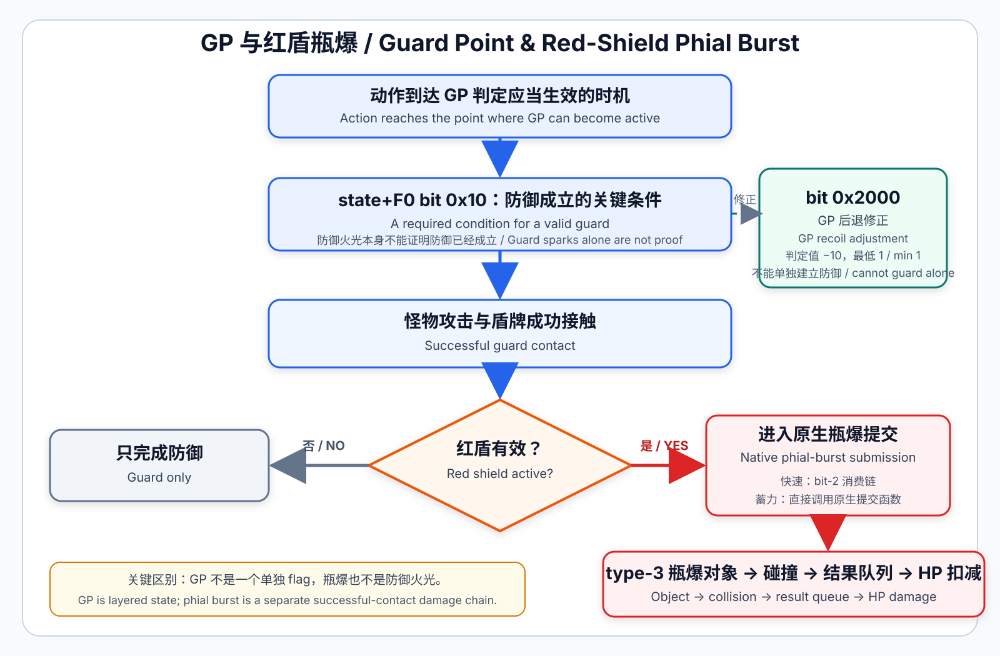

# 技术分析：MH4G / MH4U 盾斧 GP 与红盾瓶爆



这张图先给出整体关系。下文会分别说明：GP 何时能够挡住攻击、为什么 GP 会减小后退、游戏怎样确认一次成功接触，以及红盾瓶爆如何进入伤害结算。这四件事并不是同一个开关。

## 1. 先把四个问题分开

早期研究最容易出现的误解，是把“出现防御火光”“攻击被挡住”“GP 让后退变小”和“红盾瓶爆”看成同一个开关。v4 研究证明它们属于不同步骤：

```text
动作到达 GP 判定应当生效的时机
→ 游戏准备防御成立条件和 GP 后退修正
→ 怪物攻击与盾牌接触
→ 防御系统判断是否真正挡住攻击
→ 计算小／中／大后退及位移
→ 若本次是红盾 GP，再进入瓶爆对象、碰撞和伤害链
```

这也是为什么早期“复制一个状态位”只能得到部分效果：某个字段可能足以改变防御或后退，却不能自动补齐瓶爆；修改结果 Action 也只能改变防御后的表现，不能让原本没有 GP 的动作突然具备有效的 GP 防御判定。

## 2. GP 防御判定何时生效

日版 v1.2 中，`CA783C` 会根据当前动作、动作阶段和时间条件，通过两个通用辅助函数（helper）`B56160`／`B039B0`，设置或清除 `state+F0` 中的两个重要位：

```text
bit 0x10
bit 0x2000
```

v3 研究时，逻辑 motion ID `0x592` 是进入这套时序的重要动作身份。后续 v4 研究确认，最终补丁不需要再把快速变形斩原本的 `0x583` 身份替换成 `0x592`。快速动作自身已经会在正确时机发出一次可利用的 `mask=2` 状态更新。补丁只在当前玩家、目标 Action、请求 mask 和调用前状态全部匹配时，把这一次 mask 扩充为 `0x2012`，然后交回原来的 `B56160` 继续处理。

`0x2012` 不是新造出来的“GP 总开关”，而是这一次状态更新所需的三部分组合：

```text
0x0002  原生快速动作本来请求的 mask
0x0010  防御真正成立的条件
0x2000  GP 后退判定修正
--------------------------------
0x2012  最终交给原生 helper 的 mask
```

这也解释了为什么最终实现必须保留原生 `mask=2` 和准确时机：v4 不会持续强行写入状态，而是只在游戏本来就要更新状态的那一次调用中，补上已经验证的两个部分。

因此，v4 的正确表述是：

- `0x592` 帮助研究定位了原生 GP 身份和时序；
- 最终 v4 不再伪装成 `0x592`；
- v4 直接复用快速动作本身已经存在的原生状态建立时机。

原生 `0x592` 路线的结束过程也已经静态确认：进入后续阶段后，`CA783C` 会通过 `B039B0` 清除 `0x10` 和 `0x2000`。其中 `close=-1` 不是隐藏帧数，而是通过 `AF1D90 → AEEBC4` 判断当前动作是否自然结束。

最终快速 v4 不再使用 `0x592` 身份，因此不能把上面这条 `0x592` 关闭路线直接写成“快速 v4 由某个特定 Action 或 flag 关闭”。运行时重复测试已经确认快速动作结束后状态能够正常回收。最稳妥的结论是：补丁只在正确的原生更新时机让 GP 生效，后续由动作原本的生命周期完成收尾；本文不把尚未单独定位的快速关闭条件冒充为某个已证明的专用开关。

## 3. `bit 0x10`：防御是否真正成立

`B54EE0` 读取 `state+F0`，并在 `B55074` 检查 `bit 0x10`。调用点 `B018A8` 随后会立即使用它的返回结果，决定是否继续进入有效防御处理。

项目制作了一个可恢复的调用包装器，只在调用原始 `B54EE0` 时临时隐藏 `bit 0x10`，其他状态变化保持不变。结果是：

- 快速变形 GP 出现防御火光，但猎人仍被击飞；
- 长按 R 的普通防御也出现火光，但同样无法真正挡住攻击；
- 恢复原始调用后，两种防御都恢复正常。

因此，`bit 0x10` 是普通盾防和 GP 共用的关键防御条件，并不是 GP 专属标记。防御火光属于更早或不同的表现层；看到火光，只能说明盾牌发生了接触，不能证明攻击已经被真正挡住。

## 4. `bit 0x2000`：GP 防御性能修正

`B2804C` 会计算一个内部数值，游戏再用这个数值判断猎人应该小后退、中后退还是大后退。它读取 `state+F0` 并检查 `bit 0x2000`：

- 位不成立：保留原判定值；
- 位成立：判定值减 10，最低钳制为 1。

这里的 “-10” 不是猎人的面板防御力、伤害、耐力或动作帧数。

已经确认有两段后续代码会使用这个结果：

- `B0E5B0` 根据动作类别和若干阈值，选择小后退（0）、中后退（1）或大后退（2）；
- `B23B48` 按判定值选择后退位移 150、200 或 360。

这解释了早期动态结果：单独写入 `0x2000` 不能让防御成立；与 `0x10` 共存时，它会改善后退等级。玩家通常把这一效果描述为 GP 附带的防御性能加成。

`B2804C` 中还会使用查询编号 98／99／100，但这些编号在玩家界面中对应什么名称，目前尚未确认。本文不会替它们猜测名称；这不影响已经验证的 `0x2000` 处理路线。

## 5. 红盾瓶爆是一条独立的成功接触链

红盾瓶爆不由 `0x10` 和 `0x2000` 自动产生。

快速变形斩成功 GP 后，v4 只在当前 Action、接触对象和防御结果都匹配时，检查玩家状态中的 `state+0x60` 红盾计时：

- 红盾计时为 0：保留 GP，不设置瓶爆条件；
- 红盾计时非 0：设置 `state+0x489 bit 2`，把这次成功接触交给游戏原本的瓶爆处理链。

日版中已经确认的下游链路为：

```text
CA895C 设置 state+0x489 bit 2
→ B3791C / CA92A8
→ 创建 type-3 瓶爆对象
→ 内嵌主动碰撞记录
→ BD364C 登记碰撞
→ BDA990 / BD42B4 解析实体
→ BCFBEC / 919D0C 提交命中结果
→ 909930 消费结果队列
→ 925128 更新目标当前 HP
```

所以瓶爆不是单纯的画面特效。效果对象、碰撞提交和最终伤害属于同一条可追踪的原生链路。

## 6. 快速变形斩 GP v4 的两-hook 实现

快速变形斩独立版只需要两个原生时序 hook：

1. **GP 生效时机 hook**：在当前玩家的快速变形 Action 进入原生 mask-2、且调用前 `F0=1` 的精确时机，把 mask 扩充为 `0x2012`，再执行原 helper。也就是说，它只在 GP 防御判定本应开始生效的那一刻补齐所需状态。
2. **成功接触 hook**：只在快速变形成功防御的目标路径上检查红盾计时；红盾有效时设置瓶爆条件。

日版目标 Action 为：

```text
000B0400  不推动左摇杆的快速变形斩
001C0400  推动左摇杆的快速变形斩
```

该实现：

- 不写 motion ID；
- 不把快速动作伪装成普通变形；
- 不逐帧常驻写入状态；
- 不包含 logger 或计数器；
- 保留两种快速动画、普通变形斩和普通防御。

日版正式实现使用两个 hook，并在一段 264-byte 的空白代码区（code cave）中放置补丁逻辑。最终 IPS 一共有三条记录：两个 hook 加一段 code cave。USA／EUR 采用同样的行为设计，但地址和分支都在各自版本中重新定位。

## 7. 剑模式蓄力斩 GP 为什么需要不同的结果处理

剑模式蓄力保持阶段的 Action 为 `00340400`。很短或自动释放可能进入 `00330400`，适中释放可能进入 `00220400`。有限日志记录器（logger）证明，可利用的原生 mask 时机出现在“盾牌仍架在人物前方”的 `00340400` 蓄力阶段，而不是随后挥出攻击的阶段。

共享 GP 生效时机 hook 可以让该阶段获得 `0x10` 和 `0x2000`，但防御结果还需要按后退等级处理：

- 小后退／中后退：抑制会打断动作的结果切换，让蓄力继续；
- 大后退：放行原生结果，正常打断蓄力。

蓄力斩不会在同一时机读取快速变形使用的 `state+0x489 bit 2`。如果把这个位留在状态中等待以后读取，可能发生延迟触发。因此最终版会在确认当前动作、防御成功和红盾有效后，直接调用该版本已经定位的原生瓶爆提交函数。

这仍然不是自制视觉特效，而是调用游戏自身的完整 type-3 瓶爆对象创建和后续碰撞／伤害链。

## 8. 合并版结构

快速 v4 和蓄力斩 GP 都需要使用同一个 GP 生效时机入口，不能把两个独立 IPS 直接拼在一起。合并版采用一个共享分派器：

```text
共享 GP hook
├─ 000B0400：快速变形（不推动左摇杆）
├─ 001C0400：快速变形（推动左摇杆）
└─ 00340400：剑模式蓄力保持

快速成功接触 hook
└─ 红盾有效时进入 bit-2 原生瓶爆消费链

蓄力防御结果 hook
├─ 小／中后退：继续蓄力
├─ 大后退：原生打断
└─ 红盾有效：直接调用原生瓶爆提交函数
```

因此合并版使用三个 hook 和 792-byte cave。它已经完整包含快速变形斩 GP v4，不能再与独立快速 v4 同时安装。

## 9. 证据等级

### 已验证

- `bit 0x10` 是普通盾防和 GP 共用的实际防御成立条件；
- `bit 0x2000` 把内部后退判定值减 10，最低为 1；
- 后退等级和后退位移由不同消费者使用该值；
- 红盾瓶爆拥有独立的对象、碰撞、结果队列和 HP 伤害链；
- 快速 v4 两-hook 实现保留原动作身份，并通过三地区实机测试；
- 蓄力 GP 的小／中后退继续、大后退打断规则通过三地区测试；
- 合并版和独立快速版都完成安装、状态检查和安全恢复。

### 尚未穷尽

- 怪物多段攻击没有专项覆盖；
- 查询 98／99／100 的玩家可见名称仍未知；
- 现有测试没有观察到重复瓶爆，但不能据此声称已覆盖所有多段命中时序。
- 复用原生状态更新时间，不等于发现了一个被官方关闭的“隐藏快速 GP 功能”；现有证据只支持本项目对原生机制的重组与补齐。

## 10. v3 的历史价值

v3 不是“错误版本”。它完成了快速 GP、红盾瓶爆、两种输入分支、连续使用和状态回收的第一套完整工程实现，也为 v4 提供了稳定的 A 组基线。

但 v3 的 `0x592 → 0x583` overlay 同时改变了逻辑身份与资源生命周期，所以它证明的是“一套足以产生目标行为的组合”。v4 通过后续 A/B、状态位消费者、接触链和新动作移植，把这套组合进一步拆成了可独立解释的原生机制，并据此生成更精简的最终代码。
